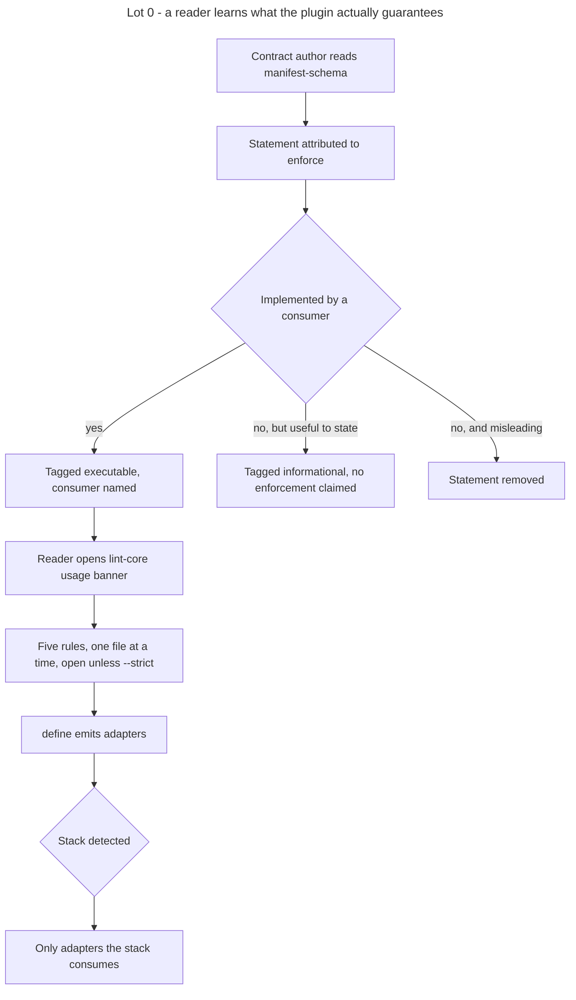

# Instruction: Lot 0 - truth of the discourse

## Feature

- **Summary**: strip the plugin of documented behaviour it does not implement, requalify the guarantees it does offer in the terms that are actually true, and tighten the prose that accumulated across bumps. Documentary change only, no rule and no runtime behaviour altered.
- **Stack**: `Markdown (Claude Code skills) · Node 20+ (lint-core.mjs, zero dependency) · JSON contract artifacts`
- **Branch name**: `feat/design-2-0/lot-0-truth`
- **Parent Plan**: `2026_07_23-design-2-0-guarantees-alignment-master.md`
- **Sequence**: `1 of 7`
- Confidence: 10/10
- Time to implement: 1 work unit

## Architecture projection

### Files to modify

- `plugins/design/skills/adjust/references/manifest-schema.md` - remove the background and a11y rules attributed to enforce; requalify invariants 1, 3, 4, 5, 6; tag every field executable or informational; compress the utility-first section
- `plugins/design/skills/enforce/actions/01-build-linter.md` - remove the `a11yRole` and `backgroundMismatch` severity keys from the `.lintrc.json` template
- `plugins/design/skills/enforce/SKILL.md` - declare the real perimeter of the portable linter instead of presenting it as the system gate
- `plugins/design/skills/enforce/adapters/lint-core.mjs` - usage banner stating the perimeter, comment blocks compressed; zero rule change
- `plugins/design/skills/define/actions/04-write-material.md` - condition adapter emission on the detected stack
- `plugins/design/references/write-system-procedure.md` - same conditioning
- `plugins/design/references/token-schema.md` - remove the claim that `enforce` validates the token path of a background and that a dead path is an `error` violation; no rule in `lint-core.mjs` performs it
- `plugins/design/agents/copycat.md` - remove the stack-specific enumeration of markup and preset artifacts; requalify the two-gate claim by naming which gate each half designates
- `plugins/design/adapters/measure/measure.py` - the module docstring names a project as the example of an SPA exposing page and viewport hooks; the example becomes the capability itself, with no project named. Docstring only, no behaviour change
- `plugins/design/references/design-system-contract.md` - same conditioning; executable/informational tagging of the layer contract
- `plugins/design/skills/define/references/profile-mobile-first.md` - same conditioning
- `plugins/design/.claude-plugin/plugin.json` - version 1.17.0
- `.claude-plugin/marketplace.json` - design entry to 1.17.0
- `index.json` - design entry to 1.17.0
- `README.md` - design line
- `plugins/design/README.md` - guarantees section rewritten to match what is implemented
- `plugins/design/CHANGELOG.md` - 1.17.0 entry carrying the rationale
- `aidd_docs/memory/design-plugin.md` - record the drift purge and the new version

### Files to create

- none

### Files to delete

- none as whole files. Deletions are internal: two severity keys in the `.lintrc.json` template, the background-rule and a11y-rule paragraphs of the enforce-consumption section, and the unimplemented clauses of invariants 3, 4 and 6.

## Applicable rules

| Tool   | Name                  | Path                                                    | Why it applies |
| ------ | --------------------- | ------------------------------------------------------- | -------------- |
| repo   | contributing          | `CONTRIBUTING.md`                                        | SemVer registered in three places, per-plugin CHANGELOG, skill anatomy, DRY through references |
| repo   | guideline-readme      | `memory/guideline-readme.md`                             | root README and plugin README updated on every version bump |
| repo   | guideline-claude-md   | `memory/guideline-claude-md.md`                          | shape of the generated instructions |
| repo   | dec-002               | `aidd_docs/internal/decisions/002-design-funnel-hybrid-pivot.md` | the WHAT/HOW boundary is out of scope and must not shift while requalifying the linter perimeter |
| claude | global-conventions    | `C:\Users\fxgui\.claude\CLAUDE.md`                       | pnpm, rtk prefix, no commit without explicit request |
| claude | plugins-marketplace   | `C:\Users\fxgui\.claude\rules\plugins-marketplace.md`    | edit the source under `plugins/<name>/skills/`, never the runtime cache |

## User Journey

## Risk register

| Risk | Impact | Mitigation |
| ---- | ------ | ---------- |
| A prose edit silently changes linter behaviour | the eight-fixture baseline breaks, downstream projects see new violations | `success_condition` pins the exit-code baseline 0 1 0 1 0 1 0 1; `lint-core.mjs` edits are restricted to comments and the usage banner |
| Removing an invariant reads as removing an intention | future contributors reintroduce the same fiction | each removed clause is restated in the CHANGELOG as "claimed, never implemented", and invariants 3, 4 and 6 are re-declared as informational rather than deleted outright |
| Tightening prose removes coverage | a field loses its documentation | the executable/informational tagging pass runs before the compression pass, so every field is enumerated before any line is cut |
| Invariant 5 requalification pre-empts Lot 1 | Lot 0 stops being deliverable alone | Lot 0 only tags invariant 5 informational (no consumer implements the version match); its replacement by per-artifact versions belongs to Lot 1 |

## Implementation phases

### Phase 1: Inventory the claims

> Enumerate every normative statement attributed to a consumer before touching anything.

#### Tasks

1. List every statement attributing a check to `enforce`, `diffuse` or a linter, across the whole criterion perimeter: `plugins/design/skills/`, `plugins/design/references/`, `plugins/design/agents/`, `plugins/design/adapters/`.
2. For each, locate the implementing code path in `lint-core.mjs` or an action's procedure.
3. Classify: implemented, not implemented but useful, not implemented and misleading.
4. Record the classification as the working list for phases 2 and 3.

#### Acceptance criteria

- [x] Every statement in the perimeter is classified.
- [x] Each "implemented" classification names the file and rule that implements it.

### Phase 2: Purge the unimplemented claims

> Nothing left in the plugin claims a check that no code performs.

#### Tasks

1. Remove the background-rule and a11y-rule paragraphs from the enforce-consumption section of `manifest-schema.md`.
2. Remove the `a11yRole` and `backgroundMismatch` severity keys from the `.lintrc.json` template in `01-build-linter.md`.
3. Rewrite invariant 4 (token-referenced backgrounds) as a contract-authoring rule with no lint claim.
4. Rewrite invariant 3 (layer 2 / layer 3 concordance) as a contract-authoring rule with no lint claim.
5. Rewrite invariant 6 (per-theme WCAG contrast) as a stated gap, explicitly not verified at this version.
6. Remove the same claim where it is restated in `token-schema.md` and in `agents/copycat.md`.

#### Acceptance criteria

- [x] `grep -rniE 'a11yRole|backgroundMismatch' plugins/design/skills plugins/design/references plugins/design/agents plugins/design/adapters` exits 1.
- [x] No sentence in the plugin attributes a check to `enforce` without naming the rule in `lint-core.mjs` that performs it.

### Phase 3: Requalify the guarantees actually offered

> The words name what the code does.

#### Tasks

1. Rewrite invariant 1: the vocabulary is open by default; it closes only under `--strict`, and only on BEM-shaped classes.
2. Carry that statement into the charter material produced by `define`, not only into the schema document.
3. Tag every contract field executable (with its named consumer) or informational.
4. Tag invariant 5 informational: no consumer verifies that the artifact versions match.
5. Rewrite the enforce `SKILL.md` opening so the portable linter is presented by its perimeter, never as the system gate.
6. Rewrite the `lint-core.mjs` usage banner with the same perimeter statement.

#### Acceptance criteria

- [x] Invariant 1 states the `--strict` condition and the BEM-shape condition.
- [x] Every contract field carries exactly one of the two tags, and every executable tag names a consumer.
- [x] The enforce `SKILL.md` states the linter perimeter within its first section.

### Phase 4: Stack-conditional adapter emission

> No adapter is emitted for a stack the project does not use.

#### Tasks

1. In `04-write-material.md`, replace the unconditional adapter emission with an emission conditioned on the detected stack.
2. Apply the same conditioning in `write-system-procedure.md`, `design-system-contract.md` and `profile-mobile-first.md`.
3. State the rule once in a reference and point the three other locations at it.

#### Acceptance criteria

- [x] No document instructs an unconditional emission of a stack-specific adapter.
- [x] The conditioning rule is written once and referenced three times.

### Phase 5: Tighten the prose

> Same coverage, fewer words.

#### Tasks

1. Compress the utility-first section of `manifest-schema.md` to its rules, moving rationale out.
2. Compress the `lint-core.mjs` comment blocks to what a maintainer needs to modify a rule.
3. Remove duplication between the enforce `SKILL.md` and its actions.
4. Move every retained rationale to the CHANGELOG entry.

#### Acceptance criteria

- [x] No rationale paragraph remains inside an instruction body.
- [x] No statement appears in both a `SKILL.md` and one of its actions.
- [x] Every field, rule and status enumerated in phase 1 is still documented.

### Phase 6: Version and release

> The bump is registered everywhere the marketplace expects it.

#### Tasks

1. Set 1.17.0 in `plugins/design/.claude-plugin/plugin.json`.
2. Set the design entry to 1.17.0 in `.claude-plugin/marketplace.json` and in `index.json`.
3. Update the design line in the root `README.md` and the guarantees section of `plugins/design/README.md`.
4. Write the 1.17.0 CHANGELOG entry listing each removed claim as "claimed, never implemented".
5. Update `aidd_docs/memory/design-plugin.md`.

#### Acceptance criteria

- [x] The three version registers agree on 1.17.0.
- [x] The CHANGELOG entry names every purged claim.

### Phase 7: Transverse writing criterion

> Exhaustive, agnostic, fewest words.

#### Acceptance criteria

- [x] `grep -rniE 'mauceri|scriptami|cerascan|suddenly|choix-narratifs' plugins/design/ --include=*.md --include=*.py --include=*.mjs --include=*.json` returns matches only in `CHANGELOG.md`, under `audits/`, and in `adapters/measure/configs/mentions-legales.json`. The first two are the exemptions the master grants inside this plugin. The third is a single named deferral: that file is deleted at Lot 4, which rewrites the configuration format it belongs to, so Lot 0 leaves it standing rather than half-neutralizing a file about to disappear. Comments and docstrings are inside the scope of this grep. Untracked local residue is not: run the grep over `git ls-files`-tracked paths.
- [x] No touched normative statement presupposes a specific stack. Relocating the platform-specific files is Lot 3's task and renaming the platform-named oracle API is Lot 4's, neither is this one's.
- [x] The count of statements classified in phase 1 is unchanged after phase 5, and the total line count of the touched instruction files is strictly lower than before phase 2.
- [x] Shared material lives once under `${CLAUDE_PLUGIN_ROOT}/references/`.

## Amendments

- 🤖 **A1 — `plugins/design/skills/adjust/actions/02-freeze.md` added to the files modified.** Line 163 read "C'est un invariant du contrat (vérifié par `enforce`)" about the `$version` parity between `components.json` and `design-system.md`. No rule of `lint-core.mjs` reads `design-system.md` at all, so the sentence falls squarely under Phase 2's acceptance criterion ("No sentence in the plugin attributes a check to `enforce` without naming the rule in `lint-core.mjs` that performs it") even though the file was not enumerated. Requalified in place: the invariant is held at that step and nothing re-checks it afterwards. One line, no procedural change.
- 🤖 **A2 — `plugins/design/skills/adjust/SKILL.md` added to the files modified.** The frontmatter and the artifact table named `components.json` "vocabulaire fermé", the exact word Phase 3 Task 1 requalifies. Left standing, the skill would have contradicted the invariant it points at. Renamed to "nomenclature déclarée" with a pointer to `manifest-schema.md § Invariants`.
- 🤖 **A3 — the "vocabulaire fermé" wording normalized across the whole plugin, not only in the schema document.** The phrase appeared in eight further files (`define/SKILL.md`, `destructure/SKILL.md` + two references, `diffuse/SKILL.md` + one action, `enforce/05-fidelity-gate.md`, `design-system-contract.md` layout comment). Phase 3 Task 2 asks to carry the open-by-default statement beyond the schema; leaving the contradicting phrase in eight places would have defeated it. Replaced by "vocabulaire du contrat", and the gate claim in `05-fidelity-gate.md` rewritten to name what the linter actually scans.
- 🤖 **A4 — `plugins/design/skills/enforce/actions/02-wire-gates.md` added to the files modified.** Phase 5 Task 3 (remove duplication between a `SKILL.md` and its actions) surfaced the adjacent case the transverse criterion also forbids: Étape 4 restated verbatim the two `success_condition` YAML blocks of `references/gate-wiring.md § Gate 2`. Replaced by a pointer.
- 🤖 **A5 — the adapter emission rule is written in `references/write-system-procedure.md`, not in `token-schema.md`.** Phase 4 Task 3 requires the rule once with three references to it. `token-schema.md` owns the *shape* of each adapter; `write-system-procedure.md` owns the *act* of emitting them and is already the shared procedure `define/04-write-material.md` follows. The three pointers are `define/04-write-material.md`, `references/design-system-contract.md` and `define/references/profile-mobile-first.md`.

- 🤖 **A6 — the silent contract resolution is fixed, not merely documented.** The baseline capture (see Log) showed `utility-dirty.html` returning 0 against the wrong contract. Documenting the correct invocation leaves the trap armed for every consumer whose markup happens to sit beside a foreign contract. This lot's subject is that a green run must not claim what it did not establish, so the defect is inside its scope even though no phase enumerated it. Two changes in `lint-core.mjs`, no rule touched: a guessed contract directory is accepted only when it is the sole contract of its tree, otherwise exit 2 naming the candidates, per the master's exit-code space; and every run prints the resolved contract and its resolution route. The eight-fixture baseline with explicit contract directories is unchanged, `0 1 0 1 0 1 0 1`; the bare invocation now exits 2 instead of silently passing. Recorded in the CHANGELOG under a `Corrigé` heading, and the "documentaire uniquement" claim of the 1.17.0 entry corrected accordingly — leaving it would have reintroduced, in this very lot, the class of false statement the lot removes.

## Log

**2026-07-23 — iteration 1, all seven phases executed on `feat/design-2-0/lot-0-truth`.**

- The eight-fixture baseline was captured **before** any edit and re-verified after each pass touching `lint-core.mjs`. First capture returned `0 1 0 1 0 1 0 0`: without an explicit contract directory, resolution falls back to the markup file's own directory, which holds the BEM contract, so `utility-dirty.html` was linted against the wrong contract and passed. Each family must be run against its own contract directory. The smoke-test example in `01-build-linter.md § Étape 4` now passes the contract directory explicitly for the same reason.
- Invariants 3 and 4 of `manifest-schema.md` were **not** fiction. Both are implemented — by `adjust/02-freeze.md § Étape 2 Règles 3 et 4`, at freeze time, not by `enforce` at lint time. Naming the real consumer and the real moment is more accurate than deleting, which is why the plan's "deletion" of their clauses became a requalification.
- Invariant 6 (per-theme WCAG contrast) has no consumer anywhere: not `lint-core.mjs`, not `adjust`, not the fidelity oracle. Declared as a gap, with the consequence stated plainly — the contrast conformity of a frozen contract is not established.
- Phase 7 grep over `git ls-files`-tracked paths returns matches in exactly three files: `CHANGELOG.md`, `audits/2026_07_design-cycle-critique.md`, and `adapters/measure/configs/mentions-legales.json` — the two master exemptions plus the single deferral the plan grants to Lot 4.
- Line budget: 223 added, 269 removed across the instruction perimeter, net −46, criterion met. `enforce/SKILL.md` and `write-system-procedure.md` grew (perimeter section, canonical emission rule); `manifest-schema.md` and `lint-core.mjs` shrank more.
- Not committed — the repository convention requires an explicit request.

## Validation flow demonstration

1. Run the eight fixtures through `lint-core.mjs` and confirm the exit codes are 0 1 0 1 0 1 0 1, unchanged.
2. Grep the plugin for the purged rule names and confirm no match.
3. Open `manifest-schema.md` and read invariant 1: it must state the open-by-default behaviour.
4. Open the enforce `SKILL.md` and confirm the linter perimeter is stated before any gate claim.
5. Confirm the three version registers read 1.17.0.
