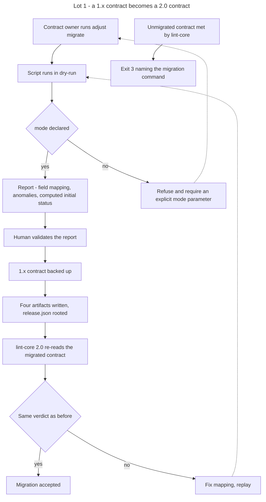

# Instruction: Lot 1 - split contract and version identity

## Feature

- **Summary**: the contract stops being a monolith. Component anatomy, transverse policies, oracle targets and release identity become four addressable artifacts. `release.json` is the root: design-system version, per-artifact version, hash of the source each artifact derives from, provenance, maturity status. A shipped script migrates 1.x contracts, including degenerate ones. The 1.x read path is removed, and its absence is diagnosed rather than crashed.
- **Stack**: `Markdown (Claude Code skills) · Python 3.11+ (migrate-contract.py) · Node 20+ (lint-core.mjs, zero dependency) · JSON contract artifacts`
- **Branch name**: `feat/design-2-0/lot-1-split`
- **Parent Plan**: `2026_07_23-design-2-0-guarantees-alignment-master.md`
- **Sequence**: `2 of 7`
- Confidence: 9/10
- Time to implement: 2 work units

## Field redistribution

Nothing is invented. Every field comes from the 1.x contract.

| Source (1.x) | Target (2.0) |
| ------------ | ------------ |
| `tokens.json` | unchanged, layer 1 untouched |
| `components.*` (base, elements, modifiers, backgrounds, a11y) | `components.json` |
| `usage.*`, `$utilityPrefixes`, `mode` | `policies.json` |
| `oracle.*` (check_text, props, collections, ack) | `oracle.json` |
| `$version` of each artifact, version of the charter document | `release.json` |
| new: source hashes, provenance, maturity status | `release.json` |
| new: adapter correspondence table | `policies.json` |
| existing Markdown deviation ledger | `deviations.json`, Lot 4 |

Invariant 5 disappears: `release.json` declares real per-artifact versions, so a version skew becomes data, not a violation.

## Architecture projection

### Files to modify

- `plugins/design/skills/enforce/adapters/lint-core.mjs` - read the four artifacts; detect a 1.x contract by the absence of `release.json` and exit 3 with the migration command; remove the 1.x read path; exit 2 keeps its pre-existing invocation-error meaning
- `plugins/design/skills/adjust/actions/02-freeze.md` - write four artifacts plus `release.json` with hashes, provenance and the status returned by `status.py`
- `plugins/design/skills/adjust/SKILL.md` - route to the migration action
- `plugins/design/skills/adjust/references/manifest-schema.md` - reduced to the `components.json` schema, pointing at the new contract schema for the rest
- `plugins/design/references/design-system-contract.md` - three layers become four artifacts rooted by `release.json`
- Every other file describing the contract as three layers, so no residue survives the split: `plugins/design/references/token-schema.md`, `correspondence-table-template.md`, `write-system-procedure.md`, `deviation-ledger-template.md`, `plugins/design/agents/copycat.md`, `plugins/design/skills/adjust/actions/01-arbitrate.md`, `plugins/design/skills/define/SKILL.md`, `define/actions/04-write-material.md`, `plugins/design/skills/destructure/SKILL.md`, `destructure/actions/01-challenge.md`, `plugins/design/skills/enforce/actions/02-wire-gates.md`, `03-lint-instances.md`, `plugins/design/skills/harness/SKILL.md`
- `plugins/design/skills/enforce/fixtures/components.json` and `tokens.json` - migrated to 2.0
- `plugins/design/skills/enforce/fixtures/retrofit/`, `themed/`, `utility/` - same migration
- `plugins/design/skills/adjust/evals/scenarios.json` - scenario routing to the migration action
- `plugins/design/skills/enforce/evals/scenarios.json` - scenario covering the 1.x detection
- `plugins/design/.claude-plugin/plugin.json`, `.claude-plugin/marketplace.json`, `index.json`, `README.md`, `plugins/design/README.md`, `plugins/design/CHANGELOG.md` - 2.0.0
- `aidd_docs/memory/design-plugin.md` - new contract shape

### Files to create

- `plugins/design/tools/migrate-contract.py` - 1.x monolith to four artifacts; `--contract` pass; `--dry-run` report; refuses to guess an undeclared mode
- `plugins/design/tools/status.py` - the single status computation, from the facts a migration can observe: charter layer present or absent, checks run or not run. Lot 5 extends this same tool; no other code computes a status.
- `plugins/design/skills/adjust/actions/03-migrate.md` - action driving the script, dry-run report, human validation, backup, non-regression check
- `plugins/design/references/contract-schema.md` - schema of the four artifacts and of the release root, each field tagged executable or informational
- `plugins/design/skills/enforce/fixtures/migration/nominal-1x/` - complete 1.x input
- `plugins/design/skills/enforce/fixtures/migration/nominal-2x/` - expected output for the nominal case
- `plugins/design/skills/enforce/fixtures/migration/no-layer-3/` - charter document absent
- `plugins/design/skills/enforce/fixtures/migration/version-skew/` - artifact versions disagreeing
- `plugins/design/skills/enforce/fixtures/migration/mode-undeclared/` - `mode` absent with a non-empty component set
- `aidd_docs/internal/decisions/005-design-2-0-contract-split.md` - ADR recording the split, the assumed break and the tooled migration

### Files to delete

- none as whole files. The 1.x read path inside `lint-core.mjs` is removed as code; `manifest-schema.md` loses the sections that move to `contract-schema.md`.

## Applicable rules

| Tool   | Name                  | Path                                                    | Why it applies |
| ------ | --------------------- | ------------------------------------------------------- | -------------- |
| repo   | contributing          | `CONTRIBUTING.md`                                        | MAJOR bump registered in three places, CHANGELOG entry, each action carries a verifiable Test, DRY through references |
| repo   | guideline-readme      | `memory/guideline-readme.md`                             | both READMEs restate the contract shape |
| repo   | dec-002               | `aidd_docs/internal/decisions/002-design-funnel-hybrid-pivot.md` | the WHAT/HOW boundary is unchanged by the split |
| claude | global-conventions    | `C:\Users\fxgui\.claude\CLAUDE.md`                       | rtk prefix, no commit without explicit request |
| claude | plugins-marketplace   | `C:\Users\fxgui\.claude\rules\plugins-marketplace.md`    | edit the source, never the runtime cache |

## User Journey

## Risk register

| Risk | Impact | Mitigation |
| ---- | ------ | ---------- |
| Migration silently changes the verdict | a project believes it is conformant when the vocabulary shifted | the non-regression check is the central acceptance criterion: the same files must yield the same verdict before and after, pinned by `fixtures/migration/` |
| Unmigrated contracts break with no diagnosis | six frozen contracts lose their gate with a parse error | `lint-core.mjs` detects the absence of `release.json` and exits 3 with the migration command; no old-format parsing, no dual path |
| The split leaves prose describing three layers | the doc-to-code fiction purged at Lot 0 is reintroduced by omission | the file list above enumerates every file matching the three-layer vocabulary, and a residual grep is an acceptance criterion of phase 6 |
| The script guesses a mode | the pre-existing vacuity bug is carried into 2.0 | with `mode` undeclared and a non-empty component set, the script refuses and requires an explicit parameter |
| Layer 3 absent blocks the migration | a contract cannot move to 2.0 at all | `release.json` records layer 3 as absent and caps the maturity status; migration proceeds |
| The status is computed in two places | Lot 1 and Lot 5 drift on the same rule | `status.py` ships here and is the only implementation; Lot 5 extends it with the contrast and state inputs and adds opposability, it does not reimplement it |
| The split loses a field | a contract silently degrades | the redistribution table above is exhaustive and is restated in `contract-schema.md`; the nominal fixture pair proves round-trip completeness |

## Implementation phases

### Phase 1: Specify the four artifacts

> The schema exists before the code that writes it.

#### Tasks

1. Write `contract-schema.md`: `components.json`, `policies.json`, `oracle.json`, `release.json`.
2. Tag every field executable with its named consumer, or informational.
3. Specify `release.json` as the root: design-system version, per-artifact version, per-artifact source hash, provenance, maturity status field. The status is written by `status.py` and read by nothing at this lot; Lot 5 makes it opposable.
4. Specify the adapter correspondence table in `policies.json`: for each entry, the produced artifact and its real consumer.
5. Reduce `manifest-schema.md` to the `components.json` schema and point at `contract-schema.md`.
6. Rewrite `design-system-contract.md` around four artifacts and a release root.
7. State the disappearance of invariant 5: per-artifact versions are declared, not required to match.

#### Acceptance criteria

- [ ] Every field of the redistribution table appears exactly once in the new schema.
- [ ] Every field carries one tag, and every executable tag names a consumer.
- [ ] No field is documented in two places.

### Phase 2: Migration fixtures

> The classes of degenerate case are frozen before the script exists.

#### Tasks

1. Build `fixtures/migration/nominal-1x/` and its expected `nominal-2x/` output.
2. Build `no-layer-3/`: charter document absent.
3. Build `version-skew/`: artifact versions disagreeing.
4. Build `mode-undeclared/`: `mode` absent with a non-empty component set.
5. Name every fixture by its class of case; no fixture carries a project name or a stack marker.

#### Acceptance criteria

- [ ] Four fixture directories exist, named by class of case.
- [ ] The nominal pair covers every field of the redistribution table.
- [ ] No fixture contains a project name, a real URL or a stack-specific selector.

### Phase 3: Migration script

> One idempotent, replayable pass over the contract.

#### Tasks

1. Implement `status.py`, taking a contract directory and returning one of `extracted`, `normalized`, `validated`, `production-ready` from two observable facts at this lot: charter layer present or absent, checks run or not run.
2. Implement `migrate-contract.py` with a `--contract` pass and a `--dry-run` mode. It obtains the initial status by calling `status.py`; it contains no status rule of its own.
3. Dry-run output: field mapping, detected anomalies, the status returned by `status.py`, adapter table derived from the adapters actually present.
4. Refuse an undeclared mode with a non-empty component set: exit 2 naming `--mode`, per the master's exit-code table, which reserves 2 for a decision the tool declines to guess.
5. Record layer-3 absence in `release.json` and cap the status accordingly.
6. Record skewed versions as declared per-artifact versions.
7. Back up the 1.x contract before writing.
8. Make a second run over an already migrated contract a no-op.

#### Acceptance criteria

- [ ] `--dry-run` writes nothing to disk.
- [ ] Each degenerate fixture produces the documented outcome and the exit code the master's table assigns: 0 for `no-layer-3` and `version-skew`, 2 for `mode-undeclared` without `--mode`.
- [ ] Running the script twice produces identical output and no diff on the second run.
- [ ] The derived adapter table lists every adapter present, each with a declared consumer.
- [ ] The four status literals `extracted`, `normalized`, `validated` and `production-ready` appear in `plugins/design/tools/status.py` and in no other file under `plugins/design/tools/`.

### Phase 4: Migration action

> The skill drives the script; it does not reimplement it.

#### Tasks

1. Write `03-migrate.md`: inputs, dry-run, human validation of the report, write, non-regression check.
2. Specify the non-regression check: the 2.0 linter re-reads the migrated contract and must return the same verdict on the same files.
3. Route the action from the `adjust` SKILL.
4. Add the eval scenario.

#### Acceptance criteria

- [ ] The action carries a verifiable Test section.
- [ ] The action contains no logic the script already implements.
- [ ] The eval scenario routes a migration request to `03-migrate`.

### Phase 5: Linter read path

> One format, one path, one diagnosis.

#### Tasks

1. Read `components.json`, `policies.json`, `oracle.json` and `release.json`.
2. Take the mode from `policies.json`; stop inferring it from an empty component set.
3. Remove the 1.x read path entirely.
4. Detect the absence of `release.json` and exit 3 printing the migration command, leaving exit 2 to its pre-existing invocation-error meaning.
5. Migrate the four existing fixture sets to 2.0.

#### Acceptance criteria

- [ ] The eight fixtures, taken in the master's fixture enumeration order, reproduce the exit-code baseline 0 1 0 1 0 1 0 1.
- [ ] A 1.x fixture exits 3 with the migration command, never 0 and never a raw parse error.
- [ ] A call with a missing or unreadable argument still exits 2.
- [ ] No code path parses the 1.x format.
- [ ] No hard-coded design value is introduced into the linter.

### Phase 6: Version, ADR and release

> The break is recorded where a consumer will look for it.

#### Tasks

1. Set 2.0.0 in the three version registers.
2. Write ADR 005: the split, the assumed break, the tooled migration, the WHAT/HOW boundary left untouched.
3. Write the 2.0.0 CHANGELOG entry with the redistribution table and the migration command.
4. Update both READMEs and `aidd_docs/memory/design-plugin.md`.

#### Acceptance criteria

- [ ] The three version registers agree on 2.0.0.
- [ ] The CHANGELOG names the break and the migration command.
- [ ] ADR 005 exists and references DEC-002 as unchanged.
- [ ] `grep -rniE 'trois couches|three layers|layer 3|couche 3' plugins/design/skills plugins/design/references plugins/design/agents plugins/design/adapters` returns matches only where the phrase designates the charter document as an input of the contract, never the contract's own shape. The CHANGELOG and the ADR are outside this grep scope.

### Phase 7: Transverse writing criterion

> Exhaustive, agnostic, fewest words.

#### Acceptance criteria

- [ ] No project name appears in the schema, the fixtures, the action or the script messages.
- [ ] Degenerate cases are named as classes of case.
- [ ] No stack is presupposed by the contract or by the script.
- [ ] No duplication between `adjust/SKILL.md` and `03-migrate.md`; shared material lives in `references/contract-schema.md`.

## Amendments

## Log

## Validation flow demonstration

1. Run the migration script in dry-run against each migration fixture and read the four reports.
2. Confirm `mode-undeclared` is refused without an explicit mode and accepted with one.
3. Migrate the nominal fixture and diff the result against the expected 2.0 output.
4. Run the eight linter fixtures and confirm the exit-code baseline is unchanged.
5. Point the linter at an unmigrated 1.x fixture and confirm exit 3 with the migration command, then call it with a missing argument and confirm exit 2.
6. Run the migration a second time on an already migrated contract and confirm a no-op.
