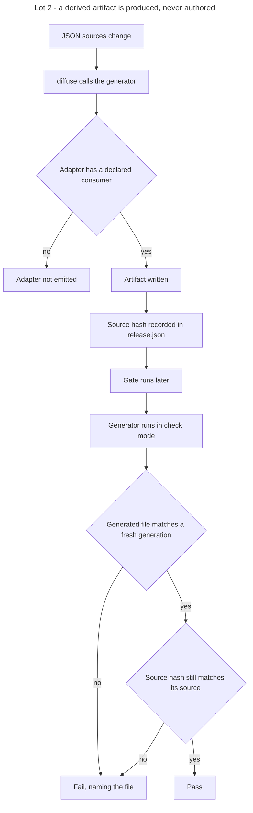

# Instruction: Lot 2 - deterministic generation

## Feature

- **Summary**: derived artifacts stop depending on the model or the prompt. A versioned generator shipped by the plugin produces the token stylesheet, the platform theme file and the stack adapters from the JSON sources. `diffuse` calls it. A drift gate fails when a generated artifact was hand-edited or when it no longer matches the source hash recorded in `release.json`. An adapter with no declared consumer is not emitted. The deviation ledger view is out of scope here: its structured source does not exist before Lot 4, which adds both the source and its view to this same generator.
- **Stack**: `Markdown (Claude Code skills) · Python 3.11+ (generate.py) · Node 20+ (lint-core.mjs) · JSON contract artifacts`
- **Branch name**: `feat/design-2-0/lot-2-generate`
- **Parent Plan**: `2026_07_23-design-2-0-guarantees-alignment-master.md`
- **Sequence**: `3 of 7`
- Confidence: 9/10
- Time to implement: 2 work units

## Architecture projection

### Files to modify

- `plugins/design/references/token-schema.md` - the emission specification becomes the normative source of the generator, not an instruction to a model
- `plugins/design/skills/diffuse/SKILL.md` - generation is a call, not an authoring step
- `plugins/design/skills/diffuse/actions/02-render.md` - invoke the generator; stop describing file contents to write
- `plugins/design/skills/define/actions/04-write-material.md` - invoke the generator for derived material; keep authoring for source material only
- `plugins/design/skills/adjust/actions/02-freeze.md` - record source hashes for every generated artifact in `release.json`
- `plugins/design/skills/diffuse/evals/scenarios.json` and `plugins/design/skills/define/evals/scenarios.json` - scenarios covering the generator call
- `plugins/design/.claude-plugin/plugin.json`, `.claude-plugin/marketplace.json`, `index.json`, `README.md`, `plugins/design/README.md`, `plugins/design/CHANGELOG.md` - 2.1.0
- `aidd_docs/memory/design-plugin.md` - generation is deterministic from this version

### Files to create

- `plugins/design/tools/generate.py` - deterministic generator; `--check` drift mode; emits only adapters with a declared consumer

### Files to delete

- none as whole files. The instruction bodies that described artifact contents for a model to write are removed, their normative content having moved to the generator specification.

## Applicable rules

| Tool   | Name                  | Path                                                    | Why it applies |
| ------ | --------------------- | ------------------------------------------------------- | -------------- |
| repo   | contributing          | `CONTRIBUTING.md`                                        | MINOR bump in three places, CHANGELOG, verifiable Test per action, DRY through references |
| repo   | guideline-readme      | `memory/guideline-readme.md`                             | both READMEs restate what is generated |
| repo   | dec-002               | `aidd_docs/internal/decisions/002-design-funnel-hybrid-pivot.md` | the generator emits WHAT artifacts only; stack rendering stays with the pivots |
| claude | global-conventions    | `C:\Users\fxgui\.claude\CLAUDE.md`                       | rtk prefix, no commit without explicit request |
| claude | plugins-marketplace   | `C:\Users\fxgui\.claude\rules\plugins-marketplace.md`    | edit the source, never the runtime cache |

## User Journey

## Risk register

| Risk | Impact | Mitigation |
| ---- | ------ | ---------- |
| Generated output is not byte-stable | the drift gate produces false failures | deterministic ordering and formatting are an explicit requirement; the success condition diffs two consecutive generations |
| The generator diverges from the linter's variable derivation | valid tokens are rejected by the gate | the path-to-variable transform is specified once in `token-schema.md` and both consumers derive from it in the same direction |
| A legitimate hand edit is needed | the drift gate blocks delivery | the correct answer is a source change plus a regeneration; the gate message states this and never offers an ignore flag |
| A stack-specific emission leaks into the generator | the plugin stops being agnostic | emissions are selected by the adapter correspondence table declared in the contract, never by a hard-coded stack branch |
| Existing adapter names are not canonical | the drift gate cannot locate the artifact | the correspondence table from Lot 1 supplies the artifact path and its consumer for every entry |

## Implementation phases

### Phase 1: Specify the generator

> The emission rules become code-facing before any code is written.

#### Tasks

1. Rewrite `token-schema.md` emission sections as a generator specification: inputs, outputs, ordering, formatting, resolution of aliases and themes.
2. Specify the path-to-variable transform once, in the direction both the generator and the linter use.
3. Specify the artifact set: token stylesheet, platform theme file, stack adapter selected by the correspondence table. The specification is written so a further artifact can be appended without altering the existing three; Lot 4 appends the ledger view.
4. Specify the determinism requirement: identical inputs produce byte-identical outputs.

#### Acceptance criteria

- [ ] Each generated artifact has a specification naming its inputs and its ordering.
- [ ] The path-to-variable transform is written once and referenced by both consumers.
- [ ] No specification branches on a named stack.

### Phase 2: Implement the generator

> One tool, one output set, no model in the loop.

#### Tasks

1. Implement `generate.py` reading the four contract artifacts.
2. Emit the token stylesheet, including theme-scoped blocks.
3. Emit the platform theme file.
4. Emit the stack adapter for each entry of the correspondence table that declares a consumer; skip entries without one.
5. Enforce deterministic ordering and formatting.

#### Acceptance criteria

- [ ] Two consecutive runs produce byte-identical trees.
- [ ] No adapter without a declared consumer is emitted.
- [ ] The generator contains no stack name outside the correspondence table lookup.

### Phase 3: Drift gate

> A generated artifact that was touched, or that no longer follows its source, fails.

#### Tasks

1. Implement `--check`: regenerate into a temporary tree and compare against the artifacts on disk.
2. Compare each source hash recorded in `release.json` against the current source.
3. Fail naming the offending file and the reason, hand edit or stale hash.
4. Make `adjust` freeze record the hashes the check reads.

#### Acceptance criteria

- [ ] A hand-edited generated file makes `--check` exit 1, and the message names that file.
- [ ] A source changed without regeneration makes `--check` exit 1, and the message names the stale hash.
- [ ] A clean tree makes `--check` exit 0.
- [ ] No flag suppresses a drift failure.

### Phase 4: Wire the skills to the generator

> Skills call, they do not author.

#### Tasks

1. Rewrite `diffuse/02-render.md` to invoke the generator.
2. Rewrite the derived-material section of `define/04-write-material.md` to invoke the generator; keep authoring only for source material.
3. Remove from both skills the prose that described artifact contents.
4. Update the eval scenarios.

#### Acceptance criteria

- [ ] No action instructs writing a generated artifact by hand.
- [ ] The generation instruction appears once and is referenced elsewhere.
- [ ] The eval scenarios cover the generator call.

### Phase 5: Version and release

#### Tasks

1. Set 2.1.0 in the three version registers.
2. Write the CHANGELOG entry with the rationale for determinism.
3. Update both READMEs and `aidd_docs/memory/design-plugin.md`.

#### Acceptance criteria

- [ ] The three version registers agree on 2.1.0.
- [ ] The CHANGELOG names the artifacts that stop being authored by hand, and states that a hand edit is now a drift failure with no ignore flag.

### Phase 6: Transverse writing criterion

> Exhaustive, agnostic, fewest words.

#### Acceptance criteria

- [ ] No project name appears in the generator, its specification or its messages.
- [ ] No normative example presupposes a stack.
- [ ] The instruction files touched are shorter than before while covering every emitted artifact.
- [ ] No duplication between `diffuse/SKILL.md`, its actions and `token-schema.md`.

## Amendments

- **A1 — `define` ne peut pas appeler le générateur.** Phase 4 tâche 2 demandait d'invoquer le générateur depuis `define/04-write-material`. Impossible : `define` a interdiction d'écrire `release.json` et `policies.json`, qui sont les entrées **requises** du générateur. Résolution : `define` écrit `tokens.json` + la charte et **détecte** les rôles consommateurs en § Provenance ; les artefacts dérivés n'existent qu'à partir du figeage (`adjust/02-freeze`). L'intention du lot est tenue — aucun modèle n'écrit d'artefact dérivé — sans casser l'invariant de séparation des phases.
- **A2 — branche.** Travail porté par `feat/design-2-0`, pas par une branche `…/lot-2-generate`.
- **A3 — renommage `config-gen.py` fait, et fait additivement.** Le CHANGELOG 2.0.1 § Reporté justifiait le report par « le Lot 2 touche déjà ce fichier » : c'est faux, `config-gen.py` n'est pas dans la liste de fichiers du Lot 2. La promesse est honorée quand même, mais **sans rupture** — anciens drapeaux conservés en alias, anciennes clés de config lues en repli par `measure.py` et `screenshot.py`. Une 2.1.0 est mineure : retirer un drapeau requis y serait illégitime. La fenêtre de rupture reste disponible pour une majeure.
- **A4 — critère « fichiers d'instruction plus courts qu'avant » : non tenu, assumé.** Décomptes en mots : `02-freeze` +132, `02-render` +116, `write-system-procedure` +84, `diffuse/SKILL` +65, `04-write-material` +8, `html-css` +11. Après passe de compression (tables resserrées, redites supprimées), le solde reste positif : le lot **ajoute un gate obligatoire et un enregistrement de dérive** à trois points de l'entonnoir. Documenter une obligation nouvelle en moins de mots qu'avant supposerait de retirer de la norme. Les trois autres critères de la Phase 6 sont tenus. Le critère reste valable pour les lots qui remplacent plutôt qu'ils n'ajoutent.
- **A5 — résidus stack/projet laissés au Lot 3.** `references/token-schema.md § Adapter: Tailwind` (section entière nommant une plateforme) et `adapters/measure/configs/mentions-legales.json` (nom de projet). Le plan maître assigne la **relocalisation** au Lot 3, qui ouvre les trois pivots. Traitement Lot 2, minimal et non relocalisant : un chapeau sur la section rappelle que ces deux artefacts sont les rôles `stylesheet source` / `build configuration` du générateur, ne s'écrivent pas à la main, et que la section est en attente de relocalisation.
- **A6 — fixtures figées avec leurs dérivés.** Les contrats `fixtures/` et `fixtures/themed/` portent désormais `release.json § generated` **et** les artefacts correspondants sous `adapters/`. Sans cela le `--check` des fixtures échouait en permanence (« generated, then deleted ») — un contrat de test doit être un contrat cohérent. `fixtures/utility` et `fixtures/retrofit` ne déclarent aucun `consumer` : rien à émettre, exit 0.

## Log

- **2026-07-24** — Lot 2 livré sur `feat/design-2-0`. `tools/generate.py` créé (seul producteur, émetteurs indexés par rôle de consommateur), `token-schema.md § Generator specification` + `§ Path-to-variable transform`, `contract-schema.md § Enregistrement de dérive`, `policies.json § adapters[]` promu exécutable. Câblages : `adjust/02-freeze` génère après `release.json`, `diffuse/02-render` Étape 0 = `--check` bloquant, `define/04-write-material` détecte sans écrire (cf. A1). Bonus hors périmètre : renommage additif des drapeaux de `config-gen.py` (cf. A3). Version 2.1.0 dans les trois registres. Non commité — le commit reste à la main de l'utilisateur.

## Validation flow demonstration

1. Generate from the fixture contract into two temporary trees and diff them: identical.
2. Hand-edit one generated file and run the check: fails naming that file.
3. Change a source without regenerating and run the check: fails on the stale hash.
4. Remove the consumer declaration of one adapter and regenerate: that adapter is not emitted.
5. Confirm the three version registers read 2.1.0.

## Verification run — 2026-07-24

| # | Contrôle | Commande | Résultat |
|---|---|---|---|
| 1 | Déterminisme | `generate.py --contract fixtures --out g1` puis `--out g2`, `diff -r g1 g2` | exit 0, arbres identiques octet pour octet (3 artefacts, 1 skip) |
| 2 | Arbre intact | `generate.py --check --contract fixtures` | exit 0 |
| 3 | Retouche manuelle | édition de `g1/adapters/tokens.css` puis `--check` | exit 1, message nommant le fichier |
| 4 | Source périmée | hash falsifié dans `release.json` puis `--check` | exit 1, `recorded` / `current` affichés |
| 5 | Entrée sans `consumer` | `adapters/legacy.styl` dans `policies.json` | non émis, `skipped … no declared consumer` sur stderr |
| 6 | Contrat 1.x | `--contract fixtures/migration` | exit 3 + commande de migration |
| 7 | Répertoire absent | `--contract fixtures/nope` | exit 2 |
| 8 | Aucun consommateur déclaré | `--check --contract fixtures/utility`, idem `fixtures/retrofit` | exit 0, `Nothing to emit` |
| 9 | Thèmes | `fixtures/themed` généré puis `--check` | exit 0 ; CSS `:root` + `.dark` + `[data-theme="grimoire"]`, mêmes noms de variables |
| 10 | Non-régression linter | baseline des huit fixtures, ordre lexicographique | `0 1 0 1 0 1 0 1` — inchangée |
| 11 | Registres de version | `plugin.json`, `marketplace.json`, `index.json` | 2.1.0 concordants (diff : exactement 3 lignes) |
| 12 | Agnosticité du générateur | grep noms de projet et de plateforme dans `tools/` | aucune occurrence |
