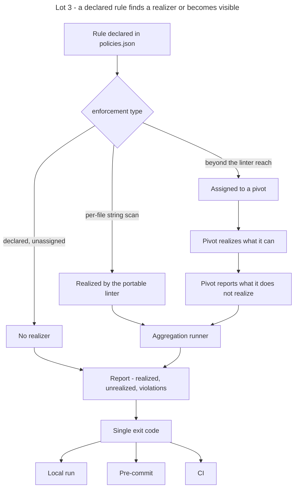

# Instruction: Lot 3 - distributed enforcement

## Feature

- **Summary**: the portable linter stays a minimal per-file string scanner with no dependencies, and its perimeter is declared, never presented as the system gate. Rules beyond its reach are declared in `policies.json` with a typed `enforcement` and a pivot target. The pivots gain an obligation: realize the rules assigned to them and report the ones they do not realize. A rule without a realizer is visible, never silent. An aggregation runner discovers its targets from configuration and returns the same exit code locally, in pre-commit and in CI. Because this lot opens the three pivots, it also carries the relocation the master assigns to it: the platform-specific material still sitting under `plugins/design/` moves to the pivot that owns that platform.
- **Stack**: `Markdown (Claude Code skills) · Python 3.11+ (run-gates.py) · Node 20+ (lint-core.mjs, zero dependency) · JSON contract artifacts`
- **Branch name**: `feat/design-2-0/lot-3-enforcement`
- **Parent Plan**: `2026_07_23-design-2-0-guarantees-alignment-master.md`
- **Sequence**: `4 of 7`
- Confidence: 9/10
- Time to implement: 3 work units, the third carried by the relocation

## Assumed consequence

The runner is Python. Python therefore becomes a pre-commit prerequisite on every consuming project, including those whose source is pure JavaScript. This is stated explicitly in `references/gate-wiring.md` and in the CHANGELOG. `lint-core.mjs` stays Node and is invoked by the runner.

## Architecture projection

### Files to modify

- `plugins/design/skills/enforce/actions/02-wire-gates.md` - ship the aggregation runner; wiring points target the runner, not a per-file loop
- `plugins/design/skills/enforce/references/gate-wiring.md` - one runner, one exit code, three call sites; state the Python prerequisite
- `plugins/design/skills/enforce/actions/04-pivot.md` - emit the assigned rules and collect what the pivot reports as unrealized
- `plugins/design/references/sc-pivot-contract.md` - add the report-back obligation to the pivot contract
- `plugins/design/skills/enforce/SKILL.md` - the linter perimeter, the runner, and the declared-rule registry as three distinct things
- `plugins/design/skills/enforce/adapters/lint-core.mjs` - emit machine-readable output the runner can aggregate; no new rule
- `plugins/design/skills/enforce/evals/scenarios.json` - scenario covering the runner and the unrealized report
- `plugins/sc-css/skills/design-bridge/**` - realize the report-back obligation; MINOR bump
- `plugins/sc-js/skills/design-bridge/**` - same
- `plugins/sc-php/skills/design-bridge/**` - same
- `plugins/design/.claude-plugin/plugin.json`, `plugins/sc-css/.claude-plugin/plugin.json`, `plugins/sc-js/.claude-plugin/plugin.json`, `plugins/sc-php/.claude-plugin/plugin.json`, `.claude-plugin/marketplace.json`, `index.json`, `README.md`, `plugins/design/README.md`, `plugins/design/CHANGELOG.md`, and the three pivot CHANGELOGs
- `aidd_docs/memory/design-plugin.md` - enforcement topology

### Files to create

- `plugins/design/skills/enforce/adapters/run-gates.py` - aggregation runner; discovers targets from configuration; identical exit code across call sites
- `plugins/design/references/enforcement-registry.md` - the typed `enforcement` values, their realizers and their pivot targets
- `plugins/design/skills/enforce/fixtures/gates.clean.config.json` - runner configuration pointing at the clean fixture files
- `plugins/design/skills/enforce/fixtures/gates.dirty.config.json` - same shape, pointing at the dirty fixture files

### Files to relocate to a pivot

The receiving pivot is the one owning the platform. For a template-and-CLI platform served by PHP, that is `sc-php`.

- `plugins/design/references/wordpress-pitfalls.md` - moves to `plugins/sc-php/`, its content unchanged apart from the reference paths
- `plugins/design/skills/enforce/adapters/wordpress.md` - same move
- The six instruction files that point at them lose their platform-specific passage and instead declare the rule generically, with the platform target resolved through the enforcement registry: `plugins/design/skills/diffuse/SKILL.md`, `diffuse/actions/02-render.md`, `diffuse/actions/03-pivot.md`, `plugins/design/skills/enforce/SKILL.md`, `enforce/actions/03-lint-instances.md`, `enforce/actions/05-fidelity-gate.md`

### Files to delete

- none as whole files. The per-file loop described in the pre-commit wiring is replaced by the runner call; the platform files above are moved, not deleted.

## Applicable rules

| Tool   | Name                  | Path                                                    | Why it applies |
| ------ | --------------------- | ------------------------------------------------------- | -------------- |
| repo   | contributing          | `CONTRIBUTING.md`                                        | four plugins bumped, four CHANGELOGs, three version registers, verifiable Test per action |
| repo   | guideline-readme      | `memory/guideline-readme.md`                             | READMEs of the four plugins restate the enforcement topology |
| repo   | dec-002               | `aidd_docs/internal/decisions/002-design-funnel-hybrid-pivot.md` | the report-back obligation extends the pivot contract without moving the WHAT/HOW boundary |
| claude | global-conventions    | `C:\Users\fxgui\.claude\CLAUDE.md`                       | rtk prefix, no commit without explicit request |
| claude | plugins-marketplace   | `C:\Users\fxgui\.claude\rules\plugins-marketplace.md`    | edit the source of all four plugins, never the runtime cache |

## User Journey

## Risk register

| Risk | Impact | Mitigation |
| ---- | ------ | ---------- |
| The runner becomes a second linter | rules drift between the two, and the portable baseline stops being portable | the runner never evaluates a rule; it discovers targets, invokes realizers and aggregates their reports |
| An unrealized rule silently changes the exit code | the gate becomes unpredictable | unrealized rules are reported and never contribute to the exit code; only violations do |
| The Python prerequisite blocks a pure-JS project | pre-commit fails to install | the prerequisite is stated in the wiring reference and in the CHANGELOG, and the runner fails with an explicit prerequisite message naming the missing runtime rather than a traceback |
| Pivot report formats diverge | aggregation cannot read them | the report shape is specified once in `sc-pivot-contract.md` and referenced by the three pivots |
| Three plugins bumped in one lot | version registers drift | the four bumps and the three registers are a single acceptance criterion |
| Rules are declared with no intention to realize them | the registry becomes a wishlist | every declared rule carries a typed enforcement and either a realizer or an explicit unrealized marker visible in every report |
| Relocating the platform material loses the knowledge it carried | a platform pitfall stops being documented anywhere | the files move whole, content unchanged apart from reference paths; the receiving pivot's CHANGELOG names what it received |
| The six instruction files lose their platform passage without a replacement | a rule that was enforced becomes unstated | each removed passage is first typed as a rule in the enforcement registry with `sc-php` as its target; removal follows the declaration, never precedes it |

## Implementation phases

### Phase 1: Declare the enforcement registry

> Every rule states how it is enforced and by whom.

#### Tasks

1. Write `enforcement-registry.md`: the typed `enforcement` values and, for each, the realizer and the pivot target.
2. Extend the `policies.json` schema with the typed `enforcement` field and the realizer reference.
3. Classify the rules beyond the linter reach: stylesheet selectors, platform theme files, content stored outside source files, semantic co-occurrences.
4. State the unrealized marker and its reporting obligation.

#### Acceptance criteria

- [ ] Every enforcement type is documented with its realizer and its target.
- [ ] The schema change is reflected in `references/contract-schema.md`.
- [ ] No rule can be declared without an enforcement type.

### Phase 2: Bound the portable linter

> The baseline is declared by what it does, not by what it is called.

#### Tasks

1. State the linter perimeter in the enforce `SKILL.md` and in the usage banner: five rules, one file at a time, open unless strict.
2. Add machine-readable output the runner can aggregate; add no rule.
3. Ensure no hard-coded design value enters the linter.

#### Acceptance criteria

- [ ] The eight fixtures, taken in the master's fixture enumeration order, still reproduce the exit-code baseline 0 1 0 1 0 1 0 1.
- [ ] The machine-readable output lists violations, realized rules and the file scanned.
- [ ] The linter still runs with zero dependencies.

### Phase 3: Aggregation runner

> One exit code, three call sites.

#### Tasks

1. Implement `run-gates.py`: read the configuration, discover targets, invoke the portable linter per target, collect pivot reports.
2. Produce a report listing violations, realized rules and unrealized rules.
3. Return one exit code, identical whatever the call site.
4. Exit 2 with an explicit prerequisite message naming the missing runtime, the code the master's table assigns to an absent runtime. Two runtimes are involved and each has its own message: Python is required to start the runner at all, Node is required for the runner to invoke `lint-core.mjs`. A missing Node is a runner-level failure, not a violation, so it never yields 1.
5. Adopt the exit-code table fixed by the master: 0 no violation, 1 at least one violation, 3 a target contract still in 1.x. Code 4 is reserved for Lot 5 and is not emitted here.
6. Add the two runner configuration fixtures, clean and dirty.

#### Acceptance criteria

- [ ] The runner exits 0 with the clean configuration and 1 with the dirty one.
- [ ] The report lists every declared rule as realized or unrealized.
- [ ] Unrealized rules never change the exit code.
- [ ] The runner evaluates no rule of its own.
- [ ] A missing Node runtime exits 2 with a message naming Node, never 1 and never a traceback.

### Phase 4: Wire the gates to the runner

> The wiring points call the runner.

#### Tasks

1. Rewrite `02-wire-gates.md` so the wiring points target the runner.
2. Rewrite `gate-wiring.md` accordingly and state the Python prerequisite.
3. Remove the per-file loop from the pre-commit description.

#### Acceptance criteria

- [ ] The local, pre-commit and CI call sites use the same command.
- [ ] The Python prerequisite is stated once, in the wiring reference.
- [ ] No wiring description remains that bypasses the runner.

### Phase 5: Pivot obligation

> A pivot says what it did not do.

#### Tasks

1. Add the report-back obligation and the report shape to `sc-pivot-contract.md`.
2. Rewrite `enforce/04-pivot.md` to emit assigned rules and to consume the returned report.
3. Realize the obligation in the three pivot skills.
4. Move the two platform files listed above into `sc-php`, and update every path that pointed at them.
5. Rewrite the six instruction files that carried a platform-specific passage so the rule is stated generically and the platform target is resolved through the enforcement registry.
6. Bump the three pivot plugins and write their CHANGELOG entries, each naming what it received.

#### Acceptance criteria

- [ ] The report shape is specified once and referenced by the three pivots.
- [ ] Each pivot returns realized and unrealized rules.
- [ ] The three pivot bumps are registered in the three version registers.
- [ ] `grep -rniE 'wordpress|wp[-_]cli|\bwp\b|_in_wp|theme\.json|block pattern' plugins/design/ --include=*.md --include=*.py --include=*.mjs --include=*.json` returns matches only in `CHANGELOG.md`, under `audits/`, and inside `adapters/measure/`, whose platform-named API is renamed at Lot 4. The pattern matches `wp` as a bare word and as an identifier fragment on purpose: a flag value or a report field names a platform as surely as a sentence does, and the narrower pattern would certify a state it never tested.
- [ ] No instruction under `plugins/design/` names a platform outside the enforcement registry lookup. The measurement adapter is the one remaining exception at this lot and is closed at Lot 4.

### Phase 6: Version and release

#### Tasks

1. Set design to 2.2.0, sc-css to 0.2.0, sc-js to 0.12.0 and sc-php to 0.6.0.
2. Update the three version registers and the four CHANGELOGs.
3. Update the READMEs and `aidd_docs/memory/design-plugin.md`.

#### Acceptance criteria

- [ ] The four plugin versions read 2.2.0, 0.2.0, 0.12.0 and 0.6.0, and agree with `.claude-plugin/marketplace.json` and `index.json`.
- [ ] The design CHANGELOG states the Python prerequisite as an assumed consequence.

### Phase 7: Transverse writing criterion

> Exhaustive, agnostic, fewest words.

#### Acceptance criteria

- [ ] No project name appears in the registry, the runner, the configuration fixtures or the pivot contract.
- [ ] Stack specifics appear only in the pivots. After this lot, no file under `plugins/design/` has a platform as its subject.
- [ ] No duplication between the enforce `SKILL.md`, its actions and `gate-wiring.md`.
- [ ] Every enforcement type stays documented after the compression pass.

## Amendments

## Log

## Validation flow demonstration

1. Run the runner with the clean configuration: exit 0, report lists realized rules.
2. Run it with the dirty configuration: exit 1, report names the violations.
3. Declare a rule with no realizer and run again: the rule appears as unrealized, the exit code is unchanged.
4. Call the same command from a pre-commit hook and from a CI step and confirm identical exit codes.
5. Run a pivot and confirm it returns both realized and unrealized rules.
6. Confirm the four plugin versions match the three registers.
7. Grep `plugins/design/` for platform names and confirm the only matches are the CHANGELOG and the audits.
