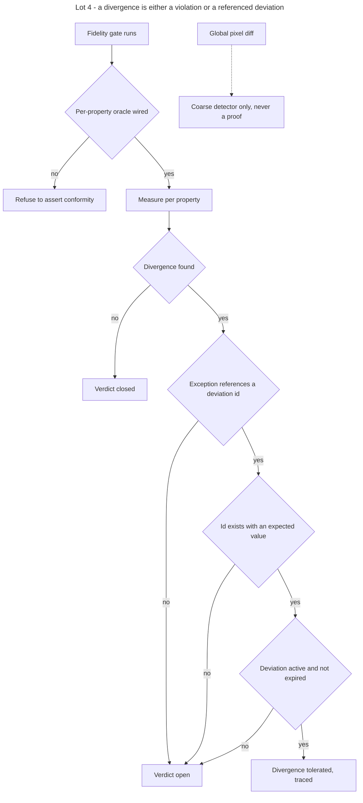

# Instruction: Lot 4 - mandatory oracle, structured ledger

## Feature

- **Summary**: the fidelity gate stops accepting a global pixel comparison as proof. It requires the per-property oracle wired. A global pixel diff remains allowed as a coarse detector. Deviations become a structured source: identifier, status, oracle target, expected value, date, optional expiry. Both the structured source and its Markdown view land here: the Lot 2 generator is extended with a fourth artifact, since the source it derives from does not exist before this lot. An exception tolerated by the oracle must reference an existing deviation carrying its expected value, otherwise the run fails instead of tolerating. Active deviations and historical decisions are separated.
- **Stack**: `Markdown (Claude Code skills) · Python 3.11+ (measure, config-gen, migrate-contract, generate) · Playwright with Chromium, required by measure.py only · JSON contract artifacts`
- **Branch name**: `feat/design-2-0/lot-4-oracle`
- **Parent Plan**: `2026_07_23-design-2-0-guarantees-alignment-master.md`
- **Sequence**: `5 of 7`
- Confidence: 9/10
- Time to implement: 2 work units

## Architecture projection

### Files to modify

- `plugins/design/skills/enforce/actions/05-fidelity-gate.md` - require the per-property oracle; demote the global pixel diff to a coarse detector
- `plugins/design/adapters/measure/measure.py` - `--ledger-registry` becomes required instead of optional, so an exception can never be honoured without a registry to validate it against; read `deviations.json` instead of the Markdown ledger; honour status and expiry; rename the platform-named API surface by role, `--side wp|maq` becoming `--side implementation|mockup` and every `*_in_wp` report field becoming `*_in_implementation`, which also removes the French abbreviation from an otherwise English tool
- `plugins/design/adapters/measure/config-gen.py` - read `oracle.json` instead of the oracle hints previously embedded in the component file; carry the same renaming, the two tools sharing one vocabulary
- `plugins/design/references/visual-diff-procedure.md` - the pixel diff is a detector, never a proof of conformity
- `plugins/design/references/deviation-ledger-template.md` - the generated view of the structured source
- `plugins/design/tools/migrate-contract.py` - add the `--ledger` pass, idempotent and replayable
- `plugins/design/tools/generate.py` - the Markdown ledger view derives from `deviations.json`
- `plugins/design/references/contract-schema.md` - reference `deviations.json` from the release root
- `plugins/design/skills/enforce/evals/scenarios.json` - scenario covering the oracle requirement
- `plugins/design/.claude-plugin/plugin.json`, `.claude-plugin/marketplace.json`, `index.json`, `README.md`, `plugins/design/README.md`, `plugins/design/CHANGELOG.md` - 2.3.0
- `aidd_docs/memory/design-plugin.md` - oracle and ledger topology

### Files to create

- `plugins/design/references/deviations-schema.md` - identifier, status, oracle target, expected value, date, optional expiry, separation of active and historical entries
- `plugins/design/adapters/measure/configs/example.json` - the stack-agnostic sample configuration: generic local address, generic selectors, generic documentation string
- `plugins/design/skills/enforce/fixtures/oracle/conformant/` - contract, `deviations.json`, `measure.config.json` and a self-contained local HTML page whose rendered properties match the contract, producing a CLOSED verdict
- `plugins/design/skills/enforce/fixtures/oracle/unknown-deviation/` - same shape, with a page that diverges on one property and an exception referencing an identifier absent from `deviations.json`, producing an OPEN verdict
- `plugins/design/skills/enforce/fixtures/oracle/ledger-1x/` - a Markdown ledger for the `--ledger` migration pass

### Files to delete

- `plugins/design/adapters/measure/configs/mentions-legales.json` - the only shipped sample configuration, carrying a project-specific page name and a project address. It is deleted, not neutralized in place; `example.json` replaces it.

## Applicable rules

| Tool   | Name                  | Path                                                    | Why it applies |
| ------ | --------------------- | ------------------------------------------------------- | -------------- |
| repo   | contributing          | `CONTRIBUTING.md`                                        | MINOR bump in three places, CHANGELOG, verifiable Test per action |
| repo   | guideline-readme      | `memory/guideline-readme.md`                             | both READMEs restate what proves conformity |
| repo   | dec-002               | `aidd_docs/internal/decisions/002-design-funnel-hybrid-pivot.md` | the oracle is a WHAT-side instrument; rendering stays with the pivots |
| claude | global-conventions    | `C:\Users\fxgui\.claude\CLAUDE.md`                       | rtk prefix, no commit without explicit request |
| claude | plugins-marketplace   | `C:\Users\fxgui\.claude\rules\plugins-marketplace.md`    | edit the source, never the runtime cache |

## User Journey

## Risk register

| Risk | Impact | Mitigation |
| ---- | ------ | ---------- |
| Making the oracle mandatory blocks projects that never wired it | the gate becomes unrunnable | the gate refuses to assert conformity rather than failing the build; the refusal names the wiring step |
| The Markdown ledger loses entries during migration | a sanctioned deviation silently becomes a violation | the `--ledger` pass reports one entry per identifier, and the dry-run report is validated before writing |
| Expiry turns into silent tolerance | an expired deviation keeps passing | expiry is evaluated at run time and an expired entry produces an open verdict |
| The pixel diff keeps being used as proof | the coarse detector reasserts itself as the gate | the procedure reference states the demotion, and the gate asserts closure only from the per-property verdict |
| The shipped sample measurement configuration carries a project name and address | the plugin stops being agnostic | the file is deleted and replaced by a generic `example.json`; the substitution happens here rather than at Lot 0 because this lot rewrites the configuration format anyway |
| The oracle fixtures depend on a network or on a project page | the success condition stops being reproducible | each fixture ships its own self-contained HTML page, loaded locally, with no external asset |
| Historical and active entries stay mixed | the source cannot be read as a state | the schema separates them, and only active entries can sanction a divergence |
| Renaming the oracle API breaks existing callers | a wired project loses its fidelity gate | the rename happens inside the migration window the master opens at Lot 1, is announced under a Breaking heading in the CHANGELOG, and is executed in one pass covering the tools, the configuration, the fixtures and every caller, so no half-renamed state ships |

## Implementation phases

### Phase 1: Specify the structured deviation source

> A deviation is data before it is prose.

#### Tasks

1. Write `deviations-schema.md`: identifier, status, oracle target, expected value, date, optional expiry.
2. Separate active entries from historical decisions.
3. Reference `deviations.json` from the release root in `contract-schema.md`.

#### Acceptance criteria

- [ ] Every field of the existing Markdown entry format maps to a schema field.
- [ ] Active and historical entries are distinct in the schema.
- [ ] Only an active entry can sanction a divergence.

### Phase 2: Ledger migration pass

> Existing sanctions survive the format change.

#### Tasks

1. Add the `--ledger` pass to `migrate-contract.py`, independent from the `--contract` pass.
2. Parse the Markdown ledger and emit `deviations.json`.
3. Report one line per identifier in dry-run, with anomalies for entries that cannot be mapped.
4. Make the pass idempotent and replayable.
5. Add the Markdown ledger fixture.

#### Acceptance criteria

- [ ] The dry-run report accounts for every identifier present in the source.
- [ ] A second run produces no diff.
- [ ] An unmappable entry is reported, never dropped.

### Phase 3: Oracle sources and generated view

> The oracle reads its own artifact; the Markdown view is produced.

#### Tasks

1. Point `config-gen.py` at `oracle.json`.
2. Make `--ledger-registry` a required argument of `measure.py` and point it at `deviations.json`. Omitting it exits 2, the code the master assigns to a missing argument.
3. Honour status and expiry when validating an exception.
4. Set `summary.verdict` to `OPEN` when an exception references an unknown identifier or an entry without an expected value.
5. Extend `generate.py` with the Markdown ledger view derived from `deviations.json`, appended to the artifact set specified at Lot 2 without altering the three artifacts already emitted there.
6. Requalify `deviation-ledger-template.md` as the output template of that view.
7. Build the two oracle fixtures, each with its own self-contained local HTML page.
8. Rename the platform-named API of `measure.py` and `config-gen.py` by role: the two comparison sides become `implementation` and `mockup`, and every report field built on the old names follows. Update the shipped configuration, the fixtures and every caller in the same pass, so no file keeps the old vocabulary.

#### Acceptance criteria

- [ ] The conformant fixture report reads `summary.verdict` equal to `CLOSED`.
- [ ] The unknown-deviation fixture report reads `summary.verdict` equal to `OPEN`.
- [ ] A fixture whose referenced entry is expired reads `summary.verdict` equal to `OPEN`.
- [ ] Omitting `--ledger-registry` exits 2 naming the argument, and measures nothing.
- [ ] Two consecutive generations of the Markdown view are byte-identical.
- [ ] The Lot 2 drift check still passes on the three artifacts it already covered.
- [ ] `grep -rniE '\bwp\b|_in_wp|\bmaq\b' plugins/design/adapters/measure/measure.py plugins/design/adapters/measure/config-gen.py` returns nothing, and the same grep over `plugins/design/` returns matches only in `CHANGELOG.md` and under `audits/`.
- [ ] Every caller of the renamed arguments, in the actions, the references and the fixtures, uses the new names; none uses both.

### Phase 4: Gate semantics

> Proof comes from the oracle; the pixel diff only points.

#### Tasks

1. Rewrite `05-fidelity-gate.md` to require the wired per-property oracle before asserting conformity.
2. State that closure is asserted from the per-property verdict only.
3. Rewrite `visual-diff-procedure.md` to present the pixel diff as a coarse detector.
4. Delete `configs/mentions-legales.json` and create `configs/example.json` in its place: generic local address, generic selectors, generic documentation string.
5. Update the eval scenario.

#### Acceptance criteria

- [ ] No document presents a global pixel comparison as proof of conformity.
- [ ] The gate refuses to assert conformity when the oracle is not wired, and names the wiring step.
- [ ] `plugins/design/adapters/measure/configs/` contains `example.json` and no other file.
- [ ] `example.json` contains no project name, no external address and no stack-specific selector.

### Phase 5: Version and release

#### Tasks

1. Set 2.3.0 in the three version registers.
2. Write the CHANGELOG entry covering the ledger format change and the oracle requirement, with a Breaking heading listing the three incompatible changes this lot ships: `--ledger-registry` becoming required, the `--side` values renamed, and the sample configuration replaced.
3. Update both READMEs and `aidd_docs/memory/design-plugin.md`.

#### Acceptance criteria

- [ ] The three version registers agree on 2.3.0.
- [ ] The CHANGELOG carries a Breaking heading naming the three incompatible changes.

### Phase 6: Transverse writing criterion

> Exhaustive, agnostic, fewest words.

#### Acceptance criteria

- [ ] No project name appears in the schema, the fixtures, the sample configuration or the gate action.
- [ ] No stack is presupposed by the oracle documents.
- [ ] Every field of the previous Markdown format is still covered after compression.
- [ ] No duplication between `05-fidelity-gate.md`, `visual-diff-procedure.md` and `deviations-schema.md`.

## Amendments

## Log

## Validation flow demonstration

1. Run the ledger migration pass in dry-run on the Markdown fixture and check one report line per identifier.
2. Write the structured source and run the pass again: no diff.
3. Run `measure.py` on the conformant fixture and read `summary.verdict` in the written report: `CLOSED`.
4. Run it on the fixture whose exception references an unknown identifier: `OPEN`.
5. Expire an entry and rerun: `OPEN`.
6. Call `measure.py` without `--ledger-registry` and confirm it refuses instead of measuring.
7. Regenerate the Markdown view twice and confirm the two outputs are byte-identical.
8. Confirm the three version registers read 2.3.0.
