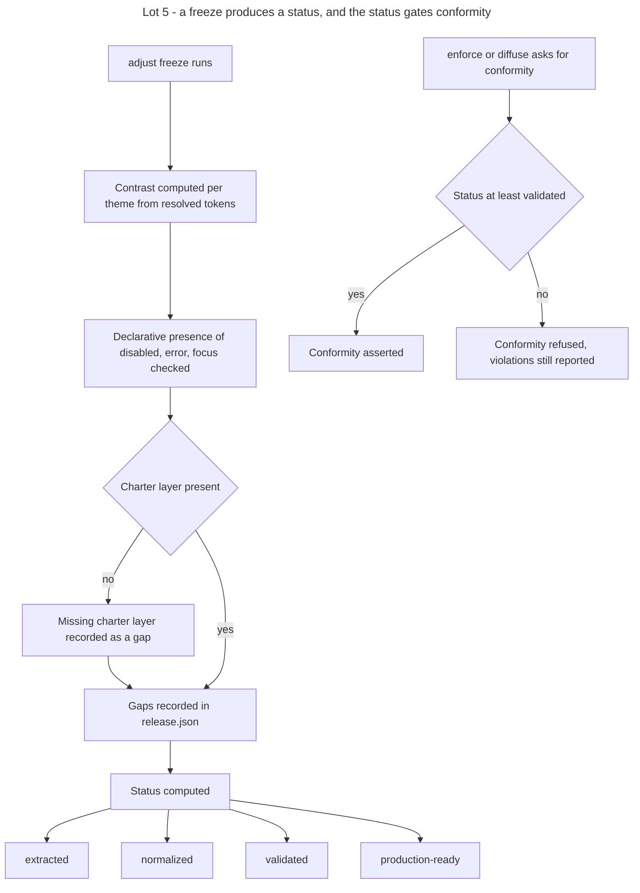

# Instruction: Lot 5 - maturity at freeze

## Feature

- **Summary**: freezing a contract stops being pass or fail. It produces a status carried by `release.json`: extracted, normalized, validated, production-ready. `diffuse` and `enforce` may only invoke conformity on a contract at least validated. The a11y control is split by what is actually computable: contrast is computed from resolved token values per theme, deterministically, by the plugin at freeze; roles and attributes are markup, therefore pivot; disabled, error and focus states are a declarative presence in the component artifact, verifiable at freeze. A known gap no longer lives as an open question in prose: it appears in the release artifact and caps the status.
- **Stack**: `Markdown (Claude Code skills) · Python 3.11+ (contrast, status, run-gates) · JSON contract artifacts`
- **Branch name**: `feat/design-2-0/lot-5-maturity`
- **Parent Plan**: `2026_07_23-design-2-0-guarantees-alignment-master.md`
- **Sequence**: `6 of 7`
- Confidence: 9/10
- Time to implement: 2 work units

## Assumed consequence

Migrated contracts enter at normalized, with no grandfathering. Until they are raised, `enforce` and `diffuse` stop invoking conformity on them. The gate keeps running and keeps blocking real violations; only the vocabulary of conformity is suspended. A contract whose layer 3 is absent enters below normalized.

## Architecture projection

### Files to modify

- `plugins/design/skills/adjust/actions/02-freeze.md` - the freeze computes and writes a status instead of failing; it runs the contrast computation and the declarative state check
- `plugins/design/skills/enforce/SKILL.md` - conformity may only be invoked above the threshold
- `plugins/design/skills/diffuse/SKILL.md` - same threshold
- `plugins/design/skills/harness/SKILL.md` - the funnel description names the status produced at freeze and the threshold gating conformity
- `plugins/design/skills/enforce/adapters/run-gates.py` - read the status; below the threshold, exit 4 as fixed by the master's exit-code table, while still reporting the violations found
- `plugins/design/tools/status.py` - extended, not created: Lot 1 ships it with the charter-layer and checks-run inputs; this lot adds the contrast result and the declarative-state result as further inputs, and adds the threshold constant the runner reads
- `plugins/design/references/contract-schema.md` - the status field becomes computed and opposable; gaps are recorded in the release artifact
- `plugins/design/skills/adjust/references/manifest-schema.md` - declarative presence of disabled, error and focus states in the component artifact
- `plugins/design/references/enforcement-registry.md` - contrast and states become realized checks; roles and attributes stay pivot-assigned
- `plugins/design/skills/adjust/evals/scenarios.json` and `plugins/design/skills/enforce/evals/scenarios.json` - scenarios covering the status threshold
- `plugins/design/.claude-plugin/plugin.json`, `.claude-plugin/marketplace.json`, `index.json`, `README.md`, `plugins/design/README.md`, `plugins/design/CHANGELOG.md` - 2.4.0
- `aidd_docs/memory/design-plugin.md` - maturity model

### Files to create

- `plugins/design/adapters/a11y/contrast.py` - contrast computed from resolved token values, per theme, deterministic
- `plugins/design/references/maturity-status.md` - the four statuses, what each requires, what each authorizes, how a gap caps it, and the threshold above which conformity may be invoked
- `plugins/design/skills/enforce/fixtures/status/layer-3-absent/`, `status/no-contrast-run/`, `status/validated/` - one fixture per status class
- `plugins/design/skills/enforce/fixtures/gates.below-threshold.config.json` - third runner configuration, same shape as the two from Lot 3, pointing at the dirty target files and at the `status/no-contrast-run` contract

### Files to delete

- none as whole files. The open-question prose that recorded known gaps is removed, its content moving to the release artifact.

## Applicable rules

| Tool   | Name                  | Path                                                    | Why it applies |
| ------ | --------------------- | ------------------------------------------------------- | -------------- |
| repo   | contributing          | `CONTRIBUTING.md`                                        | MINOR bump in three places, CHANGELOG, verifiable Test per action |
| repo   | guideline-readme      | `memory/guideline-readme.md`                             | both READMEs restate what a frozen contract guarantees |
| repo   | dec-002               | `aidd_docs/internal/decisions/002-design-funnel-hybrid-pivot.md` | contrast and declarative states are WHAT-side; roles and attributes stay with the pivots |
| claude | global-conventions    | `C:\Users\fxgui\.claude\CLAUDE.md`                       | rtk prefix, no commit without explicit request |
| claude | plugins-marketplace   | `C:\Users\fxgui\.claude\rules\plugins-marketplace.md`    | edit the source, never the runtime cache |

## User Journey

## Risk register

| Risk | Impact | Mitigation |
| ---- | ------ | ---------- |
| Suspending conformity reads as disabling the gate | violations stop being fixed | the runner keeps reporting and keeps failing on violations; only the assertion of conformity is withheld, under exit code 4 |
| The status is reimplemented here | Lot 1 and Lot 5 drift on the same rule | `status.py` is extended with two further inputs; the master forbids any status computation outside that file |
| Contrast computation is not deterministic | the status oscillates between runs | contrast is computed from resolved token values only, with no rendering and no browser in the loop |
| The threshold blocks every project at once | delivery stops across the board | the threshold is introduced with the status computation in the same lot, and the raising path is documented in `maturity-status.md` |
| Gaps keep living in prose | the status stops reflecting reality | the open-question prose is removed and the release artifact becomes the only place a gap is recorded |
| Contrast is claimed for cases it cannot compute | a new documentary fiction is created | the a11y split is explicit: computed contrast, declarative states, pivot-assigned roles and attributes, each with its realizer in the enforcement registry |

## Implementation phases

### Phase 1: Specify the maturity model

> Four statuses, each with a requirement and an authorization.

#### Tasks

1. Write `maturity-status.md`: extracted, normalized, validated, production-ready.
2. For each, state what it requires and what it authorizes.
3. State how a recorded gap caps the status.
4. State the threshold above which conformity may be invoked.
5. Make the status field in `contract-schema.md` computed and opposable.

#### Acceptance criteria

- [ ] Each status states its requirement and its authorization.
- [ ] `maturity-status.md` carries a table mapping each gap class to the status it caps at, so the same recorded gaps always yield the same status.
- [ ] The threshold has one executable source, the constant in `status.py`, and one human source, `maturity-status.md`. Nothing else under `plugins/design/` carries the value: the three routers that mention the threshold, `enforce`, `diffuse` and `harness`, reference `maturity-status.md` and restate no literal, and `run-gates.py` reads the constant rather than repeating it.

### Phase 2: Computable a11y checks

> Only what can be computed is claimed.

#### Tasks

1. Implement `contrast.py`: resolve token values per theme and compute contrast per pair, deterministically.
2. Specify the declarative presence of disabled, error and focus states in the component artifact.
3. Implement the declarative state check at freeze.
4. Assign roles and attributes to the pivots in the enforcement registry.

#### Acceptance criteria

- [ ] Two consecutive runs of `contrast.py` over the same contract produce byte-identical output.
- [ ] The state check reports presence per component, without inspecting markup.
- [ ] Roles and attributes appear in the registry with a pivot realizer, not as a plugin claim.

### Phase 3: Status computation at freeze

> Freezing produces a state, not a pass.

#### Tasks

1. Extend the `status.py` shipped at Lot 1 with the contrast result and the declarative-state result as inputs. No second status implementation is written.
2. Rewrite `02-freeze.md` to run the checks, record the gaps and write the status returned by `status.py`.
3. Remove the failure path that previously rejected a freeze on an unverified point.
4. Add the three status fixtures.

#### Acceptance criteria

- [ ] `fixtures/status/layer-3-absent` computes exactly `extracted`.
- [ ] `fixtures/status/no-contrast-run` computes exactly `normalized`.
- [ ] `fixtures/status/validated` computes exactly `validated`.
- [ ] No freeze path fails on an unverified point; each records a gap instead.

### Phase 4: Opposability

> The status decides whether conformity can be spoken.

#### Tasks

1. Read the status in the runner and refuse to assert conformity below the threshold.
2. Exit 4 for that refusal, the code reserved by the master, distinct from 1 which stays the violation code.
3. State the threshold in the enforce and diffuse skills, by reference to `maturity-status.md`, which states it once.
4. Add the third runner configuration fixture, pointing at a below-threshold contract and at the dirty target files.
5. Update the eval scenarios.

#### Acceptance criteria

- [ ] Below the threshold, the runner exits 4, the report still lists every violation found, and the message names the raising path.
- [ ] At or above the threshold, the exit codes of Lot 3 are unchanged: 0 on the clean configuration, 1 on the dirty one.
- [ ] `run-gates.py` reads the threshold constant from `status.py` and hard-codes no status literal of its own.

### Phase 5: Version and release

#### Tasks

1. Set 2.4.0 in the three version registers.
2. Write the CHANGELOG entry stating the no-grandfathering consequence.
3. Update both READMEs and `aidd_docs/memory/design-plugin.md`.

#### Acceptance criteria

- [ ] The three version registers agree on 2.4.0.
- [ ] The CHANGELOG states that migrated contracts enter at normalized.

### Phase 6: Transverse writing criterion

> Exhaustive, agnostic, fewest words.

#### Acceptance criteria

- [ ] No project name appears in the maturity documents, the tools or the fixtures.
- [ ] No status requirement presupposes a stack.
- [ ] Every previously recorded open question is now a recorded gap, none lost.
- [ ] No duplication between `maturity-status.md`, `02-freeze.md` and the `enforce`, `diffuse` and `harness` routers: each router references the reference, none restates it.

## Amendments

## Log

## Validation flow demonstration

1. Run the contrast tool twice on the fixture contract and confirm identical output.
2. Freeze each status fixture and confirm the computed status matches its class.
3. Ask the runner for conformity on a contract below the threshold: exit 4, violations still reported.
4. Raise the contract to validated and confirm conformity is asserted again.
5. Confirm no open-question prose remains where a gap is now recorded.
6. Confirm the three version registers read 2.4.0.
