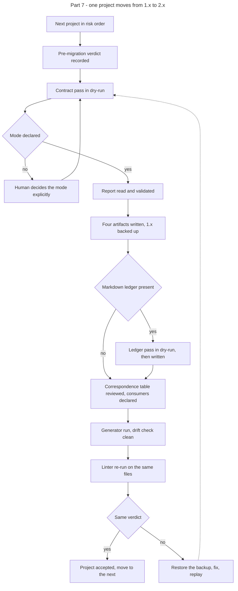

# Instruction: Part 7 - migration of the frozen contracts

## Feature

- **Summary**: run the tooling delivered by lots 1 to 5 against the six contracts frozen in 1.x. One project at a time, in increasing order of risk. Each pass is a dry-run report, a human validation, a write, and a non-regression check. No project is migrated without its report being read.
- **Stack**: `Python 3.11+ (migrate-contract.py, generate.py, status.py) · Node 20+ (lint-core.mjs)`
- **Branch name**: `chore/design-2-0/migrate-contracts`
- **Parent Plan**: `2026_07_23-design-2-0-guarantees-alignment-master.md`
- **Sequence**: `7 of 7`
- Confidence: 9/10
- Time to implement: 1 work unit, spread over six validations

## Prerequisite

Parts 1 to 6 are done and the plugin is published at 2.4.0. The acceptance criterion of Lot 1 is the `enforce/fixtures/migration/` fixture, not these projects. This part is execution, not validation of the tooling.

## Migration order

Increasing risk. Each project is named here for traceability only; no project name enters any plugin artifact.

| # | Project | Class of case | Why at this rank |
| - | ------- | ------------- | ---------------- |
| 1 | `Pro/Projets/cerascan/_code/design` | utility-first, empty component set | nothing to redistribute beyond policies and tokens |
| 2 | `Perso/Projects/suddenly/_code/app/design` | artifact versions skewed | the skew becomes declared data; no other anomaly |
| 3 | `Perso/Projects/choix-narratifs/_code/design` | mode undeclared, small component set | first pass requiring an explicit mode decision |
| 4 | `Perso/Projects/personal-site/_code/design` | mode undeclared, adapter outside the contract | mode decision plus an adapter to declare in the correspondence table |
| 5 | `Pro/Projets/mauceri/_code/design` | charter layer absent, large component set | status capped, largest redistribution |
| 6 | `Perso/Projects/scriptami/_code/wp-2026/design` | richest contract, existing Markdown ledger, adapter emitted for a stack the project does not use | contract pass, ledger pass, and an adapter to reconcile |

## Architecture projection

### Files to modify

- `<project>/design/components.json` - reduced to component anatomy, one per project
- `<project>/design/tokens.json` - unchanged, verified only
- `<project>/design/adapters/*` - declared in the correspondence table; regenerated where a consumer exists
- `<project>/design/ds-deviation-ledger.md` - becomes the generated view where a ledger exists

### Files to create

- `<project>/design/policies.json` - transverse rules, mode, utility prefixes, adapter correspondence table
- `<project>/design/oracle.json` - oracle targets and collections
- `<project>/design/release.json` - per-artifact versions, source hashes, provenance, computed maturity status
- `<project>/design/deviations.json` - where a Markdown ledger exists
- `<project>/design/.backup-1x/` - the pre-migration contract, written by the script

### Files to delete

- none. The 1.x contract is backed up, not removed, until the non-regression check passes for the project.

## Applicable rules

| Tool   | Name                  | Path                                                    | Why it applies |
| ------ | --------------------- | ------------------------------------------------------- | -------------- |
| claude | global-conventions    | `C:\Users\fxgui\.claude\CLAUDE.md`                       | no commit without explicit request, in every one of the six repositories |
| claude | plugins-marketplace   | `C:\Users\fxgui\.claude\rules\plugins-marketplace.md`    | the tooling is invoked from the plugin source, never from the runtime cache |
| repo   | dec-002               | `aidd_docs/internal/decisions/002-design-funnel-hybrid-pivot.md` | migration touches the contract only; project source is not rewritten |

## User Journey

## Risk register

| Risk | Impact | Mitigation |
| ---- | ------ | ---------- |
| A migration changes the verdict on a live project | the project believes it is conformant when the vocabulary shifted | the pre-migration verdict is recorded in the `## Log` section of this plan before the first write and compared after; a mismatch restores the backup |
| An undeclared mode is decided carelessly | the pre-existing vacuity is carried into 2.x | the mode decision is a human validation step, informed by the project's actual class usage, not by the component count |
| An adapter is regenerated over a hand-maintained file | project source breaks | the correspondence table is reviewed before regeneration; an adapter with no declared consumer is not emitted |
| A ledger entry is lost | a sanctioned deviation becomes a violation | the ledger pass is dry-run first and its report is compared entry by entry against the Markdown source |
| A migrated contract enters below the conformity threshold | the project loses the conformity vocabulary | this is the assumed consequence of the no-grandfathering decision; the raising path is documented and the gate keeps blocking real violations |
| Six repositories, six review contexts | one project is migrated without review | the plan is executed strictly one project at a time, each with its own validation checkbox |

## Implementation phases

### Phase 1: Record the baseline

> Nothing is written before the current verdict is known.

#### Tasks

1. For each project, pick the sample files the project already lints.
2. Run the 1.x linter available at the last pre-2.0 tag and record the verdict per file.
3. Record the current adapter set per project.
4. Write every recorded verdict and adapter set into the `## Log` section of this plan file. That section is the only sink; no verdict is kept in a scratch file, in a project repository, or in conversation alone.

#### Acceptance criteria

- [ ] The `## Log` section carries, for each of the six projects, the sample file list, the per-file verdict and the adapter set.
- [ ] No pre-migration verdict exists outside that section.

### Phase 2: Migrate, one project at a time

> Six identical passes, in increasing order of risk.

#### Tasks

1. Run the contract pass in dry-run and read the report.
2. Decide the mode explicitly where it is undeclared.
3. Validate the report, then write the four artifacts.
4. Run the ledger pass where a Markdown ledger exists.
5. Review the derived correspondence table and declare a consumer for each adapter.
6. Run the generator and the drift check.
7. Re-run the linter on the recorded sample files and compare with the baseline.

#### Acceptance criteria

- [ ] Project 1 migrated, verdict unchanged, drift check clean.
- [ ] Project 2 migrated, skewed versions declared, verdict unchanged.
- [ ] Project 3 migrated, mode explicitly decided, verdict unchanged.
- [ ] Project 4 migrated, out-of-contract adapter declared or removed, verdict unchanged.
- [ ] Project 5 migrated, charter layer recorded as absent, status capped, verdict unchanged.
- [ ] Project 6 migrated, ledger converted entry by entry, unused adapter reconciled, verdict unchanged.

### Phase 3: Close the window

> No contract is left in 1.x.

#### Tasks

1. Confirm every project directory carries the four artifacts.
2. Confirm the linter no longer exits 3 on any of them.
3. Record the computed status of each project in the `## Log` section.
4. Update `aidd_docs/memory/design-plugin.md` with the migration outcome.

#### Acceptance criteria

- [ ] No design directory lacks `release.json`.
- [ ] The linter exits 3 on none of the six.
- [ ] The `## Log` section carries the computed status of each project.

### Phase 4: Transverse writing criterion

> Exhaustive, agnostic, fewest words.

#### Acceptance criteria

- [ ] No project name entered any plugin artifact during this part.
- [ ] Every anomaly encountered is expressed as a class of case when it is reported back to the plugin.
- [ ] Any tooling gap found here becomes a fixture in `enforce/fixtures/migration/`, named by class of case.

## Amendments

## Log

## Validation flow demonstration

1. Take the first project, run the dry-run, read the report, write, and confirm the verdict is unchanged.
2. Repeat for the five remaining projects in the declared order, one validation each.
3. Point the linter at each migrated contract and confirm none exits 3.
4. Run the drift check on each migrated contract and confirm it is clean.
5. List the computed status of the six contracts and confirm each matches its class of case.
