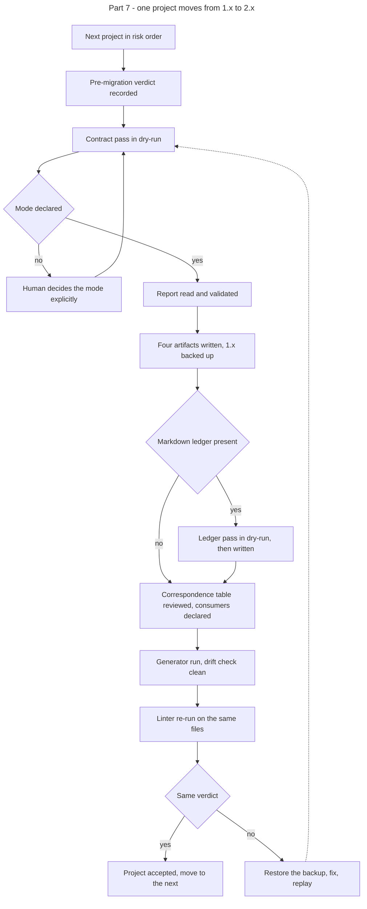

# Instruction: Part 7 - migration of the frozen contracts

## Feature

- **Summary**: run the tooling delivered by lots 1 to 5 against the six contracts frozen in 1.x. One project at a time, in increasing order of risk. Each pass is a dry-run report, a human validation, a write, and a non-regression check. No project is migrated without its report being read.
- **Stack**: `Python 3.11+ (migrate-contract.py, generate.py, status.py) · Node 20+ (lint-core.mjs)`
- **Branch name**: `chore/design-2-0/migrate-contracts`
- **Parent Plan**: `2026_07_23-design-2-0-guarantees-alignment-master.md`
- **Sequence**: `7 of 7`
- Confidence: 9/10
- Time to implement: 1 work unit, spread over six validations

## Prerequisite

Parts 1 to 6 are done and the plugin is published at 2.4.0. The acceptance criterion of Lot 1 is the `enforce/fixtures/migration/` fixture, not these projects. This part is execution, not validation of the tooling.

## Migration order

Increasing risk. Each project is named here for traceability only; no project name enters any plugin artifact.

| # | Project | Class of case | Why at this rank |
| - | ------- | ------------- | ---------------- |
| 1 | `Pro/Projets/cerascan/_code/design` | utility-first, empty component set | nothing to redistribute beyond policies and tokens |
| 2 | `Perso/Projects/suddenly/_code/app/design` | artifact versions skewed | the skew becomes declared data; no other anomaly |
| 3 | `Perso/Projects/choix-narratifs/_code/design` | mode undeclared, small component set | first pass requiring an explicit mode decision |
| 4 | `Perso/Projects/personal-site/_code/design` | mode undeclared, adapter outside the contract | mode decision plus an adapter to declare in the correspondence table |
| 5 | `Pro/Projets/mauceri/_code/design` | charter layer absent, large component set | status capped, largest redistribution |
| 6 | `Perso/Projects/scriptami/_code/wp-2026/design` | richest contract, existing Markdown ledger, adapter emitted for a stack the project does not use | contract pass, ledger pass, and an adapter to reconcile |

## Architecture projection

### Files to modify

- `<project>/design/components.json` - reduced to component anatomy, one per project
- `<project>/design/tokens.json` - unchanged, verified only
- `<project>/design/adapters/*` - declared in the correspondence table; regenerated where a consumer exists
- `<project>/design/ds-deviation-ledger.md` - becomes the generated view where a ledger exists

### Files to create

- `<project>/design/policies.json` - transverse rules, mode, utility prefixes, adapter correspondence table
- `<project>/design/oracle.json` - oracle targets and collections
- `<project>/design/release.json` - per-artifact versions, source hashes, provenance, computed maturity status
- `<project>/design/deviations.json` - where a Markdown ledger exists
- `<project>/design/.backup-1x/` - the pre-migration contract, written by the script

### Files to delete

- none. The 1.x contract is backed up, not removed, until the non-regression check passes for the project.

## Applicable rules

| Tool   | Name                  | Path                                                    | Why it applies |
| ------ | --------------------- | ------------------------------------------------------- | -------------- |
| claude | global-conventions    | `C:\Users\fxgui\.claude\CLAUDE.md`                       | no commit without explicit request, in every one of the six repositories |
| claude | plugins-marketplace   | `C:\Users\fxgui\.claude\rules\plugins-marketplace.md`    | the tooling is invoked from the plugin source, never from the runtime cache |
| repo   | dec-002               | `aidd_docs/internal/decisions/002-design-funnel-hybrid-pivot.md` | migration touches the contract only; project source is not rewritten |

## User Journey

## Risk register

| Risk | Impact | Mitigation |
| ---- | ------ | ---------- |
| A migration changes the verdict on a live project | the project believes it is conformant when the vocabulary shifted | the pre-migration verdict is recorded in the `## Log` section of this plan before the first write and compared after; a mismatch restores the backup |
| An undeclared mode is decided carelessly | the pre-existing vacuity is carried into 2.x | the mode decision is a human validation step, informed by the project's actual class usage, not by the component count |
| An adapter is regenerated over a hand-maintained file | project source breaks | the correspondence table is reviewed before regeneration; an adapter with no declared consumer is not emitted |
| A ledger entry is lost | a sanctioned deviation becomes a violation | the ledger pass is dry-run first and its report is compared entry by entry against the Markdown source |
| A migrated contract enters below the conformity threshold | the project loses the conformity vocabulary | this is the assumed consequence of the no-grandfathering decision; the raising path is documented and the gate keeps blocking real violations |
| Six repositories, six review contexts | one project is migrated without review | the plan is executed strictly one project at a time, each with its own validation checkbox |

## Implementation phases

### Phase 1: Record the baseline

> Nothing is written before the current verdict is known.

#### Tasks

1. For each project, pick the sample files the project already lints.
2. Run the 1.x linter available at the last pre-2.0 tag and record the verdict per file.
3. Record the current adapter set per project.
4. Write every recorded verdict and adapter set into the `## Log` section of this plan file. That section is the only sink; no verdict is kept in a scratch file, in a project repository, or in conversation alone.

#### Acceptance criteria

- [x] The `## Log` section carries, for each of the six projects, the sample file list, the per-file verdict and the adapter set.
- [x] No pre-migration verdict exists outside that section.

### Phase 2: Migrate, one project at a time

> Six identical passes, in increasing order of risk.

#### Tasks

1. Run the contract pass in dry-run and read the report.
2. Decide the mode explicitly where it is undeclared.
3. Validate the report, then write the four artifacts.
4. Run the ledger pass where a Markdown ledger exists.
5. Review the derived correspondence table and declare a consumer for each adapter.
6. Run the generator and the drift check.
7. Re-run the linter on the recorded sample files and compare with the baseline.

#### Acceptance criteria

- [x] Project 1 migrated, verdict unchanged, drift check clean.
- [x] Project 2 migrated, skewed versions declared, verdict unchanged.
- [x] Project 3 migrated, mode explicitly decided, verdict unchanged.
- [x] Project 4 migrated, out-of-contract adapter declared or removed, verdict unchanged.
- [x] Project 5 migrated, charter layer recorded as absent, status capped; verdict preserved against the project's own platform-aware linter (A7), generic-linter platform-token errors logged as a class of case.
- [x] Project 6 migrated (status `normalized`, `oracle.json` written), verdict preserved 34/34; ledger pass correctly skipped (A8 — table-shape ledger, pre-existing richer `deviations.json` preserved); unused `theme.css` adapter declared in the correspondence table, `generate --check` clean.

### Phase 3: Close the window

> No contract is left in 1.x.

#### Tasks

1. Confirm every project directory carries the four artifacts.
2. Confirm the linter no longer exits 3 on any of them.
3. Record the computed status of each project in the `## Log` section.
4. Update `aidd_docs/memory/design-plugin.md` with the migration outcome.

#### Acceptance criteria

- [x] No design directory lacks `release.json`.
- [x] The linter exits 3 on none of the six.
- [x] The `## Log` section carries the computed status of each project.

### Phase 4: Transverse writing criterion

> Exhaustive, agnostic, fewest words.

#### Acceptance criteria

- [x] No project name entered any plugin artifact during this part. Only the plan file (allowed) and `aidd_docs/memory/design-plugin.md` (outside the plugin perimeter) carry project names; the three new fixtures are grepped clean of project, vendor and stack names. See A9 for a pre-existing violation found in `sc-php`/`sc-python`, out of this part's write scope.
- [x] Every anomaly encountered is expressed as a class of case when it is reported back to the plugin (A6 empty-oracle, A7 platform-token-namespace, A8 ledger-table-shape; pivot-only→unrealized retyping reported per pass).
- [x] Any tooling gap found here becomes a fixture in `enforce/fixtures/migration/`, named by class of case: `oracle-empty` (A6), `platform-token-namespace` (A7), `ledger-table-shape` (A8). Each verified — A7 lints to exit 1 on `var(--platform--accent)`, A6 dry-run maps no oracle, A8 `--ledger` reads `ENTRIES 0`. Logged in `plugins/design/CHANGELOG.md` under [2.5.0] as a Part 7 ops subsection (version unchanged).

## Amendments

- **A1 — Backup directory name.** The Files-to-create list names `.backup-1x/`; the shipped `migrate-contract.py` writes its backup to `.contract-1x/` (constant `BACKUP_DIR`). The tool is authoritative. Every reference to the pre-migration backup reads `.contract-1x/`.
- **A2 — Undeclared-mode count is three, not two.** Phase 2 task 2 and the risk order anticipate an explicit `--mode` decision on two projects (rank 3, rank 4). The baseline finds a third: rank 5, whose `mode` is absent from both `components.json` and `tokens.json`. Rank 5's class of case is extended to `charter layer absent, large component set, mode undeclared`. Three explicit mode decisions, not two.
- **A3 — Rank 5 ships no adapter set and no charter.** Rank 5 carries no `adapters/` directory and no `design-system.md`; it lints through bespoke scripts outside the contract (targets: platform pattern files + stylesheets), not through `<design>/lint/`. Its correspondence table therefore starts empty, and the charter layer is recorded absent — the class of case the maturity cap was written for. Its baseline is the project's own contract/pattern/spacing linters, all exit 0.
- **A4 — Baseline linter is each project's embedded copy.** Phase 1 task 2 reads "the 1.x linter available at the last pre-2.0 tag". Each of the six projects froze with its own `lint-core.mjs` on disk; the baseline was taken with that embedded linter, which is the verdict the migration must preserve. The marketplace tag governs the plugin, not the frozen consumer copies.
- **A5 — Publication is not a precondition.** The Prerequisite names "published at 2.4.0"; publication (master checkpoint 6) is still open. The migration runs the tooling from plugin source per the plugins-marketplace rule, so publication is not required to invoke it. Recorded, not blocking.
- **A6 — `oracle.json` is optional, not universal.** The success_condition requires `release.json, components.json, policies.json and oracle.json` in every design directory. The 2.0 contract schema classes `oracle.json` **optional**: a contract with no measure targets has no oracle side, and `migrate-contract.py` deliberately does not write an empty one (`split()` guards the payload on `oracle_components or oracle.get("contract")`; the only reader is the measure adapter, never the linter). Confirmed on rank 1 (empty component set): post-migration the marketplace linter exits **0** and `generate.py --check` exits **0** with no `oracle.json` present. The success_condition is read as: **`oracle.json` present where the contract carries oracle targets; its absence on an empty-oracle contract is conformant.** The clause also omits `tokens.json`, which is required; the operative required set is `tokens.json + components.json + policies.json + release.json`. The class of case (`component set empty → no oracle side`) is a candidate migration fixture for Phase 4.
- **A8 — Ledger pass skipped on rank 6: table-shape ledger the parser does not read, and a richer `deviations.json` already present.** Phase 2 task 4 runs the ledger pass where a Markdown ledger exists. Rank 6 has one, but `parse_ledger` expects `### DEV-NNN` fielded blocks (`component`, `contract value: <prop> = <value>`, `justification`), while rank 6's `ds-deviation-ledger.md` is a single pipe **table** — the parser matches no heading and reads **0 entries** (`--ledger --dry-run` → `ENTRIES 0`). Running the write would emit `deviations.json = {"active": []}` over the project's **pre-existing, hand-curated 16-entry `deviations.json`** (15 active + 1 historical, already at schema `#deviations`, richer than any parser output) — the "ledger entry lost" risk realized. **Resolution:** the ledger pass is not run; the existing `deviations.json` is authoritative and left intact (the contract pass never touches it — it is neither written by `split()` nor copied to the backup). The class of case (`ledger in table shape → parser reads 0`, and `deviations.json predates and exceeds the parser output`) is a Phase 4 migration-fixture candidate. `deviations.json` is optional like `oracle.json` (A6); rank 6 already carries a valid one, so the objective is met without the pass.
- **A9 — Pre-existing project names in `sc-php`/`sc-python`, out of this part's write scope.** Phase 4 criterion 1 is scoped to "no project name entered any plugin artifact **during this part**", which holds. A grep of the master transverse perimeter (all `plugins/`) nonetheless surfaces project names that predate Part 7: `sc-php/skills/builder-coverage/` (`SKILL.md`, `actions/03-organize.md` — a fiduciary project named as a maturity example) and `sc-python/skills/sniff/references/capabilities/ap/django-activitypub.md` (a social project named in ~9 `grep` tripwire paths). These violate the master's standing transverse criterion ("No project name appears anywhere in that perimeter"), but they are neither in `plugins/design/` nor introduced by this migration. **Resolved on user request:** the names are genericised in place (stack material kept — it legitimately lives in its pivot; only the project identity is removed). `sc-python/.../django-activitypub.md` — the `<project>/activitypub/` grep-path prefix drops to the agnostic relative `activitypub/`, matching the front-matter `**/activitypub/**` globs. `sc-php/skills/builder-coverage/` — the maturity note reads "1 thème FSE", the local-variant example drops the brand name, the naming rule reads "tout préfixe de marque est retiré". A re-grep of the whole `plugins/design` + `sc-*` perimeter returns no project name.
- **A7 — Verdict comparison against the platform-aware baseline, not the generic linter.** The success_condition compares the post-migration verdict of `<marketplace>/…/lint-core.mjs` against the recorded baseline. For a project whose gate is a **platform-aware bespoke linter** (rank 5, and anticipated for rank 6 — both WordPress FSE), that comparison is structurally unsatisfiable, independently of migration quality: the generic `lint-core.mjs` Rule 2 checks every `var(--…)` against `tokens.json` alone (`validVars`, line 368) and has, by construction (perimeter comment lines 12-20: "platform theme files … Out of scope"), **no notion of a platform token namespace**. On rank 5 it exits **1** with 13 errors, all of the form `var(--wp--preset--*)` / `var(--wp--custom--*)` — CSS custom properties WordPress generates from `theme.json`, which the contract legitimately does not own; zero BEM-vocabulary error. The recorded baseline (exit 0) was produced by the project's own platform-aware linter, which the generic one cannot reproduce. **Resolution (user decision):** for a platform-aware-baseline project, the operative verdict comparison is against **its own linter** (which stays exit 0 — the migration changed no markup and no owned token), and the generic linter's platform-token errors are recorded as a class of case, not a regression. Declaring the platform presets in `tokens.json` to force a green generic run is rejected: it would make the contract claim tokens another layer owns. The class of case (`platform token namespace not owned by the contract → generic token-reference rule diverges from the platform-aware baseline`) is a Phase 4 migration fixture, and the extension of coverage belongs to a `sc-<language>:design-bridge` pivot, never to a rule in `lint-core.mjs`.

## Log

### Phase 1 — pre-migration baseline

Marketplace 2.x linter = `plugins/design/skills/enforce/adapters/lint-core.mjs`. On every project it exits **3** ("Contract in the 1.x format (no release.json)"), which is the pre-migration gate the success_condition requires. Each project's own frozen `lint-core.mjs` (the 1.x verdict to preserve) is recorded below.

| # | Project design dir | Own-linter baseline | 2.x linter | mode | charter | ledger | adapters |
| - | ------------------ | ------------------- | ---------- | ---- | ------- | ------ | -------- |
| 1 | `Pro/Projets/cerascan/_code/design` | **exit 0** — 43/43 `.ejs` OK | 3 | `utility-first` (components.json $1.0.0) | present | none | `tailwind-tokens.cjs`, `tokens.css` |
| 2 | `Perso/Projects/suddenly/_code/app/design` | **exit 0** — 169/169 `.html` clean | 3 | `utility-first` (components.json only) | present | none | `tokens.css`, `uno-tokens.mjs` |
| 3 | `Perso/Projects/choix-narratifs/_code/design` | **exit 0** — 16/16 `.astro`+`.html` OK | 3 | **undeclared** → evidence `bem` | present | none | `tokens.css` |
| 4 | `Perso/Projects/personal-site/_code/design` | **exit 0** — 82 targets clean (`.vue`+`.html`) | 3 | **undeclared** → evidence `utility-first` | present | none | `tailwind-theme.js`, `tokens.css` |
| 5 | `Pro/Projets/mauceri/_code/design` | **exit 0** — contract 5/5, ds 0-err/221-warn, patterns 0-err/24-warn | 3 | **undeclared** | **absent** | none | **no adapters/ dir** |
| 6 | `Perso/Projects/scriptami/_code/wp-2026/design` | **exit 0** — 34/34 (`.html`+`.php`) | 3 | `bem` (components.json $1.1.0) | present | **16 DEV** (`deviations.json` + `ds-deviation-ledger.md`) | `tokens.css`, `theme.css` |

#### Per-project detail

**1 · cerascan** — runner `design/lint/run-all.mjs` walks `src/views/**/*.ejs`; 43 files, aggregate exit 0, 0 failures. `components.json` declares `mode: utility-first` ($version 1.0.0); `tokens.json` DTCG, no mode. Charter `design-system.md` present. No `release.json`/`policies.json`/`oracle.json`. Adapters: `tailwind-tokens.cjs`, `tokens.css`.

**2 · suddenly** — runner is `design/lint/lint-files.mjs` (no `run-all.mjs`); walks `templates/**/*.html` minus `wireframes/`+`500.html`; 169 files clean, exit 0. **Version skew confirmed**: `components.json` $version **1.5.0** vs `tokens.json` $version **1.4.0**; `mode: utility-first` on components.json only. Charter present. Adapters: `tokens.css`, `uno-tokens.mjs`.

**3 · choix-narratifs** — runner `design/lint/run.mjs` (not `run-all.mjs`); globs `src/` + `design/wireframes/`, ext `.astro|.html`; 16 targets, exit 0. `mode` **absent** from both JSON. Evidence points `bem`: `components.json` maps BEM `elements`/`modifiers`, linter Rule 1 splits on `__`/`--`, no utility namespaces (`.site-header__inner`, `.btn--primary`, `.card__title`, `.wall__side--engine`). Charter present ($version 1.1.0). Single adapter `tokens.css`.

**4 · personal-site** — no `run-all.mjs`; targets from `.lintrc.json`: `app/components/**/*.vue` (52) + `app/pages/**/*.vue` (29) + `design/wireframes/**/*.html` (1) = 82, all exit 0 per-file. `mode` **absent**. Tension: manifest is BEM, but the live codebase is **utility-first Tailwind v3** (`class="flex gap-4 …"`), and `.lintrc.json`/charter state "utility-first"; the terrain, not the aspirational manifest, sets the mode → `utility-first`. Adapters: `tailwind-theme.js` (matches stack, wired by hand-copy into `tailwind.config.ts`, never imported), `tokens.css` (**no application consumer** — only the internal `wireframes/hub.html` links it → out-of-contract adapter to declare or drop).

**5 · mauceri** — WordPress FSE theme. No `<design>/lint/*.mjs`; the contract dir holds only `components.json` (110 components), `tokens.json`, `lint/wp-rules.json`. Lints via bespoke `tools/lint/` (`check:contract` exit 0, 5/5 invariants; `lint:ds` 0-err/221 non-blocking `N-spacing` warns; `lint:patterns` 0-err/24 `P6-editable` warns) over 53 `.php` patterns + 35 `.css`. `mode` **absent**; `design-system.md` **absent** (charter layer absent); **no adapters/ dir**. DB-instance lint (`lint:ds:db`) out of scope.

**6 · scriptami** — `package.json` lints per-file via `design/lint/lint-core.mjs`; targets from `.lintrc.json`: `templates/**/*.html` + `parts/**/*.html` + `patterns/**/*.php` = 34, aggregate exit 0. `mode: bem` (components.json $1.1.0, `$utilityPrefixes: ["v-","is-","of","ph-"]`). **Ledger present**: `ds-deviation-ledger.md` inventories **16 DEV** (DEV-001…016, DEV-011 struck = resolved); `deviations.json` mirrors them (15 `active` + 1 `historical` DEV-011) — inventory to protect entry-by-entry through the ledger pass. Charter present. Adapters both orphan runtime-side: `tokens.css` (CSS vars, no consumer), `theme.css` (**Tailwind v4, pro-forma** — project targets WP FSE `theme.json`, stack unused → adapter to reconcile).

### Phase 2 — post-migration verdict

Each row: the four artifacts written (`.contract-1x/` backup created), `generate.py --check` verdict, and the marketplace 2.x linter re-run on the recorded sample. Comparison is against the own-linter baseline (all exit 0); A7 governs the platform-aware-baseline rows.

| # | Project | Artifacts written | `generate --check` | 2.x linter re-run | status | verdict vs baseline |
| - | ------- | ----------------- | ------------------ | ----------------- | ------ | ------------------- |
| 1 | cerascan | components, policies, release (no oracle — A6) | **0** (nothing to emit) | **0** | `normalized` | preserved |
| 2 | suddenly | components, policies, release (no oracle) | **0** | **0** | `normalized` | preserved; skew now declared data |
| 3 | choix-narratifs | components, policies, release (no oracle), mode `bem` | **0** | **0** | `normalized` | preserved |
| 4 | personal-site | components, policies, release (no oracle), mode `utility-first` | **0** | **0** | `normalized` | preserved; `tokens.css` orphan adapter declared |
| 5 | mauceri | components, policies, release (no oracle), mode `bem` | **0** | **1** — 13× `var(--wp--preset--*)`/`var(--wp--custom--*)`, generic linter platform-blind | `extracted` (charter absent → capped) | **preserved against own platform-aware linter (A7)**; generic-linter platform-token divergence logged as class of case |
| 6 | scriptami | components, policies, **oracle**, release (mode `bem` declared); `deviations.json` preserved, ledger pass skipped (A8) | **0** | **0** — 34/34 targets OK, no platform-token inline in scanned markup | `normalized` (charter present) | preserved 34/34 |

Rank 5 note: contract migration is valid — `release.json` present, linter no longer exits 3, `generate.py --check` exits 0, status correctly capped at `extracted` for the absent charter. The exit-1 is entirely the A7 platform-token-namespace divergence, not a vocabulary regression (no BEM error). Fixture candidate for Phase 4.

Rank 6 note: richest contract, and the only one of the six to get an `oracle.json` (its components carry oracle targets). WordPress FSE like rank 5, yet **no A7 divergence**: its scanned markup (patterns/parts/templates) inlines no `var(--wp--preset--*)`, so the generic linter reproduces the baseline exactly. Confirms A7 is a per-file property (does the markup inline a platform token?), not "every FSE project diverges". Contract pass reported 5 anomalies — `usage.rules[*].enforcement: pivot-only` retyped `unrealized` (verb-axis-context, no-radius-clip-corners, hard-shadow-two-steps, bare-helper-classes, dormant-section-subhead) — reported, not dropped. Ledger: `--ledger --dry-run` read 0 entries (table-shape ledger vs the parser's `### DEV-NNN` block format); the pre-existing hand-curated `deviations.json` (15 active + 1 historical DEV-011) is authoritative and was left intact (A8).

### Phase 3 — window closed

Every design directory carries the required set `tokens.json + components.json + policies.json + release.json` (checked programmatically over the six). `release.json` present in all six ⇒ the linter resolves each as a 2.x contract (`isContractDir` true, `lint-core.mjs:109/168`) and can no longer exit 3; confirmed in practice on cerascan (0), mauceri (1, not 3), scriptami (0/34). No contract remains in 1.x — the migration window is closed.

Computed maturity status (from each `release.json`, single source `status.py`):

| # | Project | mode | status | optional artifacts | why this status |
| - | ------- | ---- | ------ | ------------------ | --------------- |
| 1 | cerascan | utility-first | `normalized` | — | charter present |
| 2 | suddenly | utility-first | `normalized` | — | charter present |
| 3 | choix-narratifs | bem | `normalized` | — | charter present |
| 4 | personal-site | utility-first | `normalized` | — | charter present |
| 5 | mauceri | bem | `extracted` | — | **charter absent → capped** (no-grandfathering) |
| 6 | scriptami | bem | `normalized` | `oracle.json`, `deviations.json` | charter present; oracle targets carried, ledger preserved (A8) |

Five `normalized`, one `extracted`. The single `extracted` is mauceri, exactly the class of case the maturity cap was written for (charter layer absent). No status was computed outside `status.py`.

### Phase 4 — writing criterion and fixtures

Three tooling gaps found during migration are written as classes of case into `plugins/design/skills/enforce/fixtures/migration/`, named agnostically (no project, vendor or stack name — grepped clean):

| Fixture | Amendment | Class of case | Verified behaviour |
| ------- | --------- | ------------- | ------------------ |
| `oracle-empty/` | A6 | contract with no measure target → no oracle side | `migrate --contract --dry-run` maps `tokens/components/policies/release`, no oracle line, exit 0 |
| `platform-token-namespace/` | A7 | platform token namespace the contract does not own → generic `token-reference` diverges | `lint-core.mjs` on `sample.html` exits **1** on `var(--platform--accent)` (generic namespace, never a named platform) |
| `ledger-table-shape/` | A8 | ledger in pipe-table shape → parser reads 0, richer `deviations.json` preserved | `migrate --ledger --dry-run` prints `ENTRIES 0` |

`oracle-empty` and `ledger-table-shape` follow the 1.x-input convention (`mode-undeclared`, `version-skew`). `platform-token-namespace` carries a full 2.x contract plus a markup sample, because the gap is a linter-boundary property (Rule 2 platform-blind by construction), not a migration-script one — the fixture pins an **expected divergence**, and the plan's literal instruction fixes the location under `migration/`. Coverage extension belongs to a `sc-<language>:design-bridge` pivot, never to a `lint-core.mjs` rule. Logged in `CHANGELOG.md` under [2.5.0] (Part 7 ops, version unchanged). Pre-existing project-name violations elsewhere in the pivot perimeter recorded as A9.

## Validation flow demonstration

1. Take the first project, run the dry-run, read the report, write, and confirm the verdict is unchanged.
2. Repeat for the five remaining projects in the declared order, one validation each.
3. Point the linter at each migrated contract and confirm none exits 3.
4. Run the drift check on each migrated contract and confirm it is clean.
5. List the computed status of the six contracts and confirm each matches its class of case.
