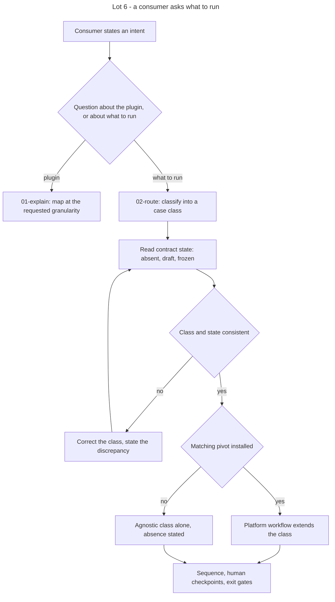

# Instruction: Lot 6 - verb 0 `detail`

## Feature

- **Summary**: the funnel has five verbs plus `harness` and no entry point that states what they do, in which order, and under which gate. `detail` is that entry point: it restitutes the map, and it routes a stated intent to the executable sequence of its case class. Case classes are stack-agnostic and live in `design`; the platform-level workflow that instantiates a class on a given platform lives in the pivot that owns that platform, under a skeleton frozen by the pivot contract.
- **Stack**: `Markdown (Claude Code skills) · JSON (evals, manifests)`
- **Branch name**: `feat/design-2-0/lot-6-detail`
- **Parent Plan**: `2026_07_23-design-2-0-guarantees-alignment-master.md`
- **Sequence**: `8 of 8`
- Confidence: 9/10
- Time to implement: 1 work unit

## Prerequisite

Part 6 done, plugin published at 2.4.0. The map describes the 2.x contract (four artifacts, two gate natures, maturity status); writing it before Lot 5 would describe a state that no longer exists at delivery.

**Independent of part 7.** No shared artifact: `detail` touches no frozen contract, and the migration touches no plugin skill. It may run before, after, or between project migrations.

## Structuring decision

`detail` is a **seventh skill**, not an action prefixed to an existing verb. It is read-only on every artifact of the contract and on project source; it is the only skill of the plugin with no output artifact. It is therefore additive: MINOR bump, no migration.

Two capabilities, two actions, no overlap:

- **explain** answers *what does this do* — the map, at the requested granularity.
- **route** answers *what do I run* — the case class, the sequence, the checkpoints, the gates.

## Case classes

Six, exhaustive over the entry signature (what the consumer holds) crossed with the contract state (absent, draft, frozen). Declared once in `skills/detail/references/workflow-classes.md`; no other file enumerates them.

| Id | Entry signature | Contract state | Sequence |
| -- | --------------- | -------------- | -------- |
| `mockup-multipage` | a visual reference of several pages is authoritative | absent | `define` (intake, copycat fan-out) → human checkpoint on the correspondence table → `adjust` → `enforce` (vocabulary + fidelity) → `diffuse` |
| `brief-only` | a written intent, no visual | absent | `define` (intake, construct) → `destructure` → `adjust` → `enforce` (vocabulary; fidelity only if a reference is produced later) → `diffuse` |
| `codebase-inherited` | source exists, no contract | absent | `destructure` standalone → `define` extraction from the rendered result → `adjust` → `enforce` → reconciliation loop |
| `element-evolution` | one element must evolve | frozen | `destructure` standalone → `adjust` delta re-freeze → `enforce` re-derivation → `diffuse` |
| `contract-drift` | instances diverge from the contract, or the contract was re-frozen | frozen | `adjust` delta if the divergence is arbitrated → `enforce` re-derivation and instance lint → correct/propagate/re-lint loop |
| `element-production` | an element must ship | frozen, gates green | `diffuse` only |

`harness` is not a class: it is the prerequisite of any class whose reference mockup does not exist yet as a measurable artifact. `route` states it as a precondition of `mockup-multipage`, never as a step of the funnel.

## Platform-workflow skeleton (pivot contract extension)

A platform workflow is a pivot artifact. `design` freezes its shape and its resolution rule; it never carries its content.

- Canonical path: `plugins/sc-<techno>/skills/design-bridge/references/workflow-<platform>.md`.
- Five required headings, in this order: `## Case classes covered` · `## Prerequisites (capabilities)` · `## Phases` · `## Gates` · `## Out of scope`.
- Each phase declares its input, its output, and the design verb it instantiates — or `off-funnel` when it instantiates none (environment setup, deployment, production acceptance).
- A platform workflow **instantiates** the funnel gates; it never redefines one and never introduces a gate that the contract does not know.
- Prerequisites are written as **capabilities** (containerized runtime, remote shell access, remote database, static host), never as a vendor, a hosting provider, or a project.
- Resolution by `route`: pivot installed **and** stack matching → the platform workflow extends the case class. Otherwise the agnostic class alone, with the absence stated explicitly and the conditional recommendation to install `sc-<techno>`.

## Architecture projection

### Files to create

- `plugins/design/skills/detail/SKILL.md` - router: two actions, trigger-to-action mapping, transversal rules (read-only, no artifact written, never executes a verb it describes)
- `plugins/design/skills/detail/actions/01-explain.md` - map restitution at the requested granularity (whole funnel, one verb, one action, one gate, one artifact)
- `plugins/design/skills/detail/actions/02-route.md` - classify the intent, read the contract state and the installed pivots, emit the sequence with its checkpoints and gates
- `plugins/design/skills/detail/references/funnel-map.md` - per verb: role, input, output, artifacts touched, contract state before and after, applicable gate. Single source read by `01`; `SKILL.md` does not duplicate it
- `plugins/design/skills/detail/references/workflow-classes.md` - the six case classes: entry signature, sequence, human checkpoints, exit gates, stop conditions
- `plugins/design/skills/detail/evals/scenarios.json` - routing cases, `expect_action` in `explain` / `route` / `null`
- `plugins/sc-php/skills/design-bridge/references/workflow-fse.md` - block-theme platform workflow under the skeleton
- `plugins/sc-js/skills/design-bridge/references/workflow-spa.md` - component-application platform workflow under the skeleton
- `plugins/sc-css/skills/design-bridge/references/workflow-static.md` - stylesheet-only platform workflow under the skeleton

### Files to modify

- `plugins/design/references/sc-pivot-contract.md` - new section: platform-workflow skeleton, canonical path, five headings, capability rule, resolution rule
- `plugins/design/README.md` - skills table gains `detail`; flow diagram gains verb 0
- `plugins/design/.claude-plugin/plugin.json` - version 2.5.0, description gains the verb
- `plugins/sc-php/skills/design-bridge/SKILL.md`, `plugins/sc-js/skills/design-bridge/SKILL.md`, `plugins/sc-css/skills/design-bridge/SKILL.md` - reference the platform workflow they now own
- `plugins/sc-php/.claude-plugin/plugin.json` (0.6.0), `plugins/sc-js/.claude-plugin/plugin.json` (0.12.0), `plugins/sc-css/.claude-plugin/plugin.json` (0.2.0)
- `.claude-plugin/marketplace.json`, `index.json`, root `README.md` - four version entries
- `plugins/design/CHANGELOG.md`, `plugins/sc-php/CHANGELOG.md`, `plugins/sc-js/CHANGELOG.md`, `plugins/sc-css/CHANGELOG.md`
- `aidd_docs/memory/design-plugin.md` - record verb 0 and the pivot ownership of platform workflows

### Files to delete

- none.

## Applicable rules

| Tool   | Name                  | Path                                                    | Why it applies |
| ------ | --------------------- | ------------------------------------------------------- | -------------- |
| repo   | contributing          | `CONTRIBUTING.md`                                        | skill anatomy (`SKILL.md` is a router, `Inputs`/`Process`/`Outputs`/`Test` per action), SemVer in three places, per-plugin CHANGELOG, DRY through `references/` |
| repo   | guideline-readme      | `memory/guideline-readme.md`                             | root README and plugin README updated on every bump |
| repo   | dec-001               | `aidd_docs/internal/decisions/001-pivot-authoring-conventions.md` | reference, never duplicate: the map lives in one file |
| repo   | dec-002               | `aidd_docs/internal/decisions/002-design-funnel-hybrid-pivot.md` | design keeps the WHAT, the pivot keeps the HOW — a platform workflow is a HOW |
| claude | global-conventions    | `C:\Users\fxgui\.claude\CLAUDE.md`                       | no commit without explicit request |

## User Journey

## Risk register

| Risk | Impact | Mitigation |
| ---- | ------ | ---------- |
| The map duplicates the verbs' own `SKILL.md` | two sources drift, the map becomes false without any test failing | the map states role, input, output, artifacts, contract state and gate — never the process of a verb; every entry carries the path of the authoritative file |
| A platform workflow is written in `design` | the transverse criterion is broken again, one lot after Lot 3 relocated the previous ones | the success condition greps the platform vocabulary over `skills/detail`; the three pivot files are required to exist |
| A platform workflow redefines a gate | a project believes it is conformant against a local gate | the skeleton makes `## Gates` an instantiation section; the pivot contract states that no gate is created outside the contract |
| A hosting vendor or a project name enters a pivot workflow | the perimeter rule is broken in the pivot instead of the plugin | prerequisites are written as capabilities; the acceptance criterion greps vendor and project names over the three pivots |
| `route` executes what it describes | a read-only skill writes | transversal rule: `detail` emits a sequence and stops; it invokes no verb |
| Case classes multiply per project met | the router becomes a catalogue | six classes fixed here, closed set; a new terrain is either an existing class or an amendment to this plan |

## Implementation phases

### Phase 1: Freeze the skeleton before writing any workflow

> The container is specified before the content, otherwise the three pivots diverge.

#### Tasks

1. Write the platform-workflow section of `references/sc-pivot-contract.md`: canonical path, five headings, phase declaration (input, output, design verb or `off-funnel`), capability rule, gate-instantiation rule, resolution rule.
2. State the negative rule explicitly: no vendor, no project, no host name.

#### Acceptance criteria

- [x] The section declares the five headings in order and the phase-declaration fields.
- [x] The resolution rule covers the three cases: pivot installed and matching, pivot absent, pivot installed but stack mismatched.

### Phase 2: The map and the case classes

> The two references first, the actions after: the actions only read.

#### Tasks

1. Write `references/funnel-map.md`: one entry per verb including `harness` and `detail` itself, each carrying the path of the authoritative file.
2. Write `references/workflow-classes.md`: the six classes, each with entry signature, contract state, sequence, human checkpoints, exit gates, stop conditions.
3. State in the class file where a platform workflow may extend each class.

#### Acceptance criteria

- [x] Every verb of the plugin appears exactly once in the map.
- [x] The six classes cover the entry signature crossed with the three contract states; no class overlaps another on the same pair.
- [x] No stack, platform or vendor is named in either file.

### Phase 3: The skill

> Router plus two actions, read-only.

#### Tasks

1. Write `SKILL.md`: actions table, trigger-to-action mapping in prose, transversal rules (read-only on contract and source, no artifact written, never invokes the verbs it describes).
2. Write `01-explain.md`: granularity resolution (whole funnel, one verb, one action, one gate, one artifact) and refusal to paraphrase a process the authoritative file owns.
3. Write `02-route.md`: classification, contract-state reading, pivot detection, emission of the sequence; discrepancy between stated class and observed state is reported, not silently corrected.
4. Write `evals/scenarios.json` including negative cases that must not trigger the skill.

#### Acceptance criteria

- [x] Each action carries `Inputs` / `Process` / `Outputs` / `Test`, and each `Test` is observable.
- [x] `SKILL.md` duplicates neither the map nor the class table.
- [x] The eval file is valid JSON and every `expect_action` is `explain`, `route` or `null`.

### Phase 4: The three platform workflows

> Content in the pivots, under the frozen skeleton.

#### Tasks

1. Write the three workflow files, each declaring the case classes it covers.
2. Reference each from its `design-bridge/SKILL.md`.
3. Bump the three pivots, register the versions, update their CHANGELOG.

#### Acceptance criteria

- [x] Each file carries the five headings in order.
- [x] Every phase declares input, output and the design verb it instantiates, or `off-funnel`.
- [x] No prerequisite names a vendor, a host or a project; each is a capability.
- [x] No gate is created that the contract does not know.

### Phase 5: Registration and closure

#### Tasks

1. Bump `design` to 2.5.0 in the three registration points, update both READMEs and the CHANGELOG.
2. Run the success condition end to end.
3. Update `aidd_docs/memory/design-plugin.md`.

#### Acceptance criteria

- [x] The four plugin versions are consistent across `plugin.json`, `marketplace.json`, `index.json` and the READMEs.
- [x] The success condition passes in full.

### Phase 6: Transverse writing criterion

> Exhaustive, agnostic, fewest words.

#### Acceptance criteria

- [x] No project name anywhere in the perimeter, comments and docstrings included.
- [x] No stack presupposition in `plugins/design/skills/detail/`.
- [x] No duplication between `SKILL.md`, its actions and its references; rationale in the CHANGELOG.

## Amendments

- **A1 — Pivot versions bumped by one MINOR each, not from the versions printed in "Files to modify".** The plan text (lines 84) records `sc-php 0.6.0`, `sc-js 0.12.0`, `sc-css 0.2.0` as the *starting* versions because Lot 3 already consumed those numbers on disk. The delivered bumps are therefore `sc-php 0.6.0 → 0.7.0`, `sc-js 0.12.0 → 0.13.0`, `sc-css 0.2.0 → 0.3.0` (next MINOR: each receives a new platform-workflow reference, additive). Registered in `marketplace.json`, `index.json`, each `plugin.json` and each CHANGELOG.
- **A2 — Pre-existing project-name match tolerated outside the perimeter.** `grep -rniE 'mauceri|scriptami' plugins/design` returns one line in `plugins/design/audits/2026_07_design-cycle-critique.md` — a retrospective audit narrative that legitimately names the test project in its method disclosure. It is neither a pivot nor `skills/detail`, and it is outside the vocabulary grepped by the success_condition. Left untouched: rewriting an audit report would falsify its record. The Phase 6 criterion "no project name in the perimeter" is read as the delivered perimeter (skills/detail + the three pivots), all clean.

## Log

- **Phase 1** — `references/sc-pivot-contract.md § Workflow de plateforme` written before any workflow: canonical path, five headings (English interface tokens), phase declaration (input/output/verbe or `off-funnel`), capability rule, gate-instantiation rule, three-case resolution table.
- **Phase 2** — `skills/detail/references/funnel-map.md` (8-column map, one row per verb incl. `detail`=verb 0 and `harness`=off-funnel, each row citing its authoritative file) and `references/workflow-classes.md` (the six closed case classes) written first; the actions only read them.
- **Phase 3** — `skills/detail/SKILL.md` (router, two actions, read-only transversal rules), `actions/01-explain.md`, `actions/02-route.md` (both `Inputs`/`Process`/`Outputs`/`Test`), `evals/scenarios.json` (18 scenarios: 6 explain / 7 route / 5 null).
- **Phase 4** — three platform workflows under the frozen skeleton (`workflow-fse.md`, `workflow-spa.md`, `workflow-static.md`), each referenced from its `design-bridge/SKILL.md`; three pivots bumped (see A1).
- **Phase 5** — `design` 2.5.0 across `plugin.json` + `marketplace.json` + `index.json`, both READMEs, `CHANGELOG.md`, and `aidd_docs/memory/design-plugin.md` (verb 0 + pivot ownership of platform workflows). Success condition run end to end: all four criteria green.
- **Phase 6** — transverse greps clean over the delivered perimeter (see A2); no duplication between `SKILL.md`, its actions and its references (map and class table each have a single authoritative file, cited never copied).
- **No commit / push / tag** — held pending explicit user request (global convention).

## Validation flow demonstration

1. Ask the plugin what it does with no contract present: the map is returned, and `route` proposes `brief-only` or `mockup-multipage` depending on the stated entry signature.
2. Ask what to run on a frozen contract whose instances diverge: `contract-drift` is returned with the re-lint loop and both gates.
3. Uninstall the matching pivot and repeat: the same class is returned, the platform extension is stated as absent, and installing `sc-<techno>` is recommended.
4. Grep the platform vocabulary over `skills/detail`: no match. **Verified** — `grep -rniE 'wordpress|wp-cli|fse|gutenberg|vue|react|svelte|nuxt|tailwind|laravel|symfony|django|docker|alwaysdata' plugins/design/skills/detail` exits 1.
5. Check the five headings in each of the three pivot workflows. **Verified** — `## Case classes covered` · `## Prerequisites (capabilities)` · `## Phases` · `## Gates` · `## Out of scope` present, in order, in all three files.
