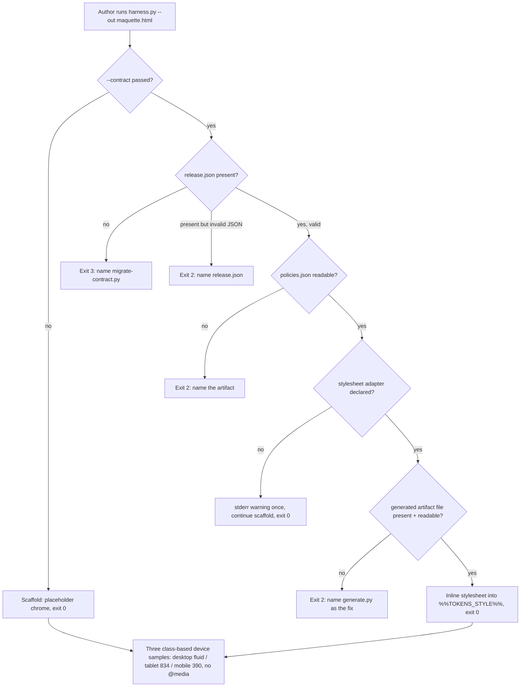

<!--  AI INSTRUCTIONS ONLY -- Follow those rules, do not output them.
- ENGLISH ONLY. Straight to the point, no emojis in the plan body.
- This file IS the live tracking file for For Sure.
- Log is APPEND-ONLY.
-->

# Instruction: Align design:harness template with contract 2.0

## Feature

- **Summary**: The harness generator (`adapters/harness/harness.py`) and the file it emits predate the 2.0 contract split (`release.json` + `tokens/components/policies/oracle/deviations`). This lot couples the harness to a frozen contract on an **opt-in** basis: a new optional `--contract <dir>` flag makes the generated maquette inline the contract's already-generated stylesheet adapter (the `consumer:"stylesheet"` entry of `policies.json § adapters[]`) instead of hardcoded chrome colors, so the reference maquette speaks the same tokens the implementation is linted against. The device model is restated as three discrete, class-based device **samples** (desktop fluid, tablet 834, mobile 390) with no `@media` in the harness and no breakpoint derived from the contract. The harness participates in the plugin's fixed exit-code space (0/2/3, never 4) only under `--contract`; the default scaffold path is byte-behaviour-unchanged and always exits 0.
- **Stack**: `Python 3 (stdlib only — argparse, json, pathlib, sys)`, generated artifact is `HTML5 + inline CSS/JS`. No third-party dependency. Windows + POSIX.
- **Branch name**: `feat/design-harness-contract-2-0` (fresh branch off `main`; the former `feat/design-2-0` was merged and deleted — do not reuse it)
- **Parent Plan**: `2026_07_23-design-2-0-guarantees-alignment-master.processed.md` (follow-on lot; the eight child lots are done, this extends the alignment to the one verb the master left on 1.x chrome)
- **Sequence**: `standalone` (depends only on shipped tooling: `generate.py`, `migrate-contract.py`, the 2.0 schema)
- Confidence: 9/10
- Time to implement: 1 work unit

## Decisions locked in brainstorm (do not relitigate)

1. **Hybrid coupling is opt-in.** `--contract` is optional. Absent it, the harness scaffolds exactly as today.
2. **Three discrete device views by class.** No `@media` anywhere in the harness template or its guidance. Frame widths 834 (tablet) / 390 (mobile) are fixed **device samples**, not breakpoints — nothing is derived from `tokens.json § breakpoint.*`.
3. **Tokens injection = option C.** Under `--contract`, inline the *already generated* artifact named by the `consumer:"stylesheet"` entry of `policies.json § adapters[]`. No derivation, no regeneration inside the harness. If that entry is declared but the artifact file is absent/unreadable → **exit 2 naming `tools/generate.py`** as the fix.
4. **Exit codes only under `--contract`:** `release.json` absent → **exit 3** (name `tools/migrate-contract.py`); a required artifact absent/unreadable → **exit 2**; **no exit 4**; without `--contract` → **exit 0**.
5. **Edge case:** `--contract` passed but `policies.json` declares **no** `consumer:"stylesheet"` adapter → single `stderr` warning, continue in scaffold (exit 0).
6. **Scope:** `harness.py` + template, `skills/harness/SKILL.md` + references, accord with `measure.py`/`oracle.json`, fixtures + eval scenarios.
7. **Cross-cutting constraints:** no project name anywhere under `plugins/design/` (identifiers included); Python stdlib only.
8. **Version:** minor bump `2.5.0 → 2.6.0`.

## Architecture projection

### Files to modify

- `plugins/design/adapters/harness/harness.py` - add optional `--contract` arg; add a contract-resolution path (read `release.json`/`policies.json`, locate the `stylesheet` adapter, read + inline its text into a new `%%TOKENS_STYLE%%` slot); implement the 0/2/3 exit-code space; keep the default path untouched.
- `plugins/design/skills/harness/SKILL.md` - document `--contract`, the three device **samples** (no `@media`, no derived breakpoint), the option-C inlining, the exit-code table under `--contract`, and the scaffold-continue warning; add the new reference link.
- `plugins/design/adapters/harness/harness.py` (TEMPLATE block) - insert `%%TOKENS_STYLE%%` as the first `<style>` block so inlined `:root` tokens are defined before the chrome; rewrite the RESPONSIVE header comment and the LLM prompt to say "device sample, class-based, never `@media`"; drop the two lines that currently claim `@media` works under the oracle.
- `plugins/design/adapters/harness/harness.py` (embedded LLM framing) - the generated file frames the author LLM via a `<!-- … -->` header block (`harness.py:158-210`, incl. the copy-paste "PROMPT LLM") and the `//` rules above the `pages` registry (`harness.py:234-241`). Neither mentions tokens today. Under `--contract`, both must instruct: **consume the inlined contract tokens via `var(--…)`; never hardcode color/spacing/type values** — otherwise the author LLM bypasses the single source of truth the coupling exists to enforce.
- `plugins/design/adapters/measure/config-gen.py` - accord only, no behavioural change: `_derive_breakpoints` skips any `tokens.breakpoint.*` key absent from `_BP_MAP` (`config-gen.py:110-112`) and stamps `mockup_viewport = name` where `name ∈ {mobile, tablet, desktop}` (`:121-122`); the fallback is mobile+desktop (`:55-56`). The closed set is therefore a proven invariant, not a thing to verify at runtime — add one anchoring comment citing these lines and the harness-exposed set.
- `plugins/design/CHANGELOG.md` - `## [2.6.0]` entry (minor); note the opt-in `--contract` coupling and the device-sample clarification; rationale lives here, not in the skill.
- `plugins/design/.claude-plugin/plugin.json` - `version` 2.5.0 → 2.6.0.
- `.claude-plugin/marketplace.json` - design entry `version` 2.5.0 → 2.6.0.
- `index.json` - design `version` 2.5.0 → 2.6.0.

### Files to create

- `plugins/design/references/harness-contract.md` - the harness↔contract coupling reference: how `--contract` resolves the stylesheet adapter, the option-C rule (inline the generated artifact, never derive), the exit-code space restricted to `--contract`, the three device samples, and the measure/oracle accord (the closed viewport set). DRY target for SKILL.md.
- `plugins/design/skills/harness/evals/scenarios.json` - eval scenarios exercising: scaffold-only trigger, `--contract` on a frozen 2.x contract, 1.x contract (exit 3), missing stylesheet artifact (exit 2), no stylesheet adapter (warning + scaffold).
- `plugins/design/adapters/harness/fixtures/` - a minimal, self-contained fixture set (stdlib-buildable, no project name): a `2x/` contract with `release.json` + `policies.json` declaring a `stylesheet` adapter + a generated stylesheet file present; a `2x-no-stylesheet/` contract; a `2x-missing-artifact/` contract (adapter declared, file absent); a `2x-bad-release/` contract (`release.json` present but not valid JSON → exit 2); a `1x/` contract (no `release.json` → exit 3).
- `plugins/design/tools/harness-selftest.sh` - runnable proof backing `success_condition`: drives `harness.py` against the four fixtures and asserts each exit code and that the 2.x run inlined the stylesheet banner. (POSIX sh; Python stdlib only for any helper.)

### Files to delete

- none.

## Applicable rules

| Tool   | Name | Path | Why it applies |
| ------ | ---- | ---- | -------------- |
| claude | design-plugin memory | `aidd_docs/memory/design-plugin.md` | Records the plugin's own conventions; the change must stay consistent with them. |
| claude | contract-schema | `plugins/design/references/contract-schema.md` | Defines `policies.json § adapters[]`, the `stylesheet` consumer role, and the `release.json`-absent = 1.x rule the harness must honor. |
| claude | master § Exit-code space | `aidd_docs/tasks/2026_07/2026_07_23-design-2-0-guarantees-alignment-master.processed.md` | Fixed 0/1/2/3/4 table binding every tool the plugin ships; harness must not reassign a code (uses 0/2/3, never 4). |
| claude | transverse acceptance criterion | same master file | No project name under `plugins/design/` (identifiers included); exhaustive, agnostic, fewest words. |
| claude | write-system-procedure | `plugins/design/references/write-system-procedure.md` | Adapter emission rule — the harness reads an emitted adapter, it must not re-emit or derive one. |

## User Journey

## Risk register

| Risk | Impact | Mitigation |
| ---- | ------ | ---------- |
| Inlined stylesheet ordering | Page functions can't resolve `var(--…)` if tokens are defined after use | Non-conflict, ordering only: `generate.py § emit_css` (`generate.py:162-164`) emits `:root { --… }` custom properties exclusively — no element rules — and the chrome uses its own literals, so there is no cascade fight. Placing `%%TOKENS_STYLE%%` first simply guarantees the `:root` vars exist before any page markup references them. |
| `--media`-removal breaks oracle measurement | Fidelity gate mis-measures device breakpoints | Confirmed non-issue: `measure.py` sets the real context width per breakpoint AND toggles the frame class via `setViewport`; class-based samples are what the oracle already drives. Document the accord in `harness-contract.md`. |
| Exit-code collision with the fixed space | A malformed `--contract` read as an unmigrated contract, or a 4 leaking in | Follow master table verbatim: 3 is reserved for `release.json` absent only; every other read failure is 2; 4 is never emitted by harness. Add a fixture per branch. |
| Coupling turns mandatory by accident | Existing scaffold users break | `--contract` defaults to `None`; the entire contract path is behind `if args.contract`. Scaffold fixture in the selftest guards exit 0 with no flag. |
| Project name leaks via a fixture or docstring | Violates the transverse criterion | Fixtures use generic namespaces (`--color-...`, `sample`); reviewer greps the harness perimeter for project tokens before close. |

## Implementation phases

### Phase 1: Contract resolution + exit-code space in harness.py

> Add the opt-in `--contract` path with the exact 0/2/3 exit semantics; leave the scaffold path untouched.

#### Tasks

1. Refactor `main()` to `return int` and wire `sys.exit(main())`; convert the **existing** no-pages `sys.exit(1)` to `return 2` (invocation error) — 1 is not in the harness's code space. This is a prerequisite: the current code already emits 1, so the "never 1" guarantee is a change, not a given.
2. Add `--contract <dir>` (optional, default `None`) to the argparse.
3. When set: resolve `release.json`; absent → print the migration hint naming `tools/migrate-contract.py`, return 3. Present-but-unparseable (not valid JSON) → return 2 naming `release.json` (a corrupt contract is an env error, not a 1.x contract — only absence means 1.x).
4. Read `policies.json`; missing/unreadable/not-an-object → return 2 naming the artifact and path (mirror `generate.py § read_json`/`fail`).
5. Find the first `adapters[]` entry with `consumer == "stylesheet"`; none → single stderr warning, fall through to scaffold, return 0.
6. Resolve the entry's `artifact` path relative to the contract dir; absent/unreadable → return 2 naming `tools/generate.py` as the fix (option C: never derive here).
7. Read the stylesheet text; expose it to the template via `%%TOKENS_STYLE%%`. Scaffold path substitutes an empty string for that slot.

#### Acceptance criteria

- [ ] `harness.py --out X` (no `--contract`) still writes the file and exits 0, byte-identical chrome to pre-change except the empty `%%TOKENS_STYLE%%` slot.
- [ ] `--contract` on a fixture without `release.json` exits 3 and stdout/stderr names `migrate-contract.py`.
- [ ] `--contract` on a fixture whose `release.json` is present but not valid JSON exits 2 naming `release.json` (not 3 — absence alone is 1.x).
- [ ] `--contract` with an unreadable/absent `policies.json` exits 2 naming the artifact.
- [ ] `--contract` with a declared stylesheet adapter whose file is absent exits 2 naming `generate.py`.
- [ ] `--contract` with no stylesheet adapter emits exactly one stderr line and exits 0 (scaffold).
- [ ] The pre-existing no-pages path now exits 2 (was 1); harness never returns 1 or 4 on any path.

### Phase 2: Template — inlined tokens slot + discrete device samples

> Insert the tokens slot and restate the device model as three class-based samples with no `@media`.

#### Tasks

1. Add `%%TOKENS_STYLE%%` as the first `<style>` block, before the chrome rules (so the inlined `:root` tokens are defined before any page markup references `var(--…)`).
2. Rewrite the RESPONSIVE header comment and the LLM prompt: device variations are `.preview-frame.mobile|tablet <sel>`, class-based, **never `@media`**; the three views are device samples (desktop fluid, tablet 834, mobile 390), not breakpoints; nothing is derived from the contract.
3. Remove the two lines claiming `@media` also works under the oracle.
4. Keep `.preview-frame.tablet` = 834 and `.mobile` = 390 fixed literals; add a one-line comment that these are device samples, not contract breakpoints.
5. Update the embedded LLM framing so it teaches token usage under `--contract`: in the `<!-- … -->` header block (incl. the "PROMPT LLM" paragraph) and the `//` rules above `pages`, add "when the contract stylesheet is inlined, consume its tokens via `var(--…)`; do not hardcode color/spacing/type values." Keep the scaffold wording unchanged when no stylesheet is inlined.

#### Acceptance criteria

- [ ] Generated HTML contains no `@media` token anywhere.
- [ ] Under `--contract`, the generated `<head>` contains the inlined stylesheet banner (`GENERATED from tokens.json`) before the chrome rules.
- [ ] `window.setViewport('desktop'|'tablet'|'mobile')` and the three toolbar buttons are unchanged; frames render at fluid / 834 / 390.
- [ ] Header comment and LLM prompt no longer mention `@media` or derived breakpoints.
- [ ] Under `--contract`, the embedded LLM framing (header block + `//` rules) instructs consuming tokens via `var(--…)` and not hardcoding values; the scaffold (no `--contract`) framing is unchanged.

### Phase 3: Docs, accord, fixtures, evals, version

> Ship the reference, the SKILL update, the measure/oracle accord note, the fixtures + selftest, the evals, and the version bump.

#### Tasks

1. Create `references/harness-contract.md` (coupling, option C, exit-code space under `--contract`, device samples, viewport accord). Keep it agnostic and dense.
2. Update `skills/harness/SKILL.md`: `--contract` parameter row, exit-code table under `--contract`, device-sample paragraph, scaffold-continue warning; link the new reference; strip any `@media` mention.
3. Accord: annotate `config-gen.py § _derive_breakpoints` with a comment stating the proven invariant `mockup_viewport ∈ {desktop, tablet, mobile}` (keys outside `_BP_MAP` are skipped, `:110-112`; `name` stamped `:121-122`; fallback `:55-56`) and cross-linking `harness-contract.md`. No runtime assert needed — it is closed by construction.
4. Create the five fixture contracts under `adapters/harness/fixtures/` (2x, 2x-no-stylesheet, 2x-missing-artifact, 2x-bad-release, 1x) — generic namespaces, no project name.
5. Create `tools/harness-selftest.sh` driving the five fixtures + the scaffold run, asserting each exit code and the inline banner. Use `mktemp -d` for output paths (portable on Git Bash/Windows), not hardcoded `/tmp/…`; clean up on exit.
6. Create `skills/harness/evals/scenarios.json` (routing/behaviour scenarios matching the five branches).
7. Bump version to 2.6.0 in `plugin.json`, `.claude-plugin/marketplace.json`, `index.json`; add the `## [2.6.0]` CHANGELOG entry.

#### Acceptance criteria

- [ ] `bash tools/harness-selftest.sh` exits 0 (scaffold + all five fixture branches assert green: 2x→0, 2x-no-stylesheet→0+warn, 2x-missing-artifact→2, 2x-bad-release→2, 1x→3).
- [ ] `grep -rEi "mauceri|scriptami|fiduciaire|geneve|genève" adapters/harness skills/harness references/harness-contract.md` returns nothing (no project name in perimeter).
- [ ] SKILL.md and `harness-contract.md` carry no `@media` and no derived-breakpoint claim.
- [ ] `plugin.json`, `marketplace.json`, `index.json` all read 2.6.0; CHANGELOG has a `[2.6.0]` section.
- [ ] `config-gen.py § _derive_breakpoints` carries the invariant comment citing `:110-112`, `:121-122`, `:55-56` and linking `harness-contract.md`.

## Amendments

<!-- AI-initiated changes during implementation. Each entry prefixed with 🤖. -->

- 🤖 Phase 2 wording: the guidance prose no longer writes "never `@media`" but "no media query / jamais de media query". Rationale: Phase 2 AC-1 ("no `@media` token anywhere") and AC-4 ("Header comment and LLM prompt no longer mention `@media`") forbid the literal token even in a negation; a literal-string grep would otherwise flag the instructional text. Meaning is identical.
- 🤖 Phase 1 (out-of-task, required for the Windows success_condition): the final success `print()` used `✓`/`→`, which raise `UnicodeEncodeError` on Windows cp1252 stdout. Harmless while `main()` was called bare, but once wired as `sys.exit(main())` the exception propagated as exit 1 — breaking the scaffold "exit 0" criterion on Windows. Changed the banner to ASCII (`Harness written -> …`). File content (UTF-8) is unaffected.

## Log

<!-- APPEND ONLY. One entry per step attempt. -->

- 2026-07-25 · Branch `feat/design-harness-contract-2-0` off `main`. Phase 1+2: added opt-in `--contract` to `harness.py` (resolver `resolve_tokens_style`, 0/2/3 exit space, `main()` returns int + `sys.exit(main())`, no-pages 1→2); template gained `%%TOKENS_STYLE%%` (inlined before chrome) and conditional `%%TOKENS_NOTE_HEADER%%` / `%%TOKENS_NOTE_RULES%%`; all `@media` prose reworded; device-sample comments added. All 7 Phase-1 + 5 Phase-2 acceptance criteria verified green.
- 2026-07-25 · Phase 3: created `references/harness-contract.md`, five fixtures under `adapters/harness/fixtures/`, `tools/harness-selftest.sh`, `skills/harness/evals/scenarios.json`; updated `skills/harness/SKILL.md` (param row, exit table, device-sample para, reference link, `@media` stripped); annotated `config-gen.py § _derive_breakpoints`; bumped 2.5.0→2.6.0 in `plugin.json` / `marketplace.json` / `index.json` + CHANGELOG `[2.6.0]`. `bash tools/harness-selftest.sh` → ALL GREEN, exit 0. Perimeter project-name grep clean; docs `@media`-free; JSON valid; py compiles.

## Validation flow demonstration

1. `cd plugins/design && T=$(mktemp -d)`
2. `python adapters/harness/harness.py --out "$T/scaffold.html"` → exits 0; open it: three device buttons work, no `@media`, placeholder chrome.
3. `python adapters/harness/harness.py --out "$T/coupled.html" --contract adapters/harness/fixtures/2x` → exits 0; `$T/coupled.html` `<head>` shows the inlined `GENERATED from tokens.json` stylesheet before the chrome rules, and the LLM framing tells the author to use `var(--…)`.
4. `python adapters/harness/harness.py --out "$T/x.html" --contract adapters/harness/fixtures/1x` → exits 3, message names `migrate-contract.py`.
5. `python adapters/harness/harness.py --out "$T/x.html" --contract adapters/harness/fixtures/2x-bad-release` → exits 2, message names `release.json`.
6. `python adapters/harness/harness.py --out "$T/x.html" --contract adapters/harness/fixtures/2x-missing-artifact` → exits 2, message names `generate.py`.
7. `python adapters/harness/harness.py --out "$T/x.html" --contract adapters/harness/fixtures/2x-no-stylesheet` → one stderr warning, scaffold written, exits 0.
8. `bash tools/harness-selftest.sh` → exits 0.
