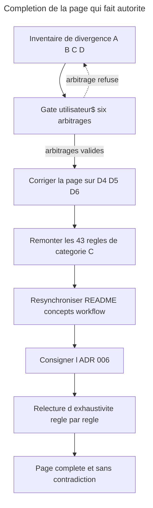

# Instruction: completer la page qui fait autorite

## Feature

- **Summary**: `docs/control.md` a ete ecrite comme le modele de la skill, mais elle n'en porte aujourd'hui que la moitie : 43 regles normatives existent uniquement dans `skills/control/`. En DDD, une regle absente de la page n'existe pas. Cette part remonte les 43, tranche les 6 contradictions, et resynchronise les pages satellites.
- **Stack**: `Markdown (Claude Code plugin docs), francais, aucune execution`
- **Branch name**: `docs/control-ddd-alignment`
- **Parent Plan**: `2026_07_27-control-ddd-alignment-master.md`
- **Sequence**: `1 of 3`
- Confidence: 9/10
- Time to implement: ~1 session

## Architecture projection

### Files to modify

- `plugins/overcode/docs/control.md` - accueillir les 43 regles de la categorie C ; appliquer les corrections D4, D5, D6 ; le travail deja engage dans l'arbre (inversion d'autorite + quatrieme autorite) reste en place
- `plugins/overcode/README.md` - ligne 16 : « les trois autorites » ne decrit plus la page
- `plugins/overcode/docs/concepts.md` - ligne 70 : meme formule perimee
- `plugins/overcode/docs/workflow.md` - ligne 107 : verifier que le renvoi reste exact apres extension ; y loger la frontiere `control` / `behave` (C43) si elle n'a pas sa place sur la page

### Files to create

- `aidd_docs/internal/decisions/006-control-page-authority.md` - ADR : la page devient l'autorite (inversion de l'ancien encart « la skill fait foi »), et les six arbitrages avec leur motif. Le rationnel n'a pas sa place dans les fichiers d'instruction — c'est la regle de redaction du depot.

### Files to delete

- aucun

## Applicable rules

| Tool   | Name | Path | Why it applies |
| ------ | ---- | ---- | -------------- |
| claude | plugins-marketplace | `C:\Users\fxgui\.claude\rules\plugins-marketplace.md` | travailler dans la source `plugins/overcode/`, jamais dans le cache `~/.claude/plugins/cache/` |
| claude | skill-writing-style | `C:\Users\fxgui\.claude\projects\C--Users-fxgui-Documents-LLM-Marketplace\memory\skill-writing-style.md` | exhaustif, agnostique, le moins de mots possible ; le rationnel va dans l'ADR ou le CHANGELOG, jamais dans l'instruction |
| claude | readme-existant-only | `C:\Users\fxgui\.claude\projects\C--Users-fxgui-Documents-LLM-Marketplace\memory\readme-existant-only.md` | le README decrit l'existant ; aucune version ni historique |
| repo | CONTRIBUTING | `CONTRIBUTING.md` | coherence README plugin / docs / CHANGELOG a chaque changement |

## User Journey

## Risk register

| Risk | Impact | Mitigation |
| ---- | ------ | ---------- |
| La page double de volume et devient un doublon de la skill | Deux sources a maintenir, derive garantie au bump suivant | La page porte la **regle et son motif** ; la skill porte la regle et sa **procedure**. Aucune etape de `## Process` ne remonte sur la page |
| Un arbitrage tranche en faveur de la page alors que la skill avait raison | On casse une borne juste pour respecter une formule trop large | D4, D5, D6 sont explicitement des corrections **de la page** ; le gate les presente comme telles avec leur motif |
| Une regle de la categorie C est remontee en la reformulant, donc en la changeant | La phase 2 testerait une regle que la skill n'applique pas, FAIL illisible | Remonter par citation-reformulation courte, en notant le fichier source de chaque regle dans la table de tracabilite ci-dessous ; la phase 3 rouvrira le fichier source |
| C43 (frontiere `behave`) n'a pas de place naturelle sur la page | Regle orpheline | Decision explicite au gate : page ou `workflow.md`, jamais les deux |

## Implementation phases

### Phase 1: Gate d'arbitrage

> Trancher les six contradictions avant d'ecrire une ligne.

#### Tasks

1. Presenter les six contradictions D1..D6 avec les deux formulations en regard et la recommandation du master.
2. Faire trancher chacune. Une contradiction non tranchee bloque la part entiere — pas de precedence implicite.
3. Decider ou atterrit C43 (frontiere `control` / `behave`) : page ou `workflow.md`.
4. Consigner les six decisions dans `aidd_docs/internal/decisions/006-control-page-authority.md`, avec l'inversion d'autorite deja engagee.

#### Acceptance criteria

- [ ] Les six arbitrages sont ecrits dans l'ADR 006 avec, pour chacun, le camp retenu et le motif en une phrase.
- [ ] L'ADR nomme explicitement D4, D5, D6 comme des corrections de la page et non des exceptions au principe d'autorite.
- [ ] La destination de C43 est decidee et unique.

### Phase 2: Corriger la page sur les trois points ou elle a tort

> Une page qui fait autorite ne peut pas rester fausse sur trois points.

#### Tasks

> 🤖 Reecrites apres le gate : le master recommandait un camp, l'utilisateur en a retenu un autre sur D4, D5 et D6. Voir `Amendments`.

1. **D5** — ligne `Phase` du tableau des autorites : **conserver** « ce qui est analyse », borne par l'obligation de lister les fichiers ecartes. La phase reduit l'univers et declare ce qu'elle en retire.
2. **D5 bis** — noter pour la part-3 que `phase-framework.md:199-203` perd son argument par analogie (« same boundary as the phase »), l'invariant des domaines devant porter son motif propre.
3. **D6** — section `La phase` : remplacer « la lecture du rapport de couverture » par la distinction **quels fichiers entrent** dans la lecture (D5) / **ce qu'une donnee y signifie** (jamais la phase). Une absence du rapport vaut « non couvert » dans toutes les phases.
4. **D4** — section `Les parametres` : le `scope` designe **un seul** univers partout — le code source **et les tests qui lui correspondent** —, resolu **symetriquement** pour que `scope=tests/legacy/` reste exprimable.
5. **D1** — section `Les confirmations` : la page admet le lot nomme par l'utilisateur pour les retraits, et enonce l'asymetrie avec les ajouts (D3).
6. **D2, D3** — la page gagne ; noter les corrections attendues cote skill dans la table de tracabilite pour la part-3.

#### Acceptance criteria

- [ ] La ligne `Phase` du tableau des autorites porte l'univers **et** l'obligation de declarer les ecartes.
- [ ] La section `La phase` distingue ce qui entre dans la lecture de ce qu'une donnee signifie.
- [ ] Le paragraphe des parametres enonce **un seul** univers de `scope` et sa resolution symetrique.
- [ ] `Les confirmations` porte les deux regimes et le motif de leur asymetrie.
- [ ] Aucune modification page sur D2, D3 — elles sont reportees telles quelles en part-3.

### Phase 3: Remonter les 43 regles de la categorie C

> Ce que la skill applique et que la page tait.

#### Tasks

1. Creer/etendre les sections d'accueil listees dans la table de tracabilite ci-dessous, dans l'ordre du document.
2. Remonter chaque regle en conservant sa **borne** : une regle remontee sans sa borne est une regle affaiblie.
3. Pour chaque regle remontee, verifier qu'elle est bien une **regle** et non une etape de procedure ; une etape se jette.
4. Relire la page en continu : aucune regle ne doit apparaitre deux fois sous deux formulations.

#### Table de tracabilite — les 43 regles a remonter

| Id | Regle | Source dans la skill | Section d'accueil sur la page |
|---|---|---|---|
| C1 | les routes de chainage sont un contrat : celui qui nomme passe la main, celui qui recoit ne recalcule pas | `SKILL.md` · `06-align` | `### Le contrat de chainage` (nouveau, sous `## Le chainage`) |
| C23 | `05-stats` n'ecrit rien, ne propose rien ; suggerer une action est permis, la lancer non | `05-stats` | idem |
| C24 | `control` ne garde aucun etat entre deux executions | `05-stats` | idem |
| C12 | les trois heuristiques de retrait : doublon, trivial, getter/setter — le nombre de lignes seul ne qualifie jamais | `02-audit` | `## Ce qui qualifie un retrait` (nouveau) |
| C13 | un outlier de densite pointe un fichier, il ne remplit jamais une ligne du tableau ; un fichier examine et blanchi est rapporte comme tel | `02-audit` | idem |
| C10 | un lot se compose de quatre choses, toutes requises : critere en une phrase, compte par motif, echantillon a l'ecran, chemin d'une liste exhaustive ecrite **avant** la question ; le refus est en bloc, sans repli par item | `06-align` | `## Les confirmations` (extension) |
| C11 | l'ensemble sortant repose sur deux motifs et exige les deux : heuristiques de `02-audit` + `phase-obsolete` ; un test qu'aucun des deux ne qualifie est exclu du lot | `06-align` | idem |
| C37 | le regime de confirmation couvre trois actes, pas un : supprimer un test, appliquer un correctif de config, ecrire un test propose | `SKILL.md` · `03-configure` · `01-write` | idem |
| C4 | `testing.md` appartient a la skill de memoire projet d'`aidd-context` ; toutes les actions sauf `06-align` ne font que le lire ; on le designe par son role, jamais par un numero d'action fige | `SKILL.md` | `## Le document du projet` (nouveau) |
| C5 | un document reste en forme de template est traite comme **absent** pour la decision de tier ; correspondance forcee unit+integration → `contract`, end-to-end → `e2e` ; dire lequel des deux cas on a rencontre | `SKILL.md` · `05-stats` | idem |
| C26 | non documente se rapporte comme non documente, jamais comme « suit implicitement le defaut » ; le budget est alors structurellement nul | `05-stats` · `04-strengthen` | idem |
| C40 | un cas non tranche part sur `contract` avec l'ambiguite signalee, jamais sur `e2e` en silence | `references/decision-framework.md` | idem |
| C2 | un plafond de nombre declare par le projet l'emporte **en tant que plafond** ; la densite est rapportee a cote, car un plafond dit combien et une densite dit si c'est au bon endroit | `SKILL.md` · `test-density.md` | `## La densite, pas le compte` (extension) |
| C3 | `limit` ne vient que d'une limite de nombre de tests explicite ; un pourcentage de couverture n'est pas un budget et ne le devient jamais | `SKILL.md` · `01-write` · `05-stats` | idem |
| C14 | deux lectures d'un outlier, a discriminer avant d'en emettre une : dernier decile de points de branchement → signal de refactoring, et **cette skill ne propose aucun refactoring** ; sinon → sujet de `02-audit` | `test-density.md` | idem |
| C15 | angle mort connu : la discrimination pilotee par la donnee n'entre pas au denominateur ; un outlier est un fichier a regarder, jamais un verdict rendu sur lui | `test-density.md` · `06-align` | idem |
| C16 | cas degeneres et leur ordre : « aucun test » d'abord, fait le plus exterieur rapporte une fois ; sans rapport de couverture → non mesurable et pourquoi, nommer `03-configure`, ne jamais approximer un denominateur ; population insuffisante → ni mediane ni outlier ; declarer la regle de correspondance et le nombre de fichiers qu'elle n'a pas apparies | `test-density.md` · `05-stats` | idem |
| C17 | raisonner sur `covered`/`total`, jamais sur un pourcentage seul ; un fichier present au glob et absent du rapport est **non couvert**, pas inexistant | `04-strengthen` | `## Les bornes de mesure` (nouveau) |
| C18 | le glob source du pivot pilote l'univers classifiable ; le rapport de couverture ne definit jamais l'univers, il l'enrichit ; `scope` le reduit, `domain` non | `04-strengthen` · `pivot-contract.md` | idem |
| C19 | ce qu'un test prouve sur une frontiere externe et ce qu'il ne prouve pas ; « hors de portee du test » se renvoie a la supervision et ne devient jamais un test propose ; une frontiere vaut un test par defaut — un plafond, pas un quota | `04-strengthen` · `phase-framework.md` | `## Les frontieres externes` (nouveau) |
| C8 | aucun fichier de test trouve → aucun classement, un constat, un renvoi au document de strategie, et on s'arrete | `04-strengthen` | `## Les cas limites du classement` (nouveau) |
| C9 | saturation → rapporter le total, dire que le classement ne peut pas etre pertinent, demander un `scope` plus etroit ; **ne jamais proposer un `domain` comme remede**, il reordonne la meme population | `04-strengthen` · `SKILL.md` | idem |
| C20 | les lignes confirmees passent par `01-write` **une a une**, contrainte de nombre reevaluee entre chaque ; le total est annonce avant la premiere | `04-strengthen` · `06-align` | idem |
| C21 | renforcer une assertion existante plutot que creer un fichier, quand les deux repondent | `04-strengthen` · `decision-framework.md` | idem |
| C22 | la liste d'exclusions est explicite dans la sortie : code non classifiable declare par le pivot, tout ce que la table classe `skip`, chemins deja parcourus en e2e | `04-strengthen` | idem |
| C27 | document absent → produire l'audit quand meme, puis offrir le choix ; **ne jamais creer par defaut** | `06-align` | `## Ce que 06-align ecrit` (nouveau) |
| C28 | les cinq natures d'ecart, et pour les deux mixtes : la mesure va au bloc des faits, la reponse au bloc de strategie ; une zone non declaree n'est pas un defaut en soi | `06-align` | idem |
| C29 | les deux blocs s'approuvent independamment : refuser la strategie ne retire pas les faits, et reciproquement | `06-align` | idem |
| C30 | la voie d'ecriture : deleguer a la skill de memoire projet quand elle est installee, resolue par role ; entrer par son etape de cadrage ; **une synchro silencieuse n'est pas une synchro reussie** ; annoncer la voie prise et ce qu'elle ne fait pas | `06-align` | idem |
| C31 | fidelite : le texte approuve est transmis comme contenu litteral, relu apres ecriture, compare ligne a ligne ; toute divergence est rapportee et jamais corrigee sur place | `06-align` | idem |
| C32 | ajouter est le defaut ; une section existante n'est remplacee qu'apres diff montre et remplacement valide | `06-align` | idem |
| C33 | hors bascule de phase, cette action ne propose aucun test, ne classe aucun manque, ne supprime rien | `06-align` | idem |
| C34 | la phase s'ecrit comme declaration du projet, jamais comme fait mesure — sinon toute execution ulterieure la lirait comme autorite et la question ne serait plus jamais posee | `06-align` | idem |
| C35 | « aucun domaine » est une reponse valide et se consigne ; les domaines se proposent **en candidats**, jamais en inventaire decouvert | `06-align` | idem |
| C36 | proposer la mediane mesuree du projet plutot qu'un nombre invente ; si le projet veut un plafond, enoncer les deux pour qu'il choisisse contre l'alternative | `06-align` | idem |
| C6 | ne jamais proposer de remplacer l'outil e2e etabli — seulement des correctifs a sa configuration | `SKILL.md` · `03-configure` · `05-stats` · `pivot-contract.md` | `## La configuration` (nouveau) |
| C42 | les verifications sont agnostiques : le gate est-il reellement invoque, le lanceur e2e etabli est-il canonique, le schema de config est-il structurellement valide (fait, pas opinion de style) ; pas de `scope` car il ne servirait qu'a masquer un gate casse en pointant ailleurs | `03-configure` | idem |
| C38 | l'autorite d'un pivot ne se donne jamais en general : champ par champ, et un champ sans borne enoncee n'a aucune autorite a etendre | `SKILL.md` | `## Le pivot` (nouveau, ou extension de `### Qui remplit la table des tiers`) |
| C39 | localisation et nommage : un champ introuvable est **absent** et son repli documente s'applique — jamais une erreur, jamais une invitation a le deduire d'une section voisine ; l'absence de pivot n'est pas une erreur et se dit | `pivot-contract.md` | idem |
| C7 | ni `02-audit` ni `04-strengthen` n'est un quota ; `04-strengthen` ne repropose pas un test sur un chemin que `02-audit` vient de faire retirer, sauf changement demontre du risque ; sur une session ou les deux tournent, rapporter l'effet net | `SKILL.md` | `## La balance nette` (extension) |
| C41 | un drapeau de `05-stats` nomme l'action qui le traite et ne rapporte que ce que l'instantane prouve ; le drapeau de domaine non resolu rapporte le terme et **les deux lectures**, et n'en tranche aucune | `05-stats` | `### Le contrat de chainage` |
| C25 | divergence entre argument et declaration : la rapporter, l'argument l'emporte pour l'execution ; la phase est un attribut du projet, surchargeable sur un `scope` explicitement demande, sans decoupe automatique par zone | `05-stats` · `phase-framework.md` | `## La phase` (extension) |
| C43 | frontiere : le test comportemental des skills et agents releve de `behave`, pas de `control` | `SKILL.md` (description) | decide au gate — page ou `workflow.md` |

#### Acceptance criteria

- [ ] Les 43 lignes de la table sont remontees, chacune avec sa borne, dans la section d'accueil prevue.
- [ ] Les sections nouvelles existent, redigees en francais accentue comme le reste de la page : `Le contrat de chaînage`, `Ce qui qualifie un retrait`, `Le document du projet`, `Les bornes de mesure`, `Les frontières externes`, `Les cas limites du classement`, `Ce que 06-align écrit`, `La configuration`, `Le pivot`. La commande de `success_condition` est tolerante aux accents.
- [ ] Aucune etape de procedure n'a ete remontee : chaque ajout se lit comme un invariant, une borne, une precedence ou un regime, jamais comme « faire X puis Y ».
- [ ] Aucune regle n'apparait deux fois sous deux formulations.

### Phase 4: Resynchroniser les satellites

> Une page qui fait autorite ne peut pas etre contredite par le README qui y renvoie.

#### Tasks

1. `README.md` ligne 16 : reformuler la description de `docs/control.md` (« les trois autorites » est faux depuis la quatrieme).
2. `docs/concepts.md` ligne 70 : meme correction.
3. `docs/workflow.md` ligne 107 : verifier le renvoi ; y loger C43 si le gate l'a decide.
4. Passer la page entiere en relecture d'exhaustivite contre l'inventaire A+B+C+D : chaque regle de A doit toujours y etre, chaque regle de C doit y etre desormais.

#### Acceptance criteria

- [ ] `grep -ri "trois autorit" plugins/overcode/` ne retourne rien.
- [ ] Les renvois de `concepts.md` et `workflow.md` vers `control.md` decrivent ce que la page dit reellement.
- [ ] Les 41 regles de categorie A sont toujours presentes et inchangees sur la page.

## Amendments

<!-- AI-initiated changes during implementation. Each entry is prefixed with 🤖. -->

🤖 **2026-07-27 — Phase 2 reecrite : trois arbitrages tranches contre la recommandation du master.**

| Divergence | Ce que la Phase 2 supposait | Ce qui a ete tranche |
|---|---|---|
| D4 | `scope` designe **trois** univers, `05-stats` a part | **un seul** univers partout — source + tests lies, resolution symetrique |
| D5 | retirer « ce qui est analyse » a la ligne `Phase` | **conserver**, borne par l'obligation de lister les ecartes |
| D6 | la phase pilote la lecture « en ponderation » | separer **ce qui entre** dans la lecture de **ce qu'une donnee signifie** |

🤖 **D5 bis — une septieme divergence, absente de l'inventaire du master.** `phase-framework.md:201` pose que la phase ne restreint pas, et s'en sert comme du precedent qui fonde l'invariant des domaines. Un inventaire regle par regle ne pouvait pas la voir : ce n'est une regle ni d'un cote ni de l'autre, c'est un lien entre les deux. Tranchee « borner en le disant » — la reference interdit la restriction **silencieuse**, pas la restriction. Consequence portee en part-3 : `phase-framework.md:199-203` perd son analogie, `05-stats` gagne une table des fichiers ecartes par la phase.

🤖 **C43 loge dans `workflow.md`**, dont le role declare est « quelle skill pour quelle situation ». `control.md` decrit un modele interne ; une frontiere entre deux skills n'y est pas chez elle.

🤖 **Corrections cote skill reportees en part-3** — aucune ne touche la page :

| # | Fichier | Correction |
|---|---|---|
| D1 | `02-audit.md:35` | cesser de contredire `:34` ; ce que l'etape protege est l'invariance du regime **face a la phase**, pas l'interdiction du lot |
| D2 | `06-align.md:99` | `default` ne participe a aucune bascule ; `undetermined` bascule normalement des qu'une phase est declaree ; motif = **consentement**, pas mecanique |
| D3 | `04-strengthen.md:71`, `:73` | retirer le lot d'ajouts ; supprimer la *Cumulative guard*, devenue sans objet |
| D4 | `02-audit.md`, `04-strengthen.md` | resolution symetrique du glob, meme univers des deux cotes |
| D5 bis | `phase-framework.md:199-203`, `05-stats.md` | motif propre pour l'invariant des domaines ; table des ecartes par la phase |
| D6 | `phase-framework.md:7` | meme distinction que `control.md:52` ; `04-strengthen.md:47` reste **inchange** |

🤖 **`success_condition` corrigee : trois patterns ne pouvaient pas passer.** Le plan annoncait ses regex « tolerantes aux accents » via `.`. C'est faux : en locale byte, `.` en ERE matche **un octet**, alors que `î`, `è` et `é` en occupent deux en UTF-8. Les trois patterns qui echouaient — `cha.nage`, `fronti.res`, `.crit` — sont exactement les trois qui enjambaient un accent. La page ne pouvant pas etre desaccentuee (contrainte francais permanente), ce sont les patterns qui sont corriges : ils n'enjambent plus d'accent (`contrat de cha`, `res externes`, `06-align.*crit`). Le troisieme absorbe au passage le backtick de `` ## Ce que `06-align` ecrit ``, la ou le pattern attendait une espace.

🤖 **C20 etait enoncee deux fois.** Le passage une-a-une figurait en `## Les cas limites du classement` comme procedure seche **et** en `## Les confirmations` comme motif de l'asymetrie D3. Fusionne vers le motif : la contrainte de nombre reevaluee entre chaque ligne **est** le mecanisme qui interdit le lot d'ajouts, elle appartient donc a l'endroit qui l'explique. Le bullet des cas limites est retire.

🤖 **`concepts.md:55` resynchronise.** Le satellite decrivait la phase avec l'ancien perimetre (ponderation + ordre seulement). Il porte desormais les trois arbitrages en une phrase : ce qui entre dans l'analyse (D5), a condition de lister les ecartes (D5 bis), jamais ce qu'une donnee signifie (D6). `README.md:16` et `concepts.md:70` disaient deja « quatre autorites » — corriges plus tot dans le cycle, le plan les listait a tort comme restant a faire.

## Log

<!-- APPEND ONLY. One entry per step attempt. Never rewrite. -->

## Validation flow demonstration

1. Ouvrir `plugins/overcode/docs/control.md` et lire la table des autorites : quatre lignes, la ligne `Phase` conserve l'univers analyse mais le borne — « a condition de declarer ce qu'elle ecarte », et « aucune restriction silencieuse » en colonne de droite.
2. Chercher sur la page les neuf nouveaux titres de section : tous presents.
3. Prendre trois regles au hasard dans la table de tracabilite (par exemple C13, C31, C39) et les retrouver sur la page avec leur borne intacte.
4. `grep -ri "trois autorit" plugins/overcode/` : aucun resultat.
5. Ouvrir `aidd_docs/internal/decisions/006-control-page-authority.md` : les six arbitrages y sont, avec leur motif.
