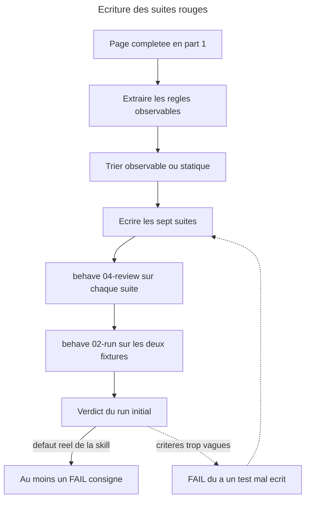

# Instruction: les suites de non-regression, ecrites rouges

## Feature

- **Summary**: Chaque regle de `docs/control.md` devient un scenario `behave`, groupe par famille de regles et non par action. Les suites sont ecrites **avant** l'alignement de la skill et executees telles quelles : le run initial doit reproduire les defauts connus (D1, D2, D3, B3, B5) sous forme de FAIL. Une suite ecrite apres le correctif ne prouve rien.
- **Stack**: `overcode:behave (SKILL.md + actions/02-run.md), suites Markdown, juges dry-run READ-ONLY`
- **Branch name**: `docs/control-ddd-alignment`
- **Parent Plan**: `2026_07_27-control-ddd-alignment-master.md`
- **Sequence**: `2 of 3`
- Confidence: 9/10
- Time to implement: ~1 session

## Architecture projection

### Files to create

- `plugins/overcode/skills/control/evals/authority-scenarios.md` - une seule autorite de classement, quatre modulateurs bornes
- `plugins/overcode/skills/control/evals/phase-scenarios.md` - resolution, provenance, `default` vs `undetermined`, `03-configure` hors modele
- `plugins/overcode/skills/control/evals/domains-scenarios.md` - qui declare quoi, priorise sans restreindre, terme non apparie rapporte
- `plugins/overcode/skills/control/evals/chaining-scenarios.md` - aretes du graphe comme contrat, exclusivite `scope`/`domain`, cas limites du classement
- `plugins/overcode/skills/control/evals/confirmations-scenarios.md` - regime un-par-un sur trois actes, l'unique lot borne et ses quatre composants
- `plugins/overcode/skills/control/evals/measurement-scenarios.md` - densite, plafond, pourcentage, lecture du rapport de couverture, frontieres externes
- `plugins/overcode/skills/control/evals/align-write-scenarios.md` - propriete et lecture seule du document, cinq natures d'ecart, fidelite d'ecriture

### Files to modify

- aucun. **Les blocs `## Test` des six actions restent intacts en phase 2** : ils sont la source des scenarios. Leur transformation en renvoi appartient a la part-3, apres que les suites ont prouve qu'elles tiennent.

### Files to delete

- aucun

## Applicable rules

| Tool   | Name | Path | Why it applies |
| ------ | ---- | ---- | -------------- |
| claude | plugins-marketplace | `C:\Users\fxgui\.claude\rules\plugins-marketplace.md` | ecrire dans `plugins/overcode/skills/control/evals/`, jamais dans le cache |
| claude | skill-writing-style | `C:\Users\fxgui\.claude\projects\C--Users-fxgui-Documents-LLM-Marketplace\memory\skill-writing-style.md` | les fixtures sont du materiau : leurs noms restent dans la suite, jamais dans la skill |
| plugin | behave harness | `plugins/overcode/skills/behave/references/harness-conventions.md` | dry-run READ-ONLY, reproduce-then-confirm, N/A vs FAIL, fixture peuplee |
| plugin | behave quality | `plugins/overcode/skills/behave/references/quality-grid.md` | grille 7 axes par scenario, detection des tests trop vagues ou trop larges |
| plugin | behave template | `plugins/overcode/skills/behave/assets/scenario-template.md` | squelette de suite impose |

## User Journey

## Risk register

| Risk | Impact | Mitigation |
| ---- | ------ | ---------- |
| Un FAIL vient d'un critere de passage mal ecrit, pas d'un defaut de la skill | On « corrige » la skill pour satisfaire un mauvais test, et on casse une regle juste | `behave 04-review` sur chaque suite **avant** le run initial ; checkpoint utilisateur sur chaque FAIL en fin de part |
| Un scenario teste une etape de `## Process` et non une regle | Le test devient fragile a toute reecriture de procedure et sort du perimetre valide | Chaque ligne de scenario cite la **regle de la page** qu'elle pin, par son titre de section ; une ligne sans regle citee est retiree |
| Les deux fixtures ne peuvent pas exercer certaines regles | Tentation d'inventer une fixture stub, interdite par le harnais | Marquer **N/A** et le consigner ; la limite est declaree dans le master, pas contournee |
| Le juge lit trop de fichiers et « voit » une borne que le chemin de chargement naturel ne montre pas | Un vrai defaut (B3) passe en PASS | Declarer, par scenario, le **chemin de chargement** exact du juge : `SKILL.md` + l'action + les references qu'elle nomme, rien de plus |
| Tout est teste en `behave`, y compris ce qui ne s'observe pas | Scenarios non decidables, verdicts arbitraires | Voir le tri ci-dessous : les regles meta passent par une passe de coherence documentaire, pas par un juge |

## Deux niveaux de verification, decides avant d'ecrire

Toutes les regles de la page ne sont pas observables sur un comportement. Le tri est explicite :

| Nature de la regle | Exemple | Verifiee par |
|---|---|---|
| **Observable** — un refus, un routage, un contenu de rapport, un ensemble d'ecritures prevues | « donnes ensemble, `scope` et `domain` arretent l'action » | `behave` |
| **Meta / redactionnelle** — une enonciation, un decompte, une borne qui doit figurer la ou le champ est defini | « quatre modulateurs, une seule autorite » ; « la borne des *Tier thresholds* doit etre a l'endroit ou le champ est defini » | passe de coherence documentaire en part-3, tracee dans le CHANGELOG |

Une regle meta mal placee peut neanmoins produire un defaut observable — c'est le cas de B3, teste en `behave` par un scenario qui borne le chemin de chargement du juge a `pivot-contract.md`.

## Implementation phases

### Phase 1: Cadrer les fixtures

> Une fixture non decrite rend tout verdict incontestable et donc inutile.

#### Tasks

1. Relever, pour chaque fixture, l'etat qui decide : chemin et taille du document de test, presence d'une suite, presence d'un lanceur e2e etabli, absence de phase declaree, absence de domaine declare, disponibilite d'un rapport de couverture.
2. Ecrire ce releve dans le bloc `Fixture / preconditions` de chacune des sept suites.
3. Lister les regles qu'aucune des deux fixtures ne peut exercer, et les marquer N/A par avance avec leur cause.

#### Fixtures

| Fixture | Chemin | Etat decisif |
|---|---|---|
| `app` | `C:\Users\fxgui\Documents\Perso\Projects\suddenly\_code\app` | `aidd_docs/memory/TESTING.md` — 85 lignes, **rempli mais non decisionnel** (types de tests, aucun critere de tier), a un chemin non conventionnel (majuscules) ; `tests/`, `pytest`, marqueur `e2e`, Playwright etabli ; aucune phase, aucun domaine |
| `ai-hub` | `C:\Users\fxgui\Documents\Perso\Projects\suddenly\_code\ai-hub` | `aidd_docs/memory/testing.md` — 14 lignes, **template generique intact** ; `tests/` + `tests/e2e/` ; aucune phase, aucun domaine |

Le couple discrimine la regle C5 : deux documents qui tombent tous deux dans « traite comme absent pour la decision de tier », a deux niveaux de remplissage — la skill doit **dire lequel des deux cas** elle a rencontre, et c'est verifiable.

#### Acceptance criteria

- [ ] Les sept suites nomment leur fixture et son etat decisif.
- [ ] Les regles non exercables par les deux fixtures sont listees avec leur cause, une fois pour toutes.
- [ ] Aucune fixture stub, aucun document invente.

### Phase 2: Ecrire les sept suites

> Une famille de regles par suite ; une regle par ligne ; jamais une etape.

#### Tasks

1. Partir du squelette `behave/assets/scenario-template.md` pour chaque suite.
2. Reprendre les blocs `## Test` des six actions comme **source** : ce qu'ils affirment devient un scenario. Cinq des six affirment aujourd'hui des choses absentes de la page ; ces affirmations ne sont conservees que si la part-1 les a remontees.
3. Ajouter les scenarios pour les regles de la page qu'aucun bloc `## Test` n'affirme aujourd'hui (voir la table ci-dessous).
4. Pour chaque scenario : citer la section de la page qu'il pin, borner le chemin de chargement du juge, et privilegier un observable d'ecriture a un jugement de prose.

#### Repartition des suites

| Suite | Regles couvertes | Fixtures |
|---|---|---|
| `authority-scenarios.md` | la table des tiers seule classe ; la phase priorise sans classer ; la densite signale sans refuser et sans changer de tier ; un domaine ne retire rien ; les *Risk signals* du pivot priorisent sans classer ; **les *Tier thresholds* ne reclassent jamais un cas qui traverse une vraie frontiere externe (B3)** ; `control` ecrit ce qu'il a mesure et propose la strategie sans l'appliquer | les deux |
| `phase-scenarios.md` | jamais deduite ; question posee **avant** tout classement ; valeur et provenance sur deux lignes ; unique appariement force `unanswered` ⇔ `undetermined` ; `default` ne repose pas la question, `undetermined` si ; **bascule depuis `undetermined` des qu'une phase est declaree (D2)** ; argument valable pour l'execution seule, jamais ecrit ; divergence argument/declaration rapportee ; aucun seuil chiffre par phase ; `03-configure` ne prend ni `phase`, ni `domain`, ni `scope` | les deux |
| `domains-scenarios.md` | le projet declare lesquels, le pivot declare comment les reperer ; le pivot complete sans ecraser ; un domaine priorise et ne restreint pas ; le non apparie reste dans l'analyse **et est rapporte avec le terme qui a echoue** ; sans domaine declare, repli `critical journeys` ; les domaines se proposent en candidats, « aucun » est une reponse valide | les deux (aucun domaine declare des deux cotes : le repli et le rapport de terme sont les observables) |
| `chaining-scenarios.md` | `05-stats` route et **ne lance rien** ; aucun etat garde entre deux executions ; celui qui nomme passe la main, celui qui recoit ne recalcule pas ; `01-write` est le puits, et le passage est un a un avec reevaluation entre chaque ; `02-audit` n'a aucune arete vers `01-write` ; `03-configure` atteignable et terminale ; `scope` et `domain` ensemble → arret et explication ; aucun test trouve → aucun classement ; saturation → `scope` plus etroit, **jamais un `domain` comme remede** | les deux |
| `confirmations-scenarios.md` | un-par-un sur les trois actes : supprimer, appliquer un correctif de config, ecrire un test propose ; **`02-audit` n'admet aucun lot nomme (D1)** ; **`04-strengthen` non plus (D3)** ; l'unique exception, `06-align` sur bascule, avec ses quatre composants et son refus en bloc sans repli par item ; trois categories exclues de tout lot ; un lot vide est un resultat legitime ; la balance nette est un constat, jamais un objectif | les deux |
| `measurement-scenarios.md` | densite contre la mediane du projet, alerte a 3× ; un outlier pointe et ne qualifie jamais ; la densite n'est pas une cible ; un plafond declare l'emporte en tant que plafond, densite rapportee a cote ; `limit` ne vient que d'une limite de nombre ; un pourcentage n'est pas un budget ; **aucun pourcentage n'est produit (B5)** ; ordres, jamais parts ; `covered`/`total`, absence = non couvert, lecture identique dans toutes les phases ; le glob source pilote l'univers ; cas degeneres et leur ordre ; une frontiere externe vaut un test, « hors de portee du test » se renvoie a la supervision | les deux (`app` pour le rapport de couverture reel, `ai-hub` pour le cas `tests/e2e` deja parcouru) |
| `align-write-scenarios.md` | le document appartient a la skill de memoire projet, tout le monde le lit sauf `06-align` ; document en forme de template → traite comme absent, correspondance forcee, **dire lequel des deux cas** ; non documente ≠ suit implicitement le defaut ; cinq natures d'ecart, mesure au bloc des faits et reponse au bloc de strategie ; les deux blocs s'approuvent independamment ; ne jamais creer par defaut ; annoncer la voie d'ecriture, une synchro silencieuse n'est pas une synchro ; relire et comparer le fichier ecrit, rapporter la divergence sans la corriger ; ne jamais remplacer en silence ; hors bascule, cette action ne fait que decrire ; la phase s'ecrit en declaration, jamais en fait mesure | `ai-hub` (template intact) et `app` (rempli non decisionnel) — le contraste **est** l'observable |

#### Regles de la page qu'aucun bloc `## Test` n'affirme aujourd'hui

A ecrire de zero, ce sont les trous de couverture les plus surs :

- les deux lignes valeur/provenance de la phase et l'appariement force ;
- `scope` et `domain` ensemble → arret ;
- un domaine priorise, ne restreint pas, et le terme non apparie est rapporte ;
- l'exception de lot bornee, ses trois categories exclues, la legitimite d'un lot vide — le bloc `## Test` de `06-align` n'exerce aujourd'hui **aucune** bascule de phase ;
- la balance nette est un constat, jamais un objectif ;
- des ordres, jamais des parts, aucun pourcentage produit ;
- `03-configure` ne prend ni `phase`, ni `domain`, ni `scope`.

#### Acceptance criteria

- [ ] Les sept fichiers existent dans `plugins/overcode/skills/control/evals/`, au squelette du template.
- [ ] Chaque scenario cite la section de `docs/control.md` qu'il pin.
- [ ] Chaque scenario declare le chemin de chargement du juge.
- [ ] Les sept trous de couverture listes ci-dessus ont chacun au moins un scenario.
- [ ] Aucun scenario ne pin une etape de `## Process`.

### Phase 3: Revue de qualite avant execution

> Une suite rouge de mauvaise qualite produit un verdict rouge inutilisable.

#### Tasks

1. Lancer `overcode:behave 04-review` sur chaque suite, cible = `skills/control/SKILL.md`.
2. Corriger les scenarios notes trop vagues ou trop larges par la grille 7 axes.
3. Verifier la passe de couverture : chaque famille de regles de la page a au moins un scenario.

#### Acceptance criteria

- [ ] Les sept revues sont produites et leurs remarques bloquantes traitees.
- [ ] Aucun scenario ne reste note rouge sur l'axe « critere decidable ».

### Phase 4: Run initial, et il doit etre rouge

> C'est le run qui prouve que les suites attrapent quelque chose.

#### Tasks

1. `overcode:behave 02-run <suite> <fixture>` pour les sept suites sur les deux fixtures.
2. Consigner chaque run dans le `Results log` de sa suite, au format impose, en nommant la fixture et son etat.
3. Pour chaque FAIL : nommer l'instruction manquante ou contradictoire (fichier + section). Pour chaque N/A : nommer la precondition absente de la fixture.
4. Presenter a l'utilisateur le tableau des FAIL et faire trancher, un par un, « vrai defaut » ou « test a reecrire ».

#### FAIL attendus au run initial

Si l'un de ces cinq ressort PASS, c'est la suite qu'il faut suspecter avant la skill :

| Attendu | Defaut vise | Ou il vit |
|---|---|---|
| FAIL | `02-audit` accepte un lot nomme par l'utilisateur (D1) | `actions/02-audit.md` |
| FAIL | `06-align` exclut `undetermined` de toute bascule, contre la page (D2) | `actions/06-align.md` |
| FAIL | `04-strengthen` accepte un lot nomme du cote des ajouts (D3) | `actions/04-strengthen.md` |
| FAIL | *Tier thresholds* defini sans sa borne la ou le champ est defini (B3) | `references/pivot-contract.md` |
| FAIL | un pourcentage est produit alors que la page dit qu'aucun ne l'est (B5) | `actions/04-strengthen.md` · `actions/05-stats.md` |

#### Acceptance criteria

- [ ] Les sept suites portent un `Results log` avec un run `initial` date, la fixture nommee, un tableau de verdicts et un tally.
- [ ] Au moins un FAIL est consigne, et chaque FAIL cite l'instruction fautive par fichier et section.
- [ ] Chaque N/A cite la precondition de fixture absente ; aucun N/A n'est compte comme PASS.
- [ ] L'utilisateur a tranche chaque FAIL en « vrai defaut » ou « test a reecrire » — la part-3 ne demarre pas avant.

## Amendments

<!-- AI-initiated changes during implementation. Each entry is prefixed with 🤖. -->

🤖 **Le FAIL attendu sur D1 est inverse — le plan a ete ecrit avant le gate de la part-1.** D1 a ete tranche **en faveur de la skill** : la page admet desormais le lot que l'utilisateur nomme lui-meme, pour les retraits. Donc `02-audit` acceptant un lot nomme n'est plus un defaut, c'est le comportement correct. Le defaut reel est la **contradiction interne** de `02-audit.md` entre `:34` (admet le lot) et `:35` (l'interdit en absolu). Le scenario correspondant attend donc l'inverse de ce que le plan annonce :

| | Plan initial | Corrige |
|---|---|---|
| Scenario | demande de suppression groupee → **attend un refus de grouper** | demande de suppression groupee **nommee par l'utilisateur** → attend l'**acceptation du lot**, et separement que la phase ne change rien au regime |
| FAIL attendu | `02-audit` accepte le lot | `02-audit.md:35` interdit ce que `:34` admet — l'action ne peut pas repondre de facon stable |

L'etape 2 du flux de validation est corrigee en consequence. **D2, D3, B3, B5 restent inchanges.**

🤖 **Releve de fixtures : deux ecarts avec la description du plan, tous deux favorables.**

1. **`ai-hub/aidd_docs/memory/testing.md` n'est pas un « template generique intact ».** C'est un document **rempli qui contredit le depot** : il declare « None configured yet » et « N/A (tooling repo, no application logic to test) », alors que le depot porte **60 fichiers de test**, `pytest` configure, `playwright==1.40.0` epingle, un marqueur `e2e: tests end-to-end via API` declare, et un repertoire `tests/e2e/`. C'est une instance reelle et indiscutable de la nature **Fait perime** (C28) — meilleur materiau que le cas hypothetique que le plan prevoyait. Le contraste avec `app` se deplace : ce n'est plus « deux niveaux de remplissage » mais **« non decisionnel » face a « activement faux »**, et les deux tombent malgre tout dans « traite comme absent pour la decision de tier » (C5), ce qui reste l'observable vise.
2. **`app/aidd_docs/memory/TESTING.md:6` declare un seuil de couverture de 80 %.** Le plan ne le mentionnait pas. C'est l'exercice reel de C3 — *un pourcentage de couverture n'est pas un budget et ne le devient jamais* — sur une fixture qui en porte un pour de vrai. Ajoute a `measurement-scenarios.md`.

Etat decisif consolide :

| | `app` | `ai-hub` |
|---|---|---|
| Document | `TESTING.md` (86 l.) — chemin **non conventionnel** (majuscules), rempli, **aucun critere de tier** | `testing.md` (15 l.) — chemin conventionnel, **activement contredit par le depot** |
| Fichiers de test | 80 | 60 |
| Rapport de couverture | **`.coverage` present** | **aucun** |
| Seuil declare | **80 % de couverture** (un pourcentage, pas un nombre de tests) | aucun |
| e2e | `pytest-playwright`, marqueur `-m e2e`, `test_federation_e2e.py` | `playwright==1.40.0`, marqueur `e2e`, repertoire `tests/e2e/` |
| Gate | `make check` (lint + typecheck + tests) | aucun declare |
| Phase declaree | aucune | aucune |
| Domaine declare | aucun | aucun |

Repartition qui en decoule : **`app` porte les scenarios qui exigent un rapport de couverture** (C17, C18, bornes de mesure) ; **`ai-hub` porte le cas degenere « aucun rapport de couverture »** (C16 #2) et le **fait perime** (C28). Aucune fixture ne peut exercer une **bascule de phase reelle** ni une **resolution de domaine** — les deux sont sans phase et sans domaine declares. Voir les N/A par avance ci-dessous.

### 🤖 Amendment 3 — Phase 3 : revue conduite en interne, et sur quelle autorite

`behave 04-review` est une action analytique, sans harnais ni sous-agent : la revue a ete conduite en ligne, sans lancer de sous-agent (contrainte de session).

**Deviation methodologique a acter.** L'action lit la « carte comportementale » du *target spec* — ici `skills/control/`. Or les suites pinnent la **page**, qui est l'autorite depuis la part-1. Scorees contre la skill, les six divergences connues (D1, D2, D3, D5 bis, B3, B5) tomberaient a 0 sur l'axe **anti-invention** — c'est-a-dire que la grille condamnerait exactement les scenarios qui font le travail. La carte comportementale de la passe 1 est donc `docs/control.md`, et la skill est l'implementation sous test. Sans cette inversion, la revue de qualite invalide le rouge attendu.

**Passe 1 — couverture.** Les sept trous listes en Phase 2 ont chacun au moins un scenario : deux lignes valeur/provenance + appariement force (`phase` S3, S4) ; `scope`+`domain` (`domains` S7, `chaining` S10) ; domaine qui priorise sans restreindre + terme rapporte (`domains` S4, S5) ; exception de lot bornee, categories exclues, lot vide (`confirmations` S6→S10) ; balance nette (`confirmations` S12) ; ordres jamais parts, aucun pourcentage (`measurement` S2) ; `03-configure` sans les trois parametres (`phase` S13, `chaining` S7).

**Passe 2 — six corrections bloquantes appliquees** (axes de la grille entre parentheses) :

| Suite | Scenario | Defaut | Correction |
|---|---|---|---|
| `authority` | S2 | verdict impossible sur un seul run (reproductibilite) | declare a deux runs, juge sur le Δ ordre/tier |
| `authority` | S3 | creditait un routage vers `02-audit` **sans** discriminer les deux lectures — ce que la page interdit (anti-invention) | discrimination renvoyee a `measurement` S6/S7 ; S3 ne juge plus que l'absence de tier et de refus |
| `phase` | S11 | vacuite non traitee si le run ne borne rien (non-ambiguite) | echappatoire N/A explicite : la regle interdit la restriction silencieuse, pas la restriction |
| `chaining` | S12 | doublon de `confirmations` S12 et hors du perimetre de la suite (minimalite) | recentre sur la borne anti-ping-pong ; la balance nette reste a `confirmations` |
| `measurement` | S4 | exigeait un plafond de **nombre de tests** qu'aucune fixture ne declare — `app` declare un **pourcentage** (realisme du fixture) | passe en N/A declare, avec la cause |
| `align-write` | S11 | jugeait une divergence qui ne peut pas se produire en dry-run (observabilite) | juge le **plan** d'ecriture : etape de relecture presente, traitement annonce de la divergence |

Aucun scenario ne reste rouge sur l'axe « critere decidable » (observabilite + non-ambiguite). Trois scenarios restent **jaunes assumes**, tous pour la meme raison : ils jugent un **motif** et non un acte — `phase` S7 (`default` exempte par consentement), `confirmations` S4 (refus du lot d'ajouts par l'arithmetique), `align-write` S7 (decision manquante = question, pas defaut). Chacun porte deja la consigne « bon acte, mauvais motif = friction, pas PASS ». Les degrader en PASS binaire perdrait la regle ; les laisser jaunes est le choix.

**Ecart avec le plan, mineur.** La Phase 2 annonce « trois categories exclues de tout lot » ; la page en nomme **trois plus un fourre-tout** (« tout test qu'aucun des deux motifs ne qualifie »). `confirmations` S9 couvre les trois nommees, S8 le fourre-tout ; l'en-tete de la suite le dit.

## Log

<!-- APPEND ONLY. One entry per step attempt. Never rewrite. -->

## Validation flow demonstration

1. `ls plugins/overcode/skills/control/evals/` : sept fichiers `*-scenarios.md`.
2. Ouvrir `confirmations-scenarios.md` : le scenario D1 decrit une demande de suppression groupee **nommee par l'utilisateur** et attend que le lot soit **accepte**, en citant `## Les confirmations › Un lot que l'utilisateur nomme lui-meme`.
3. Ouvrir le `Results log` de la meme suite : un run `initial` date, fixture `app` nommee avec son etat, et le FAIL D1 avec `actions/02-audit.md` cite.
4. Verifier qu'aucun fichier des deux fixtures n'a change : `git -C <fixture> status` propre, ou horodatages inchanges si la fixture n'est pas un depot.
