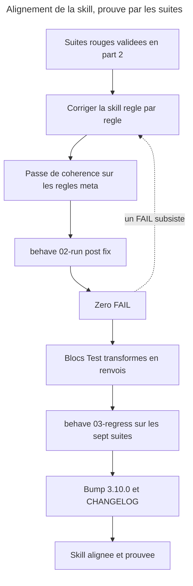

# Instruction: aligner la skill sur la page, prouve par le passage au vert

## Feature

- **Summary**: La skill n'est modifiee que pour faire passer au vert une suite deja rouge. Trois corrections viennent des contradictions tranchees en faveur de la page (D1, D2, D3), six du deficit de la skill sur la page (B1..B6). Les blocs `## Test`, une fois vidés de leur substance vers les suites, deviennent des renvois. Le tout est consigne en 3.10.0.
- **Stack**: `Claude Code plugin (SKILL.md + actions/*.md + references/*.md), overcode:behave, SemVer par plugin`
- **Branch name**: `docs/control-ddd-alignment`
- **Parent Plan**: `2026_07_27-control-ddd-alignment-master.md`
- **Sequence**: `3 of 3`
- Confidence: 9/10
- Time to implement: ~1 session

## Architecture projection

### Files to modify

- `plugins/overcode/skills/control/SKILL.md` - B1 (les quatre modulateurs enonces comme un ensemble ferme, et l'exception apparente vaut defaut), B2 (modulateurs et autorites ne se comptent pas ensemble), B4 (la phase qualifie aussi un lot d'obsoletes sur bascule), B5 (aucun pourcentage n'est produit, enonce globalement), B6 (la table des tiers ne decide rien d'autre)
- `plugins/overcode/skills/control/references/pivot-contract.md` - B3 : la borne des *Tier thresholds* est ecrite **la ou le champ est defini**, comme pour *Risk signals* et *Domain resolution*
- `plugins/overcode/skills/control/references/phase-framework.md` - B4 : la quatrieme chose que la phase pilote ; D6 : la reserve sur la lecture d'une absence, alignee sur la formulation de la page
- `plugins/overcode/skills/control/actions/02-audit.md` - D1 : retirer « ou via une selection groupee qu'il nomme » ; la ligne suivante se contredisait deja
- `plugins/overcode/skills/control/actions/04-strengthen.md` - D3 : retirer le lot nomme du cote des ajouts ; B5 : aucun pourcentage produit
- `plugins/overcode/skills/control/actions/06-align.md` - D2 : seul `default` est hors bascule ; `undetermined` bascule des qu'une phase est declaree
- `plugins/overcode/skills/control/actions/05-stats.md` - B5 ; D4 : la cible du `scope` est deja juste, la verifier contre la page corrigee
- `plugins/overcode/skills/control/actions/01-write.md` · `03-configure.md` - bloc `## Test` transforme en renvoi
- `plugins/overcode/skills/control/evals/*-scenarios.md` - run `post-fix` consigne dans les sept `Results log`
- `plugins/overcode/.claude-plugin/plugin.json` - 3.9.0 → 3.10.0
- `plugins/overcode/CHANGELOG.md` - entree 3.10.0
- `.claude-plugin/marketplace.json` · `index.json` - version synchronisee

### Files to create

- aucun

### Files to delete

- aucun

## Applicable rules

| Tool   | Name | Path | Why it applies |
| ------ | ---- | ---- | -------------- |
| claude | plugins-marketplace | `C:\Users\fxgui\.claude\rules\plugins-marketplace.md` | modifier la source, jamais le cache ; la skill n'est active en cache qu'apres reinstallation |
| claude | skill-writing-style | `C:\Users\fxgui\.claude\projects\C--Users-fxgui-Documents-LLM-Marketplace\memory\skill-writing-style.md` | pas de redite `SKILL.md`/actions, DRY par `references/` ; le rationnel va au CHANGELOG ; aucun nom de fixture dans la skill |
| claude | readme-existant-only | `C:\Users\fxgui\.claude\projects\C--Users-fxgui-Documents-LLM-Marketplace\memory\readme-existant-only.md` | l'historique va au CHANGELOG, pas au README |
| repo | CONTRIBUTING | `CONTRIBUTING.md` | SemVer par plugin, sync `plugin.json` + `marketplace.json` + `index.json`, bump consigne au CHANGELOG |
| plugin | alias bump-plugin | `plugins/overcode/skills/alias/actions/03-bump-plugin.md` | procedure de bump maison, a suivre plutot qu'a reinventer |

## User Journey



## Risk register

| Risk | Impact | Mitigation |
| ---- | ------ | ---------- |
| On modifie la skill sur un point qu'aucun FAIL ne designe | Retour au bricolage de coherence, et la part-2 devient decorative | Regle dure : **une modification, un FAIL cite**. Les seules exceptions autorisees sont les regles meta, listees nommement ci-dessous |
| Le passage au vert vient d'une reecriture de scenario, pas d'un correctif | La suite ne prouve plus rien | Le `Results log` conserve les deux runs ; toute modification de scenario entre les deux runs est interdite sans validation utilisateur explicite |
| Le renvoi des blocs `## Test` perd la clause « jamais de double mocke » | On perd une regle en croyant deplacer un test | La clause est une **precondition de fixture** : elle migre dans le bloc `Fixture / preconditions` de la suite avant que le bloc `## Test` ne soit reduit |
| Le bump casse la coherence `marketplace.json` / `index.json` / README | Marketplace incoherent, install cassee | Suivre `alias/actions/03-bump-plugin.md` et relire les trois fichiers |
| B1 et B2 gonflent `SKILL.md` en dupliquant la page | Deux sources qui deriveront | `SKILL.md` porte l'ensemble ferme en une phrase ; le motif reste sur la page et dans le CHANGELOG |

## Implementation phases

### Phase 1: Les trois contradictions tranchees en faveur de la page

> Trois retraits, pas trois ajouts.

#### Tasks

1. **D1** — `actions/02-audit.md` : supprimer l'admission d'un lot nomme. Le fichier se contredisait deja une ligne plus loin en re-affirmant le un-par-un ; la contradiction interne disparait avec.
2. **D3** — `actions/04-strengthen.md` : supprimer l'admission d'un lot nomme du cote des ajouts. La garde cumulative (passage un a un vers `01-write`) reste et devient la seule mecanique de volume.
3. **D2** — `actions/06-align.md` : `default` reste hors de la machinerie de bascule ; `undetermined` y entre des qu'une phase est declaree, et le paragraphe deroule les deux cas comme il deroule deja ceux de `default`.
4. Rejouer les scenarios D1, D2, D3 seuls (`--only`) : ils doivent virer au PASS.

#### Acceptance criteria

- [ ] Aucune occurrence de lot nomme par l'utilisateur ne subsiste hors de `06-align` sur bascule.
- [ ] `06-align` distingue `default` (hors bascule) de `undetermined` (bascule des qu'une phase est declaree).
- [ ] Les trois scenarios correspondants sont PASS, avec le Δ consigne.

### Phase 2: Les six regles affaiblies

> La page les portait, la skill les avait perdues ou diluees.

#### Tasks

1. **B3** (observable, un FAIL le designe) — `references/pivot-contract.md` : ecrire la borne des *Tier thresholds* a l'endroit ou le champ est defini, dans la meme forme que *Risk signals* et *Domain resolution*. C'est `SKILL.md` lui-meme qui l'exige : « tout ce qu'un pivot fournit porte sa borne, enoncee la ou la chose est definie ».
2. **B5** (observable, un FAIL le designe) — `SKILL.md` : enoncer globalement qu'aucun pourcentage n'est produit ; `04-strengthen` et `05-stats` : retirer toute production de pourcentage, un pourcentage **declare par le projet** restant cite verbatim et hors du bloc budget.
3. **B1** (meta) — `SKILL.md` : nommer l'ensemble ferme — quatre modulateurs, une seule autorite de classement — et la regle de lecture : une ligne qui semble donner un pouvoir de classement a autre chose que la table des tiers est un defaut, pas une exception.
4. **B2** (meta) — `SKILL.md` : modulateurs et autorites ne se comptent pas ensemble ; les deux listes ne se recoupent que sur la phase et les domaines.
5. **B4** (meta, verifiable a la lecture) — `SKILL.md` et `references/phase-framework.md` : ajouter la quatrieme chose que la phase pilote, la qualification d'un lot d'obsoletes au moment d'une bascule.
6. **B6** (meta) — `SKILL.md` : la table des tiers decide le tier et rien d'autre. La borne existait dans un sens seulement.

#### Acceptance criteria

- [ ] Chacune des six modifications cite, en commentaire de commit ou dans le CHANGELOG, soit le FAIL qui la designe, soit son statut de regle meta.
- [ ] `pivot-contract.md` borne ses trois champs a l'endroit ou chacun est defini.
- [ ] Aucun pourcentage produit ne subsiste dans les sorties decrites par `04-strengthen` et `05-stats`.
- [ ] `SKILL.md` n'a pas gagne de paragraphe de justification : les regles sont enoncees, le motif reste sur la page.

### Phase 3: Run post-fix, puis regression

> Le vert n'a de valeur que compare au rouge qui le precede.

#### Tasks

1. `overcode:behave 02-run` sur les sept suites, les deux fixtures, mode `post-fix`.
2. Consigner chaque run avec son Δ ligne a ligne contre le run `initial`.
3. Tout FAIL residuel : retour en phase 1 ou 2, jamais une reecriture de scenario sans validation.
4. `overcode:behave 03-regress` sur le repertoire `evals/` complet : aucun PASS→FAIL.

#### Acceptance criteria

- [ ] Les sept suites portent un run `post-fix` date, avec Δ contre le run initial.
- [ ] Zero FAIL sur les sept suites ; les N/A sont identiques a ceux du run initial, ou justifies s'ils ont bouge.
- [ ] `03-regress` ne signale aucun PASS→FAIL.
- [ ] Aucun fichier des deux fixtures n'a ete modifie.

### Phase 4: Les blocs `## Test` deviennent des renvois

> Ils etaient la source ; la source a ete recoltee, ils deviennent un index.

#### Tasks

1. Verifier, action par action, que **tout** ce que son bloc `## Test` affirmait est desormais couvert par au moins un scenario — y compris la clause « jamais de double mocke », migree en precondition de fixture.
2. Remplacer chaque bloc par un renvoi court : les suites concernees, les identifiants de scenarios, et la commande qui les execute.
3. Ne rien laisser d'assertif dans le bloc : une regle qui resterait la serait une regle non testee qui se croit testee.

#### Forme du renvoi

```
## Test

Couvert par `../evals/<suite>.md` (<ids>) et `../evals/<suite>.md` (<ids>).
Executer : `overcode:behave 02-run <suite> <fixture>`.
```

#### Acceptance criteria

- [ ] Les six blocs `## Test` sont des renvois, sans assertion residuelle.
- [ ] Chaque renvoi nomme au moins une suite et des identifiants de scenarios existants.
- [ ] Aucune affirmation d'un ancien bloc `## Test` n'a disparu sans avoir un scenario correspondant.

### Phase 5: Passe de coherence et bump

> Ce que `behave` ne peut pas juger se verifie a la lecture, une fois, et se consigne.

#### Tasks

1. Passe de coherence documentaire : relire la page et la skill en regard, regle par regle, sur les seules regles meta (B1, B2, B4, B6, et le placement des bornes de pivot).
2. Verifier qu'aucune regle de categorie A n'a ete abimee au passage.
3. Bump 3.9.0 → 3.10.0 selon `alias/actions/03-bump-plugin.md` : `plugin.json`, `marketplace.json`, `index.json`.
4. Entree CHANGELOG 3.10.0 : les trois arbitrages, les six retablissements, les sept suites, et le renvoi des blocs `## Test`. Le rationnel de chaque arbitrage va la — pas dans les fichiers d'instruction.
5. Verifier la coherence README plugin / docs / CHANGELOG.

#### Acceptance criteria

- [ ] `plugin.json`, `marketplace.json` et `index.json` portent 3.10.0.
- [ ] Le CHANGELOG 3.10.0 nomme les trois contradictions arbitrees et le camp retenu pour chacune.
- [ ] La passe de coherence est tracee : ce qui a ete verifie a la lecture est dit comme tel.
- [ ] Aucun JSON invalide : `node -e "JSON.parse(require('fs').readFileSync('index.json'))"` et equivalents passent.

## Amendments

<!-- AI-initiated changes during implementation. Each entry is prefixed with 🤖. -->

## Log

<!-- APPEND ONLY. One entry per step attempt. Never rewrite. -->

## Validation flow demonstration

1. Ouvrir `plugins/overcode/skills/control/actions/02-audit.md` : plus aucune mention de lot nomme ; le bloc `## Test` est un renvoi vers `../evals/confirmations-scenarios.md`.
2. Ouvrir `plugins/overcode/skills/control/evals/confirmations-scenarios.md` : le `Results log` montre le run `initial` avec le FAIL D1, puis le run `post-fix` avec le meme scenario en PASS et le Δ marque.
3. Lancer `overcode:behave 03-regress plugins/overcode/skills/control/evals/ <fixture>` : aucun PASS→FAIL.
4. `grep -n version plugins/overcode/.claude-plugin/plugin.json index.json .claude-plugin/marketplace.json` : 3.10.0 partout pour `overcode`.
5. Lire l'entree CHANGELOG 3.10.0 : elle raconte les arbitrages, la page ne les raconte pas deux fois.
