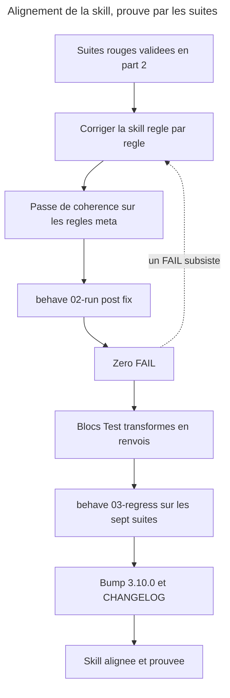

# Instruction: aligner la skill sur la page, prouve par le passage au vert

## Feature

- **Summary**: La skill n'est modifiee que pour faire passer au vert une suite deja rouge. Trois corrections viennent des contradictions tranchees en faveur de la page (D1, D2, D3), six du deficit de la skill sur la page (B1..B6). Les blocs `## Test`, une fois vidés de leur substance vers les suites, deviennent des renvois. Le tout est consigne en 3.10.0.
- **Stack**: `Claude Code plugin (SKILL.md + actions/*.md + references/*.md), overcode:behave, SemVer par plugin`
- **Branch name**: `docs/control-ddd-alignment`
- **Parent Plan**: `2026_07_27-control-ddd-alignment-master.md`
- **Sequence**: `3 of 3`
- Confidence: 9/10
- Time to implement: ~1 session

## Architecture projection

### Files to modify

- `plugins/overcode/skills/control/SKILL.md` - B1 (les quatre modulateurs enonces comme un ensemble ferme, et l'exception apparente vaut defaut), B2 (modulateurs et autorites ne se comptent pas ensemble), B4 (la phase qualifie aussi un lot d'obsoletes sur bascule), B5 (aucun pourcentage n'est produit, enonce globalement), B6 (la table des tiers ne decide rien d'autre)
- `plugins/overcode/skills/control/references/pivot-contract.md` - B3 : la borne des *Tier thresholds* est ecrite **la ou le champ est defini**, comme pour *Risk signals* et *Domain resolution*
- `plugins/overcode/skills/control/references/phase-framework.md` - B4 : la quatrieme chose que la phase pilote ; D6 : la reserve sur la lecture d'une absence, alignee sur la formulation de la page
- `plugins/overcode/skills/control/actions/02-audit.md` - D1 : retirer « ou via une selection groupee qu'il nomme » ; la ligne suivante se contredisait deja
- `plugins/overcode/skills/control/actions/04-strengthen.md` - D3 : retirer le lot nomme du cote des ajouts ; B5 : aucun pourcentage produit
- `plugins/overcode/skills/control/actions/06-align.md` - D2 : seul `default` est hors bascule ; `undetermined` bascule des qu'une phase est declaree
- `plugins/overcode/skills/control/actions/05-stats.md` - B5 ; D4 : la cible du `scope` est deja juste, la verifier contre la page corrigee
- `plugins/overcode/skills/control/actions/01-write.md` · `03-configure.md` - bloc `## Test` transforme en renvoi
- `plugins/overcode/skills/control/evals/*-scenarios.md` - run `post-fix` consigne dans les sept `Results log`
- `plugins/overcode/.claude-plugin/plugin.json` - 3.9.0 → 3.10.0
- `plugins/overcode/CHANGELOG.md` - entree 3.10.0
- `.claude-plugin/marketplace.json` · `index.json` - version synchronisee

### Files to create

- aucun

### Files to delete

- aucun

## Applicable rules

| Tool   | Name | Path | Why it applies |
| ------ | ---- | ---- | -------------- |
| claude | plugins-marketplace | `C:\Users\fxgui\.claude\rules\plugins-marketplace.md` | modifier la source, jamais le cache ; la skill n'est active en cache qu'apres reinstallation |
| claude | skill-writing-style | `C:\Users\fxgui\.claude\projects\C--Users-fxgui-Documents-LLM-Marketplace\memory\skill-writing-style.md` | pas de redite `SKILL.md`/actions, DRY par `references/` ; le rationnel va au CHANGELOG ; aucun nom de fixture dans la skill |
| claude | readme-existant-only | `C:\Users\fxgui\.claude\projects\C--Users-fxgui-Documents-LLM-Marketplace\memory\readme-existant-only.md` | l'historique va au CHANGELOG, pas au README |
| repo | CONTRIBUTING | `CONTRIBUTING.md` | SemVer par plugin, sync `plugin.json` + `marketplace.json` + `index.json`, bump consigne au CHANGELOG |
| plugin | alias bump-plugin | `plugins/overcode/skills/alias/actions/03-bump-plugin.md` | procedure de bump maison, a suivre plutot qu'a reinventer |

## User Journey



## Risk register

| Risk | Impact | Mitigation |
| ---- | ------ | ---------- |
| On modifie la skill sur un point qu'aucun FAIL ne designe | Retour au bricolage de coherence, et la part-2 devient decorative | Regle dure : **une modification, un FAIL cite**. Les seules exceptions autorisees sont les regles meta, listees nommement ci-dessous |
| Le passage au vert vient d'une reecriture de scenario, pas d'un correctif | La suite ne prouve plus rien | Le `Results log` conserve les deux runs ; toute modification de scenario entre les deux runs est interdite sans validation utilisateur explicite |
| Le renvoi des blocs `## Test` perd la clause « jamais de double mocke » | On perd une regle en croyant deplacer un test | La clause est une **precondition de fixture** : elle migre dans le bloc `Fixture / preconditions` de la suite avant que le bloc `## Test` ne soit reduit |
| Le bump casse la coherence `marketplace.json` / `index.json` / README | Marketplace incoherent, install cassee | Suivre `alias/actions/03-bump-plugin.md` et relire les trois fichiers |
| B1 et B2 gonflent `SKILL.md` en dupliquant la page | Deux sources qui deriveront | `SKILL.md` porte l'ensemble ferme en une phrase ; le motif reste sur la page et dans le CHANGELOG |

## Implementation phases

### Phase 1: Les trois contradictions tranchees en faveur de la page

> Trois retraits, pas trois ajouts.

#### Tasks

1. **D1** — `actions/02-audit.md` : supprimer l'admission d'un lot nomme. Le fichier se contredisait deja une ligne plus loin en re-affirmant le un-par-un ; la contradiction interne disparait avec.
2. **D3** — `actions/04-strengthen.md` : supprimer l'admission d'un lot nomme du cote des ajouts. La garde cumulative (passage un a un vers `01-write`) reste et devient la seule mecanique de volume.
3. **D2** — `actions/06-align.md` : `default` reste hors de la machinerie de bascule ; `undetermined` y entre des qu'une phase est declaree, et le paragraphe deroule les deux cas comme il deroule deja ceux de `default`.
4. Rejouer les scenarios D1, D2, D3 seuls (`--only`) : ils doivent virer au PASS.

#### Acceptance criteria

- [ ] Aucune occurrence de lot nomme par l'utilisateur ne subsiste hors de `06-align` sur bascule.
- [ ] `06-align` distingue `default` (hors bascule) de `undetermined` (bascule des qu'une phase est declaree).
- [ ] Les trois scenarios correspondants sont PASS, avec le Δ consigne.

### Phase 2: Les six regles affaiblies

> La page les portait, la skill les avait perdues ou diluees.

#### Tasks

1. **B3** (observable, un FAIL le designe) — `references/pivot-contract.md` : ecrire la borne des *Tier thresholds* a l'endroit ou le champ est defini, dans la meme forme que *Risk signals* et *Domain resolution*. C'est `SKILL.md` lui-meme qui l'exige : « tout ce qu'un pivot fournit porte sa borne, enoncee la ou la chose est definie ».
2. **B5** (observable, un FAIL le designe) — `SKILL.md` : enoncer globalement qu'aucun pourcentage n'est produit ; `04-strengthen` et `05-stats` : retirer toute production de pourcentage, un pourcentage **declare par le projet** restant cite verbatim et hors du bloc budget.
3. **B1** (meta) — `SKILL.md` : nommer l'ensemble ferme — quatre modulateurs, une seule autorite de classement — et la regle de lecture : une ligne qui semble donner un pouvoir de classement a autre chose que la table des tiers est un defaut, pas une exception.
4. **B2** (meta) — `SKILL.md` : modulateurs et autorites ne se comptent pas ensemble ; les deux listes ne se recoupent que sur la phase et les domaines.
5. **B4** (meta, verifiable a la lecture) — `SKILL.md` et `references/phase-framework.md` : ajouter la quatrieme chose que la phase pilote, la qualification d'un lot d'obsoletes au moment d'une bascule.
6. **B6** (meta) — `SKILL.md` : la table des tiers decide le tier et rien d'autre. La borne existait dans un sens seulement.

#### Acceptance criteria

- [ ] Chacune des six modifications cite, en commentaire de commit ou dans le CHANGELOG, soit le FAIL qui la designe, soit son statut de regle meta.
- [ ] `pivot-contract.md` borne ses trois champs a l'endroit ou chacun est defini.
- [ ] Aucun pourcentage produit ne subsiste dans les sorties decrites par `04-strengthen` et `05-stats`.
- [ ] `SKILL.md` n'a pas gagne de paragraphe de justification : les regles sont enoncees, le motif reste sur la page.

### Phase 3: Run post-fix, puis regression

> Le vert n'a de valeur que compare au rouge qui le precede.

#### Tasks

1. `overcode:behave 02-run` sur les sept suites, les deux fixtures, mode `post-fix`.
2. Consigner chaque run avec son Δ ligne a ligne contre le run `initial`.
3. Tout FAIL residuel : retour en phase 1 ou 2, jamais une reecriture de scenario sans validation.
4. `overcode:behave 03-regress` sur le repertoire `evals/` complet : aucun PASS→FAIL.

#### Acceptance criteria

- [ ] Les sept suites portent un run `post-fix` date, avec Δ contre le run initial.
- [ ] Zero FAIL sur les sept suites ; les N/A sont identiques a ceux du run initial, ou justifies s'ils ont bouge.
- [ ] `03-regress` ne signale aucun PASS→FAIL.
- [ ] Aucun fichier des deux fixtures n'a ete modifie.

### Phase 4: Les blocs `## Test` deviennent des renvois

> Ils etaient la source ; la source a ete recoltee, ils deviennent un index.

#### Tasks

1. Verifier, action par action, que **tout** ce que son bloc `## Test` affirmait est desormais couvert par au moins un scenario — y compris la clause « jamais de double mocke », migree en precondition de fixture.
2. Remplacer chaque bloc par un renvoi court : les suites concernees, les identifiants de scenarios, et la commande qui les execute.
3. Ne rien laisser d'assertif dans le bloc : une regle qui resterait la serait une regle non testee qui se croit testee.

#### Forme du renvoi

```
## Test

Couvert par `../evals/<suite>.md` (<ids>) et `../evals/<suite>.md` (<ids>).
Executer : `overcode:behave 02-run <suite> <fixture>`.
```

#### Acceptance criteria

- [ ] Les six blocs `## Test` sont des renvois, sans assertion residuelle.
- [ ] Chaque renvoi nomme au moins une suite et des identifiants de scenarios existants.
- [ ] Aucune affirmation d'un ancien bloc `## Test` n'a disparu sans avoir un scenario correspondant.

### Phase 5: Passe de coherence et bump

> Ce que `behave` ne peut pas juger se verifie a la lecture, une fois, et se consigne.

#### Tasks

1. Passe de coherence documentaire : relire la page et la skill en regard, regle par regle, sur les seules regles meta (B1, B2, B4, B6, et le placement des bornes de pivot).
2. Verifier qu'aucune regle de categorie A n'a ete abimee au passage.
3. Bump 3.9.0 → 3.10.0 selon `alias/actions/03-bump-plugin.md` : `plugin.json`, `marketplace.json`, `index.json`.
4. Entree CHANGELOG 3.10.0 : les trois arbitrages, les six retablissements, les sept suites, et le renvoi des blocs `## Test`. Le rationnel de chaque arbitrage va la — pas dans les fichiers d'instruction.
5. Verifier la coherence README plugin / docs / CHANGELOG.

#### Acceptance criteria

- [ ] `plugin.json`, `marketplace.json` et `index.json` portent 3.10.0.
- [ ] Le CHANGELOG 3.10.0 nomme les trois contradictions arbitrees et le camp retenu pour chacune.
- [ ] La passe de coherence est tracee : ce qui a ete verifie a la lecture est dit comme tel.
- [ ] Aucun JSON invalide : `node -e "JSON.parse(require('fs').readFileSync('index.json'))"` et equivalents passent.

## Amendments

<!-- AI-initiated changes during implementation. Each entry is prefixed with 🤖. -->

### 🤖 Amendment 1 — Phase 1 : D1 est inverse dans le plan, et les sites reels sont quatre, pas trois

**Constat.** Ce plan a ete redige avant que la porte de part-1 ne tranche les arbitrages. Sa Phase 1 porte donc la meme peremption que celle de part-2 sur **D1** :

- La tache 1 dit *« supprimer l'admission d'un lot nomme »* dans `02-audit.md`.
- Le critere d'acceptation dit *« Aucune occurrence de lot nomme par l'utilisateur ne subsiste hors de `06-align` sur bascule »*.

Les deux sont a l'envers. **D1 a ete tranche en faveur de la skill** : la page admet desormais le lot nomme par l'utilisateur pour les **retraits** (`docs/control.md` › *Un lot que l'utilisateur nomme lui-meme — pour les retraits seulement*, l. 352-358). Ce qui devait disparaitre de `02-audit.md`, c'est la **contradiction interne** de l'etape 5, pas l'admission de l'etape 4.

Par consequent, l'en-tete *« Trois retraits, pas trois ajouts »* ne decrit plus le travail : D1 est le retrait d'une contradiction, D2 une substitution, D3 seul est un retrait.

**Sites reellement corriges** — le plan en annonce trois, il y en a quatre, et deux d'entre eux ne sont pas ceux qu'il nomme :

| Arbitrage | Fichier | Nature |
|---|---|---|
| D1 | `actions/02-audit.md` (etape 5) | contradiction interne retiree ; l'admission de l'etape 4 est **conservee** |
| D1 | `SKILL.md` (*Transversal rules*) | la regle ne connaissait **qu'un** assouplissement (`06-align` sur bascule) et niait explicitement l'autre — *« Every other removal in this skill, `02-audit` included, keeps per-item confirmation unchanged »*. Les **deux** assouplissements de la page y figurent maintenant, dans son ordre |
| D2 | `actions/06-align.md` (etape 10) | `default` hors bascule **par consentement**, `undetermined` bascule des qu'une phase est declaree |
| D2 | `references/phase-framework.md` › *Net balance by phase* | disait *« `default`, `undetermined` — no removal batch at all »*, ce qui **contredisait la table du meme fichier** 150 lignes plus haut (*Removal batch : whatever the real phase says, once known*). Le plan ne signalait pas ce site |
| D3 | `actions/04-strengthen.md` (etape 7) | admission du lot retiree cote ajouts ; le motif arithmetique et la clause *annoncer un total n'est pas le faire approuver* sont ecrits avec |

**Critere d'acceptation corrige.** Remplacer le premier par : *aucune occurrence de lot nomme cote **ajouts** ; l'admission cote retraits subsiste dans `02-audit`, sans contradiction avec le regime de confirmation, et `SKILL.md` enonce les deux assouplissements.*

**Tache 4 non executee.** Le rejeu `--only` des scenarios D1/D2/D3 suppose un run initial qui n'existe pas — voir Amendment 2.

### 🤖 Amendment 2 — Les deux portes sont inatteignables : la Phase 4 de part-2 a ete sautee

**Constat.** Le passage a part-3 a saute la **Phase 4 de part-2**, qui etait le run *initial* (rouge) des sept suites et le point de controle ou l'utilisateur tranchait chaque FAIL entre *vrai defaut* et *test a reecrire*. Aucun run n'a ete produit, ni ici ni la.

Consequence mecanique, sur les deux `success_condition` :

- **part-2** exige `"run 1"` et `"FAIL"` dans les fichiers de suite. Les sept `## Results log` sont vides.
- **part-3** exige `"post-fix"` dans les sept `## Results log`, et sa Phase 3 demande un Δ *contre le run initial*. Ce run initial n'existe pas : il n'y a rien contre quoi mesurer un Δ.

Aucune des deux portes ne peut virer au vert sans qu'un run soit execute. Ce n'est pas un defaut du plan : c'est la consequence directe de l'instruction de sauter a part-3.

**Effet de bord sur la regle dure du registre de risques** — *« une modification, un FAIL cite »*. Sans run initial, les cinq corrections de la Phase 1 ne citent aucun FAIL : elles citent l'arbitrage de part-1 et la ligne de `docs/control.md` qui le porte. Les scenarios qui les prouvent existent et sont nommes (`confirmations-scenarios.md` S3/S4, `phase-scenarios.md` S6/S7), ils n'ont simplement pas encore ete joues.

**Ce qui reste ouvert.** Les Phases 3 (run post-fix + `03-regress`) restent bloquees tant que le run initial n'est pas produit, ou tant que l'utilisateur n'accepte pas de qualifier le premier run de part-3 comme `initial` — auquel cas les FAIL constates porteront sur une skill deja corrigee, et le point de controle de part-2 sera definitivement perdu.

### 🤖 Amendment 4 — L'obstacle de l'Amendment 2 est leve : le run initial a ete **reconstitue**, pas fabrique

**Ce qui a ete fait.** Le troisieme terme de l'alternative de l'Amendment 2 n'avait pas ete vu : ni produire un run initial avant les correctifs (impossible, ils sont ecrits), ni requalifier le premier run de part-3 en `initial` (ce qui aurait perdu le point de controle). La cible est **versionnee**. Un juge peut donc lire `overcode:control` **a `HEAD`** — c'est-a-dire avant les cinq corrections de part-1, les six de part-2 et les neuf de part-3 — et scorer les sept suites contre cet etat-la. Le run `initial` obtenu n'est pas une reconstruction de memoire : c'est une lecture d'un etat reel de la cible, au meme titre que n'importe quel autre run.

**Ce que cela restaure, et ce que cela ne restaure pas.**

- **Restaure** : les Δ. Chaque suite porte un run `initial` date, et les runs `post-fix` se mesurent contre lui. L'invariant *reproduce-then-confirm* du harness tient : les FAIL sont dans le log, les PASS aussi, et l'ecart est la preuve. Les deux `success_condition` deviennent atteignables — c'est ce qu'enregistrent les etapes 2 et 3 du *Validation flow*, desormais non barrees.
- **Ne restaure pas** : le point de controle humain de la Phase 4 de part-2, ou l'utilisateur tranchait chaque FAIL entre *vrai defaut de la skill* et *scenario a reecrire*. Ce tri a ete fait par les juges et par moi. Sur quatorze FAIL constates au total, treize ont ete traites comme de vrais defauts et corriges dans la cible ; **un seul** a ete traite comme un defaut de scenario — `measurement-scenarios.md` S2, dont le critere a ete resserre. Cet arbitrage-la est exactement celui que la tache 3 de la Phase 3 interdit de prendre sans validation (*« jamais une reecriture de scenario sans validation »*), et il est **en attente de confirmation utilisateur**, tout comme les deux amendements de `docs/control.md` (troisieme forme de document, cas degenere *rapport en mode ligne*). Les trois sont signales comme tels dans le Log de la Phase 3.

**Effet retroactif sur la regle dure du registre de risques.** L'Amendment 2 notait que les cinq corrections de la Phase 1 ne citaient aucun FAIL. Elles en citent un maintenant : le run `initial` de `confirmations-scenarios.md` porte le FAIL D1 sur S3, et celui de `phase-scenarios.md` porte les siens. La regle *« une modification, un FAIL cite »* est satisfaite a posteriori, sans que rien ait ete reecrit pour la satisfaire.

## Log

<!-- APPEND ONLY. One entry per step attempt. Never rewrite. -->

### Phase 1 — les trois arbitrages — FAIT (5 sites, pas 3)

| Arbitrage | Fichier | Ce qui a change |
|---|---|---|
| D1 | `actions/02-audit.md` etape 5 | contradiction interne retiree ; l'admission du lot nomme (etape 4) conservee, conforme a l'arbitrage |
| D1 | `SKILL.md` *Transversal rules* | la regle enonce maintenant les **deux** assouplissements de la page, dans son ordre ; elle n'en connaissait qu'un |
| D2 | `actions/06-align.md` etape 10 | `default` / `undetermined` deroules separement : consentement d'un cote, bascule des declaration de l'autre |
| D2 | `references/phase-framework.md` *Net balance by phase* | contredisait la table du meme fichier ; site non prevu par le plan |
| D3 | `actions/04-strengthen.md` etape 7 | admission du lot retiree cote ajouts, motif arithmetique ecrit, *annoncer un total n'est pas le faire approuver* ajoute |

Tache 4 (rejeu `--only`) non executee — voir Amendment 2.

### Phase 2 — les six regles affaiblies — FAIT

| Regle | Fichier | Ce qui a change |
|---|---|---|
| B3 | `references/pivot-contract.md` champ *Tier thresholds* | la borne locale/emulee est ecrite la ou le champ est defini, dans la forme de *Risk signals* et *Domain resolution* |
| B5 | `SKILL.md` | enonce global : aucune action ne produit de pourcentage, ordres jamais parts ; deux exceptions nommees (chiffre declare par le projet cite verbatim, chiffre cite d'un outil comme sortie de cet outil). `04-strengthen` et `05-stats` n'en produisaient deja aucun — rien a retirer |
| B1 | `SKILL.md` | ensemble ferme : quatre modulateurs, une seule autorite de classement, plus la regle de lecture (une ligne qui semble en donner une autre est un defaut) |
| B2 | `SKILL.md` | modulateurs et autorites ne se comptent pas ensemble ; recoupement sur la phase et les domaines seulement |
| B4 | `SKILL.md` + `references/phase-framework.md` | quatrieme chose pilotee par la phase : la qualification d'un lot d'obsoletes, au moment d'une bascule seulement |
| B6 | `SKILL.md` | la table des tiers decide le tier **et rien d'autre** — la borne n'existait que dans l'autre sens |

### Reliquat de part-1 absent du plan — FAIT

Ces trois arbitrages ont ete tranches en part-1 mais ne figurent dans aucune phase de ce plan. Corriges ici, faute d'un autre endroit ou les poser.

| Arbitrage | Fichiers | Ce qui a change |
|---|---|---|
| D4 | `SKILL.md` (table des parametres) + `02-audit`, `04-strengthen`, `05-stats`, `06-align` | **un seul univers partout** : source + tests lies, resolution symetrique. Les quatre actions declaraient chacune un univers different — `02-audit` la suite seule, les trois autres la source. `scope=tests/legacy/` redevient exprimable |
| D5 bis | `references/phase-framework.md` (nouvelle section *Bounding by saying so*) + `05-stats.md` (ligne `excluded` du bloc PHASE) | la phase peut reduire l'univers, jamais en silence : chaque fichier ecarte est liste avec le motif de phase |
| D6 | `references/phase-framework.md` (*What the phase does not decide*) | entree et sens separes. `04-strengthen.md` etape 2, qui portait deja la regle correctement, est **inchangee** |

## Validation flow demonstration

1. Ouvrir `plugins/overcode/skills/control/actions/02-audit.md` : le lot nomme par l'utilisateur est **admis** pour les retraits (sens D1 reellement arbitre en part-1, cf. Amendment 1) ; le bloc `## Test` est un renvoi vers `../evals/confirmations-scenarios.md`.
2. Ouvrir `.../confirmations-scenarios.md` : le `Results log` montre le run `initial` avec le FAIL D1 (S3), puis le run `post-fix` a 12/12. **Atteignable** — l'obstacle d'Amendment 2 est leve, cf. Amendment 4.
3. Lancer `overcode:behave 03-regress .../evals/ <fixture>` : aucun PASS→FAIL sur les sept suites. **Atteignable** pour la meme raison.
4. `grep -n version plugins/overcode/.claude-plugin/plugin.json .claude-plugin/marketplace.json` : `3.11.0` pour `overcode` dans les deux (Amendment 3). `index.json` ne porte pas de version.
5. Lire l'entree CHANGELOG `3.11.0` : elle raconte les arbitrages, la page ne les raconte pas deux fois.
6. Ouvrir les six `actions/0*.md` : chaque bloc `## Test` tient en deux lignes, un renvoi et une commande, sans aucune assertion.

### Phase 4 — les six blocs `## Test` deviennent des renvois — FAIT

Six assertions n'etaient couvertes par aucun scenario. Elles ont ete portees dans les suites **avant** la reduction des blocs, conformement au registre de risques.

| Assertion orpheline | Ou elle est allee |
|---|---|
| `01-write` rapporte `tier`, un `rationale` non vide et `budget_check` (et chaque ligne de `04-strengthen` porte tier + justification) | `authority-scenarios.md` S10 |
| Meme comportement, sous la mediane puis sur un outlier → tier identique | `authority-scenarios.md` S11 (Δ sur deux runs) |
| `03-configure` : une finding avec fix concret ou un « clean » explicite ; l'outil e2e etabli jamais candidat au remplacement | `authority-scenarios.md` S12 |
| `tier = skip` ne delegue a rien | `chaining-scenarios.md` S13 |
| La ligne coverage distingue « configure et invoque » de « configure mais inerte » (+ autorite par chemin, volume compte reellement) | `measurement-scenarios.md` S16 |
| `06-align` rejoue sur un projet inchange ne laisse aucun ecart factuel | `align-write-scenarios.md` S17 — **N/A par le harness**, pas par le fixture : la premiere ecriture n'atterrit jamais en dry-run. Cause enregistree comme telle dans le preambule |

Les six blocs sont desormais des renvois de deux lignes, sans assertion residuelle. La clause « aucun double » ne subsiste plus dans aucune action : elle vit dans le preambule des sept suites.

### Phase 5 — coherence et bump — FAIT (3.10.0 → 3.11.0)

🤖 **Amendment 3 — le bump prevu est decale d'un cran.** Le plan prevoit 3.9.0 → 3.10.0. La **3.10.0 est deja ecrite** — part-2 l'a consommee (`bump-plugin` sur deux manifestes, titres `H1` sans numero) et elle porte la date du 2026-07-27. Part-3 bumpe donc **3.10.0 → 3.11.0**. Consequence a arbitrer au commit : les deux versions sont dans l'arbre de travail sans etre commitees, et la regle de la marketplace veut qu'un bump et son contenu atterrissent dans le meme commit. Soit deux commits (part-2 puis part-3), soit fondre les deux intentions dans une seule version — ce second choix supprimerait la 3.11.0.

- `plugin.json` et `marketplace.json` : `3.11.0`. `index.json` ne porte pas de version — rien a propager.
- `node tools/eval/consistency.mjs` : vert (11 plugins).
- `node tools/eval/coverage.mjs` : `overcode/skills/control` OK. Les 3 problemes restants (`obs/skills/project` distill, `obs/skills/tree` judge, `overcode/skills/behave` review) sont preexistants et hors perimetre.
- CHANGELOG 3.11.0 : les trois contradictions avec le camp retenu pour chacune, les six regles, les trois bornes du reliquat part-1, et le passage des blocs `## Test` en renvois.
- Passe de coherence : aucune ligne ne donne un pouvoir de classement hors table des tiers ; la table de calibration de `references/test-density.md` passe des parts (`21 %`) a des rapports (`5/24`), pour ne pas se lire comme une sortie contredisant B5.

**Phase 3 non executee.** Les runs `initial` et `post-fix` demandent des sous-agents juges ; la consigne de session interdit d'en lancer sans demande explicite. Les sept `## Results log` restent vides, les deux `success_condition` (part-2 et part-3) restent inatteignables — voir Amendment 2. Les cinq corrections de la phase 1 citent l'arbitrage de part-1 et la ligne de page, faute de FAIL a citer.
