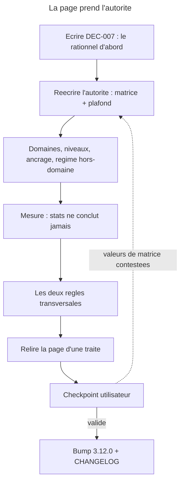

# Instruction: la page fait foi, et l'ADR d'amendement

## Feature

- **Summary**: `docs/control.md` cesse de decrire quatre modulateurs autour d'une table aveugle et decrit un arbitrage : les domaines disent ce qui compte, la phase dit quelle preuve elle en exige maintenant. La page porte la regle et son motif ; DEC-007 porte le rationnel et amende DEC-004, dont le §4 est contredit. **La skill n'est pas touchee dans cette part** — c'est l'ordre impose par DEC-006, et l'ecart page/skill qui en resulte est declare, pas subi.
- **Stack**: `Markdown (docs de plugin), ADR maison (aidd_docs/internal/decisions/), manifestes JSON du marketplace`
- **Branch name**: `refactor/control-phase-domaines`
- **Parent Plan**: `2026_07_28-control-refonte-phase-domaines-master.md`
- **Sequence**: `1 of 3`
- Confidence: 9/10
- Time to implement: ~1 session

## Architecture projection

### Files to modify

- `plugins/overcode/docs/control.md` - le modele cible ; sections d'autorite, de mesure et de pivot reecrites
- `aidd_docs/internal/decisions/004-cross-plugin-pivot-consumption.md` - en-tete de statut : « amende par DEC-007 sur le §4 » ; **le corps n'est pas reecrit**, un ADR ne se recrit pas apres acceptation
- `plugins/overcode/CHANGELOG.md` - entree `3.12.0`, disant explicitement que la page devance la skill
- `plugins/overcode/.claude-plugin/plugin.json` - `3.11.1` -> `3.12.0`
- `.claude-plugin/marketplace.json` - version overcode alignee + version marketplace `3.5.0` -> `3.5.1`
- `CHANGELOG.md` (racine) - entree marketplace `3.5.1`

### Files to create

- `aidd_docs/internal/decisions/007-phase-as-classifying-authority.md` - la phase devient l'autorite classante ; amendement du §4 de DEC-004 ; renommage `Tier thresholds` -> `Anchor boundary` et sa consequence de compatibilite

### Files to delete

- aucun. **Rien ne se supprime dans cette part** : la page perd des sections, elle ne perd pas de fichier, et les cinq doctrines contredites sont reecrites — jamais retirees.

## Applicable rules

| Tool   | Name | Path | Why it applies |
| ------ | ---- | ---- | -------------- |
| claude | plugins-marketplace | `C:\Users\fxgui\.claude\rules\plugins-marketplace.md` | ecrire dans `plugins/overcode/docs/`, jamais dans le cache ; bump et contenu dans le meme commit |
| claude | skill-writing-style | `C:\Users\fxgui\.claude\projects\C--Users-fxgui-Documents-LLM-Marketplace\memory\skill-writing-style.md` | la page est exhaustive et agnostique, le moins de mots possible ; les fixtures sont du materiau, elles ne rentrent pas dans la page |
| claude | readme-existant-only | `C:\Users\fxgui\.claude\projects\C--Users-fxgui-Documents-LLM-Marketplace\memory\readme-existant-only.md` | la page decrit l'existant ; l'historique de la refonte va au `CHANGELOG`, pas dans `control.md` |
| project | CLAUDE.md | `C:\Users\fxgui\Documents\CLAUDE.md` | ne rien committer ni pousser sans demande explicite |
| ADR | DEC-006 | `aidd_docs/internal/decisions/006-control-page-authority.md` | la page fait foi ; page = regle + motif, skill = regle + procedure, ADR = rationnel ; aucune etape de `## Process` ne remonte |
| ADR | DEC-004 | `aidd_docs/internal/decisions/004-cross-plugin-pivot-consumption.md` | §4 contredit, amendement requis ; le contrat est une interface publique |

## User Journey

## Risk register

| Risk | Impact | Mitigation |
| ---- | ---- | ---- |
| Le plafond est lu comme une violation de « l'instrument qui mesure ne peut pas trancher » | La regle transversale et le mecanisme central se contredisent des la premiere lecture ; la skill sera ecrite de travers en part 3 | L'ecrire noir sur blanc a l'endroit du plafond : le plafond **classe**, il n'est pas un instrument de mesure, il est **enonce par la phase devenue l'autorite classante**. La demande l'exige en §3.3, ce n'est pas une precaution du plan |
| La page est reecrite par morceaux et se contredit d'un bout a l'autre | Une incoherence page/page qu'aucune suite `behave` ne peut detecter (DEC-006) | Phase 6 : relecture integrale d'une traite avant le gate, pas une relecture des sections touchees |
| Les valeurs de la matrice sont figees sans avoir ete confrontees a un projet reel | Un plafond calibre en chambre refuse des ajouts legitimes des le premier usage, et la refonte se discredite sur son mecanisme central | Confronter chaque cellule aux deux fixtures avant de la publier (phase 2, tache 4) ; toute valeur qui s'ecarte de §3.2 est justifiee dans DEC-007 |
| Une etape de procedure remonte sur la page a la faveur de la reecriture | Violation directe de DEC-006 ; la page devient une seconde skill et l'autorite se dedouble | Chaque section ecrite repond a « regle + motif » ; toute phrase qui repond a « comment » est renvoyee en part 3 |
| DEC-004 est reecrit au lieu d'etre amende | On perd la trace de ce qui etait vrai le 2026-07-22, et le motif de l'amendement devient illisible | DEC-004 ne recoit **qu'un en-tete de statut** ; tout le contenu de l'amendement vit dans DEC-007 |

## Implementation phases

### Phase 1: DEC-007 — le rationnel avant la regle

> L'ADR porte le rationnel. Ecrit apres la page, il devient une justification retrospective.

#### Tasks

1. Creer `aidd_docs/internal/decisions/007-phase-as-classifying-authority.md`, statut `Accepted`, date du jour, en citant DEC-004 et DEC-006 comme antecedents.
2. **Contexte** : le defaut architectural — la seule autorite classante est aussi la seule aveugle a l'enjeu ; quatre modulateurs ponderent sans pouvoir redresser. Reprendre le mecanisme de §2.1 (le pouvoir de detection tient a l'independance vis-a-vis de la source de l'erreur) **avec son contre-argument non refute** : un test ancre ne prouve que le chemin qu'il parcourt.
3. **Decision 1** : la phase devient l'autorite classante, par une matrice `phase x niveau de domaine`. Motiver l'axe **niveau** et non **nom** : un axe indexe par nom n'est pas enumerable, le catalogue etant un plancher de detection.
4. **Decision 2** : ce qui survit de DEC-004 — §1 (decouverte par glob), §2 (le contrat appartient au consommateur), §3 (une section par champ), et le **principe** du §4 (*le pivot priorise, il ne classe pas*), promu regle transversale. Ce qui tombe : la designation de la table des tiers comme depositaire de l'autorite de classement.
5. **Decision 3** : `Tier thresholds` -> `Anchor boundary`. Motiver par le contenu reel du seul pivot existant (emulateur, hydratation, handler Nitro) : ces regles disent **ou passe la frontiere d'ancrage**, pas quel tier. Acter la consequence : le contrat est une interface publique, le renommage la casse, un pivot tiers non mis a jour perd le champ — d'ou le majeur d'overcode et la correction `sc-js` **dans le meme commit** que le changement de contrat.
6. **Decision 4** : le plafond refuse un ajout et n'exige jamais un retrait, par la meme asymetrie que DEC-006/D3 — refuser un ajout ne fait que resserrer, exiger un retrait deciderait a la place du projet.
7. **Consequences** : le tier devient un nom de sortie ; les composants s'executent en serie (domaines puis phase) ; `05-stats` ne conclut jamais, sous peine de creer un second lieu d'arbitrage.

#### Acceptance criteria

- [ ] `007-phase-as-classifying-authority.md` existe, statut `Accepted`, avec ses antecedents cites.
- [ ] Les quatre decisions sont enoncees separement, chacune avec son motif propre.
- [ ] DEC-004 porte un en-tete « amende par DEC-007 sur le §4 » et **aucune autre modification**.
- [ ] La consequence de compatibilite du renommage est ecrite en toutes lettres.

### Phase 2: L'autorite bascule — la matrice et le plafond

> Le coeur. Si cette phase est floue, les deux autres parts n'ont rien a realiser.

#### Tasks

1. Remplacer la section **« Les quatre autorites »** par **« L'autorite classante »** : les domaines disent ce qui compte, la phase dit quelle preuve elle exige. Le tier est ce qui sort, jamais ce qui decide.
2. Publier la **matrice** sur la page — 4 phases x 4 colonnes, chaque cellule = *preuve exigee + plafond numerique*, en partant des valeurs de §3.2. Dire que `references/decision-matrix.md` en portera le defaut generique et que **le document du projet la surcharge**, sur le mecanisme de precedence deja en place.
3. Ecrire la section **« Le plafond »** : `01-write` sur un domaine sature rend `skip`, motif « plafond atteint (n/n) — `<phase> x <niveau>` », trois sorties offertes (declarer la phase suivante, retirer un test du domaine, forcer par decision explicite tracee). **Refus franchissable, jamais blocage dur.**
4. Ecrire, dans la meme section, les deux justifications sans lesquelles la regle se lit comme une contradiction : (a) le plafond **classe**, et il le peut parce qu'il est enonce par la phase — la borne « l'instrument qui mesure ne peut pas trancher » vise les instruments de mesure, pas l'autorite ; (b) l'unite est un **nombre de preuves, par domaine et par phase**, ce que l'objection de `test-density.md` contre les caps absolus ne vise pas : elle vise un cap projet, incapable de distinguer une grosse suite d'une grosse base de code.
5. Ecarter explicitement l'expression du plafond en multiple de mediane, avec son motif : elle heriterait des cas degeneres de la densite et disparaitrait en `scaffolding`, la phase ou elle compte le plus.
6. Supprimer la section **« Les axes de lecture »** : la matrice les absorbe. Ce qui y survit — les six criteres de risque — devient un **classement intra-domaine**, dit a l'endroit ou la matrice range une colonne.
7. Confronter chaque cellule aux deux fixtures avant de figer les chiffres : `app` sur `production x critique` (`fediverse_auth`, `users`), `ai-hub` sur la colonne hors-domaine. Toute valeur qui s'ecarte de §3.2 est justifiee dans DEC-007.
8. Dire ce que font `default` et `undetermined` : le regime le plus permissif, **en le disant**, et en distinguant les deux — l'un est une decision ecrite du projet, l'autre une question sans reponse.

#### Acceptance criteria

- [ ] La page ne nomme plus « quatre modulateurs » ni « quatre autorites ».
- [ ] La matrice figure sur la page avec ses 16 cellules, chacune portant une preuve exigee et un plafond.
- [ ] La section du plafond porte les trois sorties, le caractere franchissable du refus, et les deux justifications (le plafond classe ; l'unite n'est pas un cap projet).
- [ ] Le mecanisme de surcharge par le document du projet est nomme, sans creer de dispositif nouveau.
- [ ] Aucune phrase de ces sections ne repond a « comment » — elles repondent a « quelle regle » et « pourquoi ».

### Phase 3: Domaines, niveaux, ancrage, regime hors-domaine

> Sans domaine etabli, la matrice n'a pas de colonne. C'est le regime hors-domaine, et il fait partie du mecanisme.

#### Tasks

1. Reecrire **« Les domaines »** : quasi-statiques ; produits par `06-align` a partir du **catalogue x scan du code**, le catalogue etant un **plancher de detection, jamais l'inventaire**.
2. Ecrire les trois niveaux plus le hors-domaine, et dire que **`06-align` attribue le niveau en meme temps que le nom**.
3. Ecrire le **jugement 2 du master** : un domaine qui arrive en argument est en vigueur, et prend son niveau du catalogue ; absent du catalogue, l'action **demande** le niveau et ne devine pas. C'est la jonction manquante entre « `align` attribue le niveau » et « un domaine en argument est en vigueur ». Ecrire aussi ce que devient la reponse : elle vaut **pour l'invocation seule**, l'action le dit, et propose `06-align` pour la figer. **Aucune action autre qu'`align` n'ecrit dans `testing-domains.md`** — un niveau repondu deux fois differemment donnerait deux plafonds sur le meme domaine, exactement la derive que l'idempotence par jugement materialise existe pour empecher.
4. Ecrire qu'**un domaine n'existe que confirme par l'utilisateur**, et que sur une base sans conventions structurelles `align` rendra peu et le residu sera large — **un fait a rapporter, pas un echec a masquer**.
   - **Arbitrer explicitement entre 3 et 4**, sous peine de publier deux regles contradictoires dans la meme section. La confirmation porte sur ce que la **machine propose** : un domaine sorti du scan n'existe que confirme. Un domaine passe **en argument** est deja une declaration de l'utilisateur — l'argument *est* la confirmation, et redemander confirmerait deux fois la meme chose. Ce qui reste a demander dans ce cas n'est pas le domaine, c'est son **niveau**, et seulement s'il est absent du catalogue.
5. Ecrire l'artefact : `<projet>/aidd_docs/memory/testing-domains.md`. **`align` n'ecrit pas dans `testing.md`**, qui reste a `aidd-context` — un fichier, un ecrivain.
6. Ecrire le format des termes : litteraux, insensibles a la casse, plus les chemins. **Pas de regex**, parce que le fichier est edite a la main et qu'une regex y devient illisible puis fausse.
7. Ecrire l'**idempotence par jugement materialise** : `align` juge une fois et fige ; les passages suivants appliquent, seul le residu est scanne a neuf ; appartenance multiple admise ; **capteurs de derive rapportes par `05-stats`, jamais appliques** ; renommer est une operation explicite d'`align`.
8. Ecrire l'**ancrage** comme propriete, avec sa table par stack (application web / API / CLI / bibliotheque), et dire que `contract`, `e2e`, `skip` restent les **noms de sortie** — precision conceptuelle sans rupture de vocabulaire.
9. Ecrire le **regime hors-domaine** : ce n'est pas un repli, c'est une colonne. Chaque action annonce « aucun domaine etabli, regime hors-domaine applique, lancez `06-align` ». Meme regime pour un projet dont le `testing.md` est anterieur a la refonte : sa strategie documentee garde son autorite sur ce qu'elle declare.

#### Acceptance criteria

- [ ] La page nomme les trois niveaux et le hors-domaine, et dit qui les attribue.
- [ ] Le niveau d'un domaine passe en argument est resolu par une regle ecrite, pas laisse implicite.
- [ ] La page dit **laquelle** de « en vigueur des l'argument » et « n'existe que confirme » s'applique a quel cas ; les deux ne coexistent pas sans arbitre.
- [ ] La page dit ce que devient un niveau repondu a l'ecran : non persiste, annonce comme tel, `06-align` propose. `align` reste seul ecrivain de `testing-domains.md`.
- [ ] `testing-domains.md` est nomme comme l'artefact, et l'interdit d'ecrire dans `testing.md` est motive.
- [ ] La table d'ancrage par stack figure sur la page, et le vocabulaire de sortie est declare inchange.
- [ ] Le regime hors-domaine est presente comme un cas du mecanisme, avec l'annonce que chaque action doit rendre.

### Phase 4: La mesure — et ce qu'elle n'a pas le droit de conclure

> Deux lieux d'arbitrage, c'est le defaut que la refonte supprime. Il se reintroduit par `stats` si on ne l'ecrit pas.

#### Tasks

1. Inscrire la borne **telle quelle** : « `stats` affiche ce qui est declare et ce qui est mesure. Il ne produit rien qui soit deduit des deux. » Avec son motif : un verdict du type « il y a un domaine sans sa preuve » est une **application de la matrice**, donc l'arbitrage de la phase.
2. Remplacer, dans la description du rapport, le bloc `VOLUME` (`contract : n / e2e : n / ratio`) par un bloc **`DOMAINES exige / trouve`**.
3. Supprimer de la page le **drapeau « pyramide inversee »**, sans remplacement, avec sa raison : il n'existait que parce que mesurer sans referent oblige a inventer un signal ; la matrice fournit le referent.
4. **Conserver** la table `excluded` et son motif (DEC-006/D5) : elle est ce qui empeche la phase de restreindre en silence.
5. Recadrer **« La densite, pas le compte »** : la densite signale, elle ne classe pas, et elle n'est pas le plafond. Dire ce qui les distingue — la densite est une observation sur une population, le plafond est une exigence enoncee par la phase.
6. Verifier que les sections **« Les frontieres externes »**, **« Ce qui qualifie un retrait »**, **« Les cas limites du classement »**, **« Les confirmations »**, **« Le chainage »**, **« Les parametres »** restent vraies apres la bascule d'autorite ; corriger seulement ce que la matrice invalide, ne pas les reecrire par principe.

#### Acceptance criteria

- [ ] La borne de `stats` figure verbatim.
- [ ] Le bloc `DOMAINES exige / trouve` remplace `VOLUME` dans la description du rapport.
- [ ] Le drapeau pyramide inversee n'apparait plus nulle part sur la page.
- [ ] La table `excluded` est toujours decrite, avec son motif.
- [ ] La difference densite / plafond est enoncee explicitement.

### Phase 5: Les deux regles transversales, enoncees une fois

> Enoncees quatre fois localement, elles derivent. Enoncees une fois, elles se citent.

#### Tasks

1. Ecrire, dans une section propre : **« L'instrument qui mesure ne peut pas trancher. »** — couvre `stats`, la densite, les *Risk signals* du pivot. Dire qu'elle remplace les quatre reecritures locales de la borne d'autorite.
2. Ecrire : **« Le pivot declare ce qu'il fournit, jamais qui le consomme. »** — avec son motif : un champ qui nomme son consommateur s'attribue un droit d'usage exclusif que le contrat ne lui donne pas.
3. Reecrire, cote page, les enonces positifs qui remplacent les cinq doctrines contredites que la part 3 devra realiser (`SKILL.md:77`, `phase-framework.md:5`, `:200`, `:207`, `06-align.md:81`) — **les reecrire, jamais les supprimer**.
4. Ecrire la justification propre de l'invariant de domaine, orpheline depuis que DEC-006 lui a retire son argument par analogie avec la phase. La refonte absorbe cette dette ; elle ne la reporte pas.
5. Mettre a jour **« Voir aussi »** : `decision-matrix.md` et `domain-catalogue.md` y entrent ; `decision-framework.md` en sort si le jugement 1 du master est valide au gate de la part 3 — sinon la ligne reste et sera traitee la-bas.
6. Traiter **`docs/control.md:35`**, qui n'est pas dans « Voir aussi » mais dans le **corps** : la ligne pose `decision-framework.md` comme defaut generique de la precedence. Elle devient `decision-matrix.md`. Le mecanisme de precedence ne change pas — document du projet, sinon defaut generique — seule la cible du defaut change. Sans ce passage, la page publiee en `3.12.0` designe comme autorite un fichier que la part 3 supprime.

7. Traiter **`docs/control.md:37`**, la ligne qui decrit ce que le pivot `testing` apporte par-dessus le generique : elle nomme le champ **`Tier thresholds`**. Le champ devient **`Anchor boundary`** (DEC-007, decision 3) et la ligne dit desormais que le pivot raffine **ou passe la frontiere d'ancrage**, pas quel tier. C'est la seule occurrence du terme sur la page ; la part 3 la verrouille a l'echelle du depot (`! grep -r "Tier thresholds"` sur les fichiers normatifs) et ne touche pas la page — si la part 1 laisse le terme ici, c'est la part 3 qui echoue, sur un fichier qu'elle n'a pas le droit d'editer. D'ou le verrou local ajoute a la `success_condition` de cette part.

#### Acceptance criteria

- [ ] Les deux regles transversales sont enoncees une fois chacune, dans une section qui leur appartient.
- [ ] `plugins/overcode/docs/control.md` ne contient plus aucune occurrence de `Tier thresholds`, et decrit l'apport du pivot en termes de frontiere d'ancrage.
- [ ] Les cinq doctrines contredites ont chacune leur enonce de remplacement sur la page.
- [ ] L'invariant de domaine porte desormais son motif propre, sans analogie avec la phase.
- [ ] Le corps de la page ne designe plus `decision-framework.md` comme defaut de la precedence (`:35`). Une mention subsistante dans « Voir aussi » est admise jusqu'au gate de la part 3 ; une mention dans une regle d'autorite ne l'est pas.

### Phase 6: Relecture, bump, changelog

> Une page reecrite par morceaux se contredit d'un bout a l'autre, et rien d'automatique ne le voit.

#### Tasks

1. Relire `docs/control.md` **integralement, d'une traite**, en cherchant une seule chose : deux endroits qui ne disent pas la meme chose de la meme regle.
2. Verifier qu'aucune phrase de la page ne decrit une etape de procedure.
3. Bumper `plugins/overcode/.claude-plugin/plugin.json` en `3.12.0` et aligner `.claude-plugin/marketplace.json` (entree overcode + version marketplace `3.5.1`).
4. Ecrire l'entree `3.12.0` du `CHANGELOG` d'overcode : ce que la page dit maintenant, **et le fait que la skill est volontairement en retard**, avec l'ordre DEC-006 comme motif. Ecrire l'entree `3.5.1` du `CHANGELOG` racine.
5. `node tools/eval/consistency.mjs` — exit 0.

#### Acceptance criteria

- [ ] La relecture integrale est faite et ses corrections appliquees.
- [ ] `node tools/eval/consistency.mjs` sort 0.
- [ ] Les deux entrees de `CHANGELOG` existent ; celle d'overcode declare l'ecart page/skill et le motive.
- [ ] Aucun fichier de `skills/control/` n'a ete modifie dans cette part.
- [ ] Rien n'est committe ni pousse.

## Amendments

<!-- AI-initiated changes during implementation. Each entry is prefixed with 🤖. -->

- 🤖 **Phase 2 — deux valeurs de la matrice s'écartent de §3.2** : `production × ordinaire` et `sustaining × ordinaire` passent de **2 à 6**. Motif mesuré, pas théorique : sur la fixture `app`, les deux zones les **plus étroites** du dépôt (`messaging`, `offers`) portent six cas chacune, qu'aucune lecture n'appelle de la couverture excessive. Un plafond de 2 refuserait un ajout légitime sur la population la mieux tenue dès le premier usage, et sa seule sortie praticable serait le forçage — un plafond dont le régime normal est d'être forcé n'est plus un plafond. Justifié dans DEC-007, section « Calibrage ». Les colonnes ancrées et la colonne hors-domaine sont **confirmées à l'identique** après confrontation.
- 🤖 **Phase 2 — l'unité de la preuve est définie sur la page** : un comportement établi sous la forme que la cellule exige, ni un fichier ni un cas de test. §3.2 et §3.3 la laissaient ouverte ; sans elle aucune des 16 cellules n'est interprétable.
- 🤖 **Phase 3 — un discriminant de niveau est écrit, et il ne dérive d'aucune source amont.** Ni la demande, ni le master, ni DEC-007 ne disent ce qui range un domaine en critique / structurant / ordinaire. Nommer trois niveaux sans discriminant rendait inapplicable la clause « l'action demande le niveau » : l'utilisateur interrogé n'aurait eu aucun critère pour répondre. Discriminant retenu : par conséquence (argent / accès / donnée irremplaçable → critique ; parcours interrompu sans destruction → structurant). **C'est le seul contenu doctrinal non dérivé des sources ; il se conteste au gate.**
- 🤖 **Phase 3 — `## L'ancrage` est une section de premier niveau**, pas une sous-section des domaines : l'ancrage est une propriété de la preuve, pas du domaine.
- 🤖 **Phase 4 — les trois objets des tâches 1-4 (bloc `VOLUME`, drapeau pyramide, table `excluded`) n'étaient pas sur la page** : ils vivent dans `skills/control/actions/05-stats.md`, hors périmètre de la part 1. « Remplacer dans la description du rapport » a été interprété comme *écrire la règle de sortie que la page ne portait pas encore*, au registre règle + motif. La réécriture effective de `05-stats.md` reste à la part 3.
- 🤖 **Phase 6 — `01-write` prend `domain`.** La table des paramètres le lui refusait encore, alors que le plafond fait de cette action le lieu où il s'oppose, et que l'unique échappatoire de test du master est `01-write ... domain=auth phase=production`. Sans ce paramètre, le mécanisme central est inapplicable **et** intestable. Le domaine y désigne une colonne, jamais un univers de fichiers — `scope` et `domain` restent distincts pour la raison qui les a toujours séparés.
- 🤖 **Phase 6 — « plafond par frontière » devient « borne par frontière »** (`## Les frontières externes`), pour que « il n'y a qu'un plafond en vigueur à la fois » ne se lise pas comme faux deux sections plus loin.
- 🤖 **Phase 1 — DEC-007 porte une section « Alternatives rejetées » et une ligne « Antécédents »** hors des sept tâches. §3.1 pose que la suppression de la phase « ne doit jamais être reproposée » : c'est un rationnel sans autre domicile durable.

### 🤖 Escaladé, puis arbitré par l'utilisateur — `### Le lot de bascule de phase`

**La contradiction est antérieure à la refonte** (vérifié identique à `HEAD`) : « repose sur deux motifs et **exige les deux** » contre la clause d'exclusion « tout test **qu'aucun des deux motifs ne qualifie** », qui laisse entrer un test qualifié par un seul.

**Tranché en faveur de la conjonction ; c'est la clause d'exclusion qui est réécrite** — « tout test que **l'un** des deux motifs ne qualifie pas ». Ce que les evals disent, et qui n'avait pas été relevé lors de l'escalade : `confirmations-scenarios.md` S8 (**PASS ▲**) exige explicitement les deux motifs et exclut un quasi-doublon sans qualification `phase-obsolete` — « un doublon relève de `02-audit`, pas d'une conséquence de phase » ; S10 (**PASS**) qualifie de FAIL un lot rembourré de tests « qu'un seul motif qualifie ». Basculer en disjonction faisait rougir deux scénarios verts, dont un porteur d'un gain acquis.

L'argument qui semblait imposer la disjonction — « les heuristiques seules produiraient un lot vide, donc les conjuguer laisse un ensemble vide » — repose sur une lecture fausse de la phrase justificative. Elle ne dit pas que les heuristiques ne qualifient rien en général ; elle dit qu'elles ne qualifient pas **le cas donné en exemple** (un test de forme de modèle écrit en `scaffolding`, ni doublon, ni trivial, ni getter). L'intersection des deux motifs n'est pas vide : un getter trivial que la phase entrante rend par ailleurs obsolète y tombe.

Le gabarit `06-align.md:37`, qui compte **par motif**, reste compatible : il ventile un lot déjà constitué selon le motif dominant de chaque membre, il ne définit pas l'appartenance.

## Log

<!-- APPEND ONLY. One entry per step attempt. Never rewrite. -->

- 2026-07-28 — branche `refactor/control-phase-domaines` créée depuis `main`.
- 2026-07-28 — phase 1 (DEC-007 + en-tête d'amendement DEC-004) : 4/4 AC, score 100. `004-…md` ne reçoit qu'une ligne, corps intact (vérifié au `git diff`).
- 2026-07-28 — phase 2 (autorité, matrice, plafond, suppression des axes de lecture) : 5/5 AC, score 100. Calibrage confronté aux deux fixtures.
- 2026-07-28 — phase 3 (domaines, niveaux, jugement du domaine en argument, idempotence, ancrage, régime hors-domaine) : 7/7 AC, score 100.
- 2026-07-28 — phase 4 (borne de `stats` verbatim, `DOMAINES exigé / trouvé`, densité recadrée) : 5/5 AC, score 100. 8 corrections de cohérence post-bascule.
- 2026-07-28 — phase 5 (deux règles transversales, cinq doctrines réécrites en positif, invariant de domaine, `decision-matrix.md`, `Anchor boundary`) : 5/5 AC, score 100.
- 2026-07-28 — phase 6 (relecture intégrale d'une traite, bumps, changelogs) : 5/5 AC, score 100. 9 divergences page/page trouvées, 8 corrigées, 1 escaladée.
- 2026-07-28 — `success_condition` vérifiée : `node tools/eval/consistency.mjs` exit 0 ; `007-…md` présent ; `Anchor boundary`, « ne produit rien qui soit », « hors-domaine » présents ; zéro « pyramide invers », zéro `Tier thresholds`. `git status --short plugins/overcode/skills/` **vide**. Rien commité, rien poussé.

## Validation flow demonstration

1. Ouvrir `plugins/overcode/docs/control.md` : la premiere section d'autorite nomme **la phase**, et la matrice y figure avec ses 16 cellules.
2. Chercher « plafond » : la section porte les trois sorties, le refus franchissable, et la phrase qui dit que le plafond classe sans etre un instrument de mesure.
3. Chercher « pyramide » : aucune occurrence.
4. Ouvrir `aidd_docs/internal/decisions/007-phase-as-classifying-authority.md` : quatre decisions, chacune avec son motif ; le §4 de DEC-004 y est cite puis amende.
5. Ouvrir `004-cross-plugin-pivot-consumption.md` : un en-tete de statut renvoie a DEC-007, et le corps est identique a ce qu'il etait.
6. `node tools/eval/consistency.mjs` sort 0 ; `git status` montre que rien de `skills/control/` n'a bouge.
