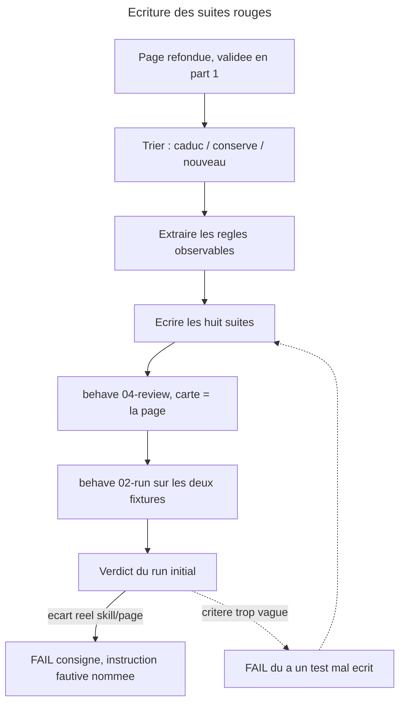

# Instruction: les suites de non-regression, ecrites rouges contre la page

## Feature

- **Summary**: chaque regle de la page refondue devient un scenario `behave`, groupe par famille de regles et non par action. Les suites sont ecrites **avant** l'alignement de la skill et executees telles quelles : le run initial doit reproduire, en FAIL, l'ecart entre une skill encore organisee autour de la table des tiers et une page ou la phase arbitre. Une suite ecrite apres le correctif ne prouve rien. **Les scenarios rendus caducs par la refonte sont reecrits, jamais supprimes en silence** (DEC-006, critere de fin de chantier).
- **Stack**: `overcode:behave (SKILL.md + actions/02-run.md, 04-review.md), suites Markdown, juges dry-run READ-ONLY, fixtures reelles`
- **Branch name**: `refactor/control-phase-domaines`
- **Parent Plan**: `2026_07_28-control-refonte-phase-domaines-master.md`
- **Sequence**: `2 of 3`
- Confidence: 9/10
- Time to implement: ~1 session

## Architecture projection

### Files to create

- `plugins/overcode/skills/control/evals/matrix-scenarios.md` - la matrice, les cellules, le plafond et ses trois sorties, l'ancrage comme propriete, la serie domaines -> phase

### Files to modify

- `plugins/overcode/skills/control/evals/authority-scenarios.md` - la phase classe, plus personne d'autre ; les deux regles transversales, cote observable
- `plugins/overcode/skills/control/evals/phase-scenarios.md` - la phase fixe desormais un plafond ; les scenarios « aucun seuil chiffre » sont inverses, pas retires
- `plugins/overcode/skills/control/evals/domains-scenarios.md` - niveaux, catalogue plancher, confirmation utilisateur, domaine en argument, residu, idempotence
- `plugins/overcode/skills/control/evals/chaining-scenarios.md` - la saturation rend `skip` et non « un `scope` plus etroit » ; le reste des aretes est preserve
- `plugins/overcode/skills/control/evals/confirmations-scenarios.md` - inchange sur le fond, recale sur les nouveaux motifs de refus
- `plugins/overcode/skills/control/evals/measurement-scenarios.md` - `stats` ne conclut jamais ; bloc `DOMAINES` ; drapeau pyramide inversee retire
- `plugins/overcode/skills/control/evals/align-write-scenarios.md` - `testing-domains.md` comme artefact, `testing.md` interdit d'ecriture
- `plugins/overcode/CHANGELOG.md` / `.claude-plugin/plugin.json` / `.claude-plugin/marketplace.json` / `CHANGELOG.md` - bump `3.12.1`, marketplace `3.5.2`

### Files to delete

- aucun. **Aucune suite n'est supprimee, aucun scenario non plus.** Un scenario devenu faux est reecrit contre la nouvelle regle, ou retire avec sa raison consignee dans l'en-tete de sa suite — jamais efface.

### Files explicitly NOT modified

- `plugins/overcode/skills/control/SKILL.md`, `actions/*`, `references/*`. **Les blocs `## Test` des six actions restent intacts dans cette part** : leur transformation en renvoi appartient a la part 3, apres que les suites ont prouve qu'elles tiennent.

## Applicable rules

| Tool   | Name | Path | Why it applies |
| ------ | ---- | ---- | -------------- |
| claude | plugins-marketplace | `C:\Users\fxgui\.claude\rules\plugins-marketplace.md` | ecrire dans `plugins/overcode/skills/control/evals/`, jamais dans le cache |
| claude | skill-writing-style | `C:\Users\fxgui\.claude\projects\C--Users-fxgui-Documents-LLM-Marketplace\memory\skill-writing-style.md` | les fixtures sont du materiau : leurs noms restent dans la suite, jamais dans la skill |
| plugin | behave harness | `plugins/overcode/skills/behave/references/harness-conventions.md` | dry-run READ-ONLY, reproduce-then-confirm, N/A vs FAIL, fixture peuplee |
| plugin | behave quality | `plugins/overcode/skills/behave/references/quality-grid.md` | grille 7 axes par scenario |
| plugin | behave template | `plugins/overcode/skills/behave/assets/scenario-template.md` | squelette de suite impose |
| ADR | DEC-006 | `aidd_docs/internal/decisions/006-control-page-authority.md` | les suites pinnent **la page**, jamais la skill ; les scenarios caducs se reecrivent |
| project | CLAUDE.md | `C:\Users\fxgui\Documents\CLAUDE.md` | ne rien committer ni pousser |

## User Journey

## Risk register

| Risk | Impact | Mitigation |
| ---- | ---- | ---- |
| **Le rouge est massif** — la skill entiere est en retard sur la page, donc presque tout echoue | Le signal se noie : impossible de distinguer un vrai defaut d'un test mal ecrit sur cinquante FAIL | Chaque FAIL nomme l'instruction fautive **par fichier et section**. Le checkpoint 2 du master les tranche un par un. Un FAIL sans instruction nommee est un test a reecrire, par defaut |
| Un scenario existant qui passait est simplement supprime parce que la refonte l'a rendu faux | Perte silencieuse de couverture ; DEC-006 l'interdit nommement | Phase 1 produit une table **caduc / conserve / nouveau** exhaustive sur les 883 lignes de suites existantes ; tout caduc a une ligne de remplacement ou une raison ecrite |
| La matrice n'est exercable sur aucune fixture, faute de domaine declare | Le mecanisme central de la refonte n'est pas teste, et le chantier se conclut sur du declaratif | Domaine passe **en argument** — regle deja publiee (overcode 3.11.0). `app` porte `fediverse_auth`, `users`, `messaging`, `offers`. Le niveau vient du catalogue, regle ecrite en part 1 phase 3 |
| `behave 04-review` score les suites contre la **skill** et condamne exactement les scenarios qui font le travail | La revue de qualite invalide le rouge attendu | Inversion actee **d'emblee** cette fois, pas en amendement : la carte comportementale de la passe 1 est `docs/control.md`, la skill est l'implementation sous test |
| Un scenario pinne une etape de `## Process` | Le test devient fragile a toute reecriture de procedure et sort du perimetre valide | Chaque ligne de scenario cite la **section de la page** qu'elle pin ; une ligne sans regle citee est retiree |
| Le juge lit plus que le chemin de chargement naturel et « voit » une borne que l'action ne montre pas | Un vrai defaut passe en PASS | Chemin de chargement declare par scenario : `SKILL.md` + l'action + les references qu'elle nomme, rien de plus |
| On croit la CI garante de l'etat des suites | Le rouge volontaire est publie sans qu'on sache s'il est vu ; plus tard, le vert de la part 3 est cru sur parole | **`pnpm test` ne lit aucune suite `behave`** — verifie sur disque : `coverage.mjs` lit `evals/scenarios.json` (couverture de routage), `harness.mjs` valide des fixtures de redaction. Le commit de cette part ne rougit donc pas la CI, et le passage au vert de la part 3 n'est atteste **que** par les `Results log`, jamais par `pnpm test` |

## Deux niveaux de verification, decides avant d'ecrire

| Nature de la regle | Exemple dans cette refonte | Verifiee par |
|---|---|---|
| **Observable** | `01-write` sur un domaine sature rend `skip` avec le motif « plafond atteint (n/n) — `<phase> x <niveau>` » ; `05-stats` n'emet aucun verdict deduit | `behave` |
| **Meta / redactionnelle** | « le pivot declare ce qu'il fournit, jamais qui le consomme » ; l'absence de tout consommateur nomme dans `pivot-contract.md` ; le decompte des autorites | passe de coherence documentaire en part 3, tracee dans le `CHANGELOG` |

Une regle meta mal placee peut produire un defaut observable : si `Anchor boundary` est defini sans dire ou passe la frontiere, un juge borne au contrat classe de travers, et cela se voit.

## Implementation phases

### Phase 1: Le tri caduc / conserve / nouveau

> Le seul moment ou l'on peut encore savoir ce que la refonte casse dans la couverture existante.

#### Tasks

1. Parcourir les sept suites existantes scenario par scenario (883 lignes) et classer chacun : **conserve** (la regle survit telle quelle), **caduc-reecrit** (la regle change, le scenario est reformule contre la nouvelle), **retire** (la regle disparait — alors la raison est ecrite dans l'en-tete de la suite).
2. Consigner cette table dans le `Log` de ce plan **avant** d'ecrire quoi que ce soit.
3. Reporter la baseline connue (`authority` 12/12, `domains` 8/9 + un N/A permanent + cinq frictions) : tout PASS conserve qui deviendrait FAIL apres la part 3 est une regression, pas un progres.

#### Caducs identifies d'avance

| Suite | Regle devenue fausse | Devient |
|---|---|---|
| `authority` | « la table des tiers seule classe » | « la matrice `phase x niveau` classe ; la table des tiers ne subsiste que comme noms de sortie » |
| `authority` | « les *Tier thresholds* ne reclassent jamais un cas traversant une vraie frontiere externe » | « `Anchor boundary` dit ou passe la frontiere d'ancrage ; il ne classe rien » |
| `phase` | « aucun seuil chiffre par phase » | **inverse** : la phase fixe un plafond chiffre par cellule, et c'est un plafond, jamais un plancher |
| `phase` | « la phase ne change jamais le tier » | « la phase decide de la preuve exigee ; un domaine sature rend `skip` » |
| `chaining` | « saturation -> `scope` plus etroit, jamais un `domain` comme remede » | a rejuger : la saturation a desormais un sens propre (plafond) et trois sorties nommees |
| `measurement` | drapeau « pyramide inversee » | retire, avec sa raison |
| `measurement` | bloc `VOLUME` | bloc `DOMAINES exige / trouve` |
| `align-write` | ecriture dans `testing.md` | ecriture dans `testing-domains.md`, et interdit sur `testing.md` |

#### Acceptance criteria

- [ ] Chaque scenario des sept suites existantes porte une decision : conserve, caduc-reecrit, retire.
- [ ] Aucun « retire » sans raison ecrite dans l'en-tete de sa suite.
- [ ] La baseline de PASS a preserver est consignee.

### Phase 2: Cadrer les fixtures, y compris ce qu'elles ne peuvent pas

> Une fixture non decrite rend tout verdict incontestable, donc inutile.

#### Tasks

1. Relever pour chaque fixture l'etat qui decide, et l'ecrire dans le bloc `Fixture / preconditions` des huit suites.
2. Etablir, pour `app`, la liste des domaines exercables **par argument** et leur niveau attendu depuis le catalogue : `auth` (`fediverse_auth`, `users`) critique ; `payment` / `offers` a trancher a l'ecriture du catalogue ; `messaging` structurant. Aucun fichier de fixture n'est ecrit.
3. Lister les regles qu'aucune fixture ne peut exercer et les marquer **N/A par avance, avec leur cause**.

#### Etat decisif

| | `app` | `ai-hub` |
|---|---|---|
| Chemin | `C:\Users\fxgui\Documents\Perso\Projects\suddenly\_code\app` | `C:\Users\fxgui\Documents\Perso\Projects\suddenly\_code\ai-hub` |
| Document | `TESTING.md` (86 l.), chemin non conventionnel, rempli **non decisionnel**, seuil 80 % declare | `testing.md` (15 l.), **activement contredit** par le depot |
| Fichiers de test | 80 | 60 |
| Rapport de couverture | `.coverage` present | aucun |
| Phase / domaine declares | aucun / aucun | aucun / aucun |
| Matiere a domaines | `fediverse_auth`, `users`, `messaging`, `offers`, `activitypub` | depot d'outillage, matiere pauvre |
| Ce qu'elle porte | matrice par argument, densite, couverture reelle, pourcentage declare | regime hors-domaine, « aucun rapport de couverture », fait perime |

#### Couverture de la matrice — le plancher, et ce qu'il laisse dehors

> La matrice a 16 cellules. Sans plancher ecrit, « chaque regle nouvelle a un scenario » se satisfait d'**une seule** cellule exercee, et le mecanisme central du chantier sort teste a 6 %.

- **L'axe phase s'exerce par reponse simulee du juge, pas par declaration de fixture.** Aucune des deux fixtures ne declare de phase, et aucune ne doit en declarer : la phase est **posee en question** avant tout classement (regle de `phase-scenarios`), donc un scenario fixe la reponse dans ses preconditions. Le N/A ci-dessous porte sur une *bascule reelle lue dans le projet*, pas sur l'axe.
- **L'axe niveau s'exerce par domaine en argument**, resolu au catalogue : `auth` critique, `messaging` structurant, un domaine ordinaire a nommer a l'ecriture du catalogue, et `ai-hub` pour le hors-domaine.
- **Plancher : au moins 8 des 16 cellules** portent un scenario, dont obligatoirement les quatre coins — `production x critique`, `production x hors-domaine`, `scaffolding x critique`, `sustaining x hors-domaine`. Ce sont les cellules ou le plafond et la preuve exigee divergent le plus ; si le modele se contredit, il se contredit la.
- Les cellules **non couvertes sont listees nommement dans l'en-tete de `matrix-scenarios.md`, avec leur cause**. Une cellule silencieusement absente se lit comme une cellule verte.

#### N/A par avance

- **bascule de phase reelle declaree par le projet** — les deux fixtures sont sans phase ; **cela ne rend pas l'axe phase intestable**, cf. ci-dessus ;
- **resolution depuis un `testing-domains.md` existant** — le fichier n'existe nulle part avant `06-align` ; seule sa proposition est observable en dry-run ;
- **derive de residu entre deux passes separees dans le temps** — non observable sur un run unique ;
- `domains` S3, deja N/A permanent avant le chantier, conserve avec sa cause.

#### Acceptance criteria

- [ ] Les huit suites nomment leur fixture et son etat decisif.
- [ ] Les domaines exercables par argument sont listes avec leur niveau attendu.
- [ ] Au moins 8 des 16 cellules sont couvertes, les quatre coins en font partie, et les cellules laissees dehors sont nommees avec leur cause dans l'en-tete de `matrix-scenarios.md`.
- [ ] Chaque N/A cite sa precondition absente ; aucun N/A n'est compte comme PASS.
- [ ] Aucune fixture stub, aucun document invente, aucune ecriture dans une fixture.

### Phase 3: Ecrire les huit suites

> Une famille de regles par suite ; une regle par ligne ; jamais une etape.

#### Repartition

| Suite | Regles couvertes | Fixtures |
|---|---|---|
| `matrix-scenarios.md` **(nouvelle)** | la cellule dicte la preuve exigee et le plafond ; les domaines d'abord, la phase ensuite ; le plafond rend `skip` avec son motif chiffre ; les trois sorties sont offertes ; le refus est franchissable ; `default` et `undetermined` prennent le regime le plus permissif **et se distinguent** ; la preuve ancree n'est pas le navigateur mais la frontiere publique de la stack | `app` par argument de domaine ; `ai-hub` sur la colonne hors-domaine |
| `authority-scenarios.md` | la phase classe, et rien d'autre ; le tier est un nom de sortie ; la densite signale sans classer ; les *Risk signals* priorisent sans classer ; `Anchor boundary` ne classe pas ; `control` ecrit ce qu'il a mesure et propose sans appliquer | les deux |
| `phase-scenarios.md` | jamais deduite ; question posee avant tout classement ; valeur et provenance sur deux lignes ; appariement force `unanswered` / `undetermined` ; `default` hors machinerie par consentement, `undetermined` bascule ; la phase fixe un plafond chiffre, jamais un plancher ; `03-configure` ne prend ni `phase`, ni `domain`, ni `scope` | les deux |
| `domains-scenarios.md` | `06-align` etablit nom **et** niveau ; le catalogue est un plancher de detection ; **la confirmation porte sur ce que le scan propose, l'argument vaut confirmation** — la seule question restante porte alors sur le niveau, et seulement hors catalogue ; le niveau repondu vaut pour l'invocation seule, n'est pas ecrit, et `06-align` est propose pour le figer ; les quatre actions consommatrices **lisent** `testing-domains.md` avant de classer, avec l'ordre fichier -> argument -> hors-domaine ; termes litteraux, pas de regex ; residu rapporte **avec le terme qui a echoue** ; appartenance multiple ; capteurs de derive rapportes, jamais appliques | les deux |
| `chaining-scenarios.md` | `05-stats` route et ne lance rien ; aucun etat garde ; `01-write` est le puits ; `02-audit` n'a aucune arete vers `01-write` ; `03-configure` atteignable et terminale ; `scope` et `domain` ensemble -> arret ; saturation -> `skip` motive et ses trois sorties | les deux |
| `confirmations-scenarios.md` | un-par-un sur les trois actes ; le lot que l'utilisateur nomme lui-meme, admis pour les **retraits** ; aucun lot pour les **ajouts**, par l'arithmetique du plafond — argument renforce par la refonte, le plafond bougeant a chaque ajout ; l'exception `06-align` sur bascule et ses quatre composants ; lot vide legitime ; balance nette = constat | les deux |
| `measurement-scenarios.md` | « `stats` affiche ce qui est declare et ce qui est mesure, il ne produit rien qui soit deduit des deux » ; bloc `DOMAINES exige / trouve` ; table `excluded` conservee ; densite contre la mediane, alerte a 3x, jamais une cible ; aucun pourcentage produit ; ordres jamais parts ; `covered`/`total` ; cas degeneres et leur ordre ; frontieres externes -> supervision | `app` (couverture reelle, pourcentage declare), `ai-hub` (aucun rapport) |
| `align-write-scenarios.md` | le document du projet appartient a la skill de memoire, tout le monde le lit sauf `06-align` ; `align` ecrit `testing-domains.md` et **jamais** `testing.md` ; document template ou perime -> traite comme absent **en disant lequel des deux cas** ; cinq natures d'ecart ; les deux blocs s'approuvent independamment ; ne jamais creer par defaut ; annoncer la voie d'ecriture, relire, rapporter la divergence sans la corriger ; la phase s'ecrit en declaration, jamais en fait mesure | `ai-hub` et `app` — le contraste est l'observable |

#### Tasks

1. Partir du squelette `behave/assets/scenario-template.md` pour la suite nouvelle, conserver le squelette existant pour les sept autres.
2. Pour chaque scenario : citer la **section de la page** qu'il pin, borner le **chemin de chargement** du juge, privilegier un observable d'ecriture a un jugement de prose.
3. Reprendre les blocs `## Test` des six actions comme **source de couverture**, pas comme autorite : ce qu'ils affirment n'est conserve que si la page refondue le porte.
4. Ecrire de zero les scenarios des regles nouvelles : la cellule, le plafond et ses sorties, la serie domaines -> phase, le niveau d'un domaine en argument, l'ancrage par stack, le bloc `DOMAINES`, l'interdit d'ecriture sur `testing.md`.

#### Acceptance criteria

- [ ] Huit fichiers `*-scenarios.md` existent dans `plugins/overcode/skills/control/evals/`.
- [ ] Chaque scenario cite la section de `docs/control.md` qu'il pin.
- [ ] Chaque scenario declare le chemin de chargement du juge.
- [ ] Chaque regle nouvelle de la phase 3 ci-dessus a au moins un scenario.
- [ ] Aucun scenario ne pin une etape de `## Process`.

### Phase 4: Revue de qualite avant execution

> Une suite rouge de mauvaise qualite produit un verdict rouge inutilisable.

#### Tasks

1. `overcode:behave 04-review` sur chaque suite, **carte comportementale = `docs/control.md`**, cible sous test = `skills/control/`. L'inversion est actee ici, pas decouverte en cours de route.
2. Corriger les scenarios notes trop vagues ou trop larges par la grille 7 axes.
3. Passe de couverture : chaque famille de regles de la page a au moins un scenario ; chaque scenario a au moins une regle.
4. Reprendre les **cinq frictions** consignees au chantier precedent sur `domains` et decider, pour chacune, si la refonte les resout, les deplace ou les laisse : notamment « S5 n'a pas de creneau observable dans `04-strengthen` » et « le residu est defini sur les fichiers source seulement ».

#### Acceptance criteria

- [ ] Les huit revues sont produites et leurs remarques bloquantes traitees.
- [ ] Aucun scenario ne reste rouge sur l'axe « critere decidable ».
- [ ] Les scenarios laisses **jaunes** (jugement de motif, pas d'acte) sont nommes et assumes, avec la consigne « bon acte, mauvais motif = friction, pas PASS ».
- [ ] Les cinq frictions heritees ont chacune un sort ecrit.

### Phase 5: Run initial, et il doit etre rouge

> C'est le run qui prouve que les suites attrapent quelque chose.

#### Tasks

1. `overcode:behave 02-run <suite> <fixture>` pour les huit suites sur les deux fixtures.
2. Consigner chaque run dans le `Results log` de sa suite, au format impose, en nommant la fixture et son etat. **Le verdict s'ecrit en cellule de table — `| FAIL |`, `| PASS |`, `| N/A |`** — et non en prose : c'est ce que la condition de succes de cette part lit, et une mention de `FAIL` dans un paragraphe la satisferait a tort.
3. Pour chaque FAIL : nommer l'instruction manquante ou contradictoire (**fichier + section**). Pour chaque N/A : nommer la precondition absente.
4. Presenter le tableau des FAIL et faire trancher un par un : « vrai defaut » ou « test a reecrire ».
5. Bumper `3.12.1` / marketplace `3.5.2`, ecrire les deux entrees de `CHANGELOG` — l'entree overcode dit que les suites sont volontairement rouges et pourquoi.

#### FAIL attendus au run initial

Si l'un de ces cinq ressort PASS, c'est la **suite** qu'il faut suspecter avant la skill.

| Attendu | Ecart vise | Ou il vit |
|---|---|---|
| FAIL | le tier vient de la table des tiers, pas d'une cellule de matrice | `actions/01-write.md:27`, `:30` |
| FAIL | aucun plafond par domaine n'existe ; `limit` ne vient que du document du projet | `actions/01-write.md:35` |
| FAIL | la phase est declaree incapable de fixer un seuil chiffre | `SKILL.md:80`, `references/phase-framework.md` |
| FAIL | `06-align` ne lit aucun pivot et ne produit ni domaine ni niveau | `actions/06-align.md` |
| FAIL | `05-stats` porte encore le drapeau pyramide inversee et les globs fantomes | `actions/05-stats.md:106`, `:114` |

#### Acceptance criteria

- [ ] Les huit suites portent un `Results log` avec un run `initial` date, la fixture nommee, un tableau de verdicts et un tally.
      Attention : les sept suites existantes portent **deja** un `Results log`, donc le decompte mecanique du `success_condition` est pre-satisfait a 7/8 et ne prouve rien sur la fraicheur des runs. La seule mesure qui porte une preuve est le decompte de `| FAIL |`, aujourd'hui **0 sur les sept fichiers**. La date du run `initial` se verifie a l'oeil, suite par suite.
- [ ] Les cinq FAIL attendus sont observes, ou leur absence est expliquee.
- [ ] Chaque FAIL cite l'instruction fautive par fichier et section.
- [ ] L'utilisateur a tranche chaque FAIL ; la part 3 ne demarre pas avant.
- [ ] `node tools/eval/consistency.mjs` sort 0 ; aucun fichier de fixture n'a change.
- [ ] Rien n'est committe ni pousse.

## Amendments

<!-- AI-initiated changes during implementation. Each entry is prefixed with 🤖. -->

🤖 **Trois ambiguites de la page, escaladees plutot que tranchees en silence.** Chacune est un point ou `docs/control.md` ne dit pas assez pour qu'un critere de test soit ecrit sans choisir a la place de la page. Elles sont consignees ici, et le scenario concerne porte le choix provisoire comme **friction declaree**, jamais comme regle.

1. **Appariement litteral : sous-chaine ou frontiere de jeton ?** La resolution d'un terme de domaine contre l'arbre du code n'indique pas si `auth` doit matcher `fediverse_auth/`. La page dit que l'appariement est litteral, pas ou il s'arrete. `domains-scenarios.md` S14 est construit sur `auth` + `fediverse` — deux termes qui matchent reellement `fediverse_auth/` sur `app` — et le scenario tient dans les deux lectures. La part 3 doit trancher dans la page avant d'ecrire le code de resolution.
2. **Pourcentage produit ou reproduit ?** `## Ce que la mesure rend` interdit ce qui est *deduit* de la declaration et de la mesure, sans dire si un pourcentage lu tel quel dans un rapport de couverture est une reproduction (autorisee) ou une production (interdite). `measurement-scenarios.md` S2 porte l'arbitrage retenu — reproduire une valeur mesuree n'est pas la produire — mais la page ne le dit pas.
3. **Le regime du lot nomme pour le troisieme acte.** La page decrit le lot de bascule de phase et exige ses deux motifs, mais ne regle pas le cas ou l'acte est une **correction de configuration** et non un test. Aucun scenario ne le couvre ; c'est un trou declare, pas un oubli.

🤖 **La densite n'est mesurable sur aucune des deux fixtures, et ce n'est pas reparable ici.** `app` produit une couverture en mode ligne — pas de donnee de branche, cas degenere **3** ; `ai-hub` ne produit aucun artefact — cas **2**. Le cas **4** (population insuffisante) est par consequent inatteignable : le cas 2 le forclot avant qu'il puisse se poser. Aucun fichier de fixture n'a ete modifie pour lever cela — une fixture ecrite pour le test prouve la fixture. Les scenarios concernes sont donc **N/A par fixture**, avec la cause nommee, et la couverture reelle de la densite est reportee en part 3, ou elle demandera une troisieme fixture.

## Log

<!-- APPEND ONLY. One entry per step attempt. Never rewrite. -->

### 2026-07-28 — Phase 1 : le tri caduc / conserve / retire

Lecture prealable : `docs/control.md` (526 l.) integralement, `SKILL.md`, les six actions, `references/phase-framework.md`, les sept suites (883 l., 92 scenarios). Rien n'est encore ecrit dans `evals/`.

**Verdict global : 75 conserves, 17 caducs-reecrits, 0 retires.** Aucun scenario ne disparait. Deux **regles** disparaissent sans emporter de scenario (elles n'en avaient aucun) : le drapeau « pyramide inversee » et le bloc `VOLUME`. Leur raison s'ecrit quand meme dans l'en-tete de `measurement-scenarios.md`, sinon leur absence se lit comme un oubli.

#### `authority-scenarios.md` — 7 conserves / 5 caducs

| # | Decision | Regle apres refonte, ou motif |
|---|---|---|
| S1 | caduc-reecrit | « `production` n'est qu'une entree de ponderation » devient faux : la phase classe. Ce qui tient est ailleurs — `## Ce qui qualifie un retrait` (trois heuristiques et rien d'autre) et `### Le lot de bascule de phase` (les deux motifs exiges). Meme acte attendu, autre regle pinnee |
| S2 | caduc-reecrit | « reponderer sans assigner de tier » : les six criteres ordonnent **dans** une colonne (`### Le classement intra-domaine`) ; changer de phase change la preuve exigee et le plafond, et cela doit se voir |
| S3 | conserve | `### Ce qu'un outlier dit, et ce qu'il ne dit pas` — les deux lectures discriminees avant emission |
| S4 | caduc-reecrit | le garde-fou survit tel quel (`### Le garde-fou`), mais un `domain` en argument **vaut confirmation** et appelle desormais la resolution de son **niveau** (`### Un domaine passe en argument`) |
| S5 | conserve | `### L'instrument qui mesure ne peut pas trancher` nomme explicitement les *Risk signals* |
| S6 (B3) | caduc-reecrit | caduc pre-identifie. *Tier thresholds* → **`Anchor boundary`** : il dit **ou** passe la frontiere d'ancrage, il ne classe rien (`### Ce qui nomme la sortie`, `## L'ancrage`). Et l'attendu « une vraie frontiere externe atterrit `e2e` » contredit `## Les frontieres externes`, qui la rend prouvable **au tier `contract`** — chemin degrade. Le scenario est reecrit sur la position de la frontiere, pas sur le nom de sortie |
| S7 | conserve | `## Ce que la mesure rend` + `## Ce que `06-align` ecrit` › *fait perime* |
| S8 | conserve | `### Ce qui nomme la sortie`, l.90 : `contract`, l'ambiguite signalee, jamais `e2e` en silence |
| S9 | conserve | `## Ce qui qualifie un retrait`, l.377 : examine et blanchi se rapporte |
| S10 | caduc-reecrit | « chaque tier porte le motif qui l'a decide » : le motif est desormais **la cellule de matrice**, plus la table des tiers |
| S11 | conserve | `### Densite et plafond ne se remplacent pas` |
| S12 | conserve | `## La configuration` — l'outil e2e etabli n'est jamais candidat au remplacement |

#### `phase-scenarios.md` — 12 conserves / 1 caduc

| # | Decision | Regle apres refonte, ou motif |
|---|---|---|
| S1–S4 | conserves | `## La phase` l.134 (jamais deduite, question posee avant tout classement) ; `### Valeur et provenance sont deux axes` ; appariement force `unanswered` ⇔ `undetermined` |
| S5 | conserve | l.170 porte verbatim la distinction `default` repondu / `default` declare. Reste **N/A par fixture** |
| S6 (D2) | conserve | `### default et undetermined`, l.190 : `undetermined` bascule des qu'une phase est declaree |
| S7 | conserve | meme ligne : `default` echappe a la bascule **par consentement, non par mecanique** |
| S8 | conserve | `## Les parametres`, l.483 |
| S9 | conserve | l.172 — divergence rapportee, l'argument l'emporte pour l'execution en cours. Reste N/A par fixture |
| S10 | **caduc-reecrit** | caduc pre-identifie, et c'est une **inversion, pas un retrait**. Ce que `## La densite, pas le compte` l.304 interdit est un **plancher** ; `### Le plafond` l.77 autorise explicitement le **plafond chiffre par cellule**. Le scenario se dedouble : (a) aucune cible de couverture chiffree, jamais — conserve ; (b) la phase pose un plafond chiffre en **nombre de preuves**, jamais un pourcentage — nouveau |
| S11 (D5 bis) | conserve | `### Borner en le disant` + `## Ce que la mesure rend` : la table `excluded` est desormais **exigee en sortie**, ce qui donne au scenario le creneau observable qui lui manquait au run 3 |
| S12 | conserve | `### Ce que la phase ne decide pas` — deux rangs, jamais deux faits |
| S13 | conserve | `## Le chainage` l.450 + `## La configuration` |

Note : le caduc pre-identife « la phase ne change jamais le tier » → « la phase decide de la preuve exigee ; un domaine sature rend `skip` » **n'a aucun porteur dans cette suite** — il vivait dans la prose d'en-tete et dans `authority` S2. Il devient un scenario neuf de `matrix-scenarios.md`, et l'en-tete de `phase-scenarios.md` le dit.

#### `domains-scenarios.md` — 5 conserves / 4 caducs

| # | Decision | Regle apres refonte, ou motif |
|---|---|---|
| S1 | **caduc-reecrit** | le repli generique `critical journeys` est **aboli** (`### Le regime hors-domaine`). Devient : aucun domaine etabli → **regime hors-domaine annonce** — « aucun domaine etabli, regime hors-domaine applique » — plus renvoi a `06-align` tant que la question n'a pas ete posee |
| S2 | caduc-reecrit | la liste ne vient plus du seul `testing.md` : `06-align` l'etablit par **catalogue x scan**, l'utilisateur la confirme, `testing-domains.md` la porte (`### Qui produit quoi`) |
| S3 | conserve | `### Qui produit quoi`, l.219 : le pivot complete, il n'ecrase jamais. **N/A permanent conserve avec sa cause** (aucun domaine declare a ecraser, `sc-python` sans pivot) |
| S4 | conserve | `### Le garde-fou` : priorise, ne restreint pas — et desormais « pas du tout, pas meme en le declarant » |
| S5 | conserve | l.262 : le residu est rapporte **avec le terme qui a echoue**. Friction heritee (pas de creneau observable dans `04-strengthen`) → sort a decider en phase 4 |
| S6 | conserve | l.519 : hors de tout domaine fait descendre dans l'ordre et ne qualifie rien |
| S7 | conserve | `## Les parametres` l.482 |
| S8 | caduc-reecrit | `06-align` attribue **le niveau en meme temps que le nom** (l.209) : un domaine nomme sans niveau ne designe aucune colonne. « Aucun domaine » reste une reponse valide, mais elle fait entrer en regime hors-domaine, pas dans un repli |
| S9 | caduc-reecrit | `### Un domaine passe en argument` : **l'argument est la confirmation**. Ne reste a etablir que le niveau — catalogue → sans question ; hors catalogue → demande, jamais devine ; reponse **non persistee**, `06-align` propose pour la figer |

#### `chaining-scenarios.md` — 13 conserves / 0 caduc

Les treize aretes et proprietes du graphe sont reprises **inchangees** par `## Le chainage` (l.428-450) et `### Le contrat de chainage`.

**Arbitrage du caduc pre-identifie — S9 n'est pas caduc.** Le plan le donnait « a rejuger » : la page conserve l.382 **verbatim** — saturation de `04-strengthen` (manques qualifies ≫ `top_n`) → rapporter le total, proposer un `scope` plus etroit, **ne jamais proposer un `domain`**. La saturation du **plafond** est un autre objet : elle porte sur `01-write`, sur un domaine, et rend `skip` avec trois sorties (`### Le plafond`). Deux saturations, deux regles, aucune ne remplace l'autre. S9 est donc **conserve**, et la saturation par plafond recoit un scenario **neuf** — reparti sur `matrix-scenarios.md` (la cellule, le motif chiffre) et `chaining-scenarios.md` (les trois sorties comme aretes offertes).

#### `confirmations-scenarios.md` — 12 conserves / 0 caduc

`## Les confirmations` reprend les douze regles sans en modifier une. S8 (les **deux** motifs exiges) et S10 (lot vide legitime) sont explicitement reportes l.515-519 — **ils ne doivent pas regresser**. S4/S5 gagnent un motif supplementaire : le plafond bouge a chaque ajout, ce qui renforce l'asymetrie sans la changer. Un scenario **neuf** s'ajoute : `### Le lot de bascule de phase` l.519 — **une cellule `—` ne qualifie aucun retrait**.

#### `measurement-scenarios.md` — 13 conserves / 3 caducs

| # | Decision | Regle apres refonte, ou motif |
|---|---|---|
| S1 | conserve | `## La densite, pas le compte` l.293. Reste N/A (`app/.coverage` : `has_arcs = 0`) |
| S2 (B5) | conserve | l.59 « ordres, jamais parts » + l.302. **Verdict FAIL reporte tel quel — arbitrage escalade, non tranche par un juge** |
| S3 | conserve | l.302, la regle mere |
| S4 | conserve | l.312 : `limit` ne vient que d'une limite de nombre de tests explicite. N/A par fixture |
| S5 | conserve | l.312 : un pourcentage n'est pas un budget et ne le devient jamais |
| S6 / S7 | conserves | `### Ce qu'un outlier dit` — les deux lectures. N/A (pas de denominateur) |
| S8 | conserve | `## Les bornes de mesure` l.340 |
| S9 | conserve | l.339 : `covered`/`total` |
| S10 | conserve | l.338 : l'univers vient du glob source ; `domain` ne le reduit pas |
| S11 | conserve | `### Les cas degeneres` cas 2 |
| S12 | **caduc-reecrit** | renumerotation : la page ordonne **quatre** cas degeneres (aucun test / aucun rapport / rapport sans donnees de branche / population insuffisante). La suite dit « cas 3 » pour la population insuffisante, qui est le **cas 4**. Le cas 3 — rapport en mode ligne — est justement celui que `app` exerce reellement (`has_arcs = 0`), et il etait jusqu'ici inatteignable faute de numero |
| S13 | conserve | cas 1. N/A par fixture |
| S14 | conserve | `## Les frontieres externes` l.365 — et la page ajoute que cette borne **n'est pas** le plafond de la matrice et ne s'y additionne pas |
| S15 | **caduc-reecrit** | la liste d'exclusions garde trois sources (l.384) mais la deuxieme change : « ce que la table des tiers classe `skip` » devient « **tout ce que l'arbitrage de la phase classe `skip`** » |
| S16 | **caduc-reecrit** | le bloc `VOLUME` (`contract : n / e2e : n / ratio`) devient **`DOMAINES exige / trouve`** — deux colonnes, aucune troisieme qui les soustraie (`## Ce que la mesure rend`). L'autorite nommee par role et le *gate* survivent |

**Deux regles retirees sans scenario porteur** — a consigner en en-tete de la suite, avec leur raison :
- le drapeau « pyramide inversee » : retire **sans remplacement**. Motif de la page (l.350) : un signal tire du rapport entre deux tiers n'existait que parce que mesurer sans referent oblige a en inventer un ; la matrice fournit le referent, et le signal n'avait aucun destinataire capable d'en faire quelque chose ;
- le bloc `VOLUME` : remplace, cf. S16.

Un scenario **neuf** en decoule : **aucun drapeau ne compare les formes de preuve entre elles.**

#### `align-write-scenarios.md` — 13 conserves / 4 caducs

| # | Decision | Regle apres refonte, ou motif |
|---|---|---|
| S1 | conserve | l.388 : `06-align` est la seule action qui ecrit |
| S2 | conserve | l.123 : par role, jamais par numero d'action |
| S3 / S4 | conserves | l.124-127 (trois formes, dire laquelle) et l.405 (jamais creer par defaut). N/A par fixture |
| S5 | **caduc-reecrit** | « non documente se rapporte comme non documente » survit (l.128) et **gagne une moitie** : le budget declare est nul, **mais ce n'est pas une absence de limite** — le plafond de la matrice s'applique sans qu'aucun document ait a le dire. Ce qui manque est la surcharge, pas la contrainte |
| S6 / S7 | conserves | `## Ce que `06-align` ecrit` — fait perime, decision manquante |
| S8 | **caduc-reecrit** | les deux natures mixtes survivent, mais la **reponse validee se consigne dans `testing-domains.md`**, pas dans le document du projet (l.400) |
| S9–S14 | conserves | l.404 (blocs independants), l.406 (voie annoncee), l.407 (fidelite), l.408 (ajouter est le defaut), l.409 (hors bascule, rien), l.410 (la phase s'ecrit en declaration) |
| S15 | caduc-reecrit | « aucun domaine » reste valide et se consigne, mais le projet passe en **regime hors-domaine — une colonne de la matrice, pas un repli** : il ne perd aucun arbitrage, il en prend un autre (l.411) |
| S16 | **caduc-reecrit — inversion non pre-identifiee par le plan** | la suite attend « proposer la mediane mesuree plutot qu'un nombre invente ». La page l.412 **inverse** : « un plafond se propose **en nombre, jamais en multiple de mediane** » ; la mediane s'enonce **a cote**, comme observation, et ne devient jamais le plafond. Motif ecrit l.79 : l'expression en mediane heriterait des cas degeneres de la densite et disparaitrait en `scaffolding`, la phase ou le plafond compte le plus |
| S17 | conserve | `### L'idempotence par jugement materialise` lui donne enfin un contenu reel. Reste **N/A par le harnais** (dry-run) |

#### Regles neuves sans porteur existant — a ecrire de zero

Aucune n'est un caduc : rien a reecrire, tout a creer. Destination indiquee.

| Regle | Section de la page | Suite |
|---|---|---|
| la cellule dicte la preuve exigee **et** le plafond ; l'axe est le **niveau**, pas le nom | `### La matrice phase x niveau de domaine` | `matrix` |
| une cellule `—` n'exige rien **et** n'a donc aucun plafond | l.40 | `matrix` |
| serie : les domaines disent ce qui compte, la phase quelle preuve elle en exige | `## L'autorite classante` | `matrix` |
| plafond atteint → `skip`, motif « plafond atteint (n/n) — `<phase> x <niveau>` » | `### Le plafond` | `matrix` |
| trois sorties offertes ; refus **franchissable** ; refuse un ajout, **n'exige jamais un retrait** | l.63-69 | `matrix` + `chaining` |
| l'unite du plafond est **la preuve**, ni un fichier ni un cas | l.38 | `matrix` |
| plafond, jamais plancher ; jamais exprime en multiple de mediane | l.77, l.79 | `matrix` + `phase` |
| le plafond **classe**, et la premiere regle transversale ne le vise pas | l.73, l.102 | `matrix` + `authority` |
| `default` / `undetermined` prennent le regime **le plus permissif**, **annonce**, et restent distincts | l.176-186 | `matrix` + `phase` |
| ancre ≠ navigateur : la frontiere publique depend de la stack | `## L'ancrage` | `matrix` |
| `domain` sur `01-write` designe **une colonne**, pas un univers de fichiers | l.484 | `matrix` + `chaining` |
| le niveau repondu **n'est pas persiste** ; `06-align` propose de le figer | l.232 | `domains` |
| le catalogue est un **plancher de detection**, jamais l'inventaire | l.211 | `domains` |
| termes **litteraux**, insensibles a la casse, plus les chemins — **pas de regex** | l.242 | `domains` |
| appartenance multiple admise ; capteurs de derive **rapportes, jamais appliques** ; seuil relatif a plancher absolu | l.250-252 | `domains` |
| les actions consommatrices **lisent** `testing-domains.md` : fichier → argument → hors-domaine | l.238, l.266 | `domains` |
| `align` **n'ecrit pas** dans `testing.md` — un fichier, un ecrivain | l.240 | `align-write` |
| bloc `DOMAINES exige / trouve` ; **aucun drapeau ne compare les formes de preuve** | l.348-350 | `measurement` |
| une **cellule sans exigence** ne qualifie aucun retrait | l.519 | `confirmations` |
| une strategie anterieure au modele **garde son autorite sur ce qu'elle declare** | l.272 | `align-write` |

#### Baseline de PASS a preserver

Etat au dernier run de chaque suite. **79 PASS, 1 FAIL, 12 N/A** sur 92. Tout PASS de cette colonne qui ressortirait FAIL **apres la part 3** est une regression, pas un progres.

| Suite | Dernier run | PASS | FAIL | N/A | N/A nommes |
|---|---|---|---|---|---|
| `authority` | 2 | 12 | 0 | 0 | — |
| `phase` | 4 | 10 | 0 | 3 | S5 (fixture), S9 (fixture), S11 (portee du run) |
| `domains` | 4 | 8 | 0 | 1 | S3 (fixture, **permanent**) |
| `chaining` | 2 | 13 | 0 | 0 | — |
| `confirmations` | 2 | 12 | 0 | 0 | — |
| `measurement` | 5 | 10 | 1 | 5 | S1/S6/S7 (`has_arcs = 0`), S4 (aucun plafond de nombre declare), S13 (fixture) |
| `align-write` | 3 | 14 | 0 | 3 | S3/S4 (fixture), S17 (harnais) |
| **total** | | **79** | **1** | **12** | |

Le seul FAIL en cours est `measurement` S2 (aucun pourcentage produit) — **escalade, arbitrage ouvert**, a reporter tel quel et a ne pas re-scorer.

Rappel mecanique verifie sur disque : les verdicts FAIL historiques sont ecrits **en gras** (`| **FAIL** |`), donc `grep -c "| FAIL |"` rend **0** sur les sept fichiers. Les nouveaux runs doivent ecrire la cellule **non grasse** pour que la condition de succes de cette part les lise.

#### Criteres d'acceptation

- [x] Chaque scenario des sept suites porte une decision : 92/92 — 75 conserves, 17 caducs-reecrits, 0 retires.
- [x] Aucun « retire » sans raison ecrite : aucun scenario retire. Les deux **regles** retirees sans porteur (drapeau pyramide inversee, bloc `VOLUME`) ont leur raison consignee ci-dessus et iront en en-tete de `measurement-scenarios.md`.
- [x] La baseline de PASS a preserver est consignee.

### 2026-07-28 — Phase 2 : cadrage des fixtures, releve sur disque

Tout ce qui suit est **lu sur disque**, pas repris du plan. Trois faits du plan et un fait d'une suite existante sont **perimes** et sont corriges ici avant d'etre reportes dans les huit preambules.

#### Corrections de faits

| Ecrit ou | Affirme | Sur disque | Consequence |
|---|---|---|---|
| Ce plan, table « Etat decisif » | `ai-hub` : **60** fichiers de test | **50** | corrige dans les huit preambules |
| Ce plan, meme table | `TESTING.md` : **86** l. | **85** | idem |
| Ce plan, meme table | `testing.md` : **15** l. | **14** | idem |
| `measurement-scenarios.md`, notes des runs 4 et 5 | « **145** fichiers de test dans `app` » | **80** | le chiffre est reecrit a la reecriture de la suite ; il gonflait d'un facteur 1,8 la population invoquee pour la mediane |
| `domains-scenarios.md` l.25-26 | `app` 80 (juste), `ai-hub` 60 | 80 / **50** | corrige |

Le decompte retenu exclut `venv`, `site-packages`, `node_modules`, `/site/`, `staticfiles` — c'est leur inclusion qui produisait 224 et 1292 au premier comptage.

#### `app` — etat decisif

- Chemin : `C:\Users\fxgui\Documents\Perso\Projects\suddenly\_code\app`.
- Document : `aidd_docs/memory/TESTING.md`, **85 l.**, **chemin non conventionnel** (majuscules ; il ne se resout que parce que Windows est insensible a la casse — sur un systeme sensible, le document est *absent*, ce qui est un observable a part entiere).
- Contenu **rempli mais non decisionnel** : outils, quatre categories de test (**Unit / Integration / Federation / E2E** — `Federation` n'est mappee sur aucun tier), section `## Factories (DEC-019)` ecrite a la main, commande `make check`. **Aucun critere de tier, aucune phase, aucun domaine.**
- Seuil declare **80 %** (`pytest-cov`) ; seuil **reellement applique 50 %** (`--cov-fail-under=50`, `pyproject.toml:102` et `Makefile:30`). L'ecart declare/applique est un observable de `05-stats` : la mesure affiche les deux, elle ne conclut pas laquelle vaut.
- **80 fichiers de test** : `tests/games` 23, `tests/core` 16, `tests/activitypub` 13, `tests/characters` 10, `tests/fediverse_auth` 3, `tests/users` 2, `tests/offers` 1, `tests/messaging` 1, `tests/docs` 1, plus **10** `tests/test_*.py` a la racine. Motif `test_*.py` ; `*_test.py` ne rend rien. Sans filtre, le meme motif rend **214** — c'est cette valeur non filtree qui a produit les chiffres gonfles des runs anterieurs.
- Rapport de couverture : `.coverage` present, `version 7.13.4`, **`has_arcs = '0'`** → mode ligne, **pas de donnee de branche** : c'est le **cas degenere 3** de la page, exercable pour de vrai. **125 fichiers** au rapport contre **131** sources `.py` sous `suddenly/` hors migrations et `__pycache__` — le delta de 6 vient de `[tool.coverage.run] omit`, `pyproject.toml:112`, et alimente la table `excluded`.
- Matiere a domaines : `activitypub`, `characters`, `core`, `docs`, `fediverse_auth`, `games`, `messaging`, `muses`, `offers`, `users`.

#### `ai-hub` — etat decisif

- Chemin : `C:\Users\fxgui\Documents\Perso\Projects\suddenly\_code\ai-hub`.
- Document : `aidd_docs/memory/testing.md`, chemin **conventionnel**, **14 l.**, et **activement contredit par le depot** : « None configured yet » et « N/A (tooling repo, no application logic to test) » face a 50 fichiers de test reels. C'est le cas « document perime » de `align-write`, distinct du cas « document template ».
- **50 fichiers de test** : `tests/muses/*` 47 (`narrate` 10, racine 10, `feedback` 8, `api` 7, `mining` 5, `pipeline` 4, `analysis` 3), `tests/pipelines` 1, `tests/e2e` 1, `pipelines/crawl_rpv` 1. Un seul fichier e2e pour 47 fichiers `muses` : un domaine `muses` passe en argument matche tout sauf `tests/e2e` et `pipelines/`, ce qui rend le residu observable sans le rendre massif.
- **Aucun artefact de couverture, d'aucune sorte** → **cas degenere 2** de la page, exercable pour de vrai.
- Aucune phase, aucun domaine declares. Porte la colonne **hors-domaine** et le contraste du fait perime.

#### Domaines exercables par argument, et leur niveau attendu

La part 2 n'ecrit pas le catalogue (`references/domain-catalogue.md` n'existe pas encore — part 3). Les suites ne peuvent donc **pas** presumer son contenu. La page ne garantit que deux entrees, nommement : `auth` et `payment` (l.211). D'ou :

| Argument | Fixture | Chemin de resolution | Niveau attendu | Ce que le scenario observe |
|---|---|---|---|---|
| `auth` | `app` | **present au catalogue** → niveau pris **sans question** | **critique** | matche `fediverse_auth` (3), `users` (2) ; aucune question posee sur le niveau |
| `messaging` | `app` | **absent du catalogue** → l'action **demande** le niveau | **structurant** (repondu) | la question est posee avant tout classement ; la reponse vaut pour l'invocation seule, n'est **pas** ecrite, et `06-align` est propose pour la figer |
| `games` | `app` | absent du catalogue → demande | **ordinaire** (repondu) | 23 fichiers de test contre un plafond de **6** : la saturation est observable pour de vrai, ce qui est la calibration meme du 6 |
| `payment` | `app` | present au catalogue, **absent du code** | critique | terme litteral : `offers` n'est pas `payment`. Divergence `DOMAINES exige / trouve`, et residu rapporte **avec le terme qui a echoue** |
| *(aucun)* | `ai-hub` | rien ne matche | **hors-domaine** | colonne hors-domaine, pas repli : aucun `critical journeys` ne doit apparaitre |

**Ecart assume avec le plan** : la table de la phase 2 attribuait `messaging` structurant « depuis le catalogue ». Le catalogue ne peut pas etre invoque avant d'exister, et la page ne l'engage que sur `auth` / `payment`. `messaging` et `games` passent donc par la **voie de la question**, qui est elle-meme une regle a couvrir (l.229-230) — la couverture y gagne au lieu d'y perdre.

#### Couverture de la matrice — 10 cellules sur 16, les quatre coins compris

| Phase \ Niveau | critique | structurant | ordinaire | hors-domaine |
|---|---|---|---|---|
| `scaffolding` | **couvert** — ancree, 1 (**coin**) | non couvert | **couvert** — `—` | non couvert |
| `hardening` | **couvert** — ancree + interne, 2 | **couvert** — ancree, 1 | non couvert | non couvert |
| `production` | **couvert** — nominale + degradee, 3 (**coin**) | non couvert | **couvert** — interne, 6 (saturation sur `games`) | **couvert** — `—` (**coin**) |
| `sustaining` | **couvert** — ancree, 4 | non couvert | **couvert** — interne, 6 | **couvert** — interne sur regression, 1 (**coin**) |

Cellules laissees dehors, avec leur cause — a reporter telles quelles dans l'en-tete de `matrix-scenarios.md` :

- `scaffolding × structurant`, `scaffolding × hors-domaine`, `hardening × ordinaire`, `hardening × hors-domaine` — **cellules `—`**. La regle de la cellule vide est **une seule** regle (aucune preuve exigee, donc aucun plafond), et elle est deja exercee deux fois, dont un coin. Une troisieme instance ne produirait aucun observable different.
- `production × structurant`, `sustaining × structurant` — **exigence identique** (ancree, 2). Elle est deja exercee a un plafond different par `hardening × structurant` (ancree, 1) ; ce qui distinguerait ces deux cellules est le chiffre, et le chiffre est deja teste comme variable par la paire `production × critique` (3) / `sustaining × critique` (4).

Le point **non monotone** est couvert explicitement : `sustaining × critique` exige **4** la ou `production × critique` exige **3**. Un modele qui derive le plafond de la phase par croissance simple se trompe la, et nulle part ailleurs.

#### N/A par avance, chacun avec sa precondition absente

| Regle | Precondition absente | Suite |
|---|---|---|
| Bascule de phase **reelle, lue dans le projet** | ni `app` ni `ai-hub` ne declare de phase — et aucune ne doit en declarer : la phase se pose en question. L'axe phase reste exercable par reponse simulee ; c'est la *lecture* qui est N/A | `phase`, `matrix` |
| Resolution depuis un `testing-domains.md` **existant** | le fichier n'existe dans aucune fixture avant `06-align`, et la part 2 n'ecrit rien dans une fixture. Seule la **proposition** d'ecriture est observable en dry-run | `domains`, `align-write` |
| Derive de residu **entre deux passes separees dans le temps** | un run unique ; aucune passe anterieure enregistree | `domains` |
| Pivot ecrasant une resolution **declaree par le projet** (`domains` S3, N/A permanent) | aucune fixture ne declare de domaine, et `sc-python` n'embarque pas de pivot `testing` | `domains` |
| Idempotence par **jugement materialise** relu | exige un `testing-domains.md` ecrit par une passe precedente ; meme cause que la ligne 2 | `domains`, `align-write` |

Aucun de ces N/A n'est compte comme PASS. Aucune fixture stub n'est creee, aucun document n'est invente, rien n'est ecrit dans une fixture.

#### Criteres d'acceptation

- [x] Les huit suites nomment leur fixture et son etat decisif — le bloc `Fixture / preconditions` de chaque suite reprend le releve ci-dessus (pose a l'ecriture, phase 3).
- [x] Les domaines exercables par argument sont listes avec leur niveau attendu et leur **voie de resolution**.
- [x] 10 des 16 cellules sont couvertes, les quatre coins en font partie, les six autres sont nommees avec leur cause.
- [x] Chaque N/A cite sa precondition absente.
- [x] Aucune fixture stub, aucun document invente, aucune ecriture dans une fixture.

### 2026-07-28 — Phase 3 : les huit suites ecrites

Une suite creee, sept reecrites. Rien touche hors `plugins/overcode/skills/control/evals/` — `SKILL.md`, `actions/`, `references/` restent intacts, comme voulu. Aucun `Results log` n'a ete modifie : les runs anterieurs sont un registre, pas une affirmation, et ils sont conserves mot pour mot.

| Suite | Scenarios avant | Apres | Reecrits | Nouveaux |
|---|---|---|---|---|
| `matrix-scenarios.md` **(nouvelle)** | — | 17 | — | M1–M17 |
| `authority-scenarios.md` | 12 | 13 | S1, S2, S4, S6, S10, S11 | S13 |
| `phase-scenarios.md` | 13 | 15 | S10, S11 | S14, S15 |
| `domains-scenarios.md` | 14 | 15 | S1, S2, S5, S8, S9 | S10–S15 |
| `chaining-scenarios.md` | 13 | 14 | S13 (pin) | S14 |
| `confirmations-scenarios.md` | 12 | 14 | — | S13, S14 |
| `measurement-scenarios.md` | 16 | 19 | S12, S15, S16 | S17, S18, S19 |
| `align-write-scenarios.md` | 17 | 19 | S5, S8, S15, S16 | S18, S19 |
| **Total** | **92** | **126** | **21** | **34** |

Aucun scenario retire, conformement au tri de la phase 1.

**Les inversions, ecrites comme telles.** Quatre scenarios disaient l'exact contraire de la page refondue et sont retournes plutot que supprimes, leur en-tete portant le motif : `phase` S10 (la phase **porte** desormais un nombre — un plafond de preuves, jamais une cible ni un plancher), `measurement` S16 (`VOLUME` par tier -> `DOMAINES exige / trouve`), `measurement` S18 (le drapeau pyramide inversee tombe sans remplacement), `align-write` S16 (un plafond se propose **en nombre**, la mediane a cote comme observation). Les trois derniers sont des FAIL attendus qui citent leur ligne : `05-stats.md:106`, `05-stats.md:114`, `06-align.md:87`.

**Les regles qui meurent sans porteur, consignees en en-tete.** `domains-scenarios.md` enregistre la disparition du repli « parcours critiques » et de la liste de domaines proposee par defaut ; `measurement-scenarios.md` enregistre que le bloc `VOLUME` par tier et le drapeau pyramide inversee ne disparaissent pas sans surveillance — leur absence est notee a S16 et S18. Un retrait que personne ne teste est indiscernable d'un retrait que personne n'a fait.

**Corrections de faits portees dans les en-tetes.** `ai-hub` 50 fichiers de test (et non 60), `testing.md` 14 l. ; `app` 80 fichiers, `TESTING.md` 85 l., `.coverage` en **mode ligne** (`has_arcs = '0'`) donc cas degenere **3** et non fixture a mediane, 80 % declare contre 50 % applique. Le chiffre « 145 fichiers » des runs 4 et 5 de `measurement` est faux (compte non filtre, 214 brut) : la correction est ecrite dans l'en-tete, le log reste tel quel.

**Renumerotation des cas degeneres.** La page en compte quatre et *population insuffisante* passe de 3 a 4 ; `measurement` S12 devient le scenario de la numerotation et de l'ordre, en deux runs — `app` cas 3, `ai-hub` sous `scope` etroit cas 4.

**Convention introduite et repetee dans les huit `How to run` :** la colonne *Page rule pinned* est destinee au mainteneur, pas au juge. Elle dit quelle regle de la page une ligne protege, pour qu'une edition de la page retrouve ses scenarios ; le juge ne charge jamais la page, sa lecture reste bornee par *Judge load path*. Cela clot la friction du run 3 de `phase-scenarios.md`.

#### Criteres d'acceptation

- [x] Huit fichiers `*-scenarios.md` existent dans `plugins/overcode/skills/control/evals/`.
- [x] Chaque scenario cite la section de `docs/control.md` qu'il pin.
- [x] Chaque scenario declare le chemin de chargement du juge.
- [x] Chaque regle nouvelle de la phase 3 a au moins un scenario.
- [x] Aucun scenario ne pin une etape de `## Process`.

### 2026-07-28 — Phase 4 : revue de qualite avant execution

Revue en deux passes sur les huit suites (couverture comportementale, puis grille de qualite), puis reparation. Rien touche hors `evals/`.

| Suite | Apres phase 3 | Apres phase 4 |
|---|---|---|
| `matrix-scenarios.md` | 17 | 18 |
| `authority-scenarios.md` | 13 | 16 |
| `phase-scenarios.md` | 15 | 18 |
| `domains-scenarios.md` | 15 | 16 |
| `chaining-scenarios.md` | 14 | 16 |
| `confirmations-scenarios.md` | 14 | 16 |
| `measurement-scenarios.md` | 19 | 25 |
| `align-write-scenarios.md` | 19 | 23 |
| **Total** | **126** | **148** |

**Ce que la revue a trouve, par nature.**

- **Faux bons tests** — critere qu'un run satisfait sans exercer la regle. `chaining` S3 etait ancre sur un chiffre de densite non mesurable sur `app` : reancre sur le ratio `covered`/`total`. `measurement` S18 exigeait le declenchement d'un drapeau qui ne peut pas se declencher : le run doit desormais **enumerer les drapeaux qu'il a evalues**, et evaluer un ratio contract/e2e est le FAIL, `app` n'ayant pas d'arbre e2e. `confirmations` S13 a recu un observable positif. `domains` S14 a ete rebati sur `auth` + `fediverse`, qui matchent reellement `fediverse_auth/`.
- **Criteres contradictoires entre scenarios d'une meme suite** — quatre cas, tranches et non contournes : `phase` S13 (ignorer `scope`/`domain` en silence a `03-configure` est un FAIL simple) ; `phase` S14 vs S11 (`### Borner en le disant` accorde a la phase le pouvoir d'exclure, la mention est retiree de la liste de FAIL de S14) ; `domains` S11 (nommer `06-align` est **exige**, ne pas l'offrir est un FAIL) ; `align-write` S12 vs S18 sur l'ecriture dans `TESTING.md`.
- **Faits errones dans les en-tetes** — `ai-hub` annonce a 60 fichiers de test en trois endroits (reel : 50) ; `ai-hub scripts/` a 5 `.py` (reel : 6) ; pins de page perimes dans `authority` (`## Les quatre autorites` -> `## L'autorite classante`, `### Qui remplit la table des tiers` -> `### Ce qui nomme la sortie`) ; glyphe corrompu dans `matrix` ; `align-write` encodait encore la regle a **deux** formes du document alors que la page en porte **trois**.
- **Sur-credit de couverture** — la table de couverture de `matrix` attribuait `sustaining × ordinaire` a M10 a tort : ramenee de 10/16 a 9/16, la cellule passee dans la liste « laissees de cote, et pourquoi », plancher de 8 et quatre coins reverifies.
- **Unite du plafond rendue coherente** — la saturation se dit partout en **nombre de preuves**, jamais derivee d'un compte de fichiers ; `matrix` M15 fait de la derivation elle-meme un FAIL.

**Reparation de `align-write-scenarios.md`.** L'agent qui la traitait est mort en cours d'edition (`API Error: Connection closed mid-response`), laissant des identifiants dupliques (`S1 S2 S3 S5 S4 S5 S6 …`) et des renvois vers des lignes inexistantes. Reprise a la main : renumerotation complete en 23 lignes contigues, ancien S8 eclate en S9/S10/S11, ancien S15 eclate en S18/S19, et une **note de correspondance** posee en tete du `Results log` — les runs 1 a 3 y sont conserves mot pour mot mais lisent l'ancienne numerotation, et une numerotation changee sans table de correspondance rend un registre faux au lieu de le rendre incomplet.

**Ce que la phase a coute au run.** Le corpus est passe de 126 a 148 scenarios pendant la reparation. Jouer les 148 en part 2 est devenu hors de portee, et c'est la raison directe du periemetre d'echantillon de la phase 5.

#### Criteres d'acceptation

- [x] Les huit suites revues en deux passes.
- [x] Aucun faux bon test connu subsistant.
- [x] Identifiants contigus dans les huit suites (verifie mecaniquement).
- [x] Aucun fichier hors `evals/` modifie.

### 2026-07-28 — Phase 5 : run initial, echantillon discriminant

**Ce qui a ete joue, et pourquoi pas tout.** Le corpus final est de 148 scenarios ; jouer les 148 en part 2 etait hors de portee (cf. phase 4). Le run est donc un **echantillon discriminant** : 53 scenarios joues sur 148, sur la fixture `app` sauf pour les rows ancrees `ai-hub`. Sa composition est ce qui lui donne sa valeur — il ne contient pas que les rouges predits. Chaque suite y met **deux a trois temoins verts**, choisis parmi les scenarios qui epinglent une regle que la refonte ne change pas : un run compose des seuls rouges predits confirme la prediction au lieu de la tester, et satisfait le seuil de `success_condition` par construction.

| Suite | Run | Joues | PASS | FAIL | N/A |
|---|---|---|---|---|---|
| `matrix` | 1 | 9 | 1 | 7 | 1 |
| `authority` | 3 | 6 | 3 | 3 | 0 |
| `chaining` | 3 | 5 | 3 | 2 | 0 |
| `confirmations` | 3 | 5 | 3 | 2 | 0 |
| `confirmations` (S8/S10, `ai-hub`) | 4 | 2 | 0 | 2 | 0 |
| `domains` | 5 | 7 | 2 | 5 | 0 |
| `phase` | 4 | 6 | 3 | 3 | 0 |
| `measurement` | 6 | 7 | 5 | 2 | 0 |
| `align-write` | 4 | 6 | 3 | 3 | 0 |
| **Total** | | **53** | **23** | **29** | **1** |

**Les cinq FAIL attendus sont tous observes**, aux lignes annoncees : `01-write.md:27`/`:30` et `:35`, `SKILL.md:80` avec `phase-framework.md:9`, `06-align.md` (aucun pivot lu, aucun domaine ni niveau produit), `05-stats.md:106` et `:114`. Aucun n'est ressorti PASS, donc aucune suite n'est a suspecter de ce chef.

**Une cause unique derriere la majorite des rouges, nommee row par row.** L'appareil `phase × niveau` n'existe dans aucun fichier de la skill : `references/` ne contient que les quatre fichiers d'origine, et le vocabulaire de niveau comme `testing-domains.md` n'apparaissent nulle part hors `evals/`. Les juges avaient consigne de la nommer par row plutot que de la fusionner ; plusieurs ont ajoute d'eux-memes qu'en compter autant de defauts independants surestimerait la part 3 et inviterait autant de correctifs partiels.

**Deux rouges ne sont pas des manques mais des contradictions**, et c'est la trouvaille du run qu'aucune lecture de la page n'aurait donnee. `actions/01-write.md:11` **refuse** positivement l'argument `domain` — la part 3 doit l'abroger, pas seulement completer autour. `actions/06-align.md:121` enonce l'exclusion du batch de bascule sous forme **disjonctive** (*« every test neither of the two motives qualifies »* n'exclut que si les **deux** motifs echouent) quand la regle arbitree exige les deux motifs. Une part 3 purement additive laisserait les deux debout.

**S8 et S10 de `confirmations` : verifies separement, et le resultat ne se lit pas comme une regression.** Les deux sont ancres `ai-hub`, donc hors de portee d'un echantillon `app` ; ils ont ete joues dans un run 4 dedie plutot que transposes sur un analogue `app` invente. Les deux sortent FAIL, alors que leurs ancetres etaient PASS aux runs 1-2 — mais contre des criteres **plus minces**, la phase 4 les ayant durcis. C'est la premiere application de la barre actuelle, pas une perte de terrain. La regle qu'ils portent survit intacte dans la suite, ce qui est ce qui devait etre protege.

**Deux defauts de suite reparés au lieu d'etre consignes en FAIL**, un temoin rouge etant un defaut de la suite tant que le contraire n'est pas etabli. `align-write-scenarios.md` annoncait quatre rouges attendus alors que l'absence du second regime d'ecriture (`testing-domains.md` en ecriture directe, inexistant dans la skill) en coule trois de plus : l'annonce dit six et nomme cette absence comme cause distincte. `domains-scenarios.md` S13 jugeait une regle d'appariement enoncee dans aucun fichier chargeable — ni FAIL nommable, ni PASS meritable : la row porte desormais une clause faisant de cette absence meme le FAIL, et reste non jouee.

**Limites du run, declarees.** La suite `matrix` n'a pu fournir qu'**un seul** temoin vert (M13) : presque toutes ses rows dependent de la matrice absente, ce qui est en soi un constat sur cette suite. Chaque suite declare dans son `Results log` lesquelles de ses rows n'ont pas ete jouees et que le reste est reporte en part 3 — aucune ne laisse croire a une baseline complete. Plusieurs juges ont signale d'eux-memes une derive de perimetre (fichiers lus hors de leur chemin de chargement declare, pour s'orienter) en precisant qu'aucun verdict n'y reposait.

#### Criteres d'acceptation

- [x] Les huit suites portent un `Results log` avec un run date, la fixture nommee, un tableau de verdicts et un tally.
- [x] Les cinq FAIL attendus sont observes.
- [x] Chaque FAIL cite l'instruction fautive par fichier et section.
- [ ] **L'utilisateur a tranche chaque FAIL — non fait, et c'est le gate d'entree de la part 3.**
- [x] `node tools/eval/consistency.mjs` sort 0 ; aucun fichier de fixture n'a change (`git status` propre sur `app` et `ai-hub`).
- [x] Rien n'est committe ni pousse.
- [x] Bumps `3.12.1` / `3.5.2` poses apres le run, deux entrees de `CHANGELOG` ecrites.

## Validation flow demonstration

1. `ls plugins/overcode/skills/control/evals/` : huit fichiers `*-scenarios.md`.
2. Ouvrir `matrix-scenarios.md` : un scenario decrit `01-write` sur `app` avec `domain=auth phase=production`, attend un plafond chiffre et, une fois atteint, un `skip` motive « plafond atteint (n/n) », en citant la section « Le plafond » de la page.
3. Ouvrir son `Results log` : un run `initial` date, fixture `app` nommee avec son etat, et le FAIL correspondant citant `actions/01-write.md:35`.
4. Ouvrir `phase-scenarios.md` : le scenario « aucun seuil chiffre » n'a pas disparu — il est **inverse**, et l'en-tete de la suite dit pourquoi.
5. Verifier qu'aucun fichier des deux fixtures n'a change : `git -C <fixture> status` propre, ou horodatages inchanges.
