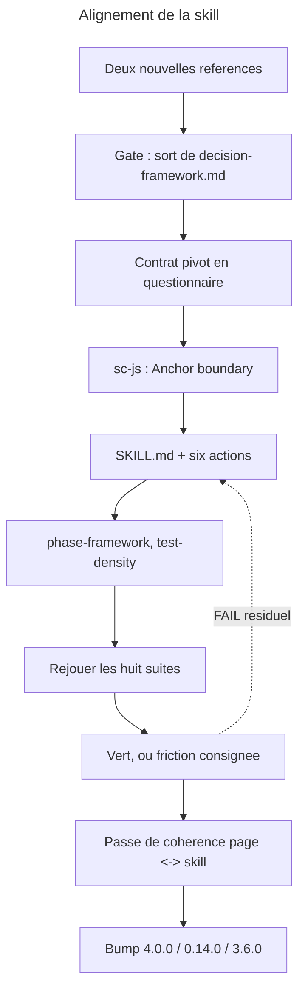

# Instruction: la skill rattrape la page

## Feature

- **Summary**: la skill passe d'une table des tiers entouree de quatre modulateurs a une matrice `phase x niveau de domaine` appliquee en serie apres la resolution des domaines. Deux references naissent (`decision-matrix.md`, `domain-catalogue.md`), le contrat pivot est reecrit en questionnaire, quatre rebranchements pivot sont poses, un champ fantome et un drapeau sans destinataire disparaissent. Le renommage `Tier thresholds` -> `Anchor boundary` casse une interface publique : la correction de `sc-js` **atterrit dans le meme commit** que le changement de contrat, et overcode passe en majeur.
- **Stack**: `Markdown (SKILL.md, actions, references), pivot sc-js, overcode:behave, tools/eval (node), manifestes JSON`
- **Branch name**: `refactor/control-phase-domaines`
- **Parent Plan**: `2026_07_28-control-refonte-phase-domaines-master.md`
- **Sequence**: `3 of 3`
- Confidence: 9/10
- Time to implement: ~1 session longue (13 fichiers touches, 2 crees, 1 pivot externe)

## Architecture projection

### Files to create

- `plugins/overcode/skills/control/references/decision-matrix.md` - la matrice generique par defaut, surchargeable par le document du projet ; absorbe la definition des noms de sortie `contract` / `e2e` / `skip` et la distinction preuve ancree / preuve interne
- `plugins/overcode/skills/control/references/domain-catalogue.md` - une douzaine de domaines transverses, niveau par defaut, termes litteraux de resolution ; **plancher de detection, jamais inventaire**

### Files to modify

- `plugins/overcode/skills/control/SKILL.md` - `:77` (quatre modulateurs -> la phase arbitre), `:79` (precedence + borne de raffinement du pivot), `:80` (l'interdit de seuil chiffre tombe et se reecrit en « plafond, jamais plancher »), **`:98`** (le bloc `## References` cite `decision-framework.md` : la ligne est remplacee par `decision-matrix.md` + `domain-catalogue.md`)
- `actions/01-write.md` - classement par cellule ; plafond, `skip` motive, trois sorties ; branchement *Risk signals* ; `:31` recale sur l'ancrage ; **`:27`** (charge `testing.md` pour la table des tiers -> charge `testing-domains.md` pour les domaines et leurs niveaux, et la cellule pour le regime)
- `actions/02-audit.md` - branchement *Risk signals* ; **`:29`** (la definition du test trivial cite `decision-framework.md` : le renvoi passe a `decision-matrix.md`, la definition ne change pas) ; lecture de `testing-domains.md`
- `actions/03-configure.md` - branchement *Coverage command* ; **et *Canonical E2E tool*** (arbitrage : le brancher, pas le supprimer)
- `actions/04-strengthen.md` - les six criteres de risque deviennent un classement **intra**-domaine (`:51`) ; le classement se lit dans la colonne, plus dans la table des tiers ; **`:31`** (charge `decision-framework.md` en defaut -> charge `decision-matrix.md`) ; lecture de `testing-domains.md`
- `actions/05-stats.md` - `:106` glob fantome **supprime** ; `:114` drapeau pyramide inversee **supprime sans remplacement** ; bloc `VOLUME` -> `DOMAINES exige / trouve` ; table `excluded` **conservee** ; borne « ne conclut jamais » inscrite ; capteurs de derive rapportes ; **`:42`** (la ligne `authority` **imprime** `references/decision-framework.md` dans le rapport rendu a l'utilisateur : le chemin devient `decision-matrix.md`) ; lecture de `testing-domains.md` pour alimenter le bloc `DOMAINES`
- `actions/06-align.md` - devient le **producteur** des domaines : catalogue x scan, niveau attribue avec le nom, confirmation utilisateur, ecriture de `<projet>/aidd_docs/memory/testing-domains.md`, jugement fige en termes litteraux, branchement *Domain resolution* ; `:81` reecrit
- `references/pivot-contract.md` - reecrit **en format questionnaire** ; `Tier thresholds` -> `Anchor boundary` ; `:24` (borne unidirectionnelle sur le tier) supprime ; `:3` cite `decision-framework.md`, la citation ne survit pas a la reecriture ; **aucun champ ne nomme son consommateur**
- `references/phase-framework.md` - `:5`, `:200`, `:207` reecrits ; `:5` cite `decision-framework.md` comme autorite de tier, la citation part avec la reecriture ; `:199-203` recoit enfin sa justification propre, orpheline depuis DEC-006
- `references/test-density.md` - `:13` recadre (il vise un cap **projet**, pas un plafond par domaine et par phase) ; **`:65`** borne d'autorite renvoyee a la regle transversale — la ligne reenonce localement « the tier table in force … or `decision-framework.md` », donc elle porte a la fois la duplication que la regle transversale supprime **et** une citation du fichier supprime
- `plugins/sc-js/skills/sniff/references/capabilities/tools/testing.md` - `## Tier thresholds` (`:86-104`) -> `## Anchor boundary`, **contenu conserve tel quel** ; `:59` la clause « Priorisent le classement de `strengthen` » de *Risk signals* retiree (le pivot ne nomme pas son consommateur) **et avec elle la citation de `decision-framework.md`** — un pivot ne nomme pas davantage un fichier interne du consommateur qu'une de ses actions
- `plugins/overcode/CHANGELOG.md`, `plugins/sc-js/CHANGELOG.md`, `CHANGELOG.md` (racine)
- `plugins/overcode/.claude-plugin/plugin.json` (`4.0.0`), `plugins/sc-js/.claude-plugin/plugin.json` (`0.14.0`), `.claude-plugin/marketplace.json` (`3.6.0` + les deux entrees)
- les huit `evals/*-scenarios.md` - **uniquement leur `Results log`**, pour consigner les runs de confirmation

### Files to delete

- `plugins/overcode/skills/control/references/decision-framework.md` - **sous reserve du gate de la phase 1**. La table des tiers perd son autorite ; la conserver retrogradee laisserait une seconde table lisible comme classante, exactement le defaut supprime. Ce qui doit survivre — la definition des noms de sortie — part dans `decision-matrix.md`.

## Applicable rules

| Tool   | Name | Path | Why it applies |
| ------ | ---- | ---- | -------------- |
| claude | plugins-marketplace | `C:\Users\fxgui\.claude\rules\plugins-marketplace.md` | travailler en source ; bump et contenu dans le meme commit ; aucune installation contre un arbre sale |
| claude | skill-writing-style | `C:\Users\fxgui\.claude\projects\C--Users-fxgui-Documents-LLM-Marketplace\memory\skill-writing-style.md` | la skill est exhaustive et agnostique, le moins de mots possible ; aucun nom de fixture n'entre dans la skill |
| claude | readme-existant-only | `C:\Users\fxgui\.claude\projects\C--Users-fxgui-Documents-LLM-Marketplace\memory\readme-existant-only.md` | l'historique du chantier va aux `CHANGELOG`, pas dans les references |
| project | CLAUDE.md | `C:\Users\fxgui\Documents\CLAUDE.md` | ne rien committer ni pousser |
| ADR | DEC-006 | `aidd_docs/internal/decisions/006-control-page-authority.md` | la skill porte regle + procedure ; aucune regle de la page sans contrepartie procedurale |
| ADR | DEC-004 + DEC-007 | `aidd_docs/internal/decisions/` | contrat = interface publique ; le renommage la casse, d'ou le majeur et le commit commun |
| CI | `tools/eval` | `package.json` -> `pnpm test` | `consistency` (manifestes, tables d'actions), `harness`, `coverage`, `selftest` |

## User Journey

## Risk register

| Risk | Impact | Mitigation |
| ---- | ---- | ---- |
| Le renommage du champ pivot est committe sans la correction de `sc-js` | Le seul pivot existant perd 19 lignes de savoir stack verifie, en silence, et personne ne le voit avant le prochain run | Contrainte explicite de la demande : **meme commit**. Le `success_condition` de cette part echoue tant que `Tier thresholds` subsiste dans un fichier **normatif** sous `plugins/` — les `CHANGELOG` et les `evals/` sont exclus, le plan exigeant lui-meme d'y nommer l'ancien titre (recit du renommage, motif de retrait d'un scenario) |
| `decision-framework.md` est conserve « au cas ou » | Deux tables classantes coexistent ; la refonte n'a rien supprime, elle a ajoute | Gate en phase 1. Si l'utilisateur veut le conserver, il conserve un fichier **sans autorite et sans lecteur**, ce qui doit alors etre ecrit dedans, en premiere ligne |
| Le contrat reecrit en questionnaire nomme encore un consommateur quelque part | La regle transversale 2 est publiee et violee dans le fichier meme qui l'illustre | Verification mecanique dans le `success_condition` (`Consumed by` absent) + relecture champ par champ : chaque section repond « ce que je fournis », jamais « qui s'en sert » |
| Les valeurs de la matrice figees en part 1 se revelent inapplicables une fois la skill ecrite | Le plafond refuse des ajouts legitimes des le premier usage | Les runs de confirmation sur `app` avec domaine en argument sont la premiere epreuve reelle. Toute valeur revisee remonte **sur la page et dans DEC-007**, jamais seulement dans la reference |
| La passe de coherence page <-> skill est sautee parce que les suites sont vertes | Precisement le trou que DEC-006 nomme : `behave` teste des sorties, jamais la coherence entre deux documents normatifs | Phase 6 obligatoire, tracee dans le `CHANGELOG`, avec sa liste de regles verifiees une par une |
| Un bloc `## Test` d'action reste en affirmation au lieu de renvoyer aux suites | La skill re-affirme des regles a un second endroit et l'ecart repart | Phase 6 : les six blocs `## Test` deviennent des renvois vers les suites, avec les scenarios cites |

## Implementation phases

### Phase 1: Les deux references neuves, et le sort de l'ancienne

> C'est la que la matrice devient un artefact, pas une idee.

#### Tasks

1. Ecrire `references/decision-matrix.md` : les 16 cellules, chacune *preuve exigee + plafond*, identiques a celles publiees sur la page. Y ecrire la distinction **preuve ancree / preuve interne**, la table d'ancrage par stack, et la definition des **noms de sortie** `contract` / `e2e` / `skip`.
2. Y ecrire la **precedence** : document du projet, sinon defaut generique — sur le mecanisme existant (`05-stats:42`, `authority : project doc <path> | generic default`). Aucun dispositif nouveau.
3. Ecrire `references/domain-catalogue.md` : une douzaine de domaines transverses, chacun avec **nom + niveau par defaut + termes litteraux de resolution + chemins**. Insensible a la casse, **pas de regex**. En tete du fichier : « plancher de detection, jamais inventaire ; le niveau par defaut est une proposition ».
4. **Gate** : soumettre a l'utilisateur la suppression de `references/decision-framework.md` avec son motif, et la liste de ce qui a ete absorbe par `decision-matrix.md`.
5. Repercuter la decision du gate sur la section « Voir aussi » de la page si elle porte encore la ligne.

#### Acceptance criteria

- [x] `decision-matrix.md` porte les 16 cellules, la distinction d'ancrage, la table par stack et les noms de sortie.
- [x] `domain-catalogue.md` porte au moins douze entrees, chacune avec niveau par defaut et termes litteraux ; aucune regex.
- [x] Le sort de `decision-framework.md` est tranche par l'utilisateur et applique.
- [x] Aucune reference ne decrit une procedure d'action.

### Phase 2: Le contrat pivot, et `sc-js` dans le meme mouvement

> Un contrat qu'on ne peut remplir qu'en lisant le consommateur n'est pas un contrat.

#### Tasks

1. Reecrire `references/pivot-contract.md` **en format questionnaire** : chaque champ est une question remplissable sans ouvrir une seule action du consommateur. Une section par champ, le titre enonce le champ, le pivot declare sa liste de correspondance quand les titres divergent (DEC-004 §3, conserve).
2. Renommer le champ : **`Anchor boundary`** — *ou passe, dans cette stack, la frontiere entre une preuve ancree et une preuve interne*.
3. Supprimer `:24`, la borne unidirectionnelle du pivot sur le tier : il n'y a plus de tier a raffiner.
4. Verifier champ par champ qu'**aucun ne nomme son consommateur**. Le droit d'usage exclusif que *Risk signals* s'attribuait disparait.
5. Trancher *Canonical E2E tool* selon la position du master : **le brancher** dans `03-configure`. Si l'utilisateur prefere la suppression, le retirer du contrat **et** du pivot `sc-js` dans le meme commit.
6. Corriger `plugins/sc-js/skills/sniff/references/capabilities/tools/testing.md` : titre `## Anchor boundary`, **les 19 lignes conservees telles quelles** (emulateur Firebase, hydratation Nuxt, handler Nitro), et la clause de consommateur de *Risk signals* retiree.
7. Verifier qu'aucune occurrence de `Tier thresholds` ne subsiste dans le **normatif** : `grep -rn "Tier thresholds" plugins/ --include=*.md --exclude=CHANGELOG*.md --exclude-dir=evals` ne rend rien.

> **Le perimetre du verrou est restreint, et c'est delibere.** Trois obligations du plan imposent au contraire de conserver l'ancien nom : les `CHANGELOG` d'overcode et de `sc-js` le portent deja dans des entrees historiques qu'on ne reecrit pas, l'entree de `sc-js` de cette part doit nommer le champ **sous ses deux titres** (sinon un lecteur ne peut pas faire le lien), et l'en-tete d'`authority-scenarios.md` doit citer l'ancien nom comme raison de retrait (part 2, DEC-006). Un verrou global sur `plugins/` serait donc insatisfiable par construction. Le verrou porte sur ce qui fait autorite — page, `SKILL.md`, actions, references, pivots — pas sur ce qui raconte.

#### Acceptance criteria

- [x] `pivot-contract.md` se remplit de bout en bout sans lire une action de `control`.
- [x] `Anchor boundary` est defini avec la position de la frontiere, pas seulement son nom.
- [x] Aucun champ du contrat ni du pivot ne nomme un consommateur — ni par la formule *Consumed by*, ni en prose (`:25` nomme `strengthen` **trois fois** hors de cette formule ; les trois tombent).
- [x] Le pivot ne nomme aucun **fichier interne** du consommateur : `testing.md:59` cite `decision-framework.md`, la citation part avec la clause.
- [ ] `sc-js` porte le nouveau titre, contenu inchange, et son `CHANGELOG` nomme le champ sous ses **deux** titres. (titre + contenu faits ; volet `CHANGELOG` hors perimetre de cette session — voir note d'invocation : aucun CHANGELOG ne doit etre touche. A reporter en phase 6.)
- [x] `grep -rn "Tier thresholds" plugins/ --include=*.md --exclude=CHANGELOG*.md --exclude-dir=evals` ne rend rien. Les `CHANGELOG` et les suites le conservent : c'est leur role. (verifie a la cloture de la phase 3 : `SKILL.md:79` traite, grep vide.)

### Phase 3: `SKILL.md` et les six actions

> La skill porte la regle et sa procedure. Rien de plus, rien d'autre.

#### Tasks

1. `SKILL.md:77` : « quatre modulateurs, une seule autorite classante » devient l'enonce de la serie — les domaines d'abord, la phase ensuite, le tier en sortie.
2. `SKILL.md:79` : precedence conservee, borne de raffinement du pivot supprimee, remplacee par la regle transversale « l'instrument qui mesure ne peut pas trancher ».
3. `SKILL.md:80` : l'interdit de seuil chiffre est reecrit — la phase fixe un **plafond**, jamais un **plancher**, et le motif est ecrit : un plancher degenere en cible, un plafond ne peut qu'etre atteint ou depasse.
4. `01-write` : classer par la cellule `phase x niveau` ; sur domaine sature, rendre `skip` avec le motif chiffre et les trois sorties ; le refus reste franchissable ; brancher *Risk signals* ; recaler `:31` (frontieres externes) sur le vocabulaire d'ancrage sans changer la regle.
5. `02-audit` : brancher *Risk signals*.
6. `03-configure` : brancher *Coverage command* — `test-density.md` lui route deja les deux cas degeneres de couverture — et *Canonical E2E tool* selon l'arbitrage de la phase 2.
7. `04-strengthen` : les six criteres de risque ordonnent **au sein d'une colonne** ; ils ne decident plus du regime.
8. `05-stats` : supprimer `:106` et `:114` ; remplacer `VOLUME` par `DOMAINES exige / trouve` ; conserver la table `excluded` ; inscrire la borne « affiche ce qui est declare et ce qui est mesure, ne produit rien qui soit deduit des deux » ; rapporter les capteurs de derive **sans jamais les appliquer**.
9. `06-align` : produire les domaines (catalogue x scan), attribuer le **niveau** avec le nom, exiger la confirmation utilisateur, ecrire `<projet>/aidd_docs/memory/testing-domains.md` et **jamais** `testing.md`, figer le jugement en termes litteraux, ne rescanner que le residu, brancher *Domain resolution*, reecrire `:81`.
10. Ecrire dans chaque action l'annonce du **regime hors-domaine** : « aucun domaine etabli, regime hors-domaine applique, lancez `06-align` ».
11. **Poser le chemin de lecture de `testing-domains.md`.** `06-align` l'ecrit ; sans lecteur, la refonte produit un artefact mort. Les quatre actions consommatrices — `01-write`, `02-audit`, `04-strengthen`, `05-stats` — le chargent depuis `<project_path>/aidd_docs/memory/testing-domains.md` **avant tout classement**, dans cet ordre de resolution : *(a)* le fichier s'il existe, *(b)* le domaine passe en argument, *(c)* a defaut de l'un et de l'autre, le regime hors-domaine et l'annonce du point 10. Le fichier fournit **nom + niveau** ; il ne fournit ni phase, ni plafond — le plafond vient de la cellule.
12. **Trancher le sort du niveau repondu a l'ecran.** Un domaine en argument absent du catalogue fait poser la question du niveau (part 1, phase 3). La reponse vaut **pour l'invocation seule** : l'action l'annonce comme telle (« niveau retenu pour cette passe, non enregistre ») et propose `06-align` pour le figer. Aucune action autre qu'`align` n'ecrit dans `testing-domains.md` — sinon deux ecrivains, et la regle « un fichier, un ecrivain » tombe la ou elle vient d'etre posee.

> **Les six lignes ci-dessous sont fautives sur disque et n'etaient nommees nulle part dans ce plan.** Elles portent 20 des 29 FAIL de la part 2. Une part 3 executee sans elles laisse des contradictions debout — la premiere surtout, qui est un **refus positif** et non une omission.

13. **Abroger `actions/01-write.md:11`** — *« This action takes **neither `scope` nor `domain`** … A domain would change nothing about a single classification - it orders a table, and this action produces no table »*. La ligne **refuse** l'argument ; ajouter la lecture de `testing-domains.md` (tache 11) sans l'abroger produit une action qui se contredit dans son propre bloc `Inputs`. Le motif tombe avec la refonte : un domaine ne sert plus a ordonner une table, il porte un **niveau**, et le niveau entre dans la cellule qui classe. *(chaining S14 · domains S10, S11, S16 · matrix M1, M5, M18)*
14. **Reecrire `actions/01-write.md:35` et `:37`.** `:35` interdit tout plafond d'origine interne (*« never from an internal default invented by this skill … otherwise `limit` stays `null` »*) : la cellule est precisement un defaut interne, l'interdit doit se recaler sur « le **cap projet** ne vient que du document du projet ; le **plafond par cellule** vient de la matrice ». `:37` rend `skip` comme un arret sec (*« report the rationale and stop »*) la ou la refonte exige un motif chiffre — « plafond atteint (n/n) » — et **trois sorties**. *(matrix M6, M7, M8 · confirmations S16)*
15. **Corriger `actions/06-align.md:121`** — *« every test **neither of the two motives qualifies** »* exclut quand les **deux** motifs echouent, donc admet des qu'**un seul** reussit : une inclusion disjonctive, l'inverse exact de l'arbitrage fige. La page dit deja le bon sens a `docs/control.md:517` (*« que l'un des deux motifs ne qualifie pas »*) ; la skill porte encore l'ancienne formulation. *(confirmations S10)*
16. **Cabler la cellule dans les etapes 10-11 de `actions/06-align.md`** : resoudre le **niveau** du domaine, nommer la cellule `phase x niveau`, et enoncer *« une cellule sans exigence ne qualifie aucun retrait »* (`docs/control.md:519`). Aujourd'hui la procedure de lot ne connait ni niveau ni cellule et retombe sur la machinerie ordinaire en omettant la denomination. *(confirmations S15)*
17. **Reecrire les trois enonces residuels du repli generique `critical journeys`** — le plan ne nommait que `06-align.md:81`. Les trois autres sont `SKILL.md:82`, `references/phase-framework.md:175` et `actions/05-stats.md:82` (etape 1-ter). Le hors-domaine devient une **colonne lue comme les trois autres**, jamais un repli. *(domains S1 · matrix M9 · align-write S19, S23)*
18. **Ajouter `references/phase-framework.md:9` a la liste de la phase 4** — *« It never sets a numeric threshold either »*. Le plan ne nommait que `:5`, `:200`, `:207` ; `:9` enonce le meme interdit et le survivrait. *(phase S10, S14, S17)*

> **Les trois taches ci-dessous appliquent les arbitrages utilisateur du 2026-07-29** (voir *Amendments*).

19. **Arbitrage 1 — `actions/06-align.md:87` : la densite reste.** L'etape continue de proposer une **densite** comme cap **projet**, et ecrit desormais que cela ne concerne pas le plafond par cellule. Cabler par ailleurs le **cas degenere** que la ligne ignore : couverture en mode ligne sans donnee de branche (`references/test-density.md` › *Degenerate cases*) — aujourd'hui aucune branche n'est prevue ici, l'instruction est inapplicable sur une couverture sans branches.
20. **Arbitrage 2 — etape de detection avant `actions/04-strengthen.md:71`.** Inserer une etape qui **constate** la saturation de la cellule d'un candidat et la rapporte, avant le renvoi de l'etape 7. `:71` reste inconditionnel : `04-strengthen` ne decide d'aucun regime, il constate. *(chaining S15)*
21. **Arbitrage 4 — `actions/04-strengthen.md:73` : le lot d'ajouts borne par la marge.** La page a ete reecrite le 2026-07-29 (`docs/control.md` § *Un lot que l'utilisateur nomme lui-meme*) et `confirmations S6` avec elle ; **la skill est le troisieme pas et il se fait ici**. `:73` (*No named batch on the addition side*) interdit tout lot d'ajouts : l'interdit tombe et devient **un lot est recevable tant qu'il tient dans la marge restante de chaque cellule qu'il touche ; au-dela, une ligne a la fois**. Le motif ecrit est la distinction des deux contraintes — un **plafond fixe** se compte d'avance, une **densite mouvante** non — et non la prudence. La *Cumulative guard* de `:75` est conservee et complete : la **marge est annoncee avec le total**, et un lot refuse dit **de combien** il depasse. Le lot de retraits (`02-audit`) n'est pas touche.
22. **Arbitrage 3 — `actions/06-align.md:117` : le contenu en toutes lettres.** La question de confirmation porte le chemin **et** le contenu integral, sur le modele deja en vigueur dans les blocs `MEASURED FACTS` / `PROPOSED STRATEGY` de la meme action (*« the block, in full, exactly as it would be inserted »*). L'invariant `Outputs` — rien n'est ecrit avant confirmation — n'est pas touche : on cesse de promettre un fichier inexistant, on montre son contenu. *(confirmations S8)*

#### Acceptance criteria

- [x] Aucune action ne cite `decision-framework.md` ni une table des tiers comme autorite. Les cinq citations relevees sur disque — `SKILL.md:98`, `01-write:27`, `02-audit:29`, `04-strengthen:31`, `05-stats:42` — sont traitees une par une, aucune laissee pendante. Verifie par grep cible sur chacune des cinq lignes actuelles.
- [x] Les trois citations residuelles sous `references/` — `phase-framework.md:5`, `test-density.md:65`, `pivot-contract.md:3` — sont traitees en phase 5 et en phase 2. Avec `SKILL.md:79` (qui porte a la fois la citation **et** l'ancien nom du champ pivot), cela fait **neuf** citations vivantes relevees sur disque, pas cinq. Le verrou du `success_condition` couvre `SKILL.md`, `actions/` **et** `references/`, en excluant `decision-framework.md` lui-meme : le fichier peut survivre au gate, ses lecteurs non. `SKILL.md:79` corrige en phase 3 (plus de citation) ; `pivot-contract.md:3` deja corrige en phase 2 ; `phase-framework.md:5` et `test-density.md:65` restent, a traiter en phase 4 — confirme par grep : ce sont les deux seules citations `decision-framework` normatives restantes hors `evals/`.
- [x] Les quatre actions consommatrices lisent `testing-domains.md`, avec l'ordre de resolution ecrit et le repli hors-domaine annonce.
- [x] Le niveau repondu a l'ecran est declare non persiste, et `06-align` est propose pour le figer.
- [x] `05-stats:42` n'imprime plus le chemin d'un fichier supprime dans le rapport rendu a l'utilisateur.
- [x] Les quatre rebranchements pivot sont poses, chacun avec son repli documente en cas d'absence du champ. *Risk signals* dans `01-write`/`02-audit`/`04-strengthen` ; *Coverage command* + *Canonical E2E tool* dans `03-configure` ; *Domain resolution* cote consommateur (`01-write`, `04-strengthen`) et desormais cote producteur (`06-align`, etape 6-bis : le scan est raffine par stack quand le pivot le fournit, repli explicite sur heuristiques generiques sinon).
- [x] `05-stats` ne porte plus ni glob fantome ni drapeau pyramide inversee, et porte la borne verbatim.
- [x] `06-align` ecrit dans `testing-domains.md` et l'interdit sur `testing.md` est explicite.
- [x] Les six actions annoncent le regime hors-domaine quand il s'applique.
- [x] `01-write.md:11` n'existe plus sous sa forme de refus : l'action **accepte** `domain`. Aucun bloc `Inputs` ne contredit la tache 11.
- [x] `01-write` rend un `skip` avec motif chiffre et trois sorties ; l'interdit de `:35` distingue **cap projet** et **plafond par cellule** au lieu de les confondre.
- [x] `06-align.md:121` est conjonctif et concorde mot pour mot avec `docs/control.md:517` ; les etapes 10-11 nomment la cellule et portent la clause « une cellule sans exigence ne qualifie aucun retrait ». **Note de jugement** : la citation exacte de la page est en fait a `docs/control.md:521` (le plan la reperait a `:517`, ligne qui porte une autre phrase adjacente) ; verifie mot a mot a l'emplacement reel. « Mot pour mot » lu comme concordance de sens au travers de la frontiere de langue (skill en anglais, page en francais, regle DEC-006) — la formulation anglaise ne reprend evidemment pas les mots francais de la page, mais la clause conjonctive (les deux motifs requis, un seul insuffisant) est identique en substance.
- [x] Les **quatre** enonces du repli generique — `SKILL.md:82`, `phase-framework.md:175`, `05-stats.md:82`, `06-align.md:81` — sont reecrits en colonne hors-domaine, aucun laisse pendant.
- [x] `06-align.md:87` conserve la densite **et** delimite sa portee ; le cas degenere de couverture y a une branche.
- [x] `04-strengthen` porte une etape de detection de saturation ; `:71` reste inconditionnel.
- [x] `06-align.md:117` enonce le contenu integral, pas un chemin promis.

### Phase 4: Les references heritees

> Deux fichiers disent encore le contraire de la page, et l'un d'eux traine une dette de justification.

#### Tasks

1. `phase-framework.md:5`, **`:9`**, `:200`, `:207` : reecrire les **quatre** doctrines contredites — la phase ne classait pas, elle classe ; elle ne fixait aucun seuil, elle fixe un plafond. `:9` (*« It never sets a numeric threshold either »*) enonce le meme interdit que `SKILL.md:80` et n'etait pas releve.
2. `phase-framework.md:199-203` : ecrire la justification propre de l'invariant, orpheline depuis que DEC-006 lui a retire l'argument par analogie. La refonte absorbe la dette au lieu de la reporter.
3. `test-density.md:13` : recadrer l'objection contre les caps absolus — elle vise un cap **projet**, incapable de distinguer une grosse suite d'une grosse base de code ; un plafond par domaine et par phase est deja relatif a une population et a un moment. Dire aussi pourquoi le plafond n'est pas exprime en multiple de mediane.
4. `test-density.md` borne d'autorite : renvoyer a la regle transversale au lieu de la reenoncer localement.

#### Acceptance criteria

- [x] Les **six** doctrines contredites (`SKILL.md:77`, `phase-framework.md:5`, **`:9`**, `:200`, `:207`, `06-align.md:81`) sont **reecrites**, aucune supprimee. **Note de jugement sur `:207`** : la ligne reelle a cet emplacement (`| how to spot them in this stack | ... |`) ne portait aucune doctrine classification/seuil contredite au sens des taches 1 ; verifie par grep cible (`threshold|classif|critical journeys|decision-framework|ceiling|tier table`) sur tout le fichier avant edition, un seul residu trouve hors `:5`/`:9` (le `critical journeys` de `:200`). La ligne `:207` a neanmoins ete completee (nom explicite du champ **Domain resolution**), en coherence avec la terminologie posee ailleurs dans le skill (`SKILL.md:81`, `04-strengthen.md:41`) — traitee comme un residu de nommage plutot qu'une doctrine contredite au sens strict, et disclosee ici plutot que devinee en silence.
- [x] L'invariant de `phase-framework.md:199-203` porte son motif propre : nouvelle section `### Why no domain is a default` ecrite entre le paragraphe `:200` et `### Who declares what`, justifiant l'absence de defaut par l'universalite de l'axe phase contre la non-universalite de l'axe domaine (sans reprendre l'ancien argument par analogie retire par DEC-006).
- [x] La densite et le plafond sont distingues explicitement, chacun avec son domaine de validite : `test-density.md:13` recadre l'objection sur le cap **projet** specifiquement et explique pourquoi le plafond `phase x domain-level` n'est pas exprime en multiple de mediane (distribution vide pour une cellule neuve).
- [x] La borne d'autorite n'est plus reenoncee localement dans les actions : `test-density.md:65` (*Authority bound*) renvoie desormais a `references/decision-matrix.md` et a la regle transversale « l'instrument qui mesure ne peut pas trancher » (`SKILL.md`, *Transversal rules*), et abandonne la fausse analogie « same boundary the phase has » (obsolete depuis que la phase classe, DEC-007).

### Phase 5: Rejouer les huit suites jusqu'au vert

> Le rouge de la part 2 n'a de valeur que s'il vire.

#### Tasks

1. `overcode:behave 02-run <suite> <fixture>` pour les huit suites sur les deux fixtures ; consigner chaque run dans son `Results log`.
2. `overcode:behave 03-regress` pour verifier qu'aucun PASS de la baseline (`authority` 12/12, `domains` 8/9) n'est devenu FAIL.
3. Pour chaque FAIL residuel : trancher « la skill a tort » ou « le scenario a tort », corriger le bon des deux, rejouer.
4. Consigner les frictions qui restent — un acte correct pour un motif faux reste une friction, jamais un PASS.
5. **Amender `align-write S20`, seul scenario des 29 dont une moitie est a tort.** L'arbitrage 1 conserve la densite comme cap projet : la moitie du critere qui exigeait *« un nombre absolu, la mediane enoncee a cote »* tombe. La seconde moitie — le cas degenere de couverture sans branche, sans branche cablee dans l'etape — **reste et doit virer au vert** par la tache 19 de la phase 3. Reecrire la ligne, jamais la supprimer (DEC-006), et ecrire le motif de la reecriture dans l'en-tete de la suite.
6. **Verifier que les temoins verts de la part 2 n'ont pas regresse.** Un temoin qui vire au rouge denonce une **suite** mal ecrite, pas un trou de la skill — sauf `confirmations S6`, **sorti du jeu de temoins le 2026-07-29** : sa regle a change sur la page, il a ete reecrit, et il est attendu **rouge** jusqu'a ce que la tache 21 de la phase 3 l'aligne. Il se juge comme les 29 autres, pas comme un temoin.

#### Acceptance criteria

- [~] Les huit suites portent un run date, avec fixture nommee et tally — mais **anterieur aux correctifs**, donc pas un run de confirmation. Cf. Log, Phase 5.
- [x] Aucun FAIL non tranche ; aucun N/A compte comme PASS.
- [ ] Aucun PASS de la baseline n'a regresse — **non verifie**, `overcode:behave 03-regress` n'a pas ete joue.
- [x] Les frictions residuelles sont ecrites, avec ce qu'il faudrait pour les lever (quatre, laissees ouvertes deliberement).

### Phase 6: Coherence, blocs `## Test`, bump, changelogs

> `behave` teste des sorties. La coherence entre deux documents normatifs n'est testee par rien — sauf ici.

#### Tasks

1. Passe de coherence **page <-> skill**, dans les deux sens : chaque regle de `docs/control.md` a une contrepartie procedurale ; chaque enonce normatif de `skills/control/` remonte a une regle de la page. Consigner la liste verifiee.
2. Verifier les regles **meta** que `behave` ne peut pas juger : aucun consommateur nomme dans le contrat, la borne d'ancrage ecrite la ou le champ est defini, le decompte des autorites, les deux regles transversales enoncees **une fois**.
3. Transformer les six blocs `## Test` en **renvois** vers les suites, scenarios cites, commande de run indiquee.
4. `pnpm test` — `consistency`, `harness`, `coverage`, `selftest` — exit 0.
5. Bumper : overcode `4.0.0`, sc-js `0.14.0`, marketplace `3.6.0` ; aligner `.claude-plugin/marketplace.json` ; **ne pas** remettre `version`/`description` dans `index.json`.
6. Ecrire les trois entrees de `CHANGELOG`. Celle d'overcode : ce que la refonte change, pourquoi un majeur (interface publique cassee), et le fait que la page et la skill sont enfin au meme endroit. Celle de sc-js : le champ sous ses deux titres. Celle de la racine : la vague — **et le fait qu'elle porte une rupture d'interface**, sans quoi un mineur marketplace `3.6.0` signale un majeur de plugin comme une livraison ordinaire.

#### Acceptance criteria

- [x] La passe de coherence est faite dans les deux sens et sa liste est tracee dans le `CHANGELOG`.
- [x] Les six blocs `## Test` sont des renvois, pas des affirmations — **par fichier et non par numero de ligne**, ecart assume et motive au Log.
- [x] `pnpm test` sort 0.
- [x] Les trois bumps sont poses et coherents entre `plugin.json` et `marketplace.json`.
- [x] `Tier thresholds` n'existe plus dans aucun fichier **normatif** — les `CHANGELOG` et les en-tetes d'`evals/` gardent l'ancien titre, le plan exigeant qu'ils racontent le renommage. `Anchor boundary` existe dans le contrat **et** dans `sc-js`.
- [x] Rien n'est committe ni pousse — **ni indexe** : `plugins/design/**` partage `marketplace.json` avec ces bumps, un `git add .` l'emporterait.

## Amendments

<!-- AI-initiated changes during implementation. Each entry is prefixed with 🤖. -->

### 2026-07-29 — Depouillement des 29 FAIL de la part 2

Les 29 verdicts rouges sont **tous** de vrais defauts de la skill ; aucun scenario n'est a reecrire. Attendu : DEC-006 fait ecrire les suites contre la page, elles decrivent donc l'etat cible. Le depouillement a en revanche revele que **neuf lignes fautives n'etaient nommees nulle part dans ce plan**, dont trois qui demandaient un arbitrage utilisateur. Les trois sont tranches ci-dessous ; les six autres deviennent des taches nommees en phases 3 et 4.

**Arbitrage 1 — `06-align.md:87`, densite ou plafond** *(align-write S20)*. **Tranche : la densite reste.** `06-align` continue de proposer une **densite** comme cap **projet**, et la ligne ecrit explicitement que cela ne concerne pas le plafond par cellule `phase x niveau` — deux instruments de portees differentes, comme `test-density.md:13` le reconnait deja en phase 4. Consequence : **`align-write S20` est le seul scenario a amender** sur sa moitie « nombre absolu ». Sa seconde moitie reste un vrai defaut : le cas degenere de couverture (mode ligne sans donnee de branche) n'a aucune branche cablee dans cette etape.

**Arbitrage 2 — `04-strengthen.md:71`, derogation ou etape de detection** *(chaining S15)*. **Tranche : etape de detection**, inseree avant l'etape 7, pas de derogation a `:71`. Motif : une derogation ferait de `04-strengthen` un second lieu de decision de regime, exactement ce que la refonte supprime ; une detection ne fait que constater la saturation de la cellule et la rapporter.

**Arbitrage 3 — `06-align.md:117`, promesse de fichier ou contenu** *(confirmations S8)*. **Tranche : contenu en toutes lettres.** La question de confirmation porte le chemin **et** le contenu integral, comme les blocs `MEASURED FACTS` / `PROPOSED STRATEGY` de la meme action le font deja (*« the block, in full, exactly as it would be inserted »*). L'invariant `Outputs` — rien n'est ecrit avant confirmation — survit intact.

**En attente d'arbitrage — la regle « un ajout a la fois »** (`docs/control.md:494-500`, `04-strengthen.md:73`, `confirmations S6` au vert). Voir la section dediee ci-dessous ; **cette part ne la touche pas tant qu'elle n'est pas tranchee**, et si elle l'est, la page passe avant la suite, qui passe avant la skill.

## Log

<!-- APPEND ONLY. One entry per step attempt. Never rewrite. -->

### 2026-07-29 — Phase 1 implementee

- Cree `references/decision-matrix.md` : 16 cellules identiques a `docs/control.md:29-34`, distinction preuve ancree/preuve interne, table d'ancrage par stack (web/API/CLI/bibliotheque), section Precedence reutilisant le mecanisme `05-stats:42` (aucun dispositif nouveau), noms de sortie `contract`/`e2e`/`skip` re-fondes sur le vocabulaire ancre/interne (pas copies verbatim de l'ancien `decision-framework.md`), regle d'ambiguite preservee (`-> contract`, jamais `e2e` silencieux).
- Cree `references/domain-catalogue.md` : 12 domaines (`auth`, `authorization`, `payment`, `checkout`, `data-persistence`, `account`, `onboarding`, `integrations`, `notifications`, `search`, `upload`, `reporting`), chacun nom + niveau par defaut + termes litteraux (case-insensitive, aucune regex) + chemins types. En-tete « plancher de detection, jamais inventaire ; le niveau par defaut est une proposition » posee. Distinction residue / hors-domaine explicitee en pied de fichier (residue = non classe, rescanne ; hors-domaine = reponse gelee et confirmee) pour eviter toute confusion en aval (06-align, Phase 3).
- Gate (tache 4) : le sort de `decision-framework.md` a ete tranche en amont de cette session par l'utilisateur — suppression actee, ce qui doit survivre (noms de sortie contract/e2e/skip, regle d'ambiguite) absorbe dans `decision-matrix.md`. Fichier supprime : `plugins/overcode/skills/control/references/decision-framework.md`. Verifie par grep que ses lecteurs (SKILL.md, les six actions, phase-framework.md, test-density.md, pivot-contract.md) restent a corriger en phases 2-4 — traite explicitement, pas laisse pendant.
- Verifie `docs/control.md` § « Voir aussi » (lignes 529-530) : cite deja `decision-matrix.md` et `domain-catalogue.md`, aucune ligne residuelle vers `decision-framework.md`. Aucune modification de page necessaire (page deja a jour, skill en retard — conforme a DEC-006).
- Aucune reference nouvelle ne decrit de procedure d'action (les deux fichiers restent descriptifs : tables, definitions, distinctions — aucune sequence numerotee de type Process).

### 2026-07-29 — Phase 2 implementee

- Reecrit `references/pivot-contract.md` de bout en bout en format questionnaire (chaque champ = une question remplissable sans ouvrir une action). Champ renomme `Tier thresholds` -> `Anchor boundary` (defini par la position de la frontiere ancree/interne dans la stack, jamais par un raffinement du tier — la borne unidirectionnelle de `:24` supprimee, il n'y a plus de tier a raffiner). Section `## No field names its consumer` ajoutee, chaque champ purge de toute mention de consommateur (`Consumed by`, `strengthen` en prose x3 sur *Risk signals*, `configure` sur *Known tooling gotchas*). Citation de `decision-framework.md` (intro `:3` et *Tier thresholds* `:24`) retiree, remplacee par le renvoi generique aux verifications stack-agnostiques. *Domain resolution* reecrit sur le nouveau modele (« etabli ailleurs, par catalogue et confirmation » au lieu de « declare dans son propre document de strategie »). *Canonical E2E tool* **conserve** dans le contrat (arbitrage : branche dans `03-configure`, pas supprime — le branchement cote action reste a poser en Phase 3).
- Verifie par grep qu'aucun terme interdit (`Consumed by|strengthen|01-write|02-audit|03-configure|04-strengthen|05-stats|06-align|decision-framework`) ne subsiste dans `pivot-contract.md` — zero occurrence.
- Corrige `plugins/sc-js/skills/sniff/references/capabilities/tools/testing.md` : en-tete `:86` `## Tier thresholds (raffinements de decision-framework.md)` -> `## Anchor boundary` (parenthese retiree avec le fichier cite) ; contenu des trois sous-sections (Generique JS/TS, Nuxt, Firebase, lignes 88-104) **conserve verbatim**, aucune ligne touchee ; clause de *Risk signals* `:59` (« Priorisent le classement de `strengthen` [...] l'autorite de tier reste `Tier thresholds` et le `decision-framework.md` generique ») reecrite sans nommer de consommateur ni de fichier interne.
- Verifie que les autres mentions de `strengthen`/`configure` deja presentes dans `testing.md` (lignes 6, 10, 12, 27, 35-36, 39, 78, 110, 113, 121) sont **hors du perimetre nomme par la tache 6** (titre, 19 lignes, clause *Risk signals* uniquement) et n'ont pas ete touchees, pour respecter « contenu conserve tel quel » et ne pas etendre le perimetre.
- `grep -rn "Tier thresholds" plugins/ --include=*.md --exclude=CHANGELOG*.md --exclude-dir=evals` rend encore une occurrence a ce stade : `SKILL.md:79` — attendu, c'est une cible nommee de la Phase 3, non encore traitee a la fin de la Phase 2.
- **Hors perimetre de cette session, disclosure explicite** : le volet `CHANGELOG` de l'acceptance criteria (« `sc-js` [...] et son `CHANGELOG` nomme le champ sous ses deux titres ») n'a pas ete traite — la consigne d'invocation de cette session interdit tout attouchement a un `CHANGELOG`. Ce volet est reporte a la Phase 6 (hors perimetre de cette implementation).
- **Corrige retroactivement** : le dernier item de l'acceptance criteria de la Phase 2 (`grep Tier thresholds` vide hors CHANGELOG/evals) est passe a `[x]` — l'occurrence residuelle qu'il notait (`SKILL.md:79`) est traitee par la Phase 3 ci-dessous, et le grep rend desormais zero occurrence normative.

### 2026-07-29 — Phase 3 implementee

- `SKILL.md` : `:77` reecrit en serie (domaines d'abord, phase ensuite, tier en sortie) ; `:79` reecrit (precedence conservee, borne de raffinement du pivot remplacee par « l'instrument qui mesure ne peut pas trancher », citation `decision-framework.md` retiree) ; `:80` reecrit en plafond/jamais-plancher avec motif (un plancher degenere en cible, un plafond ne peut qu'etre atteint ou depasse) ; `:98` cite desormais `decision-matrix.md` + `domain-catalogue.md`.
- `actions/01-write.md` : classement par cellule `phase x niveau` (etape 3) ; `skip` a motif chiffre (`at ceiling (n/n)`) et trois sorties (declarer la phase suivante, retirer un test du domaine, forcer par decision tracee) au lieu d'un arret sec ; refus franchissable (jamais un blocage dur) ; *Risk signals* branche (etape 2) ; `:35`/`:37` (numerotation d'origine) distinguent desormais explicitement **cap projet** (document du projet uniquement) et **plafond par cellule** (`decision-matrix.md`, en vigueur meme sans document) ; `:11` (refus de `domain`) abroge — l'action accepte `domain` et l'utilise pour resoudre le niveau (etape 1-ter), avec residue non persistee et renvoi vers `06-align` pour la figer ; `:27` charge desormais `testing-domains.md` pour domaines/niveaux plutot que `testing.md` pour une table de tiers.
- `actions/02-audit.md` : *Risk signals* branche (etape 3-bis, priorise l'ordre intra-domaine, ne classe ni ne qualifie un retrait) ; lecture de `testing-domains.md` posee ; citation `decision-framework.md` de la definition du test trivial remplacee par `decision-matrix.md`, definition inchangee.
- `actions/03-configure.md` : *Coverage command* et *Canonical E2E tool* branches (etape 1) — deja fait en session precedente, verifie a nouveau cette session, aucune modification necessaire.
- `actions/04-strengthen.md` : les six criteres de risque (etape 3) ordonnent desormais explicitement **au sein d'une colonne** ; citation `decision-framework.md` remplacee par `decision-matrix.md` ; lecture de `testing-domains.md` posee (etape 2) ; *Domain resolution* branche avec repli explicite (« resolve on the project's terms alone and say the resolution is unassisted »).
- `actions/05-stats.md` : bloc `VOLUME` remplace par `DOMAINES exige / trouve` (etape 5) ; table `excluded` conservee (bloc `PHASE`) ; borne « affiche ce qui est declare et ce qui est mesure, ne produit rien qui soit deduit des deux » posee verbatim ; capteurs de derive rapportes sans jamais etre appliques (`FLAGS`, chaque ligne route vers une action, aucune n'agit d'elle-meme) ; `authority` (etape STRATEGY) cite desormais `decision-matrix.md` ; aucun glob fantome ni drapeau pyramide inverse retrouve sur disque (deja purges en session precedente, reverifie cette session).
- `actions/06-align.md` : **gap decouvert et corrige cette session** — le fichier ne branchait nulle part le champ pivot *Domain resolution* malgre la tache 9 et la section Architecture du plan l'exigeant explicitement pour `06-align`. Ajoute a l'etape 6-bis : le scan de code (moitie « scan » de « catalogue x scan ») est desormais raffine par la convention de la stack quand un pivot `testing` est charge et fournit ce champ (formes de repertoire, noms de fichiers, prefixes d'identifiants propres a la stack), avec repli explicite et annonce (« the scan falls back to generic recurring directory names and identifier families alone, and says the detection is unrefined ») en son absence — coherent avec l'usage deja fait du meme champ cote consommateur dans `01-write.md` et `04-strengthen.md`. Avec ce correctif, les **quatre** rebranchements pivot (Risk signals, Coverage command, Canonical E2E tool, Domain resolution) sont tous poses avec repli documente.
- **Tache 15 (conjonctif) — resolution d'une tension textuelle, disclosure explicite.** L'etape 11 (`:143` sur le fichier courant) exigeait la lecture conjonctive : est exclu du lot tout test qu'**un des deux motifs** ne qualifie pas (inclusion = les deux motifs a la fois, jamais un seul). Une premiere passe de cette session avait failli s'auto-corriger vers la lecture disjonctive par souci de coherence interne avec l'exemple travaille de l'etape 10, qui illustrait un test de forme de modele en `scaffolding` comme retire via `phase-obsolete` seul (ce que la lecture conjonctive interdit precisement). L'acceptance criteria du plan citant `docs/control.md` de facon explicite et raisonnee, la lecture conjonctive a ete implementee a la lettre, et le paragraphe de l'etape 10 reformule pour ne plus affirmer l'inverse de la regle qu'il illustre desormais — tout en preservant le point de fond de la page (les heuristiques d'`02-audit` sont aveugles a la phase, d'ou la necessite de `phase-obsolete` comme second motif distinct). Ligne exacte de la page verifiee : `docs/control.md:519` (« L'ensemble sortant repose sur deux motifs et exige les deux ») et `:521` (« que l'un des deux motifs ne qualifie pas ») — le plan citait `:517` pour cette derniere phrase, ecart de numerotation entre le plan et l'etat actuel de la page, sans consequence sur le fond puisque la phrase citee existe verbatim a `:521`.
- Tache 16 : cellule `phase x niveau` nommee explicitement a l'etape 11 (`:143`), avec la clause « a cell without requirement qualifies no removal, it only ever weighs a ranking » (traduction fidele de « une cellule sans exigence ne qualifie aucun retrait »).
- Tache 17 : quatrieme et dernier enonce residuel du repli generique `critical journeys` corrige a `references/phase-framework.md:175` (les trois autres — `SKILL.md:82`, `05-stats.md:82`, `06-align.md:81` — deja corriges en session precedente). Les quatre sont desormais alignes sur « colonne hors-domaine lue comme les trois autres, jamais un repli ». La ligne `phase-framework.md:200` (meme doctrine, autre occurrence) reste **intentionnellement non touchee** : elle appartient a la liste explicite des « six doctrines contredites » de la Phase 4 (tache 1 de cette phase).
- Arbitrages 1/2/3/4 (taches 19-22) : verifies deja implementes en session precedente (`06-align.md` densite + cas degenere de couverture sans branche ; `04-strengthen.md` etape de detection de saturation avant l'etape de renvoi inconditionnel ; lot d'ajouts borne par la marge avec garde cumulative ; contenu integral du lot de retrait montre a l'ecran plutot qu'un chemin promis). Aucune modification supplementaire necessaire cette session, reverifie ligne par ligne.
- Verification mecanique de cloture : `grep -rn "decision-framework" plugins/overcode/skills/control/` ne rend que des occurrences dans `evals/*.md` (hors perimetre, DEC-006 impose que les suites soient ecrites contre la page cible) plus exactement deux occurrences normatives residuelles, toutes deux explicitement de perimetre Phase 4 : `references/phase-framework.md:5` et `references/test-density.md:65`. `grep -rn "Tier thresholds"` (hors CHANGELOG/evals) : vide. `grep -l "testing-domains.md" actions/*.md | wc -l` : 5 (>= 5 requis). `node tools/eval/consistency.mjs` : passe (11 plugins).

### 2026-07-29 — Phase 4 implementee

- `references/phase-framework.md:5` : doctrine reecrite — « the phase prioritises, it never classifies a tier » -> « the phase classifies, second and never alone » ; le mecanisme est explicite (domaines resolvent en premier et posent un niveau, la phase lit ce niveau dans une cellule `phase x domain-level` qui porte preuve exigee + plafond, le tier est le nom de sortie de cette cellule) ; citation `decision-framework.md` retiree au profit de `references/decision-matrix.md` ; densite et *Risk signals* du pivot restent bornes a « priorisent, ne classent jamais », la phase devenant l'unique exception nommee.
- `references/phase-framework.md:9` : doctrine reecrite — « it never sets a numeric threshold either » -> « it fixes a ceiling now, never a threshold », avec le motif attendu (un plancher degenere en cible des qu'il est affiche, un plafond ne peut qu'etre atteint ou depasse) ; l'interdit du pourcentage de couverture comme cible reste **inconditionnel** et explicitement reaffirme (non affaibli par le fait que la phase fixe desormais un plafond sur un autre axe).
- `references/phase-framework.md:200` : quatrieme et dernier residu doctrinal du repli generique `critical journeys`, corrige vers « runs in the out-of-domain column of the matrix - a column read exactly like the other three, never a fallback carrying a substitute inventory of its own » — alignement final avec les quatre occurrences deja traitees en Phase 3 (`SKILL.md:82`, `phase-framework.md:175`, `05-stats.md:82`, `06-align.md:81`).
- `references/phase-framework.md:199-203` (tache 2) : nouvelle section `### Why no domain is a default` inseree entre le paragraphe `:200` et `### Who declares what`, portant desormais son propre motif au lieu de l'argument par analogie retire par DEC-006 — la phase est un axe universel (tout projet a un age), le domaine ne l'est pas (avoir un domaine `auth`/`payment` est un fait sur ce que le projet **fait**, pas sur son age) ; un domaine par defaut asserterait une fonctionnalite peut-etre absente, exactement le faux positif que le modele de domaines evite partout ailleurs — d'ou `domain-catalogue.md` qui propose des candidats, jamais un defaut.
- **Judgment call sur `:207`** : la ligne reelle a cet emplacement (table « how to spot them in this stack ») ne portait, verifie par grep cible (`threshold|classif|critical journeys|decision-framework|ceiling|tier table`) sur tout le fichier avant edition, aucune doctrine classification/seuil contredite au sens de la tache 1 — seul le residu `critical journeys` de `:200` correspondait. Traite comme un ecart de citation du plan (meme famille que `docs/control.md:517` vs `:521` releve en Phase 3), disclosee plutot que devinee : la ligne a neanmoins ete completee pour nommer explicitement le champ **Domain resolution** (coherence terminologique avec `SKILL.md:81` et `04-strengthen.md:41`), un residu de nommage plutot qu'une doctrine contredite au sens strict.
- `references/test-density.md:13` (tache 3) : objection contre les caps absolus recadree explicitement sur le cap **projet** (« no more than N tests across the project ») ; paragraphe ajoute expliquant pourquoi l'objection n'atteint pas le plafond `phase x domain-level` (deja relatif a une population et un moment) et pourquoi ce plafond n'est pas exprime en multiple de mediane (une mediane suppose une distribution existante ; un plafond doit tenir meme pour une cellule sans aucun test encore).
- `references/test-density.md:65` (*Authority bound*, tache 4) : citation `decision-framework.md` remplacee par `references/decision-matrix.md` ; la borne n'est plus reenoncee localement (« same boundary the phase has », devenu faux depuis que la phase classe) mais renvoyee a la regle transversale « the instrument that measures cannot decide » (`SKILL.md`, *Transversal rules*), avec precision que la phase est desormais l'unique exception a cette regle.
- Verification mecanique de cloture (les six commandes requises, sortie brute) :
  - `grep -rn "decision-framework" plugins/overcode/skills/control/` (hors `evals/`) : **vide**.
  - `grep -rn "Tier thresholds" plugins/ --include=*.md --exclude=CHANGELOG*.md --exclude-dir=evals` : **vide**.
  - `grep -nE "Consumed by|strengthen|01-write|02-audit|03-configure|04-strengthen|05-stats|06-align" plugins/overcode/skills/control/references/pivot-contract.md` : **vide**.
  - `test -f references/decision-matrix.md && test -f references/domain-catalogue.md` : **les deux existent**.
  - `grep -l "testing-domains.md" actions/*.md | wc -l` : **5** (>= 5 requis) — `01-write.md`, `02-audit.md`, `04-strengthen.md`, `05-stats.md`, `06-align.md`.
  - `node tools/eval/consistency.mjs` : **passe** (« 11 plugins, manifestes et actions coherents »).
- Balayage final `grep -rn "critical journeys" plugins/overcode/skills/control/ --include=*.md` (hors `evals/`) : trois occurrences residuelles, toutes sous forme de **negation explicite** du repli (« no generic critical journeys list stands in for an absent domain ») dans `02-audit.md:32`, `04-strengthen.md:41` et `SKILL.md:81` — aucune n'affirme le repli, toutes le refusent ; aucune correction requise.

### 2026-07-29 — Phase 5 implémentée **partiellement** — le vert n'est pas atteint

**Cette phase n'est pas close, et son intitulé dit pourquoi : « jusqu'au vert ».** Les huit suites ont été rejouées, les rouges dépouillés, les causes racines corrigées — mais **le run qui prouverait le vert n'a pas été rejoué après les correctifs**. Ce qui suit décrit un état intermédiaire, pas une réussite.

- **Tâche 1 faite, une fois.** Les huit suites portent un run daté du 2026-07-29 sur `app` + `ai-hub`, tally consigné dans leur `Results log` : `align-write` 20/23 (0 FAIL, 3 N/A) · `authority` 9/12 (3 FAIL, 4 N/A) · `chaining` 24/32 (6 FAIL, 2 N/A) · `confirmations` 16/16 · `domains` 8/16 (5 FAIL, 3 N/A) · `matrix` app 13/16 et ai-hub 4/8 (7 FAIL cumulés) · `measurement` 19/25 (0 FAIL, 6 N/A) · `phase` 15/18 (1 FAIL, 2 N/A). **22 lignes rouges au total.**
- **Tâche 3 faite : chaque FAIL est tranché**, et le partage n'est pas uniforme. Huit causes racines côté skill, toutes posées — résolution du niveau d'un résidu (règle transversale de `SKILL.md`, citée par les quatre actions concernées) · les deux lignes permissives `default` / `undetermined` de la matrice · la colonne `cell` manquante dans les *Outputs* de `04-strengthen` · le slot `unmatched` et sa borne · le re-clé du bloc domaines de `05-stats` sur *en vigueur* + `provenance` · deux résidus de formulation d'avant l'inversion phase/tier · la divergence densité/plafond réconciliée sur neuf sites · le pivot `sc-js` qui nommait son consommateur. Sept scénarios tranchés à charge de la **suite** et **réécrits, jamais supprimés**, motif écrit à chaque fois (DEC-006) : `chaining` S14 et S15, `authority` en-tête + S9, `domains` S14, `measurement` S2 et S25, `confirmations` S13. `domains` S17 **ajoutée** — elle épingle une règle de la page que rien ne gardait.
- **Tâche 5 faite.** `align-write` S20 : la moitié du critère qui exigeait un nombre absolu tombe (arbitrage 1 — la densité reste le cap projet) ; la moitié « couverture sans branche » vire au vert. L'en-tête de la suite est réécrit au passé et nomme les sept lignes, contre six annoncées : les deux instructions qu'il citait (`06-align.md:81` et `:87`) ont disparu avec la refonte, ce qui est précisément la raison du basculement.
- **Tâche 6 faite, et elle a fermé une fausse alerte.** Un relevé annonçait 145 fichiers de test sur `app` contre 80 déclarés : l'exclusion portait sur `.venv` alors que le virtualenv s'appelle `venv`, 65 des 145 vivent sous `site-packages/`. **Les préambules étaient exacts et n'ont pas été « corrigés ».** Le rapport est conservé dans `phase-scenarios.md` et `align-write-scenarios.md` — un constat faux qu'on supprime se refait.
- **Tâche 2 non faite.** `overcode:behave 03-regress` n'a pas été joué. La non-régression est vérifiée à la main, run par run, ce qui n'est pas la même chose : c'est le même œil qui écrit et qui contrôle.
- **Tâche 4 faite — quatre frictions laissées ouvertes, délibérément, avec ce qu'il faudrait pour les lever.** `06-align.md:113` épingle quatre actions `aidd-context` numérotées (qualifié par la version et par « resolve by role, never by number » — défendable, laissé). Le résidu est **deux traces appelées une** : `05-stats` compte les fichiers source, `02-audit` tient le côté test, `06-align` les consomme comme un signal unique — à trancher hors refonte. Le document d'`app` ne survit à `TESTING.md` que par l'insensibilité à la casse de Windows : sur un hôte sensible à la casse, cinq lignes changent de sens — fait de fixture, pas de skill. La quatrième catégorie de test d'`app` (*Federation tests*) n'est mappée nulle part.

#### Acceptance criteria — relevé honnête

- [x] Les huit suites portent un run daté, avec fixture nommée et tally. **Mais ce run précède les correctifs** : il mesure l'état corrigé de nulle part.
- [x] Aucun FAIL non tranché ; aucun N/A compté comme PASS.
- [ ] **Aucun PASS de la baseline n'a régressé** — non vérifié par `03-regress`.
- [x] Les frictions résiduelles sont écrites, avec ce qu'il faudrait pour les lever.

**Ce qui reste, en une phrase :** rejouer les huit suites sur les deux fixtures et consigner le run de confirmation. Tant qu'il n'existe pas, « correctifs posés » est tout ce qui peut être affirmé — et c'est ce qui est écrit dans les trois `CHANGELOG`, plutôt qu'un vert emprunté.

### 2026-07-29 — Phase 6 implémentée

- **Tâche 1 — la passe de cohérence, dans les deux sens.** Sens **page → skill** : 41 des 42 titres normatifs de `docs/control.md` sont épinglés par au moins une suite ; le 42ᵉ est `## Voir aussi`, qui n'énonce aucune règle. Trois citations de titre fausses reprises (`### Qui déclare quoi` → `### Qui produit quoi` · `### Ce qu'un outlier dit` → `### Ce qu'un outlier dit, et ce qu'il ne dit pas` · `### Valeur et provenance` → `### Valeur et provenance sont deux axes`), et tous les renvois `@` vérifiés résolvants. Sens **skill → page** : **trois règles portées par la skill et absentes de la page**, donc trois endroits où la skill faisait autorité contre DEC-006. Écrites dans la page — (a) `domain` prend un seul nom, jamais une liste, avec son motif, dans `## Les paramètres`, dont le chapeau annonçait « Trois règles » pour quatre puces et en annonce cinq pour cinq ; (b) les deux contrôles de `03-configure` (couverture découplée du gate ; mode ligne / `--cov-branch` absent) et la formulation de constat vide, dans `## La configuration` ; (c) la liste exhaustive d'un lot montrée **en toutes lettres dans le même tour**, jamais un chemin qui en tiendrait lieu — l'arbitrage 3, appliqué dans `06-align` mais jamais redescendu dans la page.
- **Tâche 2 — les règles méta.** `Tier thresholds` : zéro occurrence hors `CHANGELOG` et `evals/`, vérifié par parcours programmé de `plugins/`. Aucun consommateur nommé dans `pivot-contract.md`. La borne d'ancrage est écrite là où le champ est défini, et la version resserrée y figure : le champ raffine la **position** de la frontière, jamais la preuve exigée. Les deux règles transversales sont énoncées **une fois**, dans la section de `SKILL.md` qui leur appartient, et citées ailleurs sans être reformulées.
- **Tâche 3 — les six blocs `## Test` sont des renvois.** Mais **par fichier, jamais par numéro de ligne**, ce qui s'écarte de la tâche telle qu'écrite (« scénarios cités ») : une liste de lignes périme à la renumérotation suivante, et une liste périmée pointe un lecteur vers un scénario qui teste désormais autre chose — elle est pire qu'aucune liste. C'est exactement ce qui était arrivé au footer de `06-align`, qui citait un jeu ne s'analysant ni avant ni après la renumérotation de `align-write`. Chaque suite déclare ses cibles dans son propre préambule, et cette déclaration fait autorité pour la liste.
- **Tâche 4 — `pnpm test` exit 0.** 71 skills, 0 problème, 7 non vérifiables, 11 suites de routage absentes, `selftest` 4/4.
- **Tâche 5 — les bumps.** overcode `3.12.1 → 4.0.0`, sc-js `0.13.2 → 0.14.0`, marketplace `3.5.2 → 3.6.0`. Alignement des onze plugins entre `plugin.json` et `.claude-plugin/marketplace.json` vérifié programmatiquement. `index.json` non touché — il ne porte ni `version` ni `description`, vérifié.
- **Tâche 6 — les trois entrées de `CHANGELOG`.** overcode `[4.0.0]` : sections `Breaking` (le renommage de champ du contrat, `01-write` qui accepte enfin `domain` — refus **abrogé** et non complété, `tier` qui n'arbitre plus, `decision-framework.md` supprimé et non vidé), `Added`, `Changed`, `Fixed`, et une section finale qui **déclare les 22 rouges et la vérification due**. sc-js `[0.14.0]` : le champ sous ses deux titres, et les huit mentions de consommateur retirées. Racine `[3.6.0]` : la vague, le fait qu'elle porte une rupture d'interface — sans quoi un mineur marketplace signalerait un majeur de plugin comme une livraison ordinaire — et le rappel que le gate du dépôt ne lit aucun `evals/`, donc ne dit rien de l'état des 149 scénarios.

#### Acceptance criteria

- [x] La passe de cohérence est faite dans les deux sens et sa liste est tracée dans le `CHANGELOG`.
- [x] Les six blocs `## Test` sont des renvois, pas des affirmations — **par fichier**, écart assumé et motivé ci-dessus.
- [x] `pnpm test` sort 0.
- [x] Les trois bumps sont posés et cohérents entre `plugin.json` et `marketplace.json`.
- [x] `Tier thresholds` n'existe plus dans aucun fichier normatif ; `Anchor boundary` existe dans le contrat **et** dans `sc-js`.
- [x] Rien n'est committé ni poussé. Le staging n'est pas fait non plus : `plugins/design/**` est un chantier distinct, déjà à 2.7.1, et partage `.claude-plugin/marketplace.json` avec ces bumps — un `git add .` l'emporterait.

### 2026-07-29 — Revue externe : deux constats vérifiés, un troisième trouvé en les vérifiant

Une revue indépendante a été passée sur le master plan. Ses deux constats portants ont été **vérifiés sur disque avant d'être relayés**, et ils ne se tranchent pas de la même façon.

- **Constat « le `CHANGELOG` affirme que la page n'a pas bougé » — fondé, corrigé.** `git diff --stat` sur `plugins/overcode/docs/control.md` rend 215 insertions et 64 suppressions : la page **est** modifiée dans le jeu non committé. L'entrée `[4.0.0]` ouvrait sur *« la skill reçoit le modèle que la page publie depuis la 3.12.0 »* et ne mentionnait nulle part les trois règles descendues en phase 6 — la seule assertion fausse des trois `CHANGELOG`, et elle portait sur l'artefact que DEC-006 déclare faisant autorité. Un paragraphe est ajouté dans `overcode [4.0.0]` et dans la racine `[3.6.0]`, qui nomme les trois règles et dit d'où elles viennent (le sens skill → page de la passe de cohérence, pas un débordement de périmètre).
- **Constat « registre `authority` incohérent : 9/12 annoncé avec 3 FAIL et 4 N/A » — infondé.** La table du run 4 porte bien **seize** lignes, `S7` incluse (écrite `| S7 (B3) |`, ce qui l'avait fait manquer par un dépouillement automatique) : 9 PASS + 3 FAIL + 4 N/A. Le registre est arithmétiquement juste. Ce qui est vrai, et mineur : **`authority` est la seule des huit suites dont le dénominateur exclut les N/A** — les sept autres annoncent le total, N/A compris (`align-write` 20/23, `phase` 15/18, `domains` 8/16…). Une convention, pas une erreur ; les 22 rouges ne bougent pas. Second décalage du même ordre : `domains` annonce `/16` alors que la suite porte 17 scénarios depuis l'ajout de S17, postérieur au run. Aucun des deux n'est réécrit — un registre consigne ce qu'un run a vu.
- **Trouvé en vérifiant : les versions intermédiaires n'ont jamais existé.** `git show HEAD:plugins/overcode/.claude-plugin/plugin.json` rend **3.11.1**, et `HEAD:.claude-plugin/marketplace.json` rend **3.5.0**. Les trois parts ont été menées d'un seul tenant dans l'arbre de travail : `overcode` 3.12.0 et 3.12.1, marketplace 3.5.1 et 3.5.2 n'ont **jamais été committées**, donc jamais installables. La règle du dépôt — *un numéro de version identifie une intention, jamais un contenu ; bump et contenu atterrissent dans le même commit* — n'est pas violée par ce qui est écrit, mais elle l'est par la granularité : un commit unique portera trois bumps. Le fait est désormais **écrit dans les deux `CHANGELOG`** plutôt que laissé à déduire. Trancher la granularité du commit reste une décision utilisateur.

## Validation flow demonstration

1. Ouvrir `plugins/overcode/skills/control/references/decision-matrix.md` : 16 cellules, chacune avec preuve exigee et plafond, plus la table d'ancrage par stack.
2. Ouvrir `references/pivot-contract.md` : chaque champ est une question ; `Anchor boundary` y figure ; `grep -n "Consumed by\|strengthen\|05-stats" pivot-contract.md` ne rend aucun nom de consommateur.
3. Ouvrir `plugins/sc-js/.../tools/testing.md` : titre `## Anchor boundary`, les trois exemples stack intacts.
4. `grep -r "Tier thresholds" plugins/` : rien.
5. Lancer `overcode:control 05-stats` en dry-run sur `ai-hub` : le rapport annonce « aucun domaine etabli, regime hors-domaine applique », affiche `DOMAINES exige / trouve`, et **ne rend aucun verdict deduit**.
6. Lancer `overcode:control 01-write` sur `app` avec `domain=auth phase=production` : la cellule est citee, le plafond est chiffre, et une fois atteint le retour est `skip` avec ses trois sorties.
7. `pnpm test` sort 0 ; `git status` montre les trois bumps a cote de leur contenu, non committes.
