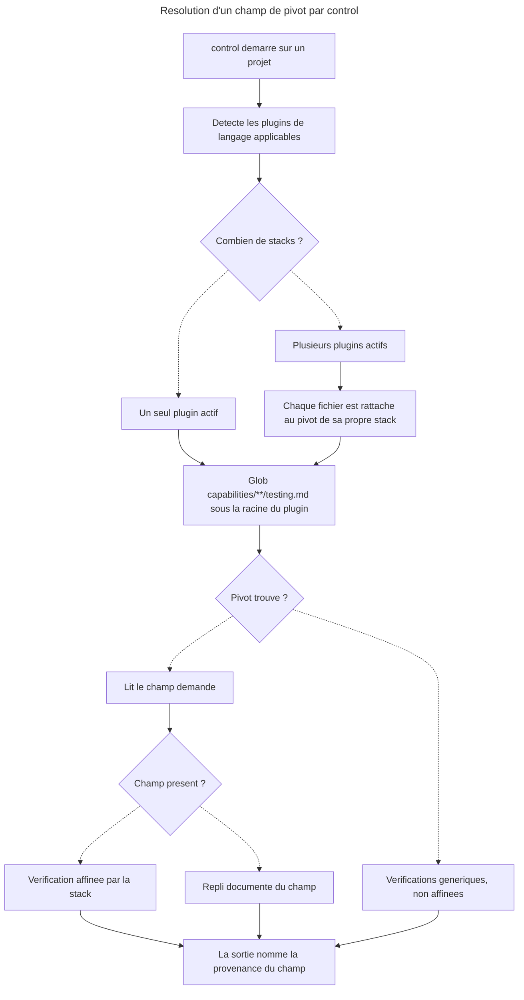

# Master — Pivots `testing` : fournisseurs manquants et regle polyglotte

## Overview

**Goal.** `overcode:control` consomme un pivot `testing` fourni par le plugin de langage actif. Le contrat existe, un seul plugin le remplit (`sc-js`), un champ du contrat n'est fourni par personne (*Domain resolution*), et la regle de selection ne dit rien d'un projet a plusieurs stacks. Ce plan ferme les trois.

**Risk Score.** 3 — 5 modules ou plus touches (+3). Pas de migration, pas de refactoring majeur, pas de montee de dependance. Le renommage de champ public a deja ete paye en 4.0.0 ; ce plan n'en introduit pas d'autre (voir *Arbitrage A2*).

**Branch.** `main` (depot de skills, pas de code applicatif).

**Demande source.** GitHub issue #10 — *Pivots testing : rebranchement fait, trois defauts nouveaux, cinq pivots manquants* (depot `RebelliousSmile/my-claude-marketplace`). L'issue #11 porte le declenchement et la quittance des pivots ; ce plan ne traite que ce qu'un pivot `testing` **contient** et **qui le fournit**.

**Perimetre.**
- `plugins/overcode` — regle de detection polyglotte : `docs/control.md`, `skills/control/references/pivot-contract.md`, ADR
- `plugins/sc-js` — ajout de *Domain resolution*, rectification du CHANGELOG 0.14.0
- `plugins/sc-python`, `plugins/sc-rust`, `plugins/sc-php`, `plugins/sc-css` — ecriture du pivot
- `plugins/*/skills/control/evals/*` — reprise des causes de N/A rendues fausses
- `.claude-plugin/marketplace.json` + CHANGELOG de chaque plugin touche

**Hors perimetre.**
- **`sc-godot`** — son repertoire `skills/` est **vide** : aucun squelette `sniff`, aucun arbre `capabilities/`. Ecrire un pivot y suppose de creer d'abord une skill entiere, disproportionne face a un fichier de 120 lignes. Le plugin reste en 0.1.0 sans pivot ; l'absence est deja un cas nomme par le contrat (*Absence*).
- **Declenchement, provenance et quittance des pivots** — issue #11.
- **Faux installeurs** (`sc-css` declare 6 pivots pour 0 fichier, `web-tiers` 4 pour 1) — issue #11, sauf le sous-ensemble strictement necessaire a la part 5.
- **Suite `control` exercant un vrai pivot sur une fixture JS** — appelle une troisieme fixture, donc une decision de harnais. A rouvrir separement.

**Ne rien committer ni pousser.** Les bumps de version sont **decrits** par chaque part ; l'utilisateur declenche les commits. Rappel DEC-004/`plugins-marketplace.md` : la marketplace est `source: directory`, un install capture le disque — bump et contenu doivent atterrir dans **le meme commit**, et aucun install ne tourne sur un arbre sale.

## Etat de depart mesure

| Fait | Mesure |
|---|---|
| Pivots `testing` sur disque | **1** — `find plugins -name testing.md` ne rend que `plugins/sc-js/skills/sniff/references/capabilities/tools/testing.md` |
| Champs du contrat | 9, dont 6 optionnels |
| Champs fournis par `sc-js` | 9 sections, **aucune** n'est *Domain resolution* |
| Consommateurs de *Domain resolution* | 4 actions `overcode:control` (`01-write`, `02-audit`, `04-strengthen`, `05-stats`) + `SKILL.md`, `phase-framework.md` |
| Arbre `capabilities/` par plugin | sc-js 12 dossiers / 34 fichiers · sc-python 5 / 12 · sc-php 5 / 10 · sc-rust 3 / 7 · **sc-css 0** · **sc-godot `skills/` vide** |
| Lignes d'eval bloquees faute de pivot Python | 3 — `authority-scenarios` S6, `matrix-scenarios` M15, `domains-scenarios` S3 |
| Regle polyglotte | `pivot-contract.md:7` dit *« whichever language plugin is already installed and applicable »*, au **singulier** |
| Fixture `app` | Python/Django, 80 fichiers de test, **et** un `frontend/package.json` → `sc-js` detectable, `sc-python` sans pivot |

## Deux constats qui contredisent l'issue

1. **L'item 1 de l'issue (« reborner *Anchor boundary* dans `sc-js` ») est deja fait a HEAD.** `rg '`contract`|`e2e`|`unit`'` sur le pivot ne rend rien ; la section dit *« Ne nomme aucun tier, et n'en derive aucun »*. Le rebornage est entre avec `628e067`. L'issue et `evals/authority-scenarios.md` finding 5 citent des numeros de ligne (:90, :92, :98, :103) qui correspondent a l'etat **anterieur** a ce commit — ils ont ete ecrits contre le cache installe, pas contre la source. → **A retirer de l'issue.**
2. **`plugins/sc-js/CHANGELOG.md:9` est faux** : il ecrit du renommage *« Le contenu est conserve tel quel »* alors que le meme commit a retire les attributions de tier. DEC-007 §3 porte la meme phrase. → rectifie en part 2.

## Child Plans

| # | Part | Fichier | Depend de |
|---|---|---|---|
| 1 | Regle de detection polyglotte | `2026_07_30-10-pivots-testing-fournisseurs-part-1.md` | arbitrage A1 |
| 2 | *Domain resolution* dans `sc-js` + rectif CHANGELOG | `...-part-2.md` | — |
| 3 | Pivot `sc-python` + deblocage des 3 lignes d'eval | `...-part-3.md` | 1, 2 |
| 4 | Pivot `sc-rust` — mise a l'epreuve du contrat | `...-part-4.md` | 2 |
| 5 | Pivots `sc-php` et `sc-css` + cloture manifeste | `...-part-5.md` | 2, 4 |

## Pourquoi cet ordre

- **1 avant 3** : la fixture `app` est justement le cas polyglotte (Python + `frontend/package.json`). Ecrire le pivot Python sans la regle, c'est produire un projet ou deux pivots sont detectables sans savoir lequel repond.
- **2 avant tout pivot** : *Domain resolution* n'a aujourd'hui **aucun exemple**. Le rediger d'abord sur le seul pivot mur donne la forme que les quatre suivants copient, plutot que quatre interpretations paralleles.
- **3 avant 4** : `sc-python` debloque trois lignes d'eval et se verifie contre une fixture reelle presente sur le poste ; c'est le pivot a plus fort rendement et a plus faible incertitude.
- **4 avant 5** : `sc-rust` est le seul qui met le contrat en defaut sur trois hypotheses (tests `#[cfg(test)]` dans le fichier source → *Test file glob* ne les voit pas ; couverture par outil tiers `tarpaulin`/`llvm-cov` ; *Anchor boundary* sans runtime navigateur). Si le contrat doit etre amende, il vaut mieux que ce soit avant d'ecrire les deux derniers pivots que apres.

## User Journey

## Regles applicables

| Regle | Portee | Source |
|---|---|---|
| `.claude/rules/` du depot | **aucune** — le depot ne contient que `.claude/settings.local.json`, pas de `CLAUDE.md` racine | verifie |
| Travailler dans la source, jamais dans le cache | tout | `~/.claude/rules/plugins-marketplace.md` |
| Bump et contenu dans le meme commit ; pas d'install sur arbre sale | parts 1-5 | idem |
| Ne pas committer ni pousser sans demande | tout | `Documents/CLAUDE.md` |
| Le pivot ne nomme jamais son consommateur | parts 2-5 | `pivot-contract.md` § *No field names its consumer* |
| Un champ introuvable est **absent**, jamais infere | parts 2-5 | `pivot-contract.md:44` |
| Un pivot est ecrit dans la langue de son propre plugin | parts 2-5 | `pivot-contract.md` § *Language* |
| `docs/control.md` fait foi ; page = regle + motif, skill = regle + procedure, ADR = rationnel | part 1 | DEC-006 |
| L'instrument qui mesure ne peut pas trancher | parts 2-5 | DEC-007 §2 |
| Conventions de redaction de pivot (detection framework + wrapper, DRY inter-pivots, frontmatter `paths:` minimal) | parts 2-5 | DEC-001 |
| Le contrat de pivot est une **interface publique** | part 1, part 4 | DEC-004 §5 |

## Registre de risques

| Risque | Probabilite | Impact | Mitigation |
|---|---|---|---|
| Pivots `sc-rust`, `sc-php`, `sc-css` ecrits sans projet reel de la stack sous la main → commandes non verifiees | **haute** | fort — un pivot faux est pire qu'absent, le contrat prevoit l'absence mais pas le mensonge | Arbitrage A3. A defaut de fixture : marquer explicitement chaque champ non verifie, ou ne livrer que les champs verifiables |
| La regle polyglotte change une interface publique → bump majeur `overcode` | moyenne | moyen | Arbitrage A2 tranche avant l'ecriture |
| `sc-rust` refute une hypothese du contrat → amendement retroactif des pivots deja ecrits | moyenne | moyen | Part 4 placee avant les deux derniers pivots ; part 5 relit le contrat amende |
| Le rejeu `behave` est juge a chaud (registre dans le fichier de suite) | **certaine** en l'etat | moyen | Defaut de harnais connu et ouvert (memoire `behave-eval-method`) ; le noter dans le rapport de run, ne pas le corriger ici |
| Un « 0 FAIL » masque des PASS→N/A | haute | moyen | Rapporter le Δ a trois colonnes, jamais le seul tally |
| Editer un pivot pendant qu'un run d'eval est en vol | moyenne | fort | Correctifs uniquement apres retour de tous les verdicts |
| `sc-css` n'a pas de notion de « test » comparable → pivot force et creux | moyenne | moyen | Part 5 autorise a conclure « pas de pivot legitime » plutot qu'a en fabriquer un |

## Arbitrages — etat au 2026-07-30

> **A1 tranche : option B, « le pivot suit le fichier ».** Livree — DEC-008, `pivot-contract.md`, `docs/control.md` et les six actions consommatrices. Part 1 close.
> **A2 tranche : additif, `overcode` 4.0.0 → 4.1.0** — aucun champ renomme ni retire, aucun pivot livre a modifier.
> **A3 tranche pour `sc-rust` : `winfxstart/_code` est le terrain.** Rust pur, desktop Windows/XAML, 17 fichiers `.rs` dont 10 portent `#[cfg(test)]`, aucun repertoire `tests/`, aucune `[dev-dependencies]` — il exerce les trois hypotheses que la part 4 dit mettre a l'epreuve, sans navigateur. `sc-php` a `scriptami/_code/wp-2026`. **`sc-css` reste sans terrain** : c'est le seul reste ouvert de A3.
> **A4 refute, pas tranche** — le defaut decrit n'existe pas. Verifie sur disque : `02-audit.md:37-39` **nomme** le glob `**/*.{test,spec}.*` comme *« the defect this states in place of »* et impose un repli sur la convention observee du projet ; `:26` porte le slot `unmatched`, pas un glob ; `05-stats.md:108` rend `enumerated: pivot test file glob | project convention <pattern>, approximate`. Le constat de `authority-scenarios.md:233` (finding 1) qui le portait est **perime** — ecrit avant le correctif, jamais reouvert depuis.

### Trace des options ecartees

**A1 — Quelle regle pour un projet polyglotte ?**
- *Option A* : une stack dominante, elue au manifeste racine. Simple, mais elit `sc-js` sur la fixture `app` (Django avec un `frontend/`), c'est-a-dire le mauvais.
- *Option B (recommandee)* : **le pivot suit le fichier**. Chaque plugin applicable contribue le sien ; un champ est resolu contre le pivot de la stack a laquelle le fichier juge appartient ; les champs agreges (*Test-count*) sont rendus par stack, jamais sommes en un chiffre unique ; l'absence chez une stack ne degrade que cette stack. Coherent avec DEC-007 §2 (l'instrument rapporte, il ne tranche pas).
- *Option C* : demander a l'utilisateur au premier run. Repousse la regle dans l'execution.

**A2 — L'option B est-elle une rupture d'interface publique ?** Elle ne renomme ni ne retire aucun champ ; elle rend plurielle une resolution qui etait singuliere. Lecture proposee : **additif → `overcode` 4.0.0 → 4.1.0**. Si l'utilisateur la lit comme rupture : 5.0.0.

**A3 — Ecrit-on un pivot sans fixture de la stack ?** `sc-python` a une fixture (`app`). `sc-rust`, `sc-php`, `sc-css` n'en ont pas d'identifiee — un projet WordPress reel existe sur le poste et pourrait servir a `sc-php`. Trancher : (i) ne livrer que les pivots verifiables, (ii) livrer avec les champs non verifies marques comme tels, (iii) fournir des fixtures.

**A4 — Inclut-on le defaut adjacent, non liste par l'issue ?** `02-audit.md:26` porte un glob de repli generique `**/*.{test,spec}.*` de forme JS, qui ne matche **aucun** des 80 `test_*.py` de la fixture `app` ; `05-stats` ne nomme aucun glob cote test ni repli. Ecrire le pivot Python **masque la consequence sur les fixtures sans corriger le repli sans pivot**. A inclure ici (part 3) ou a ouvrir en issue distincte.

## Estimation

Unite couteuse : le pivot redige-et-verifie (~120 lignes, 9 champs, chaque commande passee sur un projet reel) et le jugement d'eval.

| Part | Unites | Fourchette |
|---|---|---|
| 1 | 3 documents normatifs (page, contrat, ADR) | 45 min - 1 h 15 |
| 2 | 1 section + 1 rectif | 20 - 40 min |
| 3 | 1 pivot verifie + 3 causes de N/A + rejeu de 3 suites (~50 lignes, ~80 jugements) | 2 h 30 - 4 h |
| 4 | 1 pivot + mise a l'epreuve de 3 hypotheses (+ amendement eventuel) | 1 h 30 - 3 h |
| 5 | 2 pivots + creation de l'arbre `sc-css` + manifeste | 2 h - 3 h 30 |
| **Total** | | **7 h - 12 h 30** |

Calage du jugement d'eval : datapoint enregistre ~260 inferences ≈ 3-4 h → ~80 jugements ≈ 1 h - 1 h 15. La fourchette haute suppose A3=(iii) fixtures a fournir et une refutation en part 4.

## Confiance

**9/10.**

✓ Etat de depart mesure sur disque, pas deduit : comptage des pivots, des champs, des consommateurs, des arbres `capabilities/`.
✓ Deux affirmations de l'issue verifiees fausses avant de planifier dessus.
✓ Le contrat de pivot est lu integralement ; les 9 champs et leurs replis sont connus.
✓ L'ordre des parts est justifie par des dependances reelles, pas par confort.
✓ Les regles applicables sont sourcees (DEC-001/004/006/007 + regles globales).

✗ A3 non tranche : trois des cinq pivots n'ont pas de terrain identifie, et un pivot non verifie est un risque de fond, pas un detail d'estimation. C'est le seul point qui empeche 10/10.

## Validation

- [ ] Projection d'architecture validee
- [ ] Arbitrages A1-A4 tranches
- [ ] Ordre des parts valide
- [ ] Estimation acceptee

## Log

| Date | Evenement |
|---|---|
| 2026-07-30 | Plan cree (iteration 0), statut `propose`, en attente des arbitrages A1-A4 |
| 2026-07-30 | A1 (option B) et A3 (`winfxstart` = terrain `sc-rust`) tranches par l'utilisateur. A2 retenu additif. **A4 refute sur disque** — le defaut n'existe pas, le constat d'eval qui le portait est perime |
| 2026-07-30 | **Part 1 livree** : DEC-008, `pivot-contract.md` (detection = ensemble + *The pivot follows the file*), `docs/control.md`, six actions alignees, `02-audit` traite l'enumeration partielle, `05-stats` rend par stack. `overcode` 4.1.0, marketplace 3.7.0. `pnpm test` vert (11 plugins, 0 probleme) |
| 2026-07-30 | **Moitie de la part 2 livree** : rectification de *« contenu conserve tel quel »* dans DEC-007 §3, `sc-js/CHANGELOG` (0.14.1), `overcode/CHANGELOG`, `CHANGELOG` racine. Reste : *Domain resolution* dans `sc-js` |
| 2026-07-30 | **Part 2 close** : `## Domain resolution` ajoutee au pivot `sc-js` (trois voies — repertoires, identifiants, prudences ; la decoupe par couche ne porte pas le domaine ; aucune liste de domaines). `sc-js` 0.15.0 dans `plugin.json` + `marketplace.json`, `CHANGELOG` sc-js et racine, `README` aligne. **Ecart rattrape au passage** : `marketplace.json` portait encore `3.6.0` alors que le `CHANGELOG` racine publiait `3.7.0` — bump de la part 1 oublie dans le manifeste. `pnpm test` vert (71 skills, 0 probleme, selftest 4/4). Frontmatter passe a `statut: livre` — les parts 1, 3, 4, 5 se declarent encore `propose`, part 1 comprise alors qu'elle est livree |
| 2026-07-30 | **Ordre revise** : le parc de fixtures s'est elargi a 11 depots (issue #10 §3.0 / #11 §6). `sc-python` n'est plus ce qui debloque `authority` S6, `matrix` M15 et `domains` S3 — une fixture JS (`choix-narratifs/_code`) le fait sans ecrire de pivot. Les parts 3 et 4 sont a re-prioriser en consequence |
| 2026-07-30 | **Part 3 livree** : pivot `testing` de `sc-python` (181 l., 10 champs, commandes et chiffres releves sur un projet Django reel — 80 fichiers, 1028 tests). `sc-python` 0.6.0, marketplace 3.8.0, `README` + les deux `CHANGELOG`. `pivot-contract.md:3` corrige — il nommait *« le seul pivot livre »*, faux le jour meme. Trois lignes reecrites et rejouees sur `app` : `matrix` 17/18 -> **18/18** (premier run sans N/A), `authority` 12/17 -> **13/17** (N/A 4 -> 3), `domains` **14/17 inchange**, S3 N/A sur la moitie declaration seule. **La revision d'ordre de la ligne precedente est infirmee par la mesure** : la fixture JS n'a pas debloque S6 — sa variante `choix-narratifs` reste N/A faute de *Coverage command*, et c'est `sc-python` + un projet Django qui leve les trois. Au passage, une attribution de cause fausse corrigee au dossier (le N/A de S6 tenait a la *Coverage command*, pas aux donnees de branches). Jugement **a chaud**, divulgue dans les trois entrees : `behave/02-run` prescrit des sous-agents juges, la contrainte de session les interdit |
| 2026-07-30 | **Part 4 livree** : pivot `testing` de `sc-rust`, mesure sur `winfxstart` (crate binaire Win32, 17 fichiers, 122 tests, READ-ONLY, arbre propre avant/apres, `CARGO_TARGET_DIR` hors depot). Les trois hypotheses tranchees avec leur motif : **H1** (*Test file glob*) et **H2** (*Coverage command*) → pivot + amendement ; **H3** (*Anchor boundary*) → **hypothese du plan infirmee**, le contrat traite deja le cas (`decision-matrix.md:66` : *Anchored does not mean "in a browser."*), consignee a l'ADR plutot que passee sous silence. **DEC-009** rend explicites deux suppositions tacites : source et test non garanties disjointes (mesure : 122 tests sur 12 des 17 fichiers source, zero fichier de test — un glob a la JS rendrait ici 0 test et 17 fichiers non couverts), et un prerequis constate absent vaut champ absent pour ce run (les trois outils de couverture Rust absents de la machine). Consommateurs alignes : `04-strengthen:63` n'execute plus la passe statique la ou elle ne discrimine pas, `05-stats` gagne la variante `density` du prerequis absent. **Retroactivite payee dans le meme lot** : `sc-js` 0.15.1 et `sc-python` 0.6.1 pour la clause de prerequis ; la clause de non-disjonction n'est due que si la disjonction ne tient pas, donc sans effet sur eux. `sc-rust` 0.5.0, `overcode` 4.2.0, marketplace 3.9.0, les cinq CHANGELOG et le `README` de `sc-rust`. Non commite |
| 2026-07-30 | **Part 5 livree — le chantier des pivots est clos a 4, pas a 6**. Pivot `testing` de `sc-php` livre, mesure sur **trois** terrains parce que la stack couvre deux mondes disjoints (PrestaShop modulaire / WordPress) : le terrain prevu par ce master (`wp-2026`) s'est revele sans aucune infrastructure de test PHP, remplace par `kelenaya/_code/modules` (PHPUnit 10.5.63, deux suites executees — 46 et 29 tests) et `mauceri/_code`. Fait neuf qu'aucun pivot precedent ne portait : **la stack n'a pas de point d'entree unique**, la mesure est par composant — neuf modules, neuf depots, aucune commande racine, une mesure lancee a la racine rend *zero test* sur un projet qui en porte 225. Deux mesures qui contredisent le conseil courant : la couverture sans driver avertit puis **sort 0 sans ecrire de fichier** (cas d'application direct de DEC-009, ou Rust echouait franchement), et `phpdbg -qrr` ne fournit plus de couverture en PHPUnit 10. **`sc-css` : pas de pivot**, sortie explicitement autorisee par la part 5 et prise apres decompte — 5 depots, 74 fichiers `.css`, **zero outil de test CSS** ; **1 champ sur 10 recoit une reponse reelle, 0 sur les 5 requis** ; les deux qui semblaient repondre (*Risk signals*, *Domain resolution*) sont **deja fournis par `sc-css` ailleurs et plus finement**. Argument dur : par la regle d'union de DEC-008, un *Source glob* CSS ferait entrer 62 fichiers dans l'univers source d'un run dont la population de tests contribuee est vide par construction — le run rendrait « 0 test / 62 fichiers », un zero qui n'est le defaut de personne, la ou le § *Absence* du contrat dit deja le vrai. `sc-css` reste **0.3.3**, arbre non cree. **`version.txt` supprime** et non aligne : aucun fichier du depot ne le lit, il avait diverge de six mineures. Relecture croisee : une divergence d'ordre de sections trouvee dans `sc-php` et corrigee — les 4 pivots sont strictement homogenes. Absences restantes motivees : `sc-css` par decompte, `sc-godot` squelette sans terrain mesurable. `sc-php` 0.10.0, marketplace 3.10.0, les deux CHANGELOG. `pnpm test` vert (71 skills, 0 probleme, selftest 4/4). Issue #10 commentee. Non commite |
