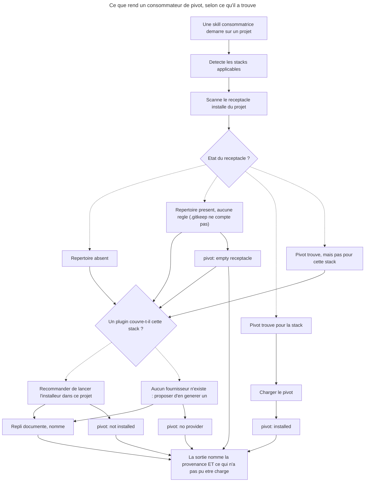

# Master — Declenchement des pivots : amorcage, provenance et quittance

## Overview

**Goal.** Trois familles de skills consomment des pivots. Aucune des trois ne rend lisible, en sortie, la difference entre *« aucun pivot n'existe pour cette stack »* et *« un pivot existe dans le plugin, personne ne l'a installe ici »*. Deux installeurs annoncent l'ecriture de fichiers absents du disque. Ce plan ferme les deux.

**Risk Score.** 3 — 5 modules ou plus touches (+3) : **les huit plugins que A4 bumpe** — `overcode`, `design`, `sc-tiers`, `sc-css`, les trois installeurs a sortie figee (`sc-python`, `sc-php`, `sc-rust`) et **`sc-js`** (un chemin declare non resolu, `skills/sniff/actions/03-clean.md`, cf. *Perimetre*) — plus l'outillage `tools/eval` et le hors-plugin. `sc-js` manquait a cette enumeration (correction d'iteration 21) : le score ne bouge pas, mais une enumeration en prose divergeant de la table gardee est exactement le defaut que ce plan corrige ailleurs. Pas de migration, pas de refactoring majeur, pas de montee de dependance. L'ajout d'une obligation de sortie est additif (voir *Arbitrage A4*).

**Branch.** `main` (depot de skills, pas de code applicatif).

**Demande source.** GitHub issue #11 — *Declenchement des pivots : la chaine `*-optimize` n'est jamais amorcee, et deux installeurs declarent du vide* (`RebelliousSmile/my-claude-marketplace`). L'issue #10 (livree) traite ce qu'un pivot `testing` **contient** et **qui le fournit** ; celle-ci traite **quand il se charge** et **ce que la sortie en dit**.

**Perimetre.**
- `plugins/overcode/skills/{web,data,ap,seo}-optimize` — regle de tete, echelle de repli, ligne de provenance, remede du garde-fou terminal, **et retrait des enumerations de fournisseurs fausses** (`web:28`/`:41` citent `sc-tiers` pour `perf-pivots-*` : 0 fichier ; `ap:28` cite `sc-php`/`sc-js`/`sc-rust` pour `ap-pivots-*` : 0 fichier ; `web:151`/`data:157` nomment la skill `setup`, vraie pour 1 plugin sur 5)
- `plugins/overcode/docs/concepts.md` — la regle transversale de quittance
- `plugins/design` — `references/sc-pivot-contract.md` (motif de l'asymetrie regles/artefact), `skills/enforce/actions/04-pivot.md` (troisieme variante d'`UNREALIZED` manquante), derive de chemin
- `plugins/sc-tiers/skills/setup/actions/01-install.md`, `plugins/sc-css/skills/sniff/actions/02-install-pivots.md` — installeurs fantomes ; pour `sc-css`, le retrait de l'action entraine **trois autres fichiers** (complete a l'iteration 42, sur le modele de la ligne `sc-python` ci-dessous) : `skills/sniff/SKILL.md` (quatre sites), `skills/sniff/actions/01-scan.md` (la chaine automatique dont l'action retiree etait l'unique lecteur) et `README.md` (`:3`, `:5`, qui decrivent la capacite supprimee). Detail en part 4, *Files to modify*
- `plugins/sc-{python,php,rust}/skills/sniff/actions/02-install-pivots.md` — sorties figees ; pour `sc-python` s'y ajoutent `skills/sniff/SKILL.md` et, selon l'issue retenue, `skills/sniff/actions/01-scan.md` — le plugin declare **deux** sources concurrentes pour la cible `ap-pivots-django-activitypub.md`, et le remede touche trois sites (part 4, phase 3, tache 3)
- `plugins/sc-js/skills/sniff/actions/03-clean.md` — un chemin declare non resolu
- `tools/eval/consistency.mjs` — gardes declare-vs-disque M4 et M5 (**M5 ⊆ M4** : jointure *Target* + plugin, source resolvant sur disque — definition stable avant comme apres l'assainissement de la part 4) · `plugins/overcode/references/pivot-providers.md` — table `<stack> -> <plugin>, <commande>`, ecrite d'emblee dans son etat d'arrivee · `CONTRIBUTING.md:24`/`:106` — affirmation fausse a corriger
- Deux suites `behave` neuves + `aidd_docs/internal/decisions/010-*.md`
- `.claude-plugin/marketplace.json` + `CHANGELOG` de chaque plugin touche

**Hors perimetre.**
- **Contenu des pivots `testing` et leurs fournisseurs** — issue #10, close a quatre fournisseurs.
- **Ecrire les six pivots `sc-css` declares par son installeur** — ce serait un chantier de redaction, pas un assainissement. L'*Arbitrage A1* tranche entre livrer et retirer ; le plan par defaut retire.
- **Creer un plugin `sc-seo-*`** — voir *Arbitrage A5*.
- **Implementer `sc-python:design-bridge` / `sc-rust:design-bridge`** — declares absents, honnetement, aux deux endroits qui les nomment. Rien a corriger.
- **Sortir le registre de run hors du fichier de suite** — defaut de harnais connu et ouvert (`aidd_docs/memory/behave-eval-method.md`), a divulguer dans chaque rapport de run, pas a corriger ici.

**Ne rien committer ni pousser.** Les bumps sont **decrits** par chaque part ; l'utilisateur declenche les commits. Rappel `plugins-marketplace.md` : la marketplace est `source: directory`, un install capture le disque — bump et contenu atterrissent dans **le meme commit**, et aucun install ne tourne sur un arbre sale.

## Etat de depart mesure

Releve sur la source a HEAD `2c96f2f`. Chaque ligne est verifiee, pas reprise de l'issue.

| Fait | Mesure |
|---|---|
| Skills qui scannent `.claude/rules/07-quality/` | 4 — `web:151`, `data:157`, `ap:111`, `seo:137` |
| Skills qui **ecrivent** dans ce repertoire | 6 installeurs — 5 `sniff/02-install-pivots.md` + `sc-tiers/setup/01-install.md` |
| Skills qui **disent de lancer** un installeur | **0**. Le seul voisin est `ap-optimize:220`, une ligne passive de table *Resources* |
| Occurrences de `provenance` / `stack-agnostic` / « name the source » dans les 4 skills | **0** (grep sur tous leurs fichiers) |
| La promesse est deja ecrite ailleurs | `overcode/README.md:7` et `docs/concepts.md:25` — *« Aucun pivot trouve -> un schema generique s'applique, **et l'absence est enoncee** »*. **La doc est en avance sur les skills** |
| Modele de ligne de provenance a imiter | `control/actions/05-stats.md:87` — `mechanics : <language plugin> testing pivot \| none (stack-agnostic run)` |
| Actions `control` qui lisent le pivot | **6**, pas 5 : `01-write:32`, `02-audit:37`, `03-configure:25`, `04-strengthen:44`, `05-stats:161`, `06-align:116` |
| Installeurs — declares vs presents | `sc-js` 13/13 · `sc-python` 9/9 · `sc-php` 6/6 · `sc-rust` 4/4 · **`sc-tiers` 9/12** · **`sc-css` 0/6** |
| Installeurs a sortie **figee** (compte ou liste nominative ecrits en dur) | **4** — `sc-tiers` (« 12 files written »), `sc-python`, `sc-php`, `sc-rust`. Seul `sc-js` derive la sienne (`02-install-pivots.md:46`) |
| Trois `UNREALIZED` distincts du runner design | `design/tools/run-gates.py:272` / `:275` / `:278` — confirme |
| Lignes de sortie du gate design, **tous verdicts** | **5**, pas 4 (mesure d'iteration 2) : les 3 `UNREALIZED` ci-dessus, plus `REALIZED … by <realizer>` (`:269`) et sa variante `stale` `REALIZED … - the contract declares no realizer for it` (`:268-269`). **Deux manquent aux deux tables** : `:275` et la variante `stale` |
| Sites normatifs portant la table des verdicts du gate | **2**, pas 1 — `enforce/04-pivot.md:45-50` **et** `references/sc-pivot-contract.md:114-119`, amputes des memes deux lignes. Le gate emet **sept** chaines distinctes (six cas, `VIOLATION` se dedoublant selon son prefixe : chemin de fichier en `run-gates.py:193`, realiseur en `:251`) : au-dela des deux absences, `04-pivot.md` en ecrit **trois sur quatre** de travers et le contrat glose sur `VIOLATION` au lieu de la citer (mesure d'iteration 24). (Le `CHANGELOG.md:192-193` de `design` porte la meme table : historique, ne pas le reecrire) |
| `pivotReports` sous `skills/diffuse/` | **0 occurrence** — confirme |
| Le contrat design distingue-t-il regles et artefact ? | **Oui, deja** — deux specs, deux contrats de retour, et la ligne *rapport* de la colonne rendu vaut `—` (`sc-pivot-contract.md:129-134`) |
| ADR libre suivant | **DEC-010** (`aidd_docs/internal/decisions/`, pas d'index a mettre a jour) |
| `.claude/rules` ou `CLAUDE.md` a la racine du depot | **aucun** — seul `.claude/settings.local.json`. Les conventions sont dans `CONTRIBUTING.md` |

## Cinq constats qui corrigent l'issue

L'issue est juste sur le fond ; cinq de ses affirmations ne resistent pas au disque.

1. **`seo-optimize` n'a pas la forme des trois autres, donc les items 1 et 3 ne s'y appliquent pas verbatim.** Son garde-fou terminal (`:139`/`:141`) est un **oui/non binaire** — il ne propose *aucune* option « install a `sc-*` plugin », donc il n'y a pas de remede a corriger. Il n'a **pas d'etage template**, et **pas de regle « propose generating one »** en tete. Sa ligne de tete (`:30`) place le fichier interne en tete **typographiquement** — mais l'ordre de **precedence** qu'elle enonce n'est pas inverse : `:30` dit *« it takes precedence »* du pivot externe, et `:137` dit *« Check installed plugin pivots first »*. Les deux vont dans le meme sens que les trois autres skills. Ce qui manque a `seo`, ce n'est pas la precedence — c'est la **quittance** : rien n'ordonne de dire lequel des deux a servi. La skill la moins malade recoit donc le traitement le plus specifique.
2. **`ap-optimize` n'est pas exempt des deux marches intermediaires.** L'issue ne les impute qu'a `web` et `data` ; `ap:28` porte le meme repli de tete (vers `references/ap-protocol-specs.md`) et `ap:113` le meme etage template. Les trois marches sont a corriger sur trois skills, pas deux.
3. **La regle a generaliser n'est pas absente de `web` et `data` — elle y est fausse d'un mot.** `web:30` et `data:33` portent la meme phrase qu'`ap:30` avec **`template`** la ou `ap` dit **`pivot`**. Le travail est un reborage, pas une ecriture. `seo` est la seule a n'en avoir aucune.
4. **La classe « sortie figee » compte quatre installeurs, pas un.** `sc-python:49-64`, `sc-php:39-56` et `sc-rust:37-50` figent eux aussi une liste nominative avec des verdicts pre-decides — `sc-php:40` imprime un en-tete « pivots installed » inconditionnel, et le bloc de `sc-rust` **oublie `rusqlite`**, pourtant declare `:21`. Leurs sources existent toutes, donc ils ne mentent pas sur l'existence ; ils mentent sur ce qui **vient d'etre ecrit**. Un seul installeur derive sa sortie : `sc-js`, dont la ligne `:46` — *« Pick the header by what actually happened — never claim "installed" when nothing was written »* — est la formulation a generaliser.
5. **L'item 6 est deja tranche par ecrit, il lui manque son motif.** `sc-pivot-contract.md:129-134` porte deja deux contrats de retour distincts, et la ligne *rapport* de la colonne rendu vaut explicitement `—`. L'asymetrie `enforce`/`diffuse` n'est donc pas *« un etat de fait, pas une position »* : la position est ecrite, c'est le **rationnel** qui manque. L'item retrecit d'une decision a une redaction — et gagne au passage deux defauts reels trouves a cote : `enforce/04-pivot.md:45-50` ne documente que **deux** des trois lignes `UNREALIZED` du runner, et `sc-pivot-contract.md:71` pointe `diffuse/04-pivot.md` la ou le fichier est `skills/diffuse/actions/03-pivot.md` — **un des quatre chemins qui ne resolvent pas** (recensement d'iteration 20 : `:17`, `:71`, et deux fois en `:142` ; trois formes concurrentes coexistent dans le fichier, pour un seul temoin correct). Le compte est ici, la table de recensement et la forme tranchee sont en part 2.

Trois constats de plus, hors des affirmations de l'issue :

- **La fixture `wp-2026` ne peut pas repondre aux questions du §3 telles qu'elles sont posees.** Elle porte bien `design/lint/lint-core.mjs`, mais **aucun `gates.config.json`** — donc `run-gates.py` n'y tourne jamais, `pivotReports` n'a nulle part ou vivre, et son seul script design est `lint:design` qui appelle le linter directement. Elle ne declare **aucune** regle `stored-content` (6 regles : 4 `stylesheet`, 1 `markup`, 1 `unrealized`). Elle reste utile — comme temoin d'un depot **arrete avant le gate**, ce qui est un etat plus frequent que celui que l'issue supposait — mais la question *« le gate y trouve-t-il un `pivotReports` ? »* a une reponse triviale : le gate n'y tourne pas.
- **Le parc de fixtures est sous `C:\Users\fxgui\Documents\Perso\Projects\`, pas sous `Documents\LLM\`** — pour les onze depots, pas seulement `scriptami`. Et `email-to-markdown/_code/site`, cite par l'issue comme *« repertoire versionne et vide »*, est bien vide (`.gitkeep` seul) mais **gitignore** (`.claude/*`), donc non versionne. L'etat decisif tient ; sa qualification ne tient pas.
- **`CONTRIBUTING.md` se trompe sur son propre outillage : `tools/eval/` est versionne.** `CONTRIBUTING.md:24` et `:106` affirment que les tests sont *« hors depot (gitignores) — outillage local, non versionne par choix »*. `git ls-files tools/eval/` renvoie **79 fichiers**, et `.gitignore` ne contient que `__pycache__/`. La consequence est directe : **l'arbitrage A2 s'effondre** en grande partie — le garde de non-recidive pose dans `consistency.mjs` voyage avec le depot, sans avoir a revenir sur quoi que ce soit. Ne subsiste que le choix « build seulement » vs « build + execution », qui est additif. La ligne de `CONTRIBUTING.md` est a corriger en part 4.

## Child Plans

| # | Part | Fichier | Depend de |
|---|---|---|---|
| 1 | Suites `behave` du declenchement — volet « avant » | `2026_07_31-11-declenchement-pivots-quittance-part-1.md` | A3 |
| 2 | DEC-010 : la quittance comme regle transversale + alignements `design` | `...-part-2.md` | — |
| 3 | Le passage sur les quatre `*-optimize` | `...-part-3.md` | 1, 2, **A1**, A5 |
| 4 | Assainissement des installeurs + garde declare-vs-disque | `...-part-4.md` | 1, A1 |
| 5 | Rejeu `behave` « apres », bumps et cloture | `...-part-5.md` | 1, 2, 3, 4 |

## Pourquoi cet ordre

- **1 en premier, et seulement son volet « avant ».** Une suite qui ne rate pas aujourd'hui ne prouve rien demain. La regle *reproduce-then-confirm* de `behave` exige que chaque scenario **echoue sur le comportement actuel** avant correction ; ecrire les suites apres le correctif produirait des PASS sans valeur de preuve.
- **2 avant 3.** L'issue laisse le choix d'ecrire le DEC avant ou apres le passage sur les `*-optimize`. Ici, avant : la regle est **deja promise** par `README.md:7` et `docs/concepts.md:25` — le DEC ne l'invente pas, il l'etend a la distinction « inexistant » / « non installe » et l'etend aux quatre familles. Ecrire d'abord donne aux quatre skills une formulation unique a instancier plutot que quatre interpretations paralleles, exactement comme la part 2 de #10 avait servi de patron aux quatre pivots.
- **3 et 4 s'echangent, mais aucune n'est libre** (precision d'iteration 16 : « 4 est sans dependance de contenu » etait faux, et contredisait la table ci-dessus). Toutes deux dependent de la part 1 close — le run initial doit etre archive avant qu'on edite une cible jugee — et toutes deux **de A1**, qui fixe l'etat d'arrivee : 4 l'applique en retirant l'action `sc-css`, 3 le presuppose en derivant sa table sur cinq installeurs quand le disque en porte six. Ce qui les rend echangeables n'est donc pas une absence de dependance mais le fait qu'elles ne dependent pas **l'une de l'autre** : l'arbitrage suffit a 3, l'execution de 4 ne lui est pas necessaire. 3 est la plus longue et porte le defaut central ; 4 est courte, et sa garde M5 protege la table que **3** vient de creer — c'est ce qui rend l'ordre indifferent.
- **5 en dernier, et en un seul lot.** `behave-eval-method` interdit d'editer la cible pendant qu'un run est en vol : les rejeux ne partent qu'une fois **toutes** les corrections des parts 2-4 posees.

## Ou se pose le bump — un plugin, un bump, un commit

Tranché le 2026-07-31 (correction d'itération 3). Deux plugins sont touchés par **plusieurs** parts : `overcode` (1, 2, 3) et `sc-tiers` (1, 4). A4 ne prévoit qu'**un seul** bump par plugin, et la règle du dépôt exige que bump et changement de contenu atterrissent dans le **même** commit. Les deux ne tiennent ensemble que d'une façon :

- **Une part n'est pas une unité de commit.** Les parts 1 à 4 écrivent du contenu et **ne touchent aucun `plugin.json`, aucun `marketplace.json`, aucun CHANGELOG**. Elles *décrivent* le bump qu'elles impliquent ; elles ne le posent pas.
- **La part 5 est l'unique porteuse des bumps**, une fois toutes les corrections posées et les rejeux verts. Un plugin y monte d'un cran et d'un seul, au niveau fixé par A4, quel que soit le nombre de parts qui l'ont touché.
- **Le commit est par plugin, pas par part** : chaque commit porte l'ensemble du contenu d'un plugin plus son bump.
- **Les fichiers `evals/` créés en part 1 comptent comme contenu du plugin qui les héberge** — ils partent donc dans le commit de `overcode` et celui de `sc-tiers`, avec leur bump respectif. Ils n'en déclenchent aucun de plus : un fichier de suite n'est pas une interface publique au sens de DEC-004 §5.
- **Un neuvième commit porte le hors-plugin** (précision d'itération 21) : cinq artefacts du lot n'appartiennent à aucun plugin — `tools/eval/consistency.mjs` (M4/M5), `CONTRIBUTING.md:24`/`:106`, `aidd_docs/internal/decisions/010-*.md`, `CHANGELOG.md` racine, et la **version racine** `3.10.0 → 3.11.0` de `.claude-plugin/marketplace.json:4`. Sans lui, la découpe laisse dehors la garde qui protège tout le reste. Il vient en **dernier** : M4 et M5 ne doivent rougir sur aucun état intermédiaire.

**Ce que « arbre propre » ne peut pas vouloir dire ici** (correction d'itération 21). La formulation précédente exigeait « un dépôt à l'arbre propre entre deux commits ». Elle est **inatteignable dès le second plugin** : les huit bumps de A4 écrivent tous dans le **même** `.claude-plugin/marketplace.json`, qui reste donc modifié pour les sept autres plugins entre chaque commit — l'honorer imposerait un staging ligne à ligne. Elle sur-interprétait par ailleurs la règle source : `plugins-marketplace.md` interdit qu'un **install** tourne contre un arbre sale, pas qu'un arbre soit sale entre deux commits. La contrainte réelle, et la seule à tenir : **bump et contenu d'un plugin dans le même commit** (M1 est donc vert à chaque commit, `plugin.json` et sa ligne de `marketplace.json` bougeant ensemble), et **aucune installation tant que la série des neuf n'est pas close**.

Conséquence à répercuter : les lignes `plugin.json` / `marketplace.json` / CHANGELOG des sections *Files to modify* des parts 2, 3 et 4 sont **des renvois vers la part 5**, pas des éditions à faire sur place.

## User Journey

**Deux axes, pas un** (correction d'itération 21). La colonne `Dx*` porte le champ `pivot:` — le **diagnostic**, quatre alternants exclusifs de DEC-010 §1 ; la colonne `Prompt`/`NoProvider`/`Fallback` porte le **remède** et la source effectivement chargée. Les deux sont couramment vrais ensemble, et c'est `empty receptacle` qui le montre : réceptacle présent et vide **avec** un fournisseur disponible se diagnostique `empty receptacle` et se remédie comme `not installed` — même remède, diagnostic différent (`part-3:140`). Le diagramme ne rendait jusqu'ici que trois sorties, `Empty` ressortant par le même `Ask` qu'`Absent` et `Partial` : la correction d'itération 13 n'avait été appliquée qu'à l'entrée.

## Regles applicables

| Regle | Portee | Source |
|---|---|---|
| `.claude/rules/` du depot | **aucune** — verifie : seul `.claude/settings.local.json`, pas de `CLAUDE.md` racine | verifie |
| Travailler dans la source, jamais dans le cache | tout | `~/.claude/rules/plugins-marketplace.md` |
| Bump et contenu dans le meme commit ; pas d'install sur arbre sale | parts 2-5 | idem |
| Ne pas committer ni pousser sans demande | tout | `Documents/CLAUDE.md` |
| `plugin.json` fait foi ; `marketplace.json` doit porter version **et** description identiques | parts 2-5 | `CONTRIBUTING.md` + `consistency.mjs` M1 |
| `index.json` ne porte ni version ni description | parts 2-5 | `CONTRIBUTING.md:78` + `consistency.mjs` M3 |
| Un pivot est un fournisseur de savoir de stack, jamais un decideur | parts 2-4 | DEC-007 §2 |
| Le pivot suit le fichier ; l'absence se declare **par stack** | parts 2, 3 | DEC-008 |
| Un prerequis constate absent vaut champ absent pour ce run | parts 2, 3 | DEC-009 §2 |
| Le contrat de pivot est une **interface publique** — *par extension* : DEC-004 §5 nomme le contrat de **`control`**, pas `design/references/sc-pivot-contract.md`. L'extension au contrat de pivot suit l'usage deja fait par `DEC-008:9`, qui invoque §5 pour qualifier un changement hors `control`. Elle fonde le niveau **minor** de A4 sur `design` ; A4 est par ailleurs tranche par l'utilisateur, c'est le motif qui se precise ici, pas la decision. **Ne pas « corriger » la citation** : DEC-004 n'a pas de `### 5` — la declaration vit sous `## Consequences` (`:47`) — mais **deux** DEC ulterieurs l'appellent §5 (`007:61`, `008:9`), la forme suit donc l'usage du depot | parts 2, 3 | DEC-004 §5 |
| Page = regle + motif ; skill = regle + procedure ; ADR = rationnel | part 2 | DEC-006 |
| Une suite `behave` ne s'ecrit jamais pour passer : FAIL d'abord | parts 1, 5 | `behave/references/judgment-rules.md` |
| N/A n'est jamais gonfle en PASS ; le Δ se rend a trois colonnes | parts 1, 5 | `aidd_docs/memory/behave-eval-method.md` |
| Ne pas editer la cible pendant qu'un run est en vol | part 5 | idem |
| Redaction de skill : exhaustif, agnostique, le moins de mots possible | parts 2-4 | memoire `skill-writing-style` |
| Un `fichier:ligne` cite se relit dans `plugins/`, jamais dans le cache | tout | memoire `diagnose-against-source-not-cache` |

## Registre de risques

| Risque | Probabilite | Impact | Mitigation |
|---|---|---|---|
| Les suites `behave` sont ecrites apres avoir lu la correction envisagee, donc calibrees pour passer | **haute** | fort — la preuve s'annule | Part 1 close **avant** toute edition de cible ; le run initial est archive dans le registre avec son tally FAIL ; part 5 compare a trois colonnes |
| Le registre de run vit dans le fichier de suite -> jugement a chaud | **certaine** en l'etat | moyen | Defaut de harnais connu et ouvert (`behave-eval-method` §3). A divulguer dans chaque entree de registre, pas a corriger ici |
| Un « 0 FAIL » au rejeu masque des PASS -> N/A rendus inatteignables par la correction | haute | moyen | Rendre le Δ a trois colonnes ; une ligne devenue inatteignable est une dette de suite, pas un signal de revert |
| M4 s'ancre sur la table a colonne source — la seule forme que cinq installeurs sur cinq partagent apres retrait de `sc-css` — et laisse deux formes dehors : la liste fermee en bloc de code de `sc-js/03-clean.md` et la table sans colonne source | moyenne | faible | **Tranche (iteration 6, precise en 7)** : couverture partielle assumee, nommee **par ecrit dans le commentaire de la regle** (part 4, phase 4, tache 5) — sans quoi une forme hors garde serait crue gardee. Les deux chemins concernes sont corriges a la main en part 4, phase 3. (Le risque initialement porte ici — `tools/eval/` hors depot — **n'existe pas** : l'outillage est versionne, cf. troisieme constat) |
| ~~Ajouter `evals/` a `data-optimize` et `ap-optimize` sans `scenarios.json` fait rougir `coverage.mjs`~~ | — | — | **Risque eteint, ligne conservee pour trace (report d'iteration 23 d'une extinction faite en part 1 des l'iteration 5, `part-1:87`).** Il tombe deux fois : A3 = (A) ne cree d'`evals/` ni chez `data-optimize` ni chez `ap-optimize` ; et les deux hotes qu'elle retient en ont **deja un, avec `scenarios.json`** — `overcode/skills/web-optimize/evals/` et `sc-tiers/skills/setup/evals/`, verifies sur disque. Aucun repertoire n'est a creer. Meme si l'un l'etait, `missingSuitePolicy()` rend `'todo'` et jamais `failed` (`coverage.mjs:179-181`). La mitigation d'origine — « a defaut, heberger les deux suites ailleurs (A3) » — est retiree : elle rouvrait un arbitrage tranche |
| Quatre skills a sortie identique divergent a la reecriture | moyenne | moyen | Part 2 fige la formulation ; part 3 la copie, et une relecture croisee finale verifie l'homogeneite stricte — le meme controle avait trouve une divergence d'ordre dans #10 part 5 |
| Retirer l'action `sc-css` fait perdre la trace de six pivots souhaitables | moyenne | faible | La part 4 consigne les six ids dans le CHANGELOG plutot que de les effacer sans trace — **seule trace, et elle suffit**. La mitigation d'origine invoquait aussi « la sortie de `sniff/01-scan.md` signale deja les gaps » : ecartee en iteration 23, `01-scan.md:27` n'emet que trois cles symboliques (`improve/custom-properties`, `improve/cascade-layers`, `legacy/float-to-flex`) qui ne resolvent vers aucune action reelle et ne recouvrent que la moitie des six ids |
| Le remede recommande (« lance l'installeur ») envoie l'utilisateur vers un installeur qui declare du vide | **certaine avant la part 4** | fort — on recommande d'executer le defaut voisin | Part 4 planifiee dans le meme lot que la part 3 ; aucune des deux ne se livre seule |
| `wp-2026` ne peut pas exercer le gate design (pas de `gates.config.json`) | **certaine** | faible | Constat integre au plan ; la fixture sert de temoin « arrete avant le gate », les questions du §3 se traitent par lecture de code plus ce temoin |

## Arbitrages — a trancher avant la part concernee

> **A1 — `sc-css` : livrer les six pivots, ou retirer les six lignes ?**
> Constat : 6 declares, **0 present**, aucun `references/` sous `skills/sniff/`, et les six noms de fichiers n'apparaissent nulle part ailleurs dans le depot. L'action a une branche `❌ non disponible dans le plugin` (`:12`) — donc a chaque execution elle emet six lignes d'echec honnetes et n'installe rien.
> - *Option A (recommandee)* : **retirer l'action entiere** — le fichier `02-install-pivots.md`, pas ses seules six lignes de table — et consigner les six ids au CHANGELOG comme intention non pourvue. Coherent avec la sortie de #10 part 5, qui a refuse d'ecrire un pivot `sc-css` creux plutot que d'en fabriquer un.
> - *Option B* : ecrire les six pivots. Chantier de redaction (six fichiers de regles CSS mesurees), sans rapport avec le sujet de cette issue.
> - *Option C* : ne garder que l'action, videe de sa table, et laisser `01-scan` porter la recommandation.
> **Tranché le 2026-07-31 — Option A.** L'action est retirée et les six ids consignés au CHANGELOG comme intention non pourvue.
> **Portée exacte, précisée le 2026-07-31 (correction d'itération 23).** Ce bloc disait « les six lignes sont retirées », là où le reste du plan retire **le fichier d'action entier** — `:199` (« après retrait de `sc-css` »), l'*Estimation* (« A1 = (A) retire l'**action** »), le Log d'itération 1 (les sites de `SKILL.md` entraînés) et surtout la `success_condition` de la part 4, qui teste `! test -e …/02-install-pivots.md`. Le bloc d'arbitrage fait foi : laissé tel quel, un implémenteur retirait six lignes, gardait le fichier, et échouait la condition de la part. Ce qui part : le fichier d'action, les deux lignes de `SKILL.md` qui le routent (`:21`, `:25`), et la chaîne automatique de `01-scan.md` dont il était l'unique lecteur. Motif du choix : #10 part 5 a déjà établi par décompte que `sc-css` n'a aucun terrain d'outillage mesurable ; écrire les six pivots reviendrait à fabriquer le contenu creux que cette décision-là a refusé. La fourchette haute d'estimation tombe avec l'option B.

> **A2 — Ou vit le garde declare-vs-disque ?** — *reduit apres verification, ne bloque plus*
> Aucun test du depot ne relie une table de declaration a l'existence du fichier declare. `consistency.mjs` est le seul verificateur declare-vs-disque existant (A1/A2, tables SKILL.md ↔ `actions/*.md`) et son enumeration de plugins (`:37`) plus sa boucle (`:135-171`, le fichier d'action est **deja lu** `:166`) accueillent la regle a cout nul.
> La reserve initiale — `CONTRIBUTING.md:24`/`:106` declarent `tools/eval/` hors depot — **est fausse** : `git ls-files tools/eval/` renvoie 79 fichiers. Les options « accepter un garde local » et « versionner l'outillage » n'ont donc plus d'objet : **M4 dans `consistency.mjs` voyage**, et c'est le defaut de la part 4.
> Reste un choix ouvert, additif et non bloquant : **doubler M4 d'un auto-controle a l'execution** (un pas en tete de chaque installeur : *« avant d'annoncer, verifier que chaque source declaree resout »*). Le build protege le contributeur ; l'execution protegerait l'utilisateur d'un plugin installe depuis un cache plus ancien. A trancher, sans retarder la part 4.
> **Tranché le 2026-07-31 — pas de doublage.** M4 vit dans `consistency.mjs` seul. Un auto-contrôle à l'exécution ajouterait un pas à six actions pour couvrir le seul cas d'un cache plus ancien que le garde, alors que le garde empêche précisément qu'un tel cache soit produit. À rouvrir si un installeur ment un jour depuis un cache installé.

> **A3 — Ou hebergent les deux suites `behave` ?**
> La convention (`behave/actions/01-scaffold.md:24`) veut la suite *« a cote de sa cible, dans son `evals/` »*. Ici les deux cibles sont des **familles** : quatre skills d'un cote, six installeurs de six plugins de l'autre.
> - *Option A (recommandee)* : une suite par famille, hebergee chez le membre le plus representatif — `overcode/skills/web-optimize/evals/pivot-provenance-scenarios.md` et `sc-tiers/skills/setup/evals/pivot-install-scenarios.md` — l'intro nommant explicitement les autres cibles couvertes.
> - *Option B* : une suite par skill (4 + 6 = 10 suites). Canonique, dix fois le cout, et les scenarios seraient des copies.
> - *Option C* : heberger les deux chez `overcode:behave` lui-meme. Coherent pour une suite transversale, mais fait de `behave` le proprietaire de tests dont il n'est pas la cible.
> Bloque la part 1.
> **Tranché le 2026-07-31 — Option A.** Une suite par famille, chez `overcode/skills/web-optimize/evals/` et `sc-tiers/skills/setup/evals/`, l'intro de chacune nommant les autres cibles couvertes.
> **Réserve levée le 2026-07-31 (correction d'itération 23).** Le bloc portait *« Vérifier au passage que créer `evals/` sans `scenarios.json` ne fait pas rougir `coverage.mjs` »* et *« la vérification reste due avant création »* : la part 1 l'a faite dès l'itération 5 et le master ne l'avait pas enregistrée. **Aucun `evals/` n'est à créer** — les deux hôtes retenus en portent déjà un, `scenarios.json` compris. La part 1 n'y ajoute qu'un fichier `*-scenarios.md`, ce qui ne change ni les actions déclarées ni les actions routables que `coverage.mjs` lit. Sa phase 1 est marquée *sans objet* en conséquence.

> **A4 — Niveau de bump.**
> `overcode` 4.2.0 : les quatre skills gagnent une obligation de sortie et une recommandation ; aucun champ n'est renomme ni retire, aucun consommateur ne casse. Lecture proposee : **additif -> 4.3.0**. `design` 2.7.1 : le contrat gagne un rationnel et une ligne de gate documentee jusqu'ici absente, sans changement de comportement du runner -> **2.8.0** si le contrat est lu comme interface publique (DEC-004 §5), `2.7.2` sinon. `sc-tiers` 0.2.2 et `sc-css` 0.3.3 : retrait de declarations fausses -> **mineure** (`0.3.0` / `0.4.0`) plutot que patch, une table publique change. `sc-python`/`sc-php`/`sc-rust`/`sc-js` : patch.
> **Tranché le 2026-07-31 — la lecture proposée est retenue telle quelle**, y compris `design` → **2.8.0** : `sc-pivot-contract.md` est lu par des plugins tiers, donc c'est bien une interface publique au sens de DEC-004 §5. Rappel de la règle du dépôt : bump et changement de contenu dans le **même commit**, et aucune installation contre un arbre sale.

> **A5 — La branche `sc-seo-*` de `seo-optimize` : prospective assumee, ou retiree ?**
> Verifie : `seo-pivots` a **3 occurrences dans tout le depot**, toutes internes a `seo-optimize`. Aucun plugin `sc-seo-*` n'existe, aucun `sc-*` n'installe de `seo-pivots-*`. La branche est morte par construction, et c'est ce qui rend paradoxalement cette skill la plus fiable des quatre : elle ne depend d'aucun declenchement externe.
> - *Option A (recommandee)* : **assumer et le dire** — garder le scan, marquer la ligne comme prospective en une clause, et **le declarer dans la ligne de provenance** (`pivot externe : aucun fournisseur n'existe`). L'utilisateur cesse d'attendre un installeur qui n'existera pas.
> - *Option B* : retirer les deux lignes (`:30`, `:137`). Plus court, mais efface l'intention.
> Bloque la part 3.
> **Tranché le 2026-07-31 — Option B, contre la recommandation du plan.** La branche `sc-seo-*` est retirée. Motif : une branche qui ne résout vers aucun fournisseur est exactement le défaut que cette issue corrige partout ailleurs — la conserver en la marquant « prospective » ferait de `seo-optimize` la seule skill autorisée à déclarer une source qui n'existe pas. L'intention n'est pas effacée pour autant : elle est consignée au CHANGELOG, comme les six ids `sc-css` de A1.
> **Périmètre exact du retrait, précisé le 2026-07-31 (correction d'itération 1).** Ce qui part est la **mention prospective du plugin inexistant** (« or a future `sc-seo-*` plugin pivot », `:30`) — pas le scan du réceptacle. `:137` (« Check installed plugin pivots first — scan `.claude/rules/07-quality/seo-pivots-*.md` ») est **conservé et reformulé** sans référence à `sc-seo-*`. Motif du garde-fou : `references/seo-geo-pivots.md:112` contractualise déjà tout `seo-pivots-<sitetype>.md` **externe quelconque**, sans exiger qu'un plugin `sc-*` le fournisse — le réceptacle est une interface publique indépendante de ses fournisseurs (DEC-004 §5). Retirer `:137` supprimerait le seul scanner de `seo` et ferait passer le compte de la mesure d'état de départ de 4 à 3, créant chez `seo` le défaut même que l'issue corrige. La ligne de provenance de `seo-optimize` garde donc son cas « pivot externe », qui se rend `aucun fichier installé` tant que rien n'est déposé — c'est ce que la quittance exige (DEC-010).

## Estimation

Unite couteuse : le **scenario `behave` juge** (ecriture + jugement d'un cas sur fixture) et le **site d'edition normative** (une clause reecrite a l'identique sur quatre skills = quatre sites, plus une relecture croisee).

Calage : datapoint enregistre en #10, ~260 inferences ≈ 3-4 h -> ~80 jugements ≈ 1 h - 1 h 15. Les deux suites visent ~13 scenarios chacune, soit ~26 jugements par run, deux runs.

| Part | Unites | Fourchette |
|---|---|---|
| 1 | 2 suites scaffoldees (~13 scenarios chacune) + run initial (~26 jugements) | 2 h - 3 h 30 |
| 2 | 1 ADR + 3 sites normatifs (`concepts.md`, `sc-pivot-contract.md`, `enforce/04-pivot.md`) + 1 derive de chemin | 1 h - 2 h |
| 3 | 4 skills × ~4 sites d'edition, dont un a forme propre (`seo`) + relecture croisee d'homogeneite | 2 h - **3 h** |
| 4 | 2 installeurs assainis + 3 sorties figees derivees + 1 chemin mort + 1 chaine orpheline (`sc-css/01-scan.md`, ajout d'iteration 23) + 1 garde | 1 h 30 - **2 h** |
| 5 | rejeu (~26 jugements) + bumps des **8** plugins de A4 + CHANGELOG + README + commentaire d'issue | 1 h 30 - 2 h 30 |
| **Total** | | **8 h - 13 h** |

**Les bornes hautes des parts 3 et 4 sont deja celles d'apres arbitrage** (correction d'iteration 17). Avant : `3 h 30` et `3 h`, total `14 h 30`. Ce que les arbitrages retirent, ligne par ligne — la baisse ne se pose pas au total, elle s'y calcule :

- **part 4, −1 h** : A1 = (A) retire l'action `sc-css` au lieu d'ecrire les six pivots manquants, ce qui la faisait sortir de son perimetre d'assainissement ; A2 = pas de doublage supprime l'auto-controle de M4 a l'execution dans **six** actions, six sites d'edition en moins.
- **part 3, −30 min** : A5 = (B) retire la mention `sc-seo-*` au lieu d'ajouter une clause prospective a rediger et a homogeneiser avec les trois autres skills.

La borne basse ne bouge pas : aucun arbitrage n'a retire de travail au scenario le plus favorable. Fourchette retenue : **8 h – 13 h** — et elle vaut somme des cinq lignes, ce que l'ancien « 8 h – 11 h » ne faisait pas.

## Confiance

**9,5/10** — portee de 9 a 9,5 le 2026-07-31 par la levee du dernier ✗ d'arbitrage (voir ci-dessous). L'en-tete portait encore 9/10 (correction d'iteration 17).

✓ Etat de depart releve sur la source a HEAD, pas repris de l'issue : cinq affirmations de l'issue corrigees avant de planifier dessus, dont deux qui changent le perimetre (la classe « sortie figee » passe de 1 a 4 installeurs ; l'item 6 passe d'une decision a une redaction).
✓ Le parc de fixtures est verifie depot par depot, chemins absolus resolus — la base de chemins de l'issue etait fausse pour les onze.
✓ Les trois etats decisifs de la part 1 sont confirmes sur disque (jumeaux `lyremember` amorce/non amorce, receptacle vide `email-to-markdown/site`, depot partiellement servi `suddenly/app`).
✓ Le harnais `behave` est lu integralement : format de suite, colonnes, verdicts, mode d'execution, format de registre.
✓ Les surfaces de version et le harnais de test du depot sont inventories ; le point d'ancrage du garde est identifie a la ligne pres.
✓ La regle a poser est **deja promise** par la doc du plugin — le DEC etend une position existante au lieu d'en creer une.

~~✗ A1 non tranche~~ — **levé le 2026-07-31** : A1 à A5 sont tous tranchés (A1 = retrait, A2 = pas de doublage, A3 = une suite par famille, A4 = lecture proposée, A5 = retrait). Il n'y a plus d'option ouverte à un ordre de grandeur d'écart de coût. **Confiance portée à 9,5/10** — le seul ✗ restant est le suivant, qui est une limite de fixture et non une indécision.
✗ La fixture `wp-2026` ne peut pas exercer le gate `design` (pas de `gates.config.json`) : le volet §3 de l'issue reste majoritairement une lecture de code, contrairement a ce que l'issue annonçait.

## Validation

- [ ] Projection d'architecture validee
- [x] Arbitrages A1-A5 tranches — 2026-07-31, décisions inscrites dans chaque bloc
- [ ] Ordre des parts valide
- [ ] Estimation acceptee

## Log

| Date | Evenement |
|---|---|
| 2026-07-31 | Plan cree (iteration 0), statut `propose`, en attente des arbitrages A1-A5 |
| 2026-07-31 | **Les cinq arbitrages tranchés.** A1 = retirer les six lignes `sc-css` (Option A) · A2 = M4 dans `consistency.mjs` seul, pas de doublage à l'exécution · A3 = une suite `behave` par famille, chez `web-optimize` et `sc-tiers:setup` (Option A) · A4 = lecture proposée retenue, `design` → 2.8.0 · A5 = **retirer** la branche `sc-seo-*` (Option B, contre la recommandation du plan : une branche sans fournisseur est le défaut même que l'issue corrige ailleurs). Deux des cinq écartent la fourchette haute → estimation révisée **8 h – 11 h**, confiance **9,5/10**. Reste à valider : projection d'architecture, ordre des parts, estimation. |
| 2026-07-31 | **Challenge, itération 1 — 3 deal-breakers, 2 suggestions, tous corrigés.** (1) A5 retirait trop : `:137` est le seul scanner de `seo` et `seo-geo-pivots.md:112` contractualise un fichier externe **quelconque** — le périmètre est ramené à la seule mention `sc-seo-*`, le scan est conservé. (2) A1 cassait `pnpm test` : le retrait de l'action `sc-css` n'entraînait pas `SKILL.md` (`:14`, `:20`, `:21`, `:25`) — règle A1 de `consistency.mjs` ; les quatre sites sont ajoutés à la part 4. (3) Le constat 1 affirmait une « inversion » de `seo:30` que le texte contredit (*« it takes precedence »*, *« Check installed plugin pivots first »*) — reformulé : ce qui manque à `seo` est la quittance, pas la précédence. Suggestions : `success_condition` du master et des parts 3-4 renforcées (retrait `sc-seo`, scan conservé, absence du fichier `sc-css`, DEC-010, M4) ; le terme de verdict `behave` est reconnu **non automatisable** et déplacé en critère humain porté par la part 5 ; le manifeste fantôme de `sc-css/01-scan.md` (0 occurrence de « pivot ») est consigné en part 4. |
| 2026-07-31 | **Challenge, itération 2 — 2 deal-breakers, 2 suggestions, tous corrigés.** (1) La part 2 ne complétait la table `UNREALIZED` que dans `enforce/04-pivot.md` alors que `references/sc-pivot-contract.md:114-119` porte le **même** manque — et c'est ce fichier que A4 désigne comme interface publique pour justifier `design` → 2.8.0 : les deux tables sont désormais corrigées à l'identique. (2) **Le gate émet cinq cas, pas quatre** : `run-gates.py:268-269` porte une variante `REALIZED … - the contract declares no realizer for it` (branche `stale`) absente des deux tables et du relevé d'état de départ, qui ne comptait que les trois `UNREALIZED`. C'est l'inverse exact de la quittance que DEC-010 pose — le cas le plus proche du sujet, et le seul jamais écrit. Suggestions : le FAIL initial de la part 1 est étendu à `pivot-install-scenarios.md` (reproduce-then-confirm vaut autant pour les installeurs) ; `git status --porcelain \| rg -q '.'` retiré de la part 5, satisfait par n'importe quelle modification — l'alignement des versions est déjà garanti par M1 de `consistency.mjs`. **Défaut transversal corrigé au passage** : `rg -q PAT f1 f2 …` réussit dès qu'**un seul** fichier matche ; les quatre `success_condition` qui l'utilisaient sur plusieurs fichiers passent à `! rg --files-without-match PAT … >/dev/null`, qui exige **tous** les fichiers. |
| 2026-07-31 | **Challenge, itération 3 — 1 deal-breaker, 2 suggestions, tous corrigés.** Deal-breaker : **le bump se contredisait lui-même.** Les parts 2, 3 et 4 portaient chacune leur propre bloc de bump, alors que `overcode` est touché par les parts 1, 2 **et** 3 et `sc-tiers` par 1 **et** 4 ; combiné à la règle « bump et changement de contenu dans le même commit », cela imposait soit plusieurs bumps pour un même plugin, soit un commit sur arbre sale. Tranché : **une part n'est pas une unité de commit** — les parts 1 à 4 n'écrivent que du contenu, la part 5 est l'unique porteuse des bumps, et le commit est **par plugin**. Consigné dans une section dédiée du master (*Où se pose le bump*), les blocs des parts 2 et 3 remplacés par un renvoi. Suggestions : les `evals/` comptent comme contenu du plugin hôte sans déclencher de bump supplémentaire ; la part 5 dit explicitement qu'un plugin ne monte que d'un cran quel que soit le nombre de parts qui l'ont touché. |
| 2026-07-31 | **Challenge, itération 4 — 1 deal-breaker, 2 suggestions, tous corrigés.** Deal-breaker : la ligne de risque « M1 casse » de la part 3 reposait sur une **lecture fausse de la règle** — M1 compare la description **du plugin** entre `plugin.json` et `marketplace.json` (`consistency.mjs:11`) et ne lit **aucun frontmatter de skill** ; réécrire une `description:` de `SKILL.md` ne déclenche rien. J'avais propagé cette erreur en itération 3 en la reprenant dans le renvoi de bump : les deux formulations sont corrigées ensemble, avec la mise en garde explicite. Suggestions : la ligne des gardes de la part 5 énumère désormais **toutes** les règles portées par `consistency.mjs:11-18` (M1-M3, A1-A4, plus M4 livrée en part 4) au lieu de la seule série M — A3 ne sanctionne que les **doublons** de numéro, les trous sont tolérés ; la part 5 rappelle en *Files to modify* qu'elle est l'unique porteuse des bumps. |
| 2026-07-31 | **Challenge, itération 5 — 5 deal-breakers, 3 suggestions, tous corrigés.** Itération la plus lourde : trois des cinq défauts sont des **corrections d'itérations précédentes appliquées à moitié**. (1) La part 5 listait comme cibles de bump les **versions actuelles** des huit plugins (`overcode 4.2.0`, `design 2.7.1`, …) — exécutée à la lettre, la seule part qui bumpe ne bumpait rien, et elle contredisait A4 (`design` → 2.8.0) ; remplacée par une table *Départ → Cible* avec le motif A4 par plugin. (2) Les phases de bump des parts 2 (`:167`) et 3 (`:161`) avaient survécu à l'arbitrage d'itération 3, en contradiction avec le bloc *Files to modify* du **même** fichier : converties en phases de vérification sans bump. (3) La `success_condition` de la part 1 exigeait `rg 'FAIL'` — or `assets/scenario-template.md` porte déjà le mot en prose (`:9`, `:15`, `:25`, `:34`) et un tally vert s'écrit `0 FAIL` : une suite scaffoldée jamais jouée passait. Motif durci en `[1-9] FAIL`, vérifié (0 occurrence dans le template, matche les 8 suites de `control`), plus un `verdict_condition:` humain. (4) **La phase 1 de la part 1 était sans objet** : les deux hôtes A3 ont déjà `evals/scenarios.json`, et `missingSuitePolicy()` retourne `'todo'`, jamais `failed` (`coverage.mjs:174-181` — le discriminant redouté a été essayé puis retiré du harnais). Close sans travail, relevé à l'appui. (5) La phase 3 de la part 2 ne visait toujours qu'**une** ligne dans **un** fichier là où sa propre table mesurée en annonce **deux** dans **deux** — même mécanique que (2). Suggestions : risque A4 périmé de la part 2, risque `evals/` éteint de la part 1, *validation flow* de la part 2 étendu au second fichier. |
| 2026-07-31 | **Challenge, itération 6 — 2 deal-breakers, 4 suggestions, tous corrigés.** (1) La `success_condition` de la part 4 interdisait le répertoire `plugins/sc-tiers/` entier alors que la part 4 demandait d'y consigner les ids retirés — deux exigences contradictoires dans le même fichier. Résolu **dans le sens de l'arbitrage d'itération 3** : la part 4 ne touche aucun CHANGELOG, elle *relève* les 9 ids dans son *Log* ; la part 5 les inscrit. Le terme est reborné sur `plugins/sc-tiers/skills/`, avec un `scope_note:` qui dit pourquoi. (2) **La part 4 n'avait jamais reçu l'arbitrage d'itération 3** — les parts 2 et 3 avaient été corrigées, pas elle : *Files to modify* `:63`, phase 4 tâche 5 et critère de version bumpaient encore. Converties en vérification `git status --porcelain`. Suggestions : l'alternative M4 laissée ouverte est **tranchée en couverture partielle assumée** (une seule forme parsée, la forme non couverte nommée dans le commentaire de la règle) ; « installé sous 0.3.0 » corrigé en « depuis 0.4.0 » (`03-clean.md` entre au dépôt avec `e24709e`) ; la part 5 reçoit le terme positif de trace des 9 ids, en `success_condition` et en critère — sans quoi ils n'étaient écrits nulle part ; **la forme de ligne de provenance de la part 3 ne portait pas l'état que l'issue ouvre** (`not installed` : un fournisseur existe, rien n'est installé ici) — elle n'offrait que `aucun fournisseur`, exactement la confusion à corriger. Forme réécrite à quatre alternants nommés + `template` posé comme dégradé de `installed`, pas comme cinquième état. |
| 2026-07-31 | **Challenge, itération 7 — 3 deal-breakers, 3 suggestions, tous corrigés. Tous mesurés sur disque, aucun déduit.** (1) M4 résolvait `references/…` depuis la racine du plugin : `sc-tiers/01-install.md:13` déclare `references/03-firebase-resources.md` et le fichier est en `plugins/sc-tiers/skills/setup/references/` — `plugins/sc-tiers/references/` **n'existe pas**. Six faux positifs sur le seul installeur fantôme n°1, `pnpm test` rouge, la part 4 échouant sur sa propre `success_condition`. Deux bases désormais séparées : `${CLAUDE_PLUGIN_ROOT}/` → racine du plugin, `references/` → dossier de la **skill**. (2) L'en-tête de colonne source varie : cinq fichiers écrivent `Source (in plugin)`, `sc-tiers:11` écrit `Reference file`. Un parseur ancré sur l'intitulé rate précisément le cas qui motive l'issue — M4 s'ancre sur la **forme** (toute table dont la 2ᵉ colonne vise `.claude/rules/`). (3) La couverture partielle avait été tranchée en itération 6 sur une prémisse fausse (« six installeurs sur six partagent la forme table à colonne source ») : `sc-css/02-install-pivots.md:16` porte `Pivot / Fichier installé / Déclencheur`, **aucune** colonne source — M4 ne l'aurait jamais attrapé. Décompte corrigé à cinq sur cinq après le retrait de `sc-css`, et la forme *table sans colonne source* nommée hors garde au même titre que le bloc de code. Suggestions : M4 itère sur **toutes** les tables d'un fichier (`sc-rust` en porte deux, `:11` et `:17`) ; la forme des 9 ids est fixée au **fichier cible**, jamais la clé, pour que le critère de la part 5 soit vérifiable ; la réécriture de l'`Output` de `sc-tiers` emporte la seconde énumération hors table (`:48-50`). Ajouté un test inverse au *validation flow* : injecter la ligne fantôme **dans `sc-tiers`**, seul moyen de distinguer un M4 vert d'un M4 qui n'a rien lu. |
| 2026-07-31 | **Challenge, itération 8 — 3 deal-breakers, 3 suggestions, tous corrigés.** (1) **Régression que j'avais moi-même introduite en itération 6** : la réécriture de la forme de provenance avait supprimé l'alternant de repli interne au plugin, alors que les quatre skills en ont un — `framework-mapping.md` (`web:28`), `api-mapping.md` (`data:31`), `ap-protocol-specs.md` (`ap:28`), `seo-geo-pivots.md` (`seo:139`) — et que chez `seo` c'est l'**étage nominal**, pas un dégradé : la ligne y devenait inutilisable. (2) La forme fondait **deux axes indépendants** en un jeu d'alternants exclusifs — l'*état du pivot de plugin* (les 4 états de DEC-010) et la *source effectivement chargée* sont couramment vrais ensemble, et l'alternant unique perdait toujours le même : l'état du pivot, c'est-à-dire le sujet de l'issue. Scindé en **deux champs** (`source:` / `pivot:`), sur le modèle de `control/actions/05-stats.md:19-21` qui sépare déjà `provenance` d'un champ conditionnel adjacent. (3) **Rien ne disait d'où vient la correspondance stack → plugin** que la quittance exige : une skill `overcode` qui tourne dans un projet ne voit pas les autres plugins du marketplace, elle ne peut pas dériver la table à l'exécution. D'où `plugins/overcode/references/pivot-providers.md`, dérivée mécaniquement des colonnes *Target* des cinq installeurs et gardée par une règle **M5** (toute ligne désigne un fichier réellement produit, par le plugin qu'elle nomme), propagée aux parts 4, 5 et à la `success_condition` du master. Suggestions : le dossier `plugins/overcode/references/` est **à créer** — noté comme tel, avec `design/references/` comme précédent établi ; le risque M4 du registre portait encore l'alternative tranchée depuis l'itération 6 ; le master consigne l'itération. |
| 2026-07-31 | **Challenge, itération 9 — 3 deal-breakers, 3 suggestions, tous corrigés.** (1) **Les listes de tête que le plan citait comme référence sont elles-mêmes fausses** : `web:28` annonce `perf-pivots-*` fourni entre autres par `sc-tiers` — `rg -c 'perf-pivots-' plugins/sc-tiers/` = **0 fichier** ; `ap:28` annonce `ap-pivots-*` fourni par `sc-python, sc-php, sc-js, sc-rust` — `ap-pivots` a **10 occurrences dans tout le dépôt**, toutes chez `sc-python` et `overcode`. Le plan créait `pivot-providers.md` gardée par M5 et laissait à côté quatre énumérations en prose non gardées qui l'auraient contredite dès le premier jour — et il s'appuyait sur l'une d'elles (part 3 `:40`, `:142`) sans l'avoir mesurée. Les listes cessent d'énumérer et renvoient à la table ; le troisième site (`web:41`, prose française) est nommé pour ne pas rejouer la famille de défauts des itérations 5 et 7, et `web:47` (`sc-tiers verify`, exact) est explicitement protégé. (2) **« installed by `sc-*` plugins via their `setup` skill »** (`web:151`, `data:157`) est faux pour **quatre plugins sur cinq** : l'installeur est `skills/sniff/actions/02-install-pivots.md`, seul `sc-tiers` passe par `setup`. Un utilisateur qui suit la prose lance `sc-js:setup`, qui n'existe pas. (3) **La dérivation « mécanique depuis les colonnes *Target* » n'était bornée nulle part** : `sc-tiers/01-install.md` déclare 12 cibles sous `.claude/rules/`, dont 8 ne sont pas des pivots — sans filtre elles entrent dans la table, et **M5 les valide** puisque les fichiers existent. Règle bornée à `07-quality/<famille>-pivots-<stack>.md`. Suggestions : `sc-python` porte **deux** sources pour le même target AP, dont une orpheline de 9 515 o qui affirme pourtant être installée (`capabilities/ap/django-activitypub.md:13`) — ni M4 ni M5 ne couvrent ce sens, la phase 3 de la part 4 s'élargit et le nomme hors garde ; quatre termes négatifs ajoutés aux `success_condition` (part 3 et master), chacun mesuré à exactement 1 occurrence à HEAD donc discriminant ; périmètre du master élargi. |
| 2026-07-31 | **Challenge, itération 10 — 3 deal-breakers, 3 suggestions, tous corrigés.** (1) Le remède générique que la part 3 prescrivait — *« lancer `/sc-<x>:sniff 02-install-pivots` »* — **désigne une commande qui n'existe pas pour `sc-tiers`** : `ls plugins/sc-tiers/skills/` renvoie **`setup` seul**, et `sc-tiers` fournit `data-pivots-firebase.md`, donc tombe dans le champ de `data:162`. On aurait remplacé un remède faux par un autre, au dernier pas de la correction. La commande se **lit** désormais dans une colonne dédiée de `pivot-providers.md`, portée **par plugin** et non par famille. (2) **La forme de citation prescrite en itération 9 est inédite dans `overcode`** : `rg 'CLAUDE_PLUGIN_ROOT|\.\./\.\./' plugins/overcode/skills/ -g 'SKILL.md'` = **0 occurrence**, toutes les références y sont relatives à la skill. Un implémenteur suivant la convention locale aurait écrit `references/pivot-providers.md`, qui résout vers `skills/web-optimize/references/` — même piège de base de résolution que le deal-breaker M4 d'itération 7, côté rédaction cette fois. La forme `${CLAUDE_PLUGIN_ROOT}/…` est posée comme exception explicite, avec ses trois précédents `design`. (3) **`docs/concepts.md` ignore `seo-optimize`** : table à trois lignes, et `rg 'seo'` = **0 occurrence dans tout le fichier** — le document où la part 2 écrit la règle transversale régirait une skill qu'il ne connaît pas. Quatrième ligne ajoutée, et son `no provider` en fait le cas d'école de DEC-010. Suggestions : terme `seo-optimize` ajouté à la `success_condition` de la part 2 (mesuré à 0 à HEAD, donc discriminant) ; colonne *commande* explicitée ; l'exception de citation notée pour l'implémenteur. |
| 2026-07-31 | **Challenge, itération 11 — 2 deal-breakers, 2 suggestions, tous corrigés.** (1) **`pivot-providers.md` était construite en part 3 depuis des installeurs que la part 4 assainit.** À l'instant de la part 3, `sc-tiers/01-install.md:27-29` déclare encore `data-pivots-supabase`, `-dynamodb`, `-hasura` ; dérivée « mécaniquement des colonnes *Target* », la table les prend, la part 4 les retire, M5 rougit et **la part 4 échoue sur sa propre `success_condition`** (`… && node tools/eval/consistency.mjs && pnpm test`) — mécanisme exact du deal-breaker M4 d'itération 7, déplacé d'une garde à l'autre. Règle posée : une ligne n'entre que si **sa source résout sur disque**, ce qui rend la table identique avant et après la part 4 ; seul `data-pivots-firebase` survit côté `sc-tiers`. (2) **La définition de M5 était instable dans le temps** : « désigne un fichier réellement produit » se lit *déclaré par un installeur* ou *dont la source existe*, et `supabase` est valide sous la première lecture avant la part 4, invalide après — une garde dont le verdict dépend de l'ordre des parts n'en est pas une. Reformulée en conjonction : jointure sur (*Target*, plugin) **dont la source résout**, soit **M5 ⊆ M4**. Suggestions : terme `! rg -q 'supabase\|dynamodb\|hasura'` ajouté aux `success_condition` de la part 3 et du master, faute de quoi rien n'interdisait la naissance avec les fantômes ; le trou de garde entre la création de la table (part 3) et l'existence de M5 (part 4) est assumé par écrit, le lot étant indivisible. |
| 2026-07-31 | **Challenge, itération 12 — 2 deal-breakers, 2 suggestions, tous corrigés.** (1) **Le scénario `sc-css` de la part 1 bascule `FAIL → N/A` et rien ne le tranchait.** La part 1 écrit un scénario sur `sc-css:sniff 02-install-pivots` (6 déclarés, 0 présent) ; l'arbitrage A1 supprime l'action en part 4 ; au rejeu, la cible n'existe plus. Or la part 5 `:25` n'outillait que `PASS → N/A`, lu comme une dette de suite — le cas inverse, ici l'issue **nominale** de A1, se lisait au choix comme dette ou comme réussite, et le critère `0 FAIL` se satisfaisait par accident. Le sens est désormais écrit dans le scénario dès sa rédaction, et la part 5 nomme ce cas comme le **seul** `FAIL → N/A` légitime. (2) **La part 1 tâche 4 déclarait N/A un état que sa propre ligne `seo` rend observable** : « aucun pivot n'existe nulle part pour cette stack » est vrai pour perf/data/ap — les onze fixtures sont couvertes — mais **faux pour `seo`**, mesuré à zéro déclaration `seo-pivots-*` chez les cinq installeurs, donc `no provider` sur n'importe quelle fixture. Appliquée mécaniquement, la règle marquait N/A le seul scénario prouvant le quatrième état de DEC-010, celui dont la part 2 fait le cas d'école. Règle restreinte aux trois familles, exception `seo` explicitée. Suggestions : « couvre les six installeurs » daté du run 1 (il n'en restera cinq) ; mesure de faisabilité de la table consignée — **36 cibles pivot déclarées, toutes distinctes**, donc `<stack> → <plugin>` est bien une fonction, 33 lignes après retrait des fantômes, et l'unicité de la clé est hors garde M5. |
| 2026-07-31 | **Challenge, itération 13 — 2 deal-breakers, 3 suggestions, tous corrigés.** (1) **La part 2 prescrivait trois états, la part 3 en instancie quatre en s'en réclamant.** Le §1 de DEC-010 posait « trois états à séparer » et ajoutait qu'un quatrième, *réceptacle présent et vide*, **se rend comme le troisième** — alors que `part-3:135` lui donne un alternant propre (`empty receptacle`) et que `:140` insiste : même remède, diagnostic différent. Contradiction de prescription, pas flou de comptage : le quatrième alternant des quatre skills n'avait aucun fondement normatif, et c'est celui dont `part-2:141` fait le cas d'école deux lignes plus bas. §1 réécrit à quatre états distincts, propagé aux six endroits qui comptaient (titre du diagramme, table *Files to modify*, tâche, critères, vérification), et le diagramme reçoit sa quatrième branche. (2) **La table de `enforce/04-pivot.md:45-50` diverge déjà du runner** : ses deux lignes `UNREALIZED` portent un **tiret cadratin** là où `run-gates.py` imprime `- `, et omettent `(<type>)` ; celle du contrat est exacte. Deux lignes sur quatre fausses avant l'ajout — le critère « les deux tables à l'identique » était inatteignable en ne touchant que les lignes ajoutées. Tâche 3-bis de normalisation, et « à l'identique » borné à la **colonne des lignes de sortie** : les deux tables n'ont pas le même nombre de colonnes et ne doivent pas fusionner. Suggestions : `REALIZED <id> (markup) by lint-core` (`:261`) est subsumée par la première ligne, sa colonne *Ce que le réceptacle écrit* vaut `—` ; le compte « cinq lignes » remplacé par les six entrées du tableau comparatif ; sur la ligne `stale`, `<type>` vaut **toujours** `unrealized` (garde `:268`) ; le `## Consequences` du DEC couvre les parts 1 à 5, non 2 à 4. |
| 2026-07-31 | **Challenge, itération 14 — 4 deal-breakers, 2 suggestions, tous corrigés.** Passe sur la part 5, la moins revue des cinq. (1) **Sa `success_condition` était verte sur un lot non fait** : `! rg --files-without-match 'post-fix' <suite 1> <suite 2>` — mesuré, `rg` sur un fichier **absent** sort en code **2**, la négation rend **vrai**. Les deux suites naissent en part 1 ; leur absence passait pour un succès. Remplacé par deux `rg -c` **séparés**, un par fichier — ni `-q` (réussit dès qu'un fichier matche, piège d'itération 7) ni la négation groupée. (2) **La table *Applicable rules* portait encore la définition de M5 abandonnée en itération 11** (« désigne un fichier réellement produit ») alors que la part 4 l'a remplacée par la jointure sur (*Target*, plugin) dont la source résout sur disque — précisément parce que l'ancienne rendait un verdict dépendant de l'ordre des parts. Deux définitions divergentes de la même garde, dans la part qui la fait tourner au moment des bumps. (3) **Le critère `:140` comptait avec le mauvais outil** : `rg -c` compte des **lignes**, pas des occurrences — mesure faite, une entrée de CHANGELOG portant les trois ids sur une ligne renvoie `1` et non `3`. Le critère aurait imposé d'éclater une rédaction correcte sur trois lignes pour satisfaire l'outil ; passé en `rg -o … | wc -l`. (4) **« 6 a 8 plugins »** (part 5 *Files to modify*, master *Estimation*) contre les **8** que A4 nomme avec leur cible : vestige d'avant l'arbitrage, et `Files to modify` est ce qu'un implémenteur lit avant la table. Suggestions : les comptes « 7 items » et « 5 corrections » du commentaire de clôture renvoient désormais à leur source (§5 de l'issue #11 ; `## Cinq constats` du master) — vérifiés exacts, mais non citables de mémoire ; la cible mémoire est tranchée sur `pivots-testing.md` en ajout, le fichier existant portant déjà l'acquis de #10 sur le même objet. |
| 2026-07-31 | **Challenge, itération 15 — 3 deal-breakers, 2 suggestions, tous corrigés.** Les six conditions de sortie du plan relues côte à côte. (1) **Le master portait encore la négation faussée que la part 5 venait d'abandonner** — `! rg --files-without-match 'post-fix' <2 suites>`, sur les deux seuls artefacts de sa condition non précédés d'un `test -f`, alors qu'il en a pour `pivot-providers.md`, le DEC et l'action `sc-css`. Corriger la part 5 sans le master laissait le faux vert à l'étage qui décide de la clôture. (2) **`A1`-`A4` désigne deux séries homonymes** : les gardes d'actions du runner (`consistency.mjs:15-18`) et les arbitrages du plan (retrait `sc-css`, niveau de bump, branche `sc-seo`). La part 5 les fait cohabiter à soixante lignes d'écart — « tout bump passe A1-A4 » puis « bumper selon A4 » — sans jamais le signaler. Aucune n'est renommée (runner et master antérieurs) ; l'homonymie est désormais écrite là où les deux se croisent. (3) **La `success_condition` de la part 4 balayait `plugins/sc-tiers/skills/` entier**, où la part 1 dépose `setup/evals/pivot-install-scenarios.md` dont l'objet même est le scénario « 4 pivots prévus dont 3 inexistants » : la rédaction naturelle nomme les ids, et la part 4 devenait invalidable sans mutiler un registre **append-only**, donc sans détruire la preuve du « avant ». Bornée à `01-install.md` comme le master, avec le motif écrit pour que la portée ne soit pas relarguée. Suggestions : la part 5 reçoit son propre `verdict_condition`, le master la désignant comme porteuse du critère humain sans qu'elle le porte ; le motif de la borne de la part 4 est consigné plutôt que laissé implicite. |
| 2026-07-31 | **Challenge, itération 16 — 3 deal-breakers, 2 suggestions, tous corrigés.** Passe sur les dépendances entre parts et les comptes qu'elles supposent. (1) **La part 3 compte « les cinq installeurs » quand le disque en porte six** : `sc-css/skills/sniff/actions/02-install-pivots.md` existe à HEAD et déclare six cibles, il ne disparaît qu'en part 4 par A1. La part 3 avait écrit le raisonnement d'état d'arrivée pour les trois fantômes `sc-tiers` (itération 11) et laissait le **même** raisonnement implicite pour `sc-css` — `rg 'sc-css'` sur la part 3 = **0 occurrence**. Un implémenteur qui l'ouvre en premier (le master l'y autorise) trouve 42 cibles au lieu de 36 et ajoute six lignes que M5 fera rougir : le mécanisme du deal-breaker d'itération 11, rejoué sur l'autre installeur. Écrit, plus un terme négatif `sc-css` à la condition de sortie. (2) **La table *Child Plans* ne faisait pas dépendre la part 3 de A1**, alors que A1 fixe l'état d'arrivée qu'elle doit dériver — dépendance réelle, non déclarée là où elle se lit. (3) **`:98` affirmait la part 4 « sans dépendance de contenu »** dix lignes après `| 4 | … | 1, A1 |`. Ce qui rend 3 et 4 échangeables n'est pas une absence de dépendance mais le fait qu'elles ne dépendent pas **l'une de l'autre** : l'arbitrage suffit à 3, l'exécution de 4 ne lui est pas nécessaire. Suggestion intégrée à la reformulation : la garde M5 protège la table que **3** crée, pas celles que 4 corrige — c'est l'argument le plus fort pour l'indifférence de l'ordre, et il était mal attribué. |
| 2026-07-31 | **Challenge, iteration 17 — 2 deal-breakers, 1 suggestion, tous corriges.** Passe sur les chiffres que le plan affiche sur lui-meme. (1) **La fourchette revisee « 8 h - 11 h » n'etait derivable d'aucune ligne de la table qui la precede.** Le bloc explicatif motivait une baisse par les arbitrages A1 et A5, puis posait un total sans redescendre **aucune** des cinq lignes — et les cinq parts portaient toujours leur `Time to implement` d'origine, dont la somme fait 14 h 30. Un implementeur lisant la table et un implementeur lisant le paragraphe planifiaient a trois heures d'ecart. Corrige en descendant l'effet la ou il se produit : part 3 `2 h - 3 h` (A5 retire une branche au lieu d'ecrire une clause prospective, −30 min), part 4 `1 h 30 - 2 h` (A1 retire l'action au lieu d'ecrire six pivots ; A2 supprime l'auto-controle de M4 dans six actions, −1 h), total **8 h - 13 h**, et les `Time to implement` des parts 3 et 4 alignes sur ces valeurs. (2) **`## Confiance` affichait deux valeurs contradictoires** : son en-tete disait « 9/10 », onze lignes plus bas la levee du dernier ✗ d'arbitrage disait « portee a 9,5/10 ». L'en-tete n'avait pas ete repercute au moment de l'arbitrage. Suggestion : part 1 `:37` annoncait la suite installeurs comme hebergeant « les six » — vrai a HEAD, faux a l'arrivee puisque A1 en retire un ; la ligne est desormais datee (six a HEAD, cinq apres part 4, le scenario `sc-css` passant a `FAIL -> N/A`). |
| 2026-07-31 | **Challenge, iteration 18 — 1 deal-breaker, 1 suggestion, tous deux corriges.** Passe de derivation : les comptes de la part 3 refaits contre le disque. Les mesures tiennent (36 cibles distinctes = 13+6+9+4+4, zero collision de stack entre plugins, 12 cibles `sc-tiers` dont 8 non-pivots, les huit versions de depart de A4, racine 3.10.0, `index.json` sans version ni description). (1) **« Sans A1 en tete on trouve 42 cibles et six lignes de trop » etait faux, et le motif d'exclusion de `sc-css` attribue a la mauvaise regle.** Mesure : la table de `sc-css/02-install-pivots.md:16-22` s'intitule `\| Pivot \| Fichier installe \| Declencheur \|` et nomme six fichiers **nus** (`sc-css-custom-props.md`, …) — sans chemin, sans `07-quality/`, sans famille. Aucune ne satisfait la borne de forme posee au paragraphe suivant : `sc-css` tombe sur la **forme de sa table**, pas sur la regle d'etat d'arrivee, et la derivation rend **36 cibles avec ou sans A1**. Deux paragraphes consecutifs donnaient deux motifs incompatibles au meme retrait, dont l'un posait un compte qu'aucune mesure ne produit — alors que la part 4 `:120` faisait deja l'observation exacte cote garde M4. Reecrit, la distinction `sc-css` (forme) / trois fantomes `sc-tiers` (etat d'arrivee) explicitee. Suggestion : la `success_condition` de la part 1 porte la forme `! rg --files-without-match … f1 f2`, bannie du master et de la part 5 en iterations 14-15 — elle est **licite ici** parce que les deux `test -f` la precedent, ce qui rend l'exit 2 impossible ; son `verdict_condition` le dit desormais, avec l'interdiction de reordonner la chaine. |
| 2026-07-31 | **Challenge, iteration 19 — 0 deal-breaker, 1 suggestion, corrigee.** Passe de mesure : chaque terme des six conditions de sortie confronte a son etat a HEAD, et le parc de fixtures verifie sur disque. Le parc est exact ligne a ligne (11 fixtures, `suddenly/app` 6 pivots, `ai-hub` 3, `lyremember/app` 2, `email-to-markdown/app` receptacle vide, `/site` `.gitkeep` seul, cinq sans `07-quality/`). Discriminance : `M4`/`M5` = 0, `provenance` = 0 sur les quatre skills, les quatre enumerations fausses = 1, les ids retires = 0 dans les deux CHANGELOG. Suggestion corrigee : `rg -q '07-quality/seo-pivots'` vaut **2 a HEAD** et figure dans deux conditions de sortie — c'est le **seul** terme non discriminant du plan, et c'est voulu : il pince la survivance de `:137` quand A5 retire la parenthese de `:30`, qui porte a la fois `sc-seo` et l'une des deux occurrences. Rien ne le disait ; un relecteur appliquant la regle « chaque terme change d'etat » l'aurait retire et aurait ouvert la regression qu'il ferme. Note posee en `scope_note` du master (qui n'en avait pas) et dans celui de la part 3. |
| 2026-07-31 | **Challenge, iteration 20 — 1 deal-breaker, 0 suggestion, corrige.** Passe sur la part 2, cote `design`. La table des six formes de sortie est confirmee exacte contre `run-gates.py:258-278` (branche `stale` bien gardee par `if kind == "unrealized"`, `:275` bien sans `(<type>)`), et les deux divergences de `04-pivot.md` (tiret cadratin, `(<type>)` omis) sont reelles. (1) **La tache de correction de chemin s'appuyait sur un precedent qui disait l'inverse de ce qu'elle prescrit.** Elle demandait d'ecrire `skills/diffuse/actions/03-pivot.md` en justifiant que « `:142` est deja juste, ce qui prouve que la convention existe » — or `:142` ecrit `diffuse/actions/02-render.md` et `diffuse/adapters/html-css.md`, **sans** `skills/`, et aucun des deux ne resout depuis la racine du plugin. Recensement complet : quatre chemins de skill ne resolvent pas (`:17`, `:71`, deux fois `:142`), un seul temoin correct (`skills/detail/references/workflow-classes.md`), trois formes concurrentes dans le meme fichier. Le plan n'en relevait qu'un. Or c'est ce fichier que A4 designe comme **interface publique** pour justifier `design` -> 2.8.0 : le bumper en gardant trois references mortes, c'est laisser le defaut « declare mais absent » dans le fichier corrige pour cette raison meme. Tache reecrite en table de recensement, forme tranchee (`skills/<skill>/<dossier>/<fichier>` pour les skills, `references/<fichier>` pour la racine plugin — deux bases jamais melangees, comme M4 les tient separees), deux criteres d'acceptation elargis, et un terme negatif ajoute a la `success_condition` de la part 2 — mesure a **3 lignes a HEAD**, donc discriminant. |
| 2026-07-31 | **Challenge, iteration 21 — 1 deal-breaker, 2 suggestions, tous corriges.** Passe de re-mesure integrale de la table *Etat de depart* puis sur la decoupe des commits. Les mesures tiennent toutes (`sc-tiers` 9/12 — 12 sources declarees, 3 absentes · `sc-css` 0/6 · 6 actions `control` · `pivotReports` 0 · `05-stats.md:87` · `sc-tiers:36` « 12 files written » · `sc-rust` omettant `rusqlite` declare `:21` · `sc-js:46`). (1) **La regle « un plugin, un bump, un commit » etait inapplicable au fichier que tous les commits partagent, et ne couvrait pas le hors-plugin.** `:108` exigeait « un depot a l'arbre propre entre deux commits » : les huit bumps de A4 ecrivent tous dans le **meme** `.claude-plugin/marketplace.json`, qui reste modifie pour les sept autres plugins apres chaque commit — la condition est inatteignable des le second, et elle sur-interpretait `plugins-marketplace.md`, qui interdit d'**installer** contre un arbre sale, pas d'avoir un arbre sale entre deux commits. Second volet : cinq artefacts n'appartiennent a aucun plugin (`consistency.mjs`, `CONTRIBUTING.md`, le DEC-010, le CHANGELOG racine, la version racine `marketplace.json:4`) et n'avaient **aucun** commit assigne — dont la garde qui protege tout le reste. Decoupe portee a **neuf** commits, hors-plugin en dernier pour que M4/M5 ne rougissent sur aucun etat intermediaire, contrainte reelle reecrite (bump et contenu d'un plugin ensemble ; aucune installation avant cloture des neuf), et repercutee en part 5 (*Files to modify*, phase 3 tache 5, critere). Suggestions : le diagramme *User Journey* rendait **trois** sorties la ou DEC-010 §1 en prescrit quatre — `Empty` ressortait par le meme `Ask` qu'`Absent` et `Partial`, donc `empty receptacle` se confondait a l'arrivee avec `not installed` ou `no provider` ; la correction d'iteration 13 n'avait ete appliquee qu'a l'entree. Colonne `Dx*` ajoutee, qui separe le **diagnostic** (champ `pivot:`, quatre alternants) du **remede** — les deux axes d'iteration 8, que le diagramme fondait encore. Enfin l'enumeration du *Risk Score* omettait `sc-js`, pourtant au perimetre (`:32`) et bumpe par A4 : score inchange, mais c'est la famille de defaut que le plan corrige ailleurs. |
| 2026-07-31 | **Challenge, iteration 22 — 1 deal-breaker, 2 suggestions, tous corriges.** Passe sur la part 1 et sur la definition des quatre etats confrontee aux fixtures. (1) **La definition d'`empty receptacle` ne reconnaissait pas la fixture qui doit le prouver.** `part-2:129` et `part-3:140` disaient « receptacle present et **vide** » — or `email-to-markdown/site`, la fixture designee pour cet etat, porte un `.gitkeep` (`part-1:104` le dit lui-meme) et n'est donc pas vide au sens des fichiers : a la lettre elle basculait en `not installed` et le quatrieme etat de DEC-010 perdait sa seule preuve, celle dont la part 2 fait le cas d'ecole. Critere reecrit en *aucun fichier de **regle*** — `.gitkeep` et fichiers de service ne comptent pas, une regle hors pivot compte — ce qui rend les trois verdicts que la part 1 attend : `email-to-markdown/app` (`dry-refactor.md`) reste `not installed`, `lyremember/site` (receptacle **absent**) aussi, aucun des quatre etats ne se confondant avec *absent*. Propage aux parts 1, 2, 3 et au libelle du diagramme. Suggestions : le critere de validite de la suite installeurs nommait « le temoin `sc-js` » alors que la part porte **deux** scenarios `sc-js` — `02-install-pivots` attendu PASS et `03-clean.md:26` attendu **FAIL** —, sur la ligne meme qui protege la suite du biais « tout faire rougir » ; les deux criteres sont qualifies. Et la citation `sc-rust … :44-45` designait la ligne `data-pivots-diesel.md (skipped)` et une ligne vide, ou l'absence de `rusqlite` est triviale : ramenee au bloc fige `:37-50`, comme le master le cite deja. |
| 2026-07-31 | **Challenge, iteration 23 — 3 deal-breakers, 2 suggestions, tous corriges.** Passe sur les zones les moins revues du master (`Registre de risques`, `Arbitrages`, `Estimation`) et sur la part 4. (1) **`part-4:44` affirmait une mesure fausse et en tirait la conclusion inverse** : « `grep` de `pivot` dans `sc-css/01-scan.md` renvoie 0 occurrence », donc « rien a rerouter ». Reel : **5 occurrences sur 4 lignes** — `01-scan` **produit** le manifeste, et `02-install-pivots.md:9` en est l'**unique lecteur** dans tout le depot. Retirer l'action prive donc `01-scan.md` de son consommateur : quatre lignes deviennent un site d'edition oublie jusqu'ici, la `success_condition` de la part est refondue (portee `sniff/` entier, motif `install-pivots`, terme positif sur `01-scan.md`), et les sites de `SKILL.md` passent de quatre a **deux obligatoires + deux conditionnels** — le manifeste survit au retrait, `:14`/`:20` restent exacts. (2) **Le `Registre de risques` et les reserves d'A3 contredisaient la part 1** : le risque `coverage.mjs` etait eteint des l'iteration 5 cote part, jamais reporte ici, et A3 declarait une verification « due avant creation » alors qu'**aucun `evals/` n'est a creer** — les deux hotes en portent deja un avec son `scenarios.json`. La mitigation « heberger les deux suites ailleurs (A3) » rouvrait un arbitrage tranche : retiree. (3) **Le bloc A1 decrivait une portee moindre que celle que les parts implementent** — « retirer les six lignes » contre le retrait du **fichier d'action** que testent `part-4:5`, l'*Estimation* et le Log d'iteration 1 ; un implementeur fidele au bloc echouait la `success_condition`. Suggestions : `part-4:119` comptait cinq fichiers a l'en-tete `Source (in plugin)`, la mesure en donne **quatre** (le cinquieme etait `sc-tiers`, justement l'intitule divergent) ; et la mitigation « `01-scan` signale deja les gaps », invoquee au master et en part 4, est ecartee — `pivots_recommended` n'emet que trois cles symboliques qui ne resolvent vers aucune action reelle et ne recouvrent que la moitie des six ids. |
| 2026-07-31 | **Challenge, iteration 24 — 1 deal-breaker, 1 suggestion, tous corriges.** Passe sur la part 2 (alignements `design`) et la part 5, non revues depuis plusieurs passes. Les mesures anterieures tiennent : les deux lignes declarees absentes des tables le sont (`run-gates.py:268-269` et `:275`, cette derniere bien sans `(<type>)`), les trois derives de chemin sont reelles et les deux cibles de `:142` existent, les `rg -c` separes de la part 5 sont bien court-circuitants, `supabase` est a 0 occurrence dans `sc-tiers/CHANGELOG.md`. (1) **La ligne `VIOLATION` a deux producteurs, et le plan la traitait comme une forme unique dont il ne donnait meme pas la chaine.** `run-gates.py:292` n'a qu'un `print(f"  VIOLATION {message}")`, mais `message` est construit en `:193` — prefixe = **chemin de fichier cible**, cote linter markup — et en `:251` — prefixe = realiseur, cote rapports de pivot. Trois consequences enchainees : `enforce/04-pivot.md:48` ecrit `VIOLATION <realizer>: <message>`, faux pour la moitie des violations, ce qui porte le compte de lignes fausses de ce fichier de **deux a trois sur quatre** ; `sc-pivot-contract.md` ne la documente qu'en **glose** (« `VIOLATION` par entree, exit 1 »), donc pas plus exactement ; et le tableau comparatif de tete — le seul dont la fonction est de fournir les chaines a recopier — portait cette meme glose et un `—` en colonne *Source*, laissant la tache 3 **sans rien a copier** et rendant le critere « les six chaines caractere pour caractere » inatteignable, puisqu'il y en a **sept**. Tableau de tete reecrit avec les deux chaines et leurs trois ancres, tache **3-ter** ajoutee, taches 3-bis et criteres `:203`/`:205` alignes sur sept chaines. Suggestion : `part-5:125` justifiait encore le bump `sc-css` par « retrait des six lignes (A1) » — dernier site portant la portee corrigee a l'iteration 23 (A1 retire l'**action entiere**). |
| 2026-07-31 | **Challenge, iteration 25 — 1 deal-breaker, 1 suggestion, tous corriges.** Passe sur la part 3 : chaque terme de sa `success_condition` mesure a HEAD, et la chaine « qui installe quoi » suivie des installeurs jusqu'aux criteres. Les onze mesures du `scope_note` tiennent (les trois motifs a 0 sur les quatre skills, `sc-seo` = 1, `07-quality/seo-pivots` = 2, les trois enumerations fausses = 1, `via their setup skill` = 1 chez `web` **et** chez `data`), les trois fantomes `sc-tiers` sont bien `supabase`/`dynamodb`/`hasura` (`firebase` seul existe sur disque), et le recensement des installeurs est exact : cinq `sniff/actions/02-install-pivots.md` + un `setup/actions/01-install.md`. (1) **La condition de sortie et le critere `:203` exigeaient d'ecrire dans les trois skills la generalisation que la tache 3-quater retire, a l'envers.** Le terme imposait la chaine litterale `02-install-pivots` dans `web`, `data` et `ap`, et `:203` le redoublait (« Le nom exact de l'action installeur apparait dans les trois ») — or **il n'existe pas d'action installeur unique** : `02-install-pivots` couvre quatre fournisseurs, `sc-tiers` s'installe par `setup 01-install` et fournit pourtant `data-pivots-firebase.md`, donc tombe dans le champ de `data:162`. La nommer dans le corps d'une skill, c'est etre exact pour quatre sur cinq : le defaut ferme a l'iteration 9 sur *« via their `setup` skill »*, exact pour un sur cinq. Trois sites du plan disaient deja l'inverse (`:166` « la phrase cesse de nommer une skill », `:195` « la commande se **lit** dans la table », `:204` aucun gabarit `sc-<x>:sniff`) : un implementeur fidele a la prose faisait rougir la condition, un implementeur fidele a la condition reintroduisait le remede faux d'iteration 10. Termes **inverses** — les deux commandes exigees dans `pivot-providers.md`, la chaine **interdite** dans les trois `SKILL.md` —, critere `:203` retourne, et la demonstration `:232` precise que la commande est lue au moment du run. Suggestion : `:155` comptait « les cinq autres » fournisseurs en `sniff 02-install-pivots`, soit six plugins avec `sc-tiers` — la table n'en portera que **cinq**, `sc-css` etant exclu par la borne de forme et son action supprimee par A1 ; corrige la et au critere `:179`. |
| 2026-07-31 | **Challenge, iteration 26 — 1 deal-breaker, 1 suggestion, tous corriges.** Passe sur la part 1, chaque fixture ouverte sur disque et confrontee a ce que les installeurs couvrent **pour la famille du scenario**. Quatre mesures confirmees : `seo-pivots` = 0 chez les six installeurs, `sc-js:13` livre bien `perf-pivots-nuxt.md`, `suddenly/app` porte exactement 6 pivots tous Python, `lyremember/app` porte `perf-pivots-vite` + `perf-pivots-vue-spa`. (1) **Le scenario « meme defaut, autre stack » prouvait l'etat inverse de celui qu'il annoncait.** Il posait `web-optimize` sur `email-to-markdown/app` comme second cas de `not installed`, au motif de « 4 pivots `sc-rust` livres » — or `sc-rust` n'en declare qu'**un seul en famille `perf`** (`perf-pivots-axum.md`, les trois autres etant `data`), et le `Cargo.toml` de la fixture ne declare ni axum, ni sqlx, ni diesel, ni rusqlite : c'est un client IMAP. En (perf, rust-sans-framework), la sortie correcte est **`no provider`**. L'issue perdait donc une de ses deux preuves de `not installed`, `:151` devenait faux en affirmant que `seo` en est « la seule preuve » de `no provider`, et le compte « 4 pivots » melangeait les familles — ce que DEC-008 interdit, la couverture se lisant par **(famille, stack)**. Remede mesure et substitue : `lyremember/app/rust-backend/Cargo.toml:10` declare `rusqlite`, dont `sc-rust` livre le pivot `data`, absent d'un receptacle qui ne porte que les deux `perf-pivots-*` JS — vrai `not installed` sur stack Rust, dans un depot par ailleurs servi, joue avec `data-optimize`. L'ancienne ligne est conservee **en `no provider`**, avec la distinction des deux causes (famille sans fournisseur / stack hors couverture) posee en critere. Suggestion : le *Parc de fixtures* decrivait chaque depot par un etat unique, incapable d'exprimer les depots partiellement servis — `lyremember/app` et `suddenly/app` le sont — ; c'est ce raccourci qui a produit le mauvais etiquetage. Colonne relevee par paire, avertissement en tete de table, critere ajoute. |
| 2026-07-31 | **Challenge, iteration 27 — 1 deal-breaker, 1 suggestion, corriges.** Passe sur le `Risk register` et les phases 1-2 de la part 4, non re-mesures depuis la correction « couverture par (famille, stack) ». (1) **`part-4:126` affirmait que `sc-tiers` n'a pas d'`evals/`** — faux : `plugins/sc-tiers/skills/setup/evals/scenarios.json` existe, et le Log d'iteration 23 de ce master l'ecrivait deja (« aucun `evals/` n'est a creer »). Contradiction interne, sur un fait mesurable. Le defaut masquait le motif reel : ce `scenarios.json` ne pince que le **routage** (`prompt` → `expect_action`), jamais la sortie — et c'est vrai des **six** installeurs, qui portent tous ce meme fichier et rien d'autre ; les suites `behave` en `*-scenarios.md` n'existent que chez `obs` et `overcode/control` (inventaire des 52 dossiers `evals/`). La ligne singularisait `sc-tiers` pour une lacune generale ; reecrite sur les six. Suggestion : la meme ligne chiffrait sa mitigation a « les 6 installeurs » alors que la phase 1 de la part en retire un — reborne en « six au run 1, cinq apres la phase 1 », comme le font deja `part-1:37` et `:188`. Confirme par mesure et laisse intact : `part-4:154` (9/9, 6/6, 4/4 pour `sc-python`/`sc-php`/`sc-rust`), `:125` (les cinq installeurs restants partagent bien la forme, malgre deux intitules et deux bases de resolution), `:144` (12 sources declarees chez `sc-tiers`, 3 absentes, toutes retirees par la phase 1). |
| 2026-07-31 | **Challenge, iteration 28 — 2 deal-breakers, 1 suggestion, tous corriges.** Passe sur la part 5 (`success_condition`, *Applicable rules*, cibles citees) et, par ricochet, sur les citations de `CONTRIBUTING.md` de la part 4. (1) **`part-4:90` fondait M4 sur `CONTRIBUTING.md:105`** — la regle des references croisees est en **`:107`** ; `:105` porte « Chaque action a un `Test` verifiable ». La citation etait le seul lien entre M4 et une regle preexistante du depot : telle quelle, elle ne le portait pas. (2) **`CONTRIBUTING.md:24` est faux sur ses trois sujets, le plan n'en incriminait qu'un.** La ligne dit que `tools/eval/`, `package.json` et le workflow CI sont hors depot ; mesure : `tools/eval/` = 79 fichiers suivis, `package.json` = suivi, `.github/workflows/test.yml` = suivi. Constat `:42`, tache `:198` et critere `:206` reborner sur les trois — sinon un implementeur fidele corrigeait un tiers de la ligne dans le document dont cette part fait l'exactitude son objet. Suggestion : la `success_condition` de la part 5 enchainait `node tools/eval/consistency.mjs && pnpm test` alors que `package.json:7` fait deja de `consistency.mjs` le premier maillon de `test` — terme retire, `pnpm test` couvre strictement plus. Confirme par mesure et laisse intact : toutes les cibles de la part 5 existent (`sc-tiers/CHANGELOG.md`, `aidd_docs/memory/pivots-testing.md`, `CHANGELOG.md` racine en `3.10.0`, ligne `overcode` du README), et la forme « deux `rg -c` separes » resiste bien aux deux pieges (fichier absent = exit 2, fichier sans bloc = exit 1). |
| 2026-07-31 | **Challenge, iteration 29 — 0 deal-breaker, 1 suggestion, corrigee.** Premiere passe sans defaut de fond. La derivation des **33 lignes** de `pivot-providers.md` a ete refaite depuis le disque et non relue : les cinq installeurs declarent **36** cibles de forme `07-quality/<famille>-pivots-<stack>.md` (`sc-js` 13 · `sc-python` 9 · `sc-php` 6 · `sc-rust` 4 · `sc-tiers` 4), moins les 3 fantomes = 33, reparties `perf` 17 · `data` 18 · `ap` 1 · `seo` **0** — ce qui reconfirme d'un coup `ap-pivots` chez `sc-python` seul et `seo` comme preuve de reference de `no provider`. **36 paires (cible, plugin), zero collision** : la correspondance `<stack> → <plugin>` est bien une fonction, comme `part-3:153` l'affirmait. Les **treize** citations `fichier:ligne` de la part 3 sont exactes au caractere pres (`web:28/30/41/47`, `data:31/33`, `ap:28/30`, `web:151/156`, `data:157/162`, `ap:115/220`), dissymetrie `no template` / `no pivot` comprise. Le `verdict_condition` de la part 1 l'est aussi : `scenario-template.md` porte `FAIL` sur quatre lignes, `[1-9] FAIL` y renvoie 0 et matche **8/8** suites de `overcode:control`. Suggestion corrigee : les deux suites d'A3 sont **invisibles a l'inventaire** — `coverage.mjs:213` n'appelle `otherHarness()` que si `scenarios.json` est absent, or les deux hotes en portent un ; sans effet sur `pnpm test` (aucun des quatre runners n'enumere `evals/` autrement), mais la part 1 le dit desormais, pour qu'on ne lise pas l'outillage comme une attestation ni le commentaire `coverage.mjs:176` comme encore exact pour la bonne raison. |
| 2026-07-31 | **Challenge, iteration 30 — 0 deal-breaker, 1 suggestion, corrigee.** Seconde passe sans defaut de fond, sur la part 2 dont les sept chaines du gate n'avaient pas ete re-mesurees depuis l'iteration 24. Le compte est refait ligne a ligne contre `plugins/design/tools/run-gates.py` et tient : cinq `print` au niveau regle (`:261`, `:269`, `:272`, `:275`, `:278`) plus `VIOLATION` (`:292`), alimente par **deux** constructeurs (`:193` prefixe = chemin de fichier cible, `:251` prefixe = realiseur) — soit **six cas, sept chaines**, exactement ce qu'annonce `part-2:37`. Les six lignes du tableau comparatif `:41-46` sont exactes au caractere pres, garde `stale` comprise (`:268`, `if kind == "unrealized"`). Le constat « les deux tables n'en documentent correctement que trois » est reconfirme : `sc-pivot-contract.md:116/118/119` exactes et `:117` en glose ; `04-pivot.md:47` exacte, `:48` fausse (prefixe presente comme toujours-un-realiseur), `:49` et `:50` fausses deux fois (tiret cadratin, `(<type>)` omis). Un candidat deal-breaker souleve par la mesure a ete **ecarte apres verification** : la forme `REALIZED <id> (markup) by lint-core` (`:261`) n'est pas un septieme cas oublie, `part-2:54` l'a instruite et tranchee en subsomption des l'iteration 13. Suggestion corrigee : cette meme ligne concluait « pas a inventer une **septieme** forme », formulation d'avant l'iteration 24 qui a porte le compte de six a sept chaines — le nombre y designait desormais une chaine qui existe. Reformule, et la mesure qui fonde l'arbitrage y est ecrite : `render_rules()` prend la branche `:260` `if kind == "markup"` **avant** toute consultation de `reported`, donc `lint-core` est une constante du runner et jamais un realiseur qui rapporte — ce qui justifie le `—` en colonne *Ce que le receptacle ecrit*. |
| 2026-07-31 | **Challenge, iteration 31 — 1 deal-breaker, 1 suggestion, corriges.** Passe sur la part 3 cote `seo-optimize`, la seule des quatre skills dont la forme de quittance n'avait jamais ete confrontee ligne a ligne a son texte source. (1) **La forme `source:` ne pouvait pas rendre l'etage effectivement atteint chez `seo`, et la citation qui la fonde designait la mauvaise ligne.** `part-3:139` ancrait le repli interne sur `seo:139` — mesure : le repli est en **`:138`** (« If no plugin pivot, load the matching section(s) of `references/seo-geo-pivots.md` »), et `:139` est le garde-fou binaire, que cette meme part cite **deux fois** comme tel (`:100`, `:198`, forme `:139-141`). Le decalage masquait le defaut de fond : le plan comptait **deux** etages chez `seo`, le disque en porte **trois** — pivot de plugin (`:137`), section chargee (`:138`), **pivot genere** (`:141-147` : 12 sections + anti-patterns + commandes de verification, sur acceptation utilisateur). Les trois alternants de `source:` n'en couvraient que deux, donc un run ayant **ecrit** sa checklist rendait `repli interne seo-geo-pivots.md`, indiscernable d'un run ayant **charge** une section maintenue : le defaut que l'issue corrige, transpose sur l'axe `source:`. Chez `web`/`data`/`ap` le cas ne se pose pas, et pas par chance — le produit de la generation **est** le template (`aidd_docs/templates/dev/<famille>_checklist_<stack>.md`, *« Auto-generated on first audit when missing »*, `web:263`, `data:293`), donc `template <nom>` le rend ; `seo` n'a **aucune ligne `Template`** dans ses Resources (`:230-237`) et sa generation n'a pas de destination declaree. Alternant `genere <fichier\|—>` ajoute, les quatre sites de generation cites (`web:158-165`, `data:164-172`, `ap:116`, `seo:141-147`), critere d'acceptation ajoute, et lui donner une destination explicitement laisse **hors perimetre** (decision de contenu sur `seo-optimize`, pas de quittance). Suggestion integree a la meme correction : `template` etait decrit depuis l'iteration 6 comme « degrade de `installed` » ; la mesure le precise en **produit de la generation**, sans quoi il se lit comme un actif livre avec le plugin. Confirme par mesure et laisse intact : `seo:30` (mention `sc-seo-*` **et** `it takes precedence`), `seo:137` (scan du receptacle, conserve par A5), le garde-fou `:139-141`. La forme `source:` n'est figee qu'en part 3 — aucune propagation aux autres parts. |
| 2026-07-31 | **Challenge, iteration 32 — 0 deal-breaker, 2 suggestions, corrigees.** Passe sur les *Cinq constats* et les trois constats additionnels de ce master, section qui dimensionne l'issue et n'avait pas ete re-mesuree depuis l'iteration 1. Le fond tient partout : `ap:113` est bien l'etage template (`If not found → look for aidd_docs/templates/dev/ap_checklist_<stack>.md`), les blocs figes de `sc-php` (`:39-56`, en-tete `pivots installed` inconditionnel bien en `:40`) et de `sc-python` (`:49-64`) sont bornes juste, `sc-js:46` est exact, `sc-pivot-contract.md:129-134` porte bien les deux contrats de retour avec `—` sur la ligne *rapport*, et `04-pivot.md` documente bien **deux** des trois `UNREALIZED`. Verifiees au passage, les quatre citations `Step 2 Success criteria` de la part 3 (`web:167`, `data:174`, `ap:118`, `seo:149`) sont exactes, et leur contenu confirme le diagnostic — les quatre disent *« is loaded »*, aucune n'exige le rendu. Suggestions corrigees : (a) `sc-rust:37-51` ferme une ligne trop loin — le bloc s'arrete en `:50`, `:51` est le texte qui le suit ; l'iteration 22 avait corrige cette meme citation en part 1 sans la reporter ici, seule des quatre bornes a etre fausse ; (b) le constat 5 ne nommait qu'un chemin non resolvant (`:71`) quand l'iteration 20 en a recense **quatre** (`:17`, `:71`, deux fois `:142`) — sans consequence d'execution, la part 2 portant le recensement complet, mais le master sous-dimensionnait l'item 6 dans la section faite pour le dimensionner. |
| 2026-07-31 | **Challenge, iteration 33 — 0 deal-breaker, 1 suggestion, corrigee.** Passe sur `## Regles applicables` et sur les sources du `## Registre de risques` : treize renvois normatifs, dont aucun n'avait ete ouvert depuis la creation du plan. **Onze sont exacts** — racine sans `CLAUDE.md` et `.claude/` reduit a `settings.local.json` · `CONTRIBUTING.md:78` avec son motif de derive · `DEC-009 §2` au mot pres · `DEC-008` · `DEC-006` · `judgment-rules.md` et `behave-eval-method.md` presents, `§3` etant bien *« Le registre dans le fichier de suite empeche le jugement a froid — ouvert »*, exactement le defaut ouvert que le registre invoque. Deux precisions gagnees : `coverage.mjs:179-181` est la bonne borne de `missingSuitePolicy()` (celle citee a l'iteration 5, `:174-181`, englobait le commentaire) ; et `DEC-007 §2` est un renvoi fin — il amende `DEC-004 §4` en gardant le principe *« le pivot priorise, il ne classe pas »* et en ne faisant tomber que la designation. Suggestion corrigee : **`DEC-004 §5` ne nomme pas le contrat que la ligne lui faisait qualifier** — sa phrase (`:47`) vise le contrat de **`control`**, pas `design/references/sc-pivot-contract.md`. L'extension est defendable, `DEC-008:9` en fait deja le meme usage hors `control`, mais elle doit s'ecrire comme extension et non comme citation, d'autant qu'elle porte le niveau **minor** de A4 sur `design`. Deux gardes posees dans la meme ligne : A4 est tranche par l'utilisateur, c'est le motif qui se precise et non la decision ; et la forme « §5 » ne doit **pas** etre corrigee bien que DEC-004 n'ait pas de `### 5` — deux DEC ulterieurs l'appellent ainsi, la citation suit l'usage du depot. |
| 2026-07-31 | **Challenge, iteration 34 — 1 deal-breaker, 1 suggestion, corriges.** Passe sur la nomenclature du DEC-010 (conforme : neuf DEC en `00N-slug.md`, structure de DEC-009 verifiee) et sur la phase 3 de la part 4. Le doublon de source AP de `sc-python` etait deja instruit depuis l'iteration 9, mais sur une mesure fausse : `capabilities/ap/django-activitypub.md` y etait dite **orpheline** alors que `sc-python/skills/sniff/SKILL.md:47-48` la declare comme source de `ap-pivots-django-activitypub.md`. Deux declarations concurrentes, trois sites a tenir alignes ; le compte de sites a recabler est **1** si l'on retire ce fichier, **3** si on le promeut — sans quoi le recablage est partiel quelle que soit la lecture. Table des trois sites ajoutee en part 4, critere d'acceptation reecrit sur l'unicite de la source, et la couverture partielle de M4 requalifiee : le sens non couvert n'est pas « aucune table ne le declare » mais « une source declaree **hors** table d'installeur ». Suggestion : le *Perimetre* du master ne listait pour `sc-python` que `02-install-pivots.md` alors que le remede touche `SKILL.md` et `01-scan.md` — meme classe d'ecart qu'en iteration 21. Verifie au passage : `ap-optimize:220` cite `sc-python:sniff` a **raison** (le fournisseur existe), seuls `sc-php`/`sc-js`/`sc-rust` en `ap:28` sont faux ; `0 occurrence` de `provenance`/`stack-agnostic`/« name the source » dans les quatre skills. |
| 2026-07-31 | **Challenge, iteration 35 — 1 deal-breaker, 1 suggestion, corriges.** Premiere passe sur les phases 2-4 de la part 1, confrontees au harnais reel. La garde de non-mutation du run 1 reposait sur `git status --porcelain` seul : mesure du jour, `email-to-markdown/_code/app` **n'est pas un depot git** et `email-to-markdown/_code/site` **gitignore `.claude/*`**, soit precisement les deux fixtures qui portent `no provider` par stack hors couverture et `empty receptacle` — les deux etats neufs de DEC-010. La regle READ-ONLY y etait donc attestee par un moyen incapable de la verifier, `harness-conventions.md:16` ne prescrivant aucun controle. Ajout d'un second releve — listing horodate de `.claude/rules/07-quality/` avant/apres, independant du versionnement —, acceptance reecrite, et la ligne de parc de `app` porte desormais l'absence de depot. Suggestion : les intitules de colonnes etaient donnes en francais alors que les huit suites du parc les portent en anglais ; fixes a `# \| Situation (input) \| Expected behaviour \| Pass criteria \| Judge load path \| Instruction pinned`, le sixieme adapte car `Page rule pinned` est propre a `control`. Verifie au passage : A3 option A ne casse pas le harnais — le juge charge les specs nommees dans *How to run* (`02-run.md:33`), pas une cible unique, et la colonne `Judge load path` existe reellement dans les suites de `control`. |
| 2026-07-31 | **Challenge, iteration 36 — 1 deal-breaker, 1 suggestion, corriges.** Passe sur les conditions de verdict automatisees de la part 1 et sur la `scope_note` de la part 3. Le motif de comptage des runs `behave` etait `[1-9] FAIL`, corrige a l'iteration 5 depuis `FAIL` seul : il **n'attrape pas `10 FAIL`**, or l'issue nominale d'un run initial sur une suite de 12 scenarios est justement un tally a deux chiffres — un run tout-rouge serait lu comme vert. Remplace par `[1-9][0-9]* FAIL` aux trois endroits (`success_condition` + `verdict_condition`), verifie : 0 occurrence dans `assets/scenario-template.md`, 8/8 suites de `control` matchent. Suggestion : la `scope_note` de la part 3 annoncait « un seul terme vert avant edition » — recomptage sur disque, ils sont **deux**, le second etant `! rg -q '02-install-pivots'` sur les trois `SKILL.md`. |
| 2026-07-31 | **Challenge, iteration 37 — 1 deal-breaker, 1 suggestion, corriges.** Premiere passe sur les phases 2-4 de la part 2, plus verification des sections jamais mesurees du master (`User Journey`, `Pourquoi cet ordre`, `Estimation` — somme des cinq lignes juste, 8 h et 13 h). Les six chaines de `run-gates.py` citees par la part 2 sont exactes caractere pour caractere (`:268-269`, `:275` sans `(<type>)`, `:251` et `:193` confluant vers l'unique `print` de `:292`), les quatre chemins non resolvants du contrat aussi, `:71` portant seul l'erreur de nom (`03-pivot.md` cote `diffuse`). Le defaut : `part-2:89` — noeud `D` du User Journey — portait encore `Receptacle present, et vide`, **la formulation que `part-2:133` declare fautive quarante lignes plus bas** (deal-breaker d'iteration 22 : `.gitkeep` de `email-to-markdown/_code/site`). La correction d'iteration 22 n'avait touche que la prose ; le fichier normatif du DEC-010 portait donc deux definitions concurrentes du quatrieme etat, la mauvaise en tete. Meme mecanisme que le defaut d'iteration 21 sur le master, dont le diagramme est deja corrige. Suggestion : la citation `:29-32` de la table de `concepts.md` debordait sur une ligne vide — table `:27-31`, donnees `:29-31`. |
| 2026-07-31 | **Challenge, iteration 38 — 1 deal-breaker, 1 suggestion, corriges.** Premiere relecture en bloc des sections `Files to modify/create/delete` des cinq parts — la projection d'architecture, jamais reconfrontee depuis la creation du plan. Le constat `sc-js/03-clean.md:26` tient a la mesure (13 chemins en liste fermee, `styling/` ne portant que `css-transitions.md`, donc la garde de content-match `:41` ne resout pas), et la part 5 liste bien `.claude-plugin/marketplace.json`. Le defaut : `part-4:41` — la **table de constats** d'ou le remede est derive — affirmait encore que `ap/django-activitypub.md` « n'est declaree par aucun installeur » et qu'il n'y a « une seule declaration », soit exactement la mesure que l'iteration 34 a refutee ; `part-4:69` reprenait « source orpheline ». Un lecteur partant de la table retirait le fichier au motif qu'il n'est declare nulle part, en laissant les trois sites de l'autre branche. Les deux lignes portent desormais le conflit a deux declarations et le compte de sites par issue. Suggestion : `part-2:34` annoncait « corriger la derive de chemin `:71` » quand la phase 3 en corrige **quatre** depuis l'iteration 20. **Troisieme occurrence en deux iterations du meme mecanisme** : les phases sont corrigees, les vues d'entree derivent. |
| 2026-07-31 | **Challenge, iteration 39 — 2 deal-breakers, 0 suggestion, corriges.** Premiere ouverture de la phase 1 « sans objet » et de la `Validation flow demonstration` de la part 1, plus re-mesure de la correction d'iteration 35. (1) **La mesure d'iteration 35 etait fausse** : `email-to-markdown/_code/app` **est** un depot git — `.git/` existe, git refuse d'y operer en *dubious ownership* (`BUILTIN/Administrateurs`), et l'iteration 35 avait lu le code d'erreur sans lire le message. La difference n'est pas cosmetique : « pas un depot git » rend `git status` definitivement inapplicable, « propriete douteuse » le rend applicable apres un `safe.directory`. Requalifie aux trois sites (`:107`, `:207`, `:215`), avec la consigne de **ne pas** modifier la config git globale de l'utilisateur pour une garde de plan. (2) La `Validation flow demonstration` portait encore « `git status` sur les onze fixtures » — le moyen unique que l'iteration 35 avait justement juge aveugle ; le point 3 exige desormais les deux releves. **Quatrieme occurrence en trois iterations** du meme mecanisme : la correction atterrit dans la phase et pas dans les vues qui l'encadrent. Verifie au passage : la phase 1 close sans travail repose sur trois mesures exactes (`coverage.mjs:179-181`, commentaire `:174-178`), et `site/.gitignore:22` porte bien `.claude/*`. |
| 2026-07-31 | **Challenge, iteration 40 — 0 deal-breaker, 1 suggestion, corrigee.** Passe sur les frontmatters des cinq parts et sur la `success_condition` de ce master. Les quatre chaines de la condition ont ete re-derivees terme a terme contre HEAD : `test -f plugins/overcode/references/pivot-providers.md` rouge (ni le fichier ni son repertoire n'existent — seuls `design` et `obs` portent un `references/` au niveau plugin, emplacement pourtant valide par `CONTRIBUTING.md:53`), les deux `rg -c` du DEC-010 rouges, `[1-9][0-9]* FAIL` conforme. Suggestion corrigee : la `scope_note` annoncait « **une seule exception, deliberee** » a la regle « tous les termes passent d'un etat a l'autre » — il y en a **deux**. La seconde est le dernier terme, `! rg -q 'supabase\|dynamodb\|hasura' plugins/overcode/references/pivot-providers.md`, vert a HEAD par **erreur d'entree-sortie** : `rg` sur un fichier absent sort en **2** (`os error 3`, verifie), et la negation rend vrai — meme piege que celui documente a l'iteration 5, ici sur le fichier que l'issue cree. Il reste vert apres edition, la table naissant sans les trois fantomes ; il ne discrimine donc jamais seul, et ce qui le rend utile est sa place dans la conjonction, le `test -f` du meme fichier le precedant et coupant la chaine si la table n'existe pas. Note posee pour interdire de le deplacer avant ce `test -f`. Corrige au passage : le frontmatter de ce master etait reste a `iteration: 37`, deux passages `perl -pi` ayant echoue en silence sur les fins de ligne CRLF — piege deja documente, remis a `40` par edition directe. |
| 2026-07-31 | **Challenge, iteration 41 — 2 deal-breakers, 0 suggestion, corriges.** Premiere passe sur les phases 1-3 de la part 5 (bumps, cloture) et sur la propagation reelle de l'arbitrage A1. Les deux defauts sont le meme, vu de deux cotes : **le retrait de `sc-css/sniff/actions/02-install-pivots.md` porte plus loin que les sites recenses**. (1) Le recompte d'iteration 23 fixait « deux sites obligatoires, deux conditionnels » dans `sc-css/skills/sniff/SKILL.md` ; il en manquait **deux**, dans `## Regles transversales` — `:50` (« Ne pas installer de pivot pour un pattern non detecte ») et surtout `:51` (« Signaler les gaps : pattern detecte mais aucun pivot plugin correspondant »). Apres A1, `sc-css` ne porte plus **aucun** pivot de plugin : `:51` laisse en place fait signaler un gap pour chaque pattern detecte — le defaut meme de l'issue, reintroduit par la correction censee le supprimer, et c'est mot pour mot la mitigation que le *Risk register* de la part 4 avait **ecartee** a l'iteration 23. Aucune garde ne rattrape : les deux lignes vivent hors table, invisibles a A1/A2 de `consistency.mjs` comme au critere `rg 'install-pivots'`. Quatre sites obligatoires desormais, avec le partage qui les separe des conditionnels — la ligne parle-t-elle du **manifeste** (survit) ou de l'**installation** (disparait) —, plus un critere de relecture humaine nommant ce qui doit survivre. (2) **`plugins/sc-css/README.md:3` et `:5`** decrivent la capacite supprimee (« enseignement par pivots », « charge a la demande les pivots applicables ») et **aucune des cinq parts ne listait ce fichier** : le plan ne touchait qu'un README de plugin, celui d'`overcode`. Cause materielle : `part-5:59` citait `CONTRIBUTING.md:101-107` alors que *Avant de pousser* court de `:102` a `:108`, et la puce coupee est `:108` — « README racine + **README plugin** + CHANGELOG coherents avec la version ». Borne corrigee, README de `sc-css` ajoute a la part 4 (contenu, donc meme commit que son bump), verification ajoutee en part 5 phase 3. La regle « README = existant only » est precisee : elle ecarte l'*historique*, elle impose l'*existant*. Mesure faite sur les huit plugins bumpes — `sc-css` est le seul README de plugin atteint : `sc-tiers:13` porte deja « Firebase/Firestore uniquement », et `sc-python`/`sc-php`/`sc-rust`/`sc-js` listent leurs pivots par cible et non par source. Verifie au passage : `index.json` ne porte effectivement ni version ni description (contre ce qu'annonce la regle globale `plugins-marketplace.md`), les huit versions de depart de A4 sont exactes en `plugin.json` **et** en `marketplace.json`, la version racine `3.10.0` est bien en `marketplace.json:4`, et `rg -q 'supabase' plugins/sc-tiers/CHANGELOG.md` sort en 1 — le terme de la part 5 est discriminant. |
| 2026-07-31 | **Challenge, iteration 42 — 1 deal-breaker, 2 suggestions, tous corriges.** Deal-breaker : **la `success_condition` du master contredisait la part 4 sur `sc-css`.** Elle portait encore la forme d'avant l'iteration 23 — `! rg -q 'install-pivots\|pivot manifeste' …/sniff/SKILL.md` — quand la part avait corrige la sienne et ecrit noir sur blanc que le manifeste **survit** au retrait de l'action (`SKILL.md:14`/`:20` conditionnels, `:8`/`:32` intouches). Mesure : les quatre lignes portent « pivot manifeste » a HEAD et trois d'entre elles restent apres le lot. Un implementeur fidele a la part 4 rendait donc la condition du master **rouge**, c'est-a-dire que le plan ne pouvait jamais se declarer livre. Aligne sur la part 4 : motif reduit a `install-pivots`, portee elargie de `SKILL.md` au repertoire `sniff/` (`01-scan.md` est un site), et `test -e …/01-scan.md` ajoute — double garde contre la lecture excessive « retirer la skill entiere » et contre le faux vert du `rg` de repertoire. Suggestions : le renvoi `master :212-213` de la part 5 phase 2 pointait les options B/C de **A1**, pas *A4* — corrige en `:231-233` ; le *Perimetre* du master ne citait de `sc-css` que l'installeur, la ou la ligne `sc-python` voisine detaille ses sites entraines — complete des trois autres fichiers (`SKILL.md`, `01-scan.md`, `README.md`). **Verifie sans defaut au passage** (premiere passe) : phase 2 de la part 4 — les trois bornes de sortie a reecrire sont exactes (`sc-python:47-64`, `sc-php:37-56`, `sc-rust:35-51` = de `## Output` a la fin de fichier) et `sc-js` porte bien les trois cas (`:48`, `:68`, `:88`) plus la phrase de discipline (`:46`) ; phase 4 — `consistency.mjs:11-13` porte M1-M3, `:37` l'enumeration de plugins, `:166` la lecture d'action, et `readFileSync` y lit deja le fichier entier, donc « cout marginal nul » tient ; phase 1 de la part 5 — la table des onze fixtures de la part 1 porte bien l'etat du receptacle, donc la comparaison a une base ; les cinq citations de `CONTRIBUTING.md` (`:24`, `:105`, `:106`, `:107`, `:108`) sont exactes apres la correction d'iteration 41 ; `iteration: 0` sur les cinq parts est une convention uniforme, pas une derive. |
| 2026-07-31 | **Challenge, iteration 43 — 1 deal-breaker, 0 suggestion, corrige.** Passe de coherence **inter-parts** : chaque terme de la `success_condition` du master a ete rapproche de la part qui le livre. Deal-breaker, miroir exact de celui d'hier en sens inverse : **la `success_condition` de la part 4 ne couvrait pas sa propre phase 4.** Elle se terminait par `node tools/eval/consistency.mjs && pnpm test`, or le script **sort 0 a HEAD**, ou ni M4 ni M5 n'existe (`rg -c 'M4\|M5'` = 0, mesure du 2026-07-31) : executer le harnais ne prouve rien sur l'ajout d'une regle au harnais. Un implementeur qui livrait les phases 1 a 3 et sautait la phase 4 — les deux gardes **et** la correction de `CONTRIBUTING.md` — declarait la part livree, et la part 5 tache 1, qui se contente de « les parts 2, 3 et 4 sont livrees et `pnpm test` vert », le laissait passer. Le defaut n'apparaissait qu'a la condition finale du master, **apres les neuf commits**, quand rouvrir coute le plus cher sous la regle « bump et contenu dans le meme commit, aucun install sur arbre sale ». Trois termes ajoutes, tous mesures discriminants : `rg -q 'M4'` et `rg -q 'M5'` (0 -> >=1), `! rg -q 'hors dépôt' CONTRIBUTING.md` (**2** occurrences, `:24` et `:106`, -> 0). **Verifie sans defaut au passage** (premiere passe sur les parts 2 et 3) : les onze ancrages de ligne de la part 3 sont exacts — `web:30`, `data:33` et `ap:30` designent bien la **meme** ligne de repli template, et `ap:30` est deja juste parce qu'il dit « pivot » la ou les deux autres disent « template » ; les trois echelles (`web:151-156`, `data:157-162`, `ap:111-115`, `seo:137-141`) vont bien du premier pas a la citation du garde-fou ; `ap:220` est la ligne *Pivot* de la table *Resources*. Le compte de `pivot-providers.md` est confirme par decompte independant : 13+9+6+4+4 = **36 cibles**, `sc-css` en apporte **0** sous la forme `<famille>-pivots-<stack>.md` (ses six ids ont une autre forme, d'ou « le sixieme tombe sur sa forme »), moins les 3 fantomes `sc-tiers` = **33 lignes**. Les six ancrages `design` de la part 2 resolvent, et les deux defauts que son critere `:207` decrit se lisent a l'oeil : `04-pivot.md:47` porte un tiret cadratin la ou `run-gates.py:275` imprime `- `, et `:275` omet `(<type>)` comme le critere `:206` l'affirme. Les cinq `success_condition` de part couvrent desormais chacune ce que leur part livre. |
| 2026-07-31 | **Challenge, iteration 44 — 1 deal-breaker, 0 suggestion, corrige.** Poursuite de la coherence **inter-parts**, cette fois des criteres d'acceptation vers les taches qui les livrent. Deal-breaker : dans la part 1, phase 2, le critere `:170` exige un scenario — `web-optimize` sur `email-to-markdown/app`, deuxieme cause de `no provider` — que **la liste normative de la tache 2 ne demande nulle part**. Pire, la seule mention de cette paire dans cette liste est un ⚠ « Ne pas y remettre » (`:146`), qui se lit isolement comme un retrait pur ; l'instruction contraire (« garder les deux ») ne vit que dans la prose de la tache 4. Un implementeur ecrivant les lignes depuis la tache 2 produisait une suite qui echoue son propre critere, et privait DEC-010 §1 de sa preuve sur `no provider` par stack hors couverture. Corrige : puce ajoutee a la tache 2 sous l'etiquette juste, ⚠ borne a l'etiquette et non a la paire. Mesure a l'appui : `sc-rust/skills/sniff/actions/02-install-pivots.md` livre `perf-pivots-axum` seul en famille perf (`:13`), les trois autres cibles etant `data` (`:19-21`). Verifie sans defaut au passage : le critere `template`/`genere` de la part 3 (`ap:113`/`:116` ont bien un etage template, `seo` en a **zero** occurrence), `otherHarness()` en `coverage.mjs:185-190` appelee en `:213`, les deux hotes `evals/scenarios.json` presents. Confiance 88 %. |
| 2026-07-31 | **Boucle de challenge close a l'iteration 44, sur decision utilisateur — seuil « 0 deal-breaker et 0 suggestion » NON atteint, et juge inatteignable.** Constat mesure : sur les iterations 30 a 44, jamais deux passes consecutives a zero, taux stable a ~1 deal-breaker par passe — un palier, pas une convergence. Le plan pese **39 800 mots sur 6 fichiers** pour une implementation estimee a quelques heures, et chaque correction ajoute de la prose qui cree de nouvelles surfaces d'incoherence : l'iteration 44 a decale les numeros de ligne de la part 1 et a du corriger ses propres ancrages dans le texte qu'elle venait d'ecrire. Les defauts ont change de nature vers l'iteration 39 — de la conception (fixture fausse, etat DEC-010 confondu) vers la coherence documentaire (condition deja verte, critere sans tache, ancrage perime) : reels, moins graves, inepuisables. **Le plan est declare implementable en l'etat.** Toute reprise du challenge devra porter un autre seuil : « plus aucun deal-breaker qui change ce qu'un implementeur fait ». |
| 2026-08-03 | **Les cinq parts sont livrees, l'arbre est pret et non commite.** Rejeu `behave` : suite installeurs **6 PASS / 0 FAIL / 1 N/A** (run 1 : 1/6/0), suite provenance **8 PASS / 2 FAIL / 1 N/A** (run 1 : 0/10/1) — aucun `PASS -> N/A`, et l'unique `FAIL -> N/A` est le scenario `sc-css` prevu par A1. Huit bumps + version racine `3.11.0`, neuf entrees de CHANGELOG, `pnpm test` vert. **Deux residus ouverts** : S3 et S11 restent rouges pour une cause **deplacee** — la quittance est reparee, la detection ne l'est pas (`Cargo.toml` n'est lu par aucune des deux skills concernees, leurs cartes de stacks ne nomment aucun framework ni ORM Rust). Hors du perimetre de #11, a traiter separement. Commentaire de cloture redige, non poste. Decoupe en **neuf** commits ecrite dans la part 5, aucun commit cree. |
