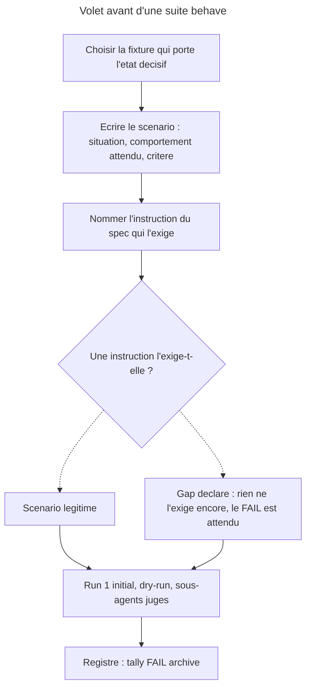

# Part 1 — Suites `behave` du declenchement, volet « avant »

## Feature

- **Summary** : scaffolder deux suites `behave` — une sur la chaine `*-optimize`, une sur les installeurs — et les jouer **une premiere fois sur la cible non corrigee**, pour enregistrer le FAIL qui fera la preuve du correctif.
- **Stack** : Markdown normatif · harnais `overcode:behave` (dry-run, sous-agents juges) · fixtures reelles en lecture seule
- **Branch name** : `main`
- **Parent Plan** : `2026_07_31-11-declenchement-pivots-quittance-master.md`
- **Sequence** : 1 of 5
- Confidence : 9/10
- Time to implement : 2 h - 3 h 30

**Pourquoi en premier.** *Reproduce-then-confirm* : un scenario qui ne rate pas sur la cible actuelle ne prouvera rien apres correction. Aucune cible n'est editee dans cette part.

## Architecture projection

### Files to modify

- aucun

### Files to create

- `plugins/overcode/skills/web-optimize/evals/pivot-provenance-scenarios.md` - suite de la famille `*-optimize` (heberge les quatre skills, cf. A3)
- `plugins/sc-tiers/skills/setup/evals/pivot-install-scenarios.md` - suite de la famille installeurs (cf. A3). **Six installeurs a HEAD, cinq a l'arrivee** : A1 retire l'action `sc-css` en part 4, et le scenario correspondant y passe a `FAIL -> N/A` (part 5, `verdict_condition`). La suite est ecrite ici sur les six ; c'est la part 4 qui la fait descendre a cinq.

**Les deux suites sont invisibles a l'inventaire du depot, et c'est sans consequence** (mesure d'iteration 29). `coverage.mjs` porte une fonction faite pour les signaler — `otherHarness()` `:185-190`, qui compte les `*-scenarios.md` d'un `evals/` — mais `:213` ne l'appelle que dans la branche `scen === null`. Les deux hotes retenus par A3 portent chacun un `scenarios.json` : le rapport passe donc par la branche `else` et ne mentionnera jamais leurs suites. Aucun effet sur `pnpm test` — aucun des quatre runners n'enumere `evals/` autrement que par `scenarios.json`, verifie sur les quatre. Le dire evite deux erreurs de lecture : croire que l'outillage atteste de leur existence (seuls les `rg -c 'post-fix'` de la part 5 le font), et lire le commentaire `coverage.mjs:176` — « une seule skill le declenche, `overcode:control` » — comme encore exact apres cette part. Il le restera, mais parce que la mention est inatteignable pour un hote deja route, pas parce que `control` est seule a porter des suites `behave`.

### Files to delete

- aucun

> ~~Si l'arbitrage A3 retient l'option B ou C, les deux chemins ci-dessus changent~~ — **A3 tranché le 2026-07-31 sur l'option A** : les deux chemins ci-dessus sont définitifs. Chaque suite nomme dans son intro les autres cibles qu'elle couvre.

## Applicable rules

| Tool | Name | Path | Why it applies |
|---|---|---|---|
| claude | plugins-marketplace | `~/.claude/rules/plugins-marketplace.md` | les suites s'ecrivent dans `plugins/`, jamais dans le cache |
| claude | behave/judgment-rules | `plugins/overcode/skills/behave/references/judgment-rules.md` | PASS n'est valable que s'il est du a une instruction reelle du spec ; sinon c'est un gap |
| claude | behave/harness-conventions | `plugins/overcode/skills/behave/references/harness-conventions.md` | format de registre, jugement en parallele, lecture READ-ONLY des fixtures |
| claude | behave-eval-method | `aidd_docs/memory/behave-eval-method.md` | N/A jamais compte PASS ; denominateurs non commensurables ; jugement a chaud a divulguer |
| claude | 01-scaffold | `plugins/overcode/skills/behave/actions/01-scaffold.md` | ne jamais ecraser une suite existante ; ordre de sections fixe |

## User Journey

## Risk register

| Risk | Impact | Mitigation |
|---|---|---|
| Les scenarios sont ecrits en connaissant la correction prevue, donc calibres pour passer plus tard | la suite ne prouve rien | Ecrire les criteres depuis l'**observable de sortie** decrit par l'issue, pas depuis la formulation du correctif ; chaque critere cite l'instruction absente et l'annonce comme gap |
| Le juge lit le registre de la suite avant de statuer | jugement a chaud | Defaut de harnais ouvert (`behave-eval-method` §3) ; a divulguer dans l'entree de registre, pas a corriger ici. Au run 1 le registre est vide, donc l'impact est nul pour ce run precis |
| ~~Creer `evals/` la ou il n'existe pas fait rougir `coverage.mjs`~~ | ~~`pnpm test` casse~~ | **Risque eteint (iteration 5)** : les deux hotes retenus ont deja `evals/scenarios.json`, et un `evals/` sans `scenarios.json` vaut `'todo'`, jamais `failed` (`coverage.mjs:179-181`). Vrai que `data-optimize` et `ap-optimize` n'ont pas d'`evals/` — mais A3 ne leur en cree aucun. Voir phase 1 |
| Une fixture est mutee par un juge | le parc devient faux | READ-ONLY impose par `harness-conventions` ; `git status --porcelain` compare avant/apres sur chaque fixture touchee, en **comparaison** et non en exigence de vide (deux fixtures ne sont pas propres a HEAD : `lyremember/app` a un fichier `A`, `email-to-markdown/*` a `.claude/` gitignore) |
| Un etat « decisif » n'existe pas vraiment sur la fixture citee | scenario N/A des l'ecriture | Les onze fixtures sont deja verifiees (voir table ci-dessous) ; toute fixture ajoutee doit l'etre de la meme facon avant d'entrer dans une suite |

## Parc de fixtures — verifie, aucune a modifier

Base reelle : `C:\Users\fxgui\Documents\Perso\Projects\` (et **non** `Documents\LLM\`).

⚠ **L'etat se lit par (famille, stack), pas par depot** (suggestion d'iteration 26, tiree du deal-breaker de la meme passe). Un depot peut etre servi sur une paire et pas sur une autre — `lyremember/app` et `suddenly/app` le sont tous les deux —, et un langage couvert par un plugin ne l'est pas pour toutes ses familles : `sc-rust` couvre quatre stacks, dont **une seule** en `perf`. Une colonne d'etat unique par depot ne peut pas exprimer cela, et c'est ce raccourci qui a produit le mauvais etiquetage corrige a l'iteration 26. La colonne ci-dessous porte donc, quand la distinction existe, l'etat de chaque paire.

| Fixture | Stack detectee | Etat de `.claude/rules/07-quality/` |
|---|---|---|
| `suddenly\_code\app` | Python/Django a la racine, Vite dans `frontend/` | **peuple, 6 pivots, tous Python** — zero JS |
| `suddenly\_code\ai-hub` | Python/FastAPI | peuple, 3 pivots |
| `choix-narratifs\_code` | Astro/TS + Rust (`engine/`) | absent (`rules/` ne porte que `08-design/`) |
| `winfxstart\_code` | Rust Win32 | pas de `.claude/` du tout |
| `lyremember\_code\app` | Vue/Vite + Rust + pytest, tous en sous-dossiers | peuple, 2 `perf-pivots-*` (`vite`, `vue-spa`) — **JS servi, Rust non** : `rust-backend/Cargo.toml:10` declare `rusqlite`, dont `sc-rust` livre le pivot `data`, absent du receptacle. Porte donc `chargé` en (perf, JS) **et** `not installed` en (data, rust) |
| `lyremember\_code\site` | Nuxt 4 | **absent** — jumeau non amorce de `app` |
| `email-to-markdown\_code\app` | Rust **sans framework web ni ORM** (`imap`, `mailparse`, `serde`, `regex`, `chrono`, `walkdir`) | present, **zero pivot** (`dry-refactor.md` + `.gitkeep`). ⚠ Hors couverture `perf` de `sc-rust`, qui ne livre que `perf-pivots-axum` : en (perf, rust) cette fixture vaut **`no provider`**, pas `not installed`. ⚠ **Depot git inaccessible par defaut** (mesure d'iteration 35, requalifiee a l'iteration 39) : `.git/` existe, mais git refuse d'y operer — *dubious ownership*, le dossier appartenant a `BUILTIN/Administrateurs`. La garde de non-mutation de la phase 4 y passe par le listing du receptacle, pas par `git status` |
| `email-to-markdown\_code\site` | Nuxt 4 | **present, `.gitkeep` seul** — receptacle prepare, jamais servi. Non versionne (`.claude/*` gitignore) |
| `email-to-markdown\_code\tools` | Python | pas de `.claude/` |
| `scriptami\_code\wp-2026` | WordPress FSE + build JS, **pas de `composer.json`** | absent ; porte `design/lint/lint-core.mjs` mais **pas de `gates.config.json`** |
| `scriptami\_code\app-2026` | Nuxt 4 | absent |

## Implementation phases

### Phase 1 : ~~Verifier que la creation d'`evals/` ne casse pas le harnais~~ — sans objet

> **Phase close sans travail, le 2026-07-31 (correction d'iteration 5).** Elle reposait sur trois hypotheses, fausses toutes les trois. Ce qui suit est le releve qui les remplace ; il n'y a rien a executer.
>
> 1. **Aucun `evals/` n'est a creer.** `plugins/overcode/skills/web-optimize/evals/scenarios.json` et `plugins/sc-tiers/skills/setup/evals/scenarios.json` **existent deja**, tous deux. Les deux hotes retenus par A3 sont donc deja dotes ; la part n'ajoute qu'un fichier `*-scenarios.md` a cote, ce qui ne change ni les actions declarees ni les actions routables lues par `coverage.mjs`.
> 2. **Le cas redoute n'est de toute facon pas fatal.** `missingSuitePolicy()` retourne `'todo'` (`tools/eval/coverage.mjs:179-181`) ; `todo` n'incremente pas `failed`, et le script sort sur `process.exit(failed ? 1 : 0)`. Un `evals/` sans `scenarios.json` produit un `○`, jamais un echec. Le commentaire `:174-178` va plus loin : le discriminant « `evals/` existe mais pas `scenarios.json` = travail commence et non tenu » a ete **essaye puis retire**, parce qu'une seule skill du depot le declenche — `overcode:control`, dont l'`evals/` porte precisement des suites `behave`. Le cas de cette part est celui que le harnais a explicitement decide de ne pas sanctionner.
> 3. **A3 n'est plus a trancher** : tranche le 2026-07-31, option A. La tache le demandait encore alors que son propre critere le notait `[x]`.
>
> Le repli prevu en tache 3 (« replier sur l'hote qui possede deja un `evals/` ») est donc sans declencheur possible — et il contredisait le bloc *Files to create*, qui dit les deux chemins definitifs.

#### Tasks

- aucune

#### Acceptance criteria

- [x] Le comportement de `coverage.mjs` face a un `evals/` sans `scenarios.json` est connu et ecrit — ci-dessus, verifie sur le code
- [x] A3 est tranche (2026-07-31, option A), les deux chemins d'hebergement sont fixes

### Phase 2 : Suite `pivot-provenance-scenarios.md` — la chaine `*-optimize`

> Pincer, sur quatre skills, ce que la sortie ne dit pas.

#### Tasks

1. Ecrire l'en-tete conforme a `assets/scenario-template.md` : titre, distinction d'avec les suites voisines, bloc *Fixture / preconditions* nommant les fixtures et leur etat, table, `## How to run`, `## Results log` vide.
2. Ecrire les scenarios, en table a 6 colonnes comme les suites de `control`. **Intitules a ecrire tels quels, en anglais** (suggestion d'iteration 35) : `# | Situation (input) | Expected behaviour | Pass criteria | Judge load path | Instruction pinned` — les huit suites du parc portent les cinq premiers a l'identique ; seul le sixieme change, `Page rule pinned` etant propre aux pages de `control` et sans objet ici. Couverture minimale :
   - **branche nominale declaree** : `data-optimize` sur `ai-hub`, `web-optimize` sur `lyremember/app` — le pivot est charge **et la sortie dit d'ou vient le contenu**
   - **pivot existant, jamais installe ici** : `web-optimize` sur `lyremember/site` (Nuxt, `sc-js` livre `capabilities/perf/nuxt.md`, rien d'installe) — le jumeau `lyremember/app` a recu les siens, **rien dans la sortie ne les distingue**
   - **meme defaut, autre stack** : `data-optimize` sur `lyremember/app`, cote `rust-backend/` — `Cargo.toml:10` declare **`rusqlite`**, pour lequel `sc-rust` livre `data-pivots-rusqlite.md`, et le `07-quality/` du depot ne porte que les deux `perf-pivots-*` JS. Vrai `not installed`, sur une stack Rust, dans un depot par ailleurs servi.

     ⚠ **Ne pas y remettre `web-optimize` sur `email-to-markdown/app`** (deal-breaker d'iteration 26). Cette ligne annoncait « Rust, 4 pivots `sc-rust` livres, aucun installe » : les quatre cibles existent, mais **une seule est de famille `perf`** (`perf-pivots-axum.md`), et le `Cargo.toml` de la fixture ne declare **ni axum, ni sqlx, ni diesel, ni rusqlite** (client IMAP : `imap`, `mailparse`, `serde`, `regex`, `chrono`, `walkdir`). Pour la famille perf, aucun fournisseur ne couvre cette stack : la sortie correcte y est **`no provider`**, pas `not installed`. La couverture se lit **par (famille, stack)** — DEC-008 —, jamais par langage ni par total de cibles d'un plugin.

     **L'interdiction porte sur l'etiquette, pas sur la paire** (correction d'iteration 44) : cette fixture reste au parc, sous l'etiquette juste — c'est la puce suivante. Sans cette precision, le ⚠ se lisait comme un retrait pur et la puce suivante n'etait jamais ecrite, alors que la tache 4 (`:160`) dit « garder les deux » et que le critere `:170` l'exige nommement.
   - **fournisseur present, stack hors couverture** : `web-optimize` sur `email-to-markdown/app` — Rust sans framework web, `sc-rust` ne livre en famille `perf` que `perf-pivots-axum.md` (mesure du 2026-07-31 : `02-install-pivots.md:13` pour `perf`, `:19-21` pour `data`). **Deuxieme cause de `no provider`**, distincte de celle de `seo` : ici la famille a un fournisseur, c'est la stack qu'il ne couvre pas. Ligne exigee par le critere `:170` ; ne pas la confondre avec la puce precedente, dont l'etat est `not installed`.
   - **depot partiellement servi** : `web-optimize` sur `suddenly/app` cote `frontend/` — 6 pivots Python installes, 0 JS ; un repertoire peuple masque le manque
   - **receptacle prepare, jamais servi** : `web-optimize` sur `email-to-markdown/site` — le repertoire existe, ne porte **aucun fichier de regle** (`.gitkeep` seul), et rien ne le dit. Troisieme etat, distinct d'« absent ». ⚠ Le critere est *aucune regle*, **pas** *repertoire vide* (deal-breaker d'iteration 22, `part-2:129`) : cette fixture porte un `.gitkeep`, donc la lettre « vide » l'aurait fait basculer en `not installed` et prive cet etat de sa seule preuve
   - **repli vers template silencieux** : la marche `aidd_docs/templates/dev/<x>_checklist_*.md` prise sans dire qu'un pivot de plugin aurait du etre la
   - **remede mal nomme** : le garde-fou terminal de `web`/`data`/`ap` propose d'installer un plugin **deja installe**
   - **forme propre a `seo`** : garde-fou binaire, pas d'etage template, branche `sc-seo-*` sans fournisseur
   - **controle negatif** : `ap-optimize` sur `ai-hub` — pas de stack ActivityPub, l'absence correcte ne doit produire aucune alerte
   - **multi-stack** : `choix-narratifs` (Astro + Rust) — l'absence se declare **par stack** (DEC-008), une provenance rendue en valeur unique est fausse quelle qu'elle soit
3. Pour chaque ligne, nommer dans la derniere colonne l'instruction censee l'exiger — et, quand aucune ne l'exige, l'ecrire comme tel : le FAIL est attendu, il est la preuve.
4. Declarer **N/A** l'etat *« aucun pivot n'existe nulle part pour cette stack »* **pour les seules familles `perf`, `data`, `ap`** : les onze fixtures y sont couvertes par un `sc-*` qui livre quelque chose. Ne pas le compter PASS.

   **`seo` est l'exception, et c'est la preuve de reference de l'etat `no provider`** (deal-breaker d'iteration 12, precise a l'iteration 26). Mesure : `seo-pivots-*` n'est declare par **aucun** des cinq installeurs — `seo-optimize` rend donc `no provider` sur **n'importe quelle** fixture, sans en fabriquer aucune. La ligne « forme propre a `seo` » pince cet etat pour de vrai : elle se juge PASS ou FAIL, **jamais N/A**. Elle n'est plus la *seule* : `web-optimize` sur `email-to-markdown/app` (Rust sans framework web, hors couverture `perf` de `sc-rust`) rend le meme etat par une autre voie — famille couverte, stack non couverte, la ou `seo` n'a aucun fournisseur du tout. **Garder les deux, et les distinguer explicitement** : ce sont deux causes differentes du meme rendu, et confondre l'une avec `not installed` est l'erreur exacte que l'iteration 26 a corrigee. La declarer N/A par application mecanique de la regle ci-dessus priverait l'issue de sa preuve sur le quatrieme etat de DEC-010 — celui dont la part 2 fait le cas d'ecole.

#### Acceptance criteria

- [ ] La suite existe, ordre de sections conforme au template
- [ ] Chaque scenario nomme sa fixture et l'etat precis qu'elle porte
- [ ] Chaque critere est un observable de **sortie**, jamais une valeur de retour
- [ ] Les quatre skills sont couvertes, `seo` par des lignes de forme propre
- [ ] Au moins un scenario par etat de receptacle : peuple-correct, peuple-mauvaise-stack, present-vide, absent
- [ ] Chaque scenario est etiquete par la paire **(famille, stack)** qu'il pince, et son etat attendu se verifie contre la couverture reelle du fournisseur pour **cette famille** — pas contre le total de cibles du plugin (correction d'iteration 26)
- [ ] Les deux causes de `no provider` sont couvertes et **distinguees** : aucun fournisseur pour la famille entiere (`seo`), et fournisseur present mais stack hors couverture (`web-optimize` sur `email-to-markdown/app`)

### Phase 3 : Suite `pivot-install-scenarios.md` — les installeurs

> Pincer une annonce d'ecriture qui ne correspond a rien.

#### Tasks

1. Meme en-tete. L'observable est ici l'**ecriture intentionnelle** : le jugement est un dry-run, aucune mutation n'est necessaire pour statuer.
2. Scenarios minimaux :
   - `sc-tiers:setup 01-install` — 4 pivots data prevus dont **3 inexistants** sur disque, et « ✅ 12 files written » plus la liste nominative annonces en dur (`:36-51`)
   - `sc-css:sniff 02-install-pivots` — 6 declares, **0 present**, aucun `references/` sous `skills/sniff/` ; la branche `❌ non disponible` existe, donc l'echec est honnete mais total. **Seul scenario dont la cible disparait en part 4** (arbitrage A1 = retrait de l'action) : le formuler pour rester lisible apres coup, et prevoir des maintenant qu'il rendra `N/A (cible supprimee — issue nominale de A1)` au rejeu de la part 5, pas un PASS. Voir la tache 4 ci-dessous.
   - `sc-php:sniff 02-install-pivots` sur un projet **Symfony seul** — l'en-tete `:40` imprime « pivots installed » inconditionnellement, avec une ligne `perf-pivots-laravel.md (installed)` pre-decidee
   - `sc-rust:sniff 02-install-pivots` sur un projet **rusqlite seul** — `rusqlite` declare `:21`, absent du bloc de sortie fige `:37-50` (citation corrigee en iteration 22 : `:44-45` designait la ligne `data-pivots-diesel.md (skipped)` et une ligne vide, ou l'absence de `rusqlite` est triviale). Sur un tel projet, le bloc annonce `data-pivots-sqlx.md (installed)` — faux — et tait le seul pivot applicable
   - `sc-python:sniff 02-install-pivots` — bloc nominatif fige `:49-64`, sans la clause de `sc-js` qui dit de choisir l'en-tete d'apres ce qui s'est reellement passe
   - **controle positif** : `sc-js:sniff 02-install-pivots` — 13/13 presents et sortie derivee (`:46`) ; ce scenario doit **PASSER des le run 1** et sert de temoin que la suite n'est pas ecrite pour tout faire rougir
   - **chemin declare non resolu hors installeur** : `sc-js:sniff 03-clean.md:26` liste `capabilities/styling/design-system.md`, absent du disque (12/13 resolvent)
3. Choisir les fixtures de stack : `winfxstart` (Rust pur) et `email-to-markdown/app` (Rust) pour `sc-rust` ; `wp-2026` pour `sc-php` (WordPress, sans `composer.json` — l'etat de detection fait partie de l'observable) ; `suddenly/app` pour `sc-python` ; `choix-narratifs` ou `lyremember/site` pour `sc-js`.

4. **Distinguer les deux sens du `N/A`** (deal-breaker d'iteration 12). La part 5 `:25` n'outille que `PASS -> N/A`, lu comme une dette de suite. Le scenario `sc-css` produira l'inverse — `FAIL -> N/A` —, et c'est l'**issue voulue** : l'action retiree, l'etat interroge n'existe plus, il n'y a rien a corriger. L'ecrire dans la colonne *Regle pincee* du scenario, pour que le rejeu de la part 5 n'ait pas a l'inventer : `0 FAIL` doit se lire *corrige* ou *cible retiree par A1*, jamais *satisfait par accident*.

#### Acceptance criteria

- [ ] La suite existe et couvre les six installeurs — **etat du run 1** ; apres la part 4 il n'en reste que cinq, et le scenario `sc-css` est celui qui atteste du retrait
- [ ] Le scenario `sc-css` porte, des l'ecriture, le sens de son `N/A` post-fix
- [ ] Le temoin positif est present et attendu PASS — c'est **`sc-js:sniff 02-install-pivots`**, et lui seul. ⚠ La part porte **deux** scenarios `sc-js` (precision d'iteration 22) : celui-ci, et `sc-js:sniff 03-clean.md:26` dont le **FAIL est attendu**. Dire « le temoin `sc-js` » sans le qualifier laissait lire le second comme une invalidation de la suite
- [ ] Chaque scenario distingue « source absente du plugin » de « sortie figee alors que la source existe » — deux defauts, deux remedes

### Phase 4 : Run 1 « initial » sur les deux suites

> Enregistrer le FAIL. C'est la seule livraison de la part.

#### Tasks

1. Lancer `behave 02-run` en mode `initial`, dry-run, sur chaque suite ; fan-out des juges en parallele.
2. Chaque juge charge les instructions de la cible (`SKILL.md` + fichiers nommes dans *How to run*) et la suite, lit la fixture **en lecture seule**, et rend un verdict PASS/FAIL/N/A cite.
3. Attester la non-mutation par **deux** relevés avant/apres, pas un seul :
   - `git status --porcelain` sur chaque fixture touchee — en **comparaison**, deux fixtures n'etant pas propres a HEAD ;
   - **un listing horodate de `.claude/rules/07-quality/`** (noms + taille + mtime) sur chaque fixture touchee, versionnee ou non.

   ⚠ **`git status` seul est aveugle sur les deux fixtures les plus exposees** (deal-breaker d'iteration 35). Mesure du 2026-07-31 : `email-to-markdown/_code/app` est un depot git **sur lequel git refuse d'operer** — `git rev-parse --show-toplevel` et `git status` echouent tous deux en *dubious ownership*, `.git/` appartenant a `BUILTIN/Administrateurs` quand l'utilisateur courant est `FXPCTOURGAMING/fxgui`. **Requalification d'iteration 39** : l'iteration 35 avait lu cet echec comme « n'est pas un depot git », ce qui est faux et change le remede — git nomme le sien, `git config --global --add safe.directory <chemin>`, qui rend `git status` de nouveau applicable. **Ne pas l'executer** : modifier la configuration git globale de l'utilisateur pour faire tourner une garde de plan depasse le perimetre, et le listing du receptacle conclut sans elle. Et `email-to-markdown/_code/site` **gitignore le receptacle lui-meme** (`.gitignore:22` = `.claude/*`, verifie par `git check-ignore -v .claude/rules/07-quality/x.md`). Ce sont exactement les deux fixtures qui portent `no provider` par stack hors couverture et `empty receptacle` — les deux etats neufs de DEC-010. `harness-conventions.md:16` pose la regle READ-ONLY **sans prescrire de moyen de la verifier** : `git status` est un choix de ce plan, et le listing le rattrape la ou le versionnement ne repond pas.
4. Appendre l'entree de registre datee dans chaque suite, au format de `harness-conventions` : tally, Δ (`—` au run 1), frictions, et **divulgation explicite du jugement a chaud** si le juge a lu le registre.

#### Acceptance criteria

- [ ] Chaque suite porte une entree `run 1 (initial, dry-run, ...)` datee
- [ ] Le tally comporte au moins un FAIL par suite ; un run sans FAIL invalide la suite, pas la cible
- [ ] Le temoin **`sc-js:sniff 02-install-pivots`** est PASS — le second scenario `sc-js` (`03-clean.md:26`) est attendu FAIL et ne compte pas comme temoin
- [ ] Aucune fixture n'a change d'etat git **ni de contenu de `.claude/rules/07-quality/`** — le second releve est le seul concluant sur `email-to-markdown/_code/app` (git inoperant, *dubious ownership*) et `email-to-markdown/_code/site` (receptacle gitignore)
- [ ] `pnpm test` reste vert

## Amendments

## Log

## Validation flow demonstration

1. Ouvrir `plugins/overcode/skills/web-optimize/evals/pivot-provenance-scenarios.md` : la table decrit des situations reelles avec fixtures nommees, le registre porte une entree datee avec un tally FAIL.
2. Ouvrir `plugins/sc-tiers/skills/setup/evals/pivot-install-scenarios.md` : idem, avec le temoin `sc-js` en PASS.
3. Sur chaque fixture touchee, les **deux** releves de la phase 4 tache 3 : `git status --porcelain` **et** le listing horodate de `.claude/rules/07-quality/`, compares a l'avant-run. Aucun changement imputable au run. `git status` seul ne conclut pas — il est muet sur `email-to-markdown/_code/site`, qui gitignore son receptacle, et inoperant sur `email-to-markdown/_code/app` (correction d'iteration 39 : ce point ne demandait que `git status`, le moyen que l'iteration 35 avait juge insuffisant).
4. `pnpm test` : vert.
