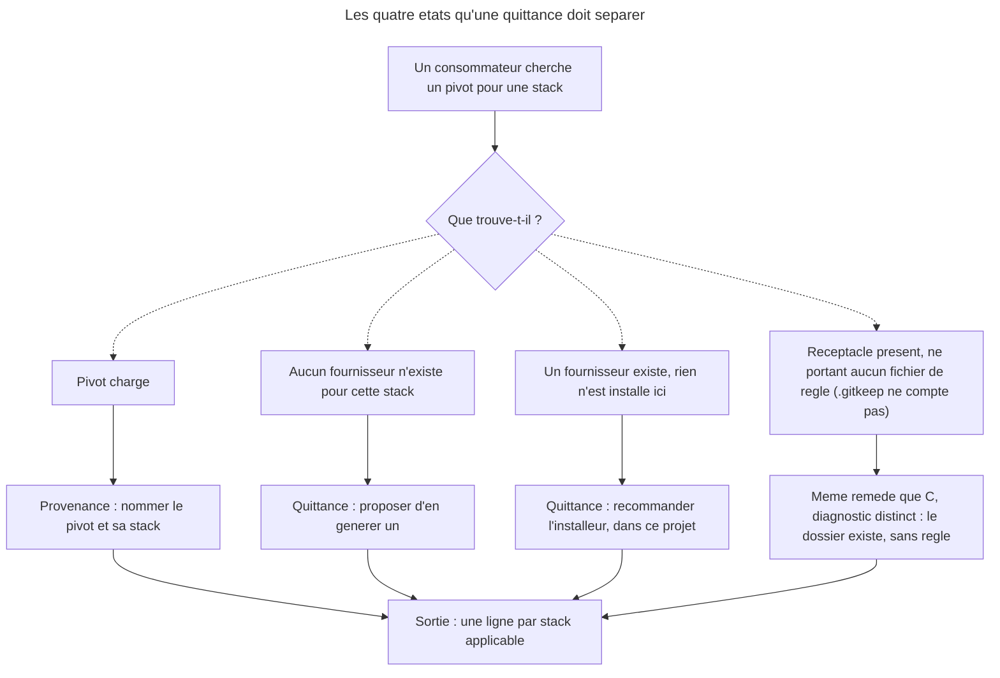

# Part 2 — DEC-010 : la quittance comme regle transversale, et les alignements `design`

## Feature

- **Summary** : ecrire une fois la regle que les quatre `*-optimize` instancieront en part 3, la poser a l'endroit qui fait autorite pour tous les consommateurs de pivot, et payer les trois defauts de coherence trouves dans `design` a cette occasion.
- **Stack** : Markdown normatif · ADR · `plugins/overcode/docs/` · `plugins/design/references/`
- **Branch name** : `main`
- **Parent Plan** : `2026_07_31-11-declenchement-pivots-quittance-master.md`
- **Sequence** : 2 of 5
- Confidence : 9/10
- Time to implement : 1 h - 2 h

**Le point de depart n'est pas vierge.** `overcode/README.md:7` et `docs/concepts.md:25` promettent deja *« Aucun pivot trouve -> un schema generique s'applique, **et l'absence est enoncee** »*. Aucune des quatre skills ne l'implemente. Le DEC n'invente donc pas une position : il **etend une promesse existante** a la distinction « inexistant » / « non installe », et la rend opposable aux trois familles.

## Architecture projection

### Files to modify

- `plugins/overcode/docs/concepts.md` - la section *Le principe : agnostique par defaut, specialise par pivot* accueille la regle transversale et les **quatre** etats de DEC-010 §1
- `plugins/overcode/README.md` - aligner la phrase de tete sur la formulation retenue
- `plugins/design/references/sc-pivot-contract.md` - ecrire le **motif** de l'asymetrie regles/artefact (la position existe deja `:129-134`) ; normaliser les **quatre** chemins de skill qui ne resolvent pas — `:17`, `:71` (seul a porter aussi une erreur de nom) et les deux de `:142`, correction d'iteration 20 : cette ligne n'en visait qu'un ; **completer la table `:114-119`** — elle porte le meme manque que `04-pivot.md` (voir ci-dessous), et c'est ce fichier que A4 designe comme interface publique pour justifier `design` -> 2.8.0 : le corriger a cote sans le corriger dedans serait bumper une interface avec son defaut
- `plugins/design/skills/enforce/actions/04-pivot.md` - completer la table `:45-50`

> **Le gate emet sept formes de ligne, pas quatre — et les deux tables n'en documentent correctement que trois** (mesure d'iteration 2, corrigee a l'iteration 24, sur `plugins/design/tools/run-gates.py`). Six cas, dont un (`VIOLATION`) se dedouble par son prefixe.
>
> | Ligne du runner | Source | `sc-pivot-contract.md:114-119` | `enforce/04-pivot.md:45-50` |
> |---|---|---|---|
> | `REALIZED <id> (<type>) by <realizer>` | `:269` | present | present |
> | `REALIZED <id> (<type>) by <realizer> - the contract declares no realizer for it` | `:268-269`, branche `stale` | **absent** | **absent** |
> | `VIOLATION <target>: <message>` **et** `VIOLATION <realizer>: <message>` — **deux formes, un seul `print`** | `:292`, alimente par `:193` (lint markup) et `:251` (rapports de pivot) | present, mais **en glose** | present, et **faux** |
> | `UNREALIZED <id> (<type>) - <realizer> reports it unrealized` | `:272` | present | present |
> | `UNREALIZED <id> - declared with no realizer` | `:275` | **absent** | **absent** |
> | `UNREALIZED <id> (<type>) - no report from its realizer` | `:278` | present | present |
>
> Les deux lignes manquantes sont a ajouter **aux deux tables**, a l'identique. Noter la forme de la seconde : le runner l'emet **sans** `(<type>)`, contrairement a ses voisines — la table doit reproduire la sortie, pas la regulariser. Sur la ligne `stale`, `<type>` vaut **toujours** `unrealized` : la garde `:268` est `if kind == "unrealized"`, l'ecrire en variable laisserait croire qu'un `(markup)` peut y apparaitre.
>
> **Les lignes deja presentes de `04-pivot.md:45-50` divergent, elles aussi** (deal-breaker d'iteration 13, complete a l'iteration 24) : `:49` et `:50` ecrivent `UNREALIZED <id> — …` — **tiret cadratin** la ou le runner imprime `- `, et **`(<type>)` omis** sur les deux ; `:48` ecrit `VIOLATION <realizer>: <message>`, vrai pour un seul des deux producteurs (voir la ligne 3 du tableau). **Trois de ses quatre lignes sont donc fausses** avant meme l'ajout — seule `:47` est exacte. La table du contrat, elle, n'est exacte que sur ses lignes `REALIZED`/`UNREALIZED` : sur `VIOLATION` elle glose au lieu de citer. Ajouter sans normaliser rendrait le critere « les deux tables a l'identique l'une de l'autre » inatteignable. La tache porte donc sur la table **entiere**, pas sur les deux lignes ajoutees.
>
> **La ligne `VIOLATION` a deux producteurs** (mesure d'iteration 24) : `run-gates.py:292` n'imprime qu'un `print(f"  VIOLATION {message}")`, mais `message` est construit en `:193` — `violations.append(f"{target}: {message}")`, ou `target` est un **chemin de fichier**, cote linter markup portable — et en `:251` — `violations.append(f"{realizer}: {message}")`, cote lecture des rapports de pivot. Les deux formes sont donc a ecrire, **cote a cote, dans les deux tables**, avec la mention de leur origine : sinon un lecteur qui voit `VIOLATION docs/foo.md: …` conclut a un realiseur nomme `docs/foo.md`. C'est la seule ligne du gate dont le prefixe n'est pas d'un type unique — la taire est ce qui a produit l'erreur de `04-pivot.md:48`. Le compte de lignes distinctes a documenter passe donc de six a **sept**.
>
> La forme `REALIZED <id> (markup) by lint-core` (`:261`) est subsumee par la premiere ligne du tableau (`<type>` = `markup`, `<realizer>` = `lint-core`) ; cote contrat, sa colonne *Ce que le receptacle ecrit* vaut `—` : `lint-core` n'ecrit pas de `status:`. A dire ainsi si la ligne est explicitee, pas a en faire **une forme de plus** dans le tableau (le mot « septieme » figurait ici avant que l'iteration 24 ne porte le compte a sept chaines ; il designait desormais une chaine qui existe — correction d'iteration 30). Verifie a cette occasion : la branche `:260` `if kind == "markup"` est prise **avant** toute consultation de `reported`, donc `lint-core` est une constante du runner et jamais un realiseur qui rapporte. C'est ce qui justifie le `—` en colonne *Ce que le receptacle ecrit*, et ce qui rend la subsomption acceptable sans etre anodine. La branche `stale` est l'etat inverse de la quittance que DEC-010 pose : un realiseur rapporte une regle que le contrat a declaree sans realiseur. C'est le cas le plus proche du sujet de cette issue, et le seul que personne n'avait ecrit.
> Le `CHANGELOG.md` de `design` (`:192-193`) porte la meme table amputee : **ne pas le corriger** — un CHANGELOG enregistre un etat passe, il ne se reecrit pas.
- ~~`plugin.json` / `marketplace.json` / CHANGELOG~~ — **rien ici** (arbitrage d'itération 3, master › *Où se pose le bump*). Cette part n'écrit que du contenu. Les bumps `overcode` et `design` et leurs entrées de journal sont portés **en part 5**, une seule fois par plugin, au niveau fixé par A4 : `overcode` est aussi touché par les parts 1 et 3, `design` seulement ici mais la règle vaut pour tous.

### Files to create

- `aidd_docs/internal/decisions/010-pivot-consumer-receipt.md` - DEC-010

### Files to delete

- aucun

## Applicable rules

| Tool | Name | Path | Why it applies |
|---|---|---|---|
| claude | DEC-006 | `aidd_docs/internal/decisions/006-control-page-authority.md` | page = regle + motif, skill = regle + procedure, ADR = rationnel — determine ce qui va dans `concepts.md` et ce qui va dans le DEC |
| claude | DEC-004 §5 | `aidd_docs/internal/decisions/004-cross-plugin-pivot-consumption.md` | le contrat de pivot est une interface publique — conditionne le niveau de bump `design` |
| claude | DEC-008 | `aidd_docs/internal/decisions/008-pivot-follows-the-file.md` | l'absence se declare **par stack** ; une quittance rendue en valeur unique est fausse sur un depot polyglotte |
| claude | DEC-009 §2 | `aidd_docs/internal/decisions/009-what-a-pivot-field-assumes-silently.md` | un prerequis constate absent vaut champ absent pour ce run — meme forme de raisonnement que la quittance |
| claude | plugins-marketplace | `~/.claude/rules/plugins-marketplace.md` | bump et contenu dans le meme commit |
| claude | skill-writing-style | memoire personnelle | exhaustif, agnostique, le moins de mots possible |

## User Journey

## Risk register

| Risk | Impact | Mitigation |
|---|---|---|
| La regle est ecrite trop generale et devient inapplicable a `control`, dont la lecture in-plugin **ne peut pas echouer** | une regle transversale qui ne tient pas sur un de ses trois sujets | Ecrire la regle sur l'**observable** (« la sortie nomme ce qui a ete charge et ce qui ne l'a pas ete »), pas sur le mecanisme. `control` la satisfait deja a moitie : il a la ligne de provenance, il n'a rien a quitter |
| La regle est ecrite dans `docs/control.md` par reflexe | elle ne lierait que `control` | `docs/control.md` est borne a `control` (DEC-006) ; la regle transversale va dans `docs/concepts.md`, section *agnostique par defaut, specialise par pivot* |
| Le DEC tranche l'asymetrie `enforce`/`diffuse` alors qu'elle est deja tranchee | on reouvre une position stable | Verifie : `sc-pivot-contract.md:129-134` porte deja les deux contrats de retour, ligne rapport = `—` cote rendu. Le DEC **confirme et motive**, il ne decide pas |
| Bump `design` mal calibre | install incoherent | **Tranche le 2026-07-31** : `design` 2.7.1 -> **2.8.0**, le contrat est lu par des plugins tiers donc c'est une interface publique (DEC-004 §5). Ce n'est plus une question ouverte, et ce n'est pas cette part qui l'ecrit — la part 5 le fait |

## Implementation phases

### Phase 1 : DEC-010

> Le rationnel, une fois, a l'endroit qui ne se charge jamais tout seul.

#### Tasks

1. Creer `aidd_docs/internal/decisions/010-pivot-consumer-receipt.md` au format de DEC-009 : table `ID / Date / Feature / Status / Antecedents`, puis `## Context`, `## Decision`, `## Rationale`, `### Ce que la decision ne fait pas`, `## Compatibility`, `## Consequences`.
2. `Antecedents` : DEC-004 (consommation croisee), DEC-006 (autorite de la page), DEC-008 (le pivot suit le fichier -> la quittance est **par stack**), DEC-009 (un prerequis absent vaut champ absent).
3. Enoncer la decision en deux points :
   - **§1 — Tout consommateur de pivot rend, en sortie, ce qu'il a charge et ce qu'il n'a pas pu charger.** **Quatre** etats a separer, jamais deux (correction d'iteration 13) : *charge* · *aucun fournisseur n'existe pour cette stack* · *un fournisseur existe, rien n'est installe ici* · *receptacle present et **ne portant aucun fichier de regle***.

     ⚠ **« Vide » se definit par les regles, pas par les fichiers** (deal-breaker d'iteration 22). La formulation precedente disait « present et vide » ; la fixture qui prouve cet etat, `email-to-markdown/_code/site`, porte un `.gitkeep` (`part-1:104`) et n'est donc **pas** vide au sens du systeme de fichiers — a la lettre, elle basculait en `not installed` et le quatrieme etat perdait sa seule preuve. Le critere retenu rend les trois verdicts que la part 1 attend : `.gitkeep` et fichiers de service ne comptent pas, mais une regle hors pivot compte — `email-to-markdown/app`, qui porte `dry-refactor.md`, reste `not installed` (`part-1:140`), et `lyremember/site`, dont le receptacle est **absent**, aussi (`part-1:139`) : aucun des quatre etats ne se confond avec *absent*. Les deux derniers appellent le **meme remede** mais pas le meme diagnostic, et la part 3 leur donne deux alternants distincts (`not installed` / `empty receptacle`, `part-3:135`) : les fondre ici priverait cet alternant de fondement normatif. Aucun des quatre ne se confond avec *absent*. Sur un depot polyglotte, la quittance est **une ligne par stack applicable** — rendue en valeur unique elle est fausse quelle qu'elle soit (DEC-008).
   - **§2 — Deleguer des regles oblige a une quittance ; deleguer un artefact non.** Motif : une regle non realisee est **silencieuse** — assignee ou oubliee, meme trace, aucune (`sc-pivot-contract.md:112`). Un artefact non produit est **auto-evident** : le fichier existe et passe le gate, ou il n'existe pas. La quittance paie un silence ; la ou il n'y a pas de silence, elle n'a rien a payer.
4. `## Compatibility` : justifier le niveau de bump `overcode` et `design` (A4).
5. `## Consequences` : lister les fichiers touches par les parts **1 a 5** — les deux suites `behave` de la part 1 et les bumps de la part 5 en font partie, un DEC qui s'arreterait a la part 4 decrirait un lot qui n'existe pas.

#### Acceptance criteria

- [ ] `010-pivot-consumer-receipt.md` existe, format identique a DEC-009
- [ ] Les **quatre** etats sont nommes et distincts — `not installed` et `empty receptacle` compris, chacun avec son alternant
- [ ] La regle par stack est explicite et sourcee DEC-008
- [ ] §2 porte un motif, pas seulement une regle
- [ ] Le DEC ne nomme **aucun** consommateur comme decideur (DEC-007 §2)

### Phase 2 : la regle dans `docs/concepts.md`

> La page porte la regle et son motif ; la procedure reste dans les skills.

#### Tasks

1. Etendre la section *Le principe : agnostique par defaut, specialise par pivot* : remplacer la clause actuelle (*« Aucun pivot trouve -> un schema generique s'applique, et l'absence est enoncee »*) par les **quatre** etats, et nommer l'obligation de sortie.
2. Ajouter, dans la table `Skill | Pivots consommes`, la colonne ou la mention de **qui installe** le pivot consomme — c'est l'information dont l'absence rend le remede introuvable. Ne pas y recopier `pivot-providers.md` (part 3) : la page nomme le plugin par famille, la table de la part 3 fait la correspondance par stack. Deux granularites, deux fichiers, un seul renvoi.
2-bis. **Ajouter la quatrieme ligne : `seo-optimize` / `seo-pivots-*.md`** (deal-breaker d'iteration 10). Mesure : la table `:27-31` (en-tete `:27`, separateur `:28`) n'a que trois lignes de donnees, `:29-31` — recompte a l'iteration 37, « `:29-32` » debordait sur une ligne vide et `rg 'seo' plugins/overcode/docs/concepts.md` renvoie **0 occurrence dans tout le fichier**. La part 3 impose la quittance aux **quatre** skills : sans cette ligne, le document normatif regirait une skill qu'il ignore. Cas particulier a ecrire, pas a taire — apres A5, `seo-pivots-*` n'a **aucun** fournisseur : le receptacle est une interface publique sans realisateur (`references/seo-geo-pivots.md:112`), et c'est exactement l'etat `no provider` de DEC-010. La ligne le dit ainsi, ce qui donne a la page son cas d'ecole.
3. Aligner `plugins/overcode/README.md:7` sur la meme formulation, sans la dupliquer en entier (le README renvoie).

#### Acceptance criteria

- [ ] `docs/concepts.md` enonce les **quatre** etats et l'obligation de sortie
- [ ] La table nomme l'installeur de chaque famille de pivots
- [ ] La table a **quatre** lignes, `seo-optimize` compris, et sa ligne `seo` porte `no provider` comme etat, non comme oubli
- [ ] `README.md` ne contredit plus `concepts.md`
- [ ] Aucune procedure d'execution n'a migre dans la page (DEC-006)

### Phase 3 : les trois alignements `design`

> Trois defauts trouves a l'occasion, tous de coherence, aucun de comportement.

#### Tasks

1. `sc-pivot-contract.md` — ajouter au § *Obligation de report* le **motif** de l'asymetrie (§2 du DEC-010), en renvoyant a la table `:129-134` qui porte deja la position. Ne pas dupliquer la table.
2. `sc-pivot-contract.md` — **normaliser les quatre chemins de skill qui ne resolvent pas, pas seulement `:71`** (deal-breaker d'iteration 20). Le fichier porte **trois formes concurrentes**, et une seule est correcte. Recensement mesure, base de resolution = racine du plugin (la meme qu'en part 4 `:118`) :

   | Ligne | Ecrit | Resout ? | Cible reelle |
   |---|---|---|---|
   | `:71` | `diffuse/04-pivot.md` | non — **et le nom est faux** | `skills/diffuse/actions/03-pivot.md` |
   | `:17` | `enforce/04-pivot.md` | non | `skills/enforce/actions/04-pivot.md` |
   | `:142` | `diffuse/actions/02-render.md § Etape 5` | non | `skills/diffuse/actions/02-render.md § Etape 5` |
   | `:142` | `diffuse/adapters/html-css.md § Statut de la sortie` | non | `skills/diffuse/adapters/html-css.md § Statut de la sortie` |
   | (temoin) | `skills/detail/references/workflow-classes.md` | **oui** | — |
   | (temoin) | `references/enforcement-registry.md`, `references/gate-config-schema.md` | **oui** | racine du plugin, correct |

   **`:142` n'etait pas le precedent qu'on croyait** : la tache d'origine le citait comme preuve que la convention `skills/…` existe, alors qu'il porte precisement la forme courte. Le seul temoin valable est `skills/detail/references/workflow-classes.md`. La forme retenue est donc `skills/<skill>/<dossier>/<fichier>` pour tout chemin de skill, `references/<fichier>` restant reserve aux references de racine de plugin — deux bases, jamais melangees, comme M4 les tient separees.

   Le defaut de `:71` n'est d'ailleurs pas que de profondeur : `04-pivot.md` **n'existe pas** cote `diffuse`, le fichier est `03-pivot.md`. C'est le seul des quatre a porter une erreur de nom.

   Pourquoi les quatre et pas un : A4 justifie `design` -> 2.8.0 par le fait que ce fichier est une **interface publique** lue par des plugins tiers. Bumper une interface publique en laissant trois references qui ne resolvent pas, c'est le defaut « declare mais absent » que cette issue ferme partout ailleurs, laisse dans le fichier meme qu'on corrige pour cette raison.
3. **Completer les deux tables, a l'identique** — `skills/enforce/actions/04-pivot.md:45-50` **et** `references/sc-pivot-contract.md:114-119`, qui portent le meme manque (corrige d'iteration 5 : cette tache ne visait qu'un fichier et qu'une ligne). **Deux** lignes manquent a chacune, pas une :
   - `REALIZED <id> (<type>) by <realizer> - the contract declares no realizer for it` (`run-gates.py:268-269`, branche `stale`)
   - `UNREALIZED <id> - declared with no realizer` (`:275`), pour la regle typee `unrealized` par le contrat — **sans** `(<type>)`, contrairement a ses voisines : reproduire la sortie, ne pas la regulariser. Le routage `04-pivot.md:22` la mentionne deja ; la table de sortie l'ignore.

   Ordre du runner dans les deux tables. Voir la table comparative en tete de part.

3-bis. **Normaliser les lignes deja presentes de `04-pivot.md:45-50`** (deal-breaker d'iteration 13, etendu a l'iteration 24) : `:49` et `:50` portent un **tiret cadratin** (`—`) la ou le runner imprime `- `, et omettent `(<type>)` ; `:48` ecrit `VIOLATION <realizer>: <message>` alors que le prefixe est **soit** un realiseur (`run-gates.py:251`), **soit un chemin de fichier cible** (`:193`). Trois des quatre lignes sont a reecrire — seule `:47` reste. Sans cette normalisation, les deux tables ne peuvent pas etre identiques et le critere suivant est inatteignable. La tache 3 porte donc sur la table **entiere**, pas seulement sur ses deux lignes ajoutees.

3-ter. **Dedoubler la ligne `VIOLATION` dans les deux tables** (deal-breaker d'iteration 24) : `sc-pivot-contract.md:114-119` la porte **en glose** (« `VIOLATION` par entree, exit 1 »), ce qui ne dit ni le prefixe ni sa variabilite. Ecrire les deux chaines litterales — `VIOLATION <target>: <message>` (lint markup portable, `<target>` = chemin de fichier) et `VIOLATION <realizer>: <message>` (rapports de pivot) — dans les deux tables, avec leur origine. Sans cela, un lecteur de `VIOLATION docs/foo.md: …` conclut a un realiseur nomme `docs/foo.md`, et la tache 3 n'a **aucune chaine de reference a recopier** pour cette ligne.
4. Verifier qu'aucune de ces editions ne change le comportement de `run-gates.py`. Si l'une l'exige, elle sort du perimetre de cette part.
5. Ne pas toucher `plugins/design/CHANGELOG.md:192-193`, qui porte la meme table amputee : un journal enregistre un etat passe.

#### Acceptance criteria

- [ ] Le motif de l'asymetrie est ecrit, une fois, dans le contrat
- [ ] **Les quatre** chemins de skill de `sc-pivot-contract.md` resolvent depuis la racine du plugin (`:17`, `:71`, et les deux de `:142`), tous ecrits `skills/<skill>/<dossier>/<fichier>` — correction d'iteration 20, le critere n'en visait que deux. Verifiable : chaque chemin cite entre backticks et se terminant par `.md` doit exister, `references/<fichier>` compris
- [ ] `:71` porte `03-pivot.md`, pas `04-pivot.md` — c'est le seul des quatre dont le **nom** etait faux
- [ ] **Les deux** tables — `04-pivot.md` et `sc-pivot-contract.md` — portent les **sept** chaines du tableau comparatif de tete (six cas, dont `VIOLATION` dedouble par son prefixe), dans l'ordre du runner. **« A l'identique » porte sur la colonne des lignes de sortie, pas sur la structure** : le contrat a trois colonnes (*Situation* / *Ce que le receptacle ecrit* / *Ce que le rapport affiche*), `04-pivot.md` en a deux (*Ligne* / *Lecture*) — ces structures ne fusionnent pas et ne doivent pas l'etre
- [ ] La ligne `:275` y figure **sans** `(<type>)`, comme le runner l'emet
- [ ] Aucune ligne de sortie de `04-pivot.md` ne porte plus de tiret cadratin la ou le runner imprime `- `, ni n'omet `(<type>)`, et sa ligne `VIOLATION` ne presente plus le prefixe comme toujours-un-realiseur : les sept chaines sont caractere pour caractere celles du tableau comparatif de tete
- [ ] `plugins/design/tools/run-gates.py` est **inchange**
- [ ] `plugins/design/CHANGELOG.md` est **inchange**

### Phase 4 : verification, sans bump

> ~~Bumps et journaux~~ — **retire le 2026-07-31 (correction d'iteration 5).** L'arbitrage d'iteration 3 (master › *Ou se pose le bump*) fait de la part 5 l'unique porteuse des bumps ; cette phase les posait encore, en contradiction avec le bloc *Files to modify* du meme fichier (`:49`). `overcode` est touche par les parts 1, 2 et 3 : bumper ici imposerait soit un second bump, soit un commit sur arbre sale.

#### Tasks

1. Enoncer, sans l'ecrire, le bump que cette part implique — `overcode` et `design`, niveaux fixes par A4 — pour que la part 5 le reprenne : c'est la seule trace attendue ici.
2. Verifier qu'aucun `plugin.json`, `marketplace.json`, `index.json` ni CHANGELOG n'a ete touche par les phases 1 a 3.
3. `pnpm test`.

#### Acceptance criteria

- [ ] `pnpm test` vert
- [ ] `git status --porcelain` ne montre **aucun** `plugin.json`, `marketplace.json`, `index.json` ou `CHANGELOG.md` modifie
- [ ] Rien n'est commite

## Amendments

## Log

### 2026-08-03 — implementee, rien commite

Les quatre phases sont posees. Les six termes de la condition de succes sont verts, mesures un par un (`rg` sur chaque, plus `pnpm test` : 71 skills, 0 probleme, selftest 4/4).

**Phase 1.** `aidd_docs/internal/decisions/010-pivot-consumer-receipt.md` cree, au format DEC-009. Les quatre etats sont en table (`installed` / `no provider` / `not installed` / `empty receptacle`), « vide » est defini par les regles et non par les fichiers, la clause par stack est sourcee DEC-008, et §2 porte son motif (silence vs auto-evidence). La borne DEC-007 §2 est citee dans sa forme reelle — « l'instrument qui mesure ne peut pas trancher » — et non paraphrasee.

**Phase 2.** `docs/concepts.md` gagne une sous-section *La quittance* (table des quatre etats + les deux precisions), et sa table de skills passe a **quatre** lignes avec une colonne *Qui les installe* : `perf` → `sc-js`/`sc-php`/`sc-python`/`sc-rust` via `sniff` · `data` → les quatre memes + `sc-tiers` via `setup` · `ap` → `sc-python` seul · `seo` → **personne**, ecrit comme etat `no provider`. Compte verifie sur les cinq installeurs : `perf` 4 plugins, `data` 5, `ap` 1, `seo` 0. `README.md:7` renvoie a la page au lieu de la dupliquer.

⚠ **Deux renvois pointent vers des cibles qui n'existent pas encore**, et sont ecrits **sans lien markdown** pour cette raison : DEC-010 (hors du plugin — un lien relatif serait mort dans le cache installe, aucun autre fichier de plugin n'en pose) et `references/pivot-providers.md` (livrable de la part 3). Si la part 3 ne livre pas ce fichier, le renvoi de `concepts.md` devient faux.

**Phase 3.** Les quatre chemins courts de `sc-pivot-contract.md` sont normalises en `skills/<skill>/<dossier>/<fichier>` (`:17`, `:71` — qui portait aussi `04-pivot.md` pour `03-pivot.md` —, et les deux de `:142`). Verification passee sur **tous** les chemins `.md` cites entre backticks du fichier : 7 sur 7 resolvent depuis la racine du plugin. Les deux tables portent les **sept** chaines, identiques caractere pour caractere (diff des chaines extraites : aucun ecart), dans l'ordre du runner — lignes de regle puis `VIOLATION` en bloc. `VIOLATION` est dedoublee avec l'origine de chaque prefixe, `UNREALIZED <id> - declared with no realizer` est ecrite **sans** `(<type>)`, la ligne `stale` porte `(unrealized)` en dur. Les trois lignes fausses de `04-pivot.md` sont reecrites : plus aucun tiret cadratin dans une chaine de sortie. Le motif de l'asymetrie regles/artefact est ecrit une fois, au § *Obligation de report*, en renvoyant a la position existante sans la dupliquer.

⚠ **Un chemin d'exemple a ete introduit puis retire** : la glose sur le double prefixe de `VIOLATION` illustrait d'abord avec `docs/foo.md`, un chemin qui ne resout pas — exactement le defaut que cette phase corrige, reintroduit par la porte de l'exemple. Remplace par `src/Button.tsx`, qui ne se termine pas en `.md` et ne peut donc pas etre lu comme une reference.

`plugins/design/tools/run-gates.py` et `plugins/design/CHANGELOG.md` sont **inchanges** (`git status --porcelain` sur les deux : vide).

**Effet de bord sur la suite `behave` de la part 1, corrige.** `pivot-provenance-scenarios.md:15` ancrait son constat de depart sur `README.md:7` et `concepts.md:25` « qui se closent sur *l'absence est enoncee* » — formulation que cette part vient precisement de remplacer. Le preambule est **date** plutot que reecrit : il dit maintenant que ces deux lignes portaient cette promesse au moment du run 1, qu'elles ont ete reecrites en part 2, et que **la promesse a bouge sans que l'implementation suive**. Les rangees et le registre de la suite ne sont pas touches — un run enregistre reste ancre. Aucune autre eval de plugin ne cite un fichier edite par cette part (verifie sur `**/evals/*.md`).

**Phase 4 — le bump implique, enonce et non pose.** Aucun `plugin.json`, `marketplace.json`, `index.json` ni `CHANGELOG.md` n'est modifie ; `git status` ne montre que les quatre fichiers de contenu et le DEC neuf. Ce que la **part 5** aura a poser pour cette part :

| Plugin | Bump implique | Motif |
|---|---|---|
| `overcode` | **mineure** — additive sur la sortie | `docs/concepts.md` et `README.md` ; aucun pivot existant ne devient illisible, donc pas de majeure au sens DEC-004 §5 |
| `design` | 2.7.1 → **2.8.0** | `references/sc-pivot-contract.md` est une interface publique lue par des plugins tiers (A4, DEC-004 §5). Aucun comportement de `run-gates.py` ne change, mais un lecteur du contrat voit deux sorties qu'il ne voyait pas |

`overcode` est aussi touche par les parts 1 et 3 : son bump est **un seul**, pose en part 5.

## Validation flow demonstration

1. Lire `aidd_docs/internal/decisions/010-pivot-consumer-receipt.md` : les **quatre** etats sont separes, la regle par stack est sourcee, §2 porte son motif.
2. Lire `plugins/overcode/docs/concepts.md` : la promesse d'origine est devenue une obligation a **quatre** etats, et la table dit qui installe.
3. `rg -c 'declared with no realizer' plugins/design/skills/enforce/actions/04-pivot.md plugins/design/references/sc-pivot-contract.md` : **les deux** fichiers, une occurrence chacun. Idem pour `the contract declares no realizer for it`. Un seul des deux ne suffit pas.
4. Verifier que les chemins cites par `sc-pivot-contract.md` existent : `ls plugins/design/skills/diffuse/actions/03-pivot.md`.
5. `pnpm test` : vert.
