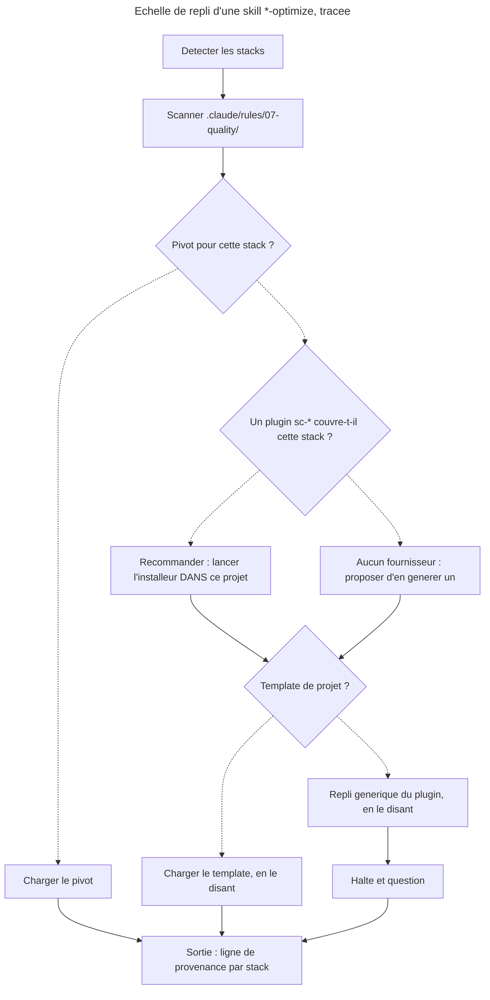

# Part 3 — Le passage sur les quatre `*-optimize`

## Feature

- **Summary** : instancier DEC-010 sur les quatre skills. Trois corrections du meme passage : la regle de tete rebornee, une ligne de provenance obligatoire en sortie, et le remede du garde-fou terminal remis dans le bon ordre.
- **Stack** : Markdown normatif · `plugins/overcode/skills/{web,data,ap,seo}-optimize`
- **Branch name** : `main`
- **Parent Plan** : `2026_07_31-11-declenchement-pivots-quittance-master.md`
- **Sequence** : 3 of 5
- Confidence : 9/10
- Time to implement : 2 h - 3 h (borne haute revue en iteration 17 : A5 = retrait, pas d'ajout de clause prospective)

**Les quatre skills sont plates** (aucune n'a d'`actions/`), toutes batties sur le meme squelette `## Goal / ## Rules / ## Quick Start / ## Workflow / Step 1..6 / ## Resources`. Les sites d'edition sont donc les memes aux memes endroits — sauf pour `seo`, dont la forme differe reellement (voir *Constat 1* du master).

## Architecture projection

### Files to modify

- `plugins/overcode/skills/web-optimize/SKILL.md` - regle `:30` rebornee (`template` -> distinction pivot/template), echelle `:151-156` tracee, provenance en sortie, remede `:156`
- `plugins/overcode/skills/data-optimize/SKILL.md` - idem (`:33`, `:157-162`)
- `plugins/overcode/skills/ap-optimize/SKILL.md` - idem (`:30` deja juste, `:111-115`), et la ligne `:220` de la table *Resources* devient un remede actionnable
  - 🔴 **Prerequis decouvert au run 1 de la part 1, non anticipe par le plan** : `ap-optimize` n'a **aucune sortie « la famille ne s'applique pas »**. `:102` mappe vers une liste fermee finissant par `other`, `:105` *exige* qu'un stack soit rapporte, donc sur un projet sans federation `:111` ne trouve rien, `:113` non plus, et `:114-115` **halte en proposant d'installer un plugin** — un faux positif sur une famille qui ne s'applique simplement pas. C'est ce qui fait tomber S10, le **seul ancrage vert** de `pivot-provenance-scenarios.md` : tant qu'il n'est pas leve, cette suite **ne peut pas prouver qu'elle n'est pas ecrite pour tout mettre au rouge**, ni au run 1 ni apres le fix. Corriger `:102` (admettre l'absence de stack comme issue), `:105` (ne plus l'exiger) et `:114` (ne pas proposer de remede quand il n'y a rien a remedier) — **avant** les autres editions de cette part, pour que le run 2 dispose d'un temoin. Defaut independant de l'issue #11 ; il tombe ici parce que le fichier est deja ouvert.
- `plugins/overcode/skills/seo-optimize/SKILL.md` - forme propre : pas d'etage template, garde-fou binaire, mention `sc-seo-*` retiree de `:30` (A5) et scan `:137` conserve/reformule — `:30`, `:137-141`
- `plugins/overcode/skills/web-optimize/SKILL.md` frontmatter `:9`, `data-optimize` `:10`, `ap-optimize` `:10` - la description porte le chemin de scan, a aligner si le contrat de sortie change
- ~~`plugin.json` / `marketplace.json` / CHANGELOG~~ — **rien ici** (arbitrage d'itération 3, master › *Où se pose le bump*). `overcode` est touché par les parts 1, 2 et 3 ; son bump unique est posé **en part 5**. Le garde M1 porte sur la description **du plugin**, jamais sur les frontmatters de skill : éditer un `description:` de `SKILL.md` ne le déclenche pas. Ce que cette part doit **signaler** à la part 5, c'est le cas où le nouveau contrat de sortie rend fausse la description du plugin `overcode` — c'est alors la part 5 qui la corrige des deux côtés.

### Files to create

- `plugins/overcode/references/pivot-providers.md` — la table `<stack> -> <plugin>, <commande d'installation>` (ajout d'iteration 8). **Sans elle, la quittance ne peut nommer aucun remede** : les listes de tete (`web:28`, `data:31`, `ap:28`) donnent l'ensemble des fournisseurs, pas la correspondance, et une skill qui tourne dans un projet ne voit pas les autres plugins du marketplace. Contenu derive **mecaniquement** des colonnes *Target* des cinq installeurs, une fois. Unique et partagee : les quatre skills la citent, aucune ne la recopie. **Le dossier `plugins/overcode/references/` est a creer** — `overcode` n'en a pas a sa racine, seules ses skills en portent. Le precedent est `design`, dont `references/` racine sert exactement a cela : un document partage entre plusieurs skills, cite par `${CLAUDE_PLUGIN_ROOT}/references/…` (`sc-pivot-contract.md`, lu jusqu'a l'exterieur du plugin). Sa peremption silencieuse est le risque a couvrir — d'ou la garde de build **M5**, posee en part 4 aux cotes de M4, meme boucle et meme cout marginal.

### Files to delete

- **A5 tranché le 2026-07-31 sur l'option B, périmètre précisé en itération 1** : ce qui part est la **mention prospective du plugin inexistant** (« or a future `sc-seo-*` plugin pivot », `:30`), consignée au CHANGELOG. `:137` — le scan de `.claude/rules/07-quality/seo-pivots-*.md` — est **conservé et reformulé** sans référence à `sc-seo-*` : `references/seo-geo-pivots.md:112` contractualise tout `seo-pivots-<sitetype>.md` externe **quelconque**, indépendamment de son fournisseur. Le retirer ferait tomber le compte des scanners de 4 à 3 et créerait chez `seo` le défaut que cette part corrige. Conséquence pour cette part : la ligne de provenance de `seo` **garde** son cas « pivot externe », rendu `aucun fichier installé` tant que rien n'est déposé.

## Applicable rules

| Tool | Name | Path | Why it applies |
|---|---|---|---|
| claude | DEC-010 | `aidd_docs/internal/decisions/010-pivot-consumer-receipt.md` | la regle que cette part instancie ; ecrite en part 2 |
| claude | DEC-008 | `aidd_docs/internal/decisions/008-pivot-follows-the-file.md` | la provenance se rend **par stack** — une valeur unique est fausse sur `choix-narratifs` ou `suddenly/app` |
| claude | DEC-007 §2 | `aidd_docs/internal/decisions/007-phase-as-classifying-authority.md` | l'instrument qui mesure ne tranche pas : la skill rapporte l'absence, elle ne decide pas d'installer |
| claude | plugins-marketplace | `~/.claude/rules/plugins-marketplace.md` | source, jamais cache ; bump et contenu dans le meme commit |
| claude | skill-writing-style | memoire personnelle | quatre reecritures du meme paragraphe : le moins de mots possible, formulation unique |
| claude | behave-eval-method | `aidd_docs/memory/behave-eval-method.md` | ne pas editer la cible pendant qu'un run est en vol — la part 1 doit etre close |

## User Journey



## Risk register

| Risk | Impact | Mitigation |
|---|---|---|
| La skill se met a **executer** l'installeur au lieu de le recommander | un audit qui ecrit dans `.claude/rules/` d'un projet tiers, sans demande | Regle dure : la skill **recommande**, elle n'installe jamais. DEC-007 §2. Un scenario de la part 1 doit pincer l'inverse |
| Les quatre formulations divergent | quatre interpretations d'une regle unique | Ecrire le paragraphe une fois en part 2, le copier ; relecture croisee finale — le meme controle avait trouve une divergence d'ordre en #10 part 5 |
| `seo` recoit le traitement des trois autres alors que sa forme differe | on ajoute un etage template et un remede « installer un plugin » qui n'existent pas chez elle | Constat 1 du master : `seo` a un garde-fou binaire, pas d'etage template, pas de regle en tete. Elle recoit **la ligne de provenance et le retrait de la mention `sc-seo-*` (A5)**, rien d'autre. Symetrie inverse a garder en tete : ne pas non plus lui retirer son scan de receptacle sous pretexte qu'aucun plugin ne le remplit |
| La ligne de provenance est rendue en valeur unique sur un depot polyglotte | fausse quelle qu'elle soit (DEC-008) | Copier la forme de `control/05-stats.md:161` : *« provenance rendue en valeur unique est fausse quelle qu'elle soit »*, rapport **par plugin applicable** |
| Le remede recommande pointe vers un installeur qui declare du vide | on recommande d'executer le defaut voisin | La part 4 est livree dans le meme lot ; ni 3 ni 4 ne se livre seule |
| La description du **plugin** `overcode` cesse de decrire ce que ses skills annoncent | elle enumere les capacites (`marketplace.json`, entree `overcode`) ; la quittance change ce que les quatre skills rendent | Si le contrat de sortie evolue au point que la description du plugin devient fausse, la part 5 la corrige **des deux cotes a la fois** — `plugins/overcode/.claude-plugin/plugin.json` **et** `.claude-plugin/marketplace.json`, byte pour byte, sans quoi M1 (`consistency.mjs:11`) rougit. **A ne pas confondre** : M1 compare les descriptions **de plugin**, jamais les frontmatters de skill — editer un frontmatter `description:` de `SKILL.md` ne peut pas la declencher, et n'appelle aucune repercussion |

## Implementation phases

### Phase 1 : reborner la regle de tete

> Elle existe deja sur trois skills, fausse d'un mot sur deux d'entre elles.

#### Tasks

1. `web:30` et `data:33` — remplacer `template` par la distinction : *aucun pivot de plugin ne couvre cette stack* (proposer d'en generer un) versus *un plugin couvre cette stack mais rien n'est installe ici* (recommander l'installeur). `ap:30` porte deja la bonne formulation, a etendre de la meme distinction.
2. `web:28`, `data:31`, `ap:28` — la ligne de repli de tete vers le mapping generique du plugin gagne sa condition de trace : le repli est autorise, il n'est pas silencieux.
3. `seo:30` — retirer la mention de plugin `sc-seo-*` (A5), conserver la precedence du pivot externe sur le fichier interne (elle est deja dans le bon sens : *« it takes precedence »*), et nommer l'etat de la branche externe : couverte par un fichier depose, ou sans fournisseur connu.
4. Verifier que la reformulation ne fait pas de la skill un decideur : elle **constate** et **recommande**.

#### Acceptance criteria

- [x] Les quatre `## Rules` distinguent explicitement « inexistant » de « non installe »
- [x] Aucune des quatre n'instruit d'executer un installeur sans demande
- [x] Les trois lignes de repli de tete portent une obligation de trace
- [x] La formulation est **identique** sur `web`, `data`, `ap` (modulo le nom du fichier de repli)

### Phase 2 : la ligne de provenance en sortie

> Un rapport qui ne dit pas d'ou vient sa checklist se lit comme complet.

#### Tasks

1. Definir la sortie, une fois, sur le modele de `control/actions/05-stats.md:19-21` — qui separe `provenance` d'un champ conditionnel adjacent. **Deux champs, jamais un** (correction d'iteration 8), une paire **par stack applicable** :

   ```
   source : <ce qui a ete charge>      # pivot <nom> | template <nom> | repli interne <fichier>[ §<section>] | genere <fichier|—>
   pivot  : <etat du pivot de plugin>  # installed | not installed (<plugin>, <commande>) | empty receptacle (<plugin>, <commande>) | no provider
   ```

   **Les deux axes sont independants et couramment vrais ensemble** : un run ou le pivot est `not installed` et la checklist chargee depuis le repli interne est le cas ordinaire. Fondus en un alternant unique, c'est toujours `pivot` qui se perd — c'est-a-dire le sujet de l'issue.
   - `source` rend l'etage effectivement atteint. **Les quatre skills ont un repli interne** : `framework-mapping.md` (`web:28`), `api-mapping.md` (`data:31`), `ap-protocol-specs.md` (`ap:28`), `seo-geo-pivots.md` (**`seo:138`** — corrige a l'iteration 31, `:139` est le garde-fou binaire, que cette part cite deja comme tel en `:139-141`) — chez `seo` c'est l'etage **nominal**, celui de presque tous les runs. L'etage `template` n'existe que chez `web`/`data`/`ap` (constat 1 du master).

     **Les quatre skills ont aussi un etage de generation, et il ne se confond pas avec le repli** (deal-breaker d'iteration 31). Sur acceptation de l'utilisateur, la checklist est **ecrite**, pas chargee : `web:158-165`, `data:164-172`, `ap:116`, `seo:141-147`. Chez `web`/`data`/`ap` l'alternant `template` le rend deja, et ce n'est pas un hasard — le produit de la generation **est** le template : `aidd_docs/templates/dev/<famille>_checklist_<stack>.md`, declare *« Auto-generated on first audit when missing »* (`web:263`, `data:293`). Chez `seo` il n'y a **aucune ligne `Template`** dans les Resources (`:230-237`) et la generation (12 sections + anti-patterns + commandes de verification) n'a pas de destination declaree : sans alternant propre, un run qui a ecrit sa checklist rendrait `repli interne seo-geo-pivots.md`, indiscernable d'un run qui a charge une section maintenue. D'ou `genere <fichier>` — `—` quand la destination n'est pas declaree, ce qui est le cas de `seo` et **reste hors perimetre de cette part** (lui en donner une est une decision de contenu sur `seo-optimize`, pas de quittance).
   - `pivot` rend les quatre etats de DEC-010 §1, dans l'ordre du DEC. **Le deuxieme est le deal-breaker de l'issue**, absent de toutes les sorties actuelles : un fournisseur existe, rien n'est installe ici. Il ne se confond ni avec `no provider` (aucun plugin ne couvre cette stack) ni avec `empty receptacle` (le dossier existe et ne porte **aucun fichier de regle** — meme remede, origine et diagnostic differents). **`.gitkeep` et fichiers de service ne comptent pas ; une regle hors pivot compte** (deal-breaker d'iteration 22, definition posee en `part-2:129`) : sans cette precision, la fixture qui prouve l'etat — `email-to-markdown/site`, qui porte un `.gitkeep` — n'etait pas « vide » et basculait en `not installed`. Et un receptacle **absent** ne rend jamais `empty receptacle` : il rend `not installed` ou `no provider`.
2. L'inserer dans le bloc de sortie de chacune des quatre skills, au meme endroit relatif.
3. Les deux alternants qui nomment un plugin (`not installed`, `empty receptacle`) portent la quittance dans la ligne meme : le nom du plugin **et** sa commande d'installation exacte. Le remede ne se cherche pas ailleurs — c'est ce que le garde-fou terminal impose aujourd'hui, et la phase 3 le corrige.
3-bis. **Creer la table de correspondance `<stack> -> <plugin>, <commande>`, sans laquelle la tache 3 est inapplicable** (deal-breaker d'iteration 8). `web:28` liste `sc-js, sc-php, sc-python, sc-tiers, sc-rust` **en bloc** — l'ensemble pretendu des fournisseurs, pas la correspondance ; et une skill `overcode` qui tourne dans un projet **ne voit pas** les autres plugins du marketplace, donc ne peut rien deriver a l'execution. La table est donc **statique**, unique, en `plugins/overcode/references/pivot-providers.md`, et les quatre skills la citent au lieu de la recopier.

   **La derivation se fait sur l'etat d'arrivee, pas sur l'etat courant** (deal-breaker d'iteration 11). Cette part s'execute **avant** la part 4, qui retire de `sc-tiers/01-install.md:27-29` les trois lignes `data-pivots-supabase`, `-dynamodb`, `-hasura` — declarees aujourd'hui, sans source sur disque. Une derivation naive les prend, la part 4 les retire, M5 passe au rouge et **la part 4 echoue sur sa propre `success_condition`** : le mecanisme exact du deal-breaker d'iteration 7, deplace d'une garde a l'autre. Regle : **une ligne n'entre que si sa source resout sur disque** — ce qui exclut les trois des la creation, et rend la table identique avant et apres la part 4. Le seul survivant `sc-tiers` est donc `data-pivots-firebase`.

   **`sc-css` n'entre pas non plus — mais pas par la regle ci-dessus** (correction d'iteration 18, qui rectifie l'iteration 16). Son installeur `sniff/actions/02-install-pivots.md` existe a HEAD et declare six pivots ; il est exclu par la **borne de forme** du paragraphe suivant, pas par la regle d'etat d'arrivee. Mesure : sa table (`:16-22`) s'intitule `| Pivot | Fichier installe | Declencheur |` et nomme `sc-css-custom-props.md`, `sc-css-layers.md`, `sc-css-specificity.md`, `sc-css-float-legacy.md`, `sc-css-prefixes.md`, `sc-css-prepro-vars.md` — des noms nus, **sans chemin de destination, sans `07-quality/`, sans famille**. Zero ligne satisfait `.claude/rules/07-quality/<famille>-pivots-<stack>.md`. C'est la meme observation que la part 4 `:120` porte deja cote garde : « la table sans colonne source, que M4 n'aurait **jamais** attrapee ».

   Consequence a ne pas se tromper : la derivation rend **36 cibles avec ou sans A1**, et non 42. Le disque porte six installeurs, la derivation en connait cinq — mais le sixieme tombe sur sa forme de table, pas sur l'ordre des parts. Les comptes de cette part (« cinq installeurs », « 36 cibles ») restent ceux de l'**arrivee** pour `sc-tiers`, dont les trois fantomes, eux, sont bien de forme conforme et n'echappent qu'a la regle d'etat d'arrivee.

   **Regle de derivation, bornee** (correction d'iteration 9) : n'entre dans la table que la cible de la forme `.claude/rules/07-quality/<famille>-pivots-<stack>.md`, `famille ∈ {perf, data, ap, seo}`. Le filtre n'est pas cosmetique : `sc-tiers/01-install.md` declare **12** cibles sous `.claude/rules/`, dont **8** ne sont pas des pivots (`03-firebase-resources.md` → `03-frameworks-and-libraries/`, `12-pagespeed-insights.md` → `07-quality/` mais sans stack, …). Sans borne elles entrent toutes, et **M5 les valide** puisque les fichiers existent bel et bien : la garde ne rattrape pas une derivation trop large. Ce qui reste apres filtre : `perf-pivots-*` chez `sc-js`/`sc-php`/`sc-python`/`sc-rust`, `data-pivots-*` chez les memes plus `sc-tiers`, `ap-pivots-django-activitypub` chez `sc-python` seul, `seo-pivots-*` chez personne.

   **Mesure de faisabilite** (iteration 12) : les cinq installeurs declarent **36 cibles pivot, toutes distinctes** — aucune stack n'est revendiquee par deux plugins. La correspondance `<stack> -> <plugin>` est donc bien une fonction, et une ligne de table suffit par stack. Apres retrait des trois fantomes `sc-tiers`, la table livree en compte **33**. Si une collision apparaissait plus tard, M5 ne la verrait pas : elle valide chaque ligne isolement, pas l'unicite de la cle.

   **Colonnes** : `<famille>-pivots-<stack>` · plugin fournisseur · **commande d'installation**. La commande est portee **par plugin**, jamais par famille : `sc-tiers` s'installe par `setup 01-install`, les **quatre** autres fournisseurs de la table par `sniff 02-install-pivots` (precision d'iteration 25 : `sc-css` porte bien un `02-install-pivots.md` a HEAD, mais il n'entre pas dans la table — borne de forme ci-dessus — et A1 le supprime ; compter « cinq autres » ferait naitre une ligne que le terme `! rg -q 'sc-css'` fait rougir). C'est la seule chose qui rend le remede de la phase 3 exact — et la raison pour laquelle **aucune des deux commandes n'est ecrite dans le corps d'une skill** : elles s'y liraient comme une regle generale, or aucune des deux ne l'est.

   **Forme de citation — exception a signaler** (deal-breaker d'iteration 10). `rg 'CLAUDE_PLUGIN_ROOT|\.\./\.\./' plugins/overcode/skills/ -g 'SKILL.md'` renvoie **0 occurrence** : dans `overcode`, toute reference est relative a la skill (`references/framework-mapping.md` = `skills/web-optimize/references/`). `pivot-providers.md` sera la **premiere** reference de racine du plugin citee depuis une skill. Un implementeur qui suit la convention locale ecrira `references/pivot-providers.md`, qui resout vers `skills/web-optimize/references/` — ou le fichier n'est pas. La forme obligatoire est donc `${CLAUDE_PLUGIN_ROOT}/references/pivot-providers.md`, sur le modele de `design` (`skills/harness/SKILL.md:17`, `skills/define/SKILL.md:22`, `agents/copycat.md:55`). Meme piege de base de resolution que le deal-breaker M4 d'iteration 7, cote redaction cette fois.

   Une stack absente de la table se rend `no provider` — jamais un nom devine.

3-ter. **Les listes de tete cessent d'enumerer les fournisseurs et renvoient a la table** (deal-breaker d'iteration 9). Mesure : `web:28` annonce `perf-pivots-*` fourni entre autres par **`sc-tiers`** — `rg -c 'perf-pivots-' plugins/sc-tiers/` renvoie **0 fichier** ; `ap:28` annonce `ap-pivots-*` fourni par `sc-python, sc-php, sc-js, sc-rust` — `ap-pivots` a **10 occurrences dans tout le depot**, toutes chez `sc-python` et `overcode`, **aucune** chez les trois autres. Ces enumerations sont le defaut meme que l'issue corrige, laisse dans le fichier qu'on corrige ; livrees telles quelles, elles contrediraient `pivot-providers.md` des le premier jour, et rien ne les garde. Deux formes hors table restent possibles en prose (`data:10`, `web:9`, `ap:10` en tete de frontmatter) : elles nomment la **famille de fichiers**, pas les plugins, et sont exactes — ne pas les toucher.
   - `web:28`, `data:31`, `ap:28` : remplacer l'enumeration parenthetique par un renvoi — *« fournis par les plugins `sc-*`, cf. `${CLAUDE_PLUGIN_ROOT}/references/pivot-providers.md` »*. Un seul site de verite, garde par M5.
   - `ap:28` perd de surcroit trois fournisseurs faux : apres renvoi, la table dit qu'il n'y en a qu'un.
   - **Troisieme site chez `web` seul** : `web:41`, en prose francaise, repete l'erreur (*« Les pivots installées par sc-js / sc-php / sc-python / sc-tiers »*, contexte perf). Meme correction — sans quoi la meme famille de defaut qu'aux iterations 5 et 7 se reproduit : une correction posee dans un site normatif et pas dans les autres du meme fichier. **Ne pas toucher `web:47`** (`sc-tiers verify` : compliance consent GTM/Clarity/Klaviyo), qui est exact et sans rapport avec les pivots.

3-quater. **Corriger la skill d'installation nommee** (deal-breaker d'iteration 9). `web:151` et `data:157` ecrivent *« installed by `sc-*` plugins via their `setup` skill »* : faux pour **quatre plugins sur cinq**. L'installeur est `skills/sniff/actions/02-install-pivots.md` chez `sc-python`, `sc-php`, `sc-rust`, `sc-js` ; seul `sc-tiers` passe par `setup` (`skills/setup/actions/01-install.md`). Un utilisateur qui suit la prose lance `sc-js:setup`, qui n'existe pas. Meme remede : la phrase cesse de nommer une skill et renvoie a la colonne *commande* de `pivot-providers.md`, seule a la porter par plugin. Coherent avec la phase 3, qui fait de cette commande le remede.
4. Verifier contre `Step 2 Success criteria` (`web:167`, `data:174`, `ap:118`, `seo:149`), qui aujourd'hui affirme le chargement sans jamais le rapporter — le critere doit devenir *charge **et rendu***.

#### Acceptance criteria

- [x] Les quatre skills emettent les **deux** champs, `source` et `pivot`
- [x] La paire est rendue par stack, jamais en valeur unique
- [x] Un run peut rendre `pivot : not installed` **et** `source : repli interne …` — les deux axes ne s'excluent pas
- [x] `source` sait nommer le repli interne des quatre skills, `seo` compris — c'est son etage nominal
- [x] `source` distingue une checklist **chargee** d'une checklist **ecrite a la volee** : chez `web`/`data`/`ap` par `template` (le produit de la generation, cf. `web:263`, `data:293`), chez `seo` par `genere` — sans quoi `seo:141-147` se rendrait comme `repli interne`
- [x] Les quatre etats de DEC-010 sont representables et **distincts**, `not installed` compris — c'est celui que l'issue ouvre
- [x] `not installed` et `empty receptacle` nomment le plugin **et** sa commande, tires de `pivot-providers.md` — jamais devines
- [x] Une stack absente de `pivot-providers.md` se rend `no provider`
- [x] `pivot-providers.md` ne contient **que** des cibles `07-quality/<famille>-pivots-<stack>.md` — les 8 cibles non-pivot de `sc-tiers` en sont absentes
- [x] La table porte une colonne *commande* par plugin, `sc-tiers` = `setup 01-install` distinct des **quatre** autres fournisseurs (`sc-css` n'y figure pas)
- [ ] Les quatre skills citent `${CLAUDE_PLUGIN_ROOT}/references/pivot-providers.md`, jamais `references/pivot-providers.md` — **non tenu, et volontairement** : trois skills la citent (16 occurrences, 0 sans prefixe), `seo` ne la cite pas du tout. Ecart assume, voir *Log*
- [x] Plus aucune enumeration de plugins fournisseurs en prose : `web:28`, `web:41`, `data:31`, `ap:28` renvoient a la table
- [x] `ap` ne nomme plus `sc-php`, `sc-js` ni `sc-rust` comme fournisseurs de `ap-pivots-*` — mesure : aucun des trois n'en produit
- [x] `web:151` et `data:157` ne nomment plus la skill `setup` — faux pour quatre plugins sur cinq
- [x] `web:47` (`sc-tiers verify`) est intact
- [x] Les quatre `Success criteria` de Step 2 exigent le rendu, pas seulement le chargement

### Phase 3 : le remede du garde-fou terminal

> L'option (a) actuelle renvoie l'utilisateur reinstaller un plugin deja installe.

#### Tasks

1. `web:156`, `data:162`, `ap:115` — l'option (a) devient *« lancer la commande d'installation du plugin qui couvre cette stack, telle que `pivot-providers.md` la donne »* ; l'installation du plugin ne vient qu'ensuite, et seulement si le plugin manque reellement.

   **Aucun gabarit `/sc-<x>:sniff 02-install-pivots`** (deal-breaker d'iteration 10). Mesure : `ls plugins/sc-tiers/skills/` renvoie **`setup` seul** — `sc-tiers` n'a pas de skill `sniff`, et sa commande est `setup 01-install`. Or il fournit `data-pivots-firebase.md`, donc il tombe dans le champ de `data:162`. Un gabarit uniforme y produirait `/sc-tiers:sniff 02-install-pivots`, commande inexistante : on remplacerait le remede faux d'aujourd'hui par un autre remede faux, au dernier pas de la correction. La commande se **lit** dans la table, elle ne se derive pas — c'est precisement pourquoi `pivot-providers.md` porte une colonne *commande* **par plugin** et non par famille.
2. Rendre la recommandation **anticipee** : des que la stack detectee a un plugin correspondant et que le receptacle est vide ou absent, la recommandation sort — sans attendre le garde-fou terminal, qui n'est atteint que quand ni pivot ni template ne couvre.
3. `ap:220` — la ligne passive de la table *Resources* (*« Installed by `sc-python:sniff` when Django+AP detected »*) devient un remede nomme dans le corps de la skill.
4. `seo` — **ne pas** ajouter d'option « installer un plugin » : son garde-fou `:139-141` est binaire et aucun plugin `sc-seo-*` n'existe pour etre recommande. Appliquer A5 a la place, et rendre l'etat du receptacle sans nommer de fournisseur.

#### Acceptance criteria

- [x] Aucune des trois skills ne propose d'installer un plugin comme premier remede
- [x] **Le nom de l'action installeur n'apparait dans aucune des trois** (correction d'iteration 25 : le critere exigeait l'inverse). Il n'y a pas d'action unique — `02-install-pivots` pour quatre fournisseurs, `setup 01-install` pour `sc-tiers` : l'ecrire dans le corps d'une skill, c'est etre exact pour quatre sur cinq, le defaut meme que 3-quater retire. Les deux noms vivent dans la colonne *commande* de `pivot-providers.md`, et nulle part ailleurs
- [x] Aucune des trois ne porte de gabarit `sc-<x>:sniff` — `sc-tiers` n'a pas de skill `sniff` et fournit pourtant un `data-pivots-*`
- [x] La recommandation se declenche a la detection, pas seulement au garde-fou terminal
- [x] `seo` n'a pas recu d'option inapplicable

### Phase 4 : homogeneite, sans bump

> ~~journaux, bump~~ — **retire le 2026-07-31 (correction d'iteration 5).** Meme motif que la part 2 : la part 5 est l'unique porteuse des bumps (master › *Ou se pose le bump*), et `overcode` est deja touche par les parts 1 et 2. Bumper ici en ferait le deuxieme, ou le troisieme.

#### Tasks

1. Relecture croisee des quatre `SKILL.md` : meme formulation, meme ordre, meme ligne de sortie. Consigner toute divergence trouvee.
2. Mettre a jour `tests.md` de `web`, `data`, `seo` (matrices de detection tenues a la main) si la reecriture change ce qu'elles decrivent. `ap-optimize` n'a pas de `tests.md` — ne pas en creer ici, la couverture comportementale est la suite `behave` de la part 1.
3. Verifier qu'aucun `plugin.json`, `marketplace.json`, `index.json` ni CHANGELOG n'a ete touche. Le bump `overcode` implique par cette part est **enonce**, pas ecrit : la part 5 le pose.
4. `pnpm test`.

#### Acceptance criteria

- [x] Les quatre skills sont strictement homogenes sur les trois corrections
- [x] `pnpm test` vert
- [x] `git status --porcelain` ne montre **aucun** `plugin.json`, `marketplace.json`, `index.json` ou `CHANGELOG.md` modifie
- [x] Rien n'est commite

## Amendments

## Log

### 2026-08-03 — prerequis fait, le reste de la part 3 non commence

Le prerequis rouge en tete des *Files to modify* est leve. `ap-optimize` admet desormais une issue **« la famille ne s'applique pas »**, distincte de `other`. Rien d'autre de cette part n'est touche : `pivot-providers.md` n'existe pas, les quatre `SKILL.md` n'ont pas leur ligne de provenance, `web`/`data`/`seo` sont intacts.

**Le critere de non-application est observable, et il exclut le faux positif du run 1.** La famille s'applique si le projet expose un endpoint **inbox ou outbox**, porte un **chemin de delivery** sortant, ou declare une bibliotheque ActivityPub. Elle ne s'applique **pas** sur du code de signature HTTP seul — c'est exactement ce que `ai-hub` porte (`muses/api/signature.py`, draft-cavage), et ce que les greps du *Quick Start* touchent. Sans ce dernier point, la correction laissait S10 rouge par une autre porte.

Cinq sites edites, tous dans `plugins/overcode/skills/ap-optimize/SKILL.md` :

| Site | Avant | Apres |
|---|---|---|
| Step 1 point 3 (ex-`:102`, → `:109`) | liste fermee finissant par `other` | `… , 'other'` **ou** `none`, renvoi au point 5 |
| Step 1 point 5 (**neuf**, `:110`) | — | le critere d'application, et l'ordre de **s'arreter** sans passer a Step 2 |
| Step 1 *Success criteria* (ex-`:105`, → `:112`) | « Stack + AP implementation pattern reported » | **deux** issues valides ; la seconde n'est pas un echec de detection |
| Step 2 point 4 (ex-`:114-115`, → `:121-124`) | garde-fou inconditionnel proposant d'installer un `sc-*` | garde conserve, **borne** : il presuppose que la famille s'applique, et n'est jamais emis sur `none` |
| Regle ex-`:30` (→ `:32`) | « propose generating one » sans condition | meme regle, bornee au cas ou la famille s'applique |

**Deux sites hors de la lettre du prerequis, edites parce qu'ils l'auraient contredit.** Le workflow mermaid ne portait aucune branche de sortie (`Detect --> Pick` en dur) : un nœud `Federation implemented?` est ajoute, sans quoi le diagramme dementait le texte. Et la regle de sortie fichier (ex-`:33`, → `:35`) imposait un chemin d'ecriture sans condition : elle dit maintenant qu'un stack `none` **n'ecrit aucun fichier** — la reponse est une ligne de conversation, pas un rapport vide sur disque. Le frontmatter `description:` gagne une phrase, pour la meme raison. Le garde M1 porte sur la description **du plugin**, pas sur celle d'une skill : aucun bump n'en decoule.

⚠ **Les ancres de ligne de `pivot-provenance-scenarios.md` ont bouge et ne sont pas mises a jour.** S10 cite `ap:102`, `ap:105`, `ap:111-115` ; les cibles sont desormais `:109`, `:112`, `:118-124`. Non corrige **volontairement** : le reste de la part 3 va decaler ces memes fichiers de nouveau, et la suite cite aussi `web:*`, `data:*`, `seo:*` qui n'ont pas encore bouge. Le rebasage des ancres se fait **en une fois**, quand la part 3 est close et avant le run 2. La colonne *Defect anchor* de S10 reste par ailleurs un constat de run 1 : ce qu'elle decrit etait vrai a la date du run, et le reste.

### 2026-08-03 — part 3 close, les quatre phases livrees

L'entree ci-dessus ne vaut qu'a son heure : les quatre phases sont desormais faites. `pivot-providers.md` existe (83 lignes, **33 lignes de pivot**, aucune cible hors `07-quality/`, aucune trace de `supabase`/`dynamodb`/`hasura`/`sc-css`), les quatre `SKILL.md` portent la paire `source` / `pivot` **au meme rang** — point 3 de Step 5 — et les quatre `Success criteria` de Step 2 exigent le rendu. Les 14 termes de la `success_condition` sont mesures verts, `pnpm test` passe (71 skills, 0 probleme), et `git status --porcelain` ne montre **aucun** `plugin.json`, `marketplace.json`, `index.json` ni `CHANGELOG.md`. Rien n'est commite.

**Un critere d'acceptation n'est pas tenu, et c'est la bonne issue.** « Les quatre skills citent `${CLAUDE_PLUGIN_ROOT}/references/pivot-providers.md` » : trois le font (16 occurrences, **0** sous la forme relative piegeuse), `seo` **ne cite pas la table du tout**. Le critere a ete ecrit avant que la forme propre de `seo` soit tranchee : chez elle `not installed` est **inatteignable** — aucun plugin ne fournit de `seo-pivots-*` — donc il n'y a aucun plugin ni aucune commande a y lire. L'y faire citer la table produirait une reference sans usage, et la `success_condition` du plan le dit deja : son terme `pivot-providers` porte sur `web`, `data`, `ap`, **jamais sur `seo`**. Le critere est en contradiction avec la condition de succes du meme plan ; c'est le critere qui a tort.

**Ancres de `pivot-provenance-scenarios.md` : rebasees, comme annonce.** Le ⚠ de l'entree precedente est leve. Le rebasage est **partiel par construction**, et la suite porte desormais la convention qui le dit : les ancres de **lieu** (colonnes *Situation*, *Pass criteria*, *Judge load path*) pointent HEAD au 2026-08-03 ; celles de la colonne *Instruction pinned* sont des **mesures du run 1** sur le texte d'avant-fix et gardent leurs numeros du 2026-07-31, parce que plusieurs de leurs citations verbatim n'existent plus a aucune ligne — rebaser le numero en gardant la citation fabriquerait une reference. Deux exceptions rebasees, dont le constat tient encore mot pour mot : `web:134-139` (carte de stacks sans entree Rust) et `web:145` (hybride traite pour l'audit seul). Le *Results log* n'est pas touche.

Correspondances appliquees : `web` `76-78`→`78-80`, `133-136`→`134-139`, `143`→`145`, `151-156`→`153-164`, `153`(template)→`159`, `154-156`→`160-164`, `262-263`→`283` · `data` `137-141`→`140-144` · `seo` `137-141`→`139-143` · `ap` `44`/`58`→`47`/`59`, `102`/`105`/`111-115`→`110`/`114`/`120-128`.

**Ce que la part 3 laisse ouvert.** S7 reste un **N/A durable** : aucune fixture du parc ne porte de `perf_checklist_<stack>` sous `aidd_docs/templates/dev/`, donc l'etage template — un des quatre barreaux que cette suite existe pour epingler — n'est toujours pas exerce. Ce n'est pas une dette de la part 3 : la corriger demande d'ajouter un depot au parc, pas d'editer une skill.

## Validation flow demonstration

1. Lancer mentalement `web-optimize` sur `lyremember/_code/site` (Nuxt, aucun pivot installe, `sc-js` en livre un) : la sortie nomme la stack, dit que le pivot existe mais n'est pas installe, et recommande `/sc-js:sniff 02-install-pivots` dans ce projet — commande **lue dans la table au moment du run**, jamais ecrite dans le `SKILL.md` : sur une stack fournie par `sc-tiers`, la meme sortie dirait `setup 01-install`.
2. Meme exercice sur `lyremember/_code/app` (pivots installes) : la sortie nomme le pivot charge. Les deux sorties sont **distinctes** — c'est le defaut central de l'issue, ferme.
3. Sur `email-to-markdown/_code/site` : le receptacle existe et est vide ; la sortie le dit et ne le confond pas avec « absent ».
4. Sur `choix-narratifs/_code` (Astro + Rust) : deux lignes de provenance, une par stack.
5. `pnpm test` : vert.
