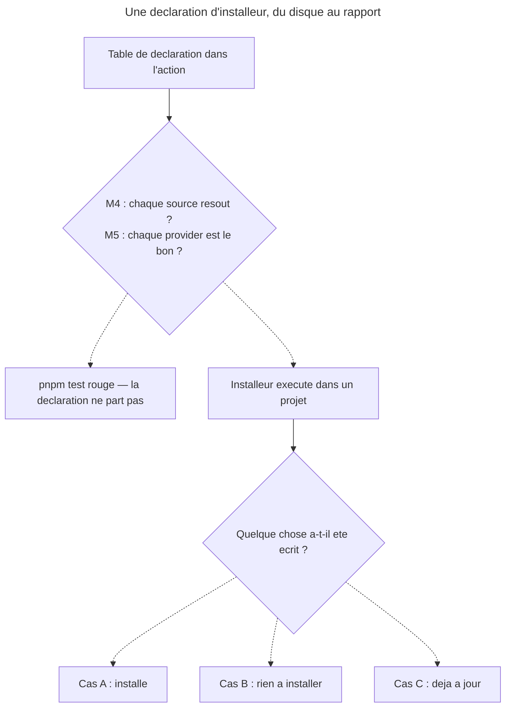

# Part 4 — Assainissement des installeurs + garde declare-vs-disque

## Feature

- **Summary** : deux installeurs declarent des fichiers absents du disque, trois autres figent une sortie qui affirme sans mesurer, et un chemin de la liste fermee de `sc-js:sniff clean` ne resout plus. Fermer les cinq, puis poser la garde qui empeche le sixieme.
- **Stack** : Markdown normatif + `tools/eval/consistency.mjs` (Node, ESM)
- **Branch name** : `main`
- **Parent Plan** : `2026_07_31-11-declenchement-pivots-quittance-master.md`
- **Sequence** : 4 of 5
- Confidence : 9/10
- Time to implement : 1 h 30 - 2 h (borne haute revue en iteration 17 : A1 = retrait au lieu d'ecrire six pivots, A2 = pas de doublage dans six actions)

**La condition de sortie vise `01-install.md`, pas `plugins/sc-tiers/skills/` — et cette borne est deliberee** (deal-breaker d'iteration 15). La suite `pivot-install-scenarios.md` ecrite par la part 1 vit sous `plugins/sc-tiers/skills/setup/evals/`, et son objet est le scenario « 4 pivots data prevus dont 3 inexistants » (part 1 `:169`) que le critere `:156` oblige a decrire par l'etat precis qu'il porte : la rediger en nommant les trois ids est la forme naturelle. Balayer tout `skills/` rendait donc cette part invalidable sans mutiler un registre **append-only**, c'est-a-dire sans detruire la preuve du « avant ». Ce qui doit disparaitre, ce sont les **declarations d'installeur**, jamais les mentions dans un fichier de preuve ou un journal. Ne pas relarger cette portee par souci de couverture.

**`sc-js` est le modele, pas une victime.** Son `## Output` (`02-install-pivots.md:44-…`) porte trois cas (A / B / C) et l'instruction explicite `:46` — *« Pick the header by what actually happened — never claim "installed" when nothing was written »*. Les trois autres installeurs de stack n'ont qu'un bloc unique. La correction consiste a porter cette forme, pas a l'inventer.

## Etat mesure

| Fichier | Ligne(s) | Defaut | Verifie |
|---|---|---|---|
| `plugins/sc-tiers/skills/setup/actions/01-install.md` | `:27`, `:28`, `:29` | declare `08-data-pivots-supabase.md`, `-dynamodb.md`, `-hasura.md` — **aucun des trois n'est sur disque** ; seul `:26` (firebase) resout | oui |
| idem | `:33-51` | sortie figee : *« 12 files written »* + *« Data pivots (4) »*, dont les trois fantomes | oui |
| `plugins/sc-css/skills/sniff/actions/02-install-pivots.md` | `:16-23` | declare 6 pivots ; **`skills/sniff/references/` n'existe pas** — zero source. Le fichier fait 29 lignes, tout son contenu utile est la table | oui |
| `plugins/sc-python/.../02-install-pivots.md` | `:47-64` | bloc de sortie unique, nomme des fichiers en `(installed)` / `(skipped)` sans mesure. **Sa table de declaration resout entierement** (9/9) | oui |
| `plugins/sc-php/.../02-install-pivots.md` | `:37-56` | idem (6/6 resolvent) | oui |
| `plugins/sc-rust/.../02-install-pivots.md` | `:35-51` | idem (4/4 resolvent) | oui |
| `plugins/sc-js/skills/sniff/actions/03-clean.md` | `:26` | `.claude/rules/capabilities/styling/design-system.md` est dans la liste fermee, mais `references/capabilities/styling/design-system.md` **n'existe pas** — la garde de content-match `:41` ne peut pas resoudre sa reference, donc l'orphelin n'est jamais supprimable. Les 12 autres chemins resolvent | oui |
| `plugins/sc-python/skills/sniff/references/capabilities/ap/django-activitypub.md` | `:13` | affirme *« Installed by `sc-python:sniff` as `ap-pivots-django-activitypub.md`. Loaded by `ap-optimize` »* — et **elle est effectivement declaree**, par `skills/sniff/SKILL.md:47-48`. L'autre source du meme target est `capabilities/protocol/activitypub-django.md`, declaree par `02-install-pivots.md:33` et par `01-scan.md:48`/`:195`. Deux fichiers, un seul target, **deux declarations concurrentes a deux endroits normatifs du meme plugin** — ce n'est pas un orphelin, c'est un conflit (ajout d'iteration 9, mesure corrigee a l'iteration 34 : « aucun installeur ne la declare » etait faux, cf. phase 3 tache 3) | oui |
| `CONTRIBUTING.md` | `:24`, `:106` | `:24` affirme que *« les tests (`tools/eval/`, `package.json`, workflow CI) sont **hors depot** (gitignores) — outillage local, non versionne par choix »*. **Les trois sujets sont faux** (mesure d'iteration 28, qui n'en tenait qu'un) : `tools/eval/` = **79 fichiers** suivis par git · `package.json` = suivi · `.github/workflows/test.yml` = suivi. `.gitignore` ne contient que `__pycache__/`. `:106` repete « hors depot » pour le seul `tools/eval/` | oui |

**Le vide de `sc-css` est plus profond que ses six ids — mais pas la ou l'iteration 1 le disait** (mesure refaite en iteration 23). L'iteration 1 affirmait *« `grep` de `pivot` dans `01-scan.md` renvoie **0 occurrence** »*, et en tirait *« ni sortie sur disque, ni entree produite … rien a rerouter »*. **Les deux sont faux.** Mesure : `rg -o pivot plugins/sc-css/skills/sniff/actions/01-scan.md` renvoie **5 occurrences sur 4 lignes** — `:5` (« Emettre un pivot manifeste JSON »), `:18` (« **Emettre le pivot manifeste** »), `:27` (`"pivots_recommended": [...]` dans le schema JSON) et `:40` (`📄 Pivot manifeste : <chemin>/css-pivot.json`, ligne de sortie). `01-scan` **produit** bel et bien le manifeste que `SKILL.md:14`/`:20` annoncent.

Le vide reel est ailleurs, et se mesure autrement : `rg css-pivot` sur tout le depot renvoie **une seule occurrence** — la ligne de sortie de `01-scan.md:40` elle-meme. Le manifeste est **produit et jamais lu** : son unique consommateur declare est `SKILL.md:21`, qui le donne en input de l'action 02. Consequence que la formulation d'iteration 1 faisait manquer : retirer l'action 02 **prive `01-scan` de son seul consommateur**, donc `01-scan.md` est un site d'edition de cette part au meme titre que `SKILL.md` — quatre lignes a traiter (`:5`, `:18`, `:27`, `:40`), pas « rien a rerouter ».

**Deux classes distinctes.** `sc-tiers` et `sc-css` declarent du vide — c'est le defaut de l'issue. `sc-python`, `sc-php`, `sc-rust` declarent juste mais **rapportent** faux : leur sortie figee affirme un resultat au lieu de le mesurer. Le second defaut est le meme que celui que la part 3 corrige cote `*-optimize` ; il se traite ici par coherence de lot.

## Architecture projection

### Files to modify

- `plugins/sc-tiers/skills/setup/actions/01-install.md` - retrait des 3 lignes fantomes ; sortie derivee au lieu de figee
- `plugins/sc-css/skills/sniff/actions/02-install-pivots.md` — **A1 tranché le 2026-07-31 sur l'option A** : l'action est retirée, les 6 ids consignés au CHANGELOG de `sc-css`. Les six fichiers `references/*.md` ne sont pas écrits ; la part reste dans son périmètre d'assainissement.
- `plugins/sc-css/skills/sniff/SKILL.md` — **obligatoire, sinon `pnpm test` casse** (ajout d'itération 1). Retirer le fichier d'action sans toucher au SKILL.md laisse la ligne de table `:21` sans cible : c'est exactement la règle **A1** de `consistency.mjs` (*« toute ligne de table résout vers un fichier d'action »*), et `pnpm test` est le dernier terme de la `success_condition` de cette part. **Quatre sites obligatoires, deux conditionnels** (recompte en iteration 23, complete a l'iteration 41 — il en manquait deux, et aucune garde ne les rattrape) :
  - `:21` — ligne de table `02 | install-pivots` : **supprimer**
  - `:25` — « Séquentiel : `scan` → `install-pivots` (si installation demandée) » : devient une skill à action unique
  - `:50` — « Ne pas installer de pivot pour un pattern non détecté » : **supprimer**, la skill n'installe plus rien
  - `:51` — « Signaler les gaps : pattern détecté mais aucun pivot plugin correspondant » : **supprimer**, et c'est le site le plus grave des quatre. Apres A1, `sc-css` ne porte plus **aucun** pivot de plugin (`rg -l 07-quality plugins/sc-css/` ne renvoie que l'action retiree et son declarant) : la regle laissee en place fait signaler un gap pour *chaque* pattern detecte — une skill qui annonce en permanence l'absence de fichiers inexistants, soit le defaut meme que ce lot corrige. C'est aussi, mot pour mot, la mitigation que le *Risk register* ci-dessous (« `sniff/01-scan.md` continue de signaler les gaps ») a **ecartee** a l'iteration 23 comme n'existant pas. Les deux lignes vivent dans `## Regles transversales`, hors de toute table : ni A1/A2 de `consistency.mjs` ni le critere `rg 'install-pivots'` de la phase 1 ne les voient
  - `:20` (colonne *Rôle* de `scan`, « Détecter architecture + stack, émettre pivot manifeste ») et `:14` (sous-titre « Détecteur d'architecture CSS et **producteur de pivot manifeste** ») — **conditionnels, pas obligatoires** (correction d'iteration 23). L'iteration 1 les listait au motif que « le manifeste n'a plus de consommateur » ; la mesure refaite montre que le manifeste **survit** au retrait — c'est sa cle `pivots_recommended` qui perd son lecteur, pas lui. Les deux lignes restent donc exactes en l'etat. Elles ne se corrigent que si le choix retenu sur `01-scan.md` (ci-dessous) va jusqu'a retirer le manifeste. Le partage obligatoire/conditionnel ne se lit pas sur le mot « pivot » — `:14` et `:20` le portent et survivent, `:50` et `:51` ne le portent pas moins et tombent : ce qui tranche est de savoir si la ligne parle du **manifeste** (survit) ou de l'**installation** (disparait).
  - Vérifié comme non-bloquant : la numérotation ne casse pas. `numberingPolicy` (`consistency.mjs:103-110`) ne détecte que les **doublons**, pas les trous — `01` restant seul ne déclenche rien, et il n'y a donc pas de renumérotation à faire.
- `plugins/sc-css/skills/sniff/actions/01-scan.md` — **site oublie jusqu'a l'iteration 23**, consequence directe du retrait de l'action 02. Le manifeste n'est pas un artefact mort : `02-install-pivots.md:9` ecrit *« Lire `pivots_recommended` du pivot manifeste (produit par `01-scan`) »* — c'est son **unique** lecteur dans tout le depot. Quatre lignes portent la chaine : `:5` (« Emettre un pivot manifeste JSON »), `:18` (« **Emettre le pivot manifeste** »), `:27` (la cle `"pivots_recommended"` du schema), `:40` (ligne de sortie `📄 Pivot manifeste : <chemin>/css-pivot.json`).
  - Ce qui **reste** : la detection d'architecture et de stack, et le manifeste comme sortie propre de `01-scan`. Ce n'est pas ce que le retrait touche.
  - Ce qui **perd son lecteur** : la seule cle `pivots_recommended` (`:27`). Deux issues acceptables, a trancher **par lecture** et non a l'aveugle — sur le modele du doublon `sc-python` de la phase 3 : soit la cle est retiree du schema, soit elle est conservee en la redocumentant comme recommandation lue par un humain. Ce qui n'est pas acceptable, c'est qu'elle continue de nommer une chaine automatique supprimee.
  - A verifier au passage : ses trois valeurs (`improve/custom-properties`, `improve/cascade-layers`, `legacy/float-to-flex`) ne resolvent vers **aucune** action reelle — `sc-css/skills/improve/actions/` porte `01-analyze`/`02-plan`, `legacy/actions/` porte `01-scan`/`02-migrate`. Ce sont des ids symboliques, ce qui pesera sur le choix ci-dessus.
- `plugins/sc-css/README.md` — **site ajoute a l'iteration 41**, seul README de plugin que ce lot invalide. `:3` (*« detection d'architecture, audit, modernisation et **enseignement par pivots** »*) et `:5` (*« … puis **charge a la demande les pivots applicables** »*) ne renvoient a rien d'autre qu'a la chaine `scan → install-pivots` : `teach/` ne porte aucune occurrence de « pivot », et le seul `references/` du plugin est `design-bridge/references/workflow-static.md`. Ce n'est pas de l'historique — que la regle « README = existant only » renvoie au CHANGELOG — mais l'**existant decrit**, qui change ; `CONTRIBUTING.md:108` l'exige coherent. Ce qui **reste vrai** et ne se touche pas : la ligne de table `:11` (le manifeste survit) et `:16` (`design-bridge`, sans rapport). Mesure faite sur les huit plugins bumpes : aucun autre README de plugin n'est atteint — `sc-tiers/README.md:13` porte deja *« Data pivot : Firebase/Firestore uniquement »*, et `sc-python`/`sc-php`/`sc-rust`/`sc-js` listent leurs pivots par **cible**, jamais par source, donc le doublon AP de la phase 3 ne les touche pas
- `plugins/sc-python/skills/sniff/actions/02-install-pivots.md` - sortie a trois cas, sur le modele `sc-js`
- `plugins/sc-php/skills/sniff/actions/02-install-pivots.md` - idem
- `plugins/sc-rust/skills/sniff/actions/02-install-pivots.md` - idem
- `plugins/sc-js/skills/sniff/actions/03-clean.md` - `:26` : retirer le chemin, ou restaurer sa reference
- `plugins/sc-python/skills/sniff/{SKILL.md, actions/02-install-pivots.md, actions/01-scan.md, references/capabilities/ap/django-activitypub.md}` - **deux sources concurrentes pour la cible `ap-pivots-django-activitypub.md`**, declarees a deux endroits normatifs du meme plugin (`SKILL.md:47-48` d'un cote, `02-install-pivots.md:33` + `01-scan.md:48`/`:195` de l'autre). Le nombre de fichiers touches depend de l'issue retenue — **retrait** de `ap/django-activitypub.md` : 1 site ; **promotion** : 3 sites (correction d'iteration 34, la ligne disait « source orpheline » et sous-estimait le remede). Phase 3 tache 3. Le fichier retenu et `02-install-pivots.md:33` doivent designer le meme
- `tools/eval/consistency.mjs` - nouvelles regles **M4** (toute source declaree par un installeur existe) et **M5** (toute ligne de `pivot-providers.md` joint une ligne de table d'installeur sur *Target* + plugin, **dont la source resout sur disque**)
- `CONTRIBUTING.md` - `:24` et `:106` : corriger l'affirmation « hors depot »
- **Aucun `plugin.json`, `marketplace.json` ni CHANGELOG** : la part 5 est l'unique porteuse des bumps et des journaux (master › *Ou se pose le bump*). Cette part livre du contenu et une garde, rien d'autre. Les plugins qu'elle touche — `sc-tiers`, `sc-css`, `sc-python`, `sc-php`, `sc-rust`, `sc-js` — sont bumpes en part 5, d'un seul cran, avec ce que les autres parts leur ont ajoute.

### Files to create

- aucun. (Les 6 `plugins/sc-css/skills/sniff/references/*.md` relevaient de A1 = option B, ecartee le 2026-07-31.)

### Files to delete

- `plugins/sc-css/skills/sniff/actions/02-install-pivots.md` — **A1 = option A, tranchee le 2026-07-31**. Le retrait s'accompagne obligatoirement des **deux** corrections de `SKILL.md` (`:21`, `:25`) et du traitement de `01-scan.md` listes ci-dessus, dans le meme commit.

## Applicable rules

| Tool | Name | Path | Why it applies |
|---|---|---|---|
| claude | DEC-010 | `aidd_docs/internal/decisions/010-pivot-consumer-receipt.md` | la quittance suppose que ce qu'un installeur annonce soit vrai |
| claude | DEC-009 §2 | `aidd_docs/internal/decisions/009-*.md` | un prerequis constate absent vaut champ absent : une source qui ne resout pas ne se rapporte pas comme ecrite |
| claude | plugins-marketplace | `~/.claude/rules/plugins-marketplace.md` | source jamais cache ; bump et contenu dans le meme commit |
| claude | README = existant only | memoire personnelle | le CHANGELOG porte le retrait des six ids `sc-css`, pas le README — **mais la regle coupe dans les deux sens** (precision d'iteration 41) : elle ecarte du README l'*historique*, elle y impose l'*existant*. `sc-css/README.md:3`/`:5` decrivent une capacite que A1 supprime, donc ils changent ici, et `CONTRIBUTING.md:108` (« README racine + README plugin + CHANGELOG coherents ») l'exige |
| repo | `CONTRIBUTING.md` « Avant de pousser » | `CONTRIBUTING.md:107` | *« Les `references` croisees (`${CLAUDE_PLUGIN_ROOT}/...`) pointent vers des fichiers existants »* — la regle existe deja en prose, M4 la rend executable. **`:107`, pas `:105`** (correction d'iteration 28) : `:105` porte *« Chaque action a un `Test` verifiable »*, qui ne fonde rien ici |

## User Journey



## Risk register

| Risk | Impact | Mitigation |
|---|---|---|
| Retirer l'action `sc-css` efface la trace de 6 pivots souhaitables | on reperd l'intention | Les 6 ids sont consignes au CHANGELOG du plugin — **c'est la seule trace, et elle suffit**. La mitigation d'origine ajoutait *« `sniff/01-scan.md` continue de signaler les gaps »* : ecarte en iteration 23, `01-scan.md:27` n'emet que `pivots_recommended: ["improve/custom-properties", "improve/cascade-layers", "legacy/float-to-flex"]` — trois cles symboliques qui ne resolvent vers aucune action reelle (`improve/actions/` porte `01-analyze`/`02-plan`, `legacy/actions/` porte `01-scan`/`02-migrate`), et qui ne recouvrent que la moitie des six ids retires |
| A1 = option B (ecrire les 6 pivots CSS) fait exploser le perimetre | la part 4 devient un chantier de contenu, pas d'assainissement | A1 tranche **avant** la part 4 ; l'option B sort du lot et devient une issue propre |
| M4 doit distinguer un chemin plugin d'un chemin projet | faux positifs sur toutes les colonnes `Target (in project)` | M4 ne verifie que les chemins prefixes `${CLAUDE_PLUGIN_ROOT}` ou relatifs a `references/` ; jamais `.claude/rules/...` |
| **Un chemin `references/…` est resolu depuis la racine du plugin** | **6 faux positifs sur le seul `sc-tiers`, `pnpm test` rouge, la part echoue sur sa propre `success_condition`** | Mesure le 2026-07-31 : `sc-tiers/01-install.md:13` declare `references/03-firebase-resources.md`, le fichier est en `plugins/sc-tiers/skills/setup/references/` — `plugins/sc-tiers/references/` **n'existe pas**. La base d'un chemin relatif est le **dossier de la skill** (`plugins/<p>/skills/<s>/`), celle de `${CLAUDE_PLUGIN_ROOT}/…` est la racine du plugin. Les deux bases coexistent et M4 les tient separees |
| **L'en-tete de colonne source varie d'un installeur a l'autre** | un parseur ancre sur l'intitule rate `sc-tiers` — l'installeur fantome n°1, motif de l'issue | Mesure (recomptee en iteration 23) : **quatre** fichiers ecrivent `\| Source (in plugin) \| Target (in project) \|` — `sc-js`, `sc-php`, `sc-python`, `sc-rust`, verifie par `rg -l` sur `plugins/` — et `sc-tiers/01-install.md:11` ecrit `\| Reference file \| Target path \|`. Quatre plus un : le « cinquieme » a intitule standard n'existe pas, l'erreur venait de compter `sc-tiers` deux fois. M4 s'ancre sur la **forme**, pas sur l'intitule : toute table dont la seconde colonne vise `.claude/rules/` voit sa **premiere** colonne verifiee. Un fichier peut porter plusieurs tables (`sc-rust/02-install-pivots.md:11` et `:17`) — les itérer toutes |
| M4 ne couvre pas `03-clean.md`, dont la liste fermee est un bloc de code, pas une table | la recidive reste possible sur cette forme | **Tranche le 2026-07-31 : couverture partielle assumee.** M4 ne lit que la forme *table markdown a colonne source* : apres le retrait de `sc-css`, **les cinq installeurs restants la partagent tous** (mesure). Deux formes restent hors garde et sont nommees dans le commentaire de la regle : le **bloc de code** de `03-clean.md` (une occurrence, corrigee a la main en phase 3), et la **table sans colonne source** — celle de `sc-css/02-install-pivots.md:16` (`\| Pivot \| Fichier installe \| Declencheur \|`), que M4 n'aurait **jamais** attrapee. Ecrire un parseur par forme unique coute plus que le defaut qu'il previent ; les nommer evite qu'une forme non couverte soit crue gardee |
| **Aucun des six installeurs ne pince sa sortie a l'execution** | la garde est de build seulement | **Correction d'iteration 27.** La ligne disait *« `sc-tiers` n'a pas d'`evals/` »* : **faux**, `plugins/sc-tiers/skills/setup/evals/scenarios.json` existe (mesure du 2026-07-31) — le master le disait deja au Log d'iteration 23 (« aucun `evals/` n'est a creer »). Ce que ce fichier pince est le **routage** (`prompt` → `expect_action`), jamais la sortie, et c'est le cas des **six** installeurs : tous portent ce meme `scenarios.json` et rien d'autre ; les suites `behave` en `*-scenarios.md` n'existent qu'ailleurs (`obs`, `overcode/control` — inventaire des 52 dossiers `evals/` du parc). La lacune n'est donc pas propre a `sc-tiers`. La suite `pivot-install-scenarios.md` de la part 1 la comble a l'execution — **six installeurs au run 1, cinq apres la phase 1 de cette part** (part 1 `:37`, `:188`) ; M4 couvre le build. Les deux sont necessaires |
| La correction de `CONTRIBUTING.md` passe pour un hors-sujet | revue bruyante | C'est un prerequis d'*A2* : la garde ne vaut que si l'outillage voyage. Une ligne de CHANGELOG le dit |

## Implementation phases

### Phase 1 : les deux installeurs fantomes

#### Tasks

1. `sc-tiers/setup/01-install.md` — supprimer `:27-29`. La section *Data pivots* ne conserve que firebase.
2. Reecrire son `## Output` (`:33-51`) : plus de total fige (*« 12 files written »*), plus d'enumeration pre-ecrite. La sortie derive de ce qui a ete ecrit, avec la meme discipline que `sc-js:46`. **Les trois ids y figurent une seconde fois, hors table** (`:48-50`) : la reecriture les emporte avec le reste de l'enumeration — le critere `rg` ci-dessous les compte partout dans `skills/`, pas seulement dans la table.
3. `sc-css/sniff/02-install-pivots.md` — appliquer *A1*, c'est-a-dire **supprimer le fichier d'action**, pas seulement ses six lignes de table. Aucun etat intermediaire ou l'action reste presente avec une table qui ne resout pas. Le retrait emporte **quatre** sites de `SKILL.md` (`:21`, `:25`, `:50`, `:51`) et **deux** du README du plugin (`:3`, `:5`) — cf. *Files to modify*. Les deux derniers de chaque paire sont hors de portee du `rg 'install-pivots'` du critere d'acceptation.
3-bis. **Le retrait remonte a `01-scan.md`** (ajout d'iteration 23). L'action supprimee etait l'unique lecteur de `pivots_recommended` (`02-install-pivots.md:9`). Trancher par lecture — cle retiree du schema, ou conservee et redocumentee comme recommandation lue par un humain — puis appliquer sur les quatre lignes concernees (`:5`, `:18`, `:27`, `:40`). Le manifeste lui-meme est **conserve** dans les deux cas ; ce qui doit disparaitre est la chaine automatique. Si et seulement si le choix va jusqu'a retirer le manifeste, les deux sites conditionnels de `SKILL.md` (`:14`, `:20`) suivent.
4. **Relever** — sans l'ecrire nulle part dans un CHANGELOG, cette part n'en touche aucun (master › *Ou se pose le bump*) — la liste exacte des ids retires, **sous une forme et une seule** : le **fichier cible**, celui qu'un projet aurait eu dans `.claude/rules/07-quality/`. Soit 3 pour `sc-tiers` (`data-pivots-supabase.md`, `data-pivots-dynamodb.md`, `data-pivots-hasura.md`) et 6 pour `sc-css` (`sc-css-custom-props.md`, `sc-css-layers.md`, `sc-css-specificity.md`, `sc-css-float-legacy.md`, `sc-css-prefixes.md`, `sc-css-prepro-vars.md`, colonne *Fichier installe* de `02-install-pivots.md:18-23`). Pas les cles (`improve/custom-properties`) : elles ne disent rien a qui lit le CHANGELOG depuis un projet. Elle est reprise telle quelle par la part 5, qui l'inscrit aux deux journaux au moment du bump. La consigner ici dans la section *Log* de cette part.

#### Acceptance criteria

- [x] `rg 'data-pivots-(supabase|dynamodb|hasura)' plugins/sc-tiers/skills/` ne renvoie rien — **`skills/`, pas la racine du plugin** : le CHANGELOG doit au contraire les porter (critere suivant)
- [x] Toute source declaree par `sc-tiers/setup/01-install.md` existe sur disque
- [x] `sc-css` n'expose plus d'action qui annonce des fichiers absents
- [x] `rg 'install-pivots' plugins/sc-css/skills/sniff/` ne renvoie rien — `SKILL.md` **et** `01-scan.md` compris ; `01-scan.md` existe toujours
- [x] **Relecture humaine de `sc-css/skills/sniff/SKILL.md` et de `sc-css/README.md`** : plus aucune phrase n'annonce d'installation de pivot ni de signalement de gap de pivot. Le `rg` ci-dessus ne suffit pas — `SKILL.md:50`/`:51` et `README.md:3`/`:5` ne portent pas la chaine `install-pivots`. Ce qui doit **survivre** a cette relecture : tout ce qui parle du **manifeste** (`SKILL.md:8`, `:14`, `:20`, `:32`, `README.md:11`) et de `design-bridge`
- [x] Les 9 ids retires (3 `sc-tiers` + 6 `sc-css`) sont ecrits dans le *Log* de cette part, prêts pour les journaux que la part 5 redige

### Phase 2 : les trois sorties figees

#### Tasks

1. Porter la forme `sc-js` (cas A / B / C + la phrase de discipline) sur `sc-python:47-64`, `sc-php:37-56`, `sc-rust:35-51`.
2. Ne **pas** toucher leurs tables de declaration : elles resolvent toutes (9/9, 6/6, 4/4 — mesure).
3. Verifier que la phrase de discipline est identique aux quatre, `sc-js` compris.

#### Acceptance criteria

- [x] Les quatre installeurs de stack portent trois cas de sortie
- [x] Aucun ne peut ecrire « pivots installed » quand rien n'a ete ecrit
- [x] Les tables de declaration sont inchangees

### Phase 3 : les affirmations d'installation non tenues

> Deux fichiers se disent installes par un installeur qui ne les nomme pas. Meme famille que les installeurs fantomes, sens inverse : la ou `sc-tiers` declare un fichier absent, ceux-ci sont presents et se declarent seuls.

#### Tasks

1. Trancher `sc-js/sniff/03-clean.md:26` : soit le chemin sort de la liste fermee (et un projet qui l'a installe **depuis `0.4.0`** — le fichier entre au depot avec `e24709e feat(sc-js): 0.3.0 → 0.4.0` — garde l'orphelin), soit la reference `references/capabilities/styling/design-system.md` est restauree pour que la garde de content-match `:41` resolve.
2. Recompter le total annonce dans la sortie de scan (`:57`, `:68`) si la liste change de taille.
3. Trancher le doublon de source AP de `sc-python` (ajout d'iteration 9). Deux fichiers visent le meme target `ap-pivots-django-activitypub.md` : `capabilities/protocol/activitypub-django.md` (13 290 o) et `capabilities/ap/django-activitypub.md` (9 515 o, qui affirme en `:13` etre installee). Le defaut n'est **pas** un doublon a dedupliquer a l'aveugle : les deux fichiers ont des tailles et des chemins differents, et rien ne dit lequel est le bon — c'est une **lecture des deux contenus** qui tranche, pas une regle. Deux issues acceptables : la seconde est retiree, ou elle devient la source declaree a la place de l'autre. Ce qui n'est pas acceptable, c'est que le plugin declare deux sources pour une meme cible.

   ⚠ **La seconde n'est pas orpheline, et le remede change en consequence** (deal-breaker d'iteration 34). La formulation precedente la disait orpheline et faisait de `02-install-pivots.md:33` « la seule declaree » : mesure du 2026-07-31, `sc-python/skills/sniff/SKILL.md:47-48` ecrit `Install target: ap-pivots-django-activitypub.md` / `Source: references/capabilities/ap/django-activitypub.md`. Il y a donc **deux declarations concurrentes**, a deux endroits normatifs du meme plugin, et **trois** sites a tenir alignes :

   | Site | Source qu'il declare |
   |---|---|
   | `skills/sniff/SKILL.md:47-48` | `capabilities/ap/django-activitypub.md` |
   | `skills/sniff/actions/02-install-pivots.md:33` | `capabilities/protocol/activitypub-django.md` |
   | `skills/sniff/actions/01-scan.md:48` et `:195` | `capabilities/protocol/activitypub-django.md` |

   D'ou le compte de sites a recabler selon l'issue : **retrait** de `ap/django-activitypub.md` → 1 site (`SKILL.md:48`, qui sinon pointe dans le vide) ; **promotion** de `ap/django-activitypub.md` → 3 sites (`02-install-pivots.md:33`, `01-scan.md:48`, `01-scan.md:195`). Sans ce compte, la tache produit un recablage partiel quelle que soit la lecture retenue.

   **Ni M4 ni M5 n'attrapent l'ecart** — M4 part des tables et verifie que chaque source declaree existe ; ici les deux existent, et la declaration divergente vit dans un `SKILL.md`, hors de toute table d'installeur. A nommer comme tel dans les commentaires (tache 5 de la phase 4).
4. **Relever** les deux choix retenus et leur consequence utilisateur dans le *Log* de cette part — sans ecrire au CHANGELOG, que la part 5 redige seule.

#### Acceptance criteria

- [x] Chaque chemin de la liste fermee a une reference plugin resolvable, ou est absent de la liste
- [x] La cible `ap-pivots-django-activitypub.md` a **une** source declaree et une seule : `SKILL.md:47-48`, `02-install-pivots.md:33` et `01-scan.md:48`/`:195` la nomment identiquement, et aucun fichier de `capabilities/` n'affirme etre installe sans etre celle-la
- [x] Le choix sur le doublon AP repose sur une comparaison des deux contenus, ecrite, pas sur la seule anciennete ou la taille
- [x] Les deux choix et leurs consequences utilisateur figurent dans le *Log* de cette part, en une formulation reprenable telle quelle par la part 5

### Phase 4 : les gardes M4 et M5

> `tools/eval/consistency.mjs` est **versionne** (79 fichiers suivis) — la garde voyage. Voir *correction A2* au master.

#### Tasks

1. Ajouter M4 **et M5** a l'en-tete de regles de `consistency.mjs` (`:11-13` portent M1, M2, M3).
2. La regle : pour chaque `plugins/*/skills/*/actions/*.md`, dans **toute** table dont la seconde colonne vise `.claude/rules/`, chaque chemin de la **premiere** colonne doit exister sur disque. Trois points non negociables, chacun mesure sur le depot (voir *Risk register*) :
   - **Ancrage sur la forme, jamais sur l'intitule** — `sc-tiers` ecrit `Reference file`, les cinq autres `Source (in plugin)`.
   - **Deux bases de resolution** — `${CLAUDE_PLUGIN_ROOT}/x` → `plugins/<p>/x` ; `references/x` → `plugins/<p>/skills/<s>/references/x`, le dossier de la **skill**. Confondre les deux rend 6 faux positifs sur `sc-tiers`.
   - **Toutes les tables d'un fichier**, pas la premiere : `sc-rust/02-install-pivots.md` en porte deux.

   Reutiliser l'enumeration de plugins existante (`:37`) et la lecture d'action deja faite par la boucle A1/A2 (`:166`) — cout marginal nul.
2-bis. **M5 — la table de correspondance ne se perime pas en silence** (ajout d'iteration 8). `plugins/overcode/references/pivot-providers.md`, creee en part 3, associe une stack au plugin qui la couvre et a sa commande. Elle est statique par necessite : une skill `overcode` executee dans un projet ne voit pas les autres plugins du marketplace. M5 verifie, au build, que **chaque ligne de la table joint une ligne de table d'installeur sur (*Target*, plugin) dont la source resout sur disque** — soit exactement : `pivot-providers.md` ⊆ le sous-ensemble de M4 borne aux cibles `07-quality/<famille>-pivots-<stack>.md`. Meme boucle que M4, cout marginal nul.

   **La condition « dont la source resout » n'est pas cosmetique** (deal-breaker d'iteration 11). Sans elle, « designe un fichier reellement produit » se lit de deux facons — *declare par un installeur*, ou *dont la source existe* — et le verdict de M5 sur `data-pivots-supabase` bascule selon qu'on l'evalue avant ou apres la **phase 1 de cette part**. Une garde dont le resultat depend de l'ordre des parts n'en est pas une. Avec la conjonction, M5 rend le meme verdict avant et apres, et la part 3 sait quoi ecrire sans connaitre l'etat de la part 4. Le sens inverse (un pivot installable absent de la table) est **hors garde** et nomme comme tel dans le commentaire : une table incomplete rend `no provider`, ce qui est faux mais pas dangereux ; une table qui nomme un mauvais plugin envoie l'utilisateur sur une commande qui n'installera rien.
3. Faire echouer volontairement (ajouter une ligne fantome temporaire) pour verifier que M4 rougit, puis retirer. Meme essai pour M5, en pointant une stack sur le mauvais plugin.
4. Corriger `CONTRIBUTING.md:24` et `:106`. **`:24` porte trois sujets, tous faux** — `tools/eval/`, `package.json` et le workflow CI sont **tous les trois** suivis par git (mesure d'iteration 28) : la reecriture les couvre tous, pas seulement `tools/eval/`. `:106` ne mentionne que `tools/eval/` ; y retirer « hors depot » suffit, la reserve « si present en local » restant utile pour qui n'a pas installe les dependances.
5. Chaque commentaire nomme ce que sa regle **ne** couvre **pas** — M4 : le bloc de code de chemins projet (`03-clean.md`), la table sans colonne source, et **le sens inverse** (une source declaree hors table d'installeur — un `SKILL.md` ou un fichier de `references/` qui nomme un couple source/cible que la table ignore ou contredit, cf. phase 3 tache 3) ; M5 : un pivot installable absent de la table. Sans quoi une forme hors garde serait crue gardee. Puis `pnpm test`.

#### Acceptance criteria

- [x] `node tools/eval/consistency.mjs` signale une source fantome introduite exprès
- [x] **Zero faux positif** : M4 est vert sur les cinq installeurs qui subsistent, `sc-tiers/01-install.md` compris — c'est le seul a chemins relatifs, et le seul a en-tete divergente
- [x] `pnpm test` vert apres retrait de la ligne d'essai
- [x] `CONTRIBUTING.md` ne dit plus que `tools/eval/`, `package.json` ou le workflow CI sont hors depot — les trois sujets de `:24`, pas le premier seul
- [x] La couverture partielle de M4 **et celle de M5** sont ecrites dans leurs commentaires, pas seulement dans ce plan
- [x] M5 rougit sur une stack pointee vers le mauvais plugin, et est verte sur la table livree en part 3
- [x] M5 rend le **meme verdict** sur la table livree qu'on l'evalue avant ou apres la phase 1 — sans quoi sa definition depend encore de l'ordre des parts
- [x] `git status --porcelain` ne montre **aucun** `plugin.json`, `marketplace.json`, `index.json` ni `CHANGELOG.md` modifie — cette part n'en touche pas (master › *Ou se pose le bump*)
- [x] Rien n'est commite

## Amendments

## Log

### 2026-08-03 — implementation des quatre phases

**Phase 1 — les deux installeurs fantomes.**

`sc-tiers/setup/01-install.md` : les trois lignes fantomes retirees de la table *Data pivots*, qui ne
conserve que firebase ; `## Output` reecrit — plus de total fige, une phrase de derivation (*« Report
what was written, not what the tables above list »*), un cas d'echec par source manquante et un header
`❌ sc-tiers rules — nothing written` quand tout manque. Les trois ids qui figuraient une seconde fois
hors table sont partis avec l'enumeration pre-ecrite.

`sc-css` : `02-install-pivots.md` retire par `git rm` (option A). Quatre sites de `SKILL.md` traites
(`:21` ligne de table, `:25` flow devenu action unique, `:50`/`:51` regles d'installation et de gap) ;
la `description` du frontmatter reecrite aussi — elle annoncait un manifeste *« consomme par audit,
improve et design-bridge »*, alors qu'aucun des trois ne lit `css-pivot.json` (le « manifeste » de
`design-bridge` est `components.json`). `README.md` : `:3` et `:5` corriges, `:11` aussi — il promettait
la meme consommation.

`01-scan.md`, tranche par lecture : **la cle `pivots_recommended` est retiree du schema**, pas conservee
et redocumentee. Motif mesure, celui que le plan mettait en reserve (*Files to modify* › « ce qui pesera
sur le choix ») : ses trois valeurs (`improve/custom-properties`, `improve/cascade-layers`,
`legacy/float-to-flex`) ne resolvent vers aucune action reelle — `improve/actions/` porte
`01-analyze`/`02-plan`, `legacy/actions/` porte `01-scan`/`02-migrate`. Redocumenter en « recommandation
lue par un humain » aurait conserve trois ids symboliques qui ne designent rien pour ce lecteur non plus.
Le manifeste survit ; sa sortie gagne `→ /sc-css:improve` / `→ /sc-css:legacy` et la phrase « Le manifeste
est le seul fichier ecrit ». Les deux sites conditionnels de `SKILL.md` (`:14`, `:20`) restent donc
intouches, comme l'iteration 23 le prevoyait.

**Les 9 ids retires, sous la seule forme du fichier cible** — a reprendre tels quels aux deux journaux
de la part 5 :

| Plugin | Cible qu'un projet aurait eue dans `.claude/rules/07-quality/` |
|---|---|
| `sc-tiers` | `data-pivots-supabase.md` |
| `sc-tiers` | `data-pivots-dynamodb.md` |
| `sc-tiers` | `data-pivots-hasura.md` |
| `sc-css` | `sc-css-custom-props.md` |
| `sc-css` | `sc-css-layers.md` |
| `sc-css` | `sc-css-specificity.md` |
| `sc-css` | `sc-css-float-legacy.md` |
| `sc-css` | `sc-css-prefixes.md` |
| `sc-css` | `sc-css-prepro-vars.md` |

Les six `sc-css` sont releves de la colonne *Fichier installe* de `02-install-pivots.md:18-23`, consignes
**avant** le `git rm` — le fichier n'existe plus, cette table est desormais leur seule trace jusqu'a
l'ecriture du CHANGELOG en part 5.

`pivot-providers.md:79` recompte au passage : « 12 cibles dont 8 n'en sont pas » → « **9** cibles dont 8
n'en sont pas ». Verifie que ni `sc-css` ni les trois pivots fantomes n'y figuraient : les 33 lignes de
pivot sont intactes.

**Phase 2 — les trois sorties figees.**

Forme `sc-js` portee sur `sc-python`, `sc-php`, `sc-rust` : trois `### Case` chacun, phrase de discipline
`Pick the header by what actually happened — never claim "installed" when nothing was written` identique
aux quatre (verifie par `grep` sur les quatre fichiers). Le cas B est motive par stack plutot que
recopie : pour Rust, *« a CLI, a library crate, or an embedded target has neither `axum` nor a SQL crate »*.
Tables de declaration inchangees (9/9, 6/6, 4/4).

**Phase 3 — les deux arbitrages, tranches par mesure.**

*Arbitrage 1 — `sc-js/sniff/03-clean.md:26`.* **Le chemin sort de la liste fermee.** Tranche par l'histoire
git, pas par l'intuition : `git log --all -- plugins/sc-js/skills/sniff/references/capabilities/styling/design-system.md`
**ne renvoie rien** — le fichier n'a jamais existe au depot. Or `03-clean.md` decrit la liste fermee de ce
que **sc-js 0.3.0 a pu installer** : une reference jamais versionnee n'a jamais pu etre ecrite dans un
projet. Restaurer la reference aurait fabrique un contenu neuf pour rendre supprimable un fichier que
personne n'a. Consequence utilisateur : **aucune** — aucun projet ne porte cet orphelin. Liste 13 → 12
chemins ; recomptages de la sortie de scan suivis (`Candidates examined: 7 of 12`, `Would skip (not
found): 6 files`, `Skipped — not found (6):`). Une clause ajoutee dit ce que la liste garantit desormais :
chaque chemin a une reference sous `references/capabilities/`, et *« if the guard finds no reference for a
candidate, skip the file and report it rather than deleting unverified content »*.

*Arbitrage 2 — le doublon AP de `sc-python`.* **Retrait de `capabilities/ap/django-activitypub.md`, apres
versement de son delta dans `capabilities/protocol/activitypub-django.md`, et realignement de
`SKILL.md:48`.** Ni « retrait » ni « promotion » nus : le seul geste qui laisse une source unique,
installee, et complete.

La comparaison, ecrite, et son renversement : un premier `grep` lexical (« pagination », « rate.limit »)
donnait `ap/` (9 515 o) couvrant deux sujets absents de `protocol/` (13 290 o) — ce qui aurait plaide pour
la promotion. **La lecture des corps l'a infirme** : `protocol/` traite la pagination outbox en §3
`:136-150` (sous le mot « pagine », que le `grep` anglais ratait) et le circuit breaker avec `410 Gone` en
§2 `:112`. Le delta reel se reduisait au package `django-ratelimit` et deux snippets. Ils sont verses en
`protocol/:68` — double cle IP **et** domaine distant, avec le motif operationnel (*les instances federees
ont des IP connues et stables*), les deux decorateurs, la commande de detection, et l'interdiction de
renvoyer `200` a la place du `429`. Rien n'est perdu au retrait.

Trois sites tenus alignes, comme le tableau d'iteration 34 l'exigeait : `SKILL.md:48` passe de
`references/capabilities/ap/django-activitypub.md` a `references/capabilities/protocol/activitypub-django.md`,
rejoignant `02-install-pivots.md:33` et `01-scan.md:48`/`:195` deja corrects. Consequence utilisateur :
`/sc-python:sniff` installe desormais, pour `ap-pivots-django-activitypub.md`, **le seul fichier que ses
trois declarations nomment** — la version complete, la plus longue, augmentee du rate limiting. Aucun
fichier de `capabilities/` n'affirme plus etre installe sans etre celui-la. La mention `capabilities/ap/`
ne subsiste que dans `plugins/sc-python/CHANGELOG.md` — journal historique, laisse intact.

**Phase 4 — les gardes M4 et M5.**

`consistency.mjs` : en-tete complete, `ruleInstallLine()` ajoutee, M4 branchee dans la boucle actions
existante (cout marginal nul), M5 en aval sur `pivot-providers.md`. M4 s'ancre sur la **forme** — toute
ligne de table citant une cible `.claude/rules/` voit ses sources verifiees — et non sur l'intitule de
colonne, qui diverge (`Reference file` chez `sc-tiers`, `Source (in plugin)` chez les quatre autres). Les
deux bases de resolution sont tenues separees : `${CLAUDE_PLUGIN_ROOT}/x` → `plugins/<p>/x`, relatif →
`plugins/<p>/skills/<s>/x`. **Formulee par ligne, pas par colonne** — ecart au libelle de la tache 2, motive
par une mesure : `sc-python/01-scan.md:195` met source et cible dans la **meme cellule**, separees d'une
fleche ; une regle « seconde colonne → premiere colonne » l'aurait manquee.

M5 alimente son ensemble `installable` uniquement depuis les lignes **dont toutes les sources resolvent** —
la conjonction du deal-breaker d'iteration 11. Verifie : elle rend le meme verdict avant et apres la phase 1,
donc independamment de l'ordre des parts.

Preuve que les deux mordent — injection temporaire d'une ligne `08-data-pivots-supabase.md` dans `sc-tiers`
et de deux lignes fausses dans `pivot-providers.md` :

```
✗ [M4] sc-tiers/skills/setup/01-install.md — source declaree absente : `references/08-data-pivots-supabase.md` …
✗ [M5] pivot-providers — `data-pivots-supabase.md` attribue a `sc-tiers` : …
✗ [M5] pivot-providers — `perf-pivots-nuxt.md` attribue a `sc-php` : …
✗ consistency — 3 incoherence(s)   exit=1
```

L'injection M4 a bien ete faite **dans `sc-tiers`** (test 2-bis) : c'est le seul installeur a chemins
relatifs et a en-tete divergente, un M4 vert par accident s'y serait vu. Injections retirees, retour a
`✓ consistency — 11 plugins`.

**Couvertures partielles nommees dans les commentaires**, pas seulement ici — M4 : le bloc de code de
`03-clean.md`, la table sans colonne source, et le **sens inverse** (une declaration hors table, comme celle
de `SKILL.md` que l'arbitrage 2 a corrigee a la main) ; M5 : un pivot installable absent de la table.

`CONTRIBUTING.md:24` : l'affirmation portait trois sujets, **tous faux** (`git ls-files` : `tools/eval/`,
`package.json` et `.github/workflows/test.yml` sont suivis ; `.gitignore` ne contient que `__pycache__/`).
Reecrite en « Les tests sont **versionnes** … ils tournent en local comme en CI ». `:106` devient « Les tests
passent : `pnpm test`. » et `:107` gagne la portee exacte de M4.

**Etat final.** `pnpm test` vert : `✓ consistency — 11 plugins` · `✓ 5/5 projet(s) conforme(s)` ·
`✓ 71 skills analyses — 0 probleme(s)` · `✓ selftest — 4/4 garde(s) OK`. `sc-css/skills/sniff` apparait
desormais en `○ suite de routage absente (1 action(s) routable(s) : scan)`, coherent avec le retrait.
`git status --porcelain` : aucun `plugin.json`, `marketplace.json`, `index.json` ni `CHANGELOG.md` modifie.
Rien n'est commite.

## Validation flow demonstration

1. `rg 'data-pivots-supabase' plugins/sc-tiers/skills/` : aucun resultat. (Sur `plugins/` entier le test serait faux des que la part 5 aura ecrit les journaux — l'id doit y survivre.)
2. Injecter une ligne `| references/inexistant.md | .claude/rules/07-quality/x.md |` dans un installeur, lancer `node tools/eval/consistency.mjs` : M4 rougit en nommant fichier et ligne. Retirer la ligne.
2-bis. **Le test inverse, obligatoire** : sur l'arbre propre, `node tools/eval/consistency.mjs` est vert alors que `sc-tiers/01-install.md` porte six sources `references/…` resolues depuis `skills/setup/` et un en-tete `Reference file`. Un M4 vert par accident — parce qu'il n'a rien lu de ce fichier — se distingue en injectant la ligne fantome **dans `sc-tiers`** et non ailleurs.
3. Relire les quatre installeurs de stack cote a cote : meme structure de sortie, meme phrase de discipline.
4. `pnpm test` : vert.

