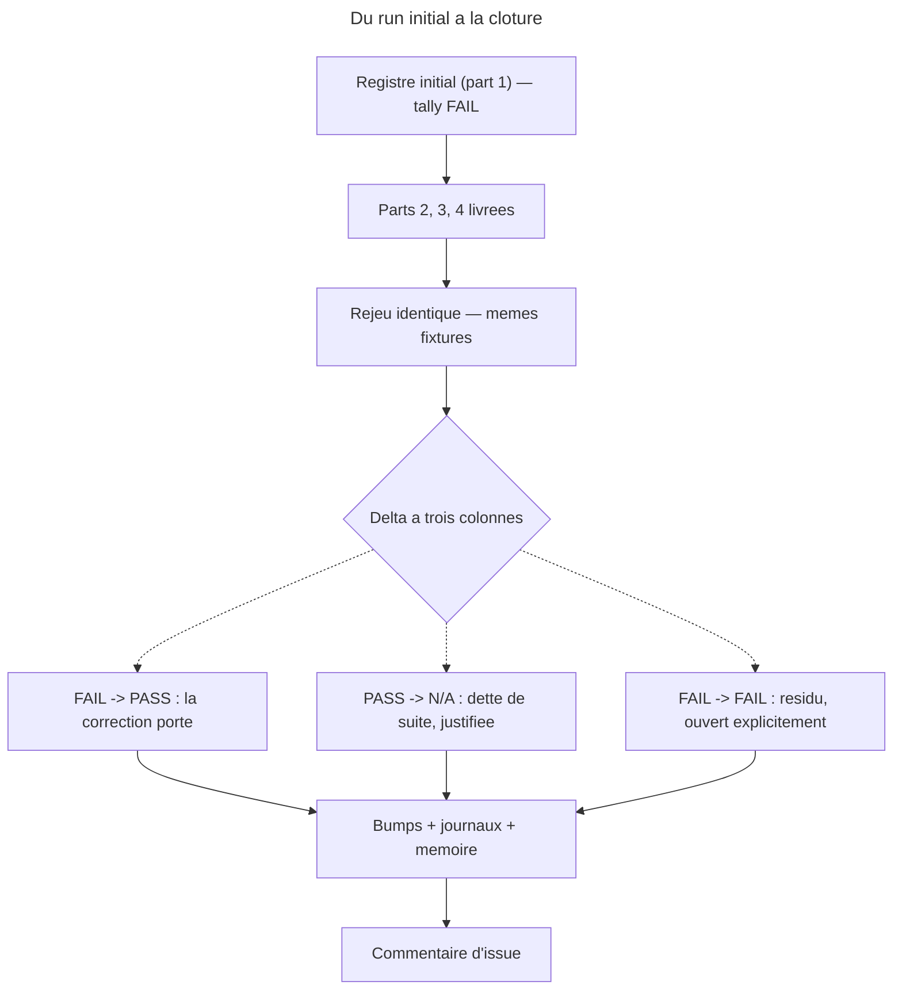

# Part 5 — Rejeu `behave` « apres », bumps et cloture

## Feature

- **Summary** : rejouer a l'identique les deux suites ecrites en part 1, sur les memes fixtures, dans les memes conditions ; consigner le delta a trois colonnes ; aligner versions, journaux et README ; rendre compte sur l'issue.
- **Stack** : `overcode:behave` · JSON de manifeste · Markdown
- **Branch name** : `main`
- **Parent Plan** : `2026_07_31-11-declenchement-pivots-quittance-master.md`
- **Sequence** : 5 of 5
- Confidence : 9/10
- Time to implement : 1 h 30 - 2 h 30

**`pnpm test` seul, sans appel prealable a `consistency.mjs`** (simplification d'iteration 28). La condition portait `node tools/eval/consistency.mjs && pnpm test` ; mesure : `package.json:7` definit `test` comme `node tools/eval/consistency.mjs && harness && coverage && selftest`. Le premier terme etait donc joue deux fois et laissait croire a une verification distincte. `pnpm test` couvre strictement plus.

**Deux invocations `rg -c` separees, et non une negation groupee** (deal-breaker d'iteration 14). La condition de sortie interrogeait `! rg --files-without-match 'post-fix' <suite 1> <suite 2>`. Mesure : sur un fichier **absent**, `rg` sort en code **2** — la negation rend alors **vrai**, et la part 5 se declarait verte sans qu'aucun rejeu ait eu lieu. Les deux suites naissent en part 1 ; leur absence doit faire rougir, pas passer. La forme retenue interroge chaque fichier **par un appel distinct** : un fichier manquant comme un fichier sans bloc `post-fix` echoue son propre appel. Ne pas les regrouper en un seul `rg` — ni `-q`, qui reussit des qu'**un** fichier matche, ni la negation ci-dessus.

**Le delta se lit a trois colonnes, jamais a deux.** Un `0 FAIL` au rejeu peut vouloir dire *corrige* ou *devenu inatteignable* : si la correction supprime l'etat qu'une ligne interrogeait, cette ligne bascule en `N/A` — ce n'est pas une reussite, c'est une dette de suite. Le tableau final porte donc `avant / apres / verdict`, et chaque `PASS -> N/A` est justifie ligne a ligne. **`FAIL -> N/A` est l'autre sens, et il en existe un cas connu d'avance** (ajout d'iteration 12) : le scenario `sc-css` de `pivot-install-scenarios.md` interroge une action que l'arbitrage A1 retire en part 4 — sa bascule est l'issue **nominale**, pas une dette. Il est le seul ; tout autre `FAIL -> N/A` est une ligne devenue injugeable et doit etre traitee comme une dette de suite.

## Architecture projection

### Files to modify

- Les deux suites de la part 1 : `pivot-provenance-scenarios.md` et `pivot-install-scenarios.md` - un second bloc de registre `post-fix`, en ajout, jamais en remplacement
- `plugins/*/.claude-plugin/plugin.json` — **les huit plugins de la table A4** en phase 2 ci-dessous, pas une fourchette (correction d'iteration 14 : « 6 a 8 » datait d'avant l'arbitrage A4, tranche le 2026-07-31, qui nomme les huit et leur cible) — et `.claude-plugin/marketplace.json` - versions et descriptions, byte pour byte. **Cette part est l'unique porteuse des bumps** (master › *Ou se pose le bump*) : les parts 1 a 4 n'ecrivent que du contenu. Un plugin monte **d'un seul cran**, au niveau fixe par A4, quel que soit le nombre de parts qui l'ont touche — `overcode` l'est par 1, 2 et 3 ; `web-tiers` par 1 et 4. Un commit **par plugin** : tout son contenu plus son bump — **neuf au total**, le neuvieme portant le hors-plugin (correction d'iteration 21, cf. phase 3 tache 5 et master › *Ou se pose le bump*). Pas d'exigence d'arbre propre entre deux : `marketplace.json` porte les huit versions dans un seul fichier.
- `plugins/*/CHANGELOG.md` (chaque plugin touche) + `CHANGELOG.md` racine (3.10.0 -> 3.11.0)
- `README.md` racine - seulement si une capacite decrite change ; la ligne `overcode` `:11` mentionne les *audits perf*, la quittance ne l'invalide pas. Mesure d'iteration 41 : les trois lignes relues (`:11`, `:17` `sc-css`, `:20` `web-tiers`) ne decrivent **aucune** capacite que ce lot retire — le racine ne bouge pas
- **Les README de plugin, eux, sont hors de cette part** : `CONTRIBUTING.md:108` les exige coherents, et le seul que ce lot invalide (`plugins/sc-css/README.md:3` et `:5`) est edite en **part 4**, avec le contenu dont il derive, donc dans le meme commit que le bump `sc-css`. `plugins/overcode/README.md:7` l'est en part 2. Rien a rouvrir ici — seulement a verifier (phase 3 tache 2)
- `aidd_docs/memory/pivots-testing.md` - ce que la campagne a appris, **en ajout au fichier existant** (verifie present) : il porte deja l'acquis de #10 sur le meme objet, un second fichier eclaterait le sujet

### Files to create

- aucun (`index.json` ne porte ni version ni description — M3 ; rien a y faire)

### Files to delete

- aucun

## Applicable rules

| Tool | Name | Path | Why it applies |
|---|---|---|---|
| claude | behave-eval-method | `aidd_docs/memory/behave-eval-method.md` | rejeu a conditions identiques ; registre append-only ; `PASS -> N/A` est un signal, pas un succes |
| claude | plugins-marketplace | `~/.claude/rules/plugins-marketplace.md` | bump et contenu dans le **meme** commit ; aucune install sur arbre sale |
| claude | README = existant only | memoire personnelle | le README decrit l'existant ; l'historique va au CHANGELOG |
| claude | Consignes projet | `Documents/CLAUDE.md` | **ne pas commiter ni pousser sans demande explicite** |
| repo | M1-M3, A1-A4, **M4-M5** | `tools/eval/consistency.mjs:11-18` (+ M4 et M5, livrees en part 4) | ⚠ **`A1`-`A4` ici sont les gardes du runner, sans aucun rapport avec les arbitrages `A1`-`A5` du plan** (phase 2 ci-dessous, master *Arbitrages*) : deux series homonymes cohabitent dans ce document — « bumper selon A4 » designe le niveau de bump, « passer A4 » designe les titres H1 d'action. Aucune n'est renommee, le runner et le master etant tous deux anterieurs ; les distinguer se fait au contexte, et cette case est le seul endroit qui le dit (deal-breaker d'iteration 15). Tout bump passe **toutes** les gardes, pas seulement la serie M. M1 compare les descriptions **de plugin** (`plugin.json` ↔ `marketplace.json`), jamais les frontmatters de skill · A1/A2 = tables de `SKILL.md` ↔ fichiers d'action, les deux sens · A3 = doublons de numero (les trous sont tolerés) · A4 = aucun titre H1 d'action ne porte son numero · M4 = tout chemin source declare par un installeur existe sur disque · **M5 = toute ligne de `pivot-providers.md` joint une ligne de table d'installeur sur (*Target*, plugin) dont la source resout sur disque** — reprendre cette formulation depuis la part 4 `:63` et non une paraphrase (correction d'iteration 14 : cette case portait encore la definition abandonnee en iteration 11, « designe un fichier reellement produit », dont le verdict dependait de l'ordre des parts) |
| repo | « Avant de pousser » | `CONTRIBUTING.md:102-108` | JSON valides · `pnpm test` · references croisees resolvent · **README racine _et_ README plugin** + CHANGELOG coherents avec la version. **Borne corrigee a l'iteration 41** : la case citait `:101-107` — `:101` est une ligne vide et `:107` s'arrete aux references croisees, ce qui coupait `:108`, la seule puce qui nomme le **README de plugin**. La glose « README+CHANGELOG coherents » effacait la distinction que la source porte, et c'est par la que `plugins/sc-css/README.md` etait sorti du perimetre (cf. part 4 *Files to modify*) |

## User Journey

## Risk register

| Risk | Impact | Mitigation |
|---|---|---|
| Le rejeu est fait par un juge qui a lu la correction | jugement complaisant | Sous-agents de jugement en contexte neuf, dry-run, fixtures READ-ONLY — comme au run initial |
| Une fixture a bouge entre les deux runs | delta non comparable | Relever l'etat des 11 fixtures avant rejeu ; toute derive est notee, la ligne concernee passe `N/A` avec motif |
| Le tally FAIL initial est reecrit au lieu d'etre complete | la preuve du « avant » disparait | Registre **append-only** ; le bloc `post-fix` s'ajoute sous le bloc initial |
| Un `FAIL -> FAIL` est passe sous silence pour clore | dette invisible | Tout residu devient une ligne de CHANGELOG et un point du commentaire d'issue, jamais un silence |
| Un bump touche `plugin.json` sans `marketplace.json` | M1 rouge, ou pire : vert et divergent en description | `pnpm test` apres chaque bump, pas seulement a la fin |
| Le lot est pousse alors que l'arbre est sale | une install capturerait un etat intermediaire | Aucun commit sans demande ; le plan s'arrete a l'arbre prêt |

## Implementation phases

### Phase 1 : rejeu

#### Tasks

1. Verifier que les parts 2, 3 et 4 sont livrees et que `pnpm test` est vert. Aucun rejeu sur un lot partiel.
2. Relever l'etat des 11 fixtures (presence/absence du receptacle `07-quality/`, contenu) et le comparer au releve de la part 1.
3. Rejouer `pivot-provenance-scenarios.md` puis `pivot-install-scenarios.md`, conditions identiques.
4. Ajouter a chaque suite un bloc de registre `post-fix` : date, cible, tally, et le tableau `avant / apres / verdict`.

#### Acceptance criteria

- [x] Les deux suites portent deux blocs de registre, l'initial intact
- [x] Chaque ligne a un verdict dans les deux runs
- [x] Chaque `PASS -> N/A` porte un motif ecrit — **aucun dans ce lot**, dans aucune des deux suites
- [x] Chaque `FAIL -> FAIL` est nomme comme residu ouvert — deux, S3 et S11 de la suite provenance

### Phase 2 : bumps et journaux

#### Tasks

1. Bumper, selon *A4* tranche le 2026-07-31 (master `:231-233` — **`:212-213` en iteration 41 et avant**, qui pointent les options B/C de *A1* et n'ont jamais porte de niveau de bump ; la table ci-dessous se suffit, mais le motif `design` → 2.8.0 se lit en `:232-233`), les plugins effectivement touches. **Colonne de gauche = etat a HEAD `2c96f2f`, colonne de droite = cible a ecrire** — les deux ne doivent jamais etre confondues (correction d'iteration 5 : cette tache listait les versions de depart) :

   | Plugin | Depart | Cible | Motif A4 |
   |---|---|---|---|
   | `overcode` | 4.2.0 | **4.3.0** | obligation de sortie additive, aucun consommateur ne casse |
   | `design` | 2.7.1 | **2.8.0** | `sc-pivot-contract.md` lu par des plugins tiers = interface publique (DEC-004 §5) |
   | `web-tiers` | 0.2.2 | **0.3.0** | retrait de declarations fausses : une table publique change |
   | `sc-css` | 0.3.3 | **0.4.0** | idem — A1 retire l'**action entiere** `sniff/actions/02-install-pivots.md`, pas seulement ses six lignes |
   | `sc-python` | 0.6.1 | **0.6.2** | patch — sortie derivee au lieu de figee |
   | `sc-php` | 0.10.0 | **0.10.1** | patch |
   | `sc-rust` | 0.5.0 | **0.5.1** | patch |
   | `sc-js` | 0.15.1 | **0.15.2** | patch — un chemin declare corrige dans `03-clean.md` |

   Un plugin non touche ne bouge pas. **Verifier la colonne *Depart* sur disque avant d'ecrire** : si elle a bouge depuis `2c96f2f`, c'est la cible qui se recalcule, pas le depart qui se force.
2. Repercuter chaque version **et description** dans `.claude-plugin/marketplace.json`, byte pour byte (M1).
3. Une entree par CHANGELOG de plugin touche + une entree racine (3.11.0), sur le ton des precedentes : ce qui a change et **pourquoi**, pas la liste des fichiers.
4. **Reprendre du *Log* de la part 4** les 9 ids de pivots retires, dans la forme qu'elle a fixee — le **fichier cible** (`data-pivots-supabase.md` …, `sc-css-custom-props.md` …), jamais la cle — et les inscrire nommement aux deux CHANGELOG concernes. Aucune autre part ne les ecrit : la part 4 les releve, cette part est leur seul point d'atterrissage. Y joindre les **deux** choix tranches en part 4 phase 3 : `sc-js/03-clean.md`, avec sa consequence pour un projet qui a deja installe le chemin ; et le doublon de source AP de `sc-python` (`capabilities/ap/django-activitypub.md` vs `capabilities/protocol/activitypub-django.md`), en disant lequel fait foi — le CHANGELOG de `sc-python` est le seul endroit ou un integrateur apprendra que la source a change de nom.
5. `node tools/eval/consistency.mjs` puis `pnpm test`.

#### Acceptance criteria

- [x] `pnpm test` vert
- [x] Aucun plugin non touche n'a bouge de version — `git diff .claude-plugin/marketplace.json` ne porte que **9** lignes changees : les 8 plugins de A4 et la version racine, aucune description
- [x] Chaque plugin bumpe a une entree de CHANGELOG datee — 8 entrees `2026-08-03`
- [x] `CHANGELOG.md` racine porte 3.11.0 et enumere les bumps
- [x] `rg -o 'supabase|dynamodb|hasura' plugins/web-tiers/CHANGELOG.md | wc -l` renvoie **3 au moins**, et les 6 ids `sc-css` figurent dans `plugins/sc-css/CHANGELOG.md`. **`-o`, pas `-c`** (correction d'iteration 14) : `rg -c` compte des **lignes** — mesure faite, une entree portant les trois ids sur une seule ligne renvoie `1`. Le critere aurait impose d'eclater la redaction sur trois lignes pour satisfaire l'outil

### Phase 3 : memoire et cloture

#### Tasks

1. Ecrire ce que la campagne a appris, la ou `pivots-testing.md` a consigne l'issue #10 : la quittance comme regle, la distinction *inexistant / non installe*, et le fait qu'une declaration d'installeur est une affirmation verifiable — donc verifiee au build.
2. Relire `README.md` racine (`:11`, `:17`, `:20`) : n'editer que si une capacite decrite a change — la mesure dit non, la relecture le confirme ou l'infirme. Puis verifier que les **README de plugin** livres par les parts 2 et 4 sont effectivement coherents (`CONTRIBUTING.md:108`) : `plugins/overcode/README.md:7` sur la formulation de quittance, `plugins/sc-css/README.md:3`/`:5` sur la disparition de l'installation de pivots. Verification, pas edition : si l'un des deux est encore faux, c'est la part correspondante qui est incomplete.
3. Rediger le commentaire de cloture pour l'issue #11 : les **7 items du §5 *Travail a faire, ordonne*** de l'issue, leur etat, les **5 corrections** apportees a son enonce (master `## Cinq constats qui corrigent l'issue`), les residus ouverts, et le lien vers le tableau de delta. Les deux comptes se relisent a leur source avant redaction, jamais de memoire.
4. **Ne pas commiter, ne pas pousser.** Rendre l'arbre prêt et rendre compte.
5. **Rendre la decoupe de commits que l'utilisateur executera** — elle n'est pas executee ici, elle est ecrite (precision d'iteration 21). **Neuf commits** : un par plugin bumpe (les huit de A4), portant tout son contenu **plus** son bump ; puis un dernier pour le hors-plugin — `tools/eval/consistency.mjs`, `CONTRIBUTING.md`, `aidd_docs/internal/decisions/010-*.md`, `CHANGELOG.md` racine et la version racine `3.10.0 -> 3.11.0` de `.claude-plugin/marketplace.json:4`. Le hors-plugin vient **en dernier** : M4/M5 ne doivent rougir sur aucun etat intermediaire.
   ⚠ **Ne pas exiger un arbre propre entre deux commits** (master › *Ce que « arbre propre » ne peut pas vouloir dire ici*) : `.claude-plugin/marketplace.json` porte les huit versions dans **un seul** fichier et reste modifie pour les sept autres plugins apres chaque commit. La contrainte qui tient est double et differente : bump et contenu d'un plugin dans le **meme** commit — M1 reste vert a chaque commit puisque `plugin.json` et sa ligne de `marketplace.json` bougent ensemble — et **aucune installation avant la cloture des neuf**.

#### Acceptance criteria

- [x] Un fichier de memoire porte l'acquis de la campagne — `aidd_docs/memory/pivots-testing.md`, en ajout : nouvelle section `# Pivots 07-quality — la quittance (#11, 2026-08-03)`, le H1 elargi, et une note d'orientation qui separe les deux campagnes
- [x] `plugins/overcode/README.md` et `plugins/sc-css/README.md` sont coherents avec ce que les parts 2 et 4 ont livre — verifie, pas edite ici. `overcode/README.md:7` porte les quatre etats + le lien `docs/concepts.md` ; `sc-css/README.md:3` et `:5` disent que le plugin n'installe aucun fichier de regle
- [x] Le commentaire d'issue couvre les 7 items du §5 de l'issue sans en declarer un ferme sans preuve — les items 1, 2, 3, 4, 7 s'appuient sur des lignes du delta ; 5 et 6 sont des livrables documentaires, declares tels et renvoyes a leurs fichiers
- [x] Les 5 constats du master `## Cinq constats qui corrigent l'issue` sont repris, y compris ceux qui la contredisent — plus les trois constats hors-issue
- [x] La decoupe en **neuf** commits est ecrite, le hors-plugin en dernier, et aucun commit n'est cree
- [x] `git status` montre l'arbre modifie et non commite

## Amendments

## La decoupe de commits — ecrite, non executee

Neuf commits. Un par plugin bumpe (contenu **plus** bump), le hors-plugin en dernier. Aucun n'est cree par ce plan.

| # | Portee | Contenu |
|---|---|---|
| 1 | `overcode` **4.3.0** | `plugins/overcode/` : `.claude-plugin/plugin.json` · `CHANGELOG.md` · `README.md` · `docs/concepts.md` · les 4 `SKILL.md` (`ap-`, `data-`, `seo-`, `web-optimize`) · 3 `tests.md` · **`references/pivot-providers.md`** (nouveau) · **`skills/web-optimize/evals/pivot-provenance-scenarios.md`** (nouveau) |
| 2 | `design` **2.8.0** | `plugins/design/` : `plugin.json` · `CHANGELOG.md` · `references/sc-pivot-contract.md` · `skills/enforce/actions/04-pivot.md` |
| 3 | `web-tiers` **0.3.0** | `plugins/web-tiers/` : `plugin.json` · `CHANGELOG.md` · `skills/setup/actions/01-install.md` · **`skills/setup/evals/pivot-install-scenarios.md`** (nouveau) |
| 4 | `sc-css` **0.4.0** | `plugins/sc-css/` : `plugin.json` · `CHANGELOG.md` · `README.md` · `skills/sniff/SKILL.md` · `skills/sniff/actions/01-scan.md` · **suppression** de `skills/sniff/actions/02-install-pivots.md` |
| 5 | `sc-python` **0.6.2** | `plugins/sc-python/` : `plugin.json` · `CHANGELOG.md` · `skills/sniff/SKILL.md` · `skills/sniff/actions/02-install-pivots.md` · `…/references/capabilities/protocol/activitypub-django.md` · **suppression** de `…/capabilities/ap/django-activitypub.md` |
| 6 | `sc-php` **0.10.1** | `plugins/sc-php/` : `plugin.json` · `CHANGELOG.md` · `skills/sniff/actions/02-install-pivots.md` |
| 7 | `sc-rust` **0.5.1** | `plugins/sc-rust/` : `plugin.json` · `CHANGELOG.md` · `skills/sniff/actions/02-install-pivots.md` |
| 8 | `sc-js` **0.15.2** | `plugins/sc-js/` : `plugin.json` · `CHANGELOG.md` · `skills/sniff/actions/03-clean.md` |
| 9 | hors-plugin, **en dernier** | `tools/eval/consistency.mjs` (M4, M5) · `CONTRIBUTING.md` · `aidd_docs/internal/decisions/010-pivot-consumer-receipt.md` (nouveau) · `aidd_docs/memory/pivots-testing.md` · les 6 fichiers de plan `aidd_docs/tasks/2026_07/2026_07_31-11-*` (nouveaux) · `CHANGELOG.md` racine · **la version racine `3.10.0 -> 3.11.0`** de `.claude-plugin/marketplace.json:4` |

**Chaque commit 1-8 emporte aussi sa ligne de `.claude-plugin/marketplace.json`** — celle du plugin, et elle seule. C'est la seule facon de tenir M1 vert a chaque etat intermediaire : `plugin.json` et la ligne du manifeste bougent ensemble.

Le manifeste porte **9 lignes changees**, toutes sur des numeros de version distincts (`4.2.0`, `2.7.1`, `0.2.2`, `0.3.3`, `0.6.1`, `0.10.0`, `0.5.0`, `0.15.1`, `3.10.0`) et separees par assez de contexte pour que `git` en fasse **9 hunks distincts**. Deux voies :

- **interactive** — `git add -p .claude-plugin/marketplace.json` avant chaque commit, ne retenir que le hunk du plugin ;
- **non interactive** — `git checkout HEAD -- .claude-plugin/marketplace.json` une fois au depart, puis avant chaque commit reappliquer la seule ligne voulue, p. ex. `sed -i 's/"version": "4.2.0"/"version": "4.3.0"/' .claude-plugin/marketplace.json`. Sans ambiguite : aucun des neuf numeros de depart n'apparait deux fois dans le fichier.

**Le hors-plugin en dernier, et c'est une contrainte de garde, pas de gout** : M4 et M5 arrivent au commit 9. Elles ne rougissent donc sur aucun etat intermediaire — un commit `web-tiers` pousse avant `sc-css` laisserait sinon six declarations fantomes sous une garde deja active.

**Ne pas exiger un arbre propre entre deux commits.** `.claude-plugin/marketplace.json` reste modifie pour les sept autres plugins apres chaque commit ; c'est normal et inevitable. La contrainte qui tient est double : bump et contenu d'un plugin dans le **meme** commit, et **aucune installation avant la cloture des neuf**.

## Log

| Date | Entree |
|---|---|
| 2026-08-03 | **Phase 1 — rejeu, deux juges en contexte neuf.** `pnpm test` vert avant tout rejeu ; les 11 fixtures relevees et comparees au releve de la part 1, **aucune derive** (mtime le plus recent : 2026-07-31 16:24, deja signale au run 1 comme sans effet sur les comptes). Suite installeurs : **6 PASS · 0 FAIL · 1 N/A** (run 1 : 1 · 6 · 0). Suite provenance : **8 PASS · 2 FAIL · 1 N/A** (run 1 : 0 · 10 · 1). Les deux blocs `post-fix` ajoutes sous le bloc initial, jamais en remplacement, avec le tableau `avant / apres / verdict` ligne a ligne. **Aucun `PASS -> N/A`** dans le lot ; l'unique `FAIL -> N/A` est le scenario `sc-css` de la suite installeurs — l'issue nominale prevue d'avance par A1, pas une dette. |
| 2026-08-03 | **L'ancre verte de la suite provenance est levee.** Le run 1 posait une condition prealable au run 2 : *« until `ap:102`/`:105`/`:114` admit a family-does-not-apply outcome, this suite cannot demonstrate that it is not merely written to make everything red »*. La part 3 a corrige les trois lignes ; S10 est vert. Sans cela, huit bascules FAIL -> PASS auraient ete inexploitables. |
| 2026-08-03 | **Deux residus ouverts, sur une cause deplacee.** S3 et S11 restent rouges : la quittance est reparee, la **detection** ne l'est pas. `grep 'Cargo.toml' web-optimize/SKILL.md` = 0 hit ; l'unique occurrence de `data-optimize` sert au test monorepo ; les deux cartes de stacks ne nomment aucun framework ni ORM Rust. Une stack Rust ne devient jamais *applicable*, donc aucune paire n'est construite. Hors du perimetre de #11 — mais les deux lignes ont cesse de mesurer ce que la suite declare mesurer, et doivent etre etendues a `Cargo.toml` ou scindees. Corollaire consigne : **S4 passe par le fourre-tout `other`**, pas par une reconnaissance de Rust. |
| 2026-08-03 | **Phase 2 — huit bumps, neuf entrees de journal.** Colonne *Depart* verifiee sur disque avant ecriture, conforme a `2c96f2f`. Versions repercutees dans `marketplace.json` ; `git diff` du manifeste = **9 lignes**, aucune description touchee (M1 sans objet). Les 9 ids de pivots retires inscrits nommement sous forme de **fichier cible** : 3 dans `web-tiers/CHANGELOG.md`, 6 dans `sc-css/CHANGELOG.md`. Les deux arbitrages de la part 4 phase 3 inscrits : `sc-js/03-clean.md` avec sa consequence pour un projet qui a deja installe le chemin, et le doublon AP de `sc-python` en nommant lequel fait foi (`capabilities/protocol/activitypub-django.md`, apres versement du delta du perdant). `pnpm test` vert : `consistency` 11 plugins, 71 skills 0 probleme, `selftest` 4/4. |
| 2026-08-03 | **Phase 3 — memoire, README, cloture.** L'acquis verse dans `pivots-testing.md` en ajout. Les trois README relus : le racine ne decrit aucune capacite que ce lot retire (`:11` parle d'audits perf, `:17` et `:20` ne mentionnent ni pivots CSS ni Supabase/DynamoDB/Hasura) — **il ne bouge pas**, la mesure d'iteration 41 est confirmee. Les deux README de plugin livres par les parts 2 et 4 sont coherents : verifies, pas edites. Commentaire de cloture redige a partir des deux sources relues verbatim (§5 de l'issue GitHub, `## Cinq constats` du master) — **non poste**. |
| 2026-08-03 | **Ce que le rejeu a coute a la suite provenance, et qu'il faut porter au harnais.** Trois defauts : *juge = auteur* **clos** ; *la suite annonce ses verdicts attendus* **aggrave** — huit annotations sur onze decrivent un texte qui n'existe plus a aucune ligne, un juge qui les recopierait rendrait six FAIL faux ; et la suite a **change de fonction**, de reproduction a non-regression, le controle negatif ayant disparu avec le dernier rouge de la famille. Quatre frictions mineures relevees et non corrigees ici : les criteres S2/S3/S6 citent `sniff 02-install-pivots` la ou la table porte `/sc-js:sniff` · la justification ecrite de S7 est fausse (des gabarits existent, aucun ne correspond a la stack de son porteur) · `framework-mapping.md:4` et `api-mapping.md:4` portent encore la phrase que S8 etait ecrite pour tuer · `nuxt3` (carte) contre `nuxt` (table) n'est reconcilie nulle part. |

## Validation flow demonstration

1. Ouvrir `pivot-provenance-scenarios.md` : deux registres, le premier avec des `FAIL`, le second avec le delta.
2. Prendre une ligne `FAIL -> PASS` et retrouver dans les parts 2 a 4 l'edition qui la fait basculer. Si aucune ne se retrouve, la bascule est suspecte.
3. `node tools/eval/consistency.mjs` : 0 constat.
4. `pnpm test` : vert.
5. `git status --porcelain` : non vide, aucun commit cree.
