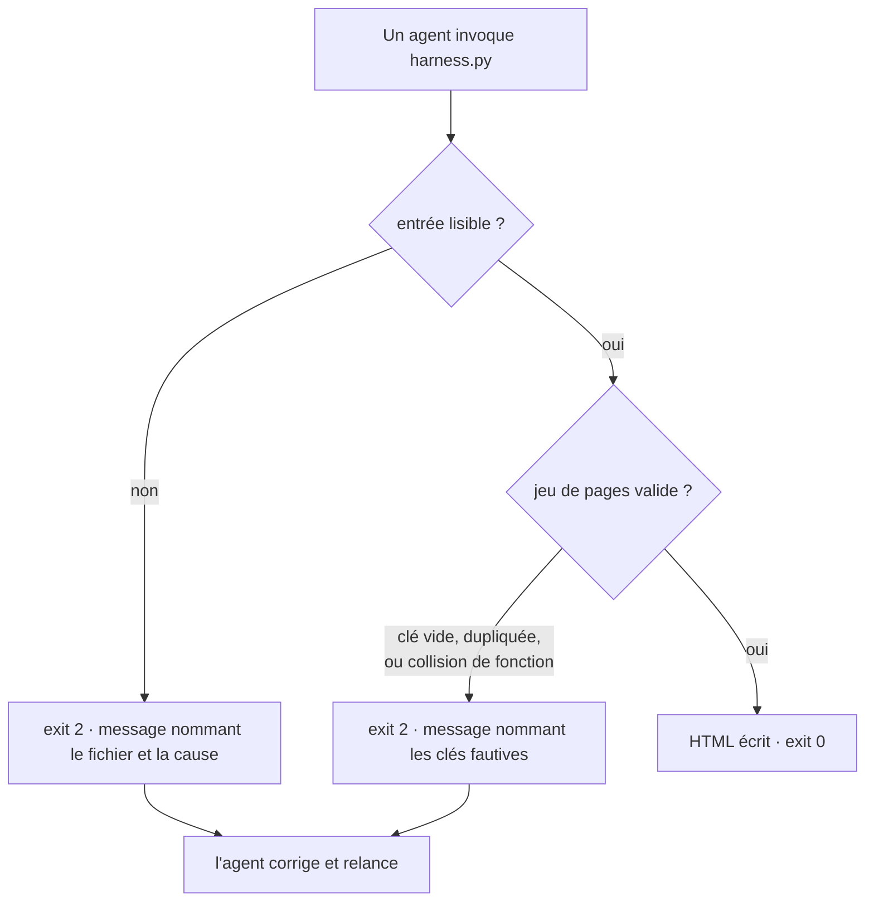

# Instruction: espace de codes et validation des entrées

Ferme les 6 constats de `code-quality.md`. Après cette phase, aucune invocation de `harness.py` ne rend 1, et aucun jeu de pages invalide ne produit un HTML faux en silence.

## Architecture projection

```txt
.
└── plugins/design/
    ├── adapters/harness/harness.py   ✏️  lecture --pages-json gardée · validate_pages() · échappement HTML unifié · substitution en une passe
    ├── skills/harness/SKILL.md       ✏️  la portée de l'espace 0/2/3 cesse d'être restreinte à --contract · limite de la virgule dans --pages
    └── references/harness-contract.md ✏️  la table des codes couvre les entrées --pages* et pas seulement le contrat
```

## User Journey



## Tasks to do

### `1)` Ramener `--pages-json` dans l'espace 0/2/3

> Aucun chemin de lecture ne doit remonter une exception Python à l'appelant.

1. Encadrer `harness.py:426-428` : `FileNotFoundError`, `UnicodeDecodeError` et `json.JSONDecodeError` sortent en 2, chacun avec un message nommant le chemin passé et la cause.
2. Valider la forme après lecture — liste, ou objet portant `pages` ; chaque entrée est un dict portant au moins `key`. Toute autre forme sort en 2 en nommant l'index fautif. Cela couvre aussi le `KeyError` latent de `:450` (`pages[0]["key"]`).
3. Traiter `label` comme facultatif : à défaut, retomber sur `key`, comme le fait déjà `parse_pages_str:49`.

### `2)` Valider le jeu de pages avant génération

> Une seule fonction, appelée entre la résolution des pages et la génération.

1. Écrire `validate_pages(pages)` appelée **après** le bloc « no pages defined » (`:434-437`), pas avant : sur une liste vide, c'est le message existant qui doit sortir, et non un message de validation dont le silence dépendrait d'un détail de la nouvelle fonction.
2. Refuser en 2, en nommant les clés fautives : clé vide ou blanche · clé dupliquée · deux clés distinctes dont `key_to_fn` dérive le même nom de fonction — le tiret et l'underscore (`my-page` / `my_page`), mais aussi la casse (`A-b` / `a-b`, tous deux `pageAB`) : comparer les **noms dérivés**, jamais les clés.
3. Refuser en 2 toute clé dont `key_to_fn` ne dérive pas un identifiant JS valide. Le test est `key_to_fn(k).isidentifier()`, **pas** une regex ASCII : Python et JS suivent tous deux UAX-31, donc `isidentifier()` est plus strict que JS sans jamais l'être à tort, et il laisse passer `café` — une clé légitime qu'un `^[A-Za-z][A-Za-z0-9]*$` rejetterait. Le préfixe `page` interdit par construction toute collision avec un mot réservé. Mesuré le 2026-08-05 : `--pages '/contact/:Contact'` écrit `function page/contact/()` et sort **0** ; dans Chromium le premier `<script>` meurt sur `Unexpected token '/'`, `pages` n'est jamais défini, et `measure.py:191` lève `ReferenceError: pages is not defined` — son garde `window.setPage && …` ne protège pas, puisque `window.setPage` est bien posé par le **second** `<script>`. C'est le plus grave des modes d'échec du générateur : un fichier mort livré en vert.
4. Conserver le chemin « no pages defined » (`:436`) tel quel — il est déjà correct, la nouvelle fonction s'aligne sur son style de message.

### `3)` Unifier l'échappement HTML

> Le même label doit produire le même texte dans le sélecteur et dans la page.

1. Importer `html` (stdlib) et appliquer `html.escape` dans `build_options` : `:72` et `:76` sur `label`, sur l'attribut `value=` (avec `quote=True`), et `:74` sur `label=` de l'`optgroup`.
2. Aligner `build_functions:87` sur la même fonction plutôt que sur son remplacement de `<`/`>` fait à la main, en gardant l'échappement du quote simple nécessaire au littéral JS.
3. Échapper `args.title` avant la substitution `:446`.

### `4)` Substituer en une passe

> Un titre ne doit pas pouvoir être relu comme une sentinelle de template.

1. Remplacer la chaîne de `.replace()` de `harness.py:442-450` par une passe unique — `re.sub(r"%%(\w+)%%", …)` contre un dict de valeurs — pour que la valeur injectée par une sentinelle ne soit jamais rebalayée par la suivante.
2. Conserver le comportement de `%%TOKENS_STYLE%%\n`, qui absorbe le saut de ligne quand le style est vide.

### `5)` Aligner les deux textes normatifs

> Ils ne disent pas la même chose sur la portée de la règle.

1. `SKILL.md:62` — retirer la restriction « sous `--contract` uniquement » : la règle vaut pour tout le programme, comme l'énonce `references/harness-contract.md:26` et comme l'affirme le commentaire `harness.py:435`.
2. `harness-contract.md` — étendre la table des codes aux entrées `--pages` / `--pages-json`, aujourd'hui absentes alors que le texte les couvre implicitement.
3. `SKILL.md`, table des paramètres — documenter que `--pages` découpe sur `,` sans échappement possible, et renvoyer vers `--pages-json` dès qu'un label porte une virgule.

## Test acceptance criteria

| Task | Acceptance criteria                                                                                                                                                         |
| ---- | ----------------------------------------------------------------------------------------------------------------------------------------------------------------------------- |
| 1    | `--pages-json` sur un fichier absent, sur du non-JSON, et sur `["home","contact"]` rendent chacun **2** avec un message sur stderr nommant le chemin ; aucun traceback Python |
| 2    | `--pages 'my-page:A,my_page:B'`, `--pages 'home:A,home:B'` et `--pages '/contact/:C,blog/post:A'` rendent chacun **2** en nommant les clés ; `--pages 'home:Accueil,contact:Contact'` rend toujours 0. Contre-épreuve dans Chromium : tout harness produit en 0 charge sans **aucune** erreur de page |
| 3    | `--pages 'p1:Fiche <b>produit</b>'` produit le **même** libellé dans l'`<option>` et dans l'appel `placeholder(...)`, et le document généré ne contient aucun élément `<b>` ; `--title 'x --> y'` laisse le commentaire de cadrage LLM (`:216`) fermé, le document reste parsable |
| 4    | `--title 'A %%PAGE_OPTIONS%% B'` produit un `<title>` contenant littéralement `%%PAGE_OPTIONS%%`, et le sélecteur de pages reste correctement peuplé                          |
| 5    | Aucune phrase de `SKILL.md` ni de `harness-contract.md` ne restreint l'espace 0/2/3 à `--contract` ; la limite du séparateur `,` est écrite dans la table des paramètres      |
