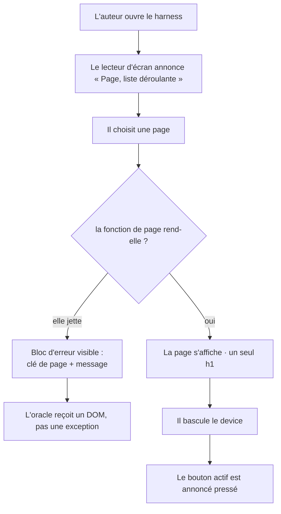

# Instruction: le harness produit

Ferme les 6 constats de `ui.md`. Après cette phase, le fichier généré respecte l'invariant de titrage qu'il prescrit, son chrome est nommé pour un lecteur d'écran, et une fonction de page qui échoue devient un état visible au lieu d'une exception.

## Architecture projection

```txt
.
└── plugins/design/
    ├── adapters/harness/harness.py  ✏️  h1 dans placeholder() et le repli · aria-label du select · aria-pressed · aria-hidden · --lang · preconnect supprimés · try/catch dans render()
    └── skills/harness/SKILL.md      ✏️  ligne --lang dans la table des paramètres
```

## User Journey



## Wireframe

Le chrome ne change pas visuellement — cette phase pose des attributs et un niveau de titre. Le seul élément nouveau à l'écran est l'état d'erreur, qui prend la place occupée aujourd'hui par le repli « Page introuvable ».

```txt
┌──────────────────────────────────────────────────────────────┐
│ ▚ Titre du projet   [ Page          ▾]  [🖥 Bureau][📱…]     │  .preview-bar
│   maquette de référence                  ↑ aria-pressed      │
├──────────────────────────────────────────────────────────────┤
│  ┌────────────────────────────────────────────────────────┐  │
│  │                                                        │  │
│  │   ⚠  La page « contact » n'a pas pu être rendue        │  │  ← h1, état nouveau
│  │                                                        │  │
│  │   TypeError: undefined is not a function               │  │  ← message de l'exception
│  │                                                        │  │
│  │   Corrigez pageContact() dans ce fichier.              │  │
│  │                                                        │  │
│  └────────────────────────────────────────────────────────┘  │  .preview-frame
└──────────────────────────────────────────────────────────────┘
```

## Tasks to do

### `1)` Poser le `h1`

> Le fichier cesse de contredire la règle qu'il énonce ligne 200.

1. `harness.py:258` — `placeholder()` rend un `h1` au lieu d'un `h2`.
2. `harness.py:279` — le repli « Page introuvable » rend un `h1`.
3. Vérifier que la règle `:200` (« Un seul h1 par page ») et le code d'échafaudage montrent désormais la même chose à l'agent qui remplit le fichier.

### `2)` Nommer le chrome

> Trois attributs et une ligne de JS.

1. `harness.py:231` — `aria-label="Page"` sur le `select`, aligné sur le `role="group" aria-label="Device"` déjà présent `:230`.
2. `harness.py:235-237` — `aria-hidden="true"` sur les trois `<svg>` décoratifs ; les boutons portent déjà leur texte.
3. Poser `aria-pressed` initial sur les trois boutons et le maintenir dans `setViewport` (`:289-296`), dans le même `forEach` que `classList.toggle('active')` — l'état visuel et l'état exposé ne doivent pas pouvoir diverger.

### `3)` Donner un état d'erreur à `render()`

> Le mode d'échec attendu d'un fichier rempli par un agent est une fonction de page cassée.

1. `harness.py:277-281` — le `try` englobe **`const fn = pages[currentPage]` autant que `fn()`**, pas le seul appel. La résolution du registre est la ligne qui échoue en premier quand le registre n'existe pas (`pages is not defined`, mesuré) ; un `try` posé autour du seul `fn()` laisserait passer le mode d'échec le plus fréquent.
2. En cas d'exception, rendre le bloc d'erreur du wireframe : clé de page, message de l'exception, et la ligne indiquant quelle fonction corriger.
3. Ne rien propager à l'appelant : `window.setPage(k)` doit revenir normalement, puisque `measure.py:191` l'appelle sans garde.
4. Écrire aussi l'erreur dans la console pour ne pas la perdre.

### `4)` Rendre la langue et les polices explicites

> Deux valeurs codées en dur dans un générateur agnostique.

1. Ajouter `--lang` (défaut `en`) et substituer dans `<html lang="…">` (`:106`) — le générateur et sa documentation sont en anglais, le français y est un reste.
2. `harness.py:111-112` — **supprimer** les deux `preconnect` Google Fonts, ne pas les rendre conditionnels. Aucun chemin du générateur ne déclare de police distante : le seul CSS injecté est la feuille de tokens du contrat, et la conditionner reviendrait à écrire une branche que rien ne peut déclencher. Si un style inliné importait un jour une police distante, le `preconnect` ne serait qu'une optimisation — pas une raison de garder deux requêtes tierces dans un fichier vendu comme autonome.
3. `SKILL.md` — une ligne `--lang` dans la table des paramètres.

## Test acceptance criteria

| Task | Acceptance criteria                                                                                                                                          |
| ---- | ---------------------------------------------------------------------------------------------------------------------------------------------------------------- |
| 1    | Un scaffold à 2 pages contient exactement **un** `h1` par page affichée ; la page d'une clé inconnue en contient un aussi                                     |
| 2    | Dans Chromium, `#page-select` a un `ariaLabel` non nul ; après `setViewport('mobile')`, le bouton mobile porte `aria-pressed="true"` et les deux autres `"false"` |
| 3    | Deux contre-épreuves : (a) une fonction de page qui jette, (b) un registre `pages` absent. Dans les deux cas le cadre affiche le bloc d'erreur nommant la clé, `window.setPage(k)` revient sans lever côté Playwright, et la page précédente a disparu |
| 4    | Sans `--lang`, le document est `lang="en"` ; avec `--lang fr`, `lang="fr"`. Un scaffold nu ne contient aucun `preconnect`                                     |
