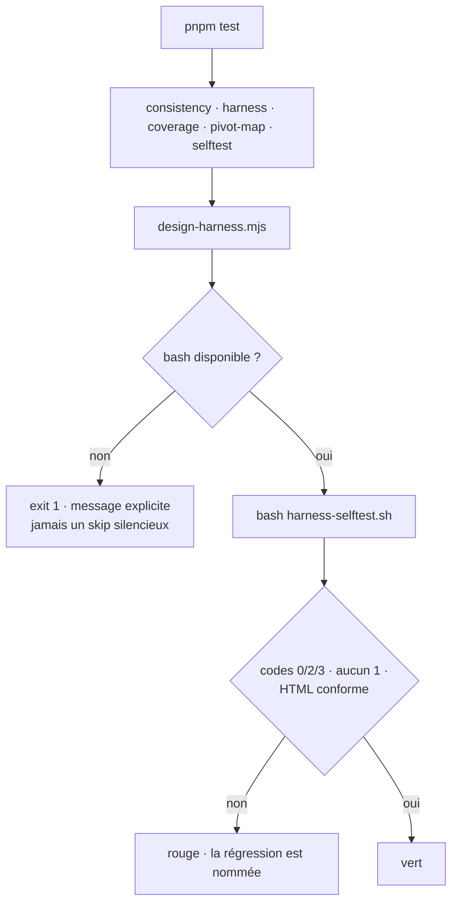

# Instruction: la preuve opposable

Ferme les 5 constats de `tests.md`. Après cette phase, `pnpm test` casse si l'un des correctifs des phases 1 et 2 régresse — ce qui n'est le cas d'aucun aujourd'hui.

## Architecture projection

```txt
.
├── package.json                                    ✏️  la chaîne `test` gagne un maillon
├── tools/eval/design-harness.mjs                   ✅  runner : invoque le selftest du plugin, échec dur si bash est introuvable
└── plugins/design/
    ├── tools/harness-selftest.sh                   ✏️  assertions sur le HTML produit · garde « jamais 1 » · branches --pages*
    ├── skills/harness/SKILL.md                     ✏️  table d'actions — sans elle la couverture reste « non vérifiable »
    ├── skills/harness/evals/scenarios.json         ✏️  3 scénarios sur l'axe pages
    └── references/harness-contract.md              ✏️  le couplage temporel transition/oracle est déclaré
```

## User Journey



## Tasks to do

### `1)` Étendre le selftest à l'espace des codes

> Le trou par lequel passe le 🔴 de la phase 1 : le selftest n'asserte que des codes attendus, jamais l'interdit.

1. Généraliser `check()` d'abord. Sa signature actuelle (`name want contract_dir`, `:17-30`) ne sait passer que `--contract` ; elle devient `name want <args…>` pour couvrir aussi `--pages` et `--pages-json`. Toutes les invocations de `harness.py` du selftest passent par elle — c'est ce qui rend le garde de l'étape 3 possible en une seule ligne.
2. Ajouter les branches d'entrée malformée : `--pages-json` sur fichier absent, sur non-JSON, sur `["home","contact"]` ; `--pages 'home:A,home:B'` ; `--pages 'my-page:A,my_page:B'` ; `--pages '/contact/:C'`. Chacune attendue en **2**.
3. Ajouter le garde générique **dans `check()`** : aucune invocation de `harness.py`, quelle que soit la branche, ne rend 1 — un `got` à 1 échoue même si le `want` de la ligne valait 1. À ne pas confondre avec le code de sortie du selftest lui-même, qui vaut 1 quand il échoue (`:69`) et le reste. Le garde est distinct de l'assertion « code attendu » — c'est lui qui aurait attrapé le défaut.
4. Conserver les six cas existants (`:32-37`) — leurs noms et leurs codes attendus sont corrects et ne bougent pas ; seule leur ligne d'appel suit la nouvelle signature (`check "2x" 0 --contract "$FIX/2x"`).
5. **Rester en POSIX `sh`.** Le shebang est `#!/usr/bin/env sh` (`:1`) alors que l'en-tête d'usage lance `bash` (`:7`) : le script tourne aujourd'hui sous les deux. Aucune construction ajoutée ici ne doit changer cela — pas de `[[ ]]`, pas de tableau, pas de `${v,,}`, pas de `local`. Sinon la contradiction shebang/usage devient un vrai piège, vert sous le runner et cassé à l'exécution directe.

### `2)` Étendre le selftest au HTML produit

> Aujourd'hui il n'asserte que deux chaînes : la bannière de tokens et l'absence de `@media`.

1. Compter les `<h1` dans le scaffold — au moins un.
2. Asserter l'unicité de chaque `function page…` déclarée dans la sortie.
3. Asserter qu'une valeur d'entrée portant du markup (`--pages 'p1:Fiche <b>x</b>'`) ne ressort **jamais** comme balise : aucun `<b>` dans le document généré.
4. Asserter la présence de `aria-label` sur `#page-select` et de `aria-pressed` sur les `.viewport-btn`.
5. Asserter qu'un scaffold nu ne contient aucun `preconnect`.

### `3)` Brancher le selftest sur `pnpm test`

> Une preuve écrite le 2026-07-25 et jamais rejouée depuis n'est pas une preuve.

1. Créer `tools/eval/design-harness.mjs` sur le motif de `tools/eval/selftest.mjs` : `spawnSync` sur `bash` avec le chemin de `plugins/design/tools/harness-selftest.sh`, code de sortie propagé, sortie relayée.
2. Si `bash` est introuvable, **échouer** avec un message explicite — un skip silencieux reproduirait exactement le défaut corrigé ici.
3. Ajouter le maillon à `package.json:7`, après `selftest.mjs`.
4. Nommer le fichier `design-harness.mjs` et non `harness.mjs` : `tools/eval/harness.mjs` existe déjà, est le harness d'évaluation du marketplace, et n'a aucun rapport. Rappeler l'homonymie en tête du nouveau fichier.

### `4)` Compléter les scénarios et déclarer le couplage temporel

> Deux dettes documentaires du même audit.

1. **Déclarer une table d'actions dans `skills/harness/SKILL.md` avant de toucher aux scénarios.** Mesuré le 2026-08-05 : `node tools/eval/coverage.mjs` rend « `design/skills/harness` — couverture **NON vérifiable** (aucune action déclarée dans SKILL.md, 5 scénario(s) présents) ». Sans table, `coverage.mjs:221` n'a aucune action routable à confronter et les neuf scénarios ne sont opposables à rien : y ajouter trois lignes reproduirait à l'identique le grief de l'audit — un vert qui n'atteste rien.
2. `scenarios.json` est du **routage d'intention** (`prompt` → `expect_action`), pas une suite d'exit-codes : ce que le selftest couvre, il ne le couvre pas. Les scénarios ajoutés se rédigent donc en formulations utilisateur — « génère la maquette à partir de ce fichier JSON de pages », « les clés de pages sont des chemins d'URL » — chacune ciblant une action de la table nouvellement déclarée.
3. Vérifier après coup que la skill sort de l'état « non vérifiable » : c'est le seul signe que l'ajout a servi.
4. `references/harness-contract.md` — déclarer le couplage `transition: max-width .4s` (`harness.py:151`) ↔ `wait_for_timeout(400)` (`measure.py:195`), à côté de l'accord sur les viewports déjà documenté `:34`. Mesuré le 2026-08-05 : à t=400 ms la largeur mobile est stabilisée à 390 px — la valeur est juste, c'est son absence de trace qui ne l'est pas.

## Test acceptance criteria

| Task | Acceptance criteria                                                                                                                                              |
| ---- | -------------------------------------------------------------------------------------------------------------------------------------------------------------------- |
| 1    | `bash tools/harness-selftest.sh` **et** `sh tools/harness-selftest.sh` rendent tous deux 0 après les phases 1-2 ; en annulant l'un des correctifs de la phase 1, ils rendent ≠ 0 et nomment la branche fautive |
| 2    | Même contre-épreuve pour la phase 2 : retirer le `h1`, ou l'`aria-label`, fait rougir le selftest                                                                 |
| 3    | `pnpm test` exécute six maillons et rend 0 ; un `harness.py` volontairement cassé le fait rendre ≠ 0. La table d'actions ajoutée au `SKILL.md` ne fait rougir ni `consistency.mjs` ni `pivot-map.mjs` |
| 4    | `node tools/eval/coverage.mjs` ne classe plus `design/skills/harness` « NON vérifiable » et rend 0 ; `scenarios.json` reste un JSON valide et contient au moins un scénario dont l'intention porte sur `--pages-json` ; `harness-contract.md` nomme les deux ancres du couplage |
