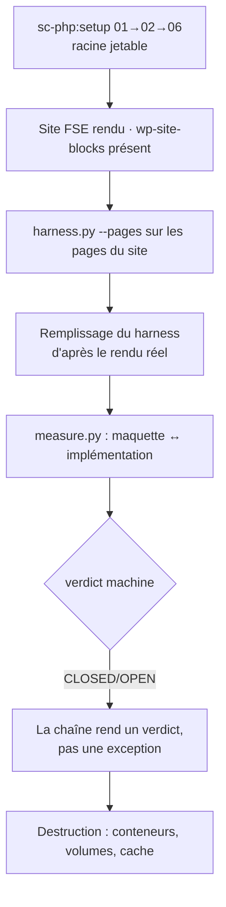

# Instruction: chaîne complète contre WordPress FSE

Vérifie la chaîne `harness.py → HTML → remplissage → measure.py → verdict` contre un site réel, et non contre des fixtures. Le terrain est le bootstrap WordPress FSE de `sc-php:setup` 0.10.3, dont les sept défauts ont été corrigés et remesurés le 2026-08-05.

## Architecture projection

```txt
.
└── plugins/design/
    ├── .claude-plugin/plugin.json    ✏️  2.8.0 → 2.9.0
    ├── CHANGELOG.md                  ✏️  entrée [2.9.0] — les 18 constats et leurs mesures d'après-correction
    └── (aucun autre fichier du plugin n'est touché par cette phase)

.claude-plugin/marketplace.json       ✏️  design 2.8.0 → 2.9.0, même commit que le contenu
aidd_docs/tasks/2026_08/2026_08_05-constat-bootstrap-wordpress-fse.md   ✏️  la note de résolution mentionne la contre-épreuve de chaîne
```

Rien n'est créé dans le dépôt par la vérification elle-même : le projet WordPress jetable et le harness de mesure vivent dans le scratchpad de session et sont détruits après.

## User Journey



## Tasks to do

### `1)` Rejouer le bootstrap sur une racine jetable

> Le terrain doit être réel, pas simulé.

1. Exécuter `sc-php:setup` `01-detect-framework` → `02-scaffold-wordpress` → `06-verify` **littéralement**, avec le contenu exact des références 0.10.3, sur une racine jetable hors du dépôt.
2. Choisir un port HTTP libre et vérifier qu'aucun conteneur voisin n'est perturbé — les projets `code-*` de la machine restent Up, vérifié avant et après.
3. Confirmer le point d'entrée : `.wp-site-blocks` présent, thème scaffoldé actif, page d'accueil non blanche.

### `2)` Générer et remplir le harness

> C'est le maillon que les phases 1 à 3 viennent de corriger.

1. Générer le harness avec `--pages` sur les pages réellement servies par le site, `--lang` posé explicitement. **La clé est un slug, jamais un chemin d'URL** : le site sert `/contact/`, la clé est `contact`. Après la phase 1 un chemin sort en 2 ; avant elle il produisait un harness mort en exit 0 — c'est le piège que cette phase doit éviter de tendre elle-même.
2. Vérifier avant remplissage : aucun `preconnect`, un `h1` par page, `aria-label` sur le sélecteur, exit 0.
3. Remplir chaque fonction de page d'après le rendu réel du site, en suivant les règles que le fichier prescrit lui-même (un seul `h1`, classes BEM stables, aucun `<style>` global dans une fonction).
4. Contre-épreuve de l'état d'erreur : casser volontairement une fonction de page, vérifier que le cadre affiche le bloc d'erreur et que `window.setPage` ne lève pas — puis rétablir.

### `3)` Passer l'oracle

> Le verdict doit être une donnée, pas une trace Playwright.

1. Écrire la configuration de `measure.py`. Les deux URL ne sont que l'amorce : `reference_url` + `reference_page` côté maquette, `implementation_url` côté site — tous trois en accès direct dans le code (`:457`, `:467`), donc obligatoires. Le coût réel est ailleurs, dans `breakpoints` (avec `mockup_viewport` par entrée), `props`, et surtout **`targets`** — une paire de sélecteurs maquette/implémentation par élément mesuré. C'est ce tableau, pas les URL, qui fait basculer la phase de 1 à 2 sessions.
2. Garder `targets` court et représentatif : quelques éléments par page suffisent à prouver que la chaîne rend un verdict. Cette phase n'est pas un audit de fidélité du site.
3. Exécuter l'oracle sur les trois échantillons device et relever le verdict machine, le scan de complétude structurelle et la couverture.
4. Relever ce que le verdict dit et ce qu'il ne dit pas : un écart maquette/implémentation n'est pas un défaut de la chaîne, seul un plantage ou un verdict impossible à produire en est un.

### `4)` Bump et journal

> Bump et contenu dans le même commit, jamais d'installation contre un arbre sale.

1. Porter `design` de 2.8.0 à 2.9.0 dans `plugins/design/.claude-plugin/plugin.json` et `.claude-plugin/marketplace.json`.
2. Écrire l'entrée `[2.9.0]` du CHANGELOG : les 18 constats, avec pour chacun la mesure d'**après**-correction, pas seulement l'intention.
3. Ajouter à la note de résolution de `2026_08_05-constat-bootstrap-wordpress-fse.md` que le bootstrap a servi de contre-épreuve à la chaîne `design:harness` — le document reste par ailleurs l'état d'avant, il n'est pas réécrit.
4. `pnpm test` vert, arbre propre. **Ne rien committer ni pousser** — déclenchement utilisateur.

### `5)` Détruire

> Ce qui a servi à mesurer ne reste pas.

1. Arrêter le projet jetable par son propre script, jamais par une commande qui toucherait les conteneurs voisins.
2. Supprimer explicitement ses volumes nommés — `wp-env destroy` est interactif et se bloque dans une session non interactive.
3. Vérifier qu'aucun conteneur ni volume du projet jetable ne subsiste, et que les six conteneurs voisins sont toujours Up.

## Test acceptance criteria

| Task | Acceptance criteria                                                                                                                                              |
| ---- | -------------------------------------------------------------------------------------------------------------------------------------------------------------------- |
| 1    | Le site scaffoldé rend HTTP 200 avec `.wp-site-blocks` et un `innerText` non vide ; les conteneurs voisins sont intacts                                           |
| 2    | Le harness généré passe les cinq contrôles de la tâche 2 avant remplissage ; une fonction de page cassée produit un bloc d'erreur visible sans lever              |
| 3    | `measure.py` rend un **verdict machine** sur les trois échantillons device — sans exception, sans page mesurée à la place d'une autre                             |
| 4    | `plugin.json`, `marketplace.json` et le CHANGELOG portent 2.9.0 ; chaque constat du CHANGELOG cite une mesure d'après-correction ; `pnpm test` rend 0 ; rien n'est committé |
| 5    | `docker ps -a` et `docker volume ls` ne montrent aucune trace du projet jetable ; les six conteneurs voisins sont Up                                              |

## Risques

- **La configuration de l'oracle n'existe pas pour ce site.** `config-gen.py` la dérive d'un contrat figé, et le bootstrap WordPress FSE n'en a pas. Il faudra l'écrire à la main, ou geler un contrat minimal — c'est ce qui peut faire passer cette phase de 1 à 2 sessions.
- **Un écart de fidélité n'est pas un échec de phase.** La maquette sera remplie d'après le site, donc l'écart sera faible par construction ; ce que la phase prouve est que la chaîne **produit un verdict**, pas que le verdict est bon.
- **Le rapport de constat du 2026-08-05 écrit que la confrontation avec la maquette « n'apporterait rien » (`:68`).** C'était vrai pour diagnostiquer le site blanc, avant correction. Ce n'est plus le même usage : ici la maquette n'est pas un instrument de diagnostic du site, c'est le site qui est le terrain de la chaîne.
