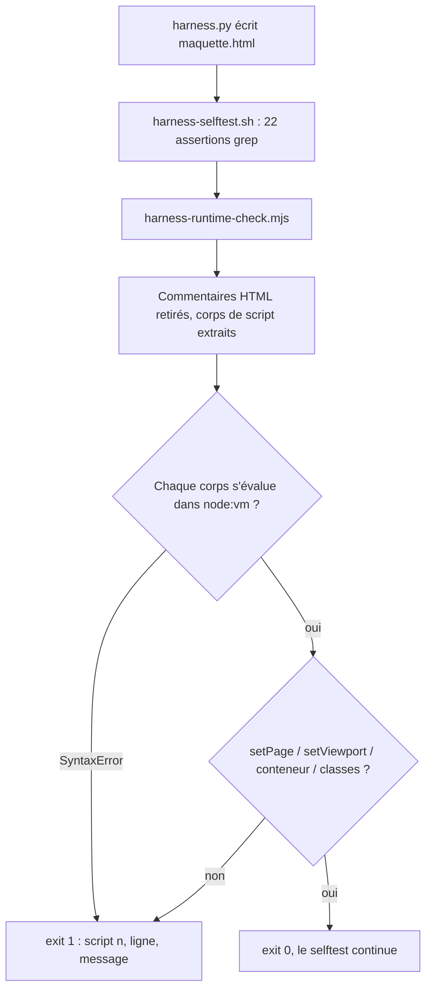

# Instruction: le fichier généré est exécuté, pas seulement grepé

## Architecture projection

> Tree of the final files. ✅ create · ✏️ modify · ❌ delete

```txt
.
└── plugins/design/tools/
    ├── harness-runtime-check.mjs   ✅ exécute le JS du HTML produit dans node:vm
    └── harness-selftest.sh         ✏️ résolution de node + appels du checker
```

## User Journey



## Tasks to do

### `1)` Écrire le contrôleur runtime

> Charger le JS livré, sans dépendance et sans navigateur.

1. Créer `plugins/design/tools/harness-runtime-check.mjs`. Entrée : un chemin de fichier HTML, option `--expect-pages a,b,c`. Espace de sortie **0 / 1**, comme le selftest, jamais 2.
2. **Retirer les commentaires HTML avant toute extraction** — `harness.py:280` cite littéralement `<script>` dans le grand bloc `<!-- … -->` du template ; une extraction naïve démarre dans le commentaire et rend une `SyntaxError` sur un fichier sain. C'est le seul piège non évident de la phase, il est mesuré.
3. Extraire les corps `<script>…</script>`, échouer si moins de deux : le fichier en déclare deux, une extraction qui n'en trouve qu'un est déjà une régression.
4. Échouer aussi sur toute balise `<script` **portant des attributs** (`type="module"`, `src=`…) que l'extraction ne capture pas : un script non contrôlé doit interrompre le contrôle, jamais le laisser vert. C'est le point aveugle qui recréerait le 🔴 sous une autre forme.
5. Monter un stub DOM couvrant exactement ce que le JS du harness touche : `getElementById` (`page-container`, `preview-frame`, `page-select`), `querySelector('.preview-stage')`, `querySelectorAll('.viewport-btn')`, un `classList` sur `Set`, `location.hash`, `history.replaceState`, `addEventListener`. **Ne pas ajouter de fourre-tout** : une API non stubbée doit lever, pour qu'un ajout futur au JS échoue bruyamment au lieu de passer.
6. Évaluer chaque corps dans un contexte `node:vm` avec `window === globalThis` du bac à sable ; toute exception → exit 1 nommant l'indice du script, le type et le message.
7. Asserter ensuite : `typeof window.setPage === 'function'`, `typeof window.setViewport === 'function'`, `#page-container.innerHTML` non vide après l'`init()` du fichier, `setViewport('mobile')` pose la classe `mobile` sur le cadre et `setViewport('desktop')` la retire, une clé inconnue rend le bloc « Page introuvable ».
8. Sous `--expect-pages`, asserter pour chaque clé : contenu non vide et `select.value` égal à la clé.

### `2)` Brancher le contrôleur dans le selftest

> Que `bash tools/harness-selftest.sh` cesse de pouvoir être vert sur un fichier mort.

1. Résoudre l'interpréteur node sur le modèle exact de python (`harness-selftest.sh:20-31`) : `HARNESS_SELFTEST_NODE` → `node`, avec vérification que l'override lui-même est exécutable.
2. Node absent → **échec nommé** (« node introuvable, posez `HARNESS_SELFTEST_NODE` »), pas un saut silencieux. **Pas de trappe d'échappement** : le seul appelant du selftest est `tools/eval/design-harness.mjs`, qui tourne déjà sous node — un `SKIP` ne couvrirait aucun cas réel et rouvrirait la porte du vert-sans-contrôle que cette phase referme.
3. Appeler le contrôleur sur les sorties **déjà produites** par `harness-selftest.sh:67-70`, qui persistent dans `$OUT` jusqu'au `trap EXIT` — aucune regénération : `$OUT/m.html` avec `--expect-pages home,contact`, `$OUT/c.html` (chemin contrat), `$OUT/s.html` (scaffold).
4. Le code du contrôleur remonte tel quel dans le verdict du selftest ; le message d'échec cite le fichier contrôlé.

### `3)` Prouver par régression injectée

> Reproduire la contre-épreuve de l'audit sur la chaîne corrigée.

1. Copier `plugins/design/` dans un arbre jetable (le selftest résout `$HARNESS` par chemin fixe : il faut déplacer l'arbre, pas le fichier), puis injecter une accolade non fermée dans le `setViewport` du `harness.py` **de la copie**. Ne jamais régresser la source en place — un `git add` distrait publierait un générateur mort.
2. Lancer `bash tools/harness-selftest.sh` depuis la copie.
3. Attendu : échec nommant le **script fautif** (son indice, le type et le message d'exception) — pas nécessairement une ligne : une accolade non fermée se signale en fin d'entrée (`SyntaxError: Unexpected end of input`), sans position utile. Là où l'audit a mesuré ALL GREEN / exit 0.
4. Détruire la copie une fois le relevé consigné.

## Test acceptance criteria

| Task | Acceptance criteria |
| ---- | ------------------- |
| 1 | Sur une maquette saine, le contrôleur rend exit 0 et n'imprime aucune erreur — en particulier aucune `SyntaxError` provoquée par le commentaire HTML du template. |
| 1 | Aucun `import` hors `node:` dans le fichier : il tourne dans un dépôt sans `node_modules`. |
| 1 | Le contrôleur rend exit 1 et nomme le script fautif quand un corps ne s'évalue pas. |
| 2 | `HARNESS_SELFTEST_NODE` pointant sur un binaire inexistant fait échouer le selftest avec un message nommant la variable, pas une erreur d'interpréteur brute. |
| 2 | Le résumé du selftest fait apparaître les assertions runtime dans son décompte — elles ne sont pas hors comptage. |
| 3 | Le générateur régressé (accolade non fermée) fait échouer `bash tools/harness-selftest.sh` avec un code non nul, et le message nomme le script en cause. |
| 3 | `rtk git diff -- plugins/design/adapters/harness/harness.py` est vide après la contre-épreuve : la régression n'a existé que dans l'arbre jetable. (Le dépôt n'est pas « propre » à ce moment — le contrôleur et le selftest de cette phase y sont encore non commités.) |
| 3 | `pnpm test` reste vert sur le générateur sain, et `tools/eval/design-harness.mjs` propage bien l'échec du cas régressé. |
