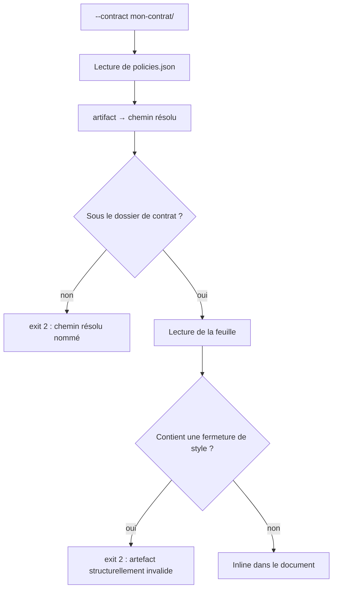

# Instruction: le chemin `--contract` cesse d'accepter n'importe quoi

## Architecture projection

> Tree of the final files. ✅ create · ✏️ modify · ❌ delete

```txt
.
└── plugins/design/
    ├── adapters/harness/
    │   ├── harness.py                                   ✏️ l. 518-531 : confinement + refus de </style>
    │   └── fixtures/
    │       ├── 2x-style-breakout/                       ✅ tokens.css portant la sortie de contexte
    │       │   ├── release.json · policies.json
    │       │   └── adapters/tokens.css
    │       └── 2x-artifact-escape/                      ✅ artifact pointant hors du dossier de contrat
    │           ├── release.json
    │           └── policies.json
    └── tools/harness-selftest.sh                        ✏️ +2 assertions attendues à 2
```

## User Journey



## Tasks to do

### `1)` Confiner le chemin de l'artefact

> Un `policies.json` ne peut plus faire entrer un fichier situé hors du contrat.

1. Dans `harness.py` autour de l. 518-524 : résoudre `css_path` et le dossier de contrat, puis vérifier l'inclusion via `Path.relative_to` sous `try/except ValueError` — pas `is_relative_to`, qui poserait un plancher Python 3.9.
2. Hors périmètre → refus par le mécanisme `_fail` voisin, code **2**, message nommant le chemin **résolu** (pas la valeur brute : c'est la résolution qui prouve l'évasion) et le fichier `policies.json` fautif.
3. Terminer le message par une ligne actionnable, comme tous les refus voisins (`harness.py:485`, `:529`) : « Declare an artifact inside the contract directory. »
4. Faire la vérification **avant** la lecture : un chemin refusé ne doit pas être ouvert.
5. Couvrir les deux formes mesurées par l'audit : relative (`../…`) et absolue — `pathlib` fait gagner l'opérande absolu, donc `cdir / artifact` ne protège de rien.
6. Effet de bord assumé : `resolve()` suit les liens symboliques, donc un dossier d'artefacts légitimement symlinké hors du contrat devient un refus. Le message doit le dire, pour que le cas se diagnostique sans lire le code.

### `2)` Refuser la sortie de contexte `</style>`

> La seule séquence de la feuille qui change de langage devient un refus.

1. Après lecture, `re.search(r"</\s*style", css, re.I)` → refus par `_fail`, code **2**, message « artefact structurellement invalide » citant le fichier, la séquence trouvée, et se terminant par une ligne actionnable dans la forme des refus voisins (« Re-generate it: python tools/generate.py --contract … »).
2. Ne pas neutraliser ni échapper : une feuille produite par `tools/generate.py` ne contient jamais cette séquence, un refus n'a pas de faux positif légitime — et échapper laisserait passer un artefact qu'on ne comprend pas.

### `3)` Deux fixtures de refus

> Prouver les deux refus par une entrée versionnée, pas par une manipulation de session.

1. `fixtures/2x-style-breakout/` sur le modèle de `2x/` : `release.json`, `policies.json` pointant `adapters/tokens.css`, et une `tokens.css` contenant `/* */</style><script>window.__PWNED=1;</script><style>`.
2. **Écrire ce fichier avec l'outil d'écriture, jamais via `printf` en Git Bash** — l'audit a perdu une contre-épreuve ainsi : le shell a laissé le contre-oblique littéral et la balise produite était invalide.
3. `fixtures/2x-artifact-escape/` : `policies.json` avec `"artifact": "../2x/adapters/tokens.css"` — cible **existante** hors du dossier de contrat, donc sans le confinement la génération réussirait à exit 0. Aucun fichier parasite à déposer.
4. Deux assertions selftest sur le modèle de `2x-bad-release` / `2x-missing-artifact` : code attendu **2**, et le message d'erreur cité doit contenir le nom du fichier fautif.

## Test acceptance criteria

| Task | Acceptance criteria |
| ---- | ------------------- |
| 1 | `--contract fixtures/2x-artifact-escape` rend **exit 2**, n'écrit aucun fichier de sortie, et imprime le chemin résolu de la cible refusée. |
| 1 | Un `artifact` absolu vers un fichier lisible est refusé de la même manière. |
| 1 | `--contract fixtures/2x` continue de rendre exit 0 avec sa feuille inlinée : le confinement n'a pas de faux positif sur le cas nominal. |
| 2 | `--contract fixtures/2x-style-breakout` rend **exit 2** et cite `adapters/tokens.css`. |
| 2 | Aucun fichier produit par ce lancement ne contient `__PWNED` — le refus précède l'écriture, il ne la corrige pas. |
| 3 | Les deux nouvelles fixtures sont versionnées et exercées par `bash tools/harness-selftest.sh` ; le décompte d'assertions du résumé augmente de deux. |
| 3 | `pnpm test` reste vert, et l'espace de codes du générateur reste 0/2/3 — aucun chemin ne rend 1 ni 4. |
