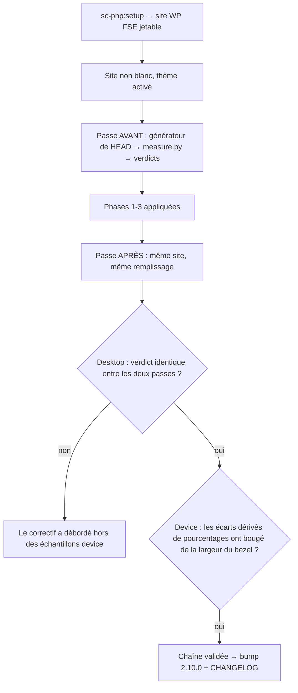

# Instruction: la chaîne rejouée contre le bootstrap WordPress FSE

## Architecture projection

> Tree of the final files. ✅ create · ✏️ modify · ❌ delete

```txt
.
├── plugins/design/
│   ├── .claude-plugin/plugin.json   ✏️ 2.9.1 → 2.10.0
│   └── CHANGELOG.md                 ✏️ entrée 2.10.0 avec les mesures avant/après
├── .claude-plugin/marketplace.json  ✏️ version + description du plugin design
└── aidd_docs/tasks/2026_08/2026_08_05_harness-trois-critiques/
    └── verification-chaine.md       ✅ le relevé de la chaîne rejouée
```

## User Journey



## Tasks to do

### `1)` Remonter le terrain

> Un site WordPress FSE réel, non blanc — l'environnement du constat a été détruit après mesure.

1. Vérifier d'abord dans le CHANGELOG de `sc-php` que 0.10.3 couvre les défauts 2 (port `tests` codé en dur) et 3 (garde `COMPOSE_PROJECT_NAME` absent des commandes prescrites) : ce sont les deux qui bloquent le scaffold, pas le rendu.
2. Exécuter le flow `01 → 02 → 06` sur une racine jetable, littéralement, sans rien inventer au-delà des placeholders.
3. Garde-fou : `COMPOSE_PROJECT_NAME` posé pour toute commande `wp-env` tapée à la main, et WP-CLI toujours via `pnpm dlx @wordpress/env run cli wp`.
4. Porte d'entrée : `document.querySelector('.wp-site-blocks')` non nul et `document.body.innerText.trim().length > 0`. Un `wp core version` qui répond ne prouve rien — c'est le défaut n° 1 du constat, mesuré en `constat-bootstrap-wordpress-fse.md:30`.

### `2)` Capturer la ligne de base avant de corriger

> Le constat atteste qu'un verdict a été rendu en 2.9.0 (`constat-bootstrap-wordpress-fse.md:5`) mais **n'en consigne aucune valeur** : il n'y a rien à quoi comparer. La ligne de base se fabrique, elle ne se retrouve pas.

1. Sur le site remonté, rejouer la chaîne avec le générateur **d'avant correctif**. Ni `git stash` ni `HEAD` ne le donnent : à ce stade les phases 1-3 sont commitées, `HEAD` **est** le générateur corrigé. Extraire la version antérieure sans toucher à l'arbre — `rtk git show <sha-parent-de-la-phase-1>:plugins/design/adapters/harness/harness.py` redirigé vers un fichier hors dépôt, puis exécuté depuis là.
2. Relever le verdict par échantillon et l'écrire dans `verification-chaine.md`, section « avant ».
3. Le site ne se reconstruit pas entre les deux passes : seul le générateur change. C'est ce qui rend l'écart imputable.

### `3)` Rejouer la chaîne complète

> `harness.py → HTML → remplissage → measure.py → verdict`, contre le générateur corrigé.

1. Générer la maquette avec `design` 2.10.0 (les trois phases précédentes appliquées), remplir les pages à l'identique de la passe « avant ».
2. Lancer `measure.py`. **Les échantillons dépendent du contrat** : `config-gen.py:54-57` ne pose par défaut que **mobile 375 × 812** et **desktop 1440 × 900** ; le **tablet 834 × 1194** n'apparaît que si le contrat déclare un token de breakpoint `tablet` ou `md` (`config-gen.py:63-64`). Relever quels échantillons ont effectivement tourné, ne pas supposer trois.
3. Comparer verdict par verdict à la section « avant ».
4. Compléter `verification-chaine.md` : commandes, verdicts avant / après, explication de chaque écart.

### `4)` Rendre le verdict sur la ligne 70 du constat

> Le constat affirme « largeurs 390 / 834 / desktop fluide conformes ». La mesure de la phase 1 dit que la boîte de contenu valait 359 au viewport 375, et vaudrait 374 / 814 à fenêtre large.

1. Citer les largeurs de contenu relevées en phase 1, avec leur viewport.
2. Annoter la ligne 70 du constat — datée, disant ce qui était faux et sur quelle mesure. Un document de constat ne se réécrit pas.

### `5)` Version et clôture

> Bump et contenu dans le même commit, arbre propre.

1. Vérifier que la décision préalable sur le `2.9.1` non commité (`plan.md > Decisions`, tranchée **avant l'ouverture du lot**, pas ici) a bien été appliquée : soit 2.9.1 est un commit à part entière en amont des phases 1-3, soit son entrée CHANGELOG a disparu au profit de 2.10.0. Aucun état intermédiaire.
2. `plugins/design/.claude-plugin/plugin.json` → `2.10.0`.
3. Entrée CHANGELOG citant les mesures : boîte de contenu 359 → 375 au viewport de l'oracle, le générateur régressé qui échoue désormais, les deux fixtures de refus.
4. Reporter version et description dans `.claude-plugin/marketplace.json`.
5. `status: implemented` sur le plan, phases à `done`.
6. **Ne pas commiter ni pousser sans demande explicite.**

## Test acceptance criteria

| Task | Acceptance criteria |
| ---- | ------------------- |
| 1 | Le site scaffoldé rend du contenu : `.wp-site-blocks` présent et texte non vide, thème custom actif (`wp_get_theme()->get_stylesheet()` = le slug scaffoldé, pas `twentytwentyfive`). |
| 2 | `verification-chaine.md` contient une section « avant » avec un verdict par échantillon, produite sur le même site que la passe « après ». Sans elle, la phase 3 n'a rien à comparer. |
| 2 | Le fichier servant à la passe « avant » vient d'un `git show` du parent de la phase 1, et le `rtk git status` du dépôt est inchangé par l'opération : la ligne de base ne se fabrique pas en régressant l'arbre. |
| 3 | `measure.py` rend un verdict machine sur **chaque échantillon que le contrat produit**, sans exception ni timeout ; le nombre d'échantillons est relevé, pas supposé. |
| 3 | Le verdict **desktop** est identique entre les deux passes : l'échantillon desktop n'a pas de bezel, le correctif ne doit rien y changer. |
| 3 | Les verdicts **mobile** (et tablet s'il existe) ne diffèrent entre les deux passes que sur des propriétés dérivées d'un pourcentage de largeur, et l'écart correspond à la largeur du bezel retirée de la boîte. Tout autre écart est une régression à instruire. |
| 4 | La ligne 70 du constat porte une annotation datée citant une mesure et son viewport. |
| 5 | `git log` montre le sort du 2.9.1 déjà réglé **avant** le premier commit de la phase 1 : soit un commit 2.9.1 distinct, soit aucune trace de 2.9.1 dans le CHANGELOG. |
| 5 | `pnpm test` vert, `bash plugins/design/tools/harness-selftest.sh` vert, arbre propre. |
| 5 | La version dans `plugin.json` et celle dans `marketplace.json` sont identiques, et l'environnement jetable est détruit (conteneurs, volumes, cache `~/.wp-env`) sans avoir touché aux projets voisins. |
