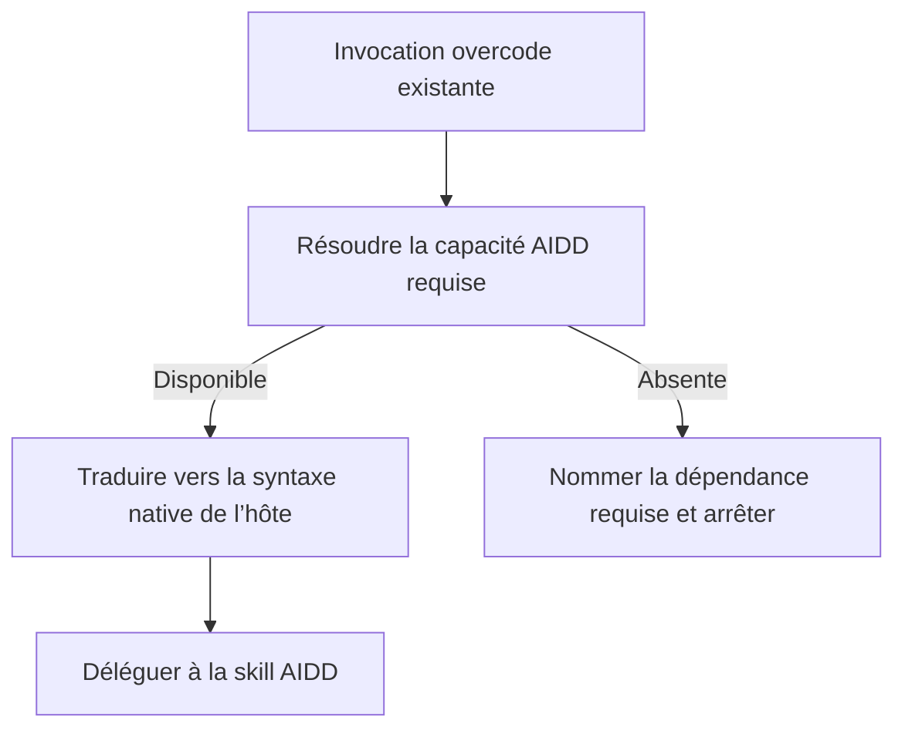
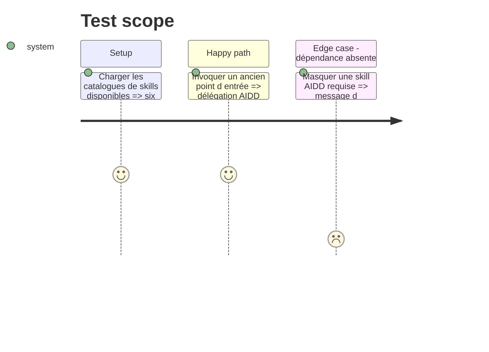

# Instruction: Établir le contrat commun de délégation AIDD

## Architecture projection

> Tree of the final files. ✅ create · ✏️ modify · ❌ delete

```txt
plugins/overcode/
├── references/
│   └── aidd-delegation.md ✅
└── skills/
    ├── foresee/
    │   ├── SKILL.md ✏️
    │   ├── actions/01-analyze-doc.md ✏️
    │   └── actions/02-analyze-code.md ✏️
    └── taste/
        ├── SKILL.md ✏️
        └── actions/02-assess-code.md ✏️
```

## User Journey



## Test Scope



## Tasks to do

### `1)` Définir la table de délégation

> Donner une source de vérité commune aux deux routeurs.

1. Créer `references/aidd-delegation.md` avec, pour chaque capacité, la skill canonique, le package propriétaire, la version minimale compatible et le type de sortie attendu ; fixer les baselines initiales aux versions inspectées `aidd-dev >= 2.4.1` et `aidd-refine >= 2.2.4`.
2. Résoudre ces capacités dans le catalogue de skills exposé par l’hôte, puis traduire l’invocation en Codex `$plugin:skill` ou Claude Code `/plugin:skill` selon `host-portability.md`, sans chemin de cache ni numéro de version dans les actions.
3. Définir trois échecs distincts — package absent, skill absente, version incompatible — avec message d’installation/mise à jour précis et arrêt sans fallback local.
4. Documenter que la table est un contrat de compatibilité versionné et non une copie exhaustive du catalogue AIDD.

### `2)` Transformer les actions redondantes en routeurs

> Préserver les entrées publiques tout en transférant l’autorité à AIDD.

1. Router `foresee analyze-doc` vers `aidd-refine:04-shadow-areas` pour une idée, spécification ou plan prospectif, vers `aidd-refine:02-challenge` uniquement pour un travail terminé comparé à un plan convenu, et demander ce statut une fois s’il est indéterminable.
2. Router `foresee analyze-code` vers `aidd-dev:04-audit architecture` pour une cible générale, `code-quality` pour une demande explicite de maintenabilité, `tests` pour un risque de couverture ; demander l’angle une fois lorsque plusieurs signaux explicites se contredisent.
3. Router `taste assess-code` vers `aidd-dev:04-audit code-quality` pour la fraîcheur/obsolescence générale, `dependencies` pour les dépendances, et `aidd-dev:03-assert` pour import, compilation, typage ou exécution ; demander l’angle une fois si seule une cible source sans intention est fournie.
4. Définir la compatibilité des anciens flags : le mode par défaut retourne le rapport AIDD ; `--discuss` délègue puis discute le rapport sans promettre zéro artefact ; `--plan` délègue puis appelle `aidd-dev:01-plan` sur le rapport, ou s’arrête avec son chemin si plan est indisponible.
5. Exiger dans chaque sortie un reçu de délégation minimal : capacité résolue, skill invoquée, pilier éventuel, artefact produit et étape locale restante.

## Test acceptance criteria

| Task | Acceptance criteria |
| ---- | ------------------- |
| 1 | Chaque capacité possède un identifiant canonique, un package, une version minimale, un type de sortie et un échec testable pour package absent, skill absente ou version incompatible ; aucune action ne dépend d’un chemin de cache AIDD. |
| 2 | Les trois actions redondantes ne contiennent plus d’algorithme d’audit local ni de nom de modèle Claude ; leurs matrices de routage, anciens flags et reçus produisent la même décision sur Codex et Claude Code. |
