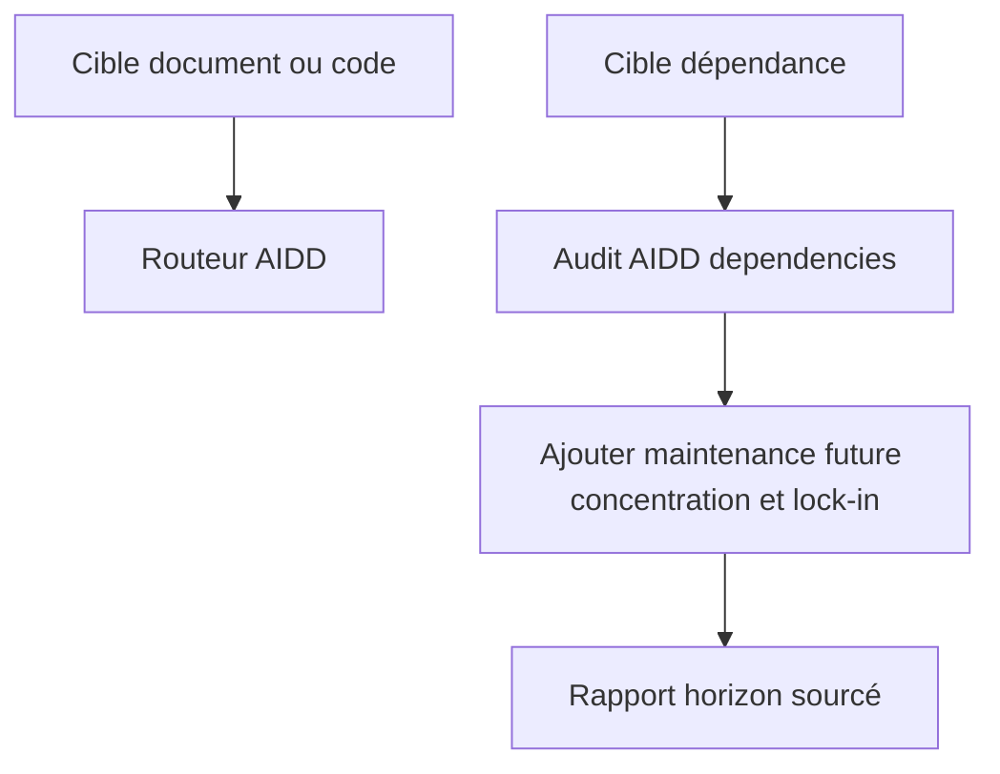
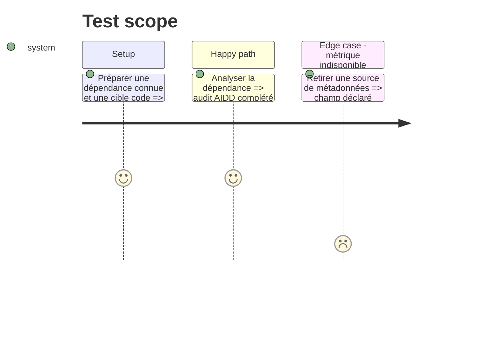

# Instruction: Recentrer foresee sur l’horizon de dépendances

## Architecture projection

> Tree of the final files. ✅ create · ✏️ modify · ❌ delete

```txt
plugins/overcode/skills/foresee/
├── SKILL.md ✏️
├── actions/
│   ├── 01-analyze-doc.md ✏️
│   ├── 02-analyze-code.md ✏️
│   └── 03-analyze-dep.md ✏️
├── assets/
│   ├── context-map.md ✏️
│   └── scoring-rubrics.md ✏️
├── references/
│   ├── dep-risk-signals.md ✏️
│   └── improvement-patterns.md ❌
└── evals/
    ├── scenarios.json ✏️
    └── delegation-scenarios.md ✅
```

## User Journey



## Test Scope



## Tasks to do

### `1)` Réduire le contrat foresee

> Distinguer clairement orchestration AIDD et valeur prospective propre.

1. Réécrire le routeur et les descriptions autour des trois destinations réelles.
2. Supprimer le catalogue générique `improvement-patterns.md` devenu redondant avec audit, challenge et shadow-areas.
3. Éliminer les scores et historiques génériques qui doublonnent les rapports AIDD.

### `2)` Fiabiliser l’analyse de dépendance

> Ajouter uniquement ce que l’audit AIDD ne couvre pas.

1. Exécuter d’abord le pilier `dependencies` de `aidd-dev:04-audit` et citer son rapport comme entrée, sans recalculer vulnérabilités, licences, versions obsolètes ou compatibilité déjà couvertes.
2. Mesurer ensuite uniquement concentration des mainteneurs, trajectoire d’activité, surface d’usage locale, alternatives et coût d’abandon/migration, avec source et date d’observation pour chaque signal.
3. En mode manifeste, reprendre au plus les cinq dépendances prioritaires du rapport AIDD par défaut ; accepter une dépendance nommée ou un opt-in `--all`, avec avertissement de coût avant tout fan-out.
4. Utiliser les capacités natives de l’hôte sans imposer de sous-agent ; l’exécution séquentielle reste valide si le parallélisme n’est pas disponible.
5. Marquer toute métrique indisponible `unknown`, l’exclure du dénominateur et afficher la couverture du score.
6. Nommer les rapports avec date, heure et slug de cible afin d’éviter les collisions le même jour.

### `3)` Spécifier la délégation comportementale

> Prouver les routes, les refus et la valeur ajoutée restante.

1. Ajouter une suite `delegation-scenarios.md` avec cas Codex, Claude, dépendance absente, version incompatible, budget manifeste et métrique indisponible.
2. Conserver `scenarios.json` pour le routage des trois actions.
3. Inclure un contrôle négatif qui échoue si l’ancien moteur local réapparaît.

## Test acceptance criteria

| Task | Acceptance criteria |
| ---- | ------------------- |
| 1 | Une cible document ou code est déléguée à AIDD et aucune checklist locale générique ne reste active. |
| 2 | Une dépendance cite les constats AIDD actuels puis ajoute seulement maintenance future et lock-in ; le défaut traite au plus cinq cibles, chaque score affiche sa couverture et aucune métrique n’est fabriquée. |
| 3 | La suite distingue délégation correcte, incompatibilité AIDD, dépassement de budget et régression vers l’ancien moteur local, et définit pour chaque scénario Situation, comportement attendu et critères de réussite. |
