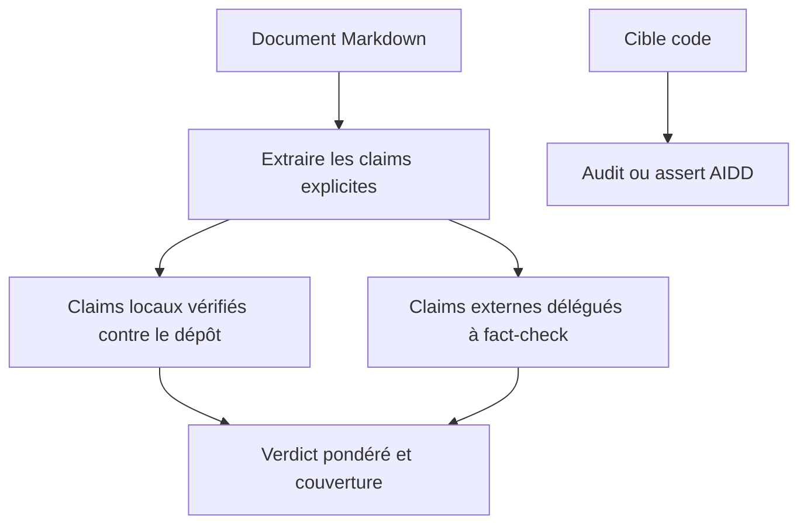
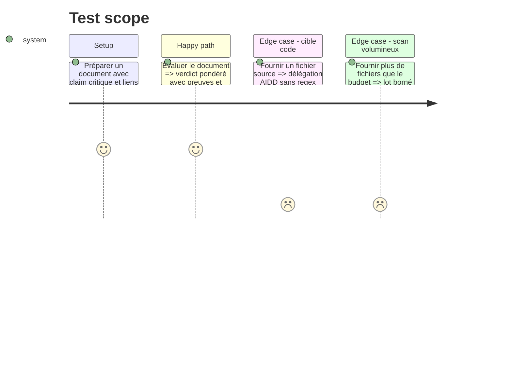

# Instruction: Recentrer taste sur la fraîcheur documentaire

## Architecture projection

> Tree of the final files. ✅ create · ✏️ modify · ❌ delete

```txt
plugins/overcode/skills/taste/
├── SKILL.md ✏️
├── actions/
│   ├── 01-assess-doc.md ✏️
│   └── 02-assess-code.md ✏️
├── assets/
│   ├── claim-types.md ✏️
│   ├── decision-doc.md ✏️
│   └── code-patterns.md ❌
├── references/
│   ├── lang-javascript.md ❌
│   ├── lang-php.md ❌
│   ├── lang-python.md ❌
│   ├── lang-rust.md ❌
│   ├── lang-typescript.md ❌
│   └── lang-vue.md ❌
└── evals/
    ├── scenarios.json ✏️
    └── delegation-scenarios.md ✅
```

## User Journey



## Test Scope



## Tasks to do

### `1)` Durcir assess-doc

> Conserver la capacité distinctive sans verdict trompeur.

1. Pondérer les claims en critique `3`, structurel `2` et informatif `1`; compter une preuve exacte à `1`, partielle à `0.5` et fausse/absente à `0`.
2. Afficher `points vérifiés / points éligibles`; préserver les seuils publics `Current` à partir de 80 %, `Partial` entre 20 et 79 %, `Obsolete` sous 20 %, avec veto `Current` et `Superseded` pour tout claim critique faux ; retourner `N/A` et aucun pourcentage si aucun claim local n’est éligible.
3. Réserver `Superseded` à un document de décision sans claim critique faux, dont les claims locaux atteignent au moins 80 %, et à une preuve directement liée au sujet — artefact de remplacement implémenté ou décision close dont toutes les conditions explicites sont satisfaites ; appliquer ce verdict avant `Current` et refuser qu’une issue close sans correspondance suffise.
4. Harmoniser exactement champs, dénominateur et précédence des verdicts entre single-file, exécution distribuée éventuelle et agrégation.
5. Scanner au plus 25 documents par défaut, triés par risque (claims critiques, liens cassés, divergence Git), accepter `--limit` ou `--all`, et annoncer chaque cible non couverte.
6. Utiliser l’historique Git comme signal de priorité, jamais comme preuve autonome d’obsolescence.

### `2)` Déléguer les claims externes

> Employer le fact-check AIDD quand le dépôt ne peut pas faire autorité.

1. Garder localement chemins, liens, symboles, versions et références internes.
2. Pour toute affirmation externe, arrêter son évaluation locale et invoquer séparément `aidd-refine:05-fact-check` sur une copie temporaire ou un extrait, jamais sur le document source ; si la skill manque, marquer le claim non vérifié selon le contrat commun et arrêter cette branche.
3. Ne pas fusionner la réécriture de fact-check dans le verdict `taste`; référencer son artefact séparément et marquer le claim `external-delegated` ou `external-unverified` dans la couverture locale.
4. Séparer preuve locale, résultat externe et claim non vérifiable dans le rapport, en gardant le pourcentage fondé uniquement sur les claims locaux éligibles ; si une branche externe reste non vérifiée, qualifier le verdict `local evidence only — external verification pending` et interdire un verdict global non qualifié.

### `3)` Retirer le moteur code local

> Remplacer les heuristiques regex par les capacités AIDD maintenues.

1. Transformer `assess-code` selon la matrice commune : audit `code-quality` pour l’obsolescence générale, audit `dependencies` pour les dépendances, assert pour imports/compilation/typage/exécution, avec une question unique si l’intention est absente.
2. Supprimer `code-patterns.md` et les six références de langage devenues sans consommateur.
3. Ajouter les scénarios de délégation, d’absence AIDD et de non-régression des points d’entrée.

## Test acceptance criteria

| Task | Acceptance criteria |
| ---- | ------------------- |
| 1 | Les fixtures de seuil 19/20/79/80 %, de zéro claim éligible, de veto critique sur `Current`/`Superseded` et de précédence `Superseded` produisent le même résultat dans tous les modes ; le défaut ne dépasse pas 25 documents et rend sa couverture. |
| 2 | Les claims locaux restent vérifiés en lecture seule ; fact-check reçoit seulement une copie/un extrait, son artefact reste séparé, aucun résultat externe n’altère le score local et toute vérification externe pendante qualifie le verdict. |
| 3 | Aucune regex de langage ni modèle Claude ne subsiste dans taste, tandis que `overcode:taste` continue de router les cibles document et code. |
