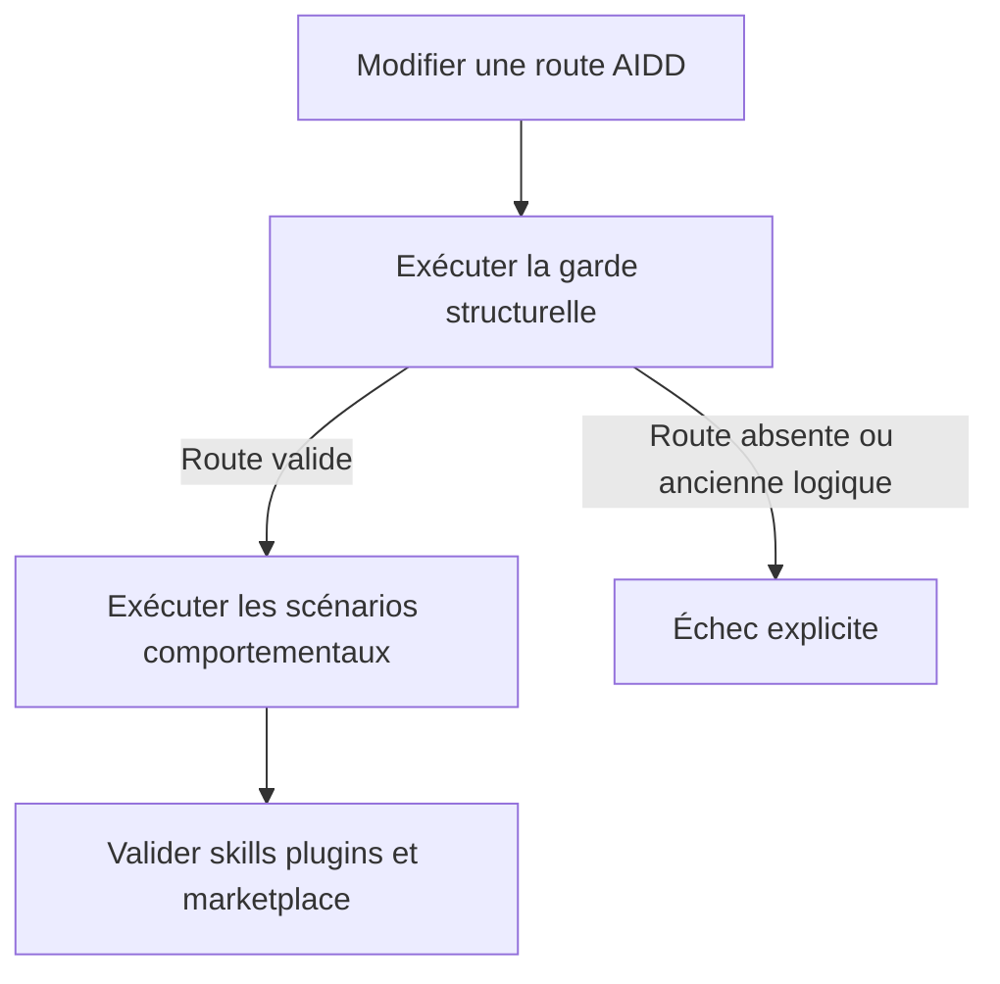
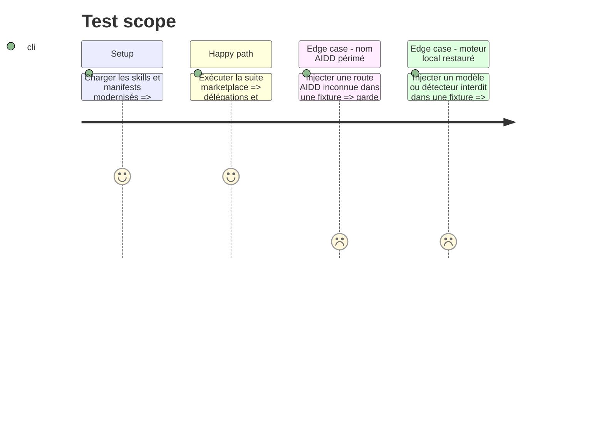

# Instruction: Verrouiller la délégation et aligner la marketplace

## Architecture projection

> Tree of the final files. ✅ create · ✏️ modify · ❌ delete

```txt
.
├── package.json ✏️
├── .claude-plugin/marketplace.json ✏️
├── plugins/overcode/
│   ├── .claude-plugin/plugin.json ✏️
│   ├── .codex-plugin/plugin.json ✏️
│   ├── CHANGELOG.md ✏️
│   ├── README.md ✏️
│   └── docs/
│       ├── concepts.md ✏️
│       └── workflow.md ✏️
└── tools/eval/
    └── aidd-delegation.mjs ✅
```

## User Journey



## Test Scope



## Tasks to do

### `1)` Ajouter une garde structurelle

> Empêcher le retour des noms AIDD périmés et des moteurs locaux supprimés.

1. Créer `tools/eval/aidd-delegation.mjs` avec des fixtures positives et négatives pour le contrat, les matrices de routage et les scénarios comportementaux.
2. Lire `references/aidd-delegation.md` et vérifier son schéma ; fournir un mode statique portable et un mode `--require-catalog <catalogue.json>` acceptant `{ packages: { name: version }, skills: [canonical-id] }`, qui résout réellement package, skill et version minimale et échoue si le fichier est absent, mal formé ou incomplet.
3. Vérifier l’absence de chemins de cache/version codés dans les actions, de `haiku`, `opus`, `background: true`, d’anciens algorithmes et de références actives aux ressources supprimées.
4. Brancher cette garde autonome dans `npm test`; ne pas modifier `consistency.mjs` si aucune primitive partagée n’est nécessaire.

### `2)` Aligner les surfaces publiques

> Décrire précisément les nouvelles frontières sans annoncer une capacité supprimée.

1. Mettre à jour README, concepts, workflow, changelog et descriptions des manifestes.
2. Maintenir l’identité et la description cohérentes entre Claude, Codex et la marketplace.
3. Régénérer le cachebuster Codex avec l’outil officiel du plugin.

### `3)` Valider l’ensemble

> Prouver la structure, le routage et le comportement avant implémentation ultérieure.

1. Valider `foresee`, `taste` et le plugin `overcode` avec les validateurs officiels.
2. Exécuter la cohérence, la couverture, la nouvelle garde, `npm test`, puis obligatoirement la garde avec `--require-catalog` sur un export du catalogue AIDD installé ; lancer enfin `overcode:behave` sur les deux suites et conserver ses résultats datés comme preuves de validation de la phase.
3. Vérifier `git diff --check` et rechercher toute référence active aux moteurs supprimés.

## Test acceptance criteria

| Task | Acceptance criteria |
| ---- | ------------------- |
| 1 | La CI statique échoue pour contrat incomplet, chemin de cache codé en dur, modèle hôte interdit ou détecteur supprimé ; la validation de release utilise `--require-catalog` et échoue aussi pour catalogue absent, identifiant absent ou version incompatible. |
| 2 | Les deux manifestes Overcode et la marketplace portent une description identique correspondant aux nouvelles frontières. |
| 3 | Les validateurs officiels, `npm test`, `git diff --check` et les deux résultats datés du juge comportemental passent sans référence active orpheline ; les contrôles statiques et comportementaux sont rapportés séparément. |
