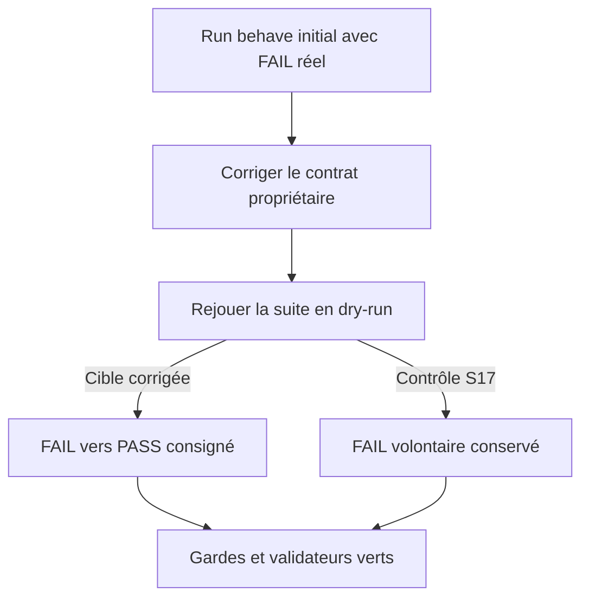
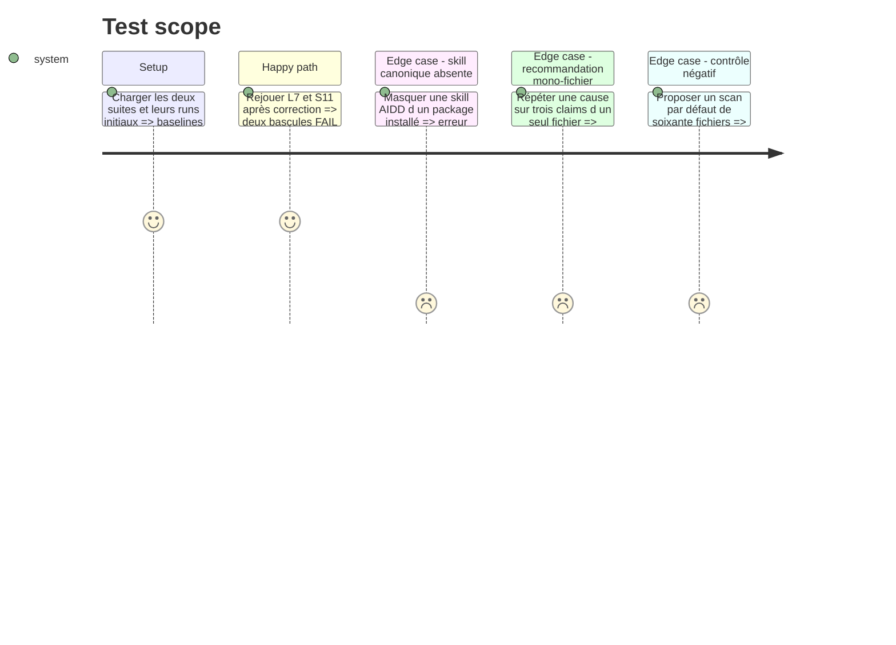

# Instruction: Corriger les deux contrats et confirmer les bascules

## Architecture projection

> Tree of the final files. ✅ create · ✏️ modify · ❌ delete

```txt
.
├── plugins/overcode/
│   ├── CHANGELOG.md ✏️
│   ├── references/
│   │   └── aidd-delegation.md ✏️
│   └── skills/
│       ├── foresee/evals/legacy-flags-scenarios.md ✏️
│       └── taste/
│           ├── actions/01-assess-doc.md ✏️
│           └── evals/scan-boundaries-scenarios.md ✏️
└── tools/eval/aidd-delegation.mjs ✏️
```

## User Journey



## Test Scope



## Tasks to do

### `1)` Compléter l'échec de résolution AIDD

> Rendre L7 déterministe pour chaque type d'absence.

1. Modifier la ligne `Canonical skill absent` pour exiger skill, package et version minimale issue de la baseline, puis arrêter la branche sans fallback.
2. Garder distincts package absent, skill absente et version installée trop ancienne.
3. Étendre `aidd-delegation.mjs` avec une fixture négative qui échoue si la réponse de skill absente omet la version minimale.

### `2)` Dissocier cause partagée et profondeur de réécriture

> Faire passer S11 sans changer le regroupement S10 ni la sécurité de suppression.

1. Conserver le groupe inter-fichiers pour une valeur obsolète identique présente dans au moins deux fichiers.
2. Calculer séparément, par fichier, le nombre de claims affectés par une même cause : `rewrite` à partir de trois, même sans second fichier ; `update` pour un ou deux.
3. Préserver les règles `delete`, l'ordre des verdicts, la lecture seule et les métriques harvest.

### `3)` Confirmer et documenter les corrections

> Transformer les deux FAIL réels en preuves de non-régression datées.

1. Rejouer `legacy-flags-scenarios.md` en dry-run et consigner L7 `FAIL → PASS`, sans régression L1–L6/L8–L12.
2. Rejouer `scan-boundaries-scenarios.md` et consigner S11 `FAIL → PASS`, S1–S10/S12–S16 stables et S17 toujours rouge comme contrôle négatif.
3. Ajouter les deux corrections à `CHANGELOG.md`, puis exécuter la garde AIDD statique/live, les validateurs officiels, `npm test` et `git diff --check`.

## Test acceptance criteria

| Task | Acceptance criteria |
| ---- | ------------------- |
| 1 | Une skill canonique absente produit skill, package, version minimale compatible et arrêt sans fallback ; la fixture structurelle échoue si l'un manque. |
| 2 | Trois claims d'une même cause dans un fichier recommandent `rewrite`, un ou deux recommandent `update`, tandis qu'un groupe inter-fichiers n'existe qu'à partir de deux fichiers. |
| 3 | Les Results logs montrent L7 et S11 `FAIL → PASS`, aucune autre ligne ne régresse, S17 reste le seul FAIL volontaire de sa suite, et toutes les gardes déterministes passent. |
