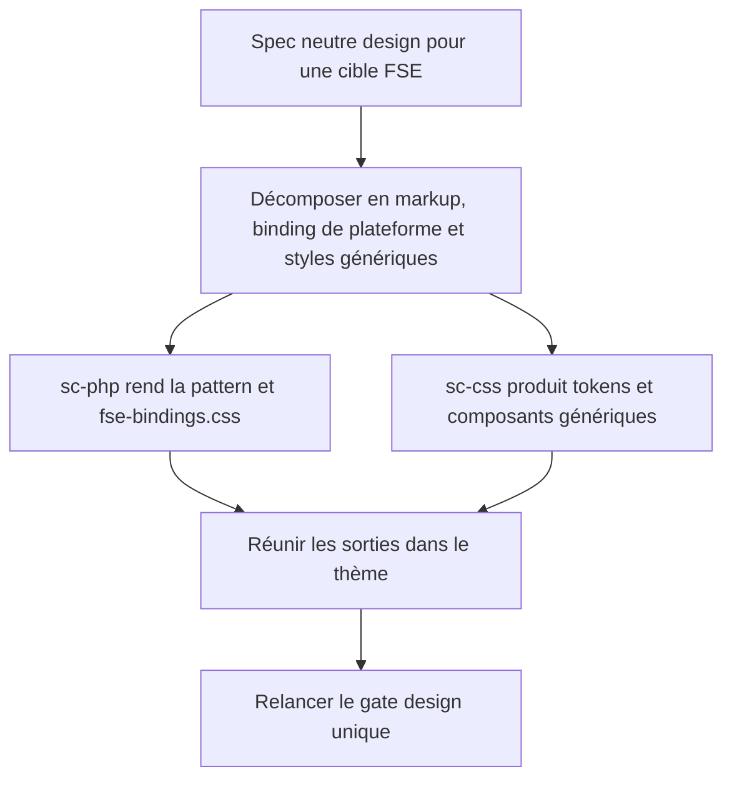
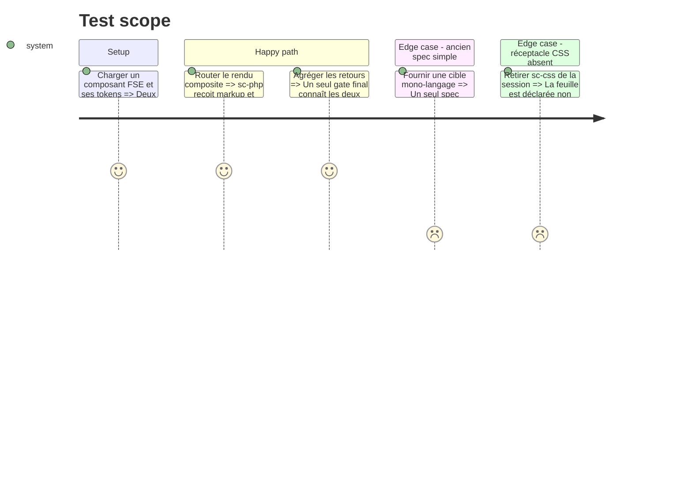

# Instruction: Router un rendu FSE composite vers PHP et CSS

## Architecture projection

> Tree of the final files. ✅ create · ✏️ modify · ❌ delete

```txt
.
├── plugins/
│   ├── design/
│   │   ├── references/
│   │   │   └── sc-pivot-contract.md                         ✏️ autoriser plusieurs émissions du spec simple pour une cible native composite
│   │   └── skills/diffuse/
│   │       ├── actions/03-pivot.md                           ✏️ router séparément markup FSE et feuilles de composant
│   │       └── evals/routing-autonomy-scenarios.md           ✏️ couvrir le routage PHP + CSS sans double autorité
│   ├── sc-css/skills/design-bridge/
│   │   ├── SKILL.md                                          ✏️ accepter les feuilles d’une stack mixte WordPress
│   │   ├── actions/01-realize-tokens.md                      ✏️ respecter l’output dir fourni par le spec
│   │   └── actions/02-realize-components.md                  ✏️ produire composants et point d’entrée dans la cible du thème
│   └── sc-php/skills/design-bridge/
│       └── SKILL.md                                          ✏️ déclarer la frontière markup/runtime et le hand-off CSS
```

Suppression : aucune.

## User Journey



## Test Scope



## Tasks to do

### `1)` Étendre la cardinalité du contrat de rendu

> Réutiliser le spec simple une fois par artefact au lieu d’introduire une seconde structure de contrat.

1. Conserver le format actuel de `Design render spec` et autoriser son émission répétée pour une même cible native.
2. Émettre un spec `php-fse-block` dont le retour peut contenir la pattern et son adapter de plateforme, puis un spec `css-stylesheet` indépendant.
3. Exiger un retour par spec et interdire que deux réceptacles écrivent le même chemin.

### `2)` Router WordPress vers deux réceptacles

> Faire de `diffuse` l’orchestrateur du markup FSE et des styles associés.

1. Détecter la cible FSE comme deux sorties : `php-fse-block` vers `sc-php`, avec son binding compagnon, puis `css-stylesheet` vers `sc-css`.
2. Émettre deux instances du spec existant, avec des output dirs non chevauchants.
3. Agréger les sorties avant le gate final et rendre toute absence explicite.

### `3)` Rendre sc-css utilisable dans une stack mixte

> Produire les fichiers CSS directement dans la cible publique du thème.

1. Retirer la restriction « CSS pure » pour les specs de feuille explicitement routés.
2. Dériver les chemins depuis l’output dir au lieu de coder `design/css/` en dur.
3. Produire un point d’entrée déterministe qui charge tokens, composants puis adapter FSE selon la topologie de layers mesurée.
4. Inclure l’adapter FSE parmi les sources contrôlées par `03-realize-lint`, sans demander à sc-css de le générer.

## Test acceptance criteria

| Task | Acceptance criteria |
| ---- | ------------------- |
| 1 | Une cible FSE émet deux specs simples indépendants ; une cible mono-langage continue d’en émettre exactement un. |
| 2 | Une cible WordPress FSE appelle exactement les réceptacles PHP et CSS, attribue `fse-bindings.css` au seul sc-php et refuse un verdict complet si l’un manque. |
| 3 | Les styles générés résident sous l’output dir du thème ; leur point d’entrée respecte l’ordre tokens → composants → binding FSE, et sc-css contrôle les trois surfaces. |
