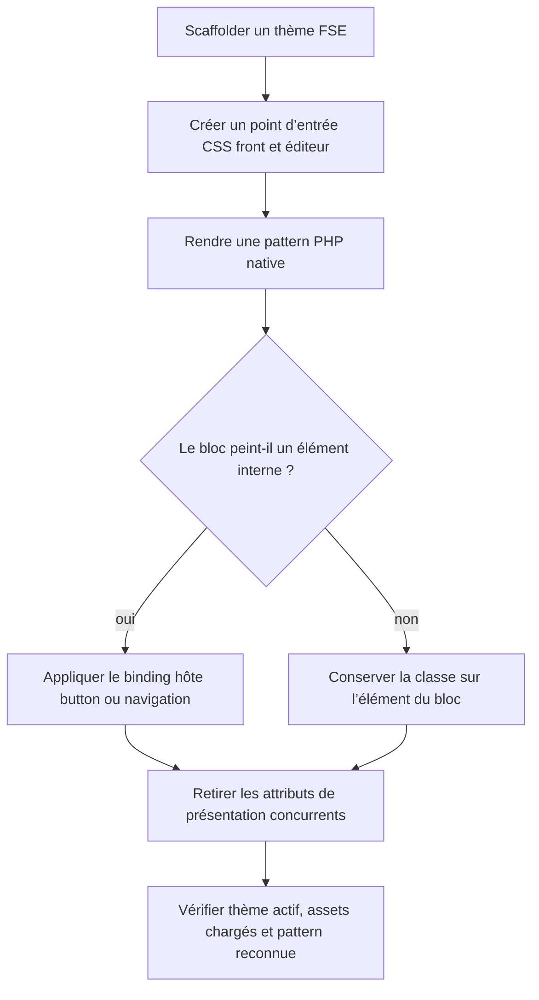
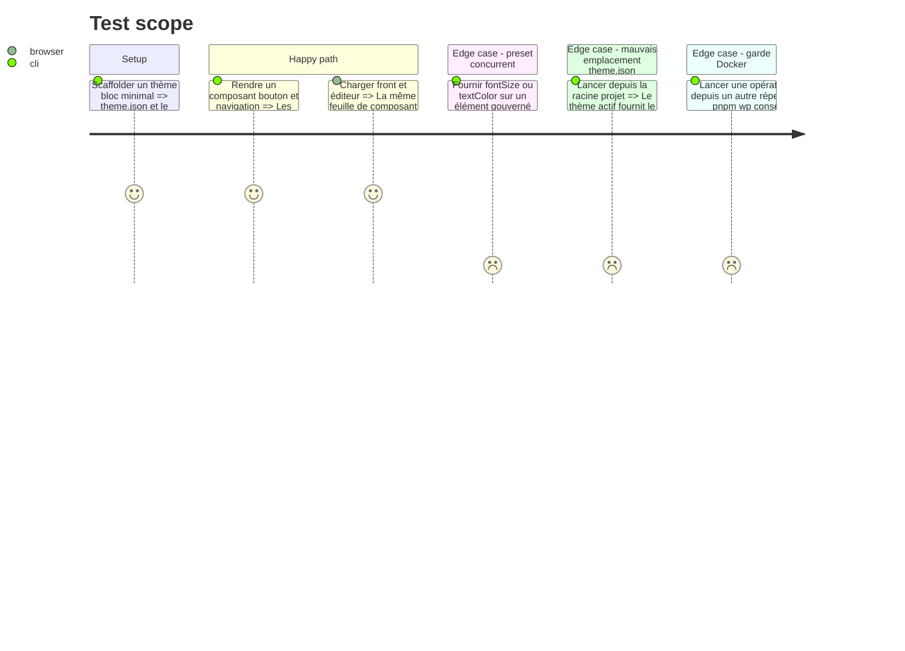

# Instruction: Corriger le scaffold et le rendu natif FSE

## Architecture projection

> Tree of the final files. ✅ create · ✏️ modify · ❌ delete

```txt
.
└── plugins/sc-php/skills/
    ├── setup/
    │   ├── actions/02-scaffold-wordpress.md                  ✏️ créer et charger le point d’entrée design
    │   ├── actions/06-verify.md                              ✏️ vérifier les styles front et éditeur
    │   ├── references/compose-project-name-guard.md          ✏️ ne documenter que le wrapper WP-CLI gardé
    │   ├── references/deploy-pipeline.md                     ✏️ faire passer les opérations WP par le wrapper
    │   ├── references/theme-plugin-skeleton.md               ✏️ câbler enqueue front, add_editor_style et arborescence CSS
    │   └── references/pitfalls.md                            ✏️ conserver une seule forme WP-CLI
    ├── design-bridge/
    │   ├── SKILL.md                                          ✏️ rendre obligatoires placement, retrait des overrides et chargement
    │   ├── actions/01-realize-lint.md                        ✏️ résoudre theme.json depuis le thème actif et contrôler le markup FSE
    │   ├── actions/02-render.md                              ✏️ produire patterns PHP, bindings core et commande pnpm wp
    │   ├── references/wordpress-lint-instances.md            ✏️ remplacer les appels wp-env nus
    │   └── references/wordpress-pitfalls.md                  ✏️ unifier CLI et règles de placement/présentation
    ├── builder-coverage/
    │   ├── SKILL.md                                          ✏️ remplacer la commande wp-env nue par pnpm wp
    │   ├── actions/01-scan.md                                ✏️ utiliser le wrapper pour les lectures de contenu
    │   ├── actions/02-close-gaps.md                          ✏️ utiliser le wrapper pour les écritures contrôlées
    │   ├── actions/03-organize.md                            ✏️ utiliser le wrapper pour les contrôles de catégories
    │   └── actions/scripts/
    │       ├── builder-coverage.php                          ✏️ émettre des commandes de remédiation compatibles avec le wrapper
    │       ├── category-balance.php                          ✏️ émettre des commandes de remédiation compatibles avec le wrapper
    │       └── dump-section.php                              ✏️ émettre des commandes de remédiation compatibles avec le wrapper
    └── sniff/references/capabilities/wordpress/
        └── fse-patterns.md                                   ✏️ aligner les critères d’audit sur les invariants de génération
```

Suppression : aucune.

## User Journey



## Test Scope



## Tasks to do

### `1)` Câbler les assets du scaffold

> Garantir qu’une feuille design dispose d’un chemin de chargement stable avant l’arrivée du contrat.

1. Ajouter le point d’entrée CSS du thème au squelette.
2. Le charger sur le front avec une version `filemtime()` en développement.
3. Charger le même fichier dans l’éditeur avec `add_editor_style()`.
4. Étendre `verify` pour constater les deux chargements, pas seulement un HTTP 200.

### `2)` Rendre des patterns FSE valides

> Produire les artefacts reconnus par WordPress et poser les classes au bon niveau.

1. Remplacer toutes les sorties `patterns/*.html` par `patterns/*.php` avec les quatre en-têtes attendus.
2. Définir les bindings génériques `core/button → .wp-block-button__link` et `core/navigation-link → .wp-block-navigation-item__content` dans un unique `fse-bindings.css` produit par sc-php.
3. Garder le vocabulaire DS sur le bloc natif, combiner uniquement classes DS déclarées et classes core connues, puis charger l’adapter après les composants génériques.
4. Déclarer `fse-bindings.css` comme cible du lint sc-css, sans laisser sc-css le régénérer.
5. Neutraliser layout injecté et attributs de présentation WordPress uniquement sur les propriétés gouvernées par le composant.

### `3)` Corriger les chemins et le CLI

> Faire viser chaque contrôle sur l’instance réellement servie.

1. Résoudre le thème actif via `pnpm wp eval`, puis son `theme.json`.
2. Remplacer toutes les utilisations utilisateur et remédiations émises sous la forme `pnpm dlx @wordpress/env run cli wp` dans `setup`, `design-bridge` et `builder-coverage` par le wrapper du scaffold.
3. Conserver l’appel interne à wp-env dans `scripts/wp.ps1`, après établissement vérifié de `COMPOSE_PROJECT_NAME`; le gate distingue cette implémentation gardée d’un appel nu.
4. Faire échouer clairement l’action si le wrapper manque au lieu de contourner sa garde.

### `4)` Aligner audit et génération

> Transformer les conventions FSE déjà documentées en invariants du renderer et du linter.

1. Vérifier les quatre en-têtes, l’unicité slug/fichier et la grammaire des blocs.
2. Vérifier les bindings des blocs à élément peint interne.
3. Conserver `fse-patterns.md` comme miroir d’audit des mêmes règles, sans promesse non réalisée.

## Test acceptance criteria

| Task | Acceptance criteria |
| ---- | ------------------- |
| 1 | Un thème neuf charge le même point d’entrée design sur le front et dans le canvas de l’éditeur. |
| 2 | Les patterns générées sont auto-enregistrées en `.php`; `fse-bindings.css` est produit une seule fois par sc-php, linté par sc-css, et bouton/navigation rendent leur style sur l’ancre interne. |
| 3 | Aucune instruction ni remédiation exécutable de `sc-php` ne contient un appel wp-env CLI nu ; seul `wp.ps1` peut invoquer wp-env après avoir posé la garde, et `theme.json` est résolu depuis le thème actif. |
| 4 | Le linter déterministe échoue sur une classe bouton/nav sans binding, un header incomplet ou une grammaire de blocs invalide. |
