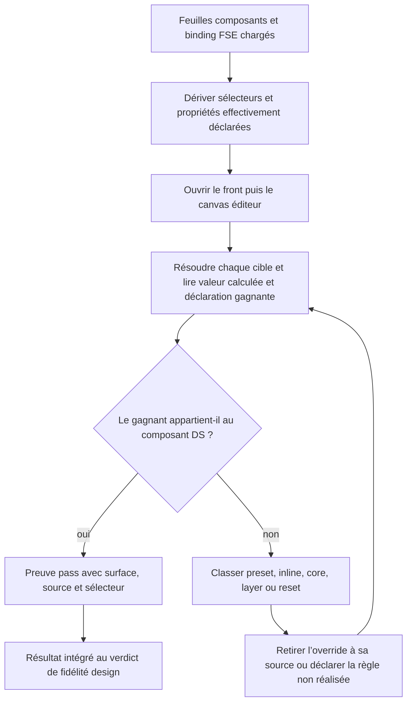
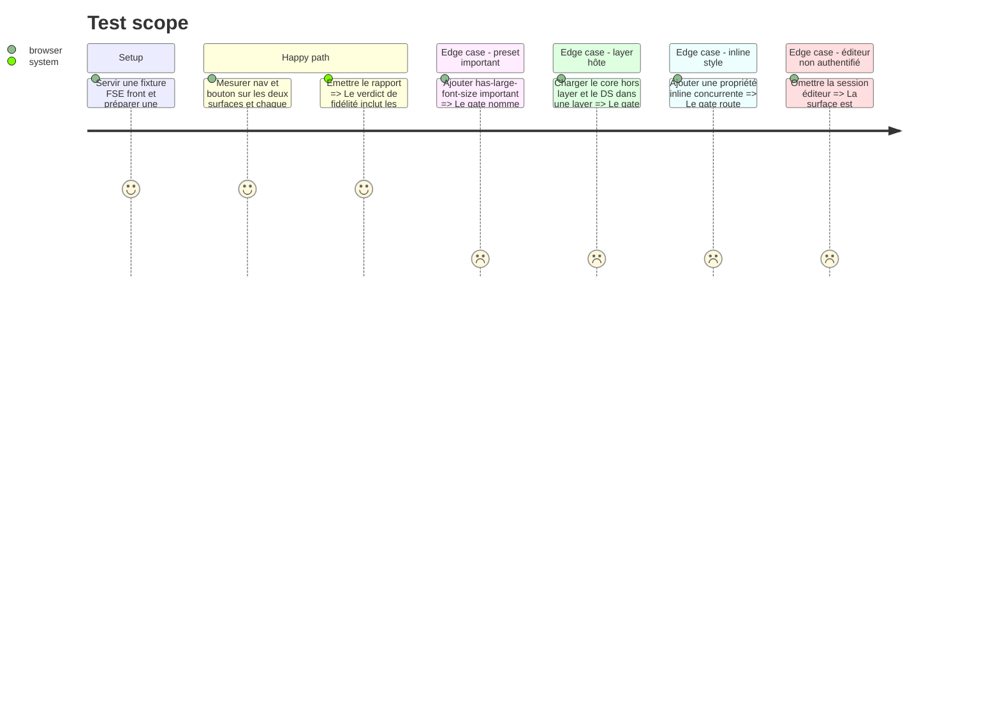

# Instruction: Prouver la propriété réelle de la cascade

## Architecture projection

> Tree of the final files. ✅ create · ✏️ modify · ❌ delete

```txt
.
├── plugins/design/
│   ├── adapters/measure/
│   │   ├── measure.py                                      ✏️ capturer la provenance de la déclaration gagnante sur demande
│   │   ├── config-gen.py                                   ✏️ dériver propriétés et surfaces depuis les feuilles DS et les hints oracle
│   │   ├── configs/example.json                            ✏️ documenter les cibles de propriété de cascade
│   │   └── tests/test_cascade_ownership.py                 ✅ tester importance, inline, layers et sélecteurs imbriqués
│   ├── agents/copycat.md                                   ✏️ exiger la preuve d’autorité après remove-override
│   ├── references/gate-natures.md                          ✏️ classer l’ownership comme sous-preuve absolue du gate de fidélité
│   └── skills/enforce/actions/05-fidelity-gate.md          ✏️ inclure les échecs ownership dans le verdict existant
├── plugins/sc-css/skills/design-bridge/
│   ├── SKILL.md                                            ✏️ distinguer conformité statique et autorité rendue
│   └── actions/03-realize-lint.md                          ✏️ produire le rapport stylesheet sans revendiquer le runtime
└── plugins/sc-php/skills/design-bridge/
    ├── SKILL.md                                            ✏️ déclarer le gate de cascade FSE comme preuve de plateforme
    └── actions/02-render.md                                ✏️ préparer les surfaces et exécuter l’ownership sur chaque composant posé
```

Suppression : aucune.

## User Journey



## Test Scope



## Tasks to do

### `1)` Étendre l’oracle de mesure

> Ajouter une mesure optionnelle de provenance sans changer le comportement des configurations existantes.

1. Dériver les cibles `ownership` des sélecteurs et déclarations présents dans les feuilles de composant DS et `fse-bindings.css` réellement chargés ; utiliser `oracle.json § props` seulement comme complément ou restriction explicite.
2. Déclarer les surfaces `front` et `editor`, résoudre le canvas iframe et accepter un `storage_state` Playwright ou un hook d’authentification fourni par l’environnement.
3. Lire dans Chromium la règle active, son sélecteur, sa source, son importance et sa layer.
4. Émettre séparément valeur calculée et propriétaire gagnant pour chaque surface et chaque breakpoint configuré.
5. Ne jamais écrire d’identifiants dans le config ; une surface éditeur sans session exploitable reste `unrealized` et maintient le verdict `OPEN`.
6. Garder les configs sans `ownership` strictement rétrocompatibles et rendre `unrealized` une classe DS sans déclaration inspectable.

### `2)` Définir le verdict de propriété DS

> Refuser qu’une valeur correcte masque un propriétaire incorrect.

1. Accepter comme propriétaire une règle issue des feuilles composants sc-css ou de `fse-bindings.css`, dont le sélecteur contient la classe attendue.
2. Échouer sur preset, inline, core ou reset gagnant pour une propriété gouvernée.
3. Nommer l’élément, la propriété, le gagnant et la source dans chaque violation.
4. Distinguer une surface non inspectable (`unrealized`) d’une surface inspectée non conforme (`fail`).

### `3)` Brancher la preuve à la chaîne FSE

> Faire du runtime WordPress l’autorité de composition, sans transférer la propriété des feuilles à sc-php.

1. Laisser `sc-css` attester les sources de style statiques, y compris l’adapter FSE produit par sc-php.
2. Faire produire par `sc-php` la configuration d’ownership à partir du markup posé, des feuilles DS chargées et des hints oracle disponibles.
3. Ajouter `ownership_failures` et `ownership_unrealized` au résumé de `measure.py`, puis les faire participer à son verdict `OPEN/CLOSED` existant.
4. Exiger la même preuve sur le front et dans le canvas éditeur, à chaque breakpoint du config.
5. Documenter dans `gate-natures.md` qu’il s’agit d’une sous-preuve absolue du gate de fidélité, pas d’un nouveau gate ni d’un rapport de pivot.
6. Ajouter cette preuve aux invariants de fermeture de `copycat` après chaque `remove-override`.

## Test acceptance criteria

| Task | Acceptance criteria |
| ---- | ------------------- |
| 1 | Une configuration existante conserve son résultat ; les propriétés ownership sont dérivées des feuilles composants/binding réelles et exposent leur gagnant sur le front et dans l’éditeur à chaque breakpoint. |
| 2 | Deux éléments de même valeur calculée produisent des verdicts opposés lorsque l’un est gouverné par le DS et l’autre par un preset WordPress. |
| 3 | Le gate final ne peut être `CLOSED` que si les runtimes front et éditeur attribuent les propriétés déclarées aux composants DS ; aucune règle inconnue n’est ajoutée à `pivotReports`. |
