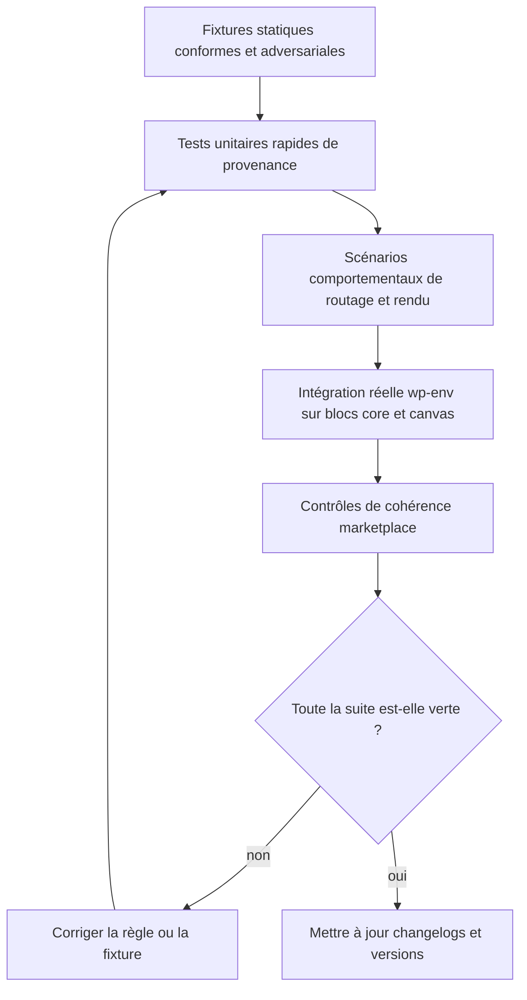
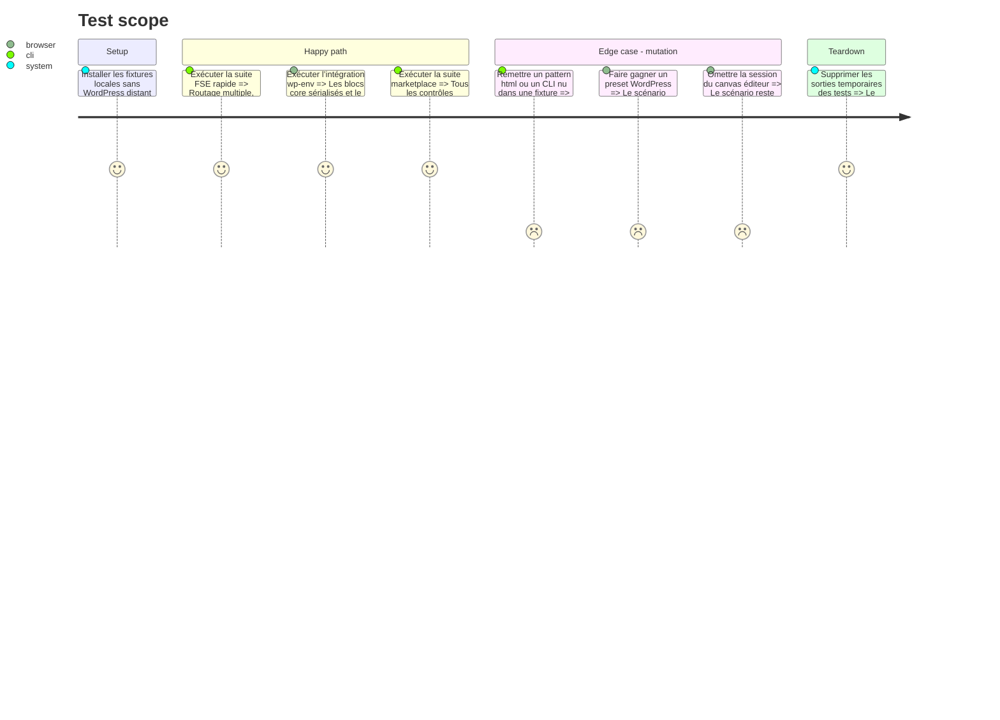

# Instruction: Verrouiller les régressions et publier les contrats alignés

## Architecture projection

> Tree of the final files. ✅ create · ✏️ modify · ❌ delete

```txt
.
├── package.json                                             ✏️ ajouter le gate comportemental FSE à la suite globale
├── tools/eval/
│   ├── sc-php-fse-behave.mjs                               ✅ exercer rapidement les invariants transverses design/sc-css/sc-php
│   └── sc-php-fse-integration.mjs                          ✅ exercer le scaffold sur un vrai wp-env à la demande
├── plugins/
│   ├── design/
│   │   ├── CHANGELOG.md                                    ✏️ documenter le rendu composite et la preuve de cascade
│   │   ├── .claude-plugin/plugin.json                      ✏️ publier la version alignée
│   │   └── .codex-plugin/plugin.json                       ✏️ publier la version Codex alignée
│   ├── sc-css/
│   │   ├── CHANGELOG.md                                    ✏️ documenter le support des stacks mixtes
│   │   ├── .claude-plugin/plugin.json                      ✏️ publier la version alignée
│   │   └── .codex-plugin/plugin.json                       ✏️ synchroniser la version Codex désormais présente
│   └── sc-php/
│       ├── CHANGELOG.md                                    ✏️ documenter les garanties FSE ajoutées
│       ├── README.md                                       ✏️ exposer les gates de rendu et de cascade
│       ├── .claude-plugin/plugin.json                      ✏️ publier la version alignée
│       ├── .codex-plugin/plugin.json                       ✏️ synchroniser la version Codex désormais présente
│       └── skills/design-bridge/evals/
│           ├── scenarios.json                              ✅ couvrir les décisions du renderer
│           └── fixtures/fse-cascade/                       ✅ reproduire front/éditeur, nav, bouton, preset et layers
└── .claude-plugin/marketplace.json                         ✏️ synchroniser les versions et descriptions publiées
```

Suppression : aucune.

## User Journey



## Test Scope



## Tasks to do

### `1)` Construire les fixtures de régression

> Reproduire chaque défaut observé avec un contre-exemple qui bascule le verdict.

1. Ajouter des surfaces statiques front et canvas éditeur contenant un bouton core, un lien de navigation, un preset `!important`, un style inline et un hôte unlayered.
2. Fournir pour chaque cas une variante conforme et une variante fautive.
3. Vérifier les patterns `.php`, les headers, le point d’entrée CSS et les commandes `pnpm wp`.

### `2)` Ajouter le gate comportemental FSE

> Faire échouer la CI sur les contradictions que les contrôles actuels laissent passer.

1. Vérifier les invariants croisés dans les skills et références, en autorisant l’appel wp-env uniquement dans l’implémentation gardée de `wp.ps1`.
2. Exécuter les scénarios de routage multiple et les tests de provenance sur fixtures statiques.
3. Brancher ce gate rapide dans `pnpm test` sans démarrer Docker ni masquer les sorties existantes.

### `3)` Ajouter une intégration wp-env explicite

> Valider les hypothèses de plateforme sur le DOM et le canvas réellement produits par WordPress.

1. Scaffolder un thème temporaire, démarrer wp-env et activer le thème via `pnpm wp`.
2. Insérer les vrais blocs `core/button` et `core/navigation-link`, puis contrôler front et canvas éditeur authentifié.
3. Exposer la commande séparée `test:fse-integration`; ne pas la cacher derrière la suite rapide.
4. Arrêter l’environnement et supprimer uniquement le projet temporaire résolu par le test.

### `4)` Publier les changements de contrat

> Livrer ensemble les versions dépendantes pour éviter un design récent avec des réceptacles anciens.

1. Mettre à jour les changelogs de `design`, `sc-css` et `sc-php`.
2. Synchroniser leurs manifestes Claude, Codex et marketplace.
3. Expliquer dans le README sc-php la différence entre vocabulaire valide, feuille chargée et propriété réellement gouvernée.

### `5)` Exécuter la validation finale

> Prouver la compatibilité et la non-régression avant hand-off.

1. Lancer les tests ciblés de mesure, le gate FSE rapide et `test:fse-integration`.
2. Lancer `consistency`, `design-behave` puis la suite globale.
3. Contrôler que chaque mutation négative attendue rend un exit non nul et un message actionnable.

## Test acceptance criteria

| Task | Acceptance criteria |
| ---- | ------------------- |
| 1 | Chaque défaut de l’audit possède une fixture qui échoue avant correction et passe après correction. |
| 2 | `pnpm test` exécute sans Docker un gate FSE capable de détecter patterns `.html`, CLI nu hors wrapper, binding absent et propriétaire CSS incorrect. |
| 3 | `test:fse-integration` valide sur un vrai wp-env le DOM des blocs core, le front et le canvas éditeur, puis nettoie son environnement temporaire. |
| 4 | Les trois plugins publient des contrats compatibles avec versions et changelogs synchronisés. |
| 5 | Les suites ciblées et globales passent, et les contre-épreuves échouent pour la raison attendue. |
