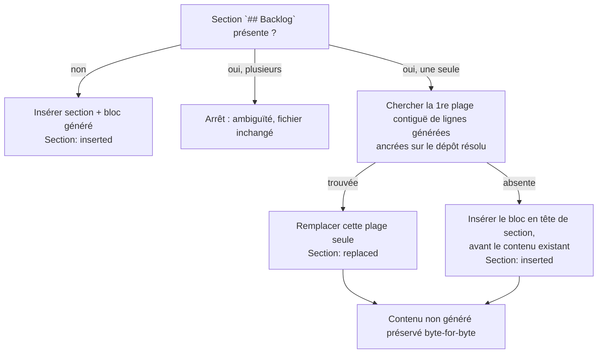

<!-- Fill or omit these sections; never add, rename, or reorder one. -->

# Instruction: Borner le remplacement au bloc généré

## Architecture projection

> Tree of the final files. ✅ create · ✏️ modify · ❌ delete

```txt
.
└── plugins/
    └── overcode/
        └── skills/
            └── alias/
                └── actions/
                    └── 11-backlog.md   ✏️ Step 4 : bloc sans titre ; Step 5 : borne par bloc généré ; Step 6 : contrôle de préservation
```

## User Journey



## Tasks to do

### `1)` Aligner Step 4 sur la notion de bloc

> Deux définitions concurrentes du « bloc produit » ne peuvent pas coexister dans la même action.

1. Retirer le titre `## Backlog` du snippet de l'état vide au Step 4 : ce Step produit le **bloc** seul, soit les lignes d'issues, soit `_Aucune issue ouverte._`.
2. Renvoyer explicitement la pose du titre au Step 5, seul responsable du placement de la section.

### `2)` Définir le bloc généré dans Step 5

> Nommer explicitement ce que la skill a le droit d'écraser.

1. Définir le *bloc généré* : première plage contiguë de lignes de la section, titre exclu, dont chaque ligne est soit une ligne d'issue générée, soit `_Aucune issue ouverte._`, soit une ligne vide encadrée des deux côtés par des lignes conformes.
2. Définir la ligne d'issue générée comme `- [#<numéro>](<url>) — <titre> (<état>)` où `<url>` est le lien canonique construit au Step 4 pour le dépôt résolu au Step 2, et où le numéro terminal de `<url>` est identique au `<numéro>` affiché. Une ligne de même forme pointant vers un autre dépôt n'est pas générée.
3. Préciser que la reconnaissance s'arrête à la première ligne non conforme, et que les lignes vides de queue n'appartiennent pas au bloc.
4. Documenter les limites assumées de la reconnaissance par motif :
   - une ligne manuelle strictement identique à une sortie de la skill pour ce dépôt est indiscernable et sera remplacée ;
   - si une telle ligne manuelle précède le bloc réel dans la section, c'est elle qui est reconnue : le bloc réel devient orphelin et se duplique à chaque synchronisation ;
   - `_Aucune issue ouverte._` est le seul motif non ancré au dépôt, une note manuelle portant exactement cette phrase est donc remplaçable.
5. Poser la reconnaissance indépendante du style de fins de ligne et du BOM : une ligne CRLF conforme est reconnue comme telle.

### `3)` Remplacer la règle de délimitation

> Retirer la borne structurelle qui capture du contenu utilisateur.

1. Supprimer « remplacer tout son contenu jusqu'au prochain titre de niveau `#` ou `##` » et toute dépendance à ce titre suivant.
2. Poser : le remplacement ne porte que sur le bloc généré identifié.
3. Poser : section existante sans bloc généré → insérer le bloc en tête de section, avant tout contenu existant.
4. Poser la règle d'espacement : exactement une ligne vide entre le titre et le bloc, et exactement une ligne vide entre le bloc et la première ligne de contenu qui suit dans la section, sans accumulation d'une resynchronisation à l'autre.
5. Conserver inchangées les règles voisines : refus si plusieurs sections `## Backlog`, insertion après le titre `# ...` ou après le frontmatter, écriture atomique unique.
6. Reformuler la clause de préservation en « tout contenu de la section extérieur au bloc généré, et tout contenu hors section, restent byte-for-byte identiques ».

### `4)` Étendre le contrôle et le rapport du Step 6

> Rendre la préservation vérifiable à la relecture, et le rapport lisible sur trois chemins.

1. Ajouter au contrôle : tout contenu non généré de la section `## Backlog` est identique à l'original.
2. Trancher la valeur rapportée : `replaced` si un bloc généré préexistant a été remplacé, `inserted` dans les deux autres cas — section créée, ou bloc posé en tête d'une section existante qui n'en avait pas.

## Test acceptance criteria

| Task | Acceptance criteria                                                                                                                                       |
| ---- | ----------------------------------------------------------------------------------------------------------------------------------------------------------- |
| 1    | L'action ne contient plus qu'un seul endroit où le titre `## Backlog` est posé.                                                                            |
| 2    | Un lecteur de Step 5 peut classer chaque ligne d'une section `## Backlog` en générée ou non générée sans consulter d'autre document.                        |
| 2    | Une ligne de forme identique pointant vers un dépôt autre que le `git_repo` résolu est conservée.                                                          |
| 3    | Un document dont la section `## Backlog` est suivie de notes manuelles sans titre `#`/`##` jusqu'à la fin du fichier conserve ces notes après resynchronisation. |
| 3    | Une section `## Backlog` contenant uniquement du texte manuel reçoit le bloc généré en tête, texte manuel intact en dessous.                                |
| 3    | Une section contenant un bloc généré suivi d'une sous-section `### ...` voit son bloc remplacé et la sous-section conservée.                                |
| 3    | Trois resynchronisations successives sur le même document produisent des octets identiques après la première.                                              |
| 4    | Le Step 6 échoue explicitement si un octet non généré de la section a changé.                                                                              |
| 4    | Chacun des trois chemins produit une valeur `Section:` déterminée par l'action, sans choix laissé au lecteur.                                              |
