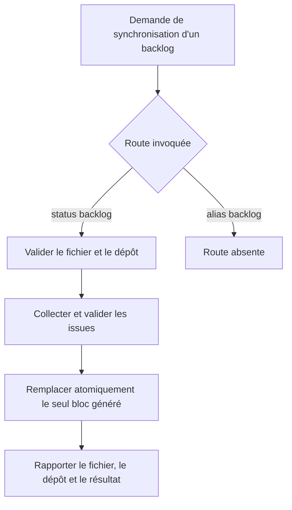
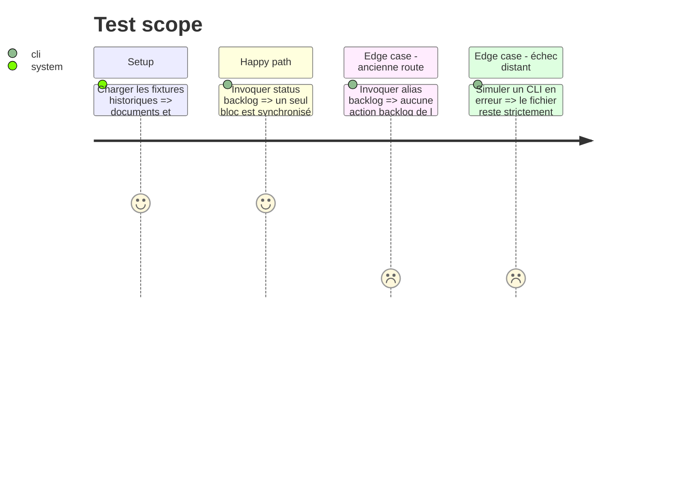

# Instruction: Transférer l'autorité du backlog vers `status`

## Architecture projection

> Tree of the final files. ✅ create · ✏️ modify · ❌ delete

```txt
.
└── plugins/
    └── overcode/
        └── skills/
            ├── status/
            │   ├── SKILL.md                              ✏️ action, description et routage backlog
            │   ├── actions/
            │   │   └── 04-backlog.md                  ✅ action migrée sans perte de garanties
            │   └── evals/
            │       ├── scenarios.json                    ✏️ routes directes de `status backlog`
            │       ├── backlog-scenarios.md              ✅ harnais migré et historique conservé
            │       └── fixtures/
            │           └── backlog/                     ✅ fixtures migrées
            └── alias/
                ├── SKILL.md                              ✏️ retrait de la route et de la promesse backlog
                ├── actions/
                │   └── 11-backlog.md                  ❌ ancienne autorité
                └── evals/
                    ├── scenarios.json                    ✏️ retrait des routes backlog
                    ├── backlog-scenarios.md              ❌ harnais déplacé
                    └── fixtures/
                        └── backlog/                     ❌ fixtures déplacées
```

## User Journey



## Test Scope



## Tasks to do

### `1)` Déplacer l'action sans altérer son contrat de sécurité

> Changer le propriétaire avant de changer le comportement rend la migration relisible.

1. Créer `status/actions/04-backlog.md` à partir de l'action actuelle et adapter seulement ses chemins, son invocation et son vocabulaire de propriété.
2. Conserver la validation du frontmatter `git_repo`, la résolution GitHub/GitLab, la preuve des hôtes GitLab auto-hébergés et l'absence de toute écriture distante.
3. Conserver l'écriture locale unique et atomique, le BOM, les fins de ligne et la préservation byte-for-byte hors bloc généré.
4. Supprimer `alias/actions/11-backlog.md` une fois la nouvelle action complète sur disque.

### `2)` Faire router `status` et cesser de router `alias`

> Une action déplacée doit être atteignable par son nouveau propriétaire et introuvable par l'ancien.

1. Donner à `status` une description non vide qui couvre la santé projet et la synchronisation documentaire du backlog.
2. Ajouter `backlog` comme quatrième action indépendante, avec le fichier Markdown requis ; les options milestone n'entrent dans le contrat public qu'avec leur implémentation en phase 2.
3. Ajouter les formulations directes et naturelles de synchronisation aux routes de `status` et à ses scénarios de dispatch.
4. Retirer de `alias/SKILL.md` sa ligne d'action, ses formulations de routage et toute mention de la synchronisation de backlog dans le frontmatter.
5. Retirer les quatre scénarios backlog de `alias/evals/scenarios.json` et ajouter un contrôle qui n'attend plus cette action.

### `3)` Migrer les preuves comportementales avec leur historique

> Le changement de namespace ne remet pas à zéro les garanties déjà obtenues.

1. Déplacer `backlog-scenarios.md` et tout `fixtures/backlog/` sous `status/evals/`.
2. Mettre à jour le titre, les chemins, les invocations et le prompt du harnais pour viser `status/actions/04-backlog.md`.
3. Conserver les scénarios S1–S20, leurs numéros et le journal daté existant ; le qualifier d'historique mesuré sur l'ancienne route, sans réécrire ses verdicts.
4. Ajouter un run de migration qui rejoue le comportement inchangé sur la nouvelle route et garde les contrôles négatifs vivants.

## Test acceptance criteria

| Task | Acceptance criteria |
| ---- | ------------------- |
| 1 | `status backlog <fichier.md>` porte toutes les garanties transactionnelles et de préservation de l'ancienne action. |
| 1 | Aucun fichier `alias/actions/*backlog*` ne subsiste après le transfert. |
| 2 | Les formulations de synchronisation sélectionnent `status backlog`, tandis que `alias` n'annonce et ne route plus d'action backlog. |
| 2 | Les actions `memory`, `report` et `audit` de `status` gardent leurs routes existantes. |
| 3 | Les fixtures et S1–S20 existent sous `status/evals/`, sans renumérotation ni falsification du journal antérieur. |
| 3 | Le rejeu de migration préserve les notes manuelles, les hôtes auto-hébergés, les formats CRLF/BOM et l'arrêt sans écriture en cas d'échec. |
