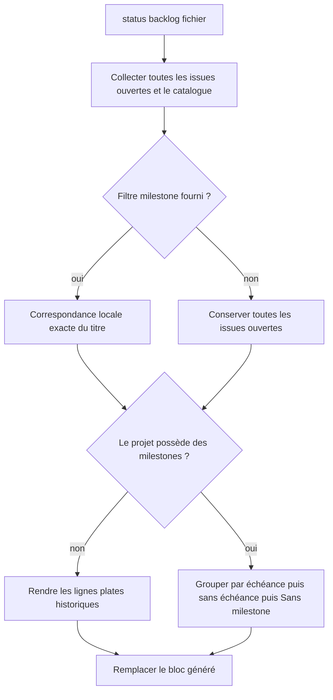
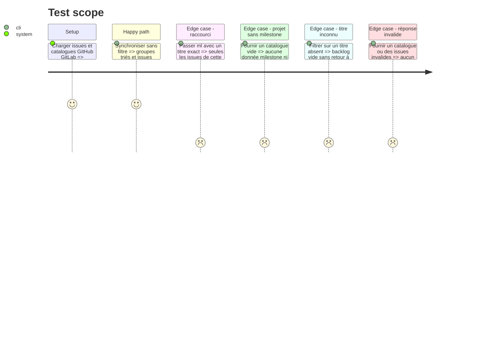

# Instruction: Ajouter le contrat de milestones au backlog

## Architecture projection

> Tree of the final files. ✅ create · ✏️ modify · ❌ delete

```txt
.
└── plugins/
    └── overcode/
        └── skills/
            └── status/
                ├── SKILL.md                                  ✏️ entrées `--milestone` et `--ml`
                ├── actions/
                │   └── 04-backlog.md                      ✏️ arguments, collecte, tri, rendu et reconnaissance
                └── evals/
                    ├── backlog-scenarios.md                  ✏️ scénarios milestone et compatibilité
                    └── fixtures/
                        └── backlog/
                            ├── cli-responses.json           ✏️ issues et catalogues milestone multi-provider
                            └── github-milestones.md          ✅ bloc groupé, groupe obsolète et notes manuelles
```

## User Journey



## Test Scope



## Tasks to do

### `1)` Fermer la grammaire des arguments

> Les deux orthographes du filtre doivent avoir exactement un sens sur les deux providers.

1. Accepter `status backlog <fichier.md>`, suivi facultativement de `--milestone <titre>` ou `--ml <titre>`.
2. Traiter `--ml` comme un synonyme strict de `--milestone`, sans branche fonctionnelle distincte.
3. Exiger un seul fichier positionnel, une valeur non vide pour le filtre et un seul filtre ; refuser avant tout appel réseau les options inconnues, valeurs manquantes ou formes dupliquées.
4. Comparer le titre normalisé uniquement pour les espaces périphériques, puis exactement et avec respect de la casse.
5. Un titre absent du catalogue est un succès vide : aucune issue n'est rendue et le filtre n'est jamais ignoré.

### `2)` Collecter et valider issues et catalogues sans dépendre du filtre CLI

> La différence GitHub/GitLab sur `--milestone` ne doit pas traverser le contrat public.

1. Remplacer la collecte GitHub bornée par `gh api --paginate` sur `repos/<owner>/<repo>/issues?state=open&per_page=100`, l'endpoint étant construit seulement depuis les segments déjà validés ; exclure tout objet portant la clé `pull_request`.
2. Valider sur chaque issue GitHub `number`, `title`, `state` et, lorsqu'il existe, l'objet `milestone` avec son identifiant et son titre.
3. Paginer GitLab avec `glab issue list --opened --page <N> --per-page 100` jusqu'à la première page vide, puis valider `iid`, titre, état et l'objet milestone éventuel.
4. Collecter toutes les pages du catalogue, dans tous les états : API milestones paginée via `gh` pour GitHub ; `glab milestone list` paginé avec ancêtres pour GitLab et son hôte résolu.
5. Valider chaque entrée de catalogue avant toute écriture : identifiant provider stable et unique dans toutes les pages, titre non vide, échéance ISO valide ou nulle et état reconnu ; exiger de même l'unicité globale des numéros d'issues collectés.
6. Normaliser `due_on` GitHub et `due_date` GitLab vers la date civile `AAAA-MM-JJ` avant le tri et le rendu.
7. Conserver les issues ouvertes seulement, rattacher chaque issue au catalogue par identifiant provider, puis appliquer le filtre local sur le titre brut.
8. Un titre filtré absent reste un succès vide ; plusieurs entrées de catalogue portant exactement ce titre sont une ambiguïté et arrêtent l'action sans écrire.
9. Considérer les milestones de groupe GitLab assignables au projet comme des milestones du projet pour le rendu.
10. Toute page manquante, commande en erreur ou réponse invalide annule la synchronisation entière et laisse le fichier inchangé.

### `3)` Rendre les groupes dans un ordre stable

> Le document doit rester plat lorsque la notion de milestone n'existe pas dans le projet.

1. Si le catalogue complet est vide, conserver exactement le format historique d'une ligne par issue, sans champ ni titre milestone.
2. Sinon, regrouper les issues par identifiant provider de milestone et rendre un sous-titre au motif réservé `### Milestone: <titre> — échéance <AAAA-MM-JJ>` ou `### Milestone: <titre> — sans échéance`.
3. Rendre les issues sans milestone sous `### Sans milestone`, seulement si ce groupe n'est pas vide.
4. Trier les groupes datés par échéance croissante, puis par titre à égalité ; trier les groupes sans échéance par titre ; placer `Sans milestone` en dernier.
5. Préserver l'ordre du provider à l'intérieur de chaque groupe et ne jamais répéter le nom de milestone sur chaque ligne d'issue.
6. Si le filtre ne retient aucune issue, rendre uniquement `_Aucune issue ouverte._`, sans sous-titre vide.
7. Conserver séparément le titre brut pour l'identité, le filtre et le tri, et un titre de rendu : retours et espaces internes ramenés à un espace, puis `\\`, accents graves, crochets, astérisques, underscores et chevrons échappés afin que la valeur distante reste du texte Markdown inline sur une seule ligne.

### `4)` Étendre la borne générée sans perdre la compatibilité DEC-011

> Un sous-titre généré doit être remplaçable, mais une sous-section manuelle doit rester une borne d'arrêt.

1. Définir un bloc groupé comme une suite de groupes, chacun composé d'un sous-titre `### Milestone: ...` ou `### Sans milestone` immédiatement suivi d'au moins une ligne d'issue canonique pour le dépôt courant ; seules des lignes d'issues supplémentaires et une ligne vide entre groupes sont admises.
2. Ne jamais reconnaître un sous-titre réservé isolé ou suivi de prose comme un bloc généré.
3. Continuer de reconnaître comme autre forme complète les anciens blocs plats, le suffixe d'état historique et leurs lignes vides internes.
4. Arrêter la reconnaissance sur tout autre sous-titre `###`, notamment `### Notes historiques`.
5. Remplacer en une passe les groupes anciens ou devenus vides afin qu'aucun sous-titre obsolète ne reste orphelin.
6. Documenter la limite restante : un sous-titre manuel strictement identique au format réservé et suivi d'une ligne d'issue canonique est indiscernable d'un groupe généré.
7. Maintenir l'idempotence, la préservation du contenu manuel et les garanties BOM/CRLF sur les blocs plats comme groupés.

### `5)` Étendre le harnais aux deux providers et aux transitions de forme

> Les scénarios doivent prouver le filtre, le tri et la non-destruction, pas seulement montrer un exemple heureux.

1. Enrichir les réponses GitHub et GitLab avec des milestones datées dans le désordre, deux échéances identiques, une milestone sans date, une issue non assignée et un titre portant des caractères Markdown/HTML.
2. Ajouter les catalogues vide, nominal, paginé, invalide et en échec pour chaque provider, dont deux milestones GitHub de même titre mais d'identifiants distincts et une réponse répétant un identifiant entre deux pages.
3. Inclure une page GitHub mêlant issues et pull requests, et plusieurs pages GitLab, pour prouver l'exhaustivité sans contamination.
4. Ajouter des scénarios distincts pour le filtre long, `--ml`, le titre inconnu, le titre ambigu, la casse divergente, les arguments invalides et le projet sans milestone.
5. Ajouter les transitions bloc plat vers bloc groupé, bloc groupé vers plat, groupe renommé ou disparu et resynchronisation idempotente.
6. Ajouter un contrôle négatif qui rejette une implémentation avalant `### Notes historiques` ou un sous-titre réservé isolé, et un autre qui retombe silencieusement sur toutes les issues quand le filtre ne correspond pas.

## Test acceptance criteria

| Task | Acceptance criteria |
| ---- | ------------------- |
| 1 | `--milestone "Version 2"` et `--ml "Version 2"` produisent le même ensemble d'issues et le même document. |
| 1 | Une option inconnue, un filtre sans valeur ou deux filtres arrêtent l'action avant le premier appel réseau et avant toute écriture. |
| 2 | GitHub et GitLab filtrent sur le même titre exact sans dépendre de la sémantique native de leur option milestone. |
| 2 | La pagination GitHub retient toutes les issues ouvertes et aucune pull request ; la pagination GitLab atteint la première page vide. |
| 2 | Deux milestones de même titre ne sont jamais fusionnées et rendent le filtre par titre explicitement ambigu. |
| 2 | Un numéro d'issue ou un identifiant de milestone répété entre pages invalide la collecte et laisse le fichier inchangé. |
| 2 | Un échec sur n'importe quelle page d'issues ou de catalogue laisse le fichier byte-for-byte identique. |
| 3 | Les milestones datées sont en ordre chronologique, les non datées les suivent et `Sans milestone` ferme le bloc. |
| 3 | Un projet dont le catalogue est vide rend les mêmes lignes plates qu'avant cette fonctionnalité et ne contient aucun texte `Milestone`. |
| 3 | Un filtre inconnu produit `_Aucune issue ouverte._` et ne rend aucune issue d'une autre milestone. |
| 3 | Un titre distant contenant retours, crochets, emphase, code inline ou chevrons reste une unique ligne de sous-titre affichée comme texte. |
| 4 | Une resynchronisation remplace les sous-titres générés obsolètes mais conserve `### Notes historiques` et son contenu byte-for-byte. |
| 4 | Un sous-titre au motif réservé qui n'est pas suivi d'une issue canonique reste du contenu manuel intact. |
| 4 | Les documents déjà synchronisés en format plat sont reconnus et migrent sans duplication. |
| 5 | Le harnais exerce les deux providers, les deux orthographes du filtre, les catalogues vide/invalide/paginé/ambigu, les pull requests parasites et les deux contrôles négatifs. |
