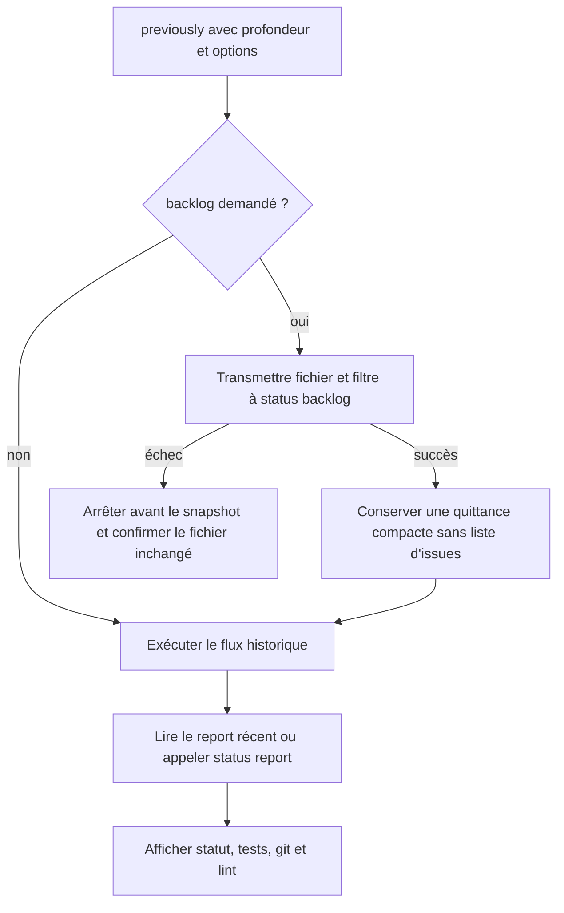
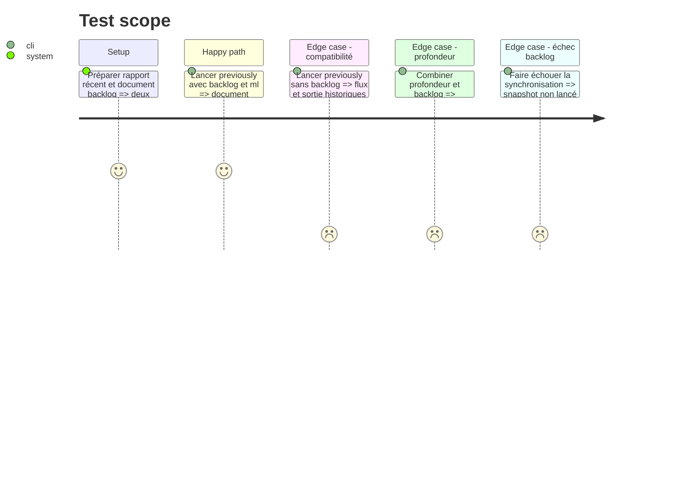

# Instruction: Brancher `previously` sans dupliquer les issues

## Architecture projection

> Tree of the final files. ✅ create · ✏️ modify · ❌ delete

```txt
.
└── plugins/
    └── overcode/
        └── skills/
            ├── alias/
            │   ├── SKILL.md                                  ✏️ contrat d'arguments de previously
            │   ├── actions/
            │   │   └── 04-previously.md                  ✏️ synchronisation préalable et appel explicite du report
            │   ├── assets/
            │   │   └── previously.md                     ✏️ retrait de la liste d'issues dédiée
            │   └── evals/
            │       └── scenarios.json                        ✏️ profondeur et options backlog combinées
            └── status/
                └── evals/
                    └── backlog-scenarios.md                  ✏️ invocation via previously et arrêt sur échec
```

## User Journey



## Test Scope



## Tasks to do

### `1)` Étendre les arguments de `previously` sans casser la profondeur

> Le chemin backlog doit être nommé pour ne pas entrer en collision avec `15` ou `7d`.

1. Fermer la syntaxe publique : `previously [<profondeur>] [--backlog <fichier.md>] [--milestone <titre> | --ml <titre>]`.
2. Conserver la profondeur positionnelle actuelle, nombre de commits ou durée, et permettre son placement avant les options nommées.
3. Accepter les options milestone seulement avec `--backlog`; refuser avant tout travail un filtre orphelin, un fichier manquant, les doublons et les options inconnues.
4. Transmettre au mot près le fichier et l'une des deux orthographes du filtre à `status backlog`.
5. Sans `--backlog`, exécuter exactement les Steps historiques de `previously`.

### `2)` Faire de la synchronisation demandée une précondition du snapshot

> Une routine ne doit pas masquer l'échec du travail qu'elle annonce comme systématique.

1. Ajouter avant le Status check un Step backlog conditionnel, exécuté à chaque invocation portant `--backlog`, même lorsqu'un rapport de statut récent existe.
2. En cas de succès, poursuivre vers le rapport récent ; lorsqu'il manque, invoquer explicitement `status report` plutôt qu'un `status` nu, puis continuer vers le snapshot git/tests/lint.
3. En cas d'échec, arrêter avant les sous-agents et reprendre la garantie `File unchanged.` de l'action appelée.
4. Absorber le rapport détaillé de synchronisation dans une quittance compacte `Backlog: updated <fichier> (inserted|replaced)` ; ne pas réafficher les lignes ni leur nombre dans cette quittance.
5. Retirer du sous-agent git la résolution distante `gh issue view` et son champ `issues[]`, puis retirer de l'asset `previously` la section `Open issues referenced in recent commits`.
6. Laisser `status report` propriétaire du seul compte `Open issues` visible dans le bloc de statut ; l'activité récente peut conserver une référence `#N` déjà présente dans un commit, mais ne construit aucune seconde liste d'issues.

### `3)` Couvrir les combinaisons et la non-duplication

> Le branchement doit être prouvé avec et sans rapport récent.

1. Ajouter aux scénarios de dispatch de l'alias les formes `previously --backlog`, profondeur + backlog, filtre long et `--ml`.
2. Ajouter au harnais backlog les branches `previously` avec rapport récent, sans rapport récent et avec échec de synchronisation.
3. Vérifier que chaque succès provoque une synchronisation, un seul snapshot, aucune copie des lignes d'issues et aucune section `Open issues referenced in recent commits` dans la sortie.
4. Vérifier que l'absence de rapport invoque littéralement `status report`, jamais la route implicite.
5. Vérifier que l'échec backlog ne lance ni rapport de statut ni sous-agent de snapshot.
6. Garder un scénario sans option qui compare le flux historique et empêche de rendre `--backlog` obligatoire.

## Test acceptance criteria

| Task | Acceptance criteria |
| ---- | ------------------- |
| 1 | `previously 20 --backlog projet.md --ml "Version 2"` conserve la profondeur 20 et transmet le même filtre que `--milestone`. |
| 1 | Sans `--backlog`, les sorties et commandes de `previously` restent celles du flux actuel. |
| 2 | Avec `--backlog`, la synchronisation se produit même si un rapport de statut de moins de sept jours existe. |
| 2 | Sans rapport récent, `previously` invoque explicitement `status report`. |
| 2 | La sortie `previously` ne contient ni ligne `- [#N](...)`, ni liste `Open issues referenced in recent commits`, et n'affiche qu'un seul compte d'issues, celui du bloc de statut. |
| 2 | Un échec de synchronisation arrête la routine avant rapport, tests, git et lint, avec le document inchangé. |
| 3 | Les scénarios exercent rapport récent/absent, profondeur, options longue/courte, absence de backlog et échec bloquant. |
