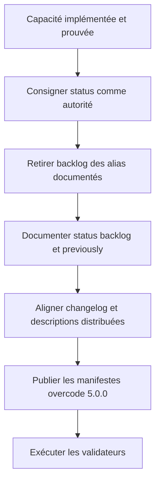
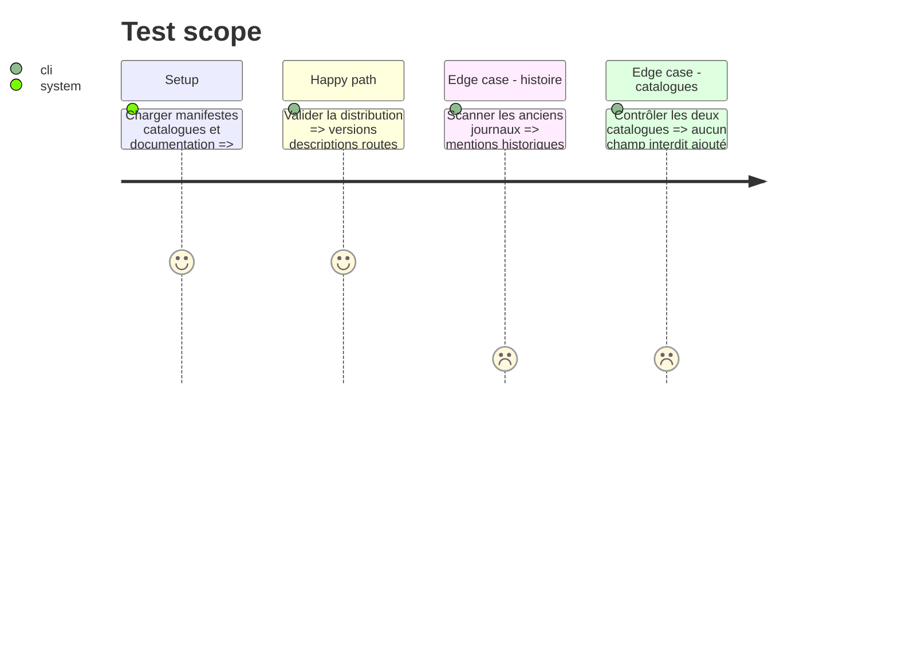

# Instruction: Documenter et distribuer la nouvelle autorité

## Architecture projection

> Tree of the final files. ✅ create · ✏️ modify · ❌ delete

```txt
.
├── .claude-plugin/
│   └── marketplace.json                                      ✏️ overcode 5.0.0 et description publique
├── aidd_docs/
│   └── internal/
│       └── decisions/
│           └── 012-status-owns-backlog.md                   ✅ autorité, compatibilité et sous-titres générés
└── plugins/
    └── overcode/
        ├── .claude-plugin/
        │   └── plugin.json                                  ✏️ version majeure et description
        ├── .codex-plugin/
        │   └── plugin.json                                  ✏️ version majeure, cachebuster et description
        ├── CHANGELOG.md                                         ✏️ Added, Changed et Removed
        ├── README.md                                            ✏️ dix alias et quatrième action status
        └── docs/
            ├── aliases.md                                       ✏️ retrait backlog et options de previously
            └── workflow.md                                      ✏️ route status backlog
```

## User Journey



## Test Scope



## Tasks to do

### `1)` Aligner la documentation et consigner la décision

> La nouvelle autorité doit être lisible sans connaître l'historique de l'alias supprimé.

1. Retirer la ligne et la section `backlog` de `docs/aliases.md`, documenter les options de `previously` et corriger le compte d'alias de onze à dix dans le README.
2. Ajouter `status backlog`, ses deux options milestone et le rendu adaptatif dans `docs/workflow.md` et dans la présentation de `status` du README.
3. Créer DEC-012 : `status` possède le backlog, `previously` ne fait que le chaîner, l'ancien alias est supprimé et les sous-titres réservés étendent la borne de DEC-011 sans réécrire cette archive.
4. Nommer dans DEC-012 les limites nouvelles de reconnaissance, l'identité provider des groupes et la compatibilité des blocs plats.
5. Laisser intactes les mentions historiques `alias backlog` des anciennes entrées de changelog et des rapports datés.

### `2)` Distribuer la rupture comme `overcode` 5.0.0

> Le manifeste, les catalogues et le changelog doivent annoncer la même interface.

1. Créer la section datée `## [5.0.0] — 2026-08-27` sous `Unreleased`, avec les capacités milestone, le branchement `previously`, le déplacement vers `status` et la suppression de l'alias classés sous les rubriques Keep a Changelog adaptées.
2. Passer le manifeste Claude à `5.0.0`, le manifeste Codex à `5.0.0+codex.20260827` selon la convention de cachebuster, puis synchroniser la version sémantique et la description dans le catalogue Claude.
3. Retirer `backlog` de la liste des chaînes d'alias dans les trois descriptions distribuées et y rendre visible la synchronisation via `status`.
4. Ne pas ajouter de version ni de description à `.agents/plugins/marketplace.json`, qui n'en porte volontairement aucune, et ne pas modifier `index.json` pour un plugin existant.
5. Exécuter les gardes du dépôt, le validateur officiel des plugins et la vérification de cohérence des deux manifestes et des deux catalogues.

## Test acceptance criteria

| Task | Acceptance criteria |
| ---- | ------------------- |
| 1 | La documentation publique compte dix alias, route le backlog vers `status` et ne propose plus `/overcode:alias backlog`. |
| 1 | DEC-012 conserve DEC-011 comme antécédent et n'altère aucun journal historique. |
| 2 | Les manifestes Claude et Codex annoncent respectivement `5.0.0` et son cachebuster Codex, le catalogue Claude reprend `5.0.0`, et toutes leurs descriptions concordent. |
| 2 | Le changelog porte une section datée `5.0.0` correspondant aux manifestes, et `Unreleased` ne contient aucune de ces entrées déjà publiées. |
| 2 | `.agents/plugins/marketplace.json` et `index.json` restent conformes à leur schéma sans duplication de version ou de description. |
| 2 | Les gardes du dépôt et le validateur du plugin passent sans route, chemin d'action ou fixture backlog orpheline. |
