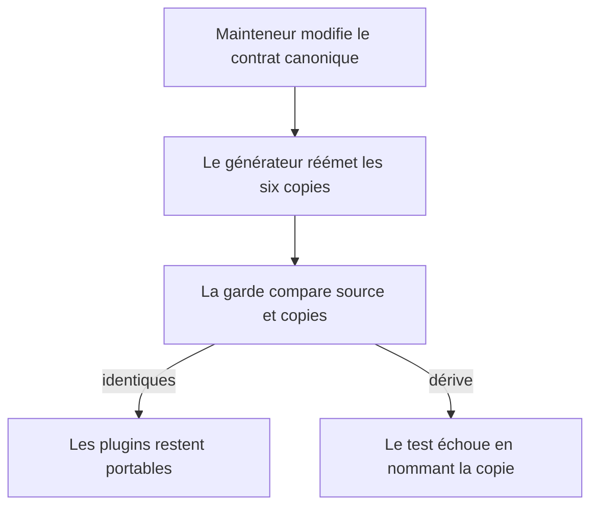
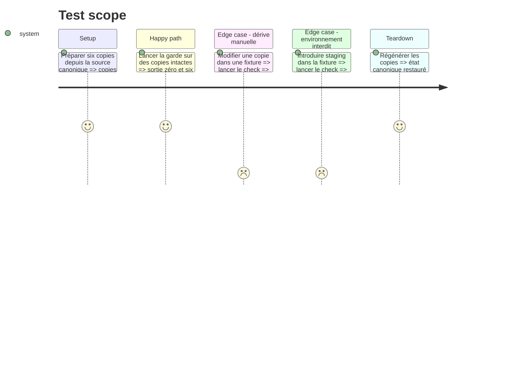

# Instruction: Établir le contrat commun portable

## Architecture projection

> Tree of the final files. ✅ create · ✏️ modify · ❌ delete

```txt
.
├── package.json                                      ✏️ ajouter la garde au test racine
├── tools
│   ├── sc-cd
│   │   ├── contract.md                               ✅ source unique du contrat
│   │   └── sync-contract.mjs                         ✅ générateur et mode check
│   └── eval
│       └── sc-cd.mjs                                 ✅ garde déterministe initiale
└── plugins
    ├── sc-css/references/cd-contract.md              ✅ copie portable générée
    ├── sc-js/references/cd-contract.md               ✅ copie portable générée
    ├── sc-php/references/cd-contract.md              ✅ copie portable générée
    ├── sc-python/references/cd-contract.md           ✅ copie portable générée
    ├── sc-rust/references/cd-contract.md             ✅ copie portable générée
    └── web-tiers/references/cd-contract.md            ✅ copie portable générée
```

## User Journey



## Test Scope



## Tasks to do

### `1)` Écrire le contrat canonique

> Fixer les invariants observables sans y mettre de logique propre à une stack.

1. Définir `local`, `server`, `automata`, les familles `deploy:*` et `pull:*`, les statuts de réconciliation et les confirmations.
2. Interdire staging, les secrets versionnés, la mutation distante implicite et les synchronisations dont le périmètre ou le sens n’est pas nommé.
3. Exiger qu’un automate appelle la commande projet déclarée et relaie son code de sortie.

### `2)` Générer les copies portables

> Permettre à chaque plugin installé isolément de lire le même contrat.

1. Écrire un générateur déterministe avec modes write et check.
2. Marquer chaque copie comme générée et nommer sa source de maintenance.
3. Émettre les six fichiers dans les `references/` propres aux plugins.

### `3)` Brancher la garde racine

> Rendre toute dérive visible localement et en CI.

1. Vérifier identité, présence des six copies, vocabulaire d’environnements et sens des commandes.
2. Ajouter la garde à `pnpm test` sans réseau ni dépendance externe.
3. Fournir une erreur actionnable par invariant rompu.

## Test acceptance criteria

| Task | Acceptance criteria |
| ---- | ------------------- |
| 1 | Le contrat ne connaît que local et production, impose une procédure unique et distingue les deux sens de synchronisation. |
| 2 | Deux générations successives sont identiques et les six copies correspondent exactement à la source. |
| 3 | Une copie modifiée ou une mention de staging fait échouer le test en nommant la cause ; l’état canonique passe dans `pnpm test`. |
