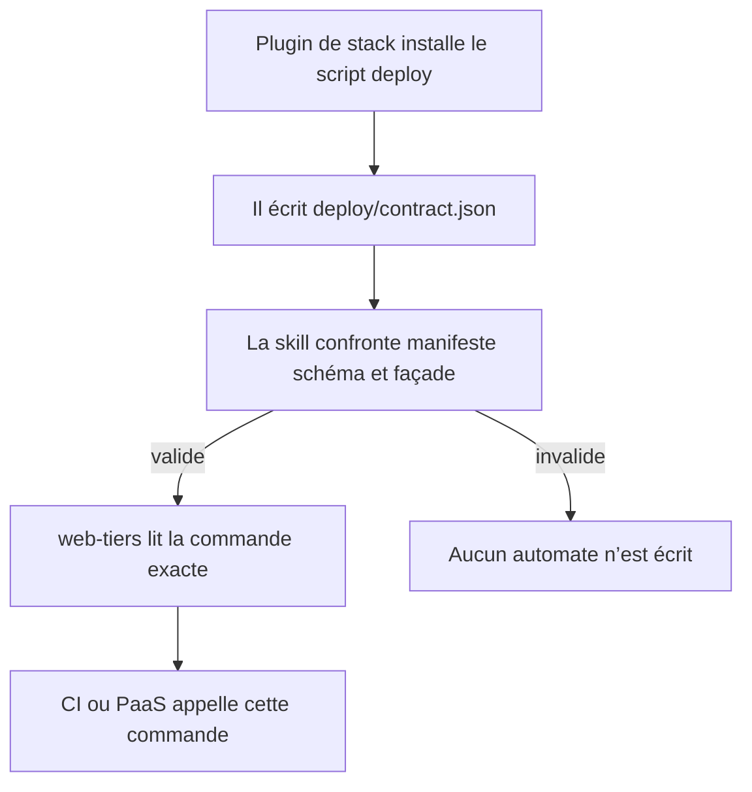
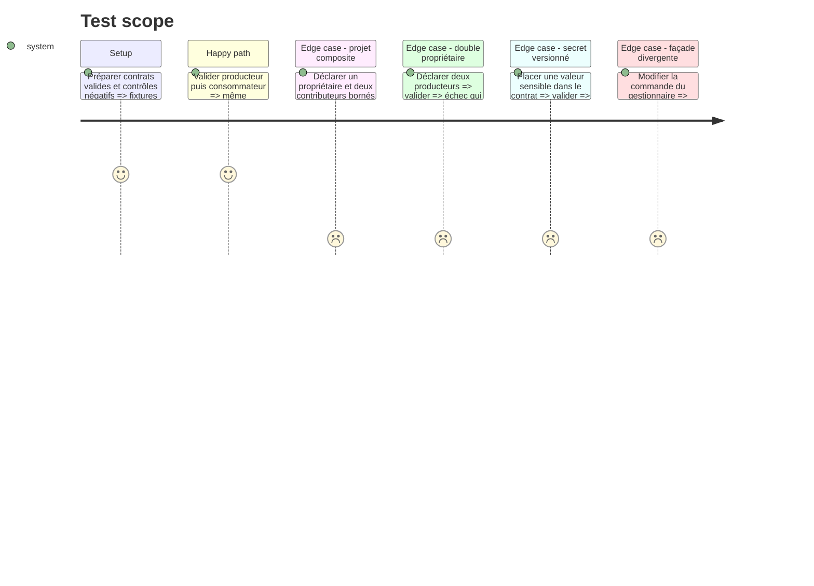

# Instruction: Établir le contrat projet entre producteurs et automates

## Architecture projection

> Tree of the final files. ✅ create · ✏️ modify · ❌ delete

```txt
tools
├── sc-cd
│   ├── project-contract.schema.json                  ✅ schéma canonique sans secret
│   ├── sync-contract.mjs                             ✏️ distribuer aussi le schéma projet
│   └── validate-project-contract.mjs                 ✅ oracle de test, non distribué
└── eval
    ├── sc-cd.mjs                                     ✏️ vérifier passage et propriété
    └── fixtures-sc-cd
        ├── valid-language-owner/deploy/contract.json ✅ producteur et commande uniques
        ├── valid-composite/deploy/contract.json      ✅ propriétaire racine et contributeurs bornés
        ├── valid-automata/deploy/contract.json       ✅ même commande consommée par CI
        ├── invalid-two-owners/deploy/contract.json   ✅ contrôle négatif de propriété
        └── invalid-secret/deploy/contract.json       ✅ contrôle négatif de secret
plugins
├── sc-css/references/cd-project-contract.schema.json    ✅ copie générée portable
├── sc-js/references/cd-project-contract.schema.json     ✅ copie générée portable
├── sc-php/references/cd-project-contract.schema.json    ✅ copie générée portable
├── sc-python/references/cd-project-contract.schema.json ✅ copie générée portable
├── sc-rust/references/cd-project-contract.schema.json   ✅ copie générée portable
└── web-tiers/references/cd-project-contract.schema.json  ✅ copie générée portable
```

## User Journey



## Test Scope



## Tasks to do

### `1)` Définir le contrat projet

> Donner aux plugins un point de passage commun sans déplacer la logique de déploiement.

1. Définir `deploy/contract.json` avec version, propriétaire racine, gestionnaire, commande, répertoire, opérations, cible, identité de source et politique de déclenchement.
2. Déclarer pour chaque opération ses préconditions, preuve après livraison et voie de récupération ; une capacité absente reste absente.
3. Autoriser des contributeurs bornés par composant ou workspace sans leur donner une seconde façade racine.
4. Interdire les valeurs de secrets : seuls leurs noms et leur source attendue peuvent être déclarés.

### `2)` Rendre le contrat portable et vérifiable

> Permettre à chaque plugin de produire ou consommer la même forme installé isolément.

1. Ajouter le schéma canonique au générateur de la phase 1 et émettre une copie dans chaque plugin.
2. Écrire sous `tools/` un oracle sans dépendance pour les fixtures du marketplace ; ne pas le copier dans les plugins ni ajouter Node aux projets non-JS.
3. Faire confronter par chaque skill le contrat au schéma portable et à la façade native, dont le script réalise ses propres préflight avant toute mutation.
4. Refuser version inconnue, double propriétaire, commande absente, secret versionné et opération sans sens ou preuve.

### `3)` Prouver le passage langage vers automate

> Empêcher `web-tiers` de redétecter ce que le plugin de stack a déjà décidé.

1. Fixer la propriété : un plugin d’application possède la façade racine ; les autres langages et CSS contribuent par scope ; tiers possède fournisseurs et enveloppes CI sans posséder la procédure.
2. Prouver sur fixtures que le consommateur reprend textuellement commande, répertoire et opérations du producteur.
3. Encoder `manual` comme défaut et n’accepter `push` que lorsqu’il est explicitement déclaré dans le contrat projet.
4. Si `web-tiers` n’est pas disponible, arrêter `automata` en nommant le prérequis ; ne jamais installer un plugin ni générer un fallback concurrent implicitement.

## Test acceptance criteria

| Task | Acceptance criteria |
| ---- | ------------------- |
| 1 | Un contrat valide décrit une unique façade racine, borne ses contributeurs, ne contient aucun secret et rend source, preuve et récupération observables par opération. |
| 2 | Les six copies sont identiques au schéma canonique ; l’oracle rejette les fixtures divergentes sans devenir une dépendance runtime ; chaque façade native porte ses préflight. |
| 3 | Les fixtures composite et automata conservent une façade racine et reprennent sa commande ; double propriétaire et déclencheur implicite échouent ; l’absence de `web-tiers` s’arrête sans écriture. |
