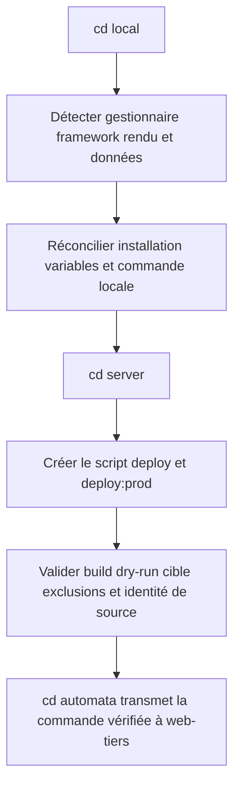
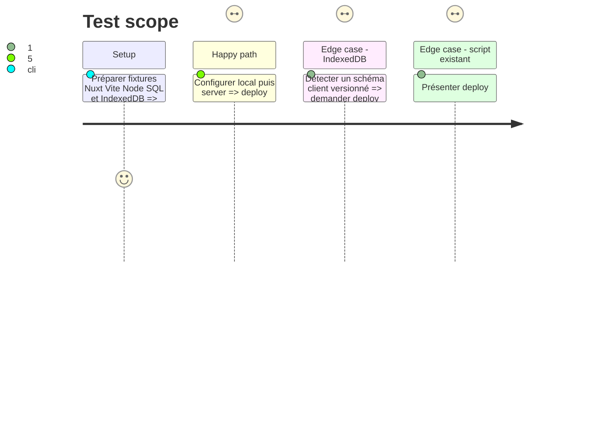

# Instruction: Décliner cd pour JavaScript

## Architecture projection

> Tree of the final files. ✅ create · ✏️ modify · ❌ delete

```txt
plugins/sc-js/skills/cd
├── SKILL.md                                          ✅ routeur et stratégies détectées
├── actions
│   ├── 01-local.md                                   ✅ runtime et commandes locales
│   ├── 02-server.md                                  ✅ build, procédure et contrat projet
│   └── 03-automata.md                                ✅ validation puis remise à web-tiers
├── references
│   ├── command-facade.md                             ✅ scripts pnpm et réconciliation package.json
│   ├── frameworks.md                                 ✅ Nuxt, Vue, Vite, SvelteKit, Astro, Node
│   └── data-layers.md                                ✅ SQL, ORM et IndexedDB
└── evals
    ├── scenarios.json                                ✅ routes spécialisées
    └── delivery-scenarios.md                         ✅ cas de comportement jugeables
```

## User Journey



## Test Scope



## Tasks to do

### `1)` Réutiliser la détection JavaScript

> Étendre les signaux de `sniff` sans maintenir une seconde taxonomie.

1. Lire `package.json`, lockfile, framework, mode de rendu, adaptateur, ORM SQL et usages IndexedDB.
2. Consommer la classification de `sniff` ou sa référence canonique plutôt que recopier les tables.
3. Déterminer si JavaScript possède la façade racine ou contribue à un projet composite déjà possédé, puis rendre toute combinaison non couverte explicite avant écriture.

### `2)` Installer local et la façade pnpm

> Laisser un projet cloné démarrable avec une procédure connue.

1. Réconcilier dépendances, variables exemples, services SQL éventuels et commandes de lancement.
2. Créer un script de déploiement possédé par le projet et exposer `deploy:prod`, plus `deploy:db` ou `deploy:sync` seulement si une stratégie existe.
3. Écrire `deploy/contract.json`, le valider contre `package.json` et préserver les scripts existants en demandant arbitrage si leur sémantique contredit le contrat.

### `3)` Spécialiser framework et données

> Adapter build, artefacts, migrations et exclusions au projet réel.

1. Distinguer sortie statique, serveur Node et framework SSR.
2. Pour SQL, séparer migrations, schéma et données ; ne jamais assimiler migration et copie de contenu.
3. Pour IndexedDB, livrer code de version et migration cliente sans extraire ni pousser les données privées du navigateur.
4. Déclarer l’identité de source, la vérification après livraison et la récupération propres à la stratégie retenue.

## Test acceptance criteria

| Task | Acceptance criteria |
| ---- | ------------------- |
| 1 | Chaque fixture reçoit une stratégie correspondant aux signaux de `sniff`, comme propriétaire ou contributeur borné, ou un gap sans écriture. |
| 2 | `pnpm deploy:prod` appelle un seul script, correspond au contrat projet, reste identique après une seconde réconciliation et ne remplace pas un script utilisateur silencieusement. |
| 3 | Les cas SQL distinguent migrations et données ; IndexedDB ne produit aucun transfert de données navigateur ; toute livraison possède preuve et récupération déclarées. |
