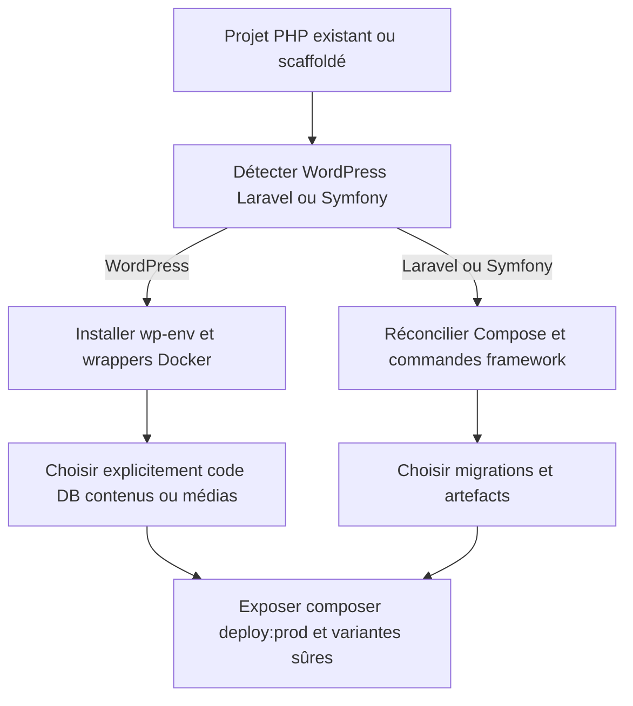
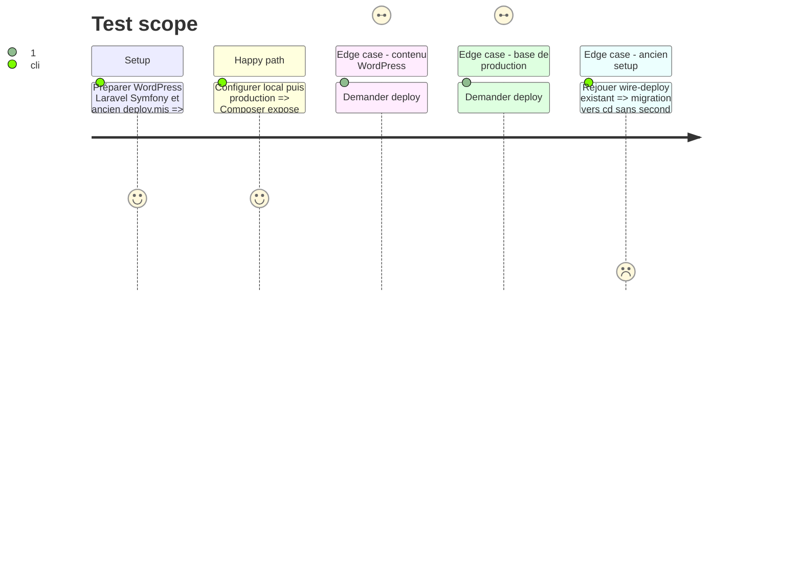

# Instruction: Décliner cd pour PHP et WordPress

## Architecture projection

> Tree of the final files. ✅ create · ✏️ modify · ❌ delete

```txt
plugins/sc-php/skills
├── cd
│   ├── SKILL.md                                      ✅ stratégies WordPress Laravel Symfony
│   ├── actions/01-local.md                           ✅ wp-env ou Compose selon framework
│   ├── actions/02-server.md                          ✅ façade Composer, contrat et cible SSH
│   ├── actions/03-automata.md                        ✅ validation puis remise à sc-tiers
│   ├── references
│   │   ├── command-facade.md                         ✅ scripts Composer et wrappers requis
│   │   ├── php-frameworks.md                         ✅ stratégies PHP couvertes
│   │   └── wordpress-sync.md                         ✅ code DB contenus médias et sens
│   └── evals
│       ├── scenarios.json                            ✅ routes et refus
│       └── delivery-scenarios.md                     ✅ preuves WordPress Laravel Symfony
└── setup
    ├── SKILL.md                                      ✏️ rediriger la livraison vers cd
    ├── actions/05-wire-deploy.md                     ✏️ compatibilité sans second producteur
    ├── actions/06-verify.md                          ✏️ vérifier la nouvelle façade
    └── references/deploy-pipeline.md                 ✏️ documenter la migration de l’ancien pipeline
```

## User Journey



## Test Scope



## Tasks to do

### `1)` Unifier setup et cd

> Absorber l’expérience du pipeline PHP existant sans casser les projets déjà scaffoldés.

1. Faire de `cd` l’autorité de livraison pour WordPress, Laravel et Symfony.
2. Transformer `setup wire-deploy` en route de compatibilité vers `cd server`.
3. Détecter et migrer `scripts/deploy.mjs` et ses cibles sans écraser les personnalisations ; borner les éventuelles contributions JS et CSS sous l’unique façade PHP du projet WordPress.

### `2)` Rendre WordPress local reproductible

> Conserver `wp-env`, Docker et le garde de nom Compose déjà éprouvés.

1. Réutiliser les références `wp-env`, wrappers WP-CLI et pièges de `setup`.
2. Vérifier installation, thème ou plugin actif, URL locale et accès CLI.
3. Ne jamais lancer reset, destroy ou import par effet de bord d’une réconciliation.

### `3)` Séparer les surfaces de synchronisation

> Empêcher qu’un déploiement de code remplace toute la production.

1. Définir les périmètres code, configuration, migrations, base, contenus et médias.
2. Exiger sens, sauvegarde, dry-run et confirmation selon le risque ; `deploy:*` reste local vers production.
3. Exposer seulement les commandes dont le projet possède une stratégie jugeable.
4. Déclarer dans le contrat projet l’identité de source, le contrôle après livraison et la récupération de chaque périmètre.

## Test acceptance criteria

| Task | Acceptance criteria |
| ---- | ------------------- |
| 1 | Un projet issu de l’ancien `wire-deploy` aboutit à une seule procédure, conserve ses cibles et personnalisations, et borne ses contributions JS ou CSS sans second propriétaire. |
| 2 | WordPress démarre via le wrapper wp-env attendu et aucune commande destructive n’est appelée pendant setup ou vérification. |
| 3 | `deploy:prod` peut rester code-only ; `deploy:db` et `deploy:sync` nomment leur périmètre, sauvegardent, confirment, prouvent le résultat et déclarent une récupération avant toute mutation distante. |
