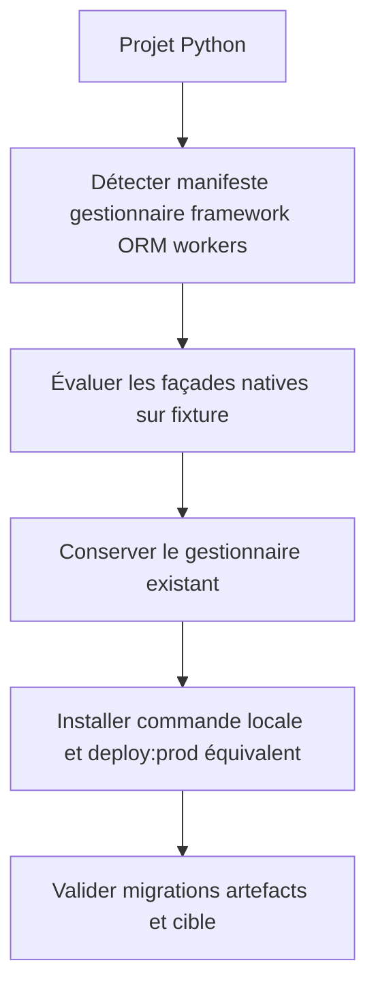
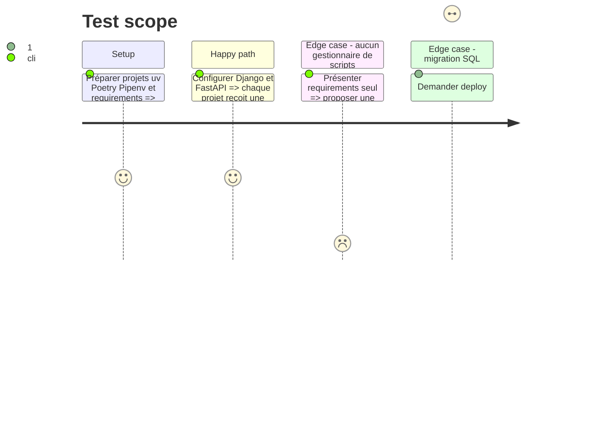

# Instruction: Décliner cd pour Python

## Architecture projection

> Tree of the final files. ✅ create · ✏️ modify · ❌ delete

```txt
plugins/sc-python/skills/cd
├── SKILL.md                                          ✅ stratégies Python couvertes
├── actions/01-local.md                               ✅ environnement et services locaux
├── actions/02-server.md                              ✅ build migrations contrat et production
├── actions/03-automata.md                            ✅ validation puis remise à web-tiers
├── references
│   ├── command-facade.md                             ✅ arbitrage uv et gestionnaires existants
│   ├── python-frameworks.md                          ✅ Django FastAPI Flask et workers détectés
│   └── sql-delivery.md                               ✅ ORM migrations sauvegardes données
└── evals
    ├── scenarios.json                                ✅ routes et refus
    └── delivery-scenarios.md                         ✅ fixtures et décisions mesurées
```

## User Journey



## Test Scope



## Tasks to do

### `1)` Arbitrer la façade Python par preuve

> Choisir une convention native sans imposer uv à tout le parc.

1. Tester sur fixtures l’exécution d’un script de déploiement avec uv et les gestionnaires déjà détectés par `sniff`.
2. Définir un ordre de préférence qui conserve le gestionnaire et le lockfile existants.
3. Pour un projet sans façade adaptée, demander avant d’ajouter un outil au lieu de convertir silencieusement.

### `2)` Couvrir runtimes et processus

> Installer un local représentatif du serveur réel.

1. Réutiliser la détection Django, FastAPI, Flask, Celery et serveurs ASGI ou WSGI.
2. Réconcilier environnement, variables exemples, service SQL et commandes de lancement.
3. Nommer comme gap toute combinaison non éprouvée.

### `3)` Gouverner SQL et production

> Séparer artefact, migration et transfert de données.

1. Mapper Django ORM et SQLAlchemy vers leurs commandes de migration détectables.
2. Imposer sauvegarde et confirmation pour tout transfert de données vers production.
3. Vérifier que l’automate peut appeler la même façade sans shell interactif caché.
4. Inscrire source, preuve après livraison et récupération dans le contrat projet validé.

## Test acceptance criteria

| Task | Acceptance criteria |
| ---- | ------------------- |
| 1 | Chaque gestionnaire couvert exécute réellement le script sur fixture ; aucun projet existant n’est converti sans accord. |
| 2 | Les fixtures Django et FastAPI démarrent par une commande documentée et les stacks non couvertes restent sans écriture. |
| 3 | La procédure distingue build, migration et données ; le contrat rend source, preuve et récupération observables ; la CI appelle textuellement la commande du développeur. |
